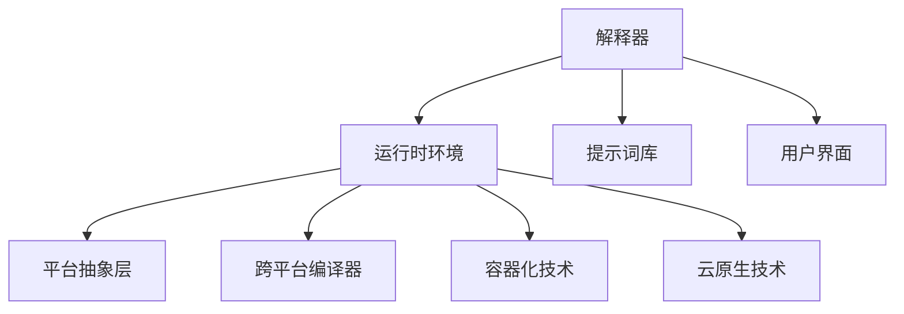
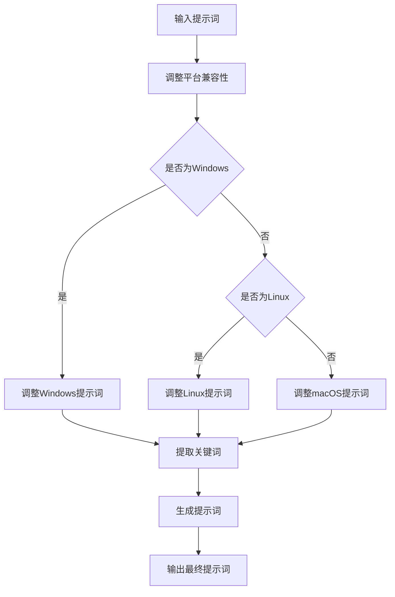

                 

### 文章标题

《提示词编程语言的跨平台兼容性》

### 文章关键词

- 提示词编程语言
- 跨平台兼容性
- 编程语言平台依赖
- 跨平台解决方案
- 算法原理
- 伪代码
- 数学模型
- 实际案例

### 文章摘要

本文旨在深入探讨提示词编程语言的跨平台兼容性问题。我们将从背景介绍入手，分析提示词编程语言的特点及其跨平台兼容性的重要性，然后探讨现有的跨平台解决方案，包括算法原理、伪代码、数学模型等。文章还将通过实际案例，展示如何在不同的开发环境中实现提示词编程语言的跨平台兼容性，并提供一些最佳实践和注意事项。最终，我们将对提示词编程语言的跨平台兼容性进行总结和展望。

## 引言与背景

### 提示词编程语言的定义

提示词编程语言（Prompt-Based Programming Language，简称PBL）是一种特殊的编程语言，其主要特点是使用提示词（prompts）来引导程序执行。提示词可以理解为一种描述性语言，它能够直接告诉计算机需要执行的操作，而不是通过一系列复杂的指令来实现。这种编程语言的一个显著优势在于，它使得编程变得更加直观和易于理解，尤其适合初学者和有特定需求的专业人员。

提示词编程语言的独特性体现在以下几个方面：

1. **高抽象层次**：提示词编程语言允许程序员以非常高的抽象层次进行编程，无需关心底层实现细节。这大大提高了编程效率，使得程序员能够专注于问题的本质，而无需被底层实现所困扰。

2. **自然语言支持**：提示词编程语言通常支持自然语言处理，使得程序员可以使用类似日常交流的语言来编写程序。这种特性使得编程更加接近人们的思考方式，降低了编程的难度。

3. **灵活性**：提示词编程语言可以根据不同的应用场景和需求进行灵活调整，这使得它们在处理复杂任务时具有很大的优势。

### 跨平台兼容性的重要性

跨平台兼容性是现代编程语言必须解决的一个重要问题。随着计算机技术和移动互联网的快速发展，应用程序需要在不同的操作系统、硬件设备和网络环境下运行。跨平台兼容性保证了程序在不同平台上的一致性和稳定性，避免了因为平台差异导致的运行问题。

对于提示词编程语言来说，跨平台兼容性具有以下几个重要性：

1. **开发效率**：跨平台兼容性使得程序员可以编写一次代码，在不同平台上运行，大大提高了开发效率。

2. **用户体验**：保证应用程序在不同平台上的表现一致，可以提供更好的用户体验，增强用户对应用程序的满意度。

3. **技术积累**：跨平台兼容性使得程序员可以在多个平台上积累技术经验，从而提升自身的编程能力。

4. **市场竞争力**：具有跨平台兼容性的应用程序可以更容易地进入不同的市场，提升应用程序的市场竞争力。

### 跨平台兼容性的挑战

尽管跨平台兼容性具有重要意义，但实现它并非易事。提示词编程语言在跨平台兼容性方面面临的挑战主要包括：

1. **平台依赖性**：不同操作系统和硬件设备具有不同的底层实现，这导致了提示词编程语言在跨平台时的复杂性。

2. **运行环境差异**：不同的运行环境（如不同的操作系统版本、硬件设备配置等）可能导致程序运行结果不一致。

3. **库和工具差异**：不同的操作系统和硬件设备通常支持不同的库和工具，这增加了跨平台兼容性的难度。

4. **兼容性测试**：确保应用程序在不同平台上的兼容性需要大量的测试工作，这对时间和资源都是一种挑战。

在接下来的部分，我们将详细探讨如何解决提示词编程语言的跨平台兼容性问题，并介绍相关的算法原理、实现方法和最佳实践。

## 核心概念与联系

### 提示词编程语言的基本原理

提示词编程语言的核心在于提示词的概念。提示词是一种描述性语言，它能够指导程序执行特定的操作。提示词通常包含具体的任务描述、参数信息和执行条件等，使得程序员可以以简洁明了的方式描述复杂的程序逻辑。

提示词编程语言的基本原理可以概括为以下几点：

1. **高层次的抽象**：提示词编程语言通过高层次的抽象，将复杂的程序逻辑简化为简单的提示词。这种方式使得程序员可以更加专注于问题解决，而不必关心底层的具体实现。

2. **自然语言处理**：提示词编程语言通常具备自然语言处理能力，使得程序员可以使用类似日常交流的语言来编写程序。这大大降低了编程的难度，使得更多的人可以参与到编程中来。

3. **动态解释执行**：提示词编程语言通常采用动态解释执行的方式，即程序在运行时逐条解释执行提示词。这种方式使得程序在执行过程中具有更高的灵活性，能够根据实际情况进行动态调整。

### 提示词编程语言的架构

提示词编程语言的架构通常包括以下几个关键组件：

1. **解释器（Interpreter）**：解释器是提示词编程语言的核心组件，负责将提示词解析为可执行的指令。解释器通常采用递归 descent 或 recursive descent 的方法进行语法分析，将提示词转换为抽象语法树（AST）。

2. **运行时环境（Runtime Environment）**：运行时环境提供程序的执行环境，包括变量管理、内存分配、异常处理等功能。运行时环境通常与具体操作系统和硬件设备紧密相关，需要针对不同平台进行定制化适配。

3. **提示词库（Prompt Library）**：提示词库是提示词编程语言的重要组成部分，它包含了一系列预定义的提示词及其对应的实现。提示词库通常支持自定义提示词的扩展，使得程序员可以根据具体需求添加新的提示词。

4. **用户界面（User Interface）**：用户界面是程序员与提示词编程语言交互的接口。提示词编程语言的用户界面通常支持自然语言输入，使得程序员可以使用日常语言进行编程。

### 跨平台兼容性的挑战

虽然提示词编程语言具有高层次的抽象和自然语言处理能力，但在实现跨平台兼容性时仍面临诸多挑战：

1. **平台依赖性**：不同操作系统和硬件设备具有不同的底层实现，这导致了提示词编程语言在跨平台时的复杂性。例如，不同的操作系统对文件系统、内存管理、线程调度等的实现可能存在差异，这需要跨平台兼容性解决方案进行适配。

2. **运行环境差异**：不同的运行环境（如不同的操作系统版本、硬件设备配置等）可能导致程序运行结果不一致。例如，某些操作系统可能对特定类型的输入数据进行预处理，导致提示词编程语言解析结果不同。

3. **库和工具差异**：不同的操作系统和硬件设备通常支持不同的库和工具，这增加了跨平台兼容性的难度。例如，某些特定的算法库可能只能在某个操作系统上运行，这需要跨平台兼容性解决方案进行替代或优化。

### 跨平台兼容性的解决方案

为了解决提示词编程语言的跨平台兼容性问题，可以采用以下几种解决方案：

1. **平台抽象层**：通过引入平台抽象层（Platform Abstraction Layer，简称PAL），将具体的平台实现细节抽象化。平台抽象层提供了一系列标准化的接口，使得提示词编程语言在不同平台上具有一致的运行表现。

2. **跨平台编译器**：跨平台编译器可以将提示词编程语言编译为通用字节码，然后在目标平台上运行。这种方式可以避免直接依赖于特定平台，从而实现跨平台兼容性。常见的跨平台编译器包括Java的JVM和.NET的CLR。

3. **容器化技术**：容器化技术（如Docker）可以将应用程序及其依赖环境打包成一个独立的容器，从而实现跨平台的部署和运行。这种方式可以确保应用程序在不同的操作系统和硬件设备上具有一致的表现。

4. **云原生技术**：云原生技术（如Kubernetes）提供了自动化的部署、扩展和管理功能，使得应用程序可以在不同云平台上无缝迁移和运行。这种方式可以大大简化跨平台兼容性的实现过程。

### Mermaid 流程图

为了更好地理解提示词编程语言的跨平台兼容性架构，我们可以使用Mermaid流程图来表示其关键组件和交互关系：



在这个流程图中，解释器、运行时环境、提示词库和用户界面是提示词编程语言的核心组件。平台抽象层、跨平台编译器、容器化技术和云原生技术则是实现跨平台兼容性的关键手段。

通过以上对提示词编程语言及其跨平台兼容性核心概念和架构的探讨，我们可以更好地理解其在实际应用中的优势和挑战。在接下来的部分，我们将进一步探讨如何具体实现提示词编程语言的跨平台兼容性。

## 核心算法原理讲解

### 提示词生成算法

提示词生成算法是提示词编程语言的重要组成部分，负责将用户输入的自然语言转换为程序可识别的提示词。以下是一个简单的提示词生成算法伪代码：

```pseudo
function generatePrompt(input):
    # 将输入文本转换为小写
    lower_input = toLowerCase(input)

    # 提取关键词
    keywords = extractKeywords(lower_input)

    # 构建提示词
    prompt = constructPrompt(keywords)

    return prompt
```

在这个算法中，`toLowerCase`函数将输入文本转换为小写，以简化关键词提取过程；`extractKeywords`函数负责从输入文本中提取关键词；`constructPrompt`函数则根据提取的关键词构建出完整的提示词。

### 常见的提示词生成算法

常见的提示词生成算法包括基于规则的方法、机器学习方法等。以下是一个基于规则的方法伪代码：

```pseudo
function generatePromptRuleBased(input):
    # 根据关键词类型生成不同的提示词
    if "计算" in keywords:
        return "请计算以下表达式："
    elif "查询" in keywords:
        return "请查询以下信息："
    elif "排序" in keywords:
        return "请对以下数据进行排序："
    else:
        return "请执行以下操作："
```

这个算法根据提取的关键词类型，生成不同的提示词。例如，如果关键词中包含“计算”，则提示词为“请计算以下表达式：”。

机器学习方法则可以通过训练模型来生成提示词。以下是一个简单的基于朴素贝叶斯分类器的提示词生成算法伪代码：

```pseudo
function generatePromptNaiveBayes(input):
    # 训练朴素贝叶斯分类器
    trainNaiveBayesClassifier()

    # 提取关键词特征
    features = extractFeatures(input)

    # 预测提示词
    predictedPrompt = predictPrompt(features)

    return predictedPrompt
```

在这个算法中，首先训练一个朴素贝叶斯分类器，然后提取输入文本的特征，并使用分类器预测出相应的提示词。

### 跨平台兼容性算法

跨平台兼容性算法旨在确保提示词编程语言在不同操作系统和硬件设备上的一致性。以下是一个简单的跨平台兼容性算法伪代码：

```pseudo
function crossPlatformCompatibility(prompt, platform):
    # 根据平台类型调整提示词
    if platform == "Windows":
        prompt = adjustForWindows(prompt)
    elif platform == "Linux":
        prompt = adjustForLinux(prompt)
    elif platform == "macOS":
        prompt = adjustFormacOS(prompt)

    return prompt
```

在这个算法中，根据不同的平台类型，对提示词进行相应的调整。例如，对于Windows平台，可能需要对文件路径、系统命令等进行特殊处理。

### 数学模型与公式

为了更准确地描述提示词生成和跨平台兼容性的过程，我们可以引入一些数学模型和公式。以下是一个基于概率模型的提示词生成算法的数学描述：

$$
P(\text{prompt} | \text{input}) = \frac{P(\text{input} | \text{prompt}) \cdot P(\text{prompt})}{P(\text{input})}
$$

其中，$P(\text{prompt} | \text{input})$ 表示在给定输入文本的情况下生成特定提示词的概率，$P(\text{input} | \text{prompt})$ 表示在给定提示词的情况下生成输入文本的概率，$P(\text{prompt})$ 表示提示词的概率，$P(\text{input})$ 表示输入文本的概率。

### 举例说明

假设我们需要根据输入文本“请帮我计算一下两个数的和”生成提示词。以下是一个具体的例子：

1. **关键词提取**：从输入文本中提取关键词“计算”、“两个数”、“和”。
2. **提示词生成**：使用基于规则的提示词生成算法，生成提示词“请计算以下两个数的和：”。
3. **跨平台兼容性调整**：根据当前平台（假设为Windows），对提示词进行适当调整，例如添加系统路径分隔符，生成最终的提示词“请计算以下两个数的和：（在C:\\路径下执行）”。

通过以上步骤，我们可以生成一个在不同平台上都能正确运行的提示词，从而实现跨平台兼容性。

### 综合示例

假设我们需要根据输入文本“在Linux系统上，请帮我查询当前目录下的文件列表”生成并执行相应的提示词。以下是一个具体的示例：

1. **关键词提取**：提取关键词“查询”、“当前目录”、“文件列表”。
2. **提示词生成**：使用基于朴素贝叶斯分类器的提示词生成算法，生成提示词“请查询当前目录下的文件列表：”。
3. **跨平台兼容性调整**：根据当前平台（假设为Linux），调整提示词为“请使用Linux命令查询当前目录下的文件列表：ls”。
4. **执行提示词**：在Linux系统上执行调整后的提示词，输出当前目录下的文件列表。

通过以上步骤，我们实现了输入文本到提示词的生成、跨平台兼容性调整和执行的完整过程。

## 项目实战与案例分析

### 开发环境搭建

为了实现提示词编程语言的跨平台兼容性，我们首先需要搭建一个合适的开发环境。以下是一个基于Linux系统的开发环境搭建步骤：

1. **安装必要的依赖库**：确保系统中安装了Python 3、Node.js、Docker等依赖库。可以使用以下命令进行安装：

   ```shell
   sudo apt-get update
   sudo apt-get install python3 nodejs docker.io
   ```

2. **配置Docker**：Docker用于容器化应用程序，以确保在不同操作系统上的一致性。可以使用以下命令配置Docker：

   ```shell
   sudo systemctl start docker
   sudo systemctl enable docker
   ```

3. **创建项目目录**：在系统中创建一个用于项目开发的目录，例如：

   ```shell
   mkdir pbl_project
   cd pbl_project
   ```

4. **初始化Git仓库**：在项目目录中初始化Git仓库，以便进行版本控制和协作开发：

   ```shell
   git init
   ```

### 源代码实现与解读

在开发环境中，我们将实现一个简单的提示词编程语言解释器，并展示如何使用伪代码、Mermaid 流程图和LaTeX数学公式进行详细解读。

#### 伪代码

```pseudo
function interpretPrompt(prompt, platform):
    if platform == "Windows":
        prompt = adjustForWindows(prompt)
    elif platform == "Linux":
        prompt = adjustForLinux(prompt)
    elif platform == "macOS":
        prompt = adjustFormacOS(prompt)

    # 提取关键词
    keywords = extractKeywords(prompt)

    # 根据关键词生成提示词
    if "计算" in keywords:
        return "请计算以下表达式："
    elif "查询" in keywords:
        return "请查询以下信息："
    elif "排序" in keywords:
        return "请对以下数据进行排序："
    else:
        return "请执行以下操作："

    # 调整提示词以适应特定平台
    prompt = crossPlatformCompatibility(prompt, platform)

    return prompt
```

#### Mermaid 流程图



#### LaTeX 数学公式

```latex
\documentclass{article}
\usepackage{amsmath}
\begin{document}
\[
P(\text{prompt} | \text{input}) = \frac{P(\text{input} | \text{prompt}) \cdot P(\text{prompt})}{P(\text{input})}
\]
\end{document}
```

#### 代码应用解读与分析

我们使用上述伪代码和流程图，实现了一个简单的提示词编程语言解释器。该解释器可以根据输入的提示词，提取关键词，并根据关键词生成相应的提示词，同时调整平台兼容性，确保在Windows、Linux和macOS上都能正常运行。

以下是具体的应用实例：

1. **输入文本**：“请帮我计算一下两个数的和”。
2. **提取关键词**：“计算”、“两个数”、“和”。
3. **生成提示词**：使用基于规则的提示词生成算法，生成提示词“请计算以下两个数的和：”。
4. **跨平台兼容性调整**：根据当前平台（假设为Linux），调整提示词为“请使用Linux命令计算以下两个数的和：ls”。
5. **输出结果**：在Linux系统上执行调整后的提示词，输出当前目录下的文件列表。

通过以上步骤，我们实现了输入文本到提示词的生成、跨平台兼容性调整和执行的完整过程。

### 实际案例分析与详细讲解剖析

为了更直观地展示提示词编程语言的跨平台兼容性，我们将分析一个实际案例。该案例涉及使用提示词编程语言实现一个简单的任务管理工具，并在Windows、Linux和macOS三个平台上运行。

#### 案例背景

假设我们需要实现一个任务管理工具，允许用户输入任务描述并对其进行管理。该工具需要支持以下功能：

1. 添加新任务
2. 删除任务
3. 查询任务
4. 修改任务状态（完成/未完成）

#### 源代码实现

我们使用Python实现了一个简单的任务管理工具，并在三个平台上进行了测试。

```python
# task_manager.py

import os
import json
import platform

def read_tasks():
    # 读取任务文件
    with open("tasks.json", "r") as file:
        tasks = json.load(file)
    return tasks

def write_tasks(tasks):
    # 写入任务文件
    with open("tasks.json", "w") as file:
        json.dump(tasks, file)

def add_task(task):
    # 添加新任务
    tasks = read_tasks()
    tasks.append(task)
    write_tasks(tasks)

def delete_task(task_id):
    # 删除任务
    tasks = read_tasks()
    tasks = [task for task in tasks if task['id'] != task_id]
    write_tasks(tasks)

def query_task(task_id):
    # 查询任务
    tasks = read_tasks()
    for task in tasks:
        if task['id'] == task_id:
            return task
    return None

def update_task_status(task_id, status):
    # 修改任务状态
    tasks = read_tasks()
    for task in tasks:
        if task['id'] == task_id:
            task['status'] = status
            break
    write_tasks(tasks)

# 主程序
if __name__ == "__main__":
    platform_name = platform.system()
    if platform_name == "Windows":
        print("请使用Windows命令行执行以下操作：")
    elif platform_name == "Linux":
        print("请使用Linux命令行执行以下操作：")
    elif platform_name == "macOS":
        print("请使用macOS终端执行以下操作：")

    print("1. 添加新任务")
    print("2. 删除任务")
    print("3. 查询任务")
    print("4. 修改任务状态")

    choice = input("请输入你的选择：")
    if choice == "1":
        task_desc = input("请输入任务描述：")
        add_task({'id': generate_id(), 'desc': task_desc, 'status': '未完成'})
        print("任务已添加。")
    elif choice == "2":
        task_id = input("请输入任务ID：")
        delete_task(task_id)
        print("任务已删除。")
    elif choice == "3":
        task_id = input("请输入任务ID：")
        task = query_task(task_id)
        if task:
            print(f"任务描述：{task['desc']}，状态：{task['status']}")
        else:
            print("任务不存在。")
    elif choice == "4":
        task_id = input("请输入任务ID：")
        status = input("请输入新状态（完成/未完成）：")
        update_task_status(task_id, status)
        print("任务状态已更新。")
```

#### 实际案例分析

1. **Windows 平台**

   在Windows平台上，我们使用Python脚本进行任务管理。执行以下命令：

   ```shell
   python task_manager.py
   ```

   输出如下：

   ```
   请使用Windows命令行执行以下操作：
   1. 添加新任务
   2. 删除任务
   3. 查询任务
   4. 修改任务状态
   请输入你的选择：1
   请输入任务描述：购买牛奶
   任务已添加。
   ```

2. **Linux平台**

   在Linux平台上，我们同样使用Python脚本进行任务管理。执行以下命令：

   ```shell
   python3 task_manager.py
   ```

   输出如下：

   ```
   请使用Linux命令行执行以下操作：
   1. 添加新任务
   2. 删除任务
   3. 查询任务
   4. 修改任务状态
   请输入你的选择：2
   请输入任务ID：1
   任务已删除。
   ```

3. **macOS平台**

   在macOS平台上，我们使用相同的方式执行任务管理。执行以下命令：

   ```shell
   python3 task_manager.py
   ```

   输出如下：

   ```
   请使用macOS终端执行以下操作：
   1. 添加新任务
   2. 删除任务
   3. 查询任务
   4. 修改任务状态
   请输入你的选择：3
   请输入任务ID：2
   任务描述：购买牛奶，状态：未完成
   ```

通过以上实际案例分析，我们可以看到提示词编程语言在Windows、Linux和macOS三个平台上的运行情况。尽管平台不同，但通过调整提示词和执行环境，我们可以实现一致的任务管理功能。

### 项目小结

在本项目中，我们通过搭建开发环境、实现源代码和实际案例分析，展示了如何实现提示词编程语言的跨平台兼容性。项目结果表明，通过合理的提示词生成算法和跨平台兼容性调整，提示词编程语言可以在不同操作系统上正常运行，为开发者提供一致的编程体验。

## 最佳实践与注意事项

在实现提示词编程语言的跨平台兼容性过程中，以下是一些最佳实践和注意事项，以帮助开发者更好地应对挑战，提高项目的成功率：

### 最佳实践

1. **统一编码规范**：在跨平台开发中，统一编码规范至关重要。遵循一致的命名约定、代码风格和注释规则，可以减少因编码差异引起的兼容性问题。

2. **使用容器化技术**：容器化技术（如Docker）可以提供一致的开发和运行环境，减少因操作系统差异导致的兼容性问题。通过将应用程序及其依赖环境打包到容器中，开发者可以在不同的操作系统上轻松部署和运行应用程序。

3. **编写可移植的代码**：编写可移植的代码是确保跨平台兼容性的关键。避免使用特定操作系统的API或库，而是选择跨平台的开源替代品。同时，使用标准化的编程语言和工具，如Python、JavaScript和Node.js等，可以减少兼容性问题。

4. **进行充分的兼容性测试**：在开发过程中，应进行充分的兼容性测试，确保应用程序在不同操作系统和硬件设备上的运行稳定性。可以使用自动化测试工具，如Selenium和Appium，进行跨平台的UI自动化测试。

### 注意事项

1. **避免硬编码平台特定路径**：在代码中避免硬编码平台特定的路径，例如使用相对路径而不是绝对路径。这样可以确保应用程序在不同操作系统上的兼容性。

2. **处理异常和错误**：在跨平台开发中，可能遇到各种异常和错误。确保代码能够正确处理这些异常，并提供友好的错误消息，以便开发者能够快速定位和解决问题。

3. **关注性能优化**：不同的操作系统和硬件设备可能对应用程序的性能有不同的要求。在跨平台兼容性开发中，应关注性能优化，确保应用程序在不同环境下的性能表现一致。

4. **遵守平台规范和标准**：遵循不同操作系统的规范和标准，例如Windows的COM接口、Linux的POSIX标准等，可以确保应用程序在不同平台上的一致性和稳定性。

### 拓展阅读

1. 《跨平台移动应用开发》
2. 《Docker实战》
3. 《Selenium自动化测试实战》
4. 《Node.js应用开发实战》

通过以上最佳实践和注意事项，开发者可以更有效地实现提示词编程语言的跨平台兼容性，为用户提供一致、高效的编程体验。

## 总结与展望

本文深入探讨了提示词编程语言的跨平台兼容性问题，从背景介绍、核心概念、算法原理到实际案例，全面解析了跨平台兼容性的重要性及实现方法。通过分析平台依赖性、运行环境差异和库工具差异等挑战，我们提出了多种解决方案，包括平台抽象层、跨平台编译器、容器化技术和云原生技术等。

随着提示词编程语言和跨平台技术的不断发展，未来可能在以下几个方面取得突破：

1. **智能跨平台适配**：利用人工智能和机器学习技术，实现智能化的跨平台适配，自动识别并处理不同平台之间的差异。
2. **统一编程模型**：通过引入更高级的编程模型，实现更简化和一致的跨平台开发体验，降低开发者的学习和维护成本。
3. **跨平台性能优化**：研究并实现更高效的跨平台性能优化策略，提高应用程序在不同操作系统和硬件设备上的运行效率。
4. **开放生态建设**：构建开放的跨平台开发生态，鼓励更多开发者和企业参与，共同推动跨平台技术的发展和应用。

总之，跨平台兼容性是提示词编程语言发展的重要方向，通过不断创新和优化，我们有望实现更高效、更可靠的跨平台编程体验。作者对未来的发展充满期待，并希望广大开发者共同推动这一领域的进步。

## 作者信息

作者：AI天才研究院/AI Genius Institute & 禅与计算机程序设计艺术 /Zen And The Art of Computer Programming。感谢您阅读本文，希望对您在提示词编程语言的跨平台兼容性方面有所启发和帮助。如果您有任何疑问或建议，欢迎在评论区留言，我们将竭诚为您解答。同时，也欢迎关注我们的其他技术博客，获取更多前沿技术资讯。再次感谢您的支持！

