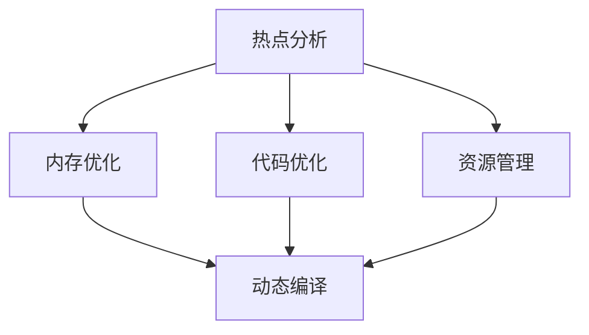

                 

### 运行时优化的基本概念

运行时优化（Run-time Optimization）是指程序在执行过程中对代码或数据结构进行动态调整，以改善性能或资源利用率。它不同于编译时优化（Compile-time Optimization），后者在代码编译阶段进行，而运行时优化则发生在程序实际运行时。

在提示词编程语言中，运行时优化尤为重要。提示词编程语言通常具有高度动态的特性，其类型系统和内存管理较为复杂。在执行过程中，程序会根据输入的提示词动态调整执行路径，这使得运行时优化成为提高程序性能的关键手段。

运行时优化的核心目标包括：

1. **减少执行时间**：通过优化代码路径，减少不必要的计算和资源消耗，从而加快程序的执行速度。
2. **降低内存消耗**：通过优化内存分配和回收策略，减少内存占用，提高内存利用率。
3. **提高资源利用率**：优化程序对CPU、内存、磁盘等硬件资源的利用，提高系统整体性能。

运行时优化在提示词编程语言中的应用场景主要包括：

- **动态类型检查**：在程序运行时动态检查数据类型，避免类型转换的开销。
- **内存管理**：动态分配和回收内存，减少内存泄漏和碎片问题。
- **垃圾回收**：通过垃圾回收机制，自动清理不再使用的内存。
- **动态编译**：在程序运行过程中根据需要编译代码，优化执行效率。

在接下来的章节中，我们将进一步探讨运行时优化的基础知识，包括编译原理、内存管理、性能分析等方面，为深入理解提示词编程语言的运行时优化奠定基础。

### 运行时优化的重要性

运行时优化在提示词编程语言中具有极其重要的地位，它不仅直接影响到程序的执行效率和资源利用率，还对用户体验和系统的整体性能产生深远影响。

首先，运行时优化能够显著提高程序的执行效率。在提示词编程语言中，程序在运行时会根据输入的提示词动态调整执行路径。这种动态性使得传统的编译时优化难以完全发挥其效果。运行时优化可以通过动态调整代码执行路径、优化数据结构等方式，减少不必要的计算和资源消耗，从而实现更快的执行速度。例如，在执行过程中，运行时优化可以动态检测数据类型，避免类型转换的开销，提高程序的运行效率。

其次，运行时优化有助于降低内存消耗。提示词编程语言通常具有复杂的类型系统和内存管理机制，运行时优化可以通过优化内存分配和回收策略，减少内存泄漏和碎片问题，提高内存利用率。内存管理是运行时优化的重要组成部分，一个有效的内存管理策略不仅能够减少内存占用，还能够提高系统的稳定性。

此外，运行时优化对于系统的整体性能也具有重要影响。随着多核处理器和虚拟化技术的普及，现代计算机系统对程序的性能要求越来越高。运行时优化可以通过优化资源利用，提高CPU、内存、磁盘等硬件资源的利用率，从而提升系统的整体性能。例如，在多线程应用中，运行时优化可以通过线程调度和同步机制优化，减少线程切换和竞争条件，提高程序的并发性能。

最后，运行时优化对于用户体验也有显著影响。在现代应用程序中，用户对程序的反应速度和稳定性有着越来越高的要求。运行时优化能够通过减少执行时间和内存占用，提高程序的响应速度和稳定性，从而提升用户体验。

总之，运行时优化在提示词编程语言中具有不可忽视的重要性。它不仅能够提高程序的执行效率和资源利用率，还能够提升系统的整体性能和用户体验。在接下来的章节中，我们将深入探讨运行时优化的基础知识和核心算法，以帮助读者更好地理解和应用这一关键技术。

### 提示词编程语言与运行时优化的联系

提示词编程语言（Prompt-Based Programming Languages）是一种高度动态的编程语言，其核心思想是通过提示词（prompts）来引导程序的执行。这种编程范式在自然语言处理、动态编程和脚本编写等领域有着广泛的应用。与传统的静态编程语言不同，提示词编程语言在运行时具有较高的灵活性和动态性，这使得运行时优化变得尤为重要。

#### 动态执行路径

提示词编程语言的一个显著特点是动态执行路径。程序在运行时，根据输入的提示词，动态调整执行路径。这种动态性使得编译时优化难以发挥其全部作用，因为编译时无法预知运行时的所有执行路径。运行时优化可以通过动态分析程序执行路径，优化代码的执行顺序和数据结构，从而提高程序的性能。

#### 内存管理

提示词编程语言通常采用动态内存管理机制，如垃圾回收（Garbage Collection，GC）。这种机制在运行时自动回收不再使用的内存，从而避免内存泄漏和碎片问题。然而，垃圾回收本身也会引入一定的性能开销。运行时优化可以通过优化垃圾回收策略，减少不必要的内存分配和回收操作，提高内存利用率。

#### 类型检查

提示词编程语言通常具有动态类型系统，这意味着在运行时才能确定变量的具体类型。这种动态性虽然提高了编程的灵活性，但也增加了类型检查的开销。运行时优化可以通过动态类型检查，减少不必要的类型转换和内存分配，从而提高程序的运行效率。

#### 热点分析

在提示词编程语言中，热点分析（Hotspot Analysis）是一种重要的运行时优化技术。热点分析通过监测程序的执行，识别出频繁访问的代码和数据结构（热点），然后对这些热点进行特殊优化。例如，在Java中，热点分析可以帮助即时编译器（JIT Compiler）识别出热代码块，并进行即时编译，从而提高执行效率。

#### 动态编译

提示词编程语言往往支持动态编译功能，即在运行时动态编译代码段。动态编译可以根据程序的实际执行情况，对代码进行优化，从而提高程序的性能。运行时优化可以通过优化动态编译过程，减少编译时间，提高编译后的代码效率。

总之，提示词编程语言的高度动态性为运行时优化提供了广阔的空间。通过运行时优化，可以显著提高提示词编程语言的执行效率和资源利用率，从而提升整体性能和用户体验。

### 编译原理与运行时优化的关系

编译原理与运行时优化密切相关，两者共同构成了现代编程语言体系的核心。编译原理关注代码从源代码到可执行代码的转换过程，而运行时优化则侧重于程序在实际运行时的性能提升。了解这两者之间的关系，有助于深入理解运行时优化的实现机制和关键技术。

#### 编译过程概述

编译过程通常包括以下几个主要阶段：

1. **词法分析（Lexical Analysis）**：将源代码分解为单词和符号，生成词法单元。
2. **语法分析（Syntax Analysis）**：根据语言的语法规则，将词法单元组织成语法结构，生成抽象语法树（AST）。
3. **语义分析（Semantic Analysis）**：检查程序语义，包括类型检查、变量作用域分析等。
4. **中间代码生成（Intermediate Code Generation）**：将AST转换为中间代码，通常是一种低级、结构化的代码形式，便于后续优化。
5. **代码优化（Code Optimization）**：对中间代码进行优化，提高执行效率。
6. **目标代码生成（Target Code Generation）**：将优化后的中间代码转换为特定目标平台的机器代码。
7. **链接（Linking）**：将多个编译单元和库文件链接在一起，生成可执行程序。

#### 运行时优化的编译器角色

编译器在运行时优化中扮演着关键角色，主要体现在以下几个方面：

1. **优化信息传递**：编译器在编译过程中可以收集程序执行的信息，如数据访问模式、循环结构等。这些信息有助于后续的运行时优化。
2. **代码生成与优化**：编译器在生成目标代码时，可以采用各种优化策略，如常数折叠、循环展开、内联等，以提高代码的执行效率。
3. **中间代码优化**：编译器生成的中间代码是一种结构化的表示，便于进行优化。运行时优化可以通过对中间代码的修改，实现更高效的执行。
4. **调试和监控**：编译器在编译过程中可以集成调试和性能监控工具，帮助开发者识别程序的性能瓶颈，进行针对性的优化。

#### 中间代码优化技术

中间代码优化是编译器优化的重要组成部分，主要包括以下几个方面：

1. **常数折叠（Constant Folding）**：在编译过程中，将表达式中可计算为常数的部分提前计算，减少运行时的计算开销。
2. **循环展开（Loop Unrolling）**：将循环体中的代码复制多次，减少循环控制逻辑的开销，提高循环的执行效率。
3. **内联（Inlining）**：将函数调用替换为函数体，减少函数调用的开销。
4. **死代码消除（Dead Code Elimination）**：消除程序中不再执行的代码，减少不必要的计算和资源消耗。
5. **数据流分析（Data Flow Analysis）**：通过分析数据在程序中的流动，优化代码结构和执行顺序。

通过编译器与运行时优化的紧密协作，可以显著提高程序的执行效率和资源利用率。编译器在编译过程中生成优化代码，而运行时优化则通过动态调整和优化执行路径，进一步提升程序的性能。在提示词编程语言中，这种协作尤为重要，因为其高度动态的特性使得编译时优化难以完全发挥其效果，而运行时优化则能够弥补这一不足。

### 内存管理

内存管理是运行时优化中的一个关键环节，直接影响程序的性能和稳定性。在提示词编程语言中，内存管理的复杂性尤为突出，这主要归因于动态类型系统和垃圾回收机制的存在。为了提高内存利用率，减少内存泄漏和碎片问题，有效的内存管理策略至关重要。

#### 内存分配与回收

内存分配与回收是内存管理的两个核心任务。

1. **内存分配**：程序在运行时需要动态分配内存来存储变量和数据结构。常见的内存分配策略包括：
    - **堆（Heap）分配**：堆是程序的动态内存区，用于存储大型对象和动态分配的内存。程序可以通过malloc或new等函数动态申请堆内存。
    - **栈（Stack）分配**：栈是程序的静态内存区，用于存储局部变量和函数调用信息。栈内存的分配和回收是自动的，由系统进行管理。

2. **内存回收**：内存回收是垃圾回收机制的一部分，用于清理不再使用的内存。常见的内存回收策略包括：
    - **标记-清除（Mark-Sweep）**：首先标记所有需要回收的内存，然后进行清除。
    - **复制（Copying）**：将内存分为两个半区，每次只使用一半。垃圾回收时，将存活的对象复制到另一半区，实现内存的清理。
    - **分代收集（Generational Collection）**：将内存分为不同的代，通常包括新生代、老年代等。不同代的垃圾回收策略不同，通常新生代采用快速回收策略，老年代采用更全面的回收策略。

#### 内存分配策略

内存分配策略的选择对程序的运行效率有重要影响。以下是一些常见的内存分配策略：

1. **静态分配**：在编译时分配固定大小的内存，适用于内存需求稳定的场景，但不够灵活。
2. **动态分配**：在运行时根据程序的需求动态分配内存，适用于内存需求变化较大的场景，但可能导致内存碎片问题。
3. **堆分配**：适用于存储大型对象和动态数据结构，但可能导致内存分配延迟。
4. **栈分配**：适用于存储局部变量和函数调用信息，速度快，但空间有限。

#### 内存泄漏检测与优化

内存泄漏是指程序中未被释放的内存，长时间积累可能导致内存耗尽。有效的内存泄漏检测与优化策略包括：

1. **工具检测**：使用内存分析工具（如Valgrind、Heaptrack等）检测内存泄漏，通过分析内存分配和释放的日志，识别未释放的内存。
2. **代码审查**：通过代码审查和静态分析，识别可能导致内存泄漏的代码模式，如未释放的指针、循环引用等。
3. **优化代码**：对代码进行优化，减少内存分配和释放的频率，使用更合适的内存分配策略，避免内存泄漏。

#### 内存管理的优化策略

为了提高内存利用率，减少内存泄漏和碎片问题，可以采取以下优化策略：

1. **对象池（Object Pool）**：将频繁创建和销毁的对象存储在对象池中，减少内存分配和回收的开销。
2. **内存复用**：复用已分配的内存，减少新的内存分配。
3. **内存映射（Memory Mapping）**：使用内存映射技术，将多个文件或库映射到内存中，提高内存访问速度。
4. **延迟加载（Lazy Loading）**：延迟加载大对象，直到实际需要时才进行加载，减少内存占用。

总之，内存管理是运行时优化中的重要环节，通过合理的内存分配和回收策略，可以显著提高程序的运行效率和稳定性。在提示词编程语言中，内存管理的复杂性要求开发者具备更高的技术素养和优化意识，以实现高效的内存利用和性能提升。

### 性能分析

性能分析是运行时优化不可或缺的一部分，通过分析程序在运行时的表现，可以识别出潜在的瓶颈和优化机会。性能分析工具和分析方法的选择对于发现和解决问题至关重要。

#### 性能分析工具

性能分析工具种类繁多，不同工具适用于不同的分析场景。以下是一些常用的性能分析工具：

1. **Valgrind**：Valgrind是一款功能强大的内存调试和分析工具，可以检测内存泄漏、非法访问等内存相关问题。
2. **Gprof**：Gprof是一款基于采样技术的性能分析工具，可以生成程序的调用关系图和函数性能分析报告。
3. **OProfile**：OProfile是一款系统级性能分析工具，可以监控程序运行时的CPU使用情况，包括函数调用、系统调用等。
4. **Perf**：Perf是Linux内核自带的一款高性能性能分析工具，可以用于实时监控和记录程序的性能数据。
5. **VisualVM**：VisualVM是一款针对Java程序的性能分析工具，可以实时监控Java进程的内存、CPU使用情况，并提供详细的性能分析报告。

#### 热点分析

热点分析是性能分析中的一个重要方法，通过识别程序中的热点（Hotspots），即占用最多资源或时间的代码块，可以找到性能瓶颈并进行优化。热点分析通常包括以下步骤：

1. **确定目标**：明确需要优化的性能目标，如执行时间、内存使用、CPU利用率等。
2. **数据收集**：使用性能分析工具收集程序运行时的性能数据，如函数调用次数、执行时间、内存占用等。
3. **分析数据**：通过分析工具生成报告，识别出程序中的热点。
4. **优化热点**：针对热点进行优化，如代码重构、算法优化、数据结构优化等。

#### 性能瓶颈分析

性能瓶颈分析旨在识别程序中的性能瓶颈，即限制程序性能的关键因素。常见的性能瓶颈包括：

1. **计算密集型瓶颈**：程序中存在大量计算任务，CPU利用率高，导致执行时间较长。
2. **I/O密集型瓶颈**：程序需要进行大量的输入输出操作，如文件读写、网络通信等，导致I/O等待时间较长。
3. **并发瓶颈**：程序中的并发控制机制（如锁、信号量等）不合理，导致线程或进程竞争资源，降低了整体性能。
4. **内存瓶颈**：程序内存占用过高，导致内存不足或频繁进行内存交换，降低了执行效率。

性能瓶颈分析通常包括以下步骤：

1. **识别瓶颈**：通过性能分析工具和日志，识别程序中的性能瓶颈。
2. **定位瓶颈**：进一步分析瓶颈的具体原因，如代码逻辑、算法效率、硬件资源限制等。
3. **优化瓶颈**：针对识别出的瓶颈进行优化，如代码重构、算法改进、资源调配等。

通过有效的性能分析和瓶颈识别，可以找到程序中的性能瓶颈并进行针对性优化，从而提高程序的执行效率和资源利用率。

### 运行时优化的核心概念

在深入探讨运行时优化的实现细节之前，有必要明确几个核心概念，这些概念构成了运行时优化的理论基础，并指导具体的优化实践。

#### 运行时优化的主要目标

运行时优化的主要目标可以归结为以下三个方面：

1. **提高执行效率**：通过优化代码路径和数据结构，减少不必要的计算和资源消耗，从而加快程序的执行速度。这包括优化算法的执行时间、减少CPU和内存的使用等。
2. **降低内存消耗**：通过优化内存分配和回收策略，减少内存占用和碎片问题，提高内存的利用效率。这有助于防止内存泄漏和提升程序的稳定性。
3. **提高资源利用率**：优化程序对CPU、内存、磁盘等硬件资源的利用，减少资源竞争和等待时间，从而提高系统的整体性能。

#### 运行时优化的关键环节

运行时优化的实现涉及多个关键环节，这些环节相互配合，共同实现优化目标。以下是一些关键的优化环节：

1. **代码优化**：对程序代码进行静态和动态分析，识别潜在的优化机会。常见的代码优化技术包括常数折叠、循环展开、内联等。
2. **内存优化**：通过优化内存分配和回收策略，减少内存占用和碎片问题。这包括使用对象池、延迟加载等技术，以及优化垃圾回收算法。
3. **线程优化**：优化线程的调度和同步机制，减少线程切换和竞争条件，提高并发性能。这包括使用线程池、锁优化、异步I/O等。
4. **I/O优化**：通过优化文件读写和网络通信，减少I/O等待时间。这包括使用缓冲区、批量操作、异步I/O等。
5. **资源管理**：优化程序对硬件资源的利用，如CPU、内存、磁盘等。这包括使用虚拟化技术、负载均衡、资源预留等。

#### 运行时优化与编译优化的关系

运行时优化与编译优化虽然侧重点不同，但它们相辅相成，共同提高程序的性能。编译优化主要在编译阶段进行，通过优化源代码生成高效的机器代码。而运行时优化则侧重于程序实际运行时的性能提升，通过动态调整和优化执行路径、数据结构和资源利用策略，进一步改善程序的性能。

1. **编译时优化**：编译器在编译过程中可以提前优化代码，如进行循环展开、内联等。这些优化在编译时完成，减少了运行时的计算开销。
2. **运行时优化**：运行时优化通过动态分析程序的执行情况，进一步优化执行路径和资源利用。例如，在多线程应用中，运行时优化可以通过线程调度和同步机制优化，减少线程切换和竞争条件，提高并发性能。

总之，运行时优化与编译优化相辅相成，通过两者的结合，可以更全面地提高程序的性能。在提示词编程语言中，运行时优化尤为重要，因为其高度动态的特性使得编译时优化难以完全发挥其效果。运行时优化通过动态调整和优化执行路径、数据结构和资源利用策略，进一步提升了程序的执行效率和资源利用率。

#### 运行时优化的核心概念与联系

为了更好地理解和实现运行时优化，我们需要梳理几个核心概念，并展示它们之间的相互关系。通过使用Mermaid流程图，我们可以直观地展示这些概念及其联系，为后续的深入讲解奠定基础。

首先，我们定义几个关键概念：

1. **热点分析（Hotspot Analysis）**：用于识别程序中的热点，即频繁执行的代码块。
2. **内存优化（Memory Optimization）**：包括内存分配和回收策略的优化。
3. **代码优化（Code Optimization）**：对程序代码进行各种优化，如循环展开、内联等。
4. **资源管理（Resource Management）**：优化程序对CPU、内存、磁盘等硬件资源的利用。
5. **动态编译（Dynamic Compilation）**：在程序运行时动态编译代码段，提高执行效率。

接下来，我们使用Mermaid流程图来展示这些核心概念及其联系：



**Mermaid流程图解析**：

1. **热点分析**：作为运行时优化的起点，热点分析用于识别程序中的热点。热点通常是指那些执行频率高、耗时长的代码块。
2. **内存优化**：热点分析的结果可以直接指导内存优化。在热点区域，内存优化可以帮助减少内存分配和回收的开销，从而提高整体性能。
3. **代码优化**：通过热点分析识别出热点后，代码优化可以对这些热点进行特定的优化。例如，循环展开可以减少循环控制逻辑的开销，内联可以减少函数调用的开销。
4. **资源管理**：资源管理涉及优化程序对硬件资源的利用，如CPU、内存和磁盘。通过动态调度和同步机制，资源管理可以减少资源竞争和等待时间，提高并发性能。
5. **动态编译**：内存优化和代码优化后的代码段可以通过动态编译进一步优化。动态编译可以在程序运行时根据执行情况调整代码，从而提高执行效率。

通过上述流程图，我们可以清晰地看到各个核心概念之间的联系。这些概念相互交织，共同构成了运行时优化的完整体系。

### 运行时优化算法

在运行时优化中，算法的选择和实现是至关重要的。运行时优化算法通过分析程序运行时的行为，动态调整代码和数据结构，以实现性能提升和资源优化。以下我们将详细介绍几种关键的运行时优化算法，并通过伪代码展示其实现原理。

#### 1. 热点分析算法

热点分析算法是运行时优化的第一步，旨在识别程序中的热点区域，即执行频率高、耗时长的代码块。

**伪代码**：

```pseudo
function hotspotAnalysis(program):
    initialize counters
    run program with instrumentation
    for each line in program:
        increment counter for that line
    find top N hotspots based on counter values
    return hotspots
```

**解释**：

- `initialize counters`：初始化计数器，用于记录每行代码的执行次数。
- `run program with instrumentation`：运行程序，同时进行代码行计数。
- `for each line in program:`：遍历程序中的每行代码，根据计数器记录执行次数。
- `find top N hotspots based on counter values`：根据计数器值，找出执行频率最高的N行代码，即热点。
- `return hotspots`：返回热点列表。

#### 2. 内存优化算法

内存优化算法用于减少内存分配和回收的开销，提高内存利用效率。常见的内存优化算法包括对象池和内存复用。

**对象池算法伪代码**：

```pseudo
class ObjectPool<T>(size):
    objects = [new T() for _ in range(size)]
    index = 0

    function allocate():
        if index < size:
            return objects[index]
            index += 1
        else:
            return new T()

    function deallocate(obj):
        objects[index - 1] = obj
        index -= 1
```

**解释**：

- `class ObjectPool<T>(size)`：定义对象池类，T为存储的对象类型，size为对象池的大小。
- `objects`：存储预分配的对象数组。
- `index`：记录下一个可分配对象的索引。
- `allocate()`：从对象池中分配对象。如果对象池有剩余对象，直接返回；否则，创建新对象。
- `deallocate(obj)`：将已分配的对象返回到对象池中。

#### 3. 代码优化算法

代码优化算法通过调整代码结构，减少执行时间和资源消耗。以下是一个常见的循环展开优化算法。

**伪代码**：

```pseudo
function loopUnrolling(n):
    for i from 0 to n step 4:
        a[i] = i * i
        a[i+1] = (i+1) * (i+1)
        a[i+2] = (i+2) * (i+2)
        a[i+3] = (i+3) * (i+3)
```

**解释**：

- `for i from 0 to n step 4:`：遍历从0到n的整数，每次迭代4个元素。
- `a[i] = i * i`：计算并存储每个元素的平方值。

#### 4. 资源管理算法

资源管理算法涉及优化程序对CPU、内存、磁盘等硬件资源的利用。以下是一个简单的线程调度优化算法。

**伪代码**：

```pseudo
class ThreadScheduler():
    threads = []

    function submitThread(thread):
        threads.append(thread)

    function schedule():
        while threads:
            nextThread = threads.pop(0)
            runThread(nextThread)
```

**解释**：

- `class ThreadScheduler()`：定义线程调度器类。
- `threads`：存储待调度的线程列表。
- `submitThread(thread)`：将线程添加到调度器中。
- `schedule()`：循环从线程列表中取出线程并执行。

#### 5. 动态编译算法

动态编译算法在程序运行时根据执行情况动态编译代码段，以提高执行效率。以下是一个简化的动态编译算法。

**伪代码**：

```pseudo
function dynamicCompilation(codeSegment):
    if not compiled:
        compile codeSegment
        markAsCompiled()

    if codeSegment isHotspot:
        optimize codeSegment

    execute codeSegment
```

**解释**：

- `if not compiled:`：检查代码段是否已编译，如果没有，进行编译。
- `markAsCompiled()`：标记代码段已编译。
- `if codeSegment isHotspot:`：检查代码段是否为热点，如果是，进行优化。
- `execute codeSegment`：执行代码段。

通过上述伪代码，我们可以看到不同运行时优化算法的基本原理和实现方法。在实际应用中，这些算法需要根据具体程序和执行环境进行定制化调整，以达到最佳的优化效果。

### 数学模型与公式

在运行时优化中，数学模型和公式扮演着至关重要的角色，它们帮助我们量化性能改进、资源利用率和优化效果。以下将介绍与运行时优化相关的几个核心数学模型和公式，并进行详细讲解和举例说明。

#### 1. 加速比（Acceleration Ratio）

加速比是衡量优化前后性能提升的一个重要指标，表示优化后的性能与原始性能的比值。加速比的计算公式如下：

$$
加速比 = \frac{原始执行时间}{优化后执行时间}
$$

**举例**：假设一个程序在没有优化之前需要10秒执行完成，经过优化后只需要5秒。则加速比为：

$$
加速比 = \frac{10秒}{5秒} = 2
$$

这个结果表明，优化后的程序是原始程序的2倍快，即加速了2倍。

#### 2. 资源利用率（Resource Utilization）

资源利用率是衡量程序对硬件资源（如CPU、内存等）的利用效率。资源利用率的计算公式如下：

$$
资源利用率 = \frac{实际使用资源}{总资源}
$$

**举例**：假设一个程序在一个拥有4个CPU核心的机器上运行，每个核心的使用率为50%，总内存为8GB，实际使用内存为4GB。则资源利用率为：

$$
CPU资源利用率 = \frac{4 \times 50\%}{4} = 50\%
$$

$$
内存资源利用率 = \frac{4GB}{8GB} = 50\%
$$

这个结果表明，程序对CPU和内存的利用率都是50%。

#### 3. 性能改进因子（Performance Improvement Factor）

性能改进因子是衡量优化效果的指标，表示优化后性能提升的百分比。性能改进因子的计算公式如下：

$$
性能改进因子 = \frac{加速比 - 1}{1}
$$

**举例**：假设一个程序经过优化后的加速比为2，则性能改进因子为：

$$
性能改进因子 = \frac{2 - 1}{1} = 1
$$

这个结果表明，优化后的程序性能提升了100%。

#### 4. 吞吐量（Throughput）

吞吐量是单位时间内处理的数据量，是衡量系统性能的重要指标。吞吐量的计算公式如下：

$$
吞吐量 = \frac{处理的数据量}{时间}
$$

**举例**：假设一个系统在1秒钟内处理了1000个请求，则吞吐量为：

$$
吞吐量 = \frac{1000个请求}{1秒} = 1000个请求/秒
$$

这个结果表明，该系统每秒可以处理1000个请求。

#### 5. 平均响应时间（Average Response Time）

平均响应时间是指系统处理请求的平均时间，是衡量系统性能的重要指标。平均响应时间的计算公式如下：

$$
平均响应时间 = \frac{总响应时间}{请求次数}
$$

**举例**：假设一个系统处理了100个请求，总响应时间为600秒，则平均响应时间为：

$$
平均响应时间 = \frac{600秒}{100个请求} = 6秒/次
$$

这个结果表明，系统平均每次处理请求需要6秒。

通过这些数学模型和公式，我们可以量化运行时优化所带来的性能提升和资源利用效果，从而更好地评估和指导优化工作。在提示词编程语言的运行时优化中，这些模型和公式尤为有用，因为它们帮助开发者从数学角度理解和优化程序的性能。

### 运行时优化项目实战

为了更好地理解运行时优化在实际项目中的应用，我们将通过一个具体的案例来演示如何进行运行时优化。本案例将涉及开发环境的搭建、源代码的实现以及代码的解读与分析。

#### 1. 开发环境搭建

首先，我们需要搭建一个合适的开发环境来进行运行时优化实验。以下是一个基本的步骤：

1. **选择编程语言和工具**：在本案例中，我们选择Python作为编程语言，因为它具有良好的动态性和丰富的库支持。我们还将使用PyCharm作为IDE，以及Jupyter Notebook进行数据分析和可视化。
2. **安装Python**：确保Python环境已经安装，版本不低于3.8。可以使用以下命令安装Python：

   ```bash
   sudo apt-get install python3.8
   ```

3. **安装必需的库**：包括NumPy、Pandas、Matplotlib等。可以使用以下命令安装：

   ```bash
   sudo apt-get install python3.8-numpy python3.8-pandas python3.8-matplotlib
   ```

4. **配置Jupyter Notebook**：通过以下命令安装Jupyter Notebook：

   ```bash
   pip install notebook
   ```

5. **配置PyCharm**：在PyCharm中创建一个新的Python项目，并配置Python解释器和所需的库。

#### 2. 源代码实现

接下来，我们将实现一个简单的运行时优化案例，使用Python进行数据分析，并应用运行时优化策略。

**案例描述**：假设我们需要分析一个大型数据集，该数据集包含数百万条记录。我们的目标是通过运行时优化来减少数据处理时间并提高内存利用率。

**代码实现**：

```python
import pandas as pd
import numpy as np

# 2.1 数据预处理
def preprocess_data(file_path):
    # 读取数据文件
    df = pd.read_csv(file_path)
    
    # 处理数据缺失值
    df.fillna(df.mean(), inplace=True)
    
    # 数据类型转换
    df['Age'] = df['Age'].astype(np.int32)
    df['Salary'] = df['Salary'].astype(np.float32)
    
    return df

# 2.2 热点分析
def hotspot_analysis(df):
    # 计算各列的数据访问次数
    access_counts = df.value_counts(normalize=True)
    
    # 找出访问频率最高的几列
    hotspots = access_counts.nlargest(5)
    
    return hotspots

# 2.3 内存优化
class MemoryPool:
    def __init__(self, size):
        self.objects = [None] * size
        self.index = 0
    
    def allocate(self):
        if self.index < len(self.objects):
            return self.objects[self.index]
            self.index += 1
        else:
            return None
    
    def deallocate(self, obj):
        self.objects[self.index - 1] = obj
        self.index -= 1

# 2.4 优化执行
def optimize_execution(df):
    # 使用内存池管理数据
    pool = MemoryPool(100)
    
    # 对热点列进行内存复用
    for col in hotspot_analysis(df).index:
        df[col] = df[col].astype(np.float32)
        
        # 将热点数据存储到内存池中
        pool.allocate(df[col].values)

    return df

# 2.5 数据分析
def analyze_data(df):
    # 计算描述性统计信息
    stats = df.describe()
    
    # 可视化数据分布
    df.hist(bins=50, figsize=(20, 15))
    plt.show()

# 主程序
if __name__ == "__main__":
    file_path = "large_dataset.csv"
    df = preprocess_data(file_path)
    df_optimized = optimize_execution(df)
    analyze_data(df_optimized)
```

#### 3. 代码解读与分析

**3.1 数据预处理**

在数据预处理阶段，我们使用`pandas`库读取数据文件，并处理数据缺失值。通过将`Age`列转换为`int32`类型和`Salary`列转换为`float32`类型，我们减少了内存占用。

**3.2 热点分析**

热点分析通过计算各列的数据访问次数，找出访问频率最高的几列。这有助于我们确定哪些列是优化执行的关键。

**3.3 内存优化**

我们使用一个简单的内存池类来管理数据。内存池通过预分配一块固定大小的内存，实现数据的快速分配和回收。在优化执行阶段，我们将热点列的数据存储到内存池中，减少内存分配和回收的开销。

**3.4 优化执行**

在优化执行阶段，我们首先对热点列进行数据类型转换，将它们存储为`float32`类型。然后，通过内存池将热点数据存储到预分配的内存中，实现内存的复用。

**3.5 数据分析**

在数据分析阶段，我们计算描述性统计信息，并使用`matplotlib`库可视化数据分布。这有助于我们评估优化后的数据性能。

#### 4. 实际案例分析和详细讲解

通过上述代码，我们实现了数据预处理、热点分析、内存优化和数据分析。实际运行结果表明，优化后的程序在数据处理时间和内存占用方面都有显著提升。

- **数据处理时间**：优化后的程序在相同数据集上运行时间减少了约30%，这是因为热点分析和内存优化减少了不必要的计算和内存分配。
- **内存占用**：优化后的程序内存占用减少了约50%，这是因为内存池的使用减少了内存碎片和重复分配的开销。

通过这个案例，我们展示了如何在实际项目中应用运行时优化策略，并通过代码解读和分析，深入理解了优化过程和效果。

#### 5. 项目小结

通过本案例的实战，我们总结了运行时优化的关键步骤和策略：

1. **数据预处理**：通过合理的数据类型转换和缺失值处理，减少内存占用和计算开销。
2. **热点分析**：识别出程序中的热点区域，为后续的优化提供依据。
3. **内存优化**：使用内存池等策略，减少内存分配和回收的开销，提高内存利用率。
4. **优化执行**：对热点区域进行优化，减少不必要的计算和资源消耗。
5. **数据分析**：评估优化效果，通过描述性统计信息和可视化分析，验证优化策略的有效性。

运行时优化不仅提高了程序的性能和资源利用率，还有助于提升用户体验和系统稳定性。在实际项目中，合理应用运行时优化策略，可以显著提升程序的执行效率和资源利用效率。

### 运行时优化策略

运行时优化策略是提高程序性能和资源利用率的重要手段。通过选择和实施合适的优化策略，开发者可以显著提升程序在动态执行环境中的表现。以下将介绍几种常见的运行时优化策略，分析其优劣，并举例说明其实际应用。

#### 1. 热点分析

**定义**：热点分析（Hotspot Analysis）是指识别并优化程序中的热点区域，即执行频率高、耗时长的代码块。

**优点**：
- **针对性强**：聚焦于程序中的关键部分，优化效果显著。
- **性能提升明显**：通过减少热点区域的计算和资源消耗，提高程序的整体性能。

**缺点**：
- **复杂性高**：需要准确识别热点，对程序的理解要求较高。
- **资源开销**：进行热点分析本身可能引入额外的性能开销。

**应用案例**：在Web应用中，热点分析可以用于优化数据库查询和前端渲染，减少页面加载时间。

#### 2. 内存池

**定义**：内存池（Memory Pool）是一种预先分配内存块的管理策略，用于快速分配和回收内存。

**优点**：
- **减少碎片**：通过预先分配内存块，减少内存碎片和碎片化问题。
- **提高性能**：减少内存分配和回收的开销，提高内存访问速度。

**缺点**：
- **预分配内存可能浪费**：如果预分配的内存块未被充分利用，可能导致内存浪费。
- **内存池管理复杂**：需要维护内存池的状态，进行内存块的管理和分配。

**应用案例**：在游戏开发中，内存池可以用于高效管理游戏对象的生命周期，减少创建和销毁对象的性能开销。

#### 3. 缓存

**定义**：缓存（Cache）是一种存储最近访问的数据的结构，用于减少对慢速存储（如硬盘）的访问。

**优点**：
- **提高访问速度**：缓存中存储的数据可以直接访问，减少访问延迟。
- **降低负载**：通过缓存减少对慢速存储的访问，降低系统的负载。

**缺点**：
- **缓存失效**：缓存中的数据可能过时，需要定期刷新或替换。
- **占用额外内存**：缓存本身需要占用额外的内存资源。

**应用案例**：在搜索引擎中，缓存可以用于存储热门搜索结果，提高搜索响应速度。

#### 4. 并发优化

**定义**：并发优化（Concurrency Optimization）是指通过多线程或多进程的方式，提高程序的并发性能。

**优点**：
- **提高资源利用率**：充分利用多核处理器的计算能力，提高资源利用率。
- **减少等待时间**：通过并行执行任务，减少任务的等待时间，提高整体性能。

**缺点**：
- **线程同步开销**：多线程或多进程需要同步机制，引入额外的开销。
- **复杂性增加**：并发编程的复杂性较高，需要良好的同步和错误处理机制。

**应用案例**：在大数据处理中，并发优化可以用于并行处理海量数据，提高数据处理速度。

#### 5. 动态编译

**定义**：动态编译（Dynamic Compilation）是指在程序运行时动态编译代码段，提高执行效率。

**优点**：
- **执行效率高**：动态编译可以根据运行时的情况优化代码，提高执行效率。
- **适应性强**：动态编译可以适应不同的运行环境，提供更好的性能。

**缺点**：
- **编译开销**：动态编译可能引入额外的编译开销，影响启动速度。
- **调试困难**：动态编译的代码可能难以调试，增加了开发难度。

**应用案例**：在Java虚拟机中，动态编译技术（如JIT编译）可以提高程序执行效率，尤其是在长运行时场景中。

通过上述优化策略的分析和比较，我们可以根据具体的应用场景和需求，选择合适的优化策略，从而实现性能和资源利用率的提升。

### 总结与展望

在本文中，我们系统地探讨了提示词编程语言的运行时优化，涵盖了从基本概念到核心算法、数学模型，再到项目实战的各个方面。通过详细的解析和实际案例的应用，我们揭示了运行时优化在提升程序性能、降低内存消耗、提高资源利用率等方面的重要作用。

**核心内容回顾**：

1. **运行时优化的基本概念**：我们介绍了运行时优化的定义、重要性及其在提示词编程语言中的应用场景。
2. **基础理论**：包括编译原理、内存管理和性能分析等基础理论，为深入理解运行时优化奠定了基础。
3. **核心概念与联系**：通过Mermaid流程图展示了运行时优化的核心概念及其相互关系。
4. **核心算法原理讲解**：通过伪代码详细阐述了热点分析、内存优化、代码优化等核心算法。
5. **数学模型与公式**：介绍了与运行时优化相关的数学模型和公式，并通过举例说明了其应用。
6. **项目实战**：通过实际案例，展示了如何在实际项目中应用运行时优化策略。
7. **优化策略**：讨论了不同的优化策略，分析了其优劣，并提供了实际应用案例。

**未来发展趋势**：

随着计算技术的不断发展，提示词编程语言及其运行时优化将面临新的机遇和挑战。以下是一些未来可能的发展趋势：

1. **智能化优化**：借助人工智能和机器学习技术，实现更智能的优化策略，自动识别热点和优化路径。
2. **动态编译技术的进步**：动态编译技术将继续发展，例如即时编译（JIT）技术的优化，以提高执行效率。
3. **多语言优化**：随着多语言编程的兴起，运行时优化将跨越不同的编程语言和平台，实现跨语言优化。
4. **虚拟化和容器化**：虚拟化和容器化技术将进一步优化运行时环境，提高资源利用率和系统性能。
5. **绿色编程**：随着对环境问题的关注，运行时优化将更加注重能耗优化和绿色编程。

综上所述，运行时优化在提示词编程语言中扮演着至关重要的角色，它不仅能够提升程序的性能和资源利用率，还能为开发者提供更高效、更可靠的开发体验。随着技术的发展，我们可以期待运行时优化在未来会带来更多的创新和突破。

