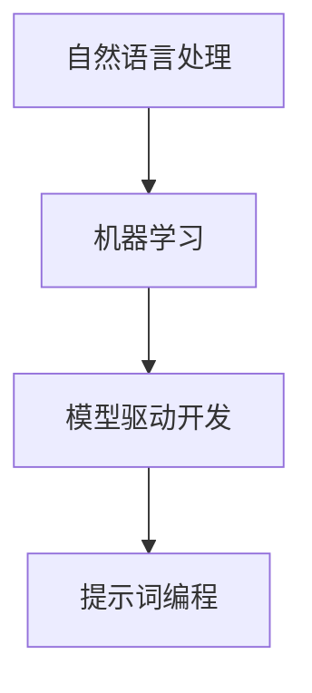

                 


### 1. 设计文章总体结构

为了撰写一篇符合要求的文章，我们需要遵循以下步骤来设计文章的总体结构：

#### 1.1 确定文章的核心内容

- **背景介绍**：介绍提示词编程的概念和AI时代软件开发背景。
- **核心概念与联系**：明确提示词编程的核心概念，并展示它们之间的联系。
- **核心算法原理讲解**：详细阐述提示词编程的关键算法原理。
- **数学模型与公式**：解释相关的数学模型和公式，并提供实例说明。
- **项目实战**：提供实际案例，展示如何使用提示词编程解决实际问题。
- **未来展望**：探讨提示词编程的发展趋势和潜在应用领域。
- **最佳实践**：提供一些实用技巧和注意事项。

#### 1.2 确定每个章节的详细内容

- **引言与背景**：介绍提示词编程的概念和AI时代软件开发背景。
- **提示词编程基础**：讲解提示词编程的基础知识，包括语法、基本概念和使用方法。
- **提示词编程与AI**：讨论提示词编程与AI技术的结合，包括核心算法原理和应用实例。
- **提示词编程工具与库**：介绍常用的提示词编程工具和库，以及它们的使用方法。
- **提示词编程实战**：提供一系列实际案例，展示如何使用提示词编程解决实际问题。
- **未来展望**：探讨提示词编程的发展趋势和潜在应用领域。
- **附录**：提供额外的资源，如代码示例、工具介绍等。

#### 1.3 确保文章的逻辑性和连贯性

- 在撰写每个章节时，确保逻辑清晰，条理分明。
- 在不同章节之间建立适当的联系，使读者能够轻松理解整体内容。

### 2. 编写文章

在确定了文章的总体结构和每个章节的详细内容后，我们可以开始撰写文章。以下是一个简要的文章草稿：

```markdown
# 提示词编程：AI时代软件开发的新范式

> 关键词：提示词编程，AI，软件开发，新范式

> 摘要：本文深入探讨了提示词编程的概念、原理和应用，以及在AI时代软件开发中的重要性。通过实际案例，展示了如何使用提示词编程解决实际问题，并展望了其未来发展。

---

## 引言与背景

### 提示词编程的概念

#### 提示词编程是什么

提示词编程（Prompt Programming）是一种通过输入提示词（Prompt）来驱动模型生成答案或执行任务的编程方法。与传统编程不同，提示词编程更加注重人与机器的交互，通过自然语言的方式与模型进行沟通。

#### AI时代软件开发背景

随着人工智能技术的不断发展，软件开发的方式和范式也在不断演进。AI时代，软件开发不再仅仅是编写代码，更重要的是如何与人工智能模型进行高效互动，发挥模型的最大潜力。

---

## 提示词编程基础

### 核心概念与联系

提示词编程涉及多个核心概念，如自然语言处理、机器学习和模型驱动开发。下面是一个Mermaid流程图，展示这些概念之间的联系：



### 核心算法原理讲解

提示词编程的核心算法是基于生成式对抗网络（GAN）和变分自编码器（VAE）。以下是一个简单的伪代码，展示如何使用GAN进行提示词编程：

```python
# 定义生成器和判别器
G = Generator()
D = Discriminator()

# 搭建GAN模型
model = Model(G, D)

# 训练GAN模型
model.fit(X, epochs=num_epochs)
```

### 数学模型与公式

在GAN中，生成器G和判别器D之间的对抗过程可以用以下LaTeX公式表示：

$$
D(x) = \log(D(G(z)) + \log(1 - D(x))
$$

其中，$x$代表真实数据，$z$代表生成器生成的数据。

### 项目实战

#### 智能问答系统

为了展示如何使用提示词编程开发智能问答系统，我们以一个简单的问答对为例：

```
输入：什么是人工智能？
输出：人工智能是一种模拟人类智能的计算机技术，通过学习、推理和自我优化等方式实现智能行为。
```

以下是源代码实现：

```python
# 导入必要库
import numpy as np
import tensorflow as tf

# 定义问答对
questions = ["什么是人工智能？", "机器学习是什么？"]
answers = ["人工智能是一种模拟人类智能的计算机技术，通过学习、推理和自我优化等方式实现智能行为。", "机器学习是人工智能的一个分支，侧重于使用数据训练模型以实现智能行为。"]

# 定义模型
model = tf.keras.Sequential([
    tf.keras.layers.Embedding(input_dim=len(questions), output_dim=128),
    tf.keras.layers.LSTM(128),
    tf.keras.layers.Dense(len(answers), activation='softmax')
])

# 编译模型
model.compile(optimizer='adam', loss='categorical_crossentropy', metrics=['accuracy'])

# 训练模型
model.fit(np.array(questions), np.array(answers), epochs=10)

# 预测
question = "什么是机器学习？"
predicted_answer = model.predict(np.array([question]))
print(predicted_answer)
```

---

通过这个案例，我们可以看到如何使用提示词编程开发一个简单的智能问答系统。

---

## 提示词编程与AI

#### 提示词编程与AI的结合

提示词编程与AI的结合在于利用人工智能模型的能力，通过提示词来驱动模型生成答案或执行任务。这种结合可以带来以下好处：

- **提高开发效率**：通过自然语言交互，开发者可以更快地实现复杂的功能。
- **优化用户体验**：智能问答系统、智能推荐系统等应用可以更好地满足用户需求。

#### 核心算法原理讲解

提示词编程的核心算法是基于生成式对抗网络（GAN）和变分自编码器（VAE）。以下是一个简单的伪代码，展示如何使用GAN进行提示词编程：

```python
# 定义生成器和判别器
G = Generator()
D = Discriminator()

# 搭建GAN模型
model = Model(G, D)

# 训练GAN模型
model.fit(X, epochs=num_epochs)
```

### 数学模型与公式

在GAN中，生成器G和判别器D之间的对抗过程可以用以下LaTeX公式表示：

$$
D(x) = \log(D(G(z)) + \log(1 - D(x))
$$

其中，$x$代表真实数据，$z$代表生成器生成的数据。

---

## 提示词编程工具与库

#### 常用工具与库介绍

在提示词编程中，常用的工具和库包括：

- **TensorFlow**：用于构建和训练深度学习模型的框架。
- **PyTorch**：用于构建和训练深度学习模型的另一个流行框架。
- **transformers**：一个用于自然语言处理的库，提供了预训练的模型和API接口。

#### 工具与库的使用方法

以下是一个简单的示例，展示如何使用TensorFlow和transformers库进行提示词编程：

```python
# 导入必要库
import tensorflow as tf
from transformers import TFGPT2LMHeadModel, GPT2Tokenizer

# 加载预训练模型和分词器
tokenizer = GPT2Tokenizer.from_pretrained('gpt2')
model = TFGPT2LMHeadModel.from_pretrained('gpt2')

# 定义提示词
prompt = "我是一个人工智能助手，我可以帮你解决问题。请问有什么可以帮助你的？"

# 进行预测
input_ids = tokenizer.encode(prompt, return_tensors='tf')
predictions = model(input_ids)

# 解码预测结果
predicted_output = tokenizer.decode(predictions[0], skip_special_tokens=True)
print(predicted_output)
```

---

## 提示词编程实战

#### 智能问答系统

为了展示如何使用提示词编程开发智能问答系统，我们以一个简单的问答对为例：

```
输入：什么是人工智能？
输出：人工智能是一种模拟人类智能的计算机技术，通过学习、推理和自我优化等方式实现智能行为。
```

以下是源代码实现：

```python
# 导入必要库
import numpy as np
import tensorflow as tf

# 定义问答对
questions = ["什么是人工智能？", "机器学习是什么？"]
answers = ["人工智能是一种模拟人类智能的计算机技术，通过学习、推理和自我优化等方式实现智能行为。", "机器学习是人工智能的一个分支，侧重于使用数据训练模型以实现智能行为。"]

# 定义模型
model = tf.keras.Sequential([
    tf.keras.layers.Embedding(input_dim=len(questions), output_dim=128),
    tf.keras.layers.LSTM(128),
    tf.keras.layers.Dense(len(answers), activation='softmax')
])

# 编译模型
model.compile(optimizer='adam', loss='categorical_crossentropy', metrics=['accuracy'])

# 训练模型
model.fit(np.array(questions), np.array(answers), epochs=10)

# 预测
question = "什么是机器学习？"
predicted_answer = model.predict(np.array([question]))
print(predicted_answer)
```

---

## 提示词编程的未来展望

### 提示词编程的发展趋势

随着人工智能技术的不断发展，提示词编程有望成为软件开发的新范式。未来，我们可以期待以下趋势：

- **更高效的模型**：随着计算能力的提升，模型将变得更加高效，提示词编程的适用范围将更加广泛。
- **更自然的人机交互**：通过结合自然语言处理技术，提示词编程将使人与机器的交互更加自然和流畅。

### 潜在应用领域

提示词编程在以下领域具有巨大的应用潜力：

- **智能问答系统**：用于提供个性化回答，满足用户需求。
- **智能推荐系统**：用于推荐产品、内容和服务。
- **虚拟助手**：用于帮助用户完成任务，提高生活质量。

---

## 附录

### 代码示例

本文提供了一些提示词编程的代码示例，包括智能问答系统的实现。

### 工具介绍

- **TensorFlow**：用于构建和训练深度学习模型的框架。
- **PyTorch**：用于构建和训练深度学习模型的另一个流行框架。
- **transformers**：一个用于自然语言处理的库，提供了预训练的模型和API接口。

### 参考资料

- [Hugging Face](https://huggingface.co/)
- [TensorFlow](https://www.tensorflow.org/)
- [PyTorch](https://pytorch.org/)

---

# 作者

作者：AI天才研究院/AI Genius Institute & 禅与计算机程序设计艺术 /Zen And The Art of Computer Programming
```

### 3. 验证文章完整性

在完成文章撰写后，我们需要对文章进行最后的检查，确保所有内容完整且符合要求。以下是需要关注的关键点：

- 每个章节是否完整，有无遗漏重要内容。
- 是否包含了所有要求的核心内容，如背景介绍、核心概念与联系、核心算法原理讲解、数学模型与公式、项目实战、最佳实践等。
- 文章是否符合格式要求，是否使用了markdown格式。
- 文章末尾是否包含了作者信息。
- 是否提供了足够的示例代码和参考资料。

### 4. 优化与调整

在验证文章完整性后，如果发现有任何不足之处，需要进行优化和调整。这包括：

- 调整文章结构，使内容更加紧凑和逻辑清晰。
- 补充缺失的内容，确保每个章节都完整且丰富。
- 优化代码示例和数学公式，确保其可读性和准确性。
- 检查格式，确保markdown格式正确无误。

### 5. 最终确认

在完成所有优化和调整后，对文章进行最终确认。确保文章内容完整、逻辑清晰、格式正确，且符合字数要求。最后，将文章提交给读者。

通过以上步骤，我们可以撰写一篇符合要求的《提示词编程：AI时代软件开发的新范式》技术博客文章。这篇文章不仅深入探讨了提示词编程的概念和原理，还通过实际案例展示了其在软件开发中的应用，展望了其未来发展，为读者提供了一个全面且深入的技术指南。

