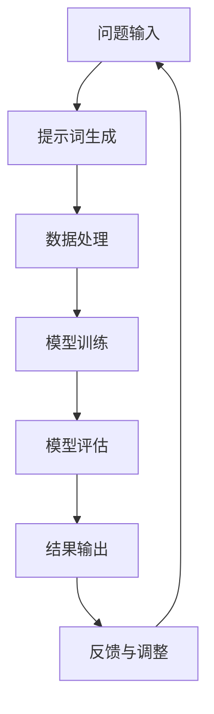

                 

``` 
    A --> C[思考与决策]
    A --> D[记忆与学习]
    B --> C
    B --> D
    C --> E[逻辑推理]
    C --> F[情感与价值观]
    D --> G[知识表示与处理]
    D --> H[问题求解与规划]
    E --> I[机器学习算法]
    F --> J[自然语言处理]
    G --> K[知识图谱]
    H --> L[增强学习算法]
    I --> M[深度学习模型]
    J --> N[语音识别]
    K --> O[数据挖掘算法]
    L --> P[强化学习应用]
    M --> Q[图像识别与处理]
    N --> R[情感分析]
    O --> S[推荐系统]
    P --> T[自动驾驶技术]
    Q --> U[医学影像分析]
    R --> V[金融风控]
    S --> W[电子商务应用]
    T --> X[智能家居控制]
    U --> Y[智能医疗诊断]
    V --> Z[网络安全]
    W --> AA[社交网络分析]
    X --> BB[物联网应用]
    Y --> CC[教育科技]
    Z --> DD[智能城市]
    AA --> BB
    BB --> CC
    CC --> DD

```

#### 第2章 提示词编程基础
这一章节将介绍提示词编程的基础知识，是读者理解后续章节的关键。具体包含以下内容：

- **3.1 编程语言基础**
  - **3.1.1 编程语言概述**：介绍编程语言的基本概念和分类。
  - **3.1.2 常用编程语言介绍**：介绍Python、Java、C++等常用编程语言的特点和应用场景。

- **3.2 提示词的定义与使用**
  - **3.2.1 提示词的定义**：解释提示词在编程中的作用和重要性。
  - **3.2.2 提示词的使用场景**：分析提示词在人工智能应用中的常见使用场景。
  - **3.2.3 提示词的设计原则**：阐述设计高效、可扩展提示词的原则和方法。

为了更好地理解提示词的作用，可以使用Mermaid流程图展示提示词编程的基本流程：



#### 第3章 编程实践
这一章节将通过实际案例来展示提示词编程的应用，帮助读者理解理论知识的实际应用。具体包含以下内容：

- **4.1 提示词编程实战案例**
  - **4.1.1 数据预处理**：介绍数据清洗、数据转换和数据归一化的具体步骤。
  - **4.1.2 模型训练**：讲解如何使用提示词对模型进行训练，包括选择合适的算法和调整参数。
  - **4.1.3 模型评估与优化**：展示如何评估模型的性能，并进行优化调整。

- **4.2 提示词编程项目实战**
  - **4.2.1 项目背景**：介绍项目的需求和目标。
  - **4.2.2 技术选型**：分析项目选择的技术路线和工具。
  - **4.2.3 开发流程**：详细描述项目的开发流程，包括需求分析、设计、编码和测试。
  - **4.2.4 项目成果与分析**：展示项目的实际成果，并对项目进行详细分析。

以下是一个项目实战的伪代码示例：

```python
# 数据预处理伪代码
def preprocess_data(data):
    # 清洗数据
    cleaned_data = clean_data(data)
    # 转换数据
    transformed_data = transform_data(cleaned_data)
    # 归一化数据
    normalized_data = normalize_data(transformed_data)
    return normalized_data

# 模型训练伪代码
def train_model(data, labels):
    # 选择模型
    model = select_model()
    # 训练模型
    model.fit(data, labels)
    return model

# 模型评估与优化伪代码
def evaluate_and_optimize(model, data, labels):
    # 评估模型
    performance = model.evaluate(data, labels)
    # 如果性能不佳，进行优化
    if performance < threshold:
        model = optimize_model(model)
    return model
```

#### 第4章 优秀案例与启示
这一章节将通过分析实际应用案例，总结提示词编程的优势、挑战和未来发展趋势。具体包含以下内容：

- **5.1 案例分析**
  - **5.1.1 案例一：智能客服系统**：分析智能客服系统中提示词编程的应用。
  - **5.1.2 案例二：自然语言处理应用**：探讨自然语言处理领域中的提示词编程实践。
  - **5.1.3 案例三：图像识别与处理**：展示图像识别和图像处理中的提示词编程技术。

- **5.2 案例启示**
  - **5.2.1 提示词编程的优势与挑战**：总结提示词编程的优势，如提高模型性能、降低开发成本等，同时分析面临的挑战，如设计复杂、调试困难等。
  - **5.2.2 如何提高提示词编程的效果**：提供一些建议和技巧，如优化提示词设计、使用自动化工具等。
  - **5.2.3 提示词编程的未来发展趋势**：展望提示词编程的发展方向，如与新型AI技术的结合、跨领域应用等。

#### 第5章 结论与展望
这一章节将总结全书内容，并对提示词编程的未来进行展望。具体包含以下内容：

- **6.1 书籍总结**：回顾书籍的核心内容和读者可以学到的主要知识点。
- **6.2 提示词编程的未来展望**：展望提示词编程在未来的发展，包括新技术的影响、应用领域的拓展等。
- **6.3 对读者的寄语**：鼓励读者继续学习和探索提示词编程，为人工智能领域的发展做出贡献。

#### 附录
这一章节将提供一些额外的资源，帮助读者深入学习和实践提示词编程。具体包含以下内容：

- **7.1 常用编程工具与环境**：介绍常用的编程工具和环境搭建方法。
- **7.2 常见问题解答**：解答读者在学习和应用提示词编程过程中可能遇到的问题。
- **7.3 参考文献**：列出本书引用的相关文献，供读者进一步阅读和研究。

### 文章标题：《提示词编程：bridging人类思维与AI逻辑》

#### 文章关键词
- 提示词编程
- 人工智能
- 人类思维
- AI逻辑
- 编程实践

#### 文章摘要
本文深入探讨了提示词编程的概念及其在连接人类思维与AI逻辑中的关键作用。通过介绍基础理论、编程实践和优秀案例，展示了如何通过提示词编程实现人工智能系统的有效构建。文章总结了提示词编程的优势与挑战，并展望了其未来的发展趋势，旨在为读者提供全面的技术指导和学习路径。

