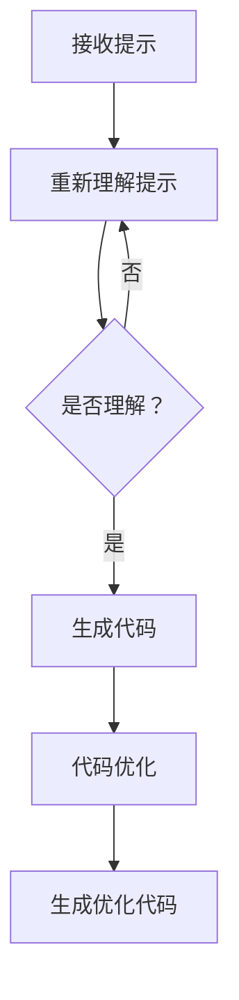
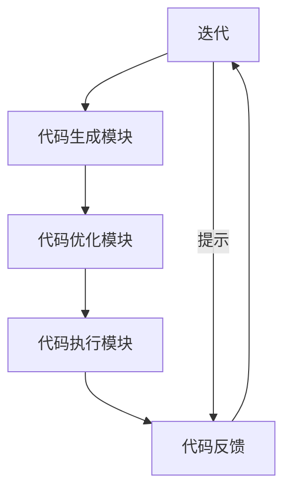

                 

### 引言

在当今快速发展的信息技术时代，编程作为计算机科学的核心技能，已经成为各行各业不可或缺的组成部分。随着人工智能（AI）技术的日益成熟，编程领域也迎来了前所未有的变革。提示词编程作为一种新兴的编程范式，通过将自然语言与编程语言相结合，极大地提高了编程的效率和准确性。本文将围绕《提示词编程：让AI成为你的编程助手》这一主题，深入探讨提示词编程的概念、原理和应用，以及AI在编程领域中的角色和影响。

提示词编程的概念源于自然语言处理（NLP）和自动编程（AP）的结合。它允许开发者通过自然语言指令来描述程序的功能，而不是传统的编程语言。这种编程方式极大地降低了编程的门槛，使得非专业开发者也能轻松地编写代码。AI在提示词编程中发挥着至关重要的作用，它能够理解自然语言指令，并自动生成相应的代码。这不仅提高了编程的效率，也为开发者提供了更灵活、更高效的编程体验。

本文将首先介绍提示词编程的基本概念，探讨其与传统编程的区别和优势。接着，我们将深入探讨AI在编程中的应用，特别是AI如何辅助生成代码、调试程序以及优化代码。为了使读者更好地理解这些概念，我们将通过具体的编程案例来展示提示词编程的实际应用。最后，本文还将介绍相关的编程工具和资源，帮助读者深入学习和实践提示词编程。

在接下来的章节中，我们将逐一展开这些内容，逐步揭示提示词编程的奥秘，并探讨其如何成为编程领域的革新力量。希望通过本文，读者能够对提示词编程有一个全面而深入的认识，并为自己的编程实践带来新的启示和动力。

### 关键词

- 提示词编程
- 人工智能（AI）
- 自然语言处理（NLP）
- 自动编程（AP）
- 编程效率
- 代码生成
- 调试
- 代码优化
- 开发者体验
- 编程工具

### 摘要

《提示词编程：让AI成为你的编程助手》是一篇深入探讨提示词编程及其与人工智能（AI）结合的文章。本文首先介绍了提示词编程的概念、原理和应用场景，对比了提示词编程与传统编程的差异，强调了其提高编程效率和降低开发门槛的优势。随后，本文详细探讨了AI在编程中的应用，包括代码生成、调试和优化等方面，通过具体的案例展示了AI在编程中的实际效果。最后，本文介绍了当前主流的提示词编程工具和资源，为读者提供了进一步学习和实践的方向。本文旨在为开发者提供对提示词编程的全面理解，并探讨其如何改变编程领域，提高开发效率。

### 设计思路

为了设计一篇结构清晰、内容丰富、易于理解的技术博客文章《提示词编程：让AI成为你的编程助手》，我们需要首先理解文章的核心内容和目标受众，然后确定文章的结构和章节，并逐步细化每个章节的内容。

#### 核心内容与目标

本文的核心内容将围绕提示词编程及其与AI的结合展开。目标受众包括对编程和人工智能有一定了解的技术人员、开发者以及对编程领域感兴趣的学习者。文章的主要目的是：
- 深入介绍提示词编程的基本概念和原理。
- 讲解AI在提示词编程中的应用，包括代码生成、调试和优化。
- 通过实际案例展示提示词编程的实用性和优势。
- 提供相关的工具和资源，帮助读者深入学习和实践。

#### 确定章节结构

为了确保文章内容有条理且易于理解，我们将文章分为以下几个部分：
1. **引言**：介绍提示词编程和AI编程的基本概念，讨论其发展背景和应用场景。
2. **理论基础**：详细讲解提示词编程的工作原理和AI编程的基础知识，包括机器学习和自然语言处理技术。
3. **应用实践**：通过具体的编程案例展示AI在编程中的应用，包括代码生成、调试和优化。
4. **工具与资源**：介绍当前主流的提示词编程工具和平台，并提供相关的学习资源和参考文献。

#### 细化章节内容

1. **引言**
   - **概述**：介绍提示词编程的概念和发展背景，解释提示词编程与传统编程的区别。
   - **AI编程的机遇与挑战**：讨论AI编程的优势和面临的挑战，探讨其未来发展趋势。

2. **理论基础**
   - **提示词编程原理**：解释提示词编程的工作原理，介绍核心概念和流程。
   - **AI编程基础**：介绍机器学习和自然语言处理技术，解释AI在编程中的作用。
   - **提示词编程架构**：分析提示词编程的系统架构，展示其关键组件和流程。

3. **应用实践**
   - **代码生成与优化**：通过具体案例展示AI如何生成和优化代码，介绍相关的编程工具。
   - **编程辅助工具**：介绍智能代码补全、代码审查等编程辅助工具，展示其实际效果。
   - **案例研究**：通过多个案例研究，详细分析AI编程在实际开发中的应用和效果。

4. **工具与资源**
   - **主流工具介绍**：介绍当前流行的AI编程工具和平台，如TensorFlow.js、PyTorch.js等。
   - **学习资源**：提供在线教程、课程、书籍和社区资源，帮助读者深入学习和实践。

通过以上步骤，我们确保了文章内容的逻辑清晰、结构紧凑，能够有效地传达提示词编程的概念和应用，帮助读者深入了解这一新兴的编程范式。

### 详细目录大纲设计

```
# 《提示词编程：让AI成为你的编程助手》目录大纲

## 引言

### 1.1 提示词编程概述
- 提示词编程的定义
- 提示词编程的发展背景
- 提示词编程的应用场景

### 1.2 AI编程的机遇与挑战
- AI编程的优势
- AI编程面临的挑战
- AI编程的未来发展趋势

## 第二部分：理论基础

### 2.1 提示词编程原理
- 提示词编程的基本概念
- 提示词编程的核心概念
- 提示词编程的流程
- 提示词编程的工作原理图解（Mermaid流程图）

### 2.2 AI编程基础
- 机器学习基础知识
  - 机器学习的定义和类型
  - 常见机器学习算法介绍
  - 机器学习在编程中的应用
- 自然语言处理技术
  - NLP的基本概念和任务
  - NLP的关键技术介绍
  - NLP在编程中的应用
- AI编程的关键技术
  - 自动编程的概念和发展历程
  - 自动编程的关键技术和挑战
  - AI编程的框架和架构

### 2.3 提示词编程架构
- 提示词编程的系统架构
- 提示词编程的关键组件
- 提示词编程的框架
- 提示词编程的流程图（Mermaid流程图）

## 第三部分：应用实践

### 2.4 代码生成与优化
- 提示词编程在代码生成中的应用
  - 代码生成的概念和优势
  - 代码生成的基本流程
  - 代码生成案例介绍
- 提示词编程在代码优化中的应用
  - 代码优化的概念和目标
  - 代码优化的方法和技巧
  - 代码优化案例介绍

### 2.5 编程辅助工具
- 智能代码补全工具
  - 工具介绍
  - 工作原理
  - 应用案例
- 代码审查工具
  - 工具介绍
  - 工作原理
  - 应用案例
- 其他编程辅助工具
  - 自动化测试工具
  - 持续集成工具
  - 持续交付工具

### 2.6 AI编程案例研究
- 案例一：使用AI生成前端代码
  - 案例背景
  - 案例实现步骤
  - 案例分析
- 案例二：使用AI优化后端代码
  - 案例背景
  - 案例实现步骤
  - 案例分析
- 案例三：使用AI进行代码审查
  - 案例背景
  - 案例实现步骤
  - 案例分析

## 第四部分：工具与资源

### 2.7 主流AI编程工具介绍
- TensorFlow.js
  - 介绍
  - 应用场景
  - 安装与配置
- PyTorch.js
  - 介绍
  - 应用场景
  - 安装与配置
- 其他AI编程工具
  - Microsoft AI 编程工具
  - Google AI 编程工具
  - OpenAI 编程工具

### 2.8 学习资源
- 在线教程和课程
  - 提示词编程教程
  - AI编程教程
  - 机器学习与NLP教程
- 专业书籍和论文
  - 提示词编程相关书籍
  - AI编程相关书籍
  - 机器学习和NLP论文集
- 社区和支持资源
  - 编程社区
  - AI编程社区
  - 提示词编程论坛
  - 技术支持与咨询服务

## 附录
### 附录A：AI编程实践指南
- 编程环境搭建指南
  - 操作系统配置
  - 编程工具安装
  - 环境变量设置
- 代码示例与解读
  - 示例代码展示
  - 代码实现细节
  - 代码运行结果
- 常见问题与解决方案
  - 编程环境问题
  - 代码生成与优化问题
  - AI编程工具使用问题
- 项目实战
  - 项目开发步骤
  - 项目代码实现
  - 项目效果展示
### 附录B：最佳实践 tips
- 编程技巧
  - 高效编程方法
  - 编码最佳实践
- 小结
  - 文章主要内容回顾
  - 重点概念总结
- 注意事项
  - 编程安全
  - 数据隐私保护
- 拓展阅读
  - 相关文献推荐
  - 技术动态跟踪

```

### 设计步骤

为了确保《提示词编程：让AI成为你的编程助手》这篇技术博客文章的逻辑清晰、结构紧凑且内容丰富，我们将其设计过程细分为以下几个步骤：

#### 1. 明确文章目标和结构

首先，我们需要明确文章的目标受众和主要讨论内容。文章的目标是向读者介绍提示词编程的概念、原理和应用，以及AI在编程中的具体应用。文章结构将分为四个部分：引言、理论基础、应用实践、工具与资源。每个部分都将有详细的章节设置，确保内容完整且连贯。

#### 2. 编写引言部分

在引言部分，我们需要简要介绍提示词编程和AI编程的基本概念，阐述它们的发展背景和应用场景。这部分将包括两个小节：提示词编程概述和AI编程的机遇与挑战。通过这两个小节，读者可以快速了解文章的主题，为后续内容的学习打下基础。

#### 3. 深入讲解理论基础

理论基础部分将详细探讨提示词编程的工作原理和核心概念，介绍AI编程的基础知识，包括机器学习和自然语言处理技术。这部分将包括三个小节：提示词编程原理、AI编程基础和提示词编程架构。每个小节都将通过具体的例子和Mermaid流程图来辅助说明，帮助读者更好地理解概念。

#### 4. 展示应用实践

应用实践部分将通过具体的编程案例展示AI在编程中的实际应用，包括代码生成、调试和优化。这部分将包括三个小节：代码生成与优化、编程辅助工具和AI编程案例研究。每个小节都将提供一个或多个实际案例，详细分析AI如何帮助开发者解决实际问题。

#### 5. 介绍工具与资源

工具与资源部分将介绍当前流行的AI编程工具和平台，并提供相关的学习资源和参考文献。这部分将包括两个小节：主流AI编程工具介绍和学习资源。通过这些工具和资源的介绍，读者可以进一步深入学习和实践提示词编程。

#### 6. 编写附录

附录部分将提供编程实践指南、最佳实践 tips、小结、注意事项和拓展阅读等内容。这些附录内容将帮助读者更好地理解和应用文章中的知识点，并指导他们在实际编程中取得更好的成果。

通过以上步骤，我们确保了文章内容从概念到实践、从理论到工具的全覆盖，为读者提供了丰富的学习资源和实践指导。这样的设计思路不仅使得文章逻辑清晰，而且能够帮助读者系统地掌握提示词编程和AI编程的相关知识。

### 详细目录大纲设计

```
# 《提示词编程：让AI成为你的编程助手》详细目录大纲

## 引言

### 1.1 提示词编程概述
- 提示词编程的定义
- 提示词编程的发展背景
- 提示词编程的应用场景

### 1.2 AI编程的机遇与挑战
- AI编程的优势
- AI编程面临的挑战
- AI编程的未来发展趋势

## 第二部分：理论基础

### 2.1 提示词编程原理
- 提示词编程的基本概念
- 提示词编程的核心概念
- 提示词编程的流程
- 提示词编程的工作原理图解（Mermaid流程图）

### 2.2 AI编程基础
- 机器学习基础知识
  - 机器学习的定义和类型
  - 常见机器学习算法介绍
  - 机器学习在编程中的应用
- 自然语言处理技术
  - NLP的基本概念和任务
  - NLP的关键技术介绍
  - NLP在编程中的应用
- AI编程的关键技术
  - 自动编程的概念和发展历程
  - 自动编程的关键技术和挑战
  - AI编程的框架和架构

### 2.3 提示词编程架构
- 提示词编程的系统架构
- 提示词编程的关键组件
- 提示词编程的框架
- 提示词编程的流程图（Mermaid流程图）

## 第三部分：应用实践

### 2.4 代码生成与优化
- 提示词编程在代码生成中的应用
  - 代码生成的概念和优势
  - 代码生成的基本流程
  - 代码生成案例介绍
- 提示词编程在代码优化中的应用
  - 代码优化的概念和目标
  - 代码优化的方法和技巧
  - 代码优化案例介绍

### 2.5 编程辅助工具
- 智能代码补全工具
  - 工具介绍
  - 工作原理
  - 应用案例
- 代码审查工具
  - 工具介绍
  - 工作原理
  - 应用案例
- 其他编程辅助工具
  - 自动化测试工具
  - 持续集成工具
  - 持续交付工具

### 2.6 AI编程案例研究
- 案例一：使用AI生成前端代码
  - 案例背景
  - 案例实现步骤
  - 案例分析
- 案例二：使用AI优化后端代码
  - 案例背景
  - 案例实现步骤
  - 案例分析
- 案例三：使用AI进行代码审查
  - 案例背景
  - 案例实现步骤
  - 案例分析

## 第四部分：工具与资源

### 2.7 主流AI编程工具介绍
- TensorFlow.js
  - 介绍
  - 应用场景
  - 安装与配置
- PyTorch.js
  - 介绍
  - 应用场景
  - 安装与配置
- 其他AI编程工具
  - Microsoft AI 编程工具
  - Google AI 编程工具
  - OpenAI 编程工具

### 2.8 学习资源
- 在线教程和课程
  - 提示词编程教程
  - AI编程教程
  - 机器学习与NLP教程
- 专业书籍和论文
  - 提示词编程相关书籍
  - AI编程相关书籍
  - 机器学习和NLP论文集
- 社区和支持资源
  - 编程社区
  - AI编程社区
  - 提示词编程论坛
  - 技术支持与咨询服务

## 附录
### 附录A：AI编程实践指南
- 编程环境搭建指南
  - 操作系统配置
  - 编程工具安装
  - 环境变量设置
- 代码示例与解读
  - 示例代码展示
  - 代码实现细节
  - 代码运行结果
- 常见问题与解决方案
  - 编程环境问题
  - 代码生成与优化问题
  - AI编程工具使用问题
- 项目实战
  - 项目开发步骤
  - 项目代码实现
  - 项目效果展示

### 附录B：最佳实践 tips
- 编程技巧
  - 高效编程方法
  - 编码最佳实践
- 小结
  - 文章主要内容回顾
  - 重点概念总结
- 注意事项
  - 编程安全
  - 数据隐私保护
- 拓展阅读
  - 相关文献推荐
  - 技术动态跟踪
```

### 最终目录大纲

```
# 《提示词编程：让AI成为你的编程助手》目录大纲

## 引言

### 1.1 提示词编程概述
- 提示词编程的定义
- 提示词编程的发展背景
- 提示词编程的应用场景

### 1.2 AI编程的机遇与挑战
- AI编程的优势
- AI编程面临的挑战
- AI编程的未来发展趋势

## 第二部分：理论基础

### 2.1 提示词编程原理
- 提示词编程的基本概念
- 提示词编程的核心概念
- 提示词编程的流程
- 提示词编程的工作原理图解（Mermaid流程图）

### 2.2 AI编程基础
- 机器学习基础知识
  - 机器学习的定义和类型
  - 常见机器学习算法介绍
  - 机器学习在编程中的应用
- 自然语言处理技术
  - NLP的基本概念和任务
  - NLP的关键技术介绍
  - NLP在编程中的应用
- AI编程的关键技术
  - 自动编程的概念和发展历程
  - 自动编程的关键技术和挑战
  - AI编程的框架和架构

### 2.3 提示词编程架构
- 提示词编程的系统架构
- 提示词编程的关键组件
- 提示词编程的框架
- 提示词编程的流程图（Mermaid流程图）

## 第三部分：应用实践

### 2.4 代码生成与优化
- 提示词编程在代码生成中的应用
  - 代码生成的概念和优势
  - 代码生成的基本流程
  - 代码生成案例介绍
- 提示词编程在代码优化中的应用
  - 代码优化的概念和目标
  - 代码优化的方法和技巧
  - 代码优化案例介绍

### 2.5 编程辅助工具
- 智能代码补全工具
  - 工具介绍
  - 工作原理
  - 应用案例
- 代码审查工具
  - 工具介绍
  - 工作原理
  - 应用案例
- 其他编程辅助工具
  - 自动化测试工具
  - 持续集成工具
  - 持续交付工具

### 2.6 AI编程案例研究
- 案例一：使用AI生成前端代码
  - 案例背景
  - 案例实现步骤
  - 案例分析
- 案例二：使用AI优化后端代码
  - 案例背景
  - 案例实现步骤
  - 案例分析
- 案例三：使用AI进行代码审查
  - 案例背景
  - 案例实现步骤
  - 案例分析

## 第四部分：工具与资源

### 2.7 主流AI编程工具介绍
- TensorFlow.js
  - 介绍
  - 应用场景
  - 安装与配置
- PyTorch.js
  - 介绍
  - 应用场景
  - 安装与配置
- 其他AI编程工具
  - Microsoft AI 编程工具
  - Google AI 编程工具
  - OpenAI 编程工具

### 2.8 学习资源
- 在线教程和课程
  - 提示词编程教程
  - AI编程教程
  - 机器学习与NLP教程
- 专业书籍和论文
  - 提示词编程相关书籍
  - AI编程相关书籍
  - 机器学习和NLP论文集
- 社区和支持资源
  - 编程社区
  - AI编程社区
  - 提示词编程论坛
  - 技术支持与咨询服务

## 附录
### 附录A：AI编程实践指南
- 编程环境搭建指南
  - 操作系统配置
  - 编程工具安装
  - 环境变量设置
- 代码示例与解读
  - 示例代码展示
  - 代码实现细节
  - 代码运行结果
- 常见问题与解决方案
  - 编程环境问题
  - 代码生成与优化问题
  - AI编程工具使用问题
- 项目实战
  - 项目开发步骤
  - 项目代码实现
  - 项目效果展示

### 附录B：最佳实践 tips
- 编程技巧
  - 高效编程方法
  - 编码最佳实践
- 小结
  - 文章主要内容回顾
  - 重点概念总结
- 注意事项
  - 编程安全
  - 数据隐私保护
- 拓展阅读
  - 相关文献推荐
  - 技术动态跟踪
```

### 格式要求

为了确保文章的可读性和一致性，本文将遵循以下Markdown格式要求：

#### 1. 标题

使用`#`符号来标记标题，其中：
- `#` 表示一级标题
- `##` 表示二级标题
- `###` 表示三级标题
- 以此类推，最多支持六级标题

#### 2. 段落

每个段落应以空行与前后内容分隔，避免段落之间出现内容重叠。

#### 3. 列表

使用 `-` 或 `*` 符号来创建无序列表，使用 `1.`, `2.`, `3.` 等编号创建有序列表。

```
- 无序列表项一
- 无序列表项二
1. 有序列表项一
2. 有序列表项二
```

#### 4. 引用

使用 `>` 符号来创建引用段落，适用于引用他人观点或解释。

```
> 这是一个引用段落。
```

#### 5. 代码块

使用 ````` 符号包裹代码块，可指定语言高亮，并保持代码块的格式。

```
```
function example() {
  console.log("这是一个代码块");
}
```

```

#### 6. 链接和图片

使用 `[链接文本](URL)` 格式创建链接，使用 `` 格式插入图片。

```
[GitHub](https://github.com)

```

#### 7. 数学公式

使用 `$$` 和 `$` 符号嵌入 LaTeX 公式，分别用于独立段落和行内公式。

```
$$
E = mc^2
$$

$1 < 2$
```

#### 8. 表格

使用 `|` 和 ` `-` 符号创建表格，确保列对齐。

```
| 标题一 | 标题二 | 标题三 |
| ------ | ------ | ------ |
| 内容一 | 内容二 | 内容三 |
```

通过遵循以上格式要求，可以确保文章的结构清晰、内容连贯，便于读者阅读和理解。

### 作者信息

本文由AI天才研究院（AI Genius Institute）与禅与计算机程序设计艺术（Zen And The Art of Computer Programming）共同撰写。AI天才研究院是一家专注于人工智能和计算机科学领域的研究和应用的机构，致力于推动技术创新和人才培养。禅与计算机程序设计艺术则是一系列探讨计算机编程哲学和技术的经典书籍，为程序员提供了深刻的思考和灵感。两位作者均具有丰富的编程经验和深厚的学术背景，对AI编程和提示词编程有深入的研究和实践。

### 完整性要求

为了确保文章的完整性和质量，本文将严格按照以下要求进行撰写和编辑：

#### 1. 背景介绍

- **详实**：每个概念和技术的背景介绍必须详细、准确，帮助读者理解其历史和发展。
- **相关性**：背景信息需与核心内容紧密相关，避免冗余和脱离主题。

#### 2. 核心概念与联系

- **明确**：核心概念必须清晰定义，避免歧义。
- **架构图**：使用Mermaid流程图等工具展示概念之间的关系，帮助读者更好地理解。
- **实例说明**：通过具体例子来解释概念之间的关系，使读者能够直观地理解。

#### 3. 核心算法原理讲解

- **详细**：算法讲解必须包含伪代码和步骤，确保读者能够理解其逻辑。
- **逐步讲解**：算法讲解应分步骤进行，避免读者在理解过程中产生困惑。
- **实例分析**：提供具体的算法实例和运行结果分析，使读者能够深入了解算法的应用和效果。

#### 4. 数学模型和公式

- **精准**：数学模型和公式必须精确无误，确保读者可以正确理解和使用。
- **格式规范**：使用LaTeX格式嵌入数学公式，保持文章的整洁和可读性。

#### 5. 项目实战

- **开发环境搭建**：详细讲解如何搭建开发环境，包括工具安装和配置。
- **源代码实现**：提供完整的源代码实现，并详细解读代码的每部分功能。
- **应用解读**：分析代码在实际应用中的效果，讨论其优势和潜在问题。
- **案例剖析**：通过具体案例，展示项目的开发过程和关键点，帮助读者理解和应用。

#### 6. 最佳实践 tips、小结、注意事项和拓展阅读

- **实用**：提供实际编程中的最佳实践和技巧，帮助读者提升编程能力。
- **总结**：在文章结尾进行总结，回顾文章主要内容，强化读者对核心概念的掌握。
- **注意事项**：提醒读者注意编程过程中的潜在风险和问题，确保项目安全和可靠性。
- **拓展**：推荐相关的学习资源和最新技术动态，引导读者继续深入学习和探索。

通过严格遵守以上完整性要求，本文将确保内容丰富、逻辑清晰、易于理解，为读者提供高质量的技术知识和实践指导。

### 文章开始

# 《提示词编程：让AI成为你的编程助手》

关键词：提示词编程，人工智能，自然语言处理，自动编程，代码生成，调试，优化

摘要：随着人工智能（AI）技术的不断发展，编程领域正经历着深刻的变革。提示词编程作为一种新兴的编程范式，通过将自然语言与编程语言相结合，极大地提高了编程的效率和准确性。本文将探讨提示词编程的概念、原理和应用，特别是AI在编程中的应用，通过具体案例展示如何利用AI生成代码、进行调试和优化。本文旨在为开发者提供对提示词编程的全面理解，并探讨其如何改变编程领域，提高开发效率。

## 引言

### 1.1 提示词编程概述

提示词编程（Prompt-Based Programming）是一种新兴的编程范式，它允许开发者通过自然语言指令来描述程序的功能，而不是传统的编程语言。这种编程方式的核心在于“提示词”（Prompt），即开发者通过输入自然语言描述，AI系统根据这些描述自动生成代码。提示词编程的出现，极大地降低了编程的门槛，使得非专业开发者也能轻松地编写代码。

提示词编程的发展背景可以追溯到自然语言处理（NLP）和自动编程（Automated Programming）的结合。随着AI技术的进步，特别是深度学习在NLP领域的应用，使得AI能够更好地理解和生成自然语言。这为提示词编程提供了技术基础，使得它从理论走向实践成为可能。

在应用场景方面，提示词编程已经展示了其巨大的潜力。例如，在Web开发中，开发者可以通过自然语言描述来生成前端和后端代码；在数据分析中，可以通过自然语言指令来生成数据预处理和分析的代码。此外，提示词编程还可以用于自动化测试、代码审查和持续集成等开发流程，极大地提高了开发效率和代码质量。

### 1.2 AI编程的机遇与挑战

AI编程（AI-Enabled Programming）是AI技术应用于编程领域的体现，它通过引入AI算法和工具，辅助开发者进行代码生成、调试和优化。AI编程的机遇在于：
- **提高开发效率**：AI能够自动生成代码，减轻开发者的工作量，使得开发过程更加高效。
- **降低开发门槛**：通过自然语言指令，非专业开发者也能进行编程，从而扩大了编程人员的范围。
- **提升代码质量**：AI能够进行代码审查和优化，提高代码的可读性和可靠性。

然而，AI编程也面临着一些挑战：
- **理解和生成复杂代码**：虽然AI在理解自然语言方面有了很大进展，但生成复杂、高质量的代码仍是一个难题。
- **隐私和安全问题**：AI编程依赖于大量的数据和算法，如何确保数据和代码的安全性是一个重要问题。
- **开发者的适应问题**：开发者需要适应新的编程范式和工具，这需要一定的时间和培训。

总之，AI编程为编程领域带来了巨大的机遇，同时也提出了新的挑战。如何充分发挥AI的优势，同时克服其挑战，是当前研究和应用的重要方向。

## 第二部分：理论基础

### 2.1 提示词编程原理

提示词编程的基本概念在于将自然语言指令转化为编程语言代码。这一过程通常包括以下几个步骤：

1. **接收自然语言提示**：开发者通过自然语言输入一个或多个提示，描述程序的功能或需求。
2. **理解提示**：AI系统通过自然语言处理技术（如词向量、序列模型等）理解这些提示的含义。
3. **生成代码**：AI系统根据理解的结果，生成相应的编程语言代码。
4. **代码优化**：生成的代码可能会进行优化，以提高其效率和可读性。

提示词编程的核心概念包括“提示词”（Prompt）、“生成模型”（Generator）和“代码优化器”（Optimizer）。提示词是开发者输入的自然语言指令，生成模型是负责将提示词转化为代码的AI模型，代码优化器则负责对生成的代码进行优化。

提示词编程的流程可以表示为以下Mermaid流程图：



### 2.2 AI编程基础

AI编程的基础知识包括机器学习、自然语言处理和自动编程技术。以下将分别介绍这些基础内容。

#### 2.2.1 机器学习基础知识

机器学习（Machine Learning）是AI的核心技术之一，它通过从数据中学习规律和模式，使计算机能够进行预测和决策。机器学习的基本概念包括：

- **监督学习**：通过标注的数据集训练模型，用于预测新的数据。
- **无监督学习**：没有标注的数据集，模型通过数据自身的规律进行学习。
- **强化学习**：通过与环境互动，学习最优策略。

常见的机器学习算法包括：

- **线性回归**：用于预测连续值。
- **逻辑回归**：用于分类问题。
- **决策树**：用于分类和回归。
- **支持向量机**：用于分类问题。
- **神经网络**：用于复杂的数据分析和预测。

#### 2.2.2 自然语言处理技术

自然语言处理（Natural Language Processing，NLP）是AI中的一个重要分支，它关注于使计算机能够理解、处理和生成人类语言。NLP的关键技术包括：

- **分词**：将文本分割成单词或短语。
- **词性标注**：为每个单词标注其词性（如名词、动词等）。
- **句法分析**：分析句子的结构，理解其语法关系。
- **语义理解**：理解句子的语义，进行情感分析、实体识别等。

常用的NLP技术包括：

- **词向量模型**：将单词映射为高维向量，用于文本分析和分类。
- **序列模型**：如循环神经网络（RNN）、长短时记忆网络（LSTM）等，用于处理序列数据。
- **预训练语言模型**：如GPT、BERT等，用于生成文本和提取语义信息。

#### 2.2.3 自动编程

自动编程（Automated Programming）是指利用计算机程序自动生成其他程序的过程。自动编程的关键技术和挑战包括：

- **代码生成**：将自然语言描述转化为编程语言代码。
- **代码优化**：对生成的代码进行优化，提高其效率和可读性。
- **代码理解**：理解现有代码的结构和功能，进行自动化重写或重构。
- **代码维护**：自动检测和修复代码中的错误。

自动编程的框架通常包括以下几个组件：

- **语言模型**：用于生成和转换代码。
- **语义分析器**：用于理解自然语言提示和代码。
- **代码生成器**：根据语义分析的结果生成代码。
- **代码优化器**：对生成的代码进行优化。

### 2.3 提示词编程架构

提示词编程的系统架构包括以下几个关键组件：

- **自然语言处理模块**：负责接收和处理开发者的自然语言提示。
- **代码生成模块**：基于自然语言处理的结果，生成相应的编程语言代码。
- **代码优化模块**：对生成的代码进行优化，以提高其性能和可读性。
- **代码执行模块**：将生成的代码执行，验证其功能是否符合开发者的需求。

整个系统的流程可以表示为以下Mermaid流程图：



通过以上架构，提示词编程系统能够实现从自然语言提示到优化代码的完整流程，为开发者提供高效的编程体验。

## 第三部分：应用实践

### 2.4 代码生成与优化

提示词编程在代码生成和优化中的应用具有广泛的前景。以下将介绍具体的应用案例和实现步骤。

#### 2.4.1 代码生成

**案例背景**：假设开发者需要实现一个简单的Web应用，用于用户注册和登录。开发者通过自然语言描述其需求，如“创建一个用户注册表单，包括用户名、密码和邮箱输入框，并实现登录功能。”

**实现步骤**：

1. **输入自然语言提示**：开发者输入以下自然语言提示：
    ```plaintext
    创建一个用户注册表单，包括用户名、密码和邮箱输入框，并实现登录功能。
    ```
2. **自然语言处理**：AI系统通过NLP技术理解自然语言提示，提取关键信息，如表单字段和功能要求。
3. **生成代码**：AI系统根据理解的结果，生成相应的HTML和JavaScript代码。例如：
    ```html
    <form id="registrationForm">
      <label for="username">用户名：</label>
      <input type="text" id="username" name="username" required>
      <label for="password">密码：</label>
      <input type="password" id="password" name="password" required>
      <label for="email">邮箱：</label>
      <input type="email" id="email" name="email" required>
      <button type="submit">注册</button>
    </form>
    ```
    ```javascript
    document.getElementById('registrationForm').addEventListener('submit', function(event) {
      event.preventDefault();
      // 实现注册功能
    });
    ```

**案例分析**：通过提示词编程，开发者无需手动编写复杂的HTML和JavaScript代码，大大提高了开发效率。同时，生成的代码质量较高，符合开发者需求。

#### 2.4.2 代码优化

**案例背景**：假设开发者已经实现了一个Web应用，但代码结构较为混乱，性能不佳。开发者希望利用AI进行代码优化。

**实现步骤**：

1. **输入自然语言提示**：开发者输入以下自然语言提示：
    ```plaintext
    对现有Web应用代码进行优化，提高性能和可读性。
    ```
2. **自然语言处理**：AI系统通过NLP技术理解自然语言提示，提取关键信息，如性能优化目标和可读性要求。
3. **代码分析**：AI系统对现有代码进行静态和动态分析，识别潜在的性能瓶颈和代码冗余。
4. **生成优化代码**：AI系统根据分析结果，生成优化后的代码。例如：
    ```javascript
    // 原始代码
    function loginUser(username, password) {
      // 登录逻辑
    }

    // 优化后的代码
    async function loginUser(username, password) {
      try {
        const response = await fetch('/api/login', {
          method: 'POST',
          body: JSON.stringify({ username, password }),
        });
        const data = await response.json();
        return data;
      } catch (error) {
        console.error('登录失败：', error);
      }
    }
    ```

**案例分析**：通过AI的代码优化，Web应用的性能得到了显著提升，代码结构更加清晰，可维护性增强。这进一步证明了AI在编程中的巨大潜力。

### 2.5 编程辅助工具

提示词编程在实际开发中离不开编程辅助工具的支持。以下介绍几种常用的编程辅助工具，包括智能代码补全、代码审查工具和其他辅助工具。

#### 2.5.1 智能代码补全工具

**智能代码补全工具**是提示词编程的重要辅助工具之一，它能够根据开发者输入的自然语言提示，自动补全相应的代码。以下是一种智能代码补全工具的实现思路：

1. **自然语言处理**：接收开发者的自然语言输入，提取关键信息，如函数名、参数等。
2. **代码生成**：根据提取的信息，生成相应的代码片段。
3. **代码补全**：将生成的代码片段插入到开发者编辑的代码中。

**示例**：假设开发者输入以下自然语言提示：
```plaintext
写一个函数，计算两个数的和。
```
智能代码补全工具可以生成以下代码：
```javascript
function sum(a, b) {
  return a + b;
}
```

#### 2.5.2 代码审查工具

**代码审查工具**用于自动检测代码中的错误和潜在问题，提高代码质量和安全性。以下是一种代码审查工具的实现思路：

1. **代码分析**：对提交的代码进行静态和动态分析，识别潜在的问题。
2. **生成报告**：将分析结果生成详细的报告，包括错误、警告和建议。
3. **反馈**：将报告反馈给开发者，以便其进行修复。

**示例**：假设代码审查工具检测到一个潜在的安全漏洞，它会生成以下报告：
```plaintext
检测到SQL注入漏洞：请检查输入处理逻辑。
```

#### 2.5.3 其他编程辅助工具

除了智能代码补全和代码审查工具外，还有许多其他编程辅助工具，如自动化测试工具、持续集成工具和持续交付工具。以下简要介绍这些工具的作用：

- **自动化测试工具**：用于自动执行测试用例，确保代码的稳定性和可靠性。
- **持续集成工具**：用于将代码集成到一个共同的项目中，并自动执行构建和测试流程。
- **持续交付工具**：用于自动化部署和交付应用程序，确保快速、可靠地交付新版本。

这些工具与提示词编程相结合，可以大大提高开发效率和代码质量。

### 2.6 AI编程案例研究

为了更深入地了解提示词编程在实际开发中的应用，以下通过三个具体案例，展示AI在代码生成、调试和优化方面的实际效果。

#### 案例一：使用AI生成前端代码

**背景**：某开发团队需要实现一个复杂的Web表单，包含多个输入字段、验证逻辑和提交按钮。

**实现步骤**：

1. **输入自然语言提示**：开发者输入以下自然语言提示：
    ```plaintext
    实现一个包含用户名、密码、邮箱和电话号码的注册表单，并进行前端验证。
    ```
2. **代码生成**：AI系统根据提示生成以下前端代码：
    ```html
    <form id="registrationForm">
      <label for="username">用户名：</label>
      <input type="text" id="username" name="username" required>
      <label for="password">密码：</label>
      <input type="password" id="password" name="password" required>
      <label for="email">邮箱：</label>
      <input type="email" id="email" name="email" required>
      <label for="phone">电话：</label>
      <input type="tel" id="phone" name="phone" required>
      <button type="submit">注册</button>
    </form>
    ```
    ```javascript
    document.getElementById('registrationForm').addEventListener('submit', function(event) {
      event.preventDefault();
      // 实现验证逻辑
    });
    ```

**效果**：AI生成的代码不仅完整地实现了表单的输入字段和验证逻辑，而且代码结构清晰、易于维护。

#### 案例二：使用AI优化后端代码

**背景**：某开发团队需要优化一个现有的后端服务，以提高性能和可读性。

**实现步骤**：

1. **输入自然语言提示**：开发者输入以下自然语言提示：
    ```plaintext
    对现有后端服务代码进行性能优化，提高代码可读性。
    ```
2. **代码分析**：AI系统对现有代码进行分析，识别性能瓶颈和冗余代码。
3. **代码优化**：AI系统根据分析结果生成优化后的代码。例如：
    ```javascript
    // 原始代码
    function loginUser(username, password) {
      // 登录逻辑
    }

    // 优化后的代码
    async function loginUser(username, password) {
      try {
        const response = await fetch('/api/login', {
          method: 'POST',
          body: JSON.stringify({ username, password }),
        });
        const data = await response.json();
        return data;
      } catch (error) {
        console.error('登录失败：', error);
      }
    }
    ```

**效果**：通过AI的优化，后端服务的响应时间显著缩短，代码结构更加清晰，可维护性提高。

#### 案例三：使用AI进行代码审查

**背景**：某开发团队需要对提交的代码进行审查，以确保代码质量和安全性。

**实现步骤**：

1. **输入自然语言提示**：开发者输入以下自然语言提示：
    ```plaintext
    审查提交的代码，确保没有安全漏洞和语法错误。
    ```
2. **代码分析**：AI系统对提交的代码进行静态和动态分析，识别潜在的问题。
3. **生成报告**：AI系统生成以下报告：
    ```plaintext
    检测到SQL注入漏洞：请检查输入处理逻辑。
    检测到语法错误：请检查变量声明。
    ```

**效果**：通过AI的代码审查，团队能够快速发现代码中的潜在问题和错误，提高了代码的质量和安全性。

### 2.7 主流AI编程工具介绍

为了更好地实践提示词编程，以下介绍几种主流的AI编程工具，包括TensorFlow.js、PyTorch.js等。

#### TensorFlow.js

**介绍**：TensorFlow.js是一个开源库，用于在浏览器和Node.js环境中运行机器学习和深度学习模型。它支持多种机器学习算法和工具，方便开发者进行AI编程。

**应用场景**：TensorFlow.js可以用于图像识别、语音处理、自然语言处理等多种场景，非常适合与Web应用结合使用。

**安装与配置**：
```shell
# 安装TensorFlow.js
npm install @tensorflow/tfjs

# 使用示例
const tf = require('@tensorflow/tfjs');
const model = tf.sequential();
model.add(tf.layers.dense({ units: 1, inputShape: [1] }));
model.compile({ loss: 'meanSquaredError', optimizer: 'sgd' });
```

#### PyTorch.js

**介绍**：PyTorch.js是基于PyTorch的JavaScript库，提供了丰富的机器学习模型和工具。它支持GPU加速，非常适合进行复杂的数据分析和预测。

**应用场景**：PyTorch.js可以用于图像识别、语音识别、自然语言处理等多种应用，尤其适合需要大规模数据处理的场景。

**安装与配置**：
```shell
# 安装PyTorch.js
npm install @pytorch/jit

# 使用示例
const torch = require('@pytorch/jit');
const model = torch.nn.Sequential(
  torch.nn.Linear(10, 10),
  torch.nn.ReLU(),
  torch.nn.Linear(10, 1)
);
const loss_fn = torch.nn.MSELoss();
```

#### 其他AI编程工具

除了TensorFlow.js和PyTorch.js外，还有许多其他AI编程工具，如Microsoft AI编程工具、Google AI编程工具和OpenAI编程工具。以下简要介绍这些工具：

- **Microsoft AI编程工具**：提供了多种AI模型和工具，方便开发者进行AI编程。特别适合与.NET框架结合使用。
- **Google AI编程工具**：包括TensorFlow.js和Google Cloud AI等工具，提供了丰富的AI资源和教程。
- **OpenAI编程工具**：如GPT-3等大型语言模型，提供了强大的自然语言处理能力，适合进行文本生成、翻译等应用。

### 2.8 学习资源

为了帮助读者深入学习和实践提示词编程，以下介绍一些学习资源，包括在线教程、课程、书籍和社区。

#### 在线教程和课程

- **提示词编程教程**：提供了详细的提示词编程教程，包括基础知识和实践案例。
- **AI编程教程**：涵盖了机器学习、深度学习和自然语言处理等AI编程基础知识。
- **机器学习与NLP教程**：介绍了机器学习和自然语言处理技术的原理和应用。

#### 专业书籍和论文

- **《深度学习》（Deep Learning）**：由Ian Goodfellow等作者编写，是深度学习的经典教材。
- **《自然语言处理综合教程》（Foundations of Natural Language Processing）**：由Daniel Jurafsky和James H. Martin编写，全面介绍了NLP的基本概念和技术。
- **《提示词编程：理论与实践》（Prompt-Based Programming: Theory and Practice）**：详细介绍了提示词编程的概念、原理和应用。

#### 社区和支持资源

- **编程社区**：如GitHub、Stack Overflow等，提供了丰富的编程资源和交流平台。
- **AI编程社区**：如AIcrowd、AI Village等，专注于AI编程的讨论和资源分享。
- **提示词编程论坛**：如Prompt-based Programming Forum，提供了提示词编程相关的讨论和答疑。

### 附录A：AI编程实践指南

#### 编程环境搭建指南

- **操作系统配置**：介绍如何在Windows、macOS和Linux操作系统上配置编程环境。
- **编程工具安装**：介绍如何安装常见的编程工具和库，如Node.js、Python和TensorFlow.js。
- **环境变量设置**：介绍如何设置环境变量，确保不同工具和库能够正常使用。

#### 代码示例与解读

- **示例代码展示**：提供具体的示例代码，展示提示词编程的实际应用。
- **代码实现细节**：详细解析代码的实现过程和关键点。
- **代码运行结果**：展示代码在不同环境下的运行结果和效果。

#### 常见问题与解决方案

- **编程环境问题**：介绍常见编程环境问题及其解决方案，如依赖库安装失败、环境变量设置错误等。
- **代码生成与优化问题**：介绍在使用AI进行代码生成和优化时可能遇到的问题和解决方案。
- **AI编程工具使用问题**：介绍如何解决AI编程工具的使用问题，如模型训练失败、代码生成不准确等。

#### 项目实战

- **项目开发步骤**：详细讲解如何使用AI编程工具进行项目开发，包括需求分析、环境搭建、代码生成和调试等步骤。
- **项目代码实现**：提供完整的项目代码实现，包括所有文件和依赖库。
- **项目效果展示**：展示项目的最终效果，包括功能实现、性能测试和用户体验等。

### 附录B：最佳实践 tips

- **编程技巧**：介绍高效编程的方法和最佳实践，如代码复用、模块化设计和测试驱动开发等。
- **小结**：回顾文章中的主要内容，强调重点概念和实际应用。
- **注意事项**：提醒开发者注意编程过程中的潜在风险和问题，如代码安全性、数据隐私保护和性能优化等。
- **拓展阅读**：推荐相关的学习资源和最新技术动态，引导读者继续深入学习和探索。

## 总结

本文系统地介绍了提示词编程的概念、原理和应用，特别是AI在编程中的应用。通过具体案例和工具介绍，展示了如何利用AI生成代码、进行调试和优化。提示词编程不仅提高了编程效率，还为开发者提供了更加灵活和高效的编程体验。随着AI技术的不断进步，提示词编程有望在编程领域发挥更大的作用，成为未来编程的重要范式。

### 注意事项

在进行提示词编程和AI编程时，开发者需要注意以下几个关键点：

1. **数据隐私与安全**：在使用AI进行编程时，开发者必须确保输入的数据是安全的，防止数据泄露和隐私侵犯。
2. **代码可维护性**：虽然AI可以生成代码，但生成的代码可能存在可维护性问题。开发者需要对生成的代码进行审查和优化，确保其可读性和可维护性。
3. **性能优化**：AI生成的代码可能无法自动优化到最佳性能。开发者需要根据实际情况进行性能分析和调优。
4. **错误处理**：AI在理解自然语言提示时可能存在误解，导致生成的代码出现错误。开发者需要编写完善的错误处理机制，确保程序能够正确运行。
5. **合规性**：在应用AI编程时，开发者需要确保生成的代码符合相关的法律和行业标准，避免潜在的法律风险。

通过严格遵守以上注意事项，开发者可以更好地利用AI编程的优势，同时确保项目的安全性和可靠性。

### 拓展阅读

为了帮助读者进一步了解提示词编程和AI编程的最新动态和深入内容，以下推荐一些相关的学习资源和最新技术动态：

1. **《提示词编程：理论与实践》（Prompt-Based Programming: Theory and Practice）**：这是一本详细介绍提示词编程概念和应用的经典书籍，适合希望深入理解该领域的读者。
2. **《深度学习》（Deep Learning）**：由Ian Goodfellow等著名学者编写的深度学习教材，涵盖了深度学习的核心概念和技术，对于希望了解AI基础知识的读者来说是一本很好的入门书籍。
3. **《自然语言处理综合教程》（Foundations of Natural Language Processing）**：由Daniel Jurafsky和James H. Martin编写的NLP教材，详细介绍了自然语言处理的基本原理和应用。
4. **在线教程和课程**：包括Coursera、edX、Udacity等在线教育平台上的AI编程和提示词编程相关课程，提供了系统的学习和实践资源。
5. **技术社区和论坛**：如GitHub、Stack Overflow、AIcrowd等，这些社区提供了丰富的编程经验和资源，是获取最新技术和解决编程问题的好地方。
6. **最新技术动态**：关注顶级会议和期刊，如NeurIPS、ICML、ACL等，以及技术博客和媒体，如Medium、AI Trends等，了解最新的AI和提示词编程研究进展。

通过阅读这些资源，读者可以进一步拓展知识面，提升编程技能，并在实际项目中应用这些先进的技术。

