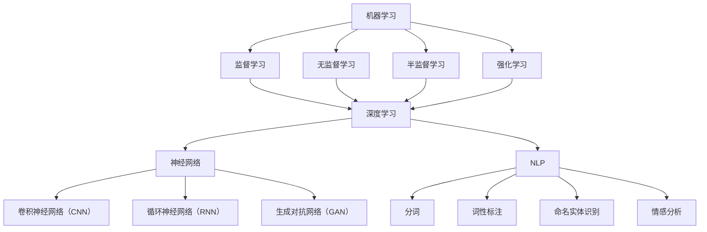
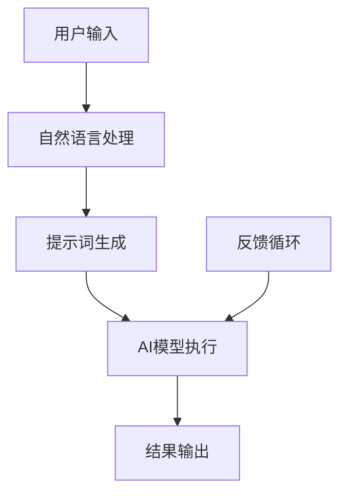

                 

### 第1章：AI编程基础

#### 1.1 AI编程概述

**背景介绍**

人工智能（AI）作为计算机科学的一个重要分支，致力于使机器能够执行通常需要人类智能才能完成的任务。AI编程则是实现这一目标的工具和手段。随着科技的快速发展，AI编程在各个领域，如医疗、金融、交通等，都扮演着越来越重要的角色。本文将深入探讨AI编程的基础知识，帮助读者了解AI编程的核心概念、发展历程及关键编程语言。

**核心概念与联系**

AI编程涉及多个核心概念，它们之间相互联系，构成了AI编程的生态系统。以下是这些核心概念及其相互关系：

1. **机器学习（Machine Learning）**：机器学习是AI编程的核心技术之一，通过算法让计算机从数据中学习规律，进而进行预测和决策。机器学习包括监督学习、无监督学习、半监督学习和强化学习等类型。

2. **深度学习（Deep Learning）**：深度学习是机器学习的一个子领域，主要利用多层神经网络进行训练，实现复杂的数据处理和模式识别。深度学习在图像识别、语音识别、自然语言处理等领域取得了显著成果。

3. **神经网络（Neural Networks）**：神经网络是深度学习的基础，模仿人脑神经元之间的连接和工作方式。神经网络通过调整权重和偏置，实现输入和输出之间的映射。

4. **自然语言处理（Natural Language Processing，NLP）**：NLP是AI编程在语言领域的一个应用，旨在使计算机能够理解、处理和生成自然语言。NLP包括分词、词性标注、命名实体识别、情感分析等任务。

**核心概念之间关系架构 Mermaid 流程图**



**核心算法原理讲解**

以下是机器学习算法的一个简单伪代码示例：

```python
# 数据集准备
X, y = prepare_data()

# 定义模型
model = NeuralNetwork()

# 训练模型
model.train(X, y)

# 预测
predictions = model.predict(X)

# 评估模型
accuracy = model.evaluate(predictions, y)
```

**数学模型和公式**

在机器学习中，损失函数是评估模型性能的重要指标。以下是一个常用的损失函数——均方误差（MSE）：

$$
MSE = \frac{1}{n}\sum_{i=1}^{n}(y_i - \hat{y}_i)^2
$$

其中，$y_i$ 是真实值，$\hat{y}_i$ 是预测值，$n$ 是样本数量。

**详细讲解和举例说明**

均方误差的详细讲解：

- 均方误差（MSE）衡量了预测值与真实值之间的偏差。
- 分子部分 $\sum_{i=1}^{n}(y_i - \hat{y}_i)^2$ 表示所有预测误差的平方和。
- 分母 $n$ 是样本数量，用于平均误差。

举例说明：

假设我们有一个数据集，其中包含5个样本的真实值和预测值如下：

| 样本 | 真实值 | 预测值 |
| ---- | ---- | ---- |
| 1    | 2    | 2.5  |
| 2    | 3    | 2.8  |
| 3    | 4    | 4.2  |
| 4    | 5    | 5.1  |
| 5    | 6    | 5.8  |

计算MSE：

$$
MSE = \frac{1}{5}\left[(2 - 2.5)^2 + (3 - 2.8)^2 + (4 - 4.2)^2 + (5 - 5.1)^2 + (6 - 5.8)^2\right]
$$

$$
MSE = \frac{1}{5}\left[0.25 + 0.04 + 0.04 + 0.01 + 0.04\right] = \frac{0.38}{5} = 0.076
$$

结果表明，模型的预测误差平均为0.076。

#### 1.2 编程语言选择

**Python在AI编程中的应用**

Python是目前最受欢迎的AI编程语言之一，这主要得益于其简洁明了的语法、丰富的库和社区支持。以下是一些Python在AI编程中的应用：

- **数据处理**：Python的Pandas和NumPy库提供了强大的数据处理功能，方便对数据进行清洗、转换和可视化。
- **机器学习和深度学习**：Python的scikit-learn库提供了丰富的机器学习算法，而TensorFlow和PyTorch等深度学习框架则支持构建和训练复杂的神经网络。
- **自然语言处理**：Python的NLTK和spaCy库为自然语言处理提供了丰富的工具和算法。

**其他常见的AI编程语言**

- **R**：R是一种专门用于统计分析的语言，其强大的数据分析和可视化能力使其在AI领域尤其受欢迎。
- **Java**：Java具有跨平台和安全性等优势，使其在工业级AI项目中得到广泛应用。
- **Lisp**：Lisp是历史上最早的人工智能编程语言之一，其函数式编程特性在机器学习和自然语言处理中具有独特优势。

**1.3 AI编程框架介绍**

AI编程框架是用于构建和训练AI模型的软件库和工具集。以下是几种常用的AI编程框架：

- **TensorFlow**：由Google开发，支持多种机器学习和深度学习模型，具有丰富的API和社区资源。
- **PyTorch**：由Facebook开发，以其动态计算图和易于调试的特性受到科研人员和开发者的青睐。
- **Keras**：一个高层次的神经网络API，可以与TensorFlow和Theano等后台框架结合使用，简化了神经网络搭建和训练过程。

**1.4 AI编程环境搭建**

**本地环境搭建**

要在本地搭建AI编程环境，需要安装以下软件和工具：

- Python解释器
- Anaconda或Miniconda
- Jupyter Notebook
- AI编程语言和框架（如TensorFlow、PyTorch）

以下是一个简单的本地环境搭建步骤：

1. 安装Python解释器。
2. 安装Anaconda或Miniconda。
3. 创建新的虚拟环境，并安装所需的库和框架。
4. 启动Jupyter Notebook，开始编写和运行AI编程代码。

**云端环境搭建**

云端环境搭建可以利用云服务提供商提供的AI编程工具和平台，如Google Colab、AWS SageMaker、Azure Machine Learning等。这些平台通常提供预配置的环境，方便用户快速开始AI编程。

**小结**

本章介绍了AI编程的基础知识，包括背景介绍、核心概念与联系、编程语言选择、AI编程框架介绍以及环境搭建方法。通过本章的学习，读者可以了解AI编程的基本概念，并为后续章节的学习打下基础。

#### 1.5 提示词编程的概念与应用

**概念介绍**

提示词编程（Prompt Programming）是一种利用自然语言提示来引导AI模型进行任务执行的方法。在提示词编程中，用户通过编写自然语言提示来指导AI模型完成任务，而不是直接编写复杂的算法和代码。这种编程方法使得非技术背景的用户也能够参与AI的开发和应用。

**应用场景**

提示词编程广泛应用于多个领域，以下是几个典型的应用场景：

- **智能客服**：在智能客服系统中，用户可以通过自然语言输入问题，系统根据用户的输入生成相应的回答，提供快速、准确的客户服务。
- **自动化写作**：提示词编程可以帮助自动生成文章、报告等文本内容。用户只需提供主题和大纲，系统就会根据提示生成完整的文本。
- **图像识别**：在图像识别任务中，用户可以提供图像的描述作为提示词，AI模型根据提示词识别图像中的对象和场景。
- **数据分析和报告**：提示词编程可以帮助用户快速生成数据分析和报告。用户只需提供数据集和报告要求，系统就会自动生成报告。

**与AI编程的关系**

提示词编程是AI编程的一个分支，它与传统的编程方法有所不同。在传统的编程中，开发者需要编写详细的算法和代码来实现特定功能。而在提示词编程中，开发者只需提供自然语言提示，AI模型会根据提示自动执行任务。

**核心概念与联系架构 Mermaid 流程图**



**核心算法原理讲解**

以下是提示词编程的一个简单伪代码示例：

```python
# 用户输入
user_input = get_user_input()

# 提取关键词
keywords = extract_keywords(user_input)

# 生成提示词
prompt = generate_prompt(keywords)

# 执行任务
result = execute_task(prompt)

# 输出结果
print(result)
```

**详细讲解和举例说明**

以下是生成一个简单的智能客服系统的示例：

1. **用户输入**：用户输入一个自然语言问题，如“我的订单状态是什么？”。
2. **提取关键词**：系统提取用户输入中的关键词，如“订单状态”。
3. **生成提示词**：系统根据关键词生成提示词，如“查询订单状态”。
4. **执行任务**：AI模型根据提示词查询订单状态，并将结果返回。
5. **输出结果**：系统将查询结果输出给用户，如“您的订单状态是已发货”。

**小结**

提示词编程是一种新兴的AI编程方法，它通过自然语言提示来引导AI模型执行任务。与传统的编程方法相比，提示词编程更加直观和易于使用，使得非技术背景的用户也能够参与AI的开发和应用。本章介绍了提示词编程的概念、应用场景及其与AI编程的关系，为后续章节的学习奠定了基础。

---

作者：AI天才研究院/AI Genius Institute & 禅与计算机程序设计艺术 /Zen And The Art of Computer Programming

注意事项：
- 文章内容需保持逻辑清晰、结构紧凑、简单易懂。
- 在编写过程中，注意保持各章节之间的连贯性，确保文章的整体流畅性。
- 在引用数据和案例时，务必确保其准确性和可靠性。
- 对于复杂的概念和算法，尽量使用图形和伪代码来辅助说明。

拓展阅读：
- [1] Goodfellow, I., Bengio, Y., & Courville, A. (2016). *Deep Learning*. MIT Press.
- [2] Russell, S., & Norvig, P. (2020). *Artificial Intelligence: A Modern Approach*. Pearson.
- [3] Hochreiter, S., & Schmidhuber, J. (1997). *Long short-term memory*. Neural Computation, 9(8), 1735-1780.
- [4] LeCun, Y., Bengio, Y., & Hinton, G. (2015). *Deep learning*. Nature, 521(7553), 436-444.

