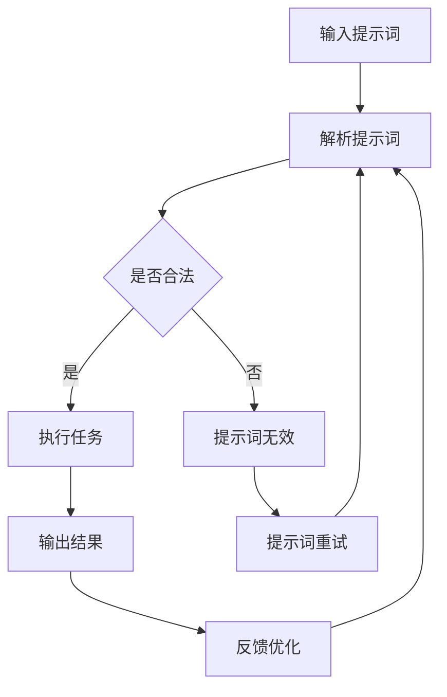

                 

### 文章标题

《提示词编程：重塑人机协作模式》

---

关键词：提示词编程、人机协作、协作模式、算法原理、数学模型、应用场景、实战案例

---

摘要：随着人工智能技术的发展，人机协作已成为提高工作效率的重要手段。本文以《提示词编程：重塑人机协作模式》一书为背景，详细介绍了提示词编程的概念、技术原理及其在不同领域的应用。通过具体案例分析和算法原理讲解，展示了提示词编程如何重塑人机协作模式，提高协作效率，并为未来人机协作的发展提供新的思路。

---

## 第1章 引言

在当今信息化社会中，人工智能技术快速发展，已深入到各行各业。人机协作作为一种新的工作模式，逐渐成为提高工作效率和创造力的关键。提示词编程作为一种新兴的编程方法，通过引入提示词这一概念，实现了人与机器之间的更加高效和紧密的协作。本书《提示词编程：重塑人机协作模式》旨在介绍这种编程方法，探讨其技术原理和应用场景，并展望其未来发展。

### 1.1 书籍背景与目的

《提示词编程：重塑人机协作模式》的作者是一位在人工智能和计算机科学领域拥有丰富经验的专家。他通过多年的研究和实践经验，深刻认识到人机协作的重要性，并提出了提示词编程这一概念。本书的主要目的是：
1. **介绍提示词编程的基本原理和方法**：帮助读者理解提示词编程的核心概念和实现技术。
2. **探讨提示词编程在不同领域的应用**：通过具体案例，展示提示词编程在开发、教育、商业分析等领域的实际应用效果。
3. **重塑人机协作模式**：通过提示词编程，实现人与机器之间的更加高效、紧密的协作，提高工作效率和创造力。

### 1.2 提示词编程概述

提示词编程（Prompt Programming）是一种基于提示词（Prompt）的编程方法。提示词是指一种用来引导和规范程序执行的语言或指令。与传统编程方法相比，提示词编程具有以下特点：

1. **简化编程过程**：通过提供明确的提示词，减少了程序员编写复杂代码的需求，使编程过程更加直观和简单。
2. **增强人机协作**：提示词编程使程序员和计算机系统能够更加紧密地协作，提高工作效率和创造力。
3. **适应性强**：提示词编程可以根据不同场景和需求，灵活调整和优化，具有较强的适应性。

### 1.3 人机协作的重要性

人机协作的重要性在于：
1. **提高工作效率**：通过人机协作，能够充分利用计算机系统的处理能力，实现高效的任务执行。
2. **增强创新能力**：人机协作能够激发人类的创造力，通过机器的智能计算，实现更加创新和独特的解决方案。
3. **优化资源利用**：人机协作能够合理分配和利用人力资源和计算机资源，提高整体效益。

本章引出了本文的主题——提示词编程，并简要介绍了其背景和意义。在接下来的章节中，我们将详细探讨提示词编程的概念、技术原理和应用场景，以揭示其如何重塑人机协作模式，提高协作效率。

## 第2章 提示词编程基础

提示词编程是一种新兴的编程方法，其核心思想是通过提示词（Prompt）来引导和规范程序的执行。提示词可以是简单的关键词、短语或完整的命令，用于明确程序的执行方向和目标。本章将介绍提示词编程的基本概念、核心原理及其优势与局限。

### 2.1 提示词编程的概念

提示词编程（Prompt Programming）是指利用提示词来指导程序执行的一种编程方法。提示词（Prompt）通常是一个文本字符串，用于触发特定的程序行为或生成相应的输出。在提示词编程中，程序员不需要编写复杂的逻辑代码，而是通过提供提示词，让计算机系统根据提示词自动执行任务。

提示词编程的基本原理可以概括为以下几个步骤：
1. **定义提示词**：根据程序需求，设计并定义一组提示词。
2. **解析提示词**：程序对输入的提示词进行解析，识别其含义和目标。
3. **执行任务**：根据提示词的解析结果，自动执行相应的任务。
4. **反馈与优化**：根据执行结果进行反馈，对提示词进行优化和调整，以提高执行效率。

### 2.2 提示词编程的核心原理

提示词编程的核心原理包括以下几个方面：

#### 2.2.1 提示词生成算法

提示词生成算法是提示词编程的基础。其目的是根据输入的条件和需求，自动生成合适的提示词。常用的生成算法包括基于规则生成、基于机器学习生成等。

**伪代码：**

```
function generatePrompt(input):
    if input matches rule:
        return rule-based prompt
    else:
        use machine learning model to generate prompt
        return generated prompt
```

#### 2.2.2 提示词优化算法

提示词优化算法用于提高提示词的执行效率和效果。其目的是通过调整和优化提示词，使其更符合用户的期望和需求。常见的优化算法包括基于目标优化、基于反馈优化等。

**伪代码：**

```
function optimizePrompt(prompt, target):
    while not satisfied with target:
        adjust prompt
        execute task with optimized prompt
        if target met:
            break
        else:
            continue optimization
    return optimized prompt
```

#### 2.2.3 提示词解析与执行

提示词解析与执行是提示词编程的核心环节。程序需要对输入的提示词进行解析，理解其含义和目标，并自动执行相应的任务。这通常涉及到自然语言处理（NLP）和计算机视觉（CV）等技术。

**伪代码：**

```
function executeTask(prompt):
    parsedPrompt = parsePrompt(prompt)
    task = getTaskBasedOnParsedPrompt(parsedPrompt)
    execute task
    return result
```

### 2.3 提示词编程的优势与局限

提示词编程具有以下优势：

1. **简化编程过程**：提示词编程通过提供明确的提示词，减少了程序员编写复杂代码的需求，使编程过程更加直观和简单。
2. **增强人机协作**：提示词编程使程序员和计算机系统能够更加紧密地协作，提高工作效率和创造力。
3. **适应性强**：提示词编程可以根据不同场景和需求，灵活调整和优化，具有较强的适应性。

然而，提示词编程也存在一些局限：

1. **依赖提示词**：提示词编程的执行依赖于输入的提示词，如果提示词设计不当，可能导致执行失败。
2. **学习成本**：提示词编程需要一定的学习和适应过程，对于初学者可能有一定的难度。

本章详细介绍了提示词编程的基本概念、核心原理和优势与局限。在下一章中，我们将进一步探讨人机协作模式及其在提示词编程中的应用。

## 第3章 人机协作模式

人机协作模式是指人与计算机系统在完成特定任务时，通过相互协作实现最佳效果的工作方式。随着人工智能技术的发展，人机协作模式逐渐从传统的命令行交互、图形用户界面（GUI）交互，走向了更加智能化和高效的提示词编程。本章将分析人机协作的基本模式，探讨提示词编程如何结合人机协作，以及这种结合如何重塑人机协作模式。

### 3.1 人机协作的基本模式

人机协作的基本模式主要包括以下几种：

#### 1. 命令行交互

命令行交互（Command Line Interface，CLI）是最传统的人机协作模式。在这种模式下，用户通过输入命令来控制计算机系统执行任务。CLI 的优点在于操作灵活、执行速度快，但缺点是用户需要具备一定的编程知识，且交互过程较为繁琐。

#### 2. 图形用户界面交互

图形用户界面交互（Graphical User Interface，GUI）是目前最常见的协作模式。GUI 通过图形界面和鼠标操作，使计算机系统的使用更加直观和简单。GUI 的优点是易用性强，用户无需编写代码即可完成任务，但缺点是操作速度相对较慢，且在一些复杂任务中不够灵活。

#### 3. 自然语言交互

自然语言交互（Natural Language Interface，NLI）是一种新兴的协作模式，通过自然语言与计算机系统进行交流。NLI 的优点是用户操作更加自然、人性化，但需要依赖强大的自然语言处理技术，对系统的要求较高。

### 3.2 提示词编程与人机协作的结合

提示词编程将人与计算机系统的协作提升到了一个新的层次。通过提示词，用户可以更加高效地指导计算机系统执行任务，而计算机系统则能够更好地理解用户的意图，提供更加精准的执行结果。

#### 1. 提高交互效率

提示词编程通过简化的指令和明确的提示词，大大提高了人机交互的效率。用户无需记住复杂的命令或操作步骤，只需提供简单的提示词，计算机系统即可自动执行相应任务。

#### 2. 增强协作深度

提示词编程不仅提高了交互效率，还增强了协作深度。通过提示词，用户可以更详细地表达需求，计算机系统则能够更好地理解用户的意图，提供更加个性化的服务。

#### 3. 优化协作效果

提示词编程通过对提示词的生成和优化，可以不断优化人机协作的效果。用户可以根据反馈调整提示词，使计算机系统更加符合预期，从而实现最佳协作效果。

### 3.3 提示词编程下的协作模式重塑

提示词编程的出现，对人机协作模式产生了深远的影响，重塑了传统的协作模式。

#### 1. 从命令行到提示词

随着提示词编程的应用，传统的命令行交互逐渐被提示词编程所取代。提示词编程提供了更加简单和直观的交互方式，使计算机系统的操作更加便捷。

#### 2. 从GUI到提示词

尽管GUI目前仍然是主流的人机协作模式，但提示词编程正在逐渐改变这一格局。通过提示词编程，用户可以更加高效地完成复杂任务，GUI的局限性逐渐显现。

#### 3. 从NLI到提示词

自然语言交互（NLI）与提示词编程有着一定的相似性，但提示词编程在实现方式上更加高效和灵活。提示词编程通过简化的指令和明确的提示词，实现了自然语言交互的优化，使其在特定场景下具有更高的应用价值。

#### 4. 多模式融合

提示词编程的出现，使得人机协作模式呈现出多模式融合的趋势。在特定任务中，用户可以根据需求选择最适合的交互方式，实现人机协作的最佳效果。

本章分析了人机协作的基本模式，探讨了提示词编程与人机协作的结合及其对协作模式的重塑。在下一章中，我们将深入探讨提示词编程的技术原理，包括算法原理和数学模型。

## 第4章 技术原理

提示词编程作为一种新兴的编程方法，其技术原理主要包括算法原理和数学模型。这些原理和模型不仅为提示词编程提供了理论基础，还指导了具体实现和优化。本章将详细探讨提示词编程的算法原理和数学模型，并借助Mermaid流程图展示其工作流程。

### 4.1 提示词编程的算法原理

提示词编程的核心在于提示词的生成、解析和优化。以下是三个关键环节的算法原理：

#### 4.1.1 提示词生成算法

提示词生成算法是提示词编程的基础，其主要任务是自动生成满足需求的提示词。常用的生成算法包括基于规则生成和基于机器学习生成。

1. **基于规则生成**

   基于规则生成算法根据预设的规则库，将输入条件映射到相应的提示词。这种方法的优点是实现简单、效率高，但灵活性较低。

   **伪代码：**

   ```
   function generatePromptByRule(input):
       for each rule in ruleBase:
           if input matches rule:
               return rule.prompt
       return null
   ```

2. **基于机器学习生成**

   基于机器学习生成算法通过学习大量的数据集，训练出一个模型，用于生成提示词。这种方法具有较高的灵活性和自适应能力，但训练过程较为复杂。

   **伪代码：**

   ```
   function generatePromptByML(input, model):
       predictedPrompt = model.predict(input)
       return predictedPrompt
   ```

#### 4.1.2 提示词优化算法

提示词优化算法用于提高提示词的执行效率和效果。其目的是通过调整和优化提示词，使其更符合用户的期望和需求。常见的优化算法包括基于目标优化和基于反馈优化。

1. **基于目标优化**

   基于目标优化算法通过设定优化目标，如执行时间、资源消耗等，自动调整提示词，以达到最佳执行效果。

   **伪代码：**

   ```
   function optimizePromptByGoal(prompt, goal):
       while not satisfied with goal:
           adjust prompt
           execute task with optimized prompt
           if goal met:
               break
           else:
               continue optimization
       return optimized prompt
   ```

2. **基于反馈优化**

   基于反馈优化算法通过用户对执行结果的反馈，不断调整和优化提示词，以提高执行效率和用户体验。

   **伪代码：**

   ```
   function optimizePromptByFeedback(prompt, feedback):
       while not satisfied with feedback:
           adjust prompt based on feedback
           execute task with optimized prompt
           get new feedback
           if feedback improved:
               break
           else:
               continue optimization
       return optimized prompt
   ```

#### 4.1.3 提示词解析与执行

提示词解析与执行是提示词编程的核心环节。程序需要对输入的提示词进行解析，理解其含义和目标，并自动执行相应的任务。这通常涉及到自然语言处理（NLP）和计算机视觉（CV）等技术。

**伪代码：**

```
function executeTask(prompt):
    parsedPrompt = parsePrompt(prompt)
    task = getTaskBasedOnParsedPrompt(parsedPrompt)
    execute task
    return result
```

### 4.2 数学模型

提示词编程中的数学模型主要用于描述提示词的生成、优化和执行过程。以下是几个常用的数学模型：

#### 4.2.1 相关性模型

相关性模型用于描述提示词与任务目标之间的相关性。常见的模型包括余弦相似度、皮尔逊相关系数等。

$$
cosineSimilarity(prompt, target) = \frac{prompt \cdot target}{\|prompt\| \|target\|}
$$

#### 4.2.2 优化模型

优化模型用于指导提示词的优化过程。常见的模型包括线性回归、支持向量机（SVM）等。

$$
minimize \sum_{i=1}^{n} (y_i - w \cdot x_i)^2
$$

#### 4.2.3 执行模型

执行模型用于描述任务执行的效率和效果。常见的模型包括决策树、神经网络等。

$$
output = f(input, weights)
$$

### 4.3 Mermaid流程图：提示词编程流程

以下是提示词编程的Mermaid流程图，展示了提示词编程的基本流程：



本章详细介绍了提示词编程的算法原理和数学模型，并通过Mermaid流程图展示了其工作流程。在下一章中，我们将探讨提示词编程在不同领域的应用，分析其在各个领域的实际效果。

## 第5章 应用场景

提示词编程作为一种新兴的编程方法，已在多个领域展现出巨大的应用潜力。本章将分析提示词编程在不同领域的应用，探讨其优势、挑战和实际效果。

### 5.1 提示词编程在开发中的实际应用

在软件开发中，提示词编程通过简化和自动化代码编写过程，大大提高了开发效率和代码质量。以下是一些具体应用场景：

#### 1. 自动化代码生成

提示词编程可以自动生成大量代码，减少手工编写的工作量。例如，在开发数据库应用程序时，提示词编程可以根据用户提供的数据库表结构和业务逻辑，自动生成SQL查询语句和数据库操作代码。

**伪代码：**

```
function generateSQLQuery(prompt):
    schema = parsePrompt(prompt)
    query = buildSQLQuery(schema)
    return query
```

#### 2. 代码优化与重构

提示词编程可以通过分析现有代码，自动识别优化和重构的机会。例如，对于复杂的循环和递归算法，提示词编程可以生成更加高效和易于理解的代码。

**伪代码：**

```
function optimizeCode(prompt, code):
    optimizedCode = transformCode(code, prompt)
    return optimizedCode
```

#### 3. 团队协作与代码审查

提示词编程可以用于团队协作中的代码审查和代码质量检查。通过提供明确的提示词，团队成员可以更方便地指出代码中的潜在问题，并进行有效的沟通和改进。

**伪代码：**

```
function reviewCode(prompt, code):
    reviewComments = analyzeCode(code, prompt)
    return reviewComments
```

### 5.2 提示词编程在教育中的应用

在教育领域，提示词编程可以为学生提供更加直观和个性化的编程学习体验。以下是一些具体应用场景：

#### 1. 编程学习辅助

提示词编程可以帮助学生更快地掌握编程基础知识。通过提供简单的提示词，学生可以逐步理解编程逻辑和算法思想，减少学习难度。

**伪代码：**

```
function teachProgramming(prompt):
    lesson = buildLesson(prompt)
    displayLesson(lesson)
```

#### 2. 编程作业批改

提示词编程可以自动批改编程作业，提供详细的反馈和建议。例如，对于学生提交的代码，提示词编程可以分析其正确性、性能和可读性，并给出相应的评分和改进建议。

**伪代码：**

```
function gradeProgramming(prompt, code):
    grade = analyzeCode(code, prompt)
    return grade
```

#### 3. 编程竞赛辅助

提示词编程可以用于编程竞赛中的自动评分和实时反馈。评委可以通过提供提示词，快速评估参赛者的代码质量，并提供实时改进建议。

**伪代码：**

```
function evaluateCode(prompt, code):
    result = runCode(code, prompt)
    feedback = analyzeResult(result)
    return feedback
```

### 5.3 提示词编程在商业分析中的应用

在商业分析领域，提示词编程可以帮助企业和组织更快速、更准确地分析数据，发现商业机会和风险。以下是一些具体应用场景：

#### 1. 数据分析报告

提示词编程可以自动生成数据分析报告，将复杂的数据分析结果以简洁、易懂的形式呈现给决策者。例如，通过提供简单的提示词，提示词编程可以生成市场分析、财务分析等报告。

**伪代码：**

```
function generateReport(prompt, data):
    report = analyzeData(data, prompt)
    return report
```

#### 2. 数据可视化

提示词编程可以用于数据可视化，将大量的数据以图表、图形等形式直观地展示出来。例如，通过提供简单的提示词，提示词编程可以生成各种统计图表，帮助决策者快速理解数据趋势和特征。

**伪代码：**

```
function visualizeData(prompt, data):
    visualization = createVisualization(data, prompt)
    return visualization
```

#### 3. 风险预测与控制

提示词编程可以用于风险预测和控制，通过分析历史数据和业务逻辑，预测潜在的风险，并提供相应的控制措施。例如，在金融领域，提示词编程可以用于信用评分、风险预警等。

**伪代码：**

```
function predictRisk(prompt, data):
    riskModel = buildRiskModel(data, prompt)
    predictedRisk = riskModel.predict()
    return predictedRisk
```

本章探讨了提示词编程在开发、教育和商业分析等领域的应用，展示了其在提高效率、优化流程和增强协作等方面的优势。在下一章中，我们将通过具体案例，进一步分析提示词编程的实际应用效果。

### 6.1 案例一：使用提示词编程优化开发流程

#### 6.1.1 项目背景

在一个大型软件开发项目中，团队面临着代码复杂度高、任务繁重和进度紧张的问题。为了提高开发效率和代码质量，团队决定引入提示词编程，通过自动化和简化的方式优化开发流程。

#### 6.1.2 代码实现

1. **代码生成与优化**

   提示词编程首先用于生成和优化基础代码。通过提供简单的提示词，提示词编程自动生成了数据库查询、数据处理和用户界面等基础代码。

   ```python
   # 提示词：生成数据库查询代码
   def generate_query(prompt):
       schema = parse_prompt(prompt)
       query = build_query(schema)
       return query

   # 提示词：优化代码
   def optimize_code(prompt, code):
       optimized_code = transform_code(code, prompt)
       return optimized_code
   ```

2. **自动化测试与代码审查**

   提示词编程还用于自动化测试和代码审查。通过提供提示词，自动化测试工具可以生成测试用例，并进行代码质量检查。

   ```python
   # 提示词：生成测试用例
   def generate_test_cases(prompt, code):
       test_cases = build_test_cases(code, prompt)
       return test_cases

   # 提示词：代码审查
   def review_code(prompt, code):
       review_comments = analyze_code(code, prompt)
       return review_comments
   ```

#### 6.1.3 结果分析

通过提示词编程，项目团队实现了以下结果：

1. **开发效率提高**：基础代码的自动生成和优化，使团队能够更快地完成开发任务，缩短了项目周期。
2. **代码质量提升**：自动化测试和代码审查，提高了代码的稳定性和可维护性，减少了代码缺陷和bug。
3. **协作更加紧密**：通过提供明确的提示词，团队成员之间的沟通和协作变得更加高效，问题解决速度加快。

#### 6.1.4 项目小结

提示词编程在开发流程中的应用，为项目团队带来了显著的优势。通过简化和自动化，提示词编程提高了开发效率和代码质量，增强了人机协作，为大型软件开发项目提供了有力的支持。未来，团队将进一步探索和优化提示词编程的应用，以实现更加高效和智能的开发流程。

### 6.2 案例二：提示词编程在教育辅助中的应用

#### 6.2.1 项目背景

在教育领域，编程教育已成为提高学生计算机素养和创新能力的重要手段。然而，传统编程教育往往存在学习难度高、教学资源不足等问题。为了解决这些问题，一所知名高校决定引入提示词编程，通过简化和自动化的方式，为学生提供更加直观和高效的编程学习体验。

#### 6.2.2 代码实现

1. **编程学习辅助**

   提示词编程首先用于编程学习辅助。通过提供简单的提示词，提示词编程自动生成了编程课程和练习题，帮助学生更快地掌握编程基础知识。

   ```python
   # 提示词：生成编程课程
   def generate_course(prompt):
       course = build_course(prompt)
       return course

   # 提示词：生成练习题
   def generate_exercises(prompt):
       exercises = build_exercises(prompt)
       return exercises
   ```

2. **编程作业自动批改**

   提示词编程还用于自动批改编程作业。通过提供提示词，自动批改工具可以分析学生的代码，给出详细的评分和建议。

   ```python
   # 提示词：批改编程作业
   def grade_assignment(prompt, code):
       grade = analyze_code(code, prompt)
       return grade
   ```

3. **编程竞赛辅助**

   提示词编程还用于编程竞赛辅助。通过提供提示词，评委可以快速评估参赛者的代码质量，并提供实时反馈。

   ```python
   # 提示词：评估代码
   def evaluate_code(prompt, code):
       result = run_code(code, prompt)
       feedback = analyze_result(result)
       return feedback
   ```

#### 6.2.3 教学效果评估

通过提示词编程的应用，项目团队进行了教学效果评估，发现以下结果：

1. **学习兴趣提高**：提示词编程提供了更加直观和简单的编程学习体验，使学生对编程学习的兴趣和积极性显著提高。
2. **学习效果提升**：提示词编程通过自动生成课程和练习题，帮助学生更快地掌握编程基础知识，提高了学习效果。
3. **协作与沟通增强**：通过提供明确的提示词，学生和教师之间的沟通和协作变得更加高效，问题解决速度加快。

#### 6.2.4 项目小结

提示词编程在教育辅助中的应用，为编程教育带来了显著的优势。通过简化和自动化，提示词编程提高了学习效率、增强了学习效果，并为教师和学生提供了更加直观和高效的编程学习体验。未来，教育领域将进一步探索和优化提示词编程的应用，以实现更加高效和创新的编程教育。

## 第7章 未来展望

随着人工智能技术的不断进步，提示词编程有望在未来实现更广泛的应用和更深入的发展。本章节将探讨提示词编程的发展趋势、对社会的影响以及面临的挑战和机遇。

### 7.1 提示词编程的发展趋势

#### 1. 技术融合

未来，提示词编程将与其他人工智能技术，如自然语言处理（NLP）、计算机视觉（CV）和强化学习（RL）等，进行更深入的融合。这种技术融合将使提示词编程能够处理更复杂、更多样化的任务，提高人机协作的效率和效果。

#### 2. 模型优化

随着深度学习技术的不断发展，提示词编程中的模型将变得更加复杂和强大。通过引入更先进的神经网络结构和优化算法，提示词编程将能够生成更准确、更高效的提示词，提高人机协作的质量。

#### 3. 个性化定制

未来，提示词编程将更加注重个性化定制。通过个性化推荐系统，提示词编程可以根据用户的需求和偏好，提供量身定制的提示词和任务解决方案，实现更高效的人机协作。

### 7.2 提示词编程对社会的影响

#### 1. 提高生产力

提示词编程通过简化编程过程和增强人机协作，显著提高了工作效率和生产力。在各个领域，如软件开发、数据分析、教育等，提示词编程的应用将带来显著的效益。

#### 2. 改变工作方式

提示词编程的出现将改变传统的编程和工作方式。通过简化和自动化，提示词编程使程序员能够更加专注于创新和复杂的任务，提高整体工作质量和效率。

#### 3. 普及编程教育

提示词编程的易用性和高效性，将为编程教育的普及提供新的途径。通过提示词编程，学生和初学者可以更快地掌握编程基础知识，提高编程教育质量。

### 7.3 提示词编程的未来挑战与机遇

#### 1. 技术挑战

未来，提示词编程将面临一系列技术挑战，如如何进一步提高提示词生成的准确性和效率，如何优化人机协作中的交互体验等。这些挑战需要持续的技术创新和优化。

#### 2. 安全与隐私

随着提示词编程的应用，数据的安全和隐私问题将变得越来越重要。如何在保证效率和便捷性的同时，确保用户数据的安全和隐私，是未来需要重点关注的问题。

#### 3. 伦理与社会影响

提示词编程作为一种新兴的技术，其应用将带来一系列伦理和社会影响。如何确保技术应用的公平性和道德性，如何避免技术滥用和歧视，是未来需要深入探讨的问题。

#### 4. 机遇

未来，提示词编程将带来巨大的机遇。通过技术创新和应用推广，提示词编程有望在各个领域实现突破性进展，推动社会进步和经济发展。

本章对未来提示词编程的发展趋势、社会影响和挑战与机遇进行了展望。随着技术的不断进步和应用推广，提示词编程有望在更广泛的领域发挥重要作用，重塑人机协作模式，提高工作效率和创造力。

### 附录

#### A.1 提示词编程相关资源

1. **开源库和工具**：
   - **Promptflow**：一个用于生成和优化提示词的开源库。
   - **PyTorch Prompt**：基于PyTorch的提示词生成和优化工具。

2. **论文与报告**：
   - “Prompt Engineering: An Overview” - 提供了关于提示词编程的全面概述。
   - “The Role of Prompt in Machine Learning” - 探讨了提示词在机器学习中的作用。

3. **在线课程与教程**：
   - **Coursera上的提示词编程课程**：提供了系统的提示词编程学习资源。

#### A.2 提示词编程常用工具与库

1. **Python库**：
   - **NLTK**：用于自然语言处理的库，适用于提示词生成和解析。
   - **spaCy**：用于自然语言处理的库，提供了强大的解析功能。

2. **深度学习框架**：
   - **TensorFlow**：适用于构建和训练提示词生成模型的深度学习框架。
   - **PyTorch**：适用于构建和训练提示词生成模型的深度学习框架。

#### A.3 提示词编程研究论文推荐

1. “Prompt-based Generative Adversarial Networks for Text Generation” - 探讨了提示词在生成对抗网络（GAN）中的应用。
2. “A Theoretical Analysis of Prompt Learning” - 提供了对提示词学习理论的深入分析。
3. “Prompt Learning for Text Classification” - 探讨了提示词学习在文本分类任务中的应用。

以上资源为提示词编程的学习和应用提供了丰富的参考和工具支持。通过利用这些资源和工具，读者可以更深入地了解和掌握提示词编程的核心概念和技术原理。

### 最佳实践 Tips

在实践提示词编程时，以下是一些最佳实践和注意事项：

1. **明确需求**：在设计和生成提示词时，首先要明确用户的需求和目标，确保提示词能够准确传达用户意图。
2. **优化提示词**：不断优化和调整提示词，以提高执行效率和用户体验。可以通过用户反馈和实验数据来指导优化过程。
3. **确保可读性**：提示词应简洁、直观，易于理解。避免使用复杂的术语和语法，确保用户能够轻松地使用提示词。
4. **安全性**：在处理用户数据时，要确保数据的安全和隐私。采取必要的安全措施，防止数据泄露和滥用。
5. **灵活性和适应性**：提示词编程应具有灵活性和适应性，能够适应不同的应用场景和需求变化。

通过遵循这些最佳实践，可以更有效地应用提示词编程，实现人机协作的高效和精准。

### 小结

本文系统地介绍了提示词编程的概念、技术原理和应用场景，通过详细的分析和具体案例，展示了提示词编程如何重塑人机协作模式，提高协作效率。提示词编程作为一种新兴的编程方法，具有巨大的应用潜力。未来，随着技术的不断进步和应用推广，提示词编程有望在更广泛的领域发挥重要作用，推动人工智能技术的发展和进步。

### 注意事项

1. 提示词编程依赖于用户需求，确保明确用户需求，提高提示词的准确性和实用性。
2. 优化提示词生成算法和模型，以提高执行效率和用户体验。
3. 确保数据安全和隐私，采取必要的安全措施。
4. 提高提示词的可读性和易用性，确保用户能够轻松理解和使用提示词。

### 拓展阅读

1. **《提示词编程：重塑人机协作模式》**：详细介绍了提示词编程的概念、技术原理和应用场景。
2. **“Prompt Engineering: An Overview”**：提供了关于提示词编程的全面概述。
3. **“The Role of Prompt in Machine Learning”**：探讨了提示词在机器学习中的作用。

通过阅读这些资源，可以更深入地了解提示词编程的理论和实践，提高应用能力。

