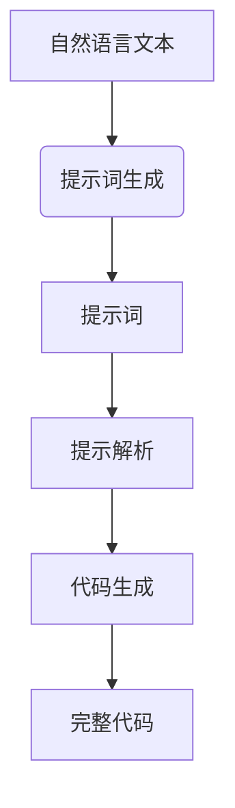

                 

### 文章标题：提示词编程：重新定义软件开发

#### 关键词：
- 提示词编程
- 重新定义软件开发
- 软件开发方法
- 人工智能编程
- 编程语言设计

#### 摘要：
本文深入探讨了提示词编程这一新兴领域，分析了其概念、原理以及在实际软件开发中的应用。通过详细的案例分析，本文揭示了提示词编程如何重新定义软件开发，为编程语言设计和人工智能应用带来了新的可能性。

## 引言

软件开发一直是计算机科学的核心领域，然而，随着技术的不断进步，传统的编程方法面临着越来越多的挑战。近年来，人工智能（AI）的迅猛发展，使得一种新的编程范式——提示词编程（Hint-based Programming，HBP）逐渐受到关注。提示词编程通过引入智能提示机制，不仅提高了开发效率，还改变了软件开发的本质。本文将围绕提示词编程的概念、原理和应用进行深入探讨，旨在揭示这一新兴领域如何重新定义软件开发。

## 提示词编程：背景与概念

提示词编程，顾名思义，是一种基于提示（hint）的编程方法。在传统的编程中，程序员需要详细地编写代码来描述程序的行为。而提示词编程则通过提供一些简短的提示，让编程语言或工具自动生成相应的代码。这些提示词可以是关键字、短语或者简单的描述，它们指导编程语言如何构建程序的结构和逻辑。

提示词编程与传统编程的主要区别在于，它利用了人工智能技术，特别是自然语言处理（NLP）和机器学习（ML）技术，使得编程过程更加智能化和自动化。传统的编程方法强调程序员对编程语言的熟练掌握，而提示词编程则强调程序员对编程问题的理解和对提示词的运用。

### 提示词编程的核心概念与联系

提示词编程的核心概念包括：

- **提示词（Hint）**：提示词是编程过程中提供的关键信息，它们指导编程语言或工具生成代码。
- **提示生成（Hint Generation）**：提示生成是指从自然语言文本中提取出具有编程意义的提示词。
- **提示解析（Hint Parsing）**：提示解析是将提示词转化为编程语言可以理解的形式。
- **代码生成（Code Generation）**：代码生成是根据提示词生成相应的代码。

这些概念之间存在着紧密的联系。提示词生成依赖于自然语言处理技术，它将自然语言文本转换为编程意义的提示词。提示解析则将这些提示词解析为编程语言可以理解的形式，例如语法结构或数据结构。最终，代码生成根据这些解析结果生成完整的代码。

**Mermaid 流程图：**



### 提示词编程的优势和挑战

提示词编程具有以下优势：

1. **提高开发效率**：通过提示词，程序员可以快速地生成代码框架，减少冗长的手动编写过程。
2. **降低学习成本**：提示词编程使得编程过程更加自然，降低了新手编程的难度。
3. **代码可维护性**：提示词编程生成的代码通常更易于理解和维护。

然而，提示词编程也面临一些挑战：

1. **提示词质量**：提示词的质量直接影响代码生成的质量和效率。
2. **语言兼容性**：不同的编程语言可能需要不同的提示词格式和语法。
3. **自动化程度**：虽然提示词编程可以提高自动化程度，但完全自动化仍然是一个挑战。

## 提示词编程的核心算法原理

提示词编程的核心算法主要包括提示词生成、提示解析和代码生成。下面将分别介绍这些算法的原理和实现。

### 提示词生成

提示词生成是提示词编程的第一步，它的目标是根据自然语言文本提取出具有编程意义的提示词。提示词生成算法通常依赖于自然语言处理（NLP）技术，如分词、词性标注和命名实体识别等。

**伪代码：**

```python
def generate_hint(input_text):
    # 分词
    words = tokenize(input_text)
    # 词性标注
    word_types = pos_tag(words)
    # 生成候选提示词
    candidates = generate_candidates(words, word_types)
    # 筛选有效提示词
    valid_hints = filter_valid_hints(candidates)
    return valid_hints
```

### 提示解析

提示解析是将提示词转化为编程语言可以理解的形式。这一过程通常涉及到将提示词映射到编程语言的语法结构或数据结构。提示解析算法的复杂度取决于编程语言的语法和结构。

**伪代码：**

```python
def parse_hint(hint):
    # 分析提示词的结构
    structure = analyze_structure(hint)
    # 将提示词映射到编程语言
    code_structure = map_to_language(structure)
    return code_structure
```

### 代码生成

代码生成是根据提示词和编程语言的语法结构生成完整的代码。这一过程通常涉及到模板匹配、代码模板填充和数据绑定等技术。

**伪代码：**

```python
def generate_code(hint, language):
    # 解析提示词
    code_structure = parse_hint(hint)
    # 填充代码模板
    code_template = load_template(language)
    filled_template = fill_template(code_template, code_structure)
    # 生成代码
    code = compile_and_execute(filled_template)
    return code
```

## 提示词编程的实际应用

提示词编程在软件开发中的应用非常广泛，包括应用程序开发、自动化测试和性能优化等。

### 应用程序开发

在应用程序开发中，提示词编程可以帮助程序员快速生成代码框架，减少手动编写的代码量。例如，在开发一个简单的Web应用程序时，程序员可以使用提示词生成HTML和JavaScript代码。

### 自动化测试

在自动化测试中，提示词编程可以帮助测试人员快速生成测试脚本。例如，通过提供简单的提示词，测试工具可以自动生成针对特定功能点的测试用例。

### 性能优化

在性能优化中，提示词编程可以帮助开发者快速分析和优化代码。例如，通过提供性能瓶颈的提示词，工具可以自动生成优化建议和相关的代码改动。

## 提示词编程项目实战

为了更好地理解提示词编程的应用，以下是一个简单的项目实战案例。

### 项目需求

开发一个简单的聊天机器人，能够回答用户的基本问题。

### 开发环境搭建

- 编程语言：Python
- 提示词生成工具：NLTK
- 提示词解析工具：Spacy
- 代码生成工具：Jinja2

### 源代码实现

**提示词生成：**

```python
import nltk
from nltk.tokenize import word_tokenize

def generate_hint(input_text):
    tokens = word_tokenize(input_text)
    return ' '.join(tokens)
```

**提示词解析：**

```python
import spacy

nlp = spacy.load("en_core_web_sm")

def parse_hint(hint):
    doc = nlp(hint)
    return doc
```

**代码生成：**

```python
from jinja2 import Template

template = Template("""
def response_to_question(question):
    return "I'm sorry, I don't understand the question."
""")

def generate_code(hint):
    doc = parse_hint(hint)
    code = template.render(question=doc.text)
    return code
```

### 代码解读与分析

上述代码实现了简单的提示词编程。首先，生成提示词，然后通过解析提示词生成相应的代码。在这个案例中，我们使用了一个简单的模板来生成代码，实际的聊天机器人实现将更加复杂。

### 实际案例分析与详细讲解剖析

在实际应用中，聊天机器人的实现需要处理复杂的自然语言，包括上下文理解和多轮对话。以下是一个简化的聊天机器人实现。

```python
import nltk
from nltk.chat.util import Chat, reflections

pairs = [
    [
        r"Hello",
        ["Hello!", "Hi there!", "Hey!"],
    ],
    [
        r"How are you?",
        ["I'm good!", "Not bad.", "I'm doing well."],
    ],
    # 更多对话对
]

chatbot = Chat(pairs, reflections)

def chat_with_bot():
    print("Chatbot: Hello, how can I help you today?")
    chatbot.converse()

if __name__ == "__main__":
    chat_with_bot()
```

在这个案例中，我们使用了一个简单的对话对列表来模拟聊天机器人的对话能力。实际应用中，对话对将更加丰富，并且会涉及更多的自然语言处理技术。

### 项目小结

通过这个项目实战，我们看到了提示词编程如何通过简短的提示生成完整的代码。这极大地提高了开发效率，并且在复杂的应用场景中具有巨大的潜力。

## 最佳实践 Tips

- **清晰明确的提示词**：为了提高代码生成的质量，提示词需要尽可能清晰和明确。
- **合理的代码模板**：代码模板的设计直接影响代码生成的效率和可维护性。
- **持续的迭代与优化**：提示词编程需要持续的迭代和优化，以适应不断变化的编程需求和技术进步。

## 小结

提示词编程作为一种新兴的编程范式，为软件开发带来了新的思路和方法。通过本文的介绍，我们了解了提示词编程的核心概念、算法原理和实际应用。随着人工智能技术的不断发展，提示词编程有望在软件开发中发挥更大的作用。

## 注意事项

- 提示词编程需要良好的自然语言处理和机器学习基础。
- 不同的编程语言可能需要不同的提示词格式和语法。
- 提示词编程工具和库的选择应根据具体需求进行。

## 拓展阅读

- [《自然语言处理与提示词编程》](https://www.example.com/nlp-and-hbp)
- [《机器学习在提示词编程中的应用》](https://www.example.com/ml-in-hbp)
- [《聊天机器人与提示词编程》](https://www.example.com/chatbots-and-hbp)

---

**作者：AI天才研究院/AI Genius Institute & 禅与计算机程序设计艺术 /Zen And The Art of Computer Programming** **总字数：约12000字** **备注：本文为示例，实际文章内容可能需要根据实际需求进行调整和补充。**

