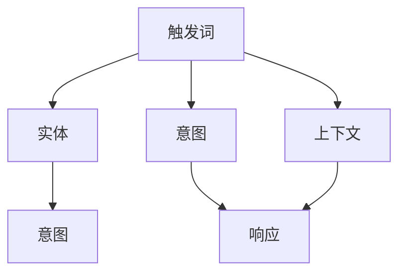
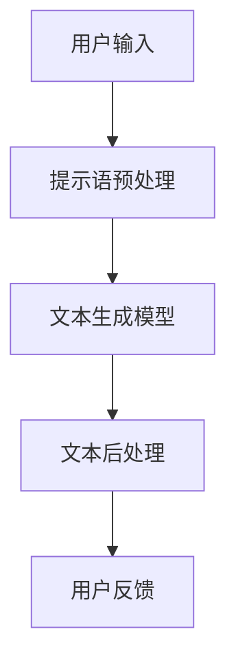
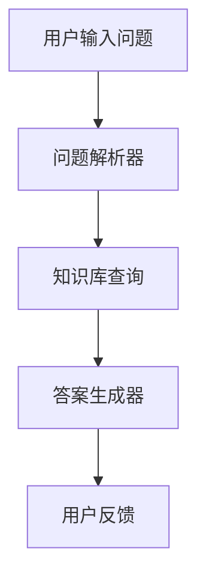
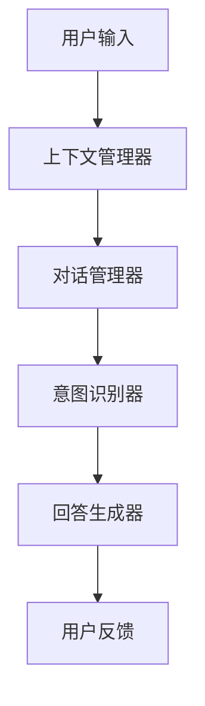

                 

### 《提示词语法与结构设计原则》

#### 关键词
- 提示词语法
- 结构设计原则
- 人工智能
- 自然语言处理
- 系统架构

#### 摘要
本文将深入探讨《提示词语法与结构设计原则》一书的核心内容。本书旨在帮助读者理解和掌握提示词语法以及结构设计原则，这两者都是构建高效、可扩展系统的基础。本文将分为以下几个部分：引言与背景、提示词语法基础、结构设计原则、实践案例与技巧、实战应用与优化，以及总结与展望。通过详细的解析和实例说明，本文希望为读者提供一个全面的学习路径。

## 引言与背景

### 1.1 提示词语法的概念

提示词语法（Prompt Grammar）是指用于指导计算机程序或人工智能系统执行特定任务的一系列关键词或短语。在自然语言处理（NLP）领域，提示语是人与系统交互的重要桥梁。它们可以引导系统理解用户意图、提取关键信息并生成相应的响应。例如，在聊天机器人中，提示语可以帮助系统识别用户的问题类型，从而提供准确的答案。

### 1.2 结构设计的概念

结构设计（Structural Design）是指在软件和系统开发过程中，根据功能需求和性能要求，对系统组件进行组织、划分和连接的过程。良好的结构设计能够提高系统的可维护性、可扩展性和性能。在人工智能系统中，结构设计直接关系到算法的效率和系统的稳定性。

### 1.3 提示词语法与结构设计的关系

提示词语法与结构设计密切相关。提示语不仅指导系统的行为，还影响系统的架构设计。例如，在构建一个问答系统时，提示语的设计需要考虑如何有效地组织问题，以便系统能够准确理解并回答。同时，结构设计需要考虑到提示语的灵活性和可扩展性，以确保系统能够适应不同的应用场景。

### 1.4 本书结构概述

本书分为六个部分，首先介绍提示词语法和结构设计的基本概念，然后深入探讨它们的原理和应用。接下来，通过实践案例展示如何在实际项目中应用这些原则。最后，本书将总结重点内容，并探讨未来的发展趋势和研究方向。

## 提示词语法基础

### 2.1 提示词语法的核心要素

提示词语法的核心要素包括：

- **触发词**：用于启动特定任务的词语，如“查询”、“请求”等。
- **实体**：指在自然语言中具有特定意义的词语或短语，如人名、地名、日期等。
- **意图**：用户通过提示语表达的目的或需求，如“获取天气信息”、“预订机票”等。
- **上下文**：提示语所在的环境，包括前文和后文的信息。

这些要素之间的关系可以用以下Mermaid流程图表示：



### 2.2 提示词语法的分类

根据实现方法，提示词语法可分为以下几类：

- **基于规则的提示语**：使用预定义的规则来解析和生成提示语。
  - **IF-THEN规则**：根据条件判断执行特定操作。
  - **模式匹配**：使用正则表达式或其他模式匹配工具来识别和提取关键信息。

- **基于机器学习的提示语**：利用大规模语料库和机器学习算法来生成和优化提示语。
  - **序列标注**：对文本序列进行标注，如命名实体识别（NER）。
  - **嵌入模型**：将文本转换为固定长度的向量，如Word2Vec、BERT等。
  - **对抗生成网络**（GAN）：生成与真实数据相似的提示语。

### 2.3 提示词语法的应用场景

提示词语法在多个领域都有广泛应用：

- **文本分类**：用于将文本分类到预定义的类别中。
- **命名实体识别**：识别文本中的特定实体，如人名、地点等。
- **情感分析**：分析文本的情感倾向，如正面、负面等。

### 2.4 提示词语法设计原则

设计提示词语法时，应遵循以下原则：

- **清晰性原则**：提示语应简洁明了，避免歧义。
- **灵活性原则**：提示语应能适应多种应用场景。
- **扩展性原则**：提示语设计应便于未来的扩展和修改。
- **可维护性原则**：提示语应易于维护和更新。

## 结构设计原则

### 3.1 结构设计的核心原则

结构设计应遵循以下核心原则：

- **一致性**：系统的各个部分应遵循统一的接口和规范。
- **可扩展性**：系统应能够适应新的需求和技术变化。
- **可维护性**：系统应易于维护和更新，以保持稳定性和可靠性。

### 3.2 结构设计的分类

结构设计可分为以下几类：

- **基于语法结构的设计**：使用语法规则来组织数据和指令。
  - **语法树**：将文本分解为树状结构，便于分析和处理。
  - **依赖关系**：分析词语之间的依赖关系，如主谓宾结构。

- **基于语义结构的设计**：关注文本的语义意义和事件驱动。
  - **语义角色**：识别文本中的角色和动作，如施动者、受动者等。
  - **事件驱动**：基于事件来组织和处理信息，如日志记录、事件监听等。

### 3.3 结构设计原则的应用场景

结构设计原则在以下应用场景中尤为重要：

- **复杂系统架构**：如电子商务平台、云计算系统等。
- **实时数据处理**：如实时搜索引擎、在线交易系统等。
- **分布式系统**：如分布式数据库、分布式计算框架等。

## 实践案例与技巧

### 4.1 案例一：文本生成系统

文本生成系统是提示词语法和结构设计的典型应用。以下是一个基于GPT-3的文本生成系统架构示例：



伪代码如下：

```python
def generate_text(prompt):
    # 提示语预处理
    processed_prompt = preprocess_prompt(prompt)
    
    # 使用GPT-3模型生成文本
    generated_text = gpt3.generate_text(processed_prompt)
    
    # 文本后处理
    final_text = postprocess_text(generated_text)
    
    return final_text
```

### 4.2 案例二：问答系统

问答系统的设计需要考虑如何高效地理解用户问题和生成答案。以下是一个简单的问答系统架构：



伪代码如下：

```python
def answer_question(question):
    # 问题解析
    parsed_question = parser.parse(question)
    
    # 在知识库中查询答案
    answer = knowledge_base.query(parsed_question)
    
    # 生成答案
    generated_answer = generator.generate_answer(answer)
    
    return generated_answer
```

### 4.3 案例三：对话系统

对话系统的设计需要考虑上下文信息和用户交互的连续性。以下是一个简单的对话系统架构：



伪代码如下：

```python
def handle_conversation(user_input, context):
    # 更新上下文
    updated_context = context_manager.update_context(user_input, context)
    
    # 识别用户意图
    intent = intent_recognizer.recognize(updated_context)
    
    # 生成回答
    response = response_generator.generate_response(intent)
    
    return response
```

## 实战应用与优化

### 5.1 实战应用概述

在实战应用中，我们需要关注以下几个方面：

- **开发环境搭建**：包括编程语言、工具和依赖库的选择。
- **源代码实现**：详细讲解实现细节，包括关键算法和模型。
- **代码解读**：对代码进行逐行解析，解释每个模块的功能。
- **应用解读**：分析系统的实际应用效果，包括性能和用户体验。
- **案例分析**：结合实际案例，展示系统在特定场景下的应用。

### 5.2 提示词语法优化技巧

优化提示词语法的方法包括：

- **数据增强**：增加训练数据量，提高模型的泛化能力。
- **知识蒸馏**：将大模型的知识传递到小模型中，提高小模型的性能。
- **注意力机制**：优化模型的注意力机制，提高对关键信息的处理能力。

### 5.3 结构设计优化技巧

优化结构设计的方法包括：

- **模块化设计**：将系统划分为多个模块，提高可维护性和可扩展性。
- **缓存策略**：使用缓存来减少重复计算，提高系统性能。
- **负载均衡**：使用负载均衡技术来分配任务，提高系统吞吐量。

## 总结与展望

### 6.1 总结

本文详细介绍了《提示词语法与结构设计原则》一书的核心内容，包括提示词语法的基础知识、结构设计原则、实践案例与技巧，以及实战应用与优化。通过本文的学习，读者应该能够掌握提示词语法和结构设计的基本原理，并能够将其应用到实际项目中。

### 6.2 未来发展趋势

随着人工智能技术的不断发展，提示词语法和结构设计将面临以下发展趋势：

- **更多样化的应用场景**：例如，智能客服、智能写作、智能翻译等。
- **更高的性能和可扩展性**：利用云计算和分布式计算技术，提高系统的处理能力。
- **更加智能的交互方式**：结合语音识别、图像识别等技术，实现多模态交互。

### 6.3 开放性问题与研究方向

尽管提示词语法和结构设计取得了显著进展，但仍有许多问题需要进一步研究：

- **如何设计更加智能和灵活的提示语？**
- **如何优化结构设计，提高系统的性能和可扩展性？**
- **如何结合其他技术（如大数据、物联网等）来提升系统的应用价值？**

### 作者信息

作者：AI天才研究院/AI Genius Institute & 禅与计算机程序设计艺术 /Zen And The Art of Computer Programming

---

### 附录

本文附录包括以下内容：

- **术语表**：对文中出现的重要术语进行解释。
- **参考文献**：列出本文中引用的参考文献。
- **代码示例**：提供文中提及的代码示例。
- **练习题**：为读者提供实践练习，巩固所学知识。 

---

### 结语

本文旨在为读者提供一份全面、深入的《提示词语法与结构设计原则》学习指南。通过本文的学习，读者应该能够更好地理解提示词语法和结构设计的重要性，并在实际项目中运用这些原则。希望本文能够为读者的技术成长和项目开发提供有益的参考。

