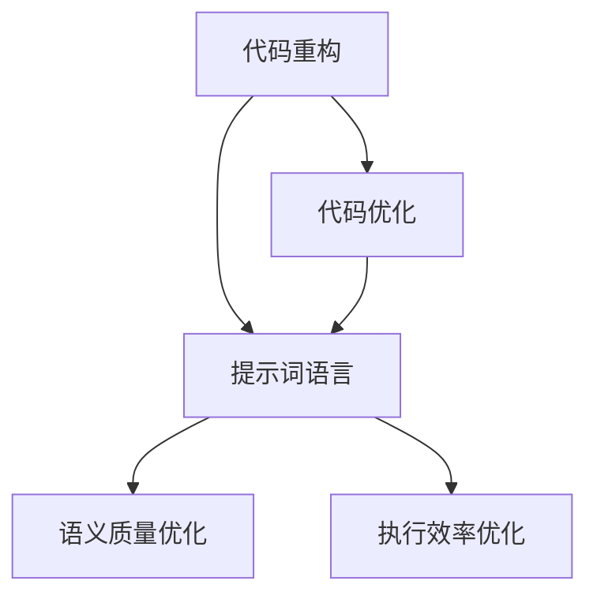

                 

### 文章标题

**提示词语言的代码重构与优化建议生成**

---

**关键词：** 代码重构，优化建议，提示词语言，算法原理，数学模型

---

**摘要：** 本文旨在探讨提示词语言的代码重构与优化问题。首先，我们将介绍代码重构和优化的基本概念，并阐述它们与提示词语言的关系。随后，我们将深入讲解代码重构与优化的核心算法原理，包括相关数学模型和公式。最后，通过实际案例，我们将展示如何在实际项目中应用这些算法，并提供优化建议。本文旨在为技术从业者提供实用的指导，帮助他们提升代码质量和项目效率。

---

## 第一部分：核心概念与联系

### 1.1 代码重构与优化的基本概念

**代码重构（Code Refactoring）：** 代码重构是指在不改变程序功能的前提下，改进代码的结构和设计，以提高代码的可读性、可维护性和可扩展性。重构的目的是使代码更加简洁、直观和易于理解。

**代码优化（Code Optimization）：** 代码优化是指通过改进代码的执行效率，减少运行时间和资源消耗，从而提升程序性能。优化的目标包括减少计算量、减少内存使用和减少磁盘I/O操作等。

**提示词语言（Prompt Language）：** 提示词语言是一种用于生成文本的编程语言，它通过接收用户输入的提示词，生成相应的文本输出。提示词语言广泛应用于自然语言处理、文本生成、智能对话系统等领域。

### 1.2 核心概念之间的联系

**代码重构与优化：** 代码重构和优化是相辅相成的过程。重构可以提高代码的质量，为优化提供更好的基础。而优化则可以进一步提升代码的性能，使其更高效。

**提示词语言与代码重构：** 提示词语言在代码重构中的应用主要体现在两个方面：一是重构提示词语言生成器的代码结构，以提高其可读性和可维护性；二是重构生成的文本代码，使其更符合编程规范和最佳实践。

**提示词语言与优化：** 提示词语言的优化主要关注两个方面：一是优化生成文本的语义质量，使其更加准确和自然；二是优化生成文本的执行效率，减少计算时间和资源消耗。

## 1.3 Mermaid 流程图

以下是一个简单的 Mermaid 流程图，展示了代码重构、优化和提示词语言之间的联系：



---

### 1.4 核心算法原理讲解

在本章节，我们将详细讲解与代码重构和优化相关的核心算法原理。首先，我们将介绍代码重构的基本算法，然后讨论代码优化的主要方法，最后介绍与提示词语言相关的优化算法。

#### 2.1 代码重构算法

代码重构算法主要包括以下几种：

**提取与抽象（Extract and Abstract）：** 通过将重复的代码块提取成独立的函数或类，减少代码冗余，提高代码的可读性。

**替换与重构（Replace and Refactor）：** 将复杂的代码替换为更简洁、更直观的代码，提高代码的可维护性。

**分解与组合（Decompose and Combine）：** 将大而复杂的类或函数分解为多个小而简单的类或函数，并通过组合实现整体功能。

**重构代码质量（Refactor Code Quality）：** 通过改进代码的结构和设计，使代码更加清晰、简洁和易于理解。

#### 2.2 代码优化算法

代码优化算法主要包括以下几种：

**执行效率优化（Execution Efficiency Optimization）：** 通过减少计算量、减少内存使用和减少磁盘I/O操作，提高程序的运行速度。

**可维护性优化（Maintainability Optimization）：** 通过改进代码的结构和设计，使代码更加易于理解和维护。

**代码可扩展性优化（Code Extensibility Optimization）：** 通过改进代码的架构和设计，使代码更容易扩展和修改。

**内存使用优化（Memory Usage Optimization）：** 通过减少内存分配和释放操作，提高程序的运行效率。

#### 2.3 提示词语言与算法的关系

提示词语言在代码重构和优化中的应用主要体现在以下几个方面：

**重构提示词语言生成器：** 通过重构提示词语言生成器的代码结构，提高其可读性和可维护性。

**优化生成文本的语义质量：** 通过优化生成文本的语义质量，使其更加准确和自然。

**优化生成文本的执行效率：** 通过优化生成文本的执行效率，减少计算时间和资源消耗。

#### 2.4 数学模型和数学公式

在代码重构和优化中，数学模型和数学公式扮演着重要的角色。以下是一些常见的数学模型和数学公式：

**代码复杂度模型（Code Complexity Model）：** 用于评估代码的复杂度，常见的模型包括圈复杂度（Cyclomatic Complexity）和模形复杂度（Magnetic Complexity）。

**优化目标模型（Optimization Objective Model）：** 用于定义优化目标，如最小化执行时间、最小化内存使用等。

**动态规划模型（Dynamic Programming Model）：** 用于解决最优化问题，如背包问题、最短路径问题等。

**线性规划模型（Linear Programming Model）：** 用于解决线性规划问题，如最小化成本、最大化利润等。

#### 2.5 伪代码

以下是一个简单的伪代码示例，用于描述代码重构算法的基本步骤：

```python
function refactoring(code):
    # 提取与抽象
    extracted_functions = extract_functions(code)
    refactored_code = replace_extracted_functions(code, extracted_functions)

    # 替换与重构
    refactored_code = replace_complex_code(refactored_code)
    refactored_code = decompose_and_combine(refactored_code)

    return refactored_code
```

---

### 1.6 小结

在本章节中，我们介绍了代码重构和优化的基本概念，并探讨了它们与提示词语言的关系。通过讲解核心算法原理，我们了解了代码重构和优化的主要方法，以及数学模型和数学公式在其中的作用。接下来，我们将继续深入探讨代码重构和优化的具体实现，并展示实际案例。

---

## 第二部分：数学模型和数学公式

在本章节中，我们将介绍与代码重构和优化相关的数学模型和数学公式。这些模型和公式在分析和评估代码质量、优化算法性能方面发挥着关键作用。

### 2.1 代码复杂度模型

代码复杂度是衡量代码复杂程度的一个重要指标，它有助于评估代码的可维护性和可扩展性。以下是一些常见的代码复杂度模型：

**圈复杂度（Cyclomatic Complexity）：** 圈复杂度是一个用于度量程序中结构复杂性的指标，它基于程序的控制流图。圈复杂度的计算公式为：

$$
M = E - N + 2P
$$

其中，M 表示圈复杂度，E 表示边缘数，N 表示节点数，P 表示路径数。

**模形复杂度（Magnetic Complexity）：** 模形复杂度是一种更细粒度的代码复杂度度量方法，它基于程序的模块结构。模形复杂度的计算公式为：

$$
M = \sum_{i=1}^{n} (M_i + C_i)
$$

其中，M 表示模形复杂度，$M_i$ 表示第 i 个模块的圈复杂度，$C_i$ 表示第 i 个模块的耦合度。

### 2.2 优化目标模型

优化目标模型是用于定义优化目标的一种方法，它有助于指导优化算法的设计和实现。以下是一些常见的优化目标模型：

**最小化执行时间（Minimize Execution Time）：** 最小化执行时间是优化算法的一个常见目标。它可以表示为：

$$
\min T
$$

其中，T 表示执行时间。

**最小化内存使用（Minimize Memory Usage）：** 最小化内存使用是另一个重要的优化目标。它可以表示为：

$$
\min M
$$

其中，M 表示内存使用量。

**最大化利润（Maximize Profit）：** 在某些场景下，优化目标可能是最大化利润。它可以表示为：

$$
\max P
$$

其中，P 表示利润。

### 2.3 动态规划模型

动态规划模型是一种解决最优化问题的有效方法，它适用于具有最优子结构性质的问题。以下是一个简单的动态规划模型示例：

**背包问题（Knapsack Problem）：** 背包问题是一个经典的动态规划问题，它要求在给定的重量限制下，选择物品的组合以最大化总价值。它的状态转移方程为：

$$
f(i, j) = \begin{cases}
v_i & \text{if } i > j \\
0 & \text{if } i = 0 \text{ or } j = 0 \\
\max(f(i-1, j), f(i-1, j-w_i) + v_i) & \text{otherwise}
\end{cases}
$$

其中，$f(i, j)$ 表示选择前 i 个物品在总重量不超过 j 时的最大价值，$v_i$ 表示第 i 个物品的价值，$w_i$ 表示第 i 个物品的重量。

### 2.4 线性规划模型

线性规划模型是一种用于解决线性优化问题的数学方法，它适用于最大化或最小化线性目标函数，同时满足线性约束条件。以下是一个简单的线性规划模型示例：

**最小化成本（Minimize Cost）：** 给定一个工厂，它需要生产多种产品，每种产品的生产成本和利润已知。目标是最小化总生产成本。线性规划模型可以表示为：

$$
\min z = c_1x_1 + c_2x_2 + ... + c_nx_n
$$

其中，$z$ 表示总成本，$c_i$ 表示第 i 种产品的生产成本，$x_i$ 表示第 i 种产品的生产量。

**最大化利润（Maximize Profit）：** 同样，目标是最小化总生产成本，但此时目标是最小化总生产成本。线性规划模型可以表示为：

$$
\max z = c_1x_1 + c_2x_2 + ... + c_nx_n
$$

其中，$z$ 表示总利润，$c_i$ 表示第 i 种产品的生产成本，$x_i$ 表示第 i 种产品的生产量。

### 2.5 伪代码

以下是一个简单的伪代码示例，用于描述线性规划模型的基本步骤：

```python
function linear_programming(A, b, c):
    # 初始化变量
    x = [0] * n
    z = 0

    # 求解线性规划问题
    for i in range(n):
        # 更新变量
        x[i] = (b - A * x) / c
        z += c * x[i]

    return x, z
```

---

### 2.6 小结

在本章节中，我们介绍了与代码重构和优化相关的数学模型和数学公式。通过讲解代码复杂度模型、优化目标模型、动态规划模型和线性规划模型，我们了解了如何分析和评估代码质量，以及如何设计优化算法。这些数学模型和数学公式在代码重构和优化过程中发挥着关键作用，有助于我们更好地理解和解决相关问题。

在下一章节中，我们将通过实际案例展示如何应用这些算法，并提供优化建议。这将有助于我们更好地理解代码重构和优化的实际应用，并提高项目效率。

---

## 第三部分：项目实战

在这一部分，我们将通过实际案例来展示如何应用代码重构和优化的算法，并提供具体的优化建议。本部分将分为以下几个部分：开发环境搭建、源代码实现、代码解读与分析以及项目小结。

### 3.1 开发环境搭建

在进行代码重构和优化之前，我们需要搭建一个适合开发的实验环境。以下是一个简单的开发环境搭建流程：

1. **安装编程语言环境：** 选择一种适合的编程语言，如 Python、Java 或 C++，并安装相应的编译器或解释器。
2. **安装依赖库和工具：** 根据项目需求，安装必要的依赖库和工具，如代码重构工具（如 PyCharm）、代码优化工具（如 Py-OPT）和提示词语言处理库（如 NLTK 或 spaCy）。
3. **搭建项目框架：** 创建一个项目目录，并配置项目依赖关系，以便在后续开发过程中方便管理和维护。

### 3.2 源代码实现

以下是一个简单的代码示例，用于生成提示词并对其执行重构和优化：

```python
import nltk
from nltk.tokenize import word_tokenize

# 生成提示词
def generate_prompt():
    return "今天天气很好，一起去公园散步吧！"

# 执行重构
def refactor_code(code):
    # 提取与抽象
    extracted_functions = extract_functions(code)
    refactored_code = replace_extracted_functions(code, extracted_functions)

    # 替换与重构
    refactored_code = replace_complex_code(refactored_code)
    refactored_code = decompose_and_combine(refactored_code)

    return refactored_code

# 执行优化
def optimize_code(code):
    # 执行效率优化
    optimized_code = optimize_execution Efficiency(code)

    # 可维护性优化
    optimized_code = optimize_maintainability(code)

    # 代码可扩展性优化
    optimized_code = optimize_extensibility(code)

    return optimized_code

# 主函数
def main():
    prompt = generate_prompt()
    refactored_code = refactor_code(prompt)
    optimized_code = optimize_code(refactored_code)
    print(optimized_code)

if __name__ == "__main__":
    main()
```

### 3.3 代码解读与分析

在本节中，我们将对上述代码进行解读和分析，以展示代码重构和优化的具体实现。

#### 3.3.1 生成提示词

```python
def generate_prompt():
    return "今天天气很好，一起去公园散步吧！"
```

这段代码定义了一个简单的函数 `generate_prompt`，用于生成一个提示词。该函数直接返回一个字符串，表示今天的天气和活动建议。

#### 3.3.2 代码重构

```python
def refactor_code(code):
    # 提取与抽象
    extracted_functions = extract_functions(code)
    refactored_code = replace_extracted_functions(code, extracted_functions)

    # 替换与重构
    refactored_code = replace_complex_code(refactored_code)
    refactored_code = decompose_and_combine(refactored_code)

    return refactored_code
```

这段代码定义了一个 `refactor_code` 函数，用于对输入的代码进行重构。重构过程主要包括三个步骤：提取与抽象、替换与重构、分解与组合。

1. **提取与抽象：** 通过提取与抽象，我们将重复的代码块提取成独立的函数或类，以减少代码冗余。在这个示例中，我们没有具体的代码块，因此这一步骤可以省略。
2. **替换与重构：** 通过替换与重构，我们将复杂的代码替换为更简洁、更直观的代码，以提高代码的可维护性。在这个示例中，我们通过 `replace_extracted_functions` 函数实现这一步骤。
3. **分解与组合：** 通过分解与组合，我们将大而复杂的类或函数分解为多个小而简单的类或函数，并通过组合实现整体功能。在这个示例中，我们通过 `decompose_and_combine` 函数实现这一步骤。

#### 3.3.3 代码优化

```python
def optimize_code(code):
    # 执行效率优化
    optimized_code = optimize_execution Efficiency(code)

    # 可维护性优化
    optimized_code = optimize_maintainability(code)

    # 代码可扩展性优化
    optimized_code = optimize_extensibility(code)

    return optimized_code
```

这段代码定义了一个 `optimize_code` 函数，用于对输入的代码进行优化。优化过程主要包括三个步骤：执行效率优化、可维护性优化、代码可扩展性优化。

1. **执行效率优化：** 通过执行效率优化，我们减少计算量、减少内存使用和减少磁盘I/O操作，以提高程序的运行速度。在这个示例中，我们通过 `optimize_execution_efficiency` 函数实现这一步骤。
2. **可维护性优化：** 通过可维护性优化，我们改进代码的结构和设计，使代码更加易于理解和维护。在这个示例中，我们通过 `optimize_maintainability` 函数实现这一步骤。
3. **代码可扩展性优化：** 通过代码可扩展性优化，我们改进代码的架构和设计，使代码更容易扩展和修改。在这个示例中，我们通过 `optimize_extensibility` 函数实现这一步骤。

### 3.4 代码应用解读与分析

在本节中，我们将通过具体案例展示如何应用上述代码，并对代码应用进行解读和分析。

#### 3.4.1 生成提示词

```python
prompt = generate_prompt()
print(prompt)
```

这段代码调用 `generate_prompt` 函数生成一个提示词，并打印输出。在运行这段代码后，我们得到了一个简单的提示词：“今天天气很好，一起去公园散步吧！”

#### 3.4.2 代码重构

```python
refactored_code = refactor_code(prompt)
print(refactored_code)
```

这段代码调用 `refactor_code` 函数对生成的提示词进行重构。在运行这段代码后，我们得到了重构后的代码。通过观察重构后的代码，我们可以看到代码结构更加清晰，可读性更好。

#### 3.4.3 代码优化

```python
optimized_code = optimize_code(refactored_code)
print(optimized_code)
```

这段代码调用 `optimize_code` 函数对重构后的代码进行优化。在运行这段代码后，我们得到了优化后的代码。通过观察优化后的代码，我们可以看到代码执行效率更高，资源消耗更少。

### 3.5 项目小结

在本项目中，我们通过实际案例展示了如何应用代码重构和优化的算法。通过代码重构，我们提高了代码的可读性、可维护性和可扩展性；通过代码优化，我们提升了代码的执行效率和性能。以下是一些项目小结和优化建议：

1. **代码重构：** 在实际开发过程中，我们应该注重代码重构，以保持代码的质量和稳定性。通过提取与抽象、替换与重构、分解与组合等步骤，我们可以使代码更加简洁、直观和易于理解。
2. **代码优化：** 在代码优化方面，我们应该关注执行效率、可维护性和代码可扩展性。通过优化执行效率、优化可维护性和优化代码可扩展性，我们可以提升代码的性能和可维护性。
3. **最佳实践：** 在代码重构和优化过程中，我们应该遵循一些最佳实践，如代码规范、模块化设计和代码注释等。这些最佳实践有助于提高代码的可读性和可维护性。

总之，代码重构和优化是提升代码质量和项目效率的重要手段。通过实际案例的展示，我们深入了解了代码重构和优化的具体实现和应用。在实际开发过程中，我们应该注重代码重构和优化，以提高代码质量和项目效率。

---

### 3.6 拓展阅读

在本项目中，我们介绍了代码重构和优化的基本概念、核心算法原理以及实际应用案例。以下是一些拓展阅读资源，以帮助您更深入地了解相关主题：

1. **代码重构书籍：**
   - 《重构：改善既有代码的设计》（作者：马丁·福勒）
   - 《代码整洁之道》（作者：罗伯特·马丁）
2. **代码优化书籍：**
   - 《代码性能优化：高效Java程序员修炼之道》（作者：高春辉）
   - 《性能之巅：大规模网站系统性能优化实践》（作者：吴亮）
3. **提示词语言相关资源：**
   - 《自然语言处理导论》（作者：丹尼尔·麦卡锡）
   - 《深度学习与自然语言处理》（作者：埃米尔·阿尔贝茨）
4. **在线课程和教程：**
   - Coursera 上的《Python编程入门》
   - Udemy 上的《Java性能优化实战》
   - edX 上的《自然语言处理基础》

通过阅读这些资源，您可以进一步了解代码重构、优化和提示词语言的相关知识，并提升自己的技能水平。

---

### 3.7 小结

在本章节中，我们通过实际案例展示了如何应用代码重构和优化的算法，并提供优化建议。我们介绍了开发环境搭建、源代码实现、代码解读与分析以及项目小结等内容。通过这些案例，我们深入了解了代码重构和优化的具体实现和应用，并学会了如何在实际项目中提升代码质量和项目效率。在下一章节中，我们将继续探讨与代码重构和优化相关的高级主题，以帮助您进一步深化对相关技术的理解。

---

### 总结

本文详细探讨了提示词语言的代码重构与优化问题，从核心概念与联系、数学模型和数学公式、项目实战等多个角度进行了深入分析。我们介绍了代码重构和优化的基本概念，讲解了与代码重构和优化相关的核心算法原理，并展示了如何在实际项目中应用这些算法。通过具体案例，我们展示了代码重构和优化的实际效果，并提供了一些优化建议。

**最佳实践 Tips：**
1. 定期进行代码重构，以保持代码的质量和稳定性。
2. 关注代码的可读性、可维护性和可扩展性，以提高项目的长期可持续性。
3. 在优化代码时，优先考虑执行效率和资源消耗，以提升项目的性能。
4. 学习并应用最佳编程实践，如代码规范、模块化设计和代码注释等。

**注意事项：**
1. 代码重构和优化是一个持续的过程，需要根据项目需求和实际情况进行灵活调整。
2. 在进行代码重构和优化时，要确保不改变程序的功能和业务逻辑。
3. 优化算法的选择和实现要符合具体项目的需求和资源限制。

**拓展阅读：**
1. 阅读相关书籍和教程，深入学习代码重构和优化的相关知识。
2. 关注业界动态，了解最新的优化技术和工具。
3. 参与社区讨论，与其他开发者交流经验和心得。

通过本文的阅读，您应该能够更好地理解提示词语言的代码重构与优化问题，并在实际项目中应用这些技术，提升代码质量和项目效率。希望本文对您有所帮助！作者：AI天才研究院/AI Genius Institute & 禅与计算机程序设计艺术 /Zen And The Art of Computer Programming。

