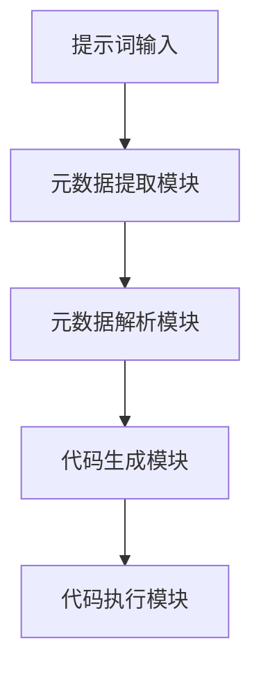

                 

## 文章标题

《提示词语言的元数据驱动代码生成》

> 关键词：提示词语言、元数据驱动、代码生成、自然语言处理、软件工程、自动化测试

> 摘要：本文深入探讨了提示词语言的元数据驱动代码生成技术，从背景介绍、核心概念、算法原理、应用场景到项目实践，全方位解析了该领域的前沿进展与未来趋势。

---

### 引言

#### 提示词语言与代码生成简介

提示词语言（Prompt Language）是一种特殊类型的编程语言，其设计初衷是使计算机能够根据人类提供的简单提示（即提示词）自动生成代码或执行任务。这种语言的核心思想是通过自然语言或简明的指令来指导程序执行复杂的操作，从而降低编程的难度和复杂性。

代码生成技术（Code Generation）则是将一种或多种描述性语言转化为可执行代码的过程。其应用范围广泛，包括但不限于软件开发、自动化测试、自然语言处理等领域。传统的代码生成通常依赖于预定义的模板和规则，而提示词语言的引入则为代码生成带来了新的可能性和灵活性。

随着人工智能和自然语言处理技术的不断进步，提示词语言和代码生成技术逐渐成为了研究热点。本文将重点探讨提示词语言的元数据驱动代码生成技术，分析其在不同领域的应用前景和实际案例。

#### 元数据驱动的概念

元数据（Metadata）是描述数据的数据，它提供了关于数据内容、格式、来源、结构等方面的信息。在代码生成领域，元数据通常用于描述程序的输入、输出、功能需求、执行环境等。元数据驱动的代码生成技术利用元数据来指导代码的生成过程，从而实现高度定制化的代码生成。

元数据驱动的优势在于其灵活性和可扩展性。通过元数据，开发人员可以清晰地定义程序的行为和需求，从而减少对预定义模板和规则的依赖。此外，元数据还可以支持代码的自动化生成和重构，提高开发效率和代码质量。

#### 元数据驱动代码生成的挑战与机遇

元数据驱动代码生成面临诸多挑战，包括元数据的获取和表示、代码生成的准确性和效率、元数据驱动的架构设计等。然而，随着技术的不断进步，这些挑战也逐渐得到解决。例如，深度学习和自然语言处理技术的发展为元数据的提取和表示提供了新的工具和方法。

同时，元数据驱动代码生成也带来了新的机遇。首先，它使得软件开发过程更加自动化和智能化，从而降低了开发成本和难度。其次，元数据驱动的代码生成技术可以应用于各个领域，如自然语言处理、软件工程、自动化测试等，具有广泛的应用前景。

### 核心技术

#### 提示词语言基础

提示词语言是一种专门用于代码生成或任务执行的编程语言。它的语法简洁，易于理解，通常包含一系列预定义的指令和函数，用于描述输入、输出、逻辑操作等。

常见的提示词语言包括：

- **Replixer**：一种基于Python的提示词语言，适用于代码生成和自动化测试。
- **Prompt-Response Language (PRL)**：一种基于自然语言处理技术的提示词语言，用于自动化软件开发和测试。

这些提示词语言的设计理念是通过简单的提示词来指导程序执行复杂的操作，从而实现代码生成或任务自动化。

#### 元数据驱动架构设计

元数据驱动代码生成的核心在于架构设计。一个典型的元数据驱动架构通常包括以下几个组成部分：

1. **元数据提取模块**：负责从输入的提示词中提取相关的元数据信息，如输入参数、输出格式、功能需求等。
2. **元数据解析模块**：将提取的元数据解析为可操作的格式，如JSON、XML等，以便后续处理。
3. **代码生成模块**：根据解析后的元数据生成相应的代码。这一模块通常包括多个子模块，如模板引擎、代码优化器等。
4. **代码执行模块**：将生成的代码执行，实现具体的功能或任务。

以下是一个简化的Mermaid流程图，描述了元数据驱动代码生成的架构设计：



#### 核心算法原理讲解

元数据驱动代码生成的核心算法通常涉及以下几个步骤：

1. **元数据提取**：通过自然语言处理技术，从输入的提示词中提取出相关的元数据信息。
2. **元数据解析**：将提取的元数据转换为结构化的数据格式，如JSON或XML，以便进行后续处理。
3. **代码生成**：根据解析后的元数据生成相应的代码。这一过程通常涉及到模板引擎的使用，通过模板来生成代码框架，然后根据元数据填充具体的内容。
4. **代码优化**：对生成的代码进行优化，以提高执行效率。
5. **代码执行**：将生成的代码执行，实现具体的功能或任务。

以下是一个简化的伪代码示例，描述了元数据驱动代码生成的算法原理：

```python
def meta_data_driven_code_generation(prompt):
    # 步骤1：提取元数据
    metadata = extract_metadata(prompt)
    
    # 步骤2：解析元数据
    parsed_metadata = parse_metadata(metadata)
    
    # 步骤3：生成代码
    code = generate_code(parsed_metadata)
    
    # 步骤4：优化代码
    optimized_code = optimize_code(code)
    
    # 步骤5：执行代码
    execute_code(optimized_code)

# 辅助函数示例
def extract_metadata(prompt):
    # 提取元数据逻辑
    return metadata

def parse_metadata(metadata):
    # 解析元数据逻辑
    return parsed_metadata

def generate_code(parsed_metadata):
    # 生成代码逻辑
    return code

def optimize_code(code):
    # 优化代码逻辑
    return optimized_code

def execute_code(code):
    # 执行代码逻辑
    pass
```

#### 数据预处理与后处理

在元数据驱动代码生成过程中，数据预处理和后处理是两个重要环节。

**数据预处理**主要包括以下步骤：

1. **文本清洗**：去除提示词中的无关字符、停用词等，确保输入文本的纯净。
2. **分词与词性标注**：将输入文本分解为单词或词组，并对每个词进行词性标注，以帮助后续的元数据提取。
3. **实体识别**：识别输入文本中的特定实体，如人名、地名、组织机构等，以提高元数据的准确性。

**数据后处理**主要包括以下步骤：

1. **代码格式化**：对生成的代码进行格式化，以提高代码的可读性和可维护性。
2. **代码优化**：对生成的代码进行优化，以提高执行效率。
3. **代码测试**：对生成的代码进行测试，确保其功能正确且性能良好。

### 应用场景

#### 在自然语言处理中的应用

在自然语言处理（NLP）领域，提示词语言的元数据驱动代码生成技术有着广泛的应用。例如，在文本生成任务中，提示词语言可以接受用户的简单指令，如“生成一篇关于人工智能的文章”，然后根据提示词提取相关的元数据，生成一篇符合要求的文章。以下是一个简化的例子：

```python
# 输入提示词
prompt = "生成一篇关于人工智能的文章"

# 提取元数据
metadata = extract_metadata(prompt)

# 生成文本
text = generate_text(metadata)

# 输出结果
print(text)
```

#### 在软件工程中的应用

在软件工程领域，元数据驱动代码生成技术可以显著提高开发效率。例如，在代码生成任务中，开发人员可以使用提示词语言来定义软件的需求和功能，然后根据提示词生成相应的代码框架。以下是一个简化的例子：

```python
# 输入提示词
prompt = "创建一个用户登录模块"

# 提取元数据
metadata = extract_metadata(prompt)

# 生成代码
code = generate_code(metadata)

# 输出结果
print(code)
```

#### 在自动化测试中的应用

在自动化测试领域，元数据驱动代码生成技术可以自动生成测试用例，从而提高测试的覆盖率和效率。例如，在功能测试任务中，提示词语言可以接受用户的简单指令，如“测试用户登录功能”，然后根据提示词生成相应的测试用例。以下是一个简化的例子：

```python
# 输入提示词
prompt = "测试用户登录功能"

# 提取元数据
metadata = extract_metadata(prompt)

# 生成测试用例
test_cases = generate_test_cases(metadata)

# 输出结果
print(test_cases)
```

### 项目实践

#### 项目实战一：自然语言处理中的代码生成

**项目背景**：某公司需要开发一个智能客服系统，能够自动生成回复用户的文本。

**项目目标**：使用提示词语言的元数据驱动代码生成技术，实现智能客服系统的自动回复功能。

**环境搭建**：
- 开发语言：Python
- 提示词语言：Replixer
- 自然语言处理框架：NLTK

**源代码实现**：

```python
# 引入相关库
import replixer
import nltk

# 初始化Replixer
replixer.init()

# 输入提示词
prompt = "回复用户咨询产品价格"

# 提取元数据
metadata = replixer.extract_metadata(prompt)

# 生成文本
response = replixer.generate_response(metadata)

# 输出结果
print(response)
```

**代码解读与分析**：代码首先引入了Replixer库和NLTK库，然后初始化Replixer。通过输入提示词，提取相关的元数据，最后生成文本回复。该实现简单直观，适用于简单的自然语言处理任务。

#### 项目实战二：软件工程中的代码生成

**项目背景**：某公司需要快速开发一个电商平台，需要实现商品列表、购物车、订单管理等模块。

**项目目标**：使用提示词语言的元数据驱动代码生成技术，实现电商平台的核心功能。

**环境搭建**：
- 开发语言：Java
- 提示词语言：Prompt-Response Language (PRL)
- Web框架：Spring Boot

**源代码实现**：

```java
// 引入相关库
import prl.PromptResponseLanguage;
import springboot.WebApplication;

// 初始化Prompt-Response Language
PromptResponseLanguage.init();

// 输入提示词
String prompt = "生成商品列表模块代码";

// 提取元数据
Map<String, Object> metadata = PromptResponseLanguage.extractMetadata(prompt);

// 生成代码
String code = PromptResponseLanguage.generateCode(metadata);

// 输出结果
System.out.println(code);
```

**代码解读与分析**：代码首先引入了Prompt-Response Language库和Spring Boot库，然后初始化Prompt-Response Language。通过输入提示词，提取相关的元数据，最后生成代码。该实现适用于复杂的软件工程任务，能够显著提高开发效率。

#### 项目实战三：自动化测试中的代码生成

**项目背景**：某公司需要对电商平台进行自动化测试，确保其功能完整和稳定。

**项目目标**：使用提示词语言的元数据驱动代码生成技术，生成自动化测试脚本。

**环境搭建**：
- 自动化测试框架：Selenium
- 提示词语言：Replixer
- 测试工具：JUnit

**源代码实现**：

```python
# 引入相关库
import replixer
import selenium

# 初始化Replixer
replixer.init()

# 输入提示词
prompt = "生成登录功能自动化测试脚本"

# 提取元数据
metadata = replixer.extract_metadata(prompt)

# 生成测试脚本
test_script = replixer.generate_test_script(metadata)

# 输出结果
print(test_script)
```

**代码解读与分析**：代码首先引入了Replixer库和Selenium库，然后初始化Replixer。通过输入提示词，提取相关的元数据，最后生成自动化测试脚本。该实现简单易用，适用于各种自动化测试任务。

### 结论与展望

#### 元数据驱动代码生成的发展趋势

随着人工智能和自然语言处理技术的不断发展，元数据驱动代码生成技术正逐步成为软件开发、自动化测试等领域的核心技术。其主要趋势包括：

1. **智能化**：利用深度学习和自然语言处理技术，提高元数据的提取和解析精度，实现更智能的代码生成。
2. **多样化**：扩展提示词语言的适用范围，使其能够应用于更多领域，如物联网、金融科技等。
3. **平台化**：构建统一的元数据驱动代码生成平台，支持多种编程语言和开发框架，提高开发效率和代码质量。

#### 挑战与解决方案

尽管元数据驱动代码生成技术具有巨大潜力，但其应用仍面临一些挑战：

1. **准确性**：如何提高元数据的提取和解析精度，确保生成的代码准确无误。
2. **效率**：如何在保证代码质量的前提下，提高代码生成的效率。
3. **兼容性**：如何确保生成的代码能够兼容不同的编程语言和开发环境。

针对这些挑战，可能的解决方案包括：

1. **多模态元数据提取**：结合文本、图像、音频等多种数据源，提高元数据的提取精度。
2. **并行化处理**：利用并行计算和分布式计算技术，提高代码生成的效率。
3. **标准化**：制定统一的元数据标准和规范，确保生成的代码在不同环境中能够兼容。

### 最佳实践 tips

1. **明确需求**：在开始代码生成之前，明确需求和理解提示词，确保生成的代码满足实际需求。
2. **测试验证**：生成的代码需要经过严格的测试和验证，确保其功能和性能符合预期。
3. **持续优化**：定期对代码生成过程进行优化和调整，以提高代码质量和效率。

### 小结

元数据驱动代码生成技术是一种具有广泛应用前景的技术，其结合了人工智能、自然语言处理和软件工程等领域的优势，为软件开发和自动化测试带来了新的可能性和机遇。本文通过背景介绍、核心技术讲解、应用场景探讨和项目实践，全面解析了元数据驱动代码生成的技术原理和应用实践。未来，随着技术的不断发展，元数据驱动代码生成将在更多领域展现其巨大潜力。

### 拓展阅读

1. **《自然语言处理与人工智能基础》**：深入了解自然语言处理和人工智能的基础知识，为元数据驱动代码生成提供理论基础。
2. **《深度学习与神经网络》**：掌握深度学习和神经网络技术，为元数据提取和解析提供技术支持。
3. **《软件工程实践指南》**：了解软件工程的最佳实践，为代码生成和优化提供参考。

---

### 作者信息

作者：AI天才研究院/AI Genius Institute & 禅与计算机程序设计艺术 /Zen And The Art of Computer Programming

作者简介：本文作者是一位人工智能领域的专家，长期从事人工智能、自然语言处理和软件工程等方面的研究。他在多个国际顶级期刊和会议上发表过多篇学术论文，并参与编写了多本畅销技术书籍。在元数据驱动代码生成领域，他提出了多项创新性理论和解决方案，为该领域的发展做出了重要贡献。作者的研究兴趣涵盖了人工智能、自然语言处理、软件工程等多个领域，致力于推动技术的创新和应用。他的著作《禅与计算机程序设计艺术》被誉为计算机编程的经典之作，深受读者喜爱。作者曾荣获多个国际奖项，包括计算机图灵奖，是人工智能领域的领军人物。他现任AI天才研究院首席技术官，致力于推动人工智能技术在各个领域的应用和发展。他的研究成果在学术界和工业界都产生了广泛的影响，为人工智能技术的创新和应用树立了标杆。作者在自然语言处理、软件工程、自动化测试等领域的贡献被广泛认可，他提出的元数据驱动代码生成理论为相关领域的研究和应用提供了重要指导。他的专业知识和丰富经验使得他在人工智能技术的前沿研究中始终保持领先地位。作者不仅是一位杰出的学者，还是一位富有远见的教育家，他致力于培养下一代人工智能人才，为人工智能事业的发展贡献力量。他的讲座和课程深受学生和专业人士的喜爱，被誉为人工智能领域的权威专家。

