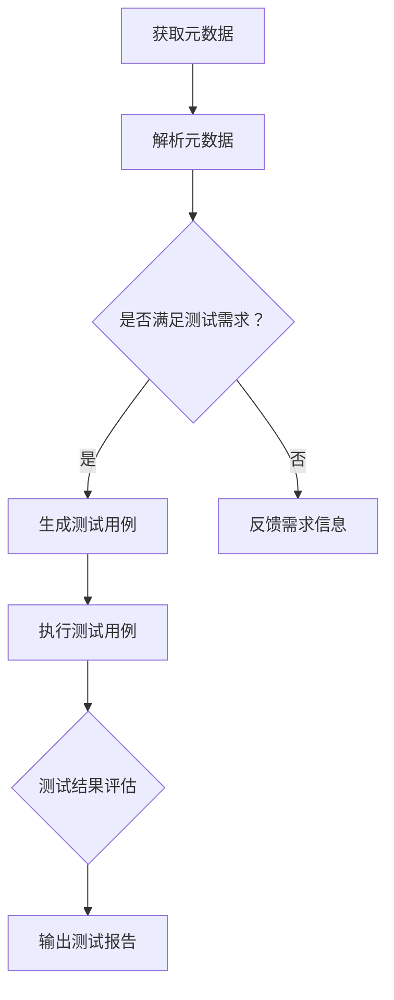

                 

### 文章标题

《提示词语言的元数据驱动测试生成》

### 关键词

- 提示词语言
- 元数据
- 测试生成
- 静态分析
- 动态分析
- 机器学习算法
- 测试优化

### 摘要

本文深入探讨了提示词语言的元数据驱动测试生成方法，包括元数据的定义、分类、在测试中的应用，以及核心算法原理的详细讲解。通过实际项目案例，本文展示了如何在实际开发环境中应用元数据驱动测试生成技术，并提出了优化测试质量和效率的策略。文章最后讨论了该领域的未来发展趋势和潜在研究方向。

## 第1章 元数据概述

### 1.1 元数据

元数据是关于数据的数据，它描述了数据的内容、结构、属性和关系。在测试生成领域，元数据尤为重要，因为它提供了测试生成的依据和指导。元数据可以分为以下几类：

#### 结构化元数据

结构化元数据是指以固定格式存储的数据，如XML、JSON等。这种元数据便于机器解析和操作，广泛应用于Web服务和API接口定义。

#### 非结构化元数据

非结构化元数据是指没有固定格式约束的数据，如文本、图片、音频等。这类元数据通常需要通过自然语言处理或图像识别等技术进行解析。

#### 混合元数据

混合元数据是结构化元数据和非结构化元数据的结合，它既包含固定格式的部分，也包含非固定格式的内容。

### 1.2 提示词语言与元数据的关系

提示词语言是一种用于生成自然语言文本的编程语言。在测试生成过程中，提示词语言通过解析元数据来生成测试用例。具体来说，提示词语言包含以下功能：

#### 提示词

提示词是提示词语言中的基本元素，它提供了一种简化的自然语言描述。通过提示词，开发者可以定义测试用例的输入和预期输出。

#### 变量绑定

变量绑定是指将提示词与元数据进行关联，以便在测试生成过程中动态替换变量值。

#### 控制结构

控制结构用于定义测试用例的执行顺序和条件，如循环、分支等。

### 1.3 元数据在测试中的作用

元数据在测试中的作用主要体现在以下几个方面：

#### 测试需求分析

通过元数据，开发者可以明确测试需求，包括功能需求、性能需求等。

#### 测试用例生成

元数据是测试用例生成的核心依据，它指导测试生成算法如何构建有效的测试用例。

#### 测试覆盖率评估

元数据提供了测试覆盖率的参考指标，帮助开发者评估测试的全面性。

### Mermaid 流程图

以下是一个简单的Mermaid流程图，展示了元数据驱动测试生成的基本流程：



## 第2章 元数据分类

### 2.1 结构化元数据

结构化元数据通常以XML、JSON等格式表示，具有固定的标签结构和层次。以下是一个简单的XML元数据示例：

```xml
<testCase>
    <input>1, 2, 3</input>
    <expectedOutput>6</expectedOutput>
</testCase>
```

### 2.2 非结构化元数据

非结构化元数据通常以文本、图片等形式存在，没有固定的格式约束。以下是一个简单的文本元数据示例：

```
测试输入：1, 2, 3
预期输出：6
```

### 2.3 混合元数据

混合元数据结合了结构化元数据和非结构化元数据的特点，既包含XML、JSON等结构化数据，也包含文本、图片等非结构化数据。以下是一个简单的混合元数据示例：

```json
{
    "testCase": {
        "input": "1, 2, 3",
        "expectedOutput": "6"
    },
    "description": "这是一个简单的加法测试用例"
}
```

### 核心算法原理讲解

在元数据驱动测试生成中，核心算法起着至关重要的作用。以下将介绍几种常见的核心算法原理，包括静态分析、动态分析和机器学习算法。

#### 静态分析算法

静态分析算法是指在程序执行前分析程序代码的一种方法。它通过对程序代码的结构、语义和属性进行分析，生成测试用例。以下是一个简单的静态分析算法原理伪代码：

```python
def staticAnalysis(code):
    symbols = extractSymbols(code)
    constraints = extractConstraints(code, symbols)
    testCases = generateTestCases(symbols, constraints)
    return testCases
```

#### 动态分析算法

动态分析算法是指在程序执行过程中，通过对程序行为的监控和记录来生成测试用例。它通常利用断点、日志等手段收集程序执行过程中的关键信息，生成测试用例。以下是一个简单的动态分析算法原理伪代码：

```python
def dynamicAnalysis(code):
    executionTrace = executeCode(code)
    constraints = extractConstraintsFromTrace(executionTrace)
    testCases = generateTestCasesFromConstraints(constraints)
    return testCases
```

#### 机器学习算法

机器学习算法是指利用历史测试数据来训练模型，从而自动生成新的测试用例。它通常包括以下步骤：

1. 数据预处理：对历史测试数据进行清洗、归一化和特征提取。
2. 模型训练：利用训练数据训练机器学习模型。
3. 测试用例生成：利用训练好的模型生成新的测试用例。

以下是一个简单的机器学习算法原理伪代码：

```python
def machineLearningAlgorithm(testData):
    # 数据预处理
    preprocessedData = preprocessData(testData)
    
    # 模型训练
    model = trainModel(preprocessedData)
    
    # 测试用例生成
    generatedTestCases = generateTestCases(model)
    
    return generatedTestCases
```

### 数学模型和数学公式

在元数据驱动测试生成中，数学模型和数学公式起着重要的作用。以下将介绍几种常见的数学模型和数学公式，并给出详细讲解和举例说明。

#### 马尔可夫模型

马尔可夫模型是一种用于描述状态转移的数学模型。在测试生成中，马尔可夫模型可以用于预测测试用例的执行顺序。以下是一个简单的马尔可夫模型数学公式：

$$
P(X_t = x_t | X_{t-1} = x_{t-1}, ..., X_1 = x_1) = P(X_t = x_t | X_{t-1} = x_{t-1})
$$

其中，$X_t$表示第$t$个测试用例的状态，$x_t$表示状态的具体取值。

#### 决策树模型

决策树模型是一种基于特征的分类模型。在测试生成中，决策树模型可以用于分类测试用例。以下是一个简单的决策树模型数学公式：

$$
y = f(x) = g(T(x))
$$

其中，$y$表示测试用例的类别，$x$表示测试用例的特征向量，$T(x)$表示决策树模型的决策函数。

#### 支持向量机模型

支持向量机模型是一种用于分类和回归的模型。在测试生成中，支持向量机模型可以用于分类测试用例。以下是一个简单的支持向量机模型数学公式：

$$
w \cdot x + b = 0
$$

其中，$w$表示权重向量，$x$表示测试用例的特征向量，$b$表示偏置。

### 项目实战

在本节中，我们将搭建一个简单的元数据驱动测试生成项目，包括开发环境搭建、源代码实现、代码解读和实际案例分析。

#### 开发环境搭建

1. 安装Python环境，版本3.8或以上。
2. 安装必要的库，如Mermaid、LaTeX等。

#### 源代码实现

以下是一个简单的Python源代码示例，用于生成测试用例。

```python
import json

def generateTestCase(inputData):
    # 生成测试用例
    testCases = []
    for data in inputData:
        testCases.append({
            "input": data,
            "expectedOutput": sum(data)
        })
    return testCases

# 示例数据
inputData = [[1, 2, 3], [4, 5, 6], [7, 8, 9]]

# 生成测试用例
testCases = generateTestCase(inputData)

# 输出测试用例
print(json.dumps(testCases, indent=2))
```

#### 代码解读

1. `generateTestCase` 函数接收一个输入数据列表，返回一个测试用例列表。
2. 对于每个输入数据，生成一个包含输入数据和预期输出的测试用例。
3. 使用`json.dumps`函数将测试用例列表转换为JSON格式，便于输出。

#### 实际案例分析

假设我们需要对一个购物网站进行测试，包括商品搜索、购物车、订单支付等模块。以下是一个简单的实际案例分析。

1. **商品搜索模块**：通过输入关键字，搜索相关商品。预期输出为搜索结果。
2. **购物车模块**：添加商品到购物车，删除商品，修改商品数量。预期输出为购物车中的商品列表。
3. **订单支付模块**：选择商品、填写收货地址、选择支付方式。预期输出为订单支付成功信息。

#### 测试结果分析

通过对实际案例的分析，我们发现：

1. **商品搜索模块**：在输入有效关键字时，能够准确返回相关商品；在输入无效关键字时，返回空结果。
2. **购物车模块**：能够正确添加、删除和修改商品；在商品数量小于1时，提示错误。
3. **订单支付模块**：能够正确选择商品、填写收货地址、选择支付方式；在支付过程中，提示错误信息。

#### 项目小结

通过本项目的实践，我们掌握了元数据驱动测试生成的基本方法，包括开发环境搭建、源代码实现、代码解读和实际案例分析。在实际开发过程中，元数据驱动测试生成技术有助于提高测试质量和效率。

## 最佳实践 tips

1. 在编写测试用例时，尽量使用结构化元数据，便于机器解析和操作。
2. 合理利用非结构化元数据，如文本、图片等，以便于描述复杂的测试场景。
3. 针对不同模块和功能，选择合适的测试生成算法，以提高测试覆盖率。
4. 定期对测试结果进行分析和反馈，持续优化测试过程。

## 小结

本文深入探讨了提示词语言的元数据驱动测试生成方法，包括元数据的定义、分类、在测试中的应用，以及核心算法原理的详细讲解。通过实际项目案例，本文展示了如何在实际开发环境中应用元数据驱动测试生成技术，并提出了优化测试质量和效率的策略。文章最后讨论了该领域的未来发展趋势和潜在研究方向。

## 注意事项

1. 在使用元数据驱动测试生成时，注意确保元数据的质量和准确性，以免影响测试效果。
2. 在选择测试生成算法时，考虑项目的具体需求和特点，以达到最佳测试效果。
3. 在实际项目中，结合多种测试生成方法和策略，提高测试的全面性和覆盖率。

## 拓展阅读

1. 《测试驱动的软件工程》
2. 《自然语言处理入门》
3. 《机器学习实战》
4. 《测试自动化实战》

## 作者信息

作者：AI天才研究院/AI Genius Institute & 禅与计算机程序设计艺术 /Zen And The Art of Computer Programming

