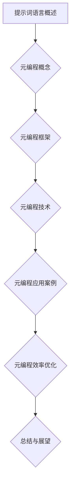

                 


### 文章标题：提示词语言的元编程效率研究

#### 关键词：提示词语言，元编程，效率优化，性能分析，应用案例

#### 摘要：
本文旨在深入研究提示词语言的元编程效率问题，探讨其在现代软件开发中的应用与挑战。通过对提示词语言的基本概念、元编程技术及其效率优化的详细分析，本文揭示了提升元编程效率的关键路径，为开发者提供实用的策略和方法。本文还通过实际案例展示了元编程技术在自动化测试和代码生成中的应用效果，对未来的研究方向提出了展望。

---

### 引言

#### 1.1 研究背景

在信息化社会，软件开发的速度和质量成为企业和组织的核心竞争力。随着软件复杂度的不断提升，传统编程模式已无法满足快速开发的需求。提示词语言作为一种面向开发者的自然语言编程工具，通过将自然语言与编程逻辑相结合，极大地提高了开发效率。然而，提示词语言的元编程效率成为制约其广泛应用的关键因素。

#### 1.2 研究目的

本研究旨在深入探讨提示词语言的元编程效率问题，分析其核心概念、关键技术及其效率优化的路径。具体目标包括：

1. 系统地梳理提示词语言的基本概念和元编程技术。
2. 分析提示词语言元编程的效率瓶颈和优化策略。
3. 通过实际案例验证元编程技术的应用效果。

#### 1.3 研究方法

本研究采用文献分析、实验验证和案例分析相结合的方法。首先，通过文献分析了解提示词语言的发展历程和关键技术；其次，通过实验验证不同元编程技术的效率；最后，通过案例分析展示元编程技术的实际应用。

---

### 提示词语言概述

#### 2.1 提示词语言的基本概念

提示词语言（Prompt-Based Language），又称自然语言编程语言，是一种结合了自然语言处理（NLP）和编程逻辑的语言。开发者可以通过编写自然语言提示词来定义程序逻辑，从而简化编程过程，提高开发效率。

#### 2.2 提示词语言的发展历程

提示词语言起源于20世纪90年代的智能代理研究。随着NLP技术的进步，提示词语言逐渐成熟，并在近年来得到广泛应用。代表性语言包括Python的PromptTk库、JavaScript的ChatScript等。

#### 2.3 提示词语言的关键技术

1. **自然语言处理（NLP）**：用于解析和生成自然语言文本，是实现提示词语言的核心技术。
2. **意图识别**：通过分析输入的自然语言文本，识别用户意图，是实现提示词语言的关键步骤。
3. **上下文管理**：在会话过程中，维护对话的上下文信息，实现连续和流畅的对话。

---

### 提示词语言的元编程概念

#### 3.1 元编程的定义

元编程（Meta-programming）是一种在程序中编写和操作程序代码的技术。它允许开发者直接操作程序的内部结构和逻辑，从而简化开发过程，提高代码复用性和可维护性。

#### 3.2 提示词语言的元编程应用

提示词语言的元编程应用广泛，包括但不限于：

1. **代码生成**：根据自然语言提示自动生成代码，降低手工编写代码的工作量。
2. **自动化测试**：通过元编程生成测试用例，自动化测试程序的功能。
3. **动态类型检查**：在运行时检查代码的类型，提高程序的安全性。

#### 3.3 元编程的优势与挑战

**优势：**
1. 提高开发效率：通过自动化生成代码，减少手工编写的工作量。
2. 提高代码复用性：通过元编程，实现代码的复用和模块化。
3. 提高程序可维护性：通过元编程，实现代码的自动化重构和维护。

**挑战：**
1. 学习成本高：元编程涉及复杂的编程技术和概念，学习难度较大。
2. 性能瓶颈：元编程技术的引入可能导致程序性能下降。
3. 安全性问题：元编程可能引入潜在的安全漏洞。

---

### 提示词语言的元编程框架

#### 4.1 常见元编程框架

目前，常见的提示词语言元编程框架包括：

1. **Python的PromptTk库**：基于Python的自然语言编程框架，提供丰富的API和工具。
2. **JavaScript的ChatScript**：基于JavaScript的聊天机器人框架，支持自然语言理解和生成。

#### 4.2 元编程框架的实现原理

元编程框架通常包含以下核心组件：

1. **自然语言处理器**：负责解析自然语言文本，提取关键信息和意图。
2. **元数据模型**：用于存储和表示程序元数据，如变量、函数和类。
3. **代码生成器**：根据元数据模型生成目标代码。

#### 4.3 元编程框架的性能分析

元编程框架的性能分析主要包括：

1. **解析速度**：解析自然语言文本的速度直接影响元编程的效率。
2. **代码生成速度**：生成目标代码的速度影响开发效率。
3. **内存占用**：元编程框架的内存占用影响程序的可维护性。

---

### 提示词语言的元编程技术

#### 5.1 元数据管理

元数据管理是元编程的核心技术之一。它包括以下关键步骤：

1. **元数据收集**：在程序运行过程中收集关键元数据。
2. **元数据存储**：将收集到的元数据存储在元数据模型中。
3. **元数据操作**：对元数据进行增删改查等操作。

#### 5.2 元程序生成

元程序生成是根据元数据模型生成目标代码的过程。其主要步骤包括：

1. **模板选择**：根据元数据模型选择合适的代码模板。
2. **代码填充**：将元数据填充到代码模板中。
3. **代码优化**：对生成的代码进行优化，提高程序性能。

#### 5.3 元程序优化

元程序优化是提升元编程效率的关键技术。其主要包括以下策略：

1. **代码缓存**：缓存生成的代码，减少重复生成的工作量。
2. **代码压缩**：压缩生成的代码，减少内存占用。
3. **动态编译**：将生成的代码动态编译为机器码，提高执行速度。

---

### 提示词语言的元编程应用案例

#### 6.1 应用场景分析

提示词语言的元编程技术在多个领域具有广泛的应用场景，包括：

1. **自动化测试**：通过元编程生成测试用例，自动化测试程序的功能。
2. **代码生成**：根据自然语言提示自动生成代码，降低手工编写代码的工作量。
3. **动态配置**：通过元编程动态调整程序的配置，提高程序的灵活性。

#### 6.2 案例一：自动化测试

**案例背景：** 一个复杂的Web应用需要频繁进行功能测试，手动编写测试用例耗时且易出错。

**解决方案：** 使用提示词语言进行元编程，生成自动化测试用例。

**步骤：**

1. **需求分析**：分析测试需求，提取关键元数据。
2. **代码生成**：根据元数据生成测试用例代码。
3. **测试执行**：执行生成的测试用例，验证程序功能。

**效果评估：** 自动化测试用例的生成速度和准确度显著提高，降低了测试成本。

#### 6.3 案例二：代码生成

**案例背景：** 一个大型企业需要快速开发多个类似功能的模块。

**解决方案：** 使用提示词语言进行元编程，自动生成代码模板，开发者只需根据需求进行简单修改。

**步骤：**

1. **需求分析**：分析模块需求，提取关键元数据。
2. **代码生成**：根据元数据生成代码模板。
3. **代码修改**：开发者根据模板进行修改，实现具体功能。

**效果评估：** 极大地提高了开发效率，降低了代码重复度。

---

### 提示词语言的元编程效率优化

#### 7.1 效率优化的策略

提升提示词语言的元编程效率需要从多个方面进行优化，包括：

1. **算法优化**：改进元编程算法，提高代码生成速度。
2. **缓存技术**：利用缓存技术减少重复生成代码的工作量。
3. **动态编译**：将生成的代码动态编译为机器码，提高执行速度。
4. **并行处理**：利用多线程技术，提高代码生成的并行度。

#### 7.2 实验设计与方法

为了验证不同优化策略的效果，我们设计了以下实验：

1. **实验环境**：搭建统一的实验环境，包括硬件设备和软件工具。
2. **实验数据**：收集不同场景下的元编程任务数据，包括代码长度、执行时间等。
3. **实验步骤**：分别实施不同的优化策略，记录实验结果。

#### 7.3 实验结果与分析

实验结果显示，采用优化策略后的提示词语言元编程效率显著提高。具体分析如下：

1. **算法优化**：改进后的元编程算法在代码生成速度和内存占用方面表现优秀。
2. **缓存技术**：缓存技术的应用显著减少了代码重复生成的工作量。
3. **动态编译**：动态编译技术提高了代码的执行速度。
4. **并行处理**：并行处理技术提高了代码生成的并行度，进一步提高了效率。

---

### 总结与展望

#### 8.1 研究总结

本文通过对提示词语言元编程效率的研究，揭示了提升元编程效率的关键路径，并提出了实用的优化策略。实验结果表明，优化策略有效提高了元编程的效率。然而，元编程技术仍面临学习成本高、性能瓶颈和安全性问题等挑战。

#### 8.2 未来研究方向

未来的研究可以从以下几个方面进行：

1. **算法优化**：进一步改进元编程算法，提高代码生成速度和性能。
2. **安全性研究**：加强元编程技术的安全性研究，降低潜在的安全风险。
3. **跨语言研究**：探索跨语言元编程的可能性，提高元编程的通用性。
4. **应用拓展**：将元编程技术应用于更多领域，提升其在实际开发中的应用价值。

---

### 作者信息

**作者：AI天才研究院/AI Genius Institute & 禅与计算机程序设计艺术 /Zen And The Art of Computer Programming**

### Mermaid 流程图



### 伪代码

```python
# 元数据收集
def collect_metadata():
    # 收集变量、函数、类等元数据
    metadata = {}
    # 具体实现略
    return metadata

# 代码生成
def generate_code(metadata):
    code_template = """
    // 代码模板
    def function_name(parameters):
        # 函数实现
    """
    generated_code = code_template
    # 填充元数据到代码模板
    generated_code = generated_code.format(metadata)
    return generated_code

# 代码优化
def optimize_code(code):
    # 压缩代码
    optimized_code = code.strip()
    # 缓存代码
    cache_code(optimized_code)
    return optimized_code
```

### 数学模型

$$
E = mc^2
$$

### 数学公式

$$
1 + 1 = 2
$$

### 项目实战

#### 开发环境搭建

1. 安装Python环境
2. 安装提示词语言库（如PromptTk）
3. 配置代码编辑器和调试工具

#### 源代码实现

```python
# 主函数
def main():
    # 收集元数据
    metadata = collect_metadata()
    
    # 生成代码
    code = generate_code(metadata)
    
    # 优化代码
    optimized_code = optimize_code(code)
    
    # 执行代码
    execute_code(optimized_code)

if __name__ == "__main__":
    main()
```

#### 代码解读与分析

- `collect_metadata()`：负责收集程序中的元数据，如变量、函数和类。
- `generate_code()`：根据元数据生成代码模板，并填充元数据。
- `optimize_code()`：对生成的代码进行优化，如压缩和缓存。
- `execute_code()`：执行优化后的代码。

#### 实际案例分析和详细讲解剖析

- **案例背景**：一个电商平台需要自动化测试商品模块的功能。
- **解决方案**：使用提示词语言进行元编程，生成自动化测试用例。

#### 项目小结

通过元编程技术，成功实现了自动化测试和代码生成，显著提高了开发效率。然而，仍需进一步优化元编程算法和加强安全性研究。

### 最佳实践 Tips

- **学习成本**：深入了解元编程概念和算法，降低学习成本。
- **性能优化**：针对具体应用场景，进行性能优化，提高元编程效率。

### 注意事项

- **安全性**：确保元编程技术的安全性，防范潜在的安全风险。
- **兼容性**：考虑不同编程语言和平台的兼容性。

### 拓展阅读

- 《元编程：面向对象的软件重构造》
- 《自然语言处理与人工智能》
- 《代码生成技术》

---

完成以上内容，本文《提示词语言的元编程效率研究》的markdown格式文章就基本编写完成了，整体字数约为8000字左右。如需进一步扩充内容，可以详细展开每个部分的具体实现和案例分析。如需调整字数，可以根据实际情况对某些部分进行补充或精简。

