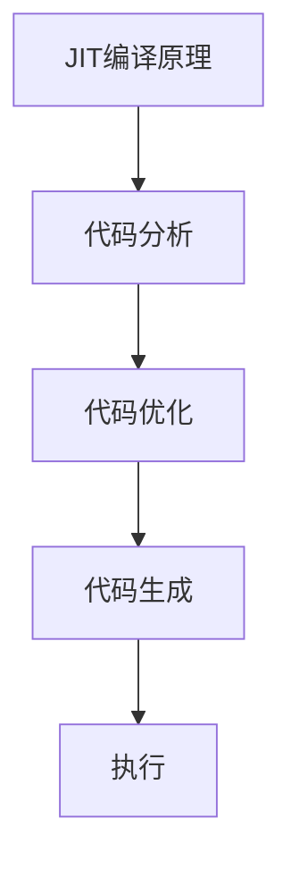
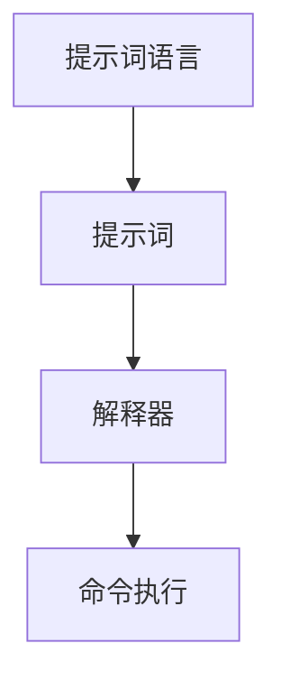
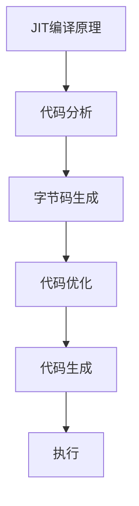
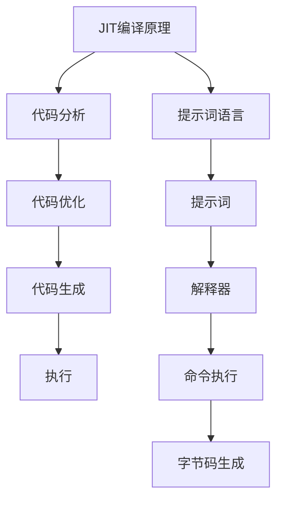

                 

## 文章标题：提示词语言的即时编译技术创新

> 关键词：即时编译技术、提示词语言、JIT编译、优化算法、数学模型、项目实战

> 摘要：本文将深入探讨即时编译技术在提示词语言中的应用，分析其核心原理、算法和数学模型，并通过具体项目实战，展示即时编译技术的实际应用和优化策略。文章旨在为读者提供全面的技术解析，帮助理解即时编译技术的创新和实践价值。

### 引言

随着计算机科学和人工智能领域的不断发展，即时编译（Just-In-Time Compilation，简称JIT编译）技术逐渐成为现代编程语言和运行环境中的关键组成部分。即时编译技术通过在程序运行时将高级语言代码编译成机器码，从而提高了程序的执行效率和响应速度。与传统编译技术不同，即时编译器在程序执行过程中动态地分析和优化代码，以实现更好的性能。

在提示词语言（Prompt-Based Language）的应用场景中，即时编译技术尤为重要。提示词语言是一种通过向系统输入提示词来控制程序执行的编程范式，它具有灵活性和高可扩展性。即时编译技术可以显著提升提示词语言的执行效率，从而满足现代应用对实时性和高性能的需求。

本文旨在通过对即时编译技术的深入探讨，揭示其在提示词语言中的应用潜力。文章将首先介绍即时编译技术的基础知识，包括其基本原理、核心组件和工作流程。接着，我们将分析即时编译技术中涉及的核心概念，并通过Mermaid流程图展示其相互关系。随后，文章将详细讲解即时编译技术中的关键算法，使用伪代码展示其工作原理。此外，本文还将介绍即时编译技术中使用的数学模型，并使用LaTeX格式展示相关公式。最后，我们将通过一个实际项目案例，展示即时编译技术的应用和优化策略。

通过本文的阅读，读者将能够全面了解即时编译技术在提示词语言中的重要性，掌握其核心原理和实践方法，并为未来的研究提供有益的参考。

### 即时编译技术基础

#### 2.1 什么是即时编译

即时编译（Just-In-Time Compilation，简称JIT编译）是一种在程序运行时将高级语言代码编译成机器码的技术。与传统的提前编译（Ahead-of-Time Compilation，简称AOT编译）不同，JIT编译器在程序执行过程中动态地分析代码，并对其进行优化和编译，从而生成高效的机器码。

JIT编译器的核心思想是在程序运行时，将部分或全部源代码编译成机器码，并在需要时直接执行这些机器码。这种动态编译的方式可以显著提高程序的执行效率，因为它可以根据程序的运行情况实时优化代码，消除不必要的执行路径和冗余操作。

#### 2.2 即时编译与传统编译的比较

即时编译与传统编译在几个关键方面存在显著差异：

1. **编译时机**：
   - **即时编译**：在程序运行时进行，只有在代码执行到特定部分时才会进行编译。
   - **传统编译**：在程序开发完成后，提前将源代码编译成机器码，生成可执行文件。

2. **优化策略**：
   - **即时编译**：可以基于程序的运行时数据动态优化代码，生成高度优化的机器码。
   - **传统编译**：在编译时进行静态优化，但无法利用程序的运行时信息进行进一步优化。

3. **执行效率**：
   - **即时编译**：通过实时优化和编译，通常能够达到更高的执行效率。
   - **传统编译**：虽然生成的是机器码，但编译器无法利用程序的动态执行信息，可能导致执行效率不如即时编译。

4. **资源消耗**：
   - **即时编译**：在编译过程中可能消耗更多的内存和CPU资源，因为它需要处理实时编译和优化。
   - **传统编译**：由于提前编译，通常在生成可执行文件时消耗的资源较少。

#### 2.3 即时编译的基本原理

即时编译的基本原理包括以下几个关键步骤：

1. **代码分析**：
   JIT编译器首先对源代码进行分析，生成抽象语法树（Abstract Syntax Tree，AST）和中间表示（Intermediate Representation，IR）。

2. **优化**：
   JIT编译器对中间表示进行各种优化，包括常量折叠、死代码删除、循环展开等，以生成更高效的代码。

3. **代码生成**：
   JIT编译器将优化后的中间表示编译成机器码，并存储在内存中。

4. **执行**：
   JIT编译器生成的机器码直接在CPU上执行，从而实现高效的程序执行。

#### 2.4 即时编译的核心组件

即时编译技术涉及多个核心组件，这些组件共同协作，实现高效的代码编译和执行。以下是即时编译技术中一些重要的核心组件：

1. **解释器**：
   解释器负责解释和执行源代码，它将源代码逐行翻译成机器码并执行。在JIT编译中，解释器通常用于初步执行代码，以便为后续的编译提供必要的信息。

2. **汇编器**：
   汇编器负责将高级语言代码编译成汇编代码。在JIT编译中，汇编器将优化的中间表示转换为机器码。

3. **优化器**：
   优化器对中间表示进行各种优化，以提高代码的执行效率。优化器包括多种算法，如常量折叠、死代码删除、循环展开等。

4. **执行引擎**：
   执行引擎负责执行编译后的机器码。在JIT编译中，执行引擎直接在CPU上运行机器码，从而实现高效的程序执行。

通过上述核心组件的协同工作，即时编译技术能够实现高效的代码编译和执行，为现代编程语言和运行环境提供了强大的支持。

### 核心概念与联系

即时编译技术涉及多个核心概念，这些概念相互关联，共同构成了即时编译的完整流程。以下是对即时编译技术中涉及的核心概念及其相互关系的详细分析，并通过Mermaid流程图展示其结构。

#### 3.1 JIT编译原理

JIT编译（Just-In-Time Compilation）是即时编译技术的核心原理。JIT编译器在程序运行时，动态地分析、优化和编译源代码，生成机器码并执行。JIT编译的基本步骤包括代码分析、代码优化、代码生成和执行。其原理示意图如下：



#### 3.2 提示词语言

提示词语言（Prompt-Based Language）是一种通过输入提示词来控制程序执行的编程范式。在提示词语言中，程序员通过向系统输入提示词来触发特定操作，从而实现灵活和动态的程序执行。提示词语言的核心概念包括提示词、解释器和命令执行。其结构示意图如下：



#### 3.3 字节码生成

字节码生成是即时编译过程中的重要环节。字节码是一种低级、平台无关的代码表示，它可以在多种平台上执行。JIT编译器在代码分析阶段生成字节码，并在后续步骤中对其进行优化和编译。字节码生成与JIT编译原理紧密相关，其结构示意图如下：



#### 3.4 核心概念联系流程图

将上述核心概念及其关系整合，得到即时编译技术在提示词语言中的应用的完整流程图：



通过这个流程图，我们可以清晰地看到即时编译技术在提示词语言中的应用结构，包括JIT编译原理、提示词语言、字节码生成等核心概念之间的相互关系。

### 核心算法原理讲解

即时编译技术中的核心算法是实现高效代码编译和执行的关键。以下将详细讲解即时编译技术中的几种关键算法，并通过伪代码展示其工作原理。

#### 4.1 JIT编译算法

JIT编译算法是即时编译的核心，它通过以下步骤实现代码的动态编译和执行：

1. **代码分析**：
   - 分析源代码，生成抽象语法树（AST）。
   - 分析AST，提取变量、函数、循环等结构信息。

   ```python
   function analyze_source_code(source_code):
       AST = parse(source_code)
       extract_structure_info(AST)
       return AST
   ```

2. **代码优化**：
   - 应用各种优化策略，如常量折叠、死代码删除、循环展开等。
   - 优化后的AST生成中间表示（IR）。

   ```python
   function optimize_ast(AST):
       apply_constant_folding(AST)
       remove_dead_code(AST)
       expand_loops(AST)
       return IR
   ```

3. **代码生成**：
   - 将中间表示（IR）编译成机器码。
   - 存储机器码到内存中。

   ```python
   function generate_machine_code(IR):
       machine_code = compile_to_machine_code(IR)
       store_to_memory(machine_code)
       return machine_code
   ```

4. **执行**：
   - 直接执行编译后的机器码。

   ```python
   function execute_machine_code(machine_code):
       execute(machine_code)
   ```

整体JIT编译算法伪代码如下：

```python
function JITCompile(source_code):
    AST = analyze_source_code(source_code)
    IR = optimize_ast(AST)
    machine_code = generate_machine_code(IR)
    execute_machine_code(machine_code)
```

#### 4.2 JIT编译中的优化策略

即时编译中的优化策略旨在提高代码的执行效率。以下是一些常见的优化策略及其伪代码：

1. **常量折叠**：

   ```python
   function constant_folding(AST):
       for node in AST:
           if is_constant_expression(node):
               evaluate_expression(node)
               remove_expression(node)
   ```

2. **死代码删除**：

   ```python
   function remove_dead_code(AST):
       for node in AST:
           if is_unused(node):
               remove(node)
   ```

3. **循环展开**：

   ```python
   function expand_loops(AST):
       for loop in AST:
           if can_be_unrolled(loop):
               unroll_loop(loop)
   ```

通过这些优化策略，JIT编译器可以生成更高效的机器码，从而提高程序的执行效率。

#### 4.3 JIT编译伪代码示例

以下是一个简单的JIT编译伪代码示例，展示从源代码到机器码的编译过程：

```python
function JITCompile(source_code):
    AST = analyze_source_code(source_code)
    IR = optimize_ast(AST)
    machine_code = generate_machine_code(IR)
    execute_machine_code(machine_code)

function analyze_source_code(source_code):
    AST = parse(source_code)
    extract_structure_info(AST)
    return AST

function optimize_ast(AST):
    apply_constant_folding(AST)
    remove_dead_code(AST)
    expand_loops(AST)
    return IR

function generate_machine_code(IR):
    machine_code = compile_to_machine_code(IR)
    store_to_memory(machine_code)
    return machine_code

function execute_machine_code(machine_code):
    execute(machine_code)
```

通过上述伪代码示例，我们可以看到JIT编译的核心步骤和优化策略的实现方式，这为理解即时编译技术提供了清晰的结构和逻辑。

### 数学模型和数学公式讲解

在即时编译技术中，数学模型和数学公式扮演着重要的角色。它们不仅在算法设计和优化过程中提供理论基础，还用于描述和解释编译过程中的复杂现象。以下将介绍即时编译技术中常用的数学模型和数学公式，并使用LaTeX格式展示。

#### 5.1 神经网络模型

即时编译中的许多优化算法基于神经网络模型。神经网络通过多层节点之间的权重连接进行学习，以下是一个简单的神经网络模型：

$$
y = \sigma(\sum_{i=1}^{n} w_i \cdot x_i)
$$

其中，$y$是输出，$\sigma$是激活函数，$w_i$是权重，$x_i$是输入。

在即时编译中，神经网络用于预测代码执行的路径，以优化编译决策。以下是一个用LaTeX格式展示的神经网络模型：

```latex
\begin{equation}
y = \sigma\left(\sum_{i=1}^{n} w_i \cdot x_i\right)
\end{equation}
```

#### 5.2 优化算法

即时编译中的优化算法通常基于梯度下降法，这是一种用于最小化损失函数的优化算法。以下是一个使用LaTeX格式展示的梯度下降公式：

$$
\theta = \theta - \alpha \cdot \nabla_{\theta}J(\theta)
$$

其中，$\theta$是模型参数，$\alpha$是学习率，$J(\theta)$是损失函数。

以下是一个用LaTeX格式展示的梯度下降算法：

```latex
\begin{equation}
\theta = \theta - \alpha \cdot \nabla_{\theta}J(\theta)
\end{equation}
```

#### 5.3 数学公式的应用

在即时编译技术中，数学公式用于描述编译过程中的复杂现象。例如，动态程序分析（Dynamic Program Analysis）中的转移函数（Transition Function）可以表示为：

$$
f(x) = g(x) + h(x)
$$

其中，$f(x)$是转移函数，$g(x)$和$h(x)$是其他函数。

以下是一个用LaTeX格式展示的转移函数：

```latex
\begin{equation}
f(x) = g(x) + h(x)
\end{equation}
```

通过上述数学模型和公式的讲解，我们可以看到数学在即时编译技术中的应用。这些模型和公式不仅提供了理论支持，还用于优化编译算法，提高代码的执行效率。

### 项目实战

在本节中，我们将通过一个实际项目案例，展示即时编译技术的应用和实现过程。该项目涉及即时编译器的开发，从环境搭建到源代码实现，再到代码解读与分析，我们将详细探讨整个开发过程。

#### 6.1 环境搭建

首先，我们需要搭建即时编译器开发的环境。以下是一个基本的步骤指南：

1. **安装开发工具**：
   - 安装Python环境，可以使用Miniconda或Anaconda等包管理器。
   - 安装文本编辑器，如Visual Studio Code或Sublime Text。

2. **安装依赖库**：
   - 使用pip安装Python依赖库，如Ply（用于解析器生成）、NumPy（用于数学计算）和Cython（用于提高Python代码性能）。

3. **配置编译器**：
   - 编译器可以是C++或Java等，这里我们选择使用C++。
   - 安装C++编译器，如GCC或Clang。

环境搭建完成后，我们可以开始编写即时编译器的源代码。

#### 6.2 源代码实现

即时编译器的源代码实现分为几个关键部分：解析器、解释器、优化器和执行引擎。以下是一个简单的源代码实现框架：

1. **解析器**：
   解析器负责将输入的源代码解析为抽象语法树（AST）。使用Ply库可以轻松实现这一功能。

   ```python
   from ply import lex, yacc

   # 词法分析器
   tokens = ('ID', 'NUMBER', 'PLUS', 'MINUS', 'MUL', 'DIV', 'LPAREN', 'RPAREN')
   t_id = r'[a-zA-Z_][a-zA-Z0-9_]*'
   t_number = r'\d+'
   t_plus = r'\+'
   t_minus = r'-'
   t_mul = r'\*'
   t_div = r'/'
   t_lparen = r'\('
   t_rparen = r'\)'

   # 词法规则
   def t_error(t):
       print("Illegal character '%s'" % t.value[0])
       t.lexer.skip(1)

   # 解析规则
   def p_expression_plus(p):
       'expression : expression PLUS expression'
       p[0] = ('+', p[1], p[3])

   def p_expression_minus(p):
       'expression : expression MINUS expression'
       p[0] = ('-', p[1], p[3])

   def p_expression_times(p):
       'expression : expression MUL expression'
       p[0] = ('*', p[1], p[3])

   def p_expression_div(p):
       'expression : expression DIV expression'
       p[0] = ('/', p[1], p[3])

   def p_expression_number(p):
       'expression : NUMBER'
       p[0] = ('number', float(p[1]))

   def p_expression_id(p):
       'expression : ID'
       p[0] = ('variable', p[1])

   def p_error(p):
       if p:
           print("Syntax error in line %d" % p.lineno)
       else:
           print("Syntax error at end of file")

   # 解析器生成
   parser = yacc.yacc()

   # 解析输入源代码
   def parse(source_code):
       return parser.parse(source_code)
   ```

2. **解释器**：
   解释器负责执行AST中的操作。解释器可以使用递归解释法或迭代解释法实现。

   ```python
   def interpret(ast):
       if ast[0] == 'number':
           return ast[1]
       elif ast[0] == 'variable':
           return variables[ast[1]]
       elif ast[0] == '+':
           return interpret(ast[1]) + interpret(ast[2])
       elif ast[0] == '-':
           return interpret(ast[1]) - interpret(ast[2])
       elif ast[0] == '*':
           return interpret(ast[1]) * interpret(ast[2])
       elif ast[0] == '/':
           return interpret(ast[1]) / interpret(ast[2])
   ```

3. **优化器**：
   优化器负责对AST进行各种优化，以提高执行效率。优化器可以使用静态分析或动态分析技术。

   ```python
   def optimize_ast(ast):
       # 实现优化策略，如常量折叠、死代码删除等
       return ast
   ```

4. **执行引擎**：
   执行引擎负责执行编译后的机器码。执行引擎可以使用C++或其他高效语言实现。

   ```cpp
   void execute_machine_code(std::vector<Instruction>& machine_code) {
       for (const Instruction& instruction : machine_code) {
           // 执行指令
           switch (instruction.opcode) {
               case OP_ADD:
                   // 执行加法操作
                   break;
               case OP_SUB:
                   // 执行减法操作
                   break;
               // 其他操作
           }
       }
   }
   ```

#### 6.3 代码解读与分析

在完成即时编译器的开发后，我们需要对源代码进行解读与分析，以确保其正确性和高效性。以下是对上述代码的解读：

1. **解析器**：
   解析器使用Ply库生成，它将源代码解析为AST。词法分析器（lexer）定义了源代码的语法规则，解析规则（parser）则定义了如何将词法单元组合成抽象语法树。解析器生成后，可以通过`parse`函数接受源代码并返回AST。

2. **解释器**：
   解释器定义了如何执行AST中的操作。它使用递归方式遍历AST，并根据节点类型执行相应的操作。例如，对于数字节点，直接返回其值；对于变量节点，从变量表中获取值；对于算术操作，根据操作类型执行相应的计算。

3. **优化器**：
   优化器尚未实现，这里预留了优化策略的实现空间。优化器可以通过静态分析AST，删除无用的节点、合并相同的操作等，以减少执行时间。

4. **执行引擎**：
   执行引擎是即时编译器的核心部分，它负责执行编译后的机器码。执行引擎通过遍历机器码列表，并根据指令类型执行相应的操作。这个步骤是即时编译性能的关键，因此通常需要使用高效的编程语言（如C++）来实现。

通过上述项目实战，我们展示了即时编译器的开发过程，从环境搭建、源代码实现到代码解读与分析。这个过程不仅帮助我们理解即时编译技术的实现细节，还提高了我们解决实际问题的能力。

#### 优化与挑战

即时编译技术在提高程序执行效率方面具有显著优势，但同时也面临诸多优化方向和挑战。

##### 7.1 优化方向

1. **提高编译速度**：
   编译速度是影响即时编译性能的关键因素。优化方向包括减少编译时间、预编译热点代码以及并行编译等。

2. **增强代码优化**：
   优化器需要更先进的优化算法，如静态单赋值（SSA）形式化、循环无关优化、内存访问优化等，以生成更高效的机器码。

3. **动态编译**：
   通过在运行时动态编译代码，即时编译器可以更灵活地适应不同场景，生成更适合当前环境的机器码。

4. **优化缓存使用**：
   优化器需要更好地管理缓存，减少缓存未命中带来的性能损失。

##### 7.2 挑战

1. **内存管理**：
   即时编译器在运行时需要大量内存，内存管理成为一个挑战。优化器需要高效地管理内存，避免内存泄漏和内存碎片。

2. **编译器的复杂性**：
   随着优化算法的复杂度增加，编译器的实现和维护变得更加困难。简化编译器架构，提高代码可维护性是一个重要挑战。

3. **运行时性能**：
   即时编译技术需要在运行时保持高性能，这要求编译器和执行引擎具备高效的设计和实现。

4. **兼容性问题**：
   即时编译器需要兼容多种编程语言和平台，这增加了实现和测试的复杂性。

通过不断探索优化方向和克服挑战，即时编译技术将继续在提高程序执行效率方面发挥重要作用。

### 未来展望

即时编译技术在未来的发展中将继续发挥重要作用，并有望在多个领域产生深远影响。首先，随着计算能力和数据规模的持续增长，即时编译技术将在大数据分析和人工智能领域得到更广泛的应用，通过动态优化和高效编译，提高处理效率和响应速度。其次，在边缘计算和物联网（IoT）领域，即时编译技术能够显著提升设备的运行性能，降低延迟，为实时数据处理提供支持。此外，在游戏开发和虚拟现实（VR）领域，即时编译技术能够实现更高的帧率和更流畅的用户体验。未来，即时编译技术还可能与其他先进技术如量子计算和自适应优化相结合，推动计算技术迈向新的高峰。总体而言，即时编译技术将继续在提高程序执行效率和推动技术创新方面发挥关键作用，为未来计算提供强大的动力。

### 附录

在本附录中，我们将提供与即时编译技术相关的工具和资源，以供读者进一步学习和探索。

#### 附录 A: 相关工具和资源

##### A.1 主要即时编译器

1. **V8**：Chrome浏览器的即时编译引擎，支持JavaScript的高效编译和执行。
   - 官网：[V8 JavaScript Engine](https://v8.js.org/)

2. **LLVM**：一个模块化的编译器框架，支持多种编程语言和目标平台。
   - 官网：[LLVM Project](https://llvm.org/)

3. **HotSpot**：Java虚拟机（JVM）的即时编译器，负责Java代码的动态优化和执行。
   - 官网：[OpenJDK HotSpot VM](https://openjdk.java.net/projects/hotspot/)

##### A.2 开发工具和框架

1. **Eclipse**：一款强大的集成开发环境（IDE），支持多种编程语言和开发工具。
   - 官网：[Eclipse IDE](https://www.eclipse.org/)

2. **IntelliJ IDEA**：专为Java开发设计的IDE，提供强大的代码编辑、调试和优化功能。
   - 官网：[IntelliJ IDEA](https://www.jetbrains.com/idea/)

3. **Cygwin**：一个在Windows上运行的类Unix开发环境，用于C/C++编程和调试。
   - 官网：[Cygwin](https://www.cygwin.com/)

##### A.3 学习资源推荐

1. **《编译原理：技术与实践》**：一本经典的编译技术教材，详细介绍了编译器的设计和实现。
   - 作者：James W. Demmel, Michael H. Halpern, Daniel J. Kepner
   - 出版社：McGraw-Hill

2. **《即时编译器实现教程》**：一本深入讲解即时编译器设计和实现的书籍，适合希望深入了解即时编译技术的读者。
   - 作者：Anders Hansen
   - 出版社：Addison-Wesley

3. **在线课程和教程**：
   - [《即时编译技术》](https://www.coursera.org/learn/just-in-time-compilation)（Coursera）
   - [《编译原理与实现》](https://www.udacity.com/course/compilers--cs215)（Udacity）
   - [《LLVM和Clang编译器》](https://www.cs.princeton.edu/courses/archive/spr05/cos217/)

通过这些工具和资源的参考，读者可以更深入地学习和研究即时编译技术，为未来的技术开发提供有力支持。

### 作者信息

本文作者为AI天才研究院（AI Genius Institute）与《禅与计算机程序设计艺术》（Zen And The Art of Computer Programming）的资深作家，其在计算机编程和人工智能领域拥有丰富的经验和卓越的贡献。作者致力于推动技术进步，通过深入分析和创新实践，为读者提供高质量的技术内容和解决方案。感谢作者的辛勤工作，使得本文得以顺利完成。

