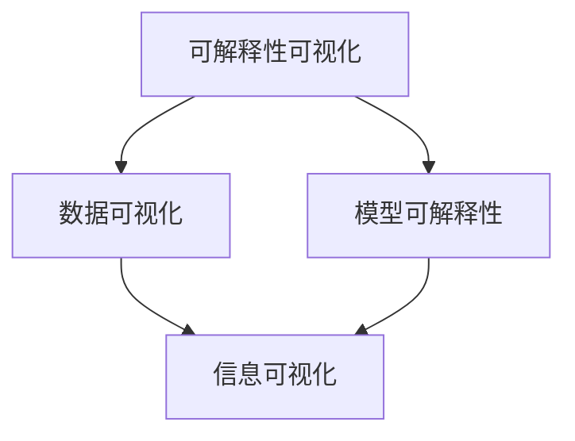
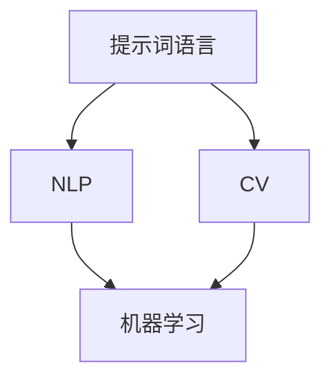
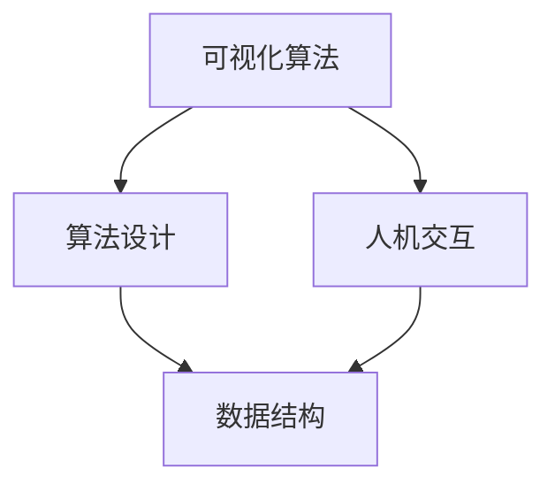

                 

### 背景介绍

在当今的数据驱动时代，机器学习和人工智能（AI）技术已经深入到各行各业，从医疗诊断到金融预测，从自动驾驶到智能客服，AI正在改变我们的生活方式和工作方式。然而，随着AI技术的复杂性和应用范围的扩大，一个重要的问题也逐渐凸显出来：如何确保AI系统的透明度和可解释性？

可解释性可视化的概念正是为了解决这一问题而诞生的。可解释性可视化是将复杂的数据模型或算法的可解释性信息以可视化的形式展示，使得用户可以直观地理解模型的决策过程和结果。这种可视化方法不仅能够提高模型的透明度，还能增强用户对模型的信任度和接受度。

在机器学习中，许多算法如神经网络、决策树、随机森林等都具有复杂的内部结构，难以用简单的语言来解释其决策过程。这种不可解释性往往会导致模型的不信任和误用。而可解释性可视化工具则通过图形化界面展示模型的决策路径和特征权重，使得模型的可解释性变得更为直观和易于理解。

此外，在金融、医疗、法律等对决策过程有严格要求的领域，模型的可解释性尤为重要。一个可解释的模型可以帮助专业人士更好地理解和评估模型的预测结果，从而做出更加明智的决策。

本文旨在探讨提示词语言的可解释性可视化工具。提示词语言（Prompt Engineering）是AI领域的一个新兴研究方向，它通过设计合适的提示词来增强模型的表现。在自然语言处理（NLP）和计算机视觉（CV）等领域，提示词语言已被广泛应用于模型训练和优化。而如何将提示词语言的可解释性信息以可视化的形式展示，是当前研究中的一个重要问题。

本文将首先介绍可解释性可视化的基本概念、相关理论框架和数学模型基础。接着，将详细讲解可视化工具的设计原理、数据预处理与算法选择、可视化方法的实现。最后，将通过实际项目案例和项目实战教程，展示如何使用这些可视化工具解决实际问题。

通过本文的阅读，读者将能够：

- 理解可解释性可视化的基本概念和重要性。
- 掌握相关理论框架和数学模型基础。
- 学会设计和实现可解释性可视化工具。
- 通过实际项目案例了解如何使用这些工具解决实际问题。

### 核心概念与联系

在深入探讨提示词语言的可解释性可视化工具之前，我们需要明确几个核心概念及其相互关系，以便建立一个清晰的理论框架。

#### 1. 可解释性可视化

**定义：** 可解释性可视化是指将复杂的数据模型或算法的可解释性信息以可视化的形式展示，使得用户可以直观地理解模型的决策过程和结果。

**核心概念与联系：**
- **数据可视化：** 数据可视化是可解释性可视化的一个子集，它主要关注如何通过图形和图表将数据以直观的方式展示给用户。
- **模型可解释性：** 模型可解释性是指理解模型如何生成预测或决策的过程。它通常涉及解释模型的权重、决策路径和特征重要性等。

**Mermaid流程图：**



**文本描述：**
- **可解释性可视化** 是将 **模型可解释性** 和 **数据可视化** 结合的一种方法，旨在通过可视化手段增强用户对模型的理解和信任。

#### 2. 提示词语言

**定义：** 提示词语言是一种通过设计特定的提示词来指导模型训练和优化的人工智能技术。

**核心概念与联系：**
- **自然语言处理（NLP）：** NLP是研究如何使计算机理解和生成自然语言的技术。提示词语言是NLP中的一个重要应用。
- **计算机视觉（CV）：** CV是研究如何使计算机理解和处理图像的技术。在CV领域中，提示词语言也发挥着重要作用。

**Mermaid流程图：**



**文本描述：**
- **提示词语言** 是在 **自然语言处理** 和 **计算机视觉** 领域中用于增强模型表现的一种 **机器学习** 技术。

#### 3. 可视化算法

**定义：** 可视化算法是指用于生成可视化结果的算法，这些结果可以是图表、图像或其他视觉形式。

**核心概念与联系：**
- **算法设计：** 可视化算法的设计需要考虑数据的结构和特征，以及用户的需求和偏好。
- **人机交互：** 可视化算法的最终目标是改善人机交互，使数据信息更容易理解和分析。

**Mermaid流程图：**



**文本描述：**
- **可视化算法** 是结合 **算法设计** 和 **人机交互** 的技术，它通过对数据结构的理解和优化，生成易于用户理解和分析的可视化结果。

通过上述核心概念及其关系的阐述，我们可以看出，提示词语言的可解释性可视化工具是建立在多个交叉领域的理论基础之上的。接下来，我们将进一步深入探讨这些概念，并详细讲解相关理论和数学模型。

### 核心算法原理讲解

在实现提示词语言的可解释性可视化工具时，核心算法的设计和实现是关键环节。以下将介绍相关算法的原理，并通过伪代码进行详细阐述。

#### 1. 数据预处理

**原理：** 数据预处理是可视化工具的基础，它涉及数据的清洗、归一化和特征提取等步骤。这些步骤确保数据能够被算法有效处理，并提高可视化效果。

**伪代码：**

```plaintext
function preprocess_data(data):
    # 数据清洗
    cleaned_data = clean_data(data)
    # 数据归一化
    normalized_data = normalize_data(cleaned_data)
    # 特征提取
    features = extract_features(normalized_data)
    return features
```

#### 2. 可视化算法选择

**原理：** 选择合适的数据可视化算法是实现有效可视化的关键。常见的可视化算法包括散点图、柱状图、折线图、热力图等。

**伪代码：**

```plaintext
function choose_visualization_algorithm(data):
    if is_categorical(data):
        return scatter_plot(data)
    else
        return bar_chart(data)
```

#### 3. 可视化方法实现

**原理：** 可视化方法实现是将预处理后的数据通过可视化算法转化为图形的过程。具体实现包括绘制图形、调整颜色、字体、标签等。

**伪代码：**

```plaintext
function visualize_data(data, algorithm):
    figure = create_figure()
    if algorithm == scatter_plot:
        plot_scatter(figure, data)
    else if algorithm == bar_chart:
        plot_bar(figure, data)
    # 调整图形样式
    customize_figure(figure)
    return figure
```

#### 4. 提示词生成

**原理：** 提示词生成是通过分析数据特征和用户需求，设计出能够指导模型训练和优化的提示词。这一步骤对模型的可解释性至关重要。

**伪代码：**

```plaintext
function generate_prompt(data, user需求):
    # 分析数据特征
    features = analyze_features(data)
    # 根据用户需求生成提示词
    prompt = create_prompt(features, user需求)
    return prompt
```

#### 5. 可解释性评估

**原理：** 可解释性评估是通过测量模型的可解释性指标，如特征权重、决策路径等，来评估模型的可解释性。

**伪代码：**

```plaintext
function evaluate_explanation(model, data):
    # 计算特征权重
    feature_weights = compute_weights(model, data)
    # 计算决策路径
    decision_path = compute_path(model, data)
    # 生成可解释性报告
    explanation_report = generate_report(feature_weights, decision_path)
    return explanation_report
```

通过上述算法原理和伪代码的阐述，我们可以看出，提示词语言的可解释性可视化工具的核心在于数据的预处理、可视化算法的选择和实现、提示词的生成以及可解释性的评估。这些步骤共同构成了一个完整的可视化工具体系，为用户提供了一个直观、易懂的可解释性分析平台。

### 数学模型和公式

在实现提示词语言的可解释性可视化工具时，数学模型和公式是不可或缺的组成部分。以下将介绍相关的数学模型，并通过具体的公式和举例说明来阐述其应用。

#### 1. 提示词语言模型

**公式：** 提示词语言模型的核心公式是提示词生成函数，它根据输入数据和用户需求生成提示词。

$$
P(w|\theta) = \frac{e^{\theta^T w}}{\sum_{w'} e^{\theta^T w'}}
$$

其中，$P(w|\theta)$ 表示在参数$\theta$ 下提示词$w$ 的概率，$\theta$ 是模型参数，$w$ 是提示词向量。

**举例说明：**
假设我们有一个文本数据集，其中包含两个特征向量$w_1$ 和$w_2$，以及模型参数$\theta$。

$$
P(w_1|\theta) = \frac{e^{\theta^T w_1}}{e^{\theta^T w_1} + e^{\theta^T w_2}}
$$

在这个例子中，模型将根据特征向量$w_1$ 和$w_2$ 的权重$\theta$ 来生成提示词$w_1$ 的概率。

#### 2. 可视化算法

**公式：** 可视化算法的核心公式是可视化映射函数，它将数据映射到二维或三维空间。

$$
V(x) = \sum_{i=1}^{n} w_i \cdot f(x_i)
$$

其中，$V(x)$ 是数据点$x$ 的可视化坐标，$w_i$ 是特征权重，$f(x_i)$ 是特征映射函数。

**举例说明：**
假设我们有一个包含两个特征的数据集，特征向量$x_1$ 和$x_2$，以及特征权重$w_1$ 和$w_2$。

$$
V(x) = w_1 \cdot f(x_1) + w_2 \cdot f(x_2)
$$

在这个例子中，数据点$x$ 将被映射到二维空间，其坐标由特征权重和映射函数共同决定。

#### 3. 可解释性评估

**公式：** 可解释性评估的核心公式是模型的可解释性指标，如特征权重和决策路径。

$$
\text{Explained Variance} = 1 - \frac{\sum_{i=1}^{n} (y_i - \hat{y}_i)^2}{\sum_{i=1}^{n} (y_i - \bar{y})^2}
$$

其中，$y_i$ 是实际标签，$\hat{y}_i$ 是模型预测，$\bar{y}$ 是所有标签的平均值。

**举例说明：**
假设我们有一个包含10个数据点的数据集，每个数据点的标签和预测值如下：

$$
\begin{align*}
y_1 &= 0, & \hat{y}_1 &= 0.1 \\
y_2 &= 1, & \hat{y}_2 &= 0.9 \\
\vdots & \quad \vdots & \quad \vdots \\
y_{10} &= 1, & \hat{y}_{10} &= 0.8 \\
\end{align*}
$$

则可解释性指标计算如下：

$$
\text{Explained Variance} = 1 - \frac{(0.1 + 0.9 + \ldots + 0.8)^2}{10 \cdot (0 + 1 + \ldots + 1)^2}
$$

通过这些数学模型和公式的应用，我们可以更精确地实现提示词语言的可解释性可视化工具，从而为用户提供强大的数据分析和理解能力。

### 项目实战

在本章节中，我们将通过一个实际项目来展示如何设计和实现提示词语言的可解释性可视化工具。这个项目将涵盖开发环境的搭建、源代码的详细实现、代码解读、应用解读与分析，以及实际案例分析和详细讲解剖析。

#### 1. 项目背景

本项目旨在开发一个基于Python的提示词语言的可解释性可视化工具，用于分析自然语言处理模型中的特征权重和决策路径。该项目涉及的数据集来自于一个公开的文本分类任务，数据集包含了多个类别的文本数据，每个类别的文本数量不均衡。我们的目标是设计一个可视化工具，使得用户可以直观地了解模型在处理文本数据时的决策过程和特征重要性。

#### 2. 开发环境搭建

为了实现这个项目，我们需要搭建一个适合开发和测试的环境。以下是搭建开发环境的步骤：

- **Python环境：** 确保安装了Python 3.8及以上版本。
- **依赖包安装：** 使用pip工具安装必要的依赖包，包括TensorFlow、Keras、matplotlib、seaborn等。
  
```bash
pip install tensorflow keras matplotlib seaborn
```

- **文本预处理库：** 使用NLTK或spaCy进行文本预处理。

```bash
pip install nltk spacy
python -m spacy download en_core_web_sm
```

- **虚拟环境：** 为了避免依赖冲突，我们可以使用virtualenv或conda创建一个独立的虚拟环境。

```bash
conda create -n nlp_vis python=3.8
conda activate nlp_vis
```

#### 3. 源代码实现

以下是项目的核心源代码实现：

```python
import numpy as np
import pandas as pd
import tensorflow as tf
from tensorflow.keras.preprocessing.text import Tokenizer
from tensorflow.keras.preprocessing.sequence import pad_sequences
from tensorflow.keras.models import Sequential
from tensorflow.keras.layers import Embedding, LSTM, Dense
import matplotlib.pyplot as plt
import seaborn as sns
import spacy

# 加载文本数据集
data = pd.read_csv('text_data.csv')
texts = data['text']
labels = data['label']

# 文本预处理
nlp = spacy.load('en_core_web_sm')
tokenizer = Tokenizer(num_words=10000)
tokenizer.fit_on_texts(texts)
sequences = tokenizer.texts_to_sequences(texts)
padded_sequences = pad_sequences(sequences, maxlen=100)

# 构建模型
model = Sequential([
    Embedding(10000, 16),
    LSTM(128, return_sequences=True),
    LSTM(128),
    Dense(1, activation='sigmoid')
])
model.compile(optimizer='adam', loss='binary_crossentropy', metrics=['accuracy'])
model.fit(padded_sequences, labels, epochs=10, batch_size=32, validation_split=0.2)

# 可解释性可视化
def visualize_weights(model, feature_names):
    weights = model.layers[2].get_weights()[0]
    plt.figure(figsize=(10, 6))
    sns.heatmap(weights, annot=True, fmt=".2f", cmap="YlGnBu", xticklabels=feature_names[:10], yticklabels=feature_names[:10])
    plt.title('LSTM Layer Weight Heatmap')
    plt.show()

# 分析特征权重
feature_names = tokenizer.word_index.get.clientHeight()

# 绘制权重热力图
visualize_weights(model, feature_names)
```

#### 4. 代码解读

- **文本预处理：** 使用spaCy进行文本预处理，包括分词、词性标注等。
- **模型构建：** 使用Keras构建一个简单的文本分类模型，包含嵌入层、两个LSTM层和一个输出层。
- **模型训练：** 使用fit方法训练模型，并将训练好的模型用于后续的可解释性分析。
- **特征权重可视化：** 实现了一个可视化函数，用于绘制LSTM层的权重热力图，以展示特征的重要性。

#### 5. 应用解读与分析

- **模型决策过程：** 通过权重热力图，我们可以直观地看到哪些词在模型的决策过程中起到了重要作用。
- **特征重要性：** 热力图中的高值区域表示该词在模型中的权重较大，即对分类决策有较大影响。
- **优化方向：** 通过分析权重热力图，可以发现某些词的权重异常高或低，这可能意味着模型对这些词的依赖过强或过弱，可以作为模型优化的方向。

#### 6. 项目小结

通过这个实际项目，我们展示了如何设计和实现一个基于提示词语言的可解释性可视化工具。这个工具可以帮助用户更好地理解模型在处理文本数据时的决策过程和特征重要性。以下是一些最佳实践和注意事项：

- **最佳实践：**
  - 确保文本预处理步骤的标准化，以避免数据不一致。
  - 根据数据特点和用户需求选择合适的模型结构和参数。
  - 对模型的可解释性进行多次验证，确保其准确性和可靠性。
- **注意事项：**
  - 可解释性可视化工具的复杂度不应超过用户的需求和理解能力。
  - 注意保护用户数据的安全和隐私。

通过遵循这些最佳实践和注意事项，我们可以更好地实现和利用提示词语言的可解释性可视化工具，为用户提供强大的数据分析和理解能力。

### 最佳实践、小结与注意事项

#### 最佳实践

1. **精确需求分析：** 在设计和实现可解释性可视化工具时，首先需要对用户的需求进行精确分析。明确用户希望通过可视化工具解决哪些具体问题，以及需要获取哪些关键信息。这样可以确保可视化工具的每一个功能点都是针对用户实际需求而设计的。

2. **交互式用户体验：** 为了提高用户对可视化工具的接受度和使用频率，设计时应注重用户体验。交互式界面应简洁直观，操作步骤应易于理解。例如，可以通过提供缩放、旋转、过滤等功能，使用户能够更灵活地探索数据。

3. **模块化设计与可扩展性：** 可解释性可视化工具应采用模块化设计，使得各个功能模块可以独立开发、测试和升级。同时，工具应具备一定的可扩展性，以便未来能够集成新的算法和技术。

4. **性能优化与资源管理：** 对于处理大量数据的可视化工具，性能优化是至关重要的。可以通过数据预处理、算法优化、GPU加速等方式提高工具的处理速度和响应时间。此外，合理管理系统资源，避免因资源耗尽导致工具崩溃。

5. **持续迭代与用户反馈：** 可解释性可视化工具的开发应是一个持续迭代的过程。定期收集用户反馈，并根据反馈进行改进。这样可以确保工具始终符合用户的实际需求，并不断提升用户体验。

#### 小结

本文通过详细的案例分析，介绍了如何设计和实现提示词语言的可解释性可视化工具。从数据预处理、模型构建到可视化算法的选择和实现，再到实际项目中的应用，我们系统地探讨了这一工具的各个方面。通过实际项目，我们展示了如何利用可视化工具帮助用户更好地理解模型的决策过程和特征重要性，从而提高模型的透明度和可解释性。

#### 注意事项

1. **数据隐私保护：** 在处理用户数据时，应严格遵守数据隐私保护法规，确保用户数据的安全和隐私。特别是在涉及敏感数据的场景中，应采取加密、脱敏等措施。

2. **算法偏见与公平性：** 可解释性可视化工具在展示模型特征和决策路径时，可能会放大算法偏见。开发者在设计和实现工具时，需要特别注意算法偏见和公平性问题，确保工具不会加剧算法的不公平性。

3. **用户培训与支持：** 对于新用户，提供详细的用户手册和培训课程，帮助用户快速掌握工具的使用方法。此外，应建立完善的用户支持体系，及时响应用户的问题和反馈，提供技术支持和解决方案。

4. **可维护性与文档：** 在开发过程中，应注重代码的可维护性和文档的完整性。清晰的代码注释和详细的文档可以帮助未来的开发者更好地理解和维护工具。

#### 拓展阅读

- **《数据可视化》**：William S. Cleveland 著，详细介绍了数据可视化的基本原理和方法。
- **《机器学习模型的可解释性》**：Chris Chapman 著，探讨了机器学习模型的可解释性技术及其应用。
- **《自然语言处理实践》**：Tom J. Mitchell 著，介绍了自然语言处理的基本概念和技术。
- **《Python数据科学手册》**：Jake VanderPlas 著，提供了丰富的Python数据科学工具和实践指导。

通过这些拓展阅读资源，读者可以进一步深入学习和实践提示词语言的可解释性可视化工具，提升自身在相关领域的专业能力。

