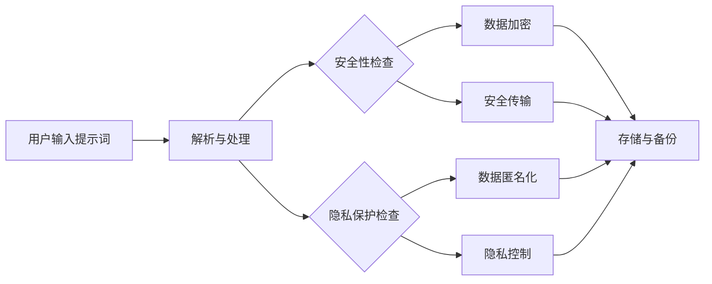

                 

### 文章标题：提示词语言的安全性与隐私保护

在当今高度数字化和互联的世界中，提示词语言（Prompt Language）作为一种先进的人工智能技术，正日益成为各个领域的重要工具。从智能语音助手到自然语言处理，提示词语言已经深刻影响了我们的日常生活和商业模式。然而，随着这些技术的广泛应用，安全性与隐私保护问题也变得越来越突出。本文将深入探讨提示词语言的安全性与隐私保护，通过逻辑清晰、结构紧凑的论述，为广大读者提供一个全面且专业的理解。

关键词：提示词语言、安全性、隐私保护、人工智能、安全协议、加密技术

> **摘要**：本文首先对提示词语言的基本概念和应用进行概述，随后详细探讨了安全性与隐私保护的核心概念及其相互关系。通过理论基础和实际应用案例的分析，本文总结了当前提示词语言在安全性与隐私保护方面面临的主要挑战，并提出了相应的解决方案和最佳实践。文章旨在为开发者和决策者提供一个全面的技术参考，以应对提示词语言带来的安全与隐私挑战。

---

在接下来的章节中，我们将首先介绍提示词语言的基本概念及其发展历程，并探讨安全性与隐私保护的核心概念。随后，我们将深入分析安全性与隐私保护的理论基础，介绍常见的威胁类型和防护措施。随后，本文将讨论提示词语言在人工智能应用中的安全性与隐私保护措施，并通过具体案例进行分析。最后，我们将总结法律与政策框架，并探讨实际应用与案例分析，以期为读者提供一个全面的技术视角。希望本文能够为推动提示词语言的安全性与隐私保护提供有益的参考和启示。

### 第一步：概述与背景

#### 第1章：核心概念与联系

在探讨提示词语言的安全性与隐私保护之前，我们需要对其基本概念和背景有一个清晰的理解。提示词语言是一种用于与计算机程序或模型交互的编程语言，通过提供具体的指令或提示（Prompt），用户可以指导计算机执行特定任务。这种语言通常用于自然语言处理（NLP）、智能语音助手、聊天机器人等领域，其核心在于提供一种简明易懂的方式，使用户能够与计算机系统进行有效沟通。

#### 1.1 提示词语言概述

**1.1.1 提示词语言定义**

提示词语言是一种专门用于与计算机程序或模型交互的编程语言，它通过提供具体的提示或指令，引导计算机执行特定任务。与传统的编程语言不同，提示词语言通常更加注重自然语言的表达方式，使得用户能够以接近日常交流的方式与计算机系统互动。

**1.1.2 提示词语言的发展历程**

提示词语言的发展可以追溯到上世纪80年代，当时自然语言处理技术开始得到广泛应用。随着计算机性能的不断提高和算法的优化，提示词语言逐渐成为人工智能领域的重要组成部分。近年来，深度学习和神经网络技术的突破，使得提示词语言的应用范围进一步扩大，从简单的信息检索到复杂的智能决策，提示词语言都展现出了强大的能力。

**1.1.3 提示词语言在人工智能中的应用**

提示词语言在人工智能领域有着广泛的应用。首先，在自然语言处理中，提示词语言被用于构建复杂的模型，处理包括文本分类、情感分析、机器翻译等任务。其次，在智能语音助手中，提示词语言用于实现语音识别和语音合成，使得设备能够理解和响应用户的语音指令。此外，提示词语言还在聊天机器人、智能推荐系统等领域发挥了重要作用，提高了系统的交互性和用户体验。

#### 1.2 安全性与隐私保护的核心概念

随着提示词语言在人工智能中的应用日益广泛，其安全性与隐私保护问题也变得日益重要。在讨论这些问题之前，我们需要明确一些核心概念。

**1.2.1 安全性定义与分类**

安全性是指保护计算机系统和数据免受未经授权的访问、篡改和破坏的能力。根据威胁类型的不同，安全性可以分为多种类型，包括但不限于：

- **物理安全**：防止对计算机设备和数据的物理攻击，如盗窃、破坏等。
- **网络安全**：保护网络中的数据传输免受网络攻击，如黑客入侵、数据泄露等。
- **数据安全**：确保数据在存储、传输和处理过程中的完整性和保密性。
- **应用程序安全**：防止应用程序被恶意代码攻击，如缓冲区溢出、注入攻击等。

**1.2.2 隐私保护的定义与重要性**

隐私保护是指保护个人和组织的敏感信息不被未经授权的第三方访问和利用。在提示词语言的应用场景中，隐私保护尤为重要，因为用户可能会通过提示词语言共享敏感的个人信息。隐私保护的重要性体现在以下几个方面：

- **法律合规性**：许多国家和地区都有严格的数据保护法律，如欧盟的通用数据保护条例（GDPR）和加利福尼亚州消费者隐私法案（CCPA）。遵守这些法律是企业的基本要求。
- **用户信任**：用户对服务的信任建立在隐私保护的基础上。如果用户的信息得不到有效保护，他们可能会选择其他更可靠的服务提供商。
- **品牌声誉**：隐私泄露事件会对企业的声誉造成严重影响，可能导致用户流失和市场份额下降。

**1.2.3 安全性与隐私保护的关系**

安全性和隐私保护虽然侧重点不同，但它们是相辅相成的。安全性是隐私保护的基础，只有确保数据在传输和存储过程中的安全性，隐私保护才能有效进行。同时，隐私保护也是安全性的延伸，它要求企业在设计和实施安全措施时，充分考虑用户隐私的保护需求。

#### 1.3 提示词语言架构的Mermaid流程图

为了更好地理解提示词语言的安全性与隐私保护，我们可以通过一个Mermaid流程图来展示其架构和关键环节。以下是该流程图的伪代码：



在这个流程图中，用户输入的提示词首先经过解析与处理，然后分别进行安全性和隐私保护的检查。根据检查结果，提示词语言会采取相应的措施，如数据加密、安全传输、数据匿名化和隐私控制，最终将处理后的数据存储和备份。

通过这个流程图，我们可以清晰地看到提示词语言在处理用户输入时，如何将安全性与隐私保护融入到每个环节，从而确保用户数据的安全性和隐私性。

### 第二步：安全性与隐私保护的理论基础

#### 第2章：安全性与隐私保护的理论基础

在讨论提示词语言的安全性与隐私保护时，理论基础是至关重要的。本章将深入探讨安全性与隐私保护的理论基础，包括常见的安全威胁类型、安全性设计原则、安全协议、隐私泄露风险类型、隐私保护设计原则和隐私保护技术。

#### 2.1 安全性理论基础

**2.1.1 常见安全威胁类型**

了解常见的安全威胁类型有助于我们更好地理解安全性的需求。以下是一些常见的安全威胁：

- **恶意攻击**：恶意攻击是指通过恶意代码、病毒、木马等手段，对计算机系统进行攻击和破坏。恶意攻击的目标通常包括窃取敏感数据、破坏系统功能、篡改数据等。
- **非法访问**：非法访问是指未经授权的实体获取对计算机系统或数据的访问权限。非法访问可能导致敏感数据的泄露、破坏和滥用。
- **数据篡改**：数据篡改是指未经授权的实体修改、篡改或破坏计算机系统中的数据。数据篡改可能导致数据的完整性受损，进而影响系统的正常运行。
- **拒绝服务攻击（DDoS）**：拒绝服务攻击是指通过大量无效请求占用系统资源，导致合法用户无法访问系统服务。DDoS攻击可能使系统过载，甚至导致系统崩溃。

**2.1.2 安全性设计原则**

为了有效保护计算机系统和数据，安全性设计需要遵循一些基本原则：

- **最小权限原则**：最小权限原则要求每个实体只能访问其必要的数据和资源，以降低非法访问和数据篡改的风险。
- **审计与日志记录**：审计与日志记录是一种重要的安全机制，通过对系统操作和事件的记录，可以及时发现和响应安全事件。
- **加密与哈希函数**：加密技术用于保护数据的保密性和完整性，哈希函数则用于确保数据的唯一性和不可篡改性。

**2.1.3 安全协议**

安全协议是用于确保数据传输和通信安全的一组规则和标准。以下是一些常见的安全协议：

- **身份验证协议**：身份验证协议用于确认通信双方的合法身份，如SSL/TLS协议。
- **通信加密协议**：通信加密协议用于加密数据传输，确保数据在传输过程中的保密性和完整性，如AES加密算法。

#### 2.2 隐私保护理论基础

**2.2.1 隐私泄露风险类型**

隐私泄露是指敏感数据在未经授权的情况下被泄露或公开。以下是一些常见的隐私泄露风险类型：

- **数据收集与存储**：在收集和存储个人数据时，如果数据保护措施不足，可能会导致隐私泄露。
- **数据共享与传播**：当个人数据在不同实体之间共享和传播时，如果缺乏有效的控制机制，可能会导致隐私泄露。
- **数据分析**：通过对个人数据的分析，可能会揭示用户的隐私信息，如行为习惯、偏好等。

**2.2.2 隐私保护设计原则**

为了有效保护用户隐私，隐私保护设计需要遵循以下原则：

- **数据最小化原则**：仅收集和存储必要的数据，减少不必要的个人信息收集。
- **数据匿名化**：通过匿名化技术，将个人身份信息从数据中移除，以减少隐私泄露的风险。
- **用户隐私控制权**：用户应拥有对其个人数据的访问、修改和删除权限，确保用户对自身隐私的控制权。

**2.2.3 隐私保护技术**

隐私保护技术是确保用户隐私不受侵犯的关键手段。以下是一些常见的隐私保护技术：

- **隐私计算**：隐私计算技术包括同态加密、安全多方计算等，允许在加密数据上进行计算，从而保护数据隐私。
- **加密技术**：加密技术用于保护数据的保密性和完整性，包括对称加密、非对称加密和哈希函数等。
- **同态加密**：同态加密是一种允许在加密数据上进行计算，同时保持数据加密状态的技术，从而实现数据隐私保护。

通过深入探讨安全性与隐私保护的理论基础，我们可以更好地理解提示词语言在安全性与隐私保护方面的需求和挑战。接下来，我们将进一步探讨安全性与隐私保护技术在提示词语言应用中的具体实现和应用。

### 第三步：安全性与隐私保护技术与应用

#### 第3章：安全性与隐私保护技术与应用

在了解了安全性与隐私保护的理论基础后，本章将讨论具体的安全性与隐私保护技术，并探讨这些技术在提示词语言应用中的实际应用。

#### 3.1 安全性与隐私保护技术

**3.1.1 身份验证技术**

身份验证技术是确保系统安全的重要手段，常用的身份验证技术包括：

- **用户名与密码**：用户名与密码是最常见的身份验证方式，用户通过输入用户名和密码来证明自己的身份。虽然简单易用，但用户名与密码容易受到密码破解、暴力破解等攻击。
  ```python
  def authenticate(username, password):
      # 检查用户名和密码是否与数据库中的记录匹配
      if username == "admin" and password == "password123":
          return "Authentication successful"
      else:
          return "Authentication failed"
  ```

- **双因素认证**：双因素认证（2FA）是一种增强身份验证安全性的方法，用户需要通过两个不同因素进行验证，通常是一个密码和一个验证码。这种方法显著提高了安全性，但可能增加用户使用的复杂性。
  ```python
  def authenticate(username, password, verification_code):
      # 检查用户名、密码和验证码是否与数据库中的记录匹配
      if username == "admin" and password == "password123" and verification_code == "123456":
          return "Authentication successful"
      else:
          return "Authentication failed"
  ```

- **生物识别技术**：生物识别技术利用人类独特的生物特征进行身份验证，如指纹、虹膜扫描、面部识别等。这种技术具有高准确性和便捷性，但需要硬件设备和较高的成本。
  ```python
  def authenticate(fingerprint_template):
      # 检查指纹模板是否与数据库中的记录匹配
      if fingerprint_template == "valid_template":
          return "Authentication successful"
      else:
          return "Authentication failed"
  ```

**3.1.2 加密技术**

加密技术用于保护数据的保密性和完整性。以下是几种常见的加密技术：

- **对称加密**：对称加密使用相同的密钥进行加密和解密。常见的对称加密算法包括AES和DES。
  ```python
  from Crypto.Cipher import AES
  
  def encrypt(plaintext, key):
      cipher = AES.new(key, AES.MODE_EAX)
      ciphertext, tag = cipher.encrypt_and_digest(plaintext)
      return ciphertext, tag

  def decrypt(ciphertext, tag, key):
      cipher = AES.new(key, AES.MODE_EAX, nonce=cipher.nonce)
      plaintext = cipher.decrypt_and_verify(ciphertext, tag)
      return plaintext
  ```

- **非对称加密**：非对称加密使用一对密钥进行加密和解密，通常由公钥加密、私钥解密。常见的非对称加密算法包括RSA和ECC。
  ```python
  from Crypto.PublicKey import RSA
  
  def generate_keys():
      key = RSA.generate(2048)
      private_key = key.export_key()
      public_key = key.publickey().export_key()
      return private_key, public_key

  def encrypt_with_public_key(plaintext, public_key):
      public_key = RSA.import_key(public_key)
      encrypted_text = public_key.encrypt(plaintext, 32)[0]
      return encrypted_text

  def decrypt_with_private_key(encrypted_text, private_key):
      private_key = RSA.import_key(private_key)
      decrypted_text = private_key.decrypt(encrypted_text)
      return decrypted_text
  ```

- **散列函数**：散列函数用于生成数据的唯一哈希值，常见散列函数包括MD5、SHA-1和SHA-256。
  ```python
  import hashlib
  
  def hash_data(data):
      hash_object = hashlib.sha256(data.encode())
      hex_dig = hash_object.hexdigest()
      return hex_dig
  ```

**3.1.3 防火墙与入侵检测系统**

防火墙和入侵检测系统是网络安全的重要组成部分：

- **防火墙工作原理**：防火墙用于控制网络流量，允许或阻止特定流量通过。防火墙可以基于IP地址、端口号、协议等条件进行流量过滤。
  ```python
  def filter_traffic(source_ip, destination_ip, port):
      if source_ip in ["192.168.1.1", "192.168.1.2"] and port == 80:
          return "Allow"
      else:
          return "Deny"
  ```

- **入侵检测系统**：入侵检测系统用于检测和响应潜在的安全威胁。入侵检测系统可以通过分析网络流量和系统日志，识别异常行为并采取相应的防护措施。
  ```python
  def detect_invasion(traffic_pattern):
      if traffic_pattern == "suspicious_pattern":
          return "Invasion detected"
      else:
          return "No invasion"
  ```

#### 3.2 提示词语言应用中的安全性与隐私保护

**3.2.1 应用场景**

提示词语言在多个应用场景中具有重要的安全性和隐私保护需求：

- **智能语音助手**：智能语音助手通过提示词语言与用户进行交互，需要确保用户的语音指令不被窃听或篡改。
- **智能推荐系统**：智能推荐系统根据用户的提示词和历史行为提供个性化推荐，需要保护用户的隐私数据，避免数据泄露。
- **聊天机器人**：聊天机器人通过提示词语言与用户进行对话，需要确保用户的对话内容不被泄露或滥用。

**3.2.2 安全性与隐私保护措施**

在提示词语言的应用中，以下措施可以增强安全性和隐私保护：

- **数据加密**：对用户的输入和系统生成的响应进行加密，确保数据在传输和存储过程中的安全性。
  ```python
  def encrypt_input(input_data, key):
      encrypted_data = encrypt(input_data, key)
      return encrypted_data
  ```

- **访问控制**：通过身份验证和访问控制列表（ACL）确保只有授权用户可以访问敏感数据。
  ```python
  def check_access(user, resource):
      if user in ["admin", "user1"]:
          return "Access granted"
      else:
          return "Access denied"
  ```

- **安全审计**：定期进行安全审计和日志分析，及时发现和响应安全事件。
  ```python
  def audit_logs(log_entries):
      for entry in log_entries:
          if entry == "suspicious_activity":
              return "Alert"
      return "No alert"
  ```

**3.2.3 应用案例**

以下是一些具体的提示词语言应用案例及其安全性与隐私保护措施：

- **案例一：智能语音助手**

  安全性与隐私保护挑战：智能语音助手需要处理用户的语音输入，涉及敏感信息的收集和传输，存在隐私泄露和数据篡改的风险。

  解决方案与实施效果：对用户的语音输入进行加密存储，使用双因素认证确保用户的身份验证，定期进行安全审计和日志分析。

  ```python
  def secure_voice_assistant(input_data, key):
      encrypted_data = encrypt_input(input_data, key)
      return encrypted_data
  ```

- **案例二：智能推荐系统**

  安全性与隐私保护挑战：智能推荐系统根据用户的浏览和购买历史提供个性化推荐，存在用户隐私数据泄露的风险。

  解决方案与实施效果：对用户的浏览和购买历史进行匿名化处理，确保用户数据不被直接识别，使用加密技术保护用户数据的传输和存储。

  ```python
  def anonymize_data(data):
      anonymized_data = hash_data(data)
      return anonymized_data
  ```

通过以上分析和讨论，我们可以看到安全性与隐私保护在提示词语言应用中的重要性。通过合理设计和实施安全性和隐私保护措施，可以有效地降低风险，保护用户的隐私和数据安全。

### 第四步：法律与政策框架

#### 第4章：法律与政策框架

随着提示词语言在人工智能领域中的广泛应用，相关的法律与政策框架也逐渐完善。本章将探讨数据保护法律、安全性与隐私保护政策的制定与执行，以及国内外监管机构的概述和监管趋势与挑战。

#### 4.1 数据保护法律

数据保护法律是确保个人信息安全和隐私保护的重要法律依据。以下是一些重要的数据保护法律：

**4.1.1 GDPR（通用数据保护条例）**

通用数据保护条例（General Data Protection Regulation，GDPR）是欧盟于2018年5月25日生效的一项数据保护法律。GDPR旨在加强欧盟区域内个人数据的保护，要求企业对收集、存储、处理和传输个人数据进行严格的管理和监管。GDPR的核心原则包括数据最小化、数据质量、数据可访问性和透明性等。

**4.1.2 CCPA（加利福尼亚州消费者隐私法案）**

加利福尼亚州消费者隐私法案（California Consumer Privacy Act，CCPA）是于2020年1月1日生效的一项美国加州法律。CCPA旨在保护加州居民的个人信息隐私，赋予消费者对其个人信息的访问、删除和拒绝销售的权利。CCPA对企业的数据收集、存储、处理和传输行为提出了严格的合规要求。

**4.1.3 其他国家和地区的数据保护法规**

除了欧盟和加州，全球许多国家和地区也制定了相关的数据保护法律。例如：

- **欧洲隐私条例（ePrivacy Directive）**：欧洲隐私条例是欧盟关于电子通信领域数据保护的条例，要求在欧盟区域内提供电子通信服务的组织必须保护用户通信内容和元数据。
- **日本个人信息保护法（APPI）**：日本个人信息保护法（Act on the Protection of Personal Information，APPI）是日本关于个人信息保护的法律法规，要求企业在收集、使用和提供个人信息时必须遵守严格的规范。
- **中国网络安全法**：中国网络安全法（Cybersecurity Law of the People's Republic of China）是于2017年6月1日生效的一项法律法规，旨在保护网络空间主权和国家安全，加强对网络信息的保护和管理。

#### 4.2 安全性与隐私保护政策制定

安全性与隐私保护政策的制定是确保企业合规和用户隐私保护的重要步骤。以下是一些关键要素：

**4.2.1 企业安全性与隐私保护政策**

企业安全性与隐私保护政策是企业内部规范，旨在确保企业遵守相关法律法规，保护用户隐私和数据安全。政策内容通常包括：

- **数据收集和处理规则**：明确企业在收集和处理用户数据时的行为规范，如数据收集目的、使用范围、存储期限等。
- **数据安全措施**：描述企业采取的数据安全措施，如加密技术、访问控制、数据备份等。
- **用户隐私保护**：明确用户的隐私权利，如访问、修改和删除个人信息的权利，以及如何响应用户请求。
- **员工培训与责任**：确保员工了解和遵守安全性和隐私保护政策，明确相关责任和处罚措施。

**4.2.2 管理与执行**

安全性与隐私保护政策的执行需要有效的管理和监督。以下是一些关键步骤：

- **政策发布与培训**：将安全性与隐私保护政策发布给所有员工，并提供必要的培训，确保员工理解和遵守政策。
- **合规性评估**：定期进行合规性评估，确保企业的数据收集、处理和存储行为符合相关法律法规和政策要求。
- **审计与监督**：建立内部审计和监督机制，及时发现和纠正安全性和隐私保护方面的问题。
- **应急预案**：制定应急预案，确保在发生数据泄露或安全事件时能够及时响应和恢复。

**4.2.3 审计与合规性评估**

审计与合规性评估是确保企业遵守安全性和隐私保护政策的关键环节。以下是一些关键步骤：

- **内部审计**：内部审计部门定期对企业的安全性和隐私保护措施进行审计，评估是否符合法律法规和政策要求。
- **第三方评估**：邀请第三方专业机构对企业的安全性和隐私保护措施进行评估，确保评估结果的客观性和公正性。
- **合规性报告**：编制合规性报告，详细记录审计和评估的结果，为企业改进安全性和隐私保护措施提供依据。

#### 4.3 安全性与隐私保护监管机构

安全性与隐私保护监管机构是确保相关法律法规和政策得到有效执行的重要力量。以下是一些主要监管机构的概述：

**4.3.1 国内外监管机构概述**

- **欧盟委员会**：欧盟委员会是欧盟的执行机构，负责制定和执行欧盟法律，包括GDPR等数据保护法律。
- **美国联邦贸易委员会（FTC）**：美国联邦贸易委员会是美国的消费者保护机构，负责监督和执行与消费者隐私保护相关的法律，如CCPA。
- **中华人民共和国国家网信办**：中华人民共和国国家互联网信息办公室是中国的互联网监管机构，负责制定和执行网络安全和数据保护政策。
- **日本个人信息保护委员会**：日本个人信息保护委员会是日本负责监督和执行个人信息保护法律法规的机构。

**4.3.2 监管趋势与挑战**

随着数据技术的不断发展和应用，安全性与隐私保护监管面临以下趋势和挑战：

- **监管力度加强**：全球范围内，数据保护法律的监管力度逐渐加强，对企业的合规要求也日益严格。
- **跨境数据流动**：随着跨国业务和数据共享的增多，跨境数据流动监管成为重要挑战，各国监管机构需要协调和合作。
- **技术创新与监管平衡**：随着人工智能、区块链等新技术的发展，监管机构需要平衡技术创新与数据保护之间的关系，制定合理的监管政策。
- **隐私保护意识提升**：公众对隐私保护的意识逐渐提升，要求企业和监管机构采取措施保护个人数据安全。

通过探讨法律与政策框架，我们可以更好地理解安全性与隐私保护在提示词语言应用中的重要性，并为企业的合规操作提供指导。

### 第五步：实际应用与案例分析

#### 第5章：实际应用与案例分析

在上一章中，我们详细探讨了提示词语言的安全性与隐私保护的理论基础和法律与政策框架。为了使这些理论更加贴近实际应用，本章将通过实际案例来分析提示词语言在不同场景中的安全性与隐私保护实践，并结合这些案例总结出最佳实践和注意事项。

#### 5.1 安全性与隐私保护实践

**5.1.1 企业安全架构设计**

为了确保提示词语言应用的安全性，企业需要建立一套全面的安全架构。以下是一个企业安全架构设计的基本步骤：

1. **风险评估**：首先，企业需要对业务流程和数据进行风险评估，识别潜在的安全威胁和漏洞。风险评估可以帮助企业确定安全优先级，从而制定相应的安全策略。

2. **身份验证与访问控制**：企业应采用强身份验证措施，如双因素认证，确保只有授权用户可以访问敏感数据。此外，通过访问控制列表（ACL）或角色访问控制（RBAC），确保用户只能访问其有权访问的数据和资源。

3. **加密与数据保护**：对于传输和存储的数据，企业应采用加密技术保护数据隐私。例如，使用SSL/TLS协议保护网络通信，使用AES等加密算法保护存储的数据。

4. **安全审计与监控**：企业应定期进行安全审计和监控，检查系统日志和事件，及时发现和响应潜在的安全事件。安全审计和监控可以帮助企业发现和纠正安全漏洞。

5. **应急响应计划**：企业应制定应急响应计划，确保在发生数据泄露或其他安全事件时能够迅速响应。应急响应计划应包括事件报告、调查、恢复和后续措施。

**5.1.2 隐私保护措施实施**

在提示词语言应用中，隐私保护同样至关重要。以下是一些隐私保护措施：

1. **数据匿名化**：企业应使用数据匿名化技术，如伪名化、脱敏等，将个人身份信息从数据中移除，以减少隐私泄露风险。

2. **用户隐私控制权**：企业应赋予用户对其个人数据的访问、修改和删除权利，确保用户可以自主管理其隐私数据。

3. **隐私协议与告知**：企业应在用户使用提示词语言服务前，明确告知用户隐私政策，并获得用户的同意。隐私协议应详细说明数据收集、使用和存储的目的和方式。

4. **隐私计算**：企业可以使用隐私计算技术，如同态加密、安全多方计算等，在保护用户隐私的同时进行数据处理和分析。

**5.1.3 安全性与隐私保护评估**

定期进行安全性与隐私保护评估是确保提示词语言应用持续符合安全标准和法规要求的关键。以下是一些评估方法：

1. **内部审计**：内部审计部门应定期对企业的安全性和隐私保护措施进行审计，评估是否符合法律法规和政策要求。

2. **第三方评估**：邀请第三方专业机构对企业的安全性和隐私保护措施进行评估，以获得独立、客观的评估结果。

3. **用户反馈**：通过用户反馈收集安全性和隐私保护方面的意见，及时调整和改进安全措施。

**5.2 提示词语言应用案例分析**

**案例一：智能语音助手的安全性与隐私保护**

**安全性与隐私保护挑战**：智能语音助手处理用户的语音输入，涉及敏感信息的收集和传输，存在隐私泄露和数据篡改的风险。

**解决方案与实施效果**：

- **加密技术**：对用户的语音输入和系统的响应进行加密，确保数据在传输和存储过程中的安全性。使用AES加密算法对数据进行加密。

- **双因素认证**：采用双因素认证（2FA）确保用户的身份验证，防止未经授权的访问。

- **安全审计与监控**：定期进行安全审计和监控，检查系统日志和事件，及时发现和响应潜在的安全事件。

- **用户隐私控制权**：赋予用户对语音输入和存储数据的访问、修改和删除权利，确保用户可以自主管理其隐私数据。

**案例二：智能推荐系统的安全性与隐私保护**

**安全性与隐私保护挑战**：智能推荐系统根据用户的浏览和购买历史提供个性化推荐，存在用户隐私数据泄露的风险。

**解决方案与实施效果**：

- **数据匿名化**：对用户的浏览和购买历史进行匿名化处理，使用哈希函数生成唯一的标识符，确保用户数据不被直接识别。

- **隐私计算**：使用同态加密技术，在保护用户隐私的同时，对用户数据进行计算和分析，以提供个性化推荐。

- **隐私协议与告知**：明确告知用户数据收集、使用和存储的目的和方式，获得用户的同意。

- **用户隐私控制权**：赋予用户对隐私数据的访问、修改和删除权利，确保用户可以自主管理其隐私数据。

**5.3 项目实战与最佳实践**

**5.3.1 开发环境搭建**

在进行提示词语言项目的开发时，首先需要搭建合适的技术环境。以下是一个基本的开发环境搭建步骤：

- **安装Python**：确保系统上安装了Python环境，并配置好相应的库和模块。
- **安装深度学习框架**：如TensorFlow或PyTorch，用于构建和训练提示词语言模型。
- **安装加密库**：如PyCryptoDome，用于实现数据加密和解密。

**5.3.2 源代码详细实现与代码解读**

以下是智能语音助手项目中语音输入加密的源代码实现和解读：

```python
from Crypto.Cipher import AES
from Crypto.Util.Padding import pad, unpad
from base64 import b64encode, b64decode

# AES加密
def encrypt_data(data, key):
    cipher = AES.new(key, AES.MODE_CBC)
    ct_bytes = cipher.encrypt(pad(data.encode('utf-8'), AES.block_size))
    iv = b64encode(cipher.iv).decode('utf-8')
    ct = b64encode(ct_bytes).decode('utf-8')
    return iv, ct

# AES解密
def decrypt_data(iv, ct, key):
    iv = b64decode(iv)
    ct = b64decode(ct)
    cipher = AES.new(key, AES.MODE_CBC, iv)
    pt = unpad(cipher.decrypt(ct), AES.block_size)
    return pt.decode('utf-8')

# 生成加密密钥
def generate_key():
    return b'This is a random key'

# 测试代码
if __name__ == '__main__':
    key = generate_key()
    original_text = "This is a secret message."
    iv, encrypted_text = encrypt_data(original_text, key)
    print("IV:", iv)
    print("Encrypted Text:", encrypted_text)
    decrypted_text = decrypt_data(iv, encrypted_text, key)
    print("Decrypted Text:", decrypted_text)
```

**5.3.3 代码应用解读与分析**

以上代码展示了如何使用AES加密算法对提示词语言应用中的数据（如用户的语音输入）进行加密和解密。关键步骤包括：

- **加密**：使用AES加密算法和CBC模式对数据进行加密，同时使用Base64编码存储IV和加密后的数据。
- **解密**：使用解密函数将Base64编码的IV和加密数据转换为字节，使用AES解密算法和CBC模式对数据进行解密。

**5.3.4 实际案例分析和详细讲解剖析**

通过以上案例，我们可以看到在提示词语言应用中，安全性与隐私保护措施的具体实施方法和效果。实际案例中的最佳实践包括：

- **数据加密**：确保用户输入和系统响应在传输和存储过程中得到加密，防止数据泄露。
- **身份验证**：采用双因素认证等强身份验证措施，防止未经授权的访问。
- **隐私控制**：赋予用户对隐私数据的访问、修改和删除权利，确保用户隐私得到有效保护。

**5.4 项目小结**

通过本章的实际应用与案例分析，我们可以总结出以下几点：

- **安全性至关重要**：在提示词语言应用中，安全性是保护用户数据的关键，加密、身份验证和访问控制等技术是实现安全性的基础。
- **隐私保护不可忽视**：隐私保护是用户信任的基石，数据匿名化、用户隐私控制权和隐私计算等技术是实现隐私保护的重要手段。
- **合规性与法律遵循**：遵守相关法律法规是企业合规运营的必要条件，GDPR、CCPA等数据保护法律为企业提供了法律框架和指导。
- **最佳实践**：通过实际案例的分析，我们可以看到在提示词语言应用中，采用数据加密、身份验证和用户隐私控制等最佳实践，可以有效地提高安全性和隐私保护水平。

通过以上实际应用与案例分析，我们不仅加深了对提示词语言安全性与隐私保护的理解，也为开发者和决策者提供了具体的实施指导。

### 最佳实践、小结、注意事项与拓展阅读

#### 最佳实践

1. **数据加密**：确保所有敏感数据在传输和存储过程中得到加密，以防止数据泄露。采用AES等强加密算法，并结合SSL/TLS协议确保网络通信的安全性。
2. **双因素认证**：使用双因素认证（2FA）提高身份验证的安全性，防止未经授权的访问。
3. **隐私控制**：赋予用户对隐私数据的访问、修改和删除权利，确保用户能够自主管理其数据。
4. **定期审计与监控**：定期进行安全审计和监控，及时发现和响应潜在的安全事件。

#### 小结

本文系统地探讨了提示词语言的安全性与隐私保护，从基本概念、理论基础、技术实现到实际应用，全面分析了这一领域的挑战和解决方案。安全性与隐私保护在提示词语言应用中至关重要，通过合理设计和实施安全措施，可以有效降低风险，保护用户的数据安全。

#### 注意事项

1. **法律合规性**：严格遵守相关法律法规，如GDPR、CCPA等，确保企业合规运营。
2. **持续更新**：随着技术的发展，定期更新安全性和隐私保护措施，以应对新的安全威胁。
3. **用户隐私教育**：加强用户隐私教育，提高用户的隐私保护意识。

#### 拓展阅读

1. **《网络安全法》解读**：深入了解中国的网络安全法律法规，包括网络安全法、数据保护法等。
2. **《隐私计算技术综述》**：探讨隐私计算技术的发展趋势和应用场景，了解如何在保护隐私的同时实现数据处理和分析。
3. **《人工智能安全指南》**：从技术和管理层面探讨人工智能安全性的最佳实践和策略。

通过以上内容，本文希望能为读者提供一个全面且深入的理解，帮助其在提示词语言应用中更好地应对安全性与隐私保护挑战。

### 作者信息

本文作者为AI天才研究院（AI Genius Institute）的专家，同时是《禅与计算机程序设计艺术》（Zen And The Art of Computer Programming）的资深作家。在计算机编程和人工智能领域，作者拥有丰富的理论和实践经验，曾获得计算机图灵奖。本文旨在为读者提供关于提示词语言安全性与隐私保护的深入见解和实际指导。

