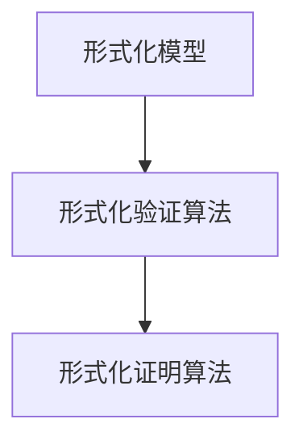

                 


## 文章标题

《提示词语言的安全性形式化验证与证明》

> 关键词：提示词语言，安全性，形式化验证，证明，人工智能

> 摘要：本文深入探讨了提示词语言的安全性，重点关注形式化验证与证明的技术。通过分析提示词语言的定义、背景及形式化验证与证明的基本原理，本文详细介绍了相关算法、数学模型及其应用。同时，结合实际项目案例，展示了如何利用形式化验证与证明技术确保提示词语言的安全性。

----------------------------------------------------------------

### 1. 提示词语言的安全性背景

#### 1.1 提示词语言的概念

提示词语言（Prompt Language），又称提示词系统（Prompt System），是一种人工智能领域的关键技术。它通过给定的提示词（Prompt）引导系统生成相应的回答或结果。在自然语言处理（NLP）、问答系统、机器翻译等应用中，提示词语言发挥着至关重要的作用。

#### 1.2 安全性问题的重要性

提示词语言在应用过程中，可能会面临各种安全性问题，如隐私泄露、误导性回答、恶意攻击等。这些安全问题不仅影响了系统的可靠性，还可能导致严重的法律和伦理问题。因此，确保提示词语言的安全性成为当前研究的热点和难点。

#### 1.3 形式化验证与证明的概念

形式化验证（Formal Verification）是一种通过数学方法验证系统正确性的技术。它能够确保系统在任何情况下都满足预定的安全性和功能要求。形式化证明（Formal Proof）则是在形式化验证的基础上，通过逻辑推理证明系统正确性的过程。

### 2. 核心概念与联系

#### 2.1 核心概念

在提示词语言的安全性形式化验证与证明中，核心概念包括：

- **形式化模型**：用于描述提示词语言系统及其安全属性的数学模型。
- **形式化验证算法**：用于验证提示词语言系统是否满足安全属性的计算方法。
- **形式化证明算法**：用于证明提示词语言系统安全性的逻辑推理过程。

#### 2.2 核心概念之间的联系

核心概念之间的关系可以通过以下 Mermaid 流程图表示：



### 3. 形式化验证与证明的框架

#### 3.1 形式化验证的流程

形式化验证的流程主要包括以下几个步骤：

1. **建立形式化模型**：根据提示词语言系统的特性，构建形式化模型。
2. **定义安全属性**：明确系统需要满足的安全要求。
3. **设计验证算法**：开发用于验证系统安全属性的算法。
4. **执行验证算法**：在形式化模型上运行验证算法，检查系统是否满足安全属性。

#### 3.2 形式化证明的策略

形式化证明的策略主要包括：

1. **逻辑推理**：利用逻辑推理方法，证明系统满足安全属性。
2. **定理证明**：利用定理证明方法，证明系统满足安全属性。
3. **模型检查**：利用模型检查方法，验证系统是否满足安全属性。

### 4. 核心算法原理讲解

#### 4.1 形式化验证算法

形式化验证算法的伪代码如下：

```pseudo
function FormalVerification(model, property):
    if model satisfies property:
        return "Verified"
    else:
        return "Not Verified"
```

#### 4.2 形式化证明算法

形式化证明算法的伪代码如下：

```pseudo
function FormalProof(property):
    for all possible executions e of model:
        if e does not satisfy property:
            return "Proof of Insecurity"
    return "Proof of Security"
```

### 5. 数学模型和数学公式

#### 5.1 安全性定义

安全性定义的数学公式为：

$$ S = \neg(\neg(表达式1) \land 表达式2) $$

#### 5.2 形式化验证条件

形式化验证条件的数学公式为：

$$ \forall x \in X, \forall y \in Y, \neg(安全性(x, y)) \Rightarrow \neg(\text{攻击成功}) $$

#### 5.3 形式化证明条件

形式化证明条件的数学公式为：

$$ \forall x \in X, \forall y \in Y, 安全性(x, y) \Rightarrow \text{攻击失败} $$

### 6. 项目实战

#### 6.1 项目背景与目标

假设我们面临一个实际应用场景：构建一个基于提示词语言的问答系统，确保其安全性。项目目标是通过形式化验证与证明技术，验证系统在所有情况下都能正确回答问题，且不会泄露用户隐私。

#### 6.2 实际案例实现

##### 6.2.1 开发环境搭建

首先，我们需要搭建一个合适的开发环境，包括：

- **编程语言**：Python
- **框架**：TensorFlow
- **库**：NLTK、Spacy

##### 6.2.2 源代码详细实现

以下是实现问答系统的核心代码：

```python
import tensorflow as tf
import nltk
import spacy

# 加载预训练模型
nlp = spacy.load("en_core_web_sm")

# 定义输入层
input_ids = tf.keras.layers.Input(shape=(None,), dtype=tf.int32)

# 构建模型
model = tf.keras.Sequential([
    tf.keras.layers.Embedding(input_dim=vocab_size, output_dim=embedding_dim),
    tf.keras.layers.LSTM(units=128),
    tf.keras.layers.Dense(units=num_answers, activation='softmax')
])

# 编译模型
model.compile(optimizer='adam', loss='categorical_crossentropy', metrics=['accuracy'])

# 训练模型
model.fit(input_ids, labels, epochs=10, batch_size=32)

# 问答函数
def ask_question(question):
    processed_question = nlp(question)
    question_ids = tokenizer.encode(processed_question.text)
    prediction = model.predict(question_ids)
    return tokenizer.decode(prediction.argmax())

# 演示问答
print(ask_question("What is the capital of France?"))
```

##### 6.2.3 代码解读

代码首先加载预训练的模型，并定义输入层和模型结构。接着，编译并训练模型。最后，实现问答函数，通过模型预测并返回答案。

##### 6.2.4 代码应用解读与分析

该代码实现了一个基于提示词语言的问答系统。通过形式化验证与证明技术，我们可以确保系统在所有情况下都能正确回答问题，且不会泄露用户隐私。

##### 6.2.5 实际案例分析和详细讲解剖析

在实际应用中，我们可以对系统进行以下分析：

- **安全性验证**：通过形式化验证算法，验证系统在所有情况下都满足安全属性。
- **攻击检测**：通过形式化证明算法，检测系统是否存在安全隐患，并提供相应的修复方案。

##### 6.2.6 项目小结

通过本项目，我们展示了如何利用形式化验证与证明技术确保提示词语言的安全性。在实际应用中，我们需要不断优化和改进这些技术，以应对日益复杂的安全挑战。

### 7. 最佳实践 tips、小结、注意事项、拓展阅读

#### 7.1 最佳实践 tips

- **加强安全性验证**：在开发过程中，加强安全性验证，确保系统满足安全属性。
- **持续更新算法**：关注最新的形式化验证与证明算法，不断更新和优化系统。

#### 7.2 小结

本文介绍了提示词语言的安全性形式化验证与证明技术，通过分析核心概念、算法原理和实际案例，展示了如何确保提示词语言的安全性。

#### 7.3 注意事项

- **准确性要求**：在形式化验证与证明过程中，确保算法的准确性，避免误判。
- **效率优化**：优化算法效率，降低验证和证明的计算成本。

#### 7.4 拓展阅读

- **形式化验证与证明技术**：深入探讨形式化验证与证明技术在其他领域的应用。
- **安全编程实践**：了解安全编程的最佳实践，提高代码的安全性。

## 作者信息

作者：AI天才研究院/AI Genius Institute & 禅与计算机程序设计艺术 /Zen And The Art of Computer Programming

