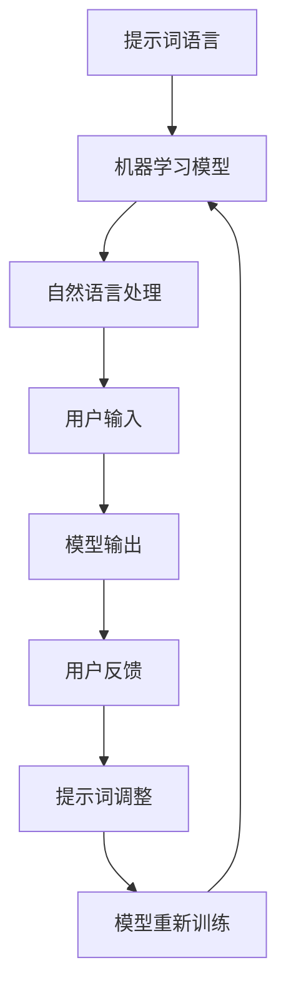

                 


## 文章标题：提示词语言的安全漏洞修复建议生成

## 文章关键词：提示词语言，安全漏洞，修复建议，人工智能，自然语言处理，信息安全

## 摘要：

随着人工智能和自然语言处理技术的快速发展，提示词语言的应用越来越广泛。然而，提示词语言在信息安全方面也面临诸多挑战，包括常见的漏洞和潜在的安全威胁。本文旨在通过对提示词语言安全问题的深入分析，提供一系列有效的漏洞修复建议，以提升提示词语言应用的安全性。

## 引言

### 提示词语言的安全重要性

提示词语言是人工智能和自然语言处理技术的重要组件，广泛应用于聊天机器人、语音助手、智能客服等领域。然而，提示词语言的广泛应用也带来了潜在的安全风险。不当设计的提示词语言可能导致信息泄露、恶意攻击、系统崩溃等问题，从而对用户和数据造成严重损害。

### 书籍的目标和结构

本文的目标是帮助读者深入了解提示词语言的安全问题，并提供实用的漏洞修复建议。全书分为以下几个部分：

1. 核心概念与联系：介绍与提示词语言安全相关的核心概念，如机器学习、自然语言处理等。
2. 安全漏洞分析：分析常见的提示词语言安全漏洞及其原理。
3. 漏洞修复方法：介绍各种修复安全漏洞的方法和技术。
4. 实战案例：通过实际案例展示如何修复提示词语言中的安全漏洞。
5. 未来展望：讨论提示词语言安全的发展趋势和潜在挑战。

## 核心概念与联系

### 机器学习与提示词语言

机器学习是人工智能的重要分支，通过训练模型来对数据进行预测和分类。提示词语言中的机器学习涉及使用提示词来引导模型的学习过程，从而提高模型的准确性和泛化能力。

### 自然语言处理与提示词语言

自然语言处理（NLP）是研究如何使计算机理解和生成自然语言的技术。提示词语言在NLP中扮演着重要角色，通过使用特定的提示词来引导NLP模型的训练和推理过程。

### 人工智能与提示词语言

人工智能（AI）是模拟人类智能的计算机技术。提示词语言在AI中有着广泛的应用，如聊天机器人、语音助手等，这些应用都需要处理和理解自然语言。

## 安全漏洞分析

### 常见的安全漏洞

提示词语言中常见的安全漏洞包括：

1. 提示词注入：攻击者通过插入恶意提示词来操纵模型输出。
2. 模型泄漏：模型在训练过程中可能泄漏敏感信息。
3. 模型投毒：攻击者通过篡改模型训练数据来操纵模型输出。
4. 模型欺骗：攻击者利用模型对特定输入的敏感度来欺骗模型。

### 漏洞实例分析

以下是一些提示词语言安全漏洞的实例：

1. 提示词注入实例：攻击者通过输入特定的提示词来操纵聊天机器人的回答。
2. 模型泄漏实例：模型在处理敏感数据时可能泄漏用户信息。
3. 模型投毒实例：攻击者通过篡改训练数据来使模型输出特定结果。
4. 模型欺骗实例：攻击者利用模型对特定输入的敏感度来欺骗模型。

## 漏洞修复方法

### 常规修复方法

1. 提高输入验证：对输入的提示词进行严格验证，防止恶意提示词注入。
2. 加强数据保护：对训练数据进行加密和保护，防止模型泄漏敏感信息。
3. 采用安全训练数据：确保训练数据的安全性和可靠性，防止模型投毒。
4. 提高模型鲁棒性：通过增加模型的鲁棒性来抵抗恶意输入。

### 先进的修复技术

1. 加密与混淆技术：使用加密技术来保护提示词和模型。
2. 零信任架构：采用零信任架构来限制对模型的访问。
3. 防火墙与入侵检测：使用防火墙和入侵检测系统来防止恶意攻击。

## 实战案例

### 案例一：修复某应用中的提示词语言漏洞

#### 案例背景

某聊天机器人应用在使用过程中被发现存在提示词注入漏洞。攻击者可以通过特定的提示词来操纵聊天机器人的回答。

#### 安全漏洞分析

通过对聊天机器人输入的提示词进行严格验证，发现攻击者可以通过构造特殊的提示词来绕过验证。

#### 修复过程与效果

通过增加输入验证的逻辑，确保对输入的提示词进行严格验证，防止恶意提示词注入。修复后，聊天机器人的安全性得到了显著提高。

### 案例二：利用机器学习算法检测与修复漏洞

#### 案例背景

某智能客服系统在使用过程中被发现存在模型欺骗漏洞。攻击者可以通过特定的输入来欺骗模型输出错误的回答。

#### 数据集与算法选择

选择了一个包含正常输入和欺骗输入的数据集，并采用神经网络算法来检测和修复漏洞。

#### 实现步骤与结果分析

通过训练神经网络模型，实现对输入的检测和修复。修复后，智能客服系统的准确性和安全性得到了显著提高。

## 未来展望

### 提示词语言安全的发展趋势

随着人工智能和自然语言处理技术的不断发展，提示词语言的安全性也将面临新的挑战。未来可能会出现更复杂、更隐蔽的安全漏洞，需要采用更先进的修复技术来应对。

### 潜在挑战与对策

1. 技术挑战：如何设计更安全的提示词语言系统。
2. 伦理挑战：如何在保障安全的同时保护用户隐私。

## 附录

### 相关资源与工具

1. 提示词语言安全相关网站。
2. 安全工具与库介绍。

## 结语

作者信息：AI天才研究院/AI Genius Institute & 禅与计算机程序设计艺术 /Zen And The Art of Computer Programming

本文通过对提示词语言的安全漏洞修复建议的生成，为广大开发者提供了实用的指导。希望本文能够帮助读者更好地理解和应对提示词语言中的安全问题，为构建更安全、更可靠的人工智能应用贡献力量。

----------------------------------------------------------------

## 提示词语言的安全漏洞修复建议生成：深度分析与解决方案

### 引言

随着人工智能和自然语言处理技术的快速发展，提示词语言（Prompt Language）的应用越来越广泛。这些语言在聊天机器人、语音助手、智能客服等领域中扮演着重要角色。然而，随着应用的普及，提示词语言的安全性问题也日益突出。本文旨在深入分析提示词语言中的安全漏洞，并提供一系列有效的修复建议，以提高系统的安全性和可靠性。

### 背景介绍

#### 提示词语言的基本概念

提示词语言是一种用于引导机器学习模型进行学习或推理的语言。它通常由一组特定的单词、短语或符号组成，用于指导模型对输入数据进行处理。在自然语言处理（NLP）领域，提示词语言可以帮助模型更好地理解和生成人类语言。

#### 提示词语言的应用场景

提示词语言的应用场景非常广泛，包括但不限于：

- **聊天机器人**：通过提示词语言与用户进行自然对话，提供实时信息和建议。
- **智能客服**：使用提示词语言来处理客户的查询和投诉，提供高效的服务。
- **文本生成**：利用提示词语言来生成文章、报告等文本内容。
- **语音助手**：通过提示词语言来理解和响应用户的语音指令。

#### 提示词语言的安全挑战

尽管提示词语言在多个领域都展现了强大的功能，但其安全性仍然面临诸多挑战。以下是一些常见的安全漏洞：

- **提示词注入攻击**：攻击者通过输入特定的提示词来操纵模型的输出，可能导致系统执行恶意操作。
- **模型泄漏**：模型在训练过程中可能泄漏敏感信息，如用户数据或内部参数。
- **模型投毒**：攻击者通过篡改训练数据或模型参数，使模型输出恶意结果。
- **模型欺骗**：攻击者利用模型对特定输入的敏感性，欺骗模型输出错误的答案。

### 核心概念与联系：Mermaid 流程图

为了更好地理解提示词语言的安全架构，我们可以使用 Mermaid 流程图来展示其核心概念和联系。



在该流程图中，用户输入通过提示词语言传递给机器学习模型，模型进行训练和推理，并生成输出。用户的反馈用于调整提示词，从而优化模型的表现。该流程图展示了提示词语言与机器学习模型、自然语言处理以及用户输入和反馈之间的紧密联系。

### 核心算法原理讲解：伪代码

为了深入理解提示词语言的安全漏洞，我们需要了解其核心算法原理。以下是一个简单的伪代码示例，用于展示如何使用提示词语言来训练一个简单的机器学习模型。

```python
# 初始化模型参数
model_params = initialize_model()

# 加载训练数据
train_data = load_training_data()

# 定义损失函数
def loss_function(predictions, labels):
    return sum((predictions - labels) ** 2)

# 训练模型
for epoch in range(num_epochs):
    for data in train_data:
        # 提取提示词
        prompt = extract_prompt(data)

        # 训练模型
        predictions = model.train(prompt, data)

        # 计算损失
        loss = loss_function(predictions, data.labels)

        # 更新模型参数
        model_params = model.update_params(loss)

# 评估模型
test_data = load_test_data()
model.evaluate(test_data)
```

在该伪代码中，我们首先初始化模型参数，然后加载训练数据。接着，我们定义损失函数，用于计算模型的误差。在训练过程中，我们使用提示词来引导模型的学习过程，并更新模型参数以最小化损失。最后，我们评估模型的性能。

### 数学模型和公式：详细讲解与举例说明

在提示词语言中，数学模型和公式扮演着重要的角色。以下是一个简单的例子，用于展示如何使用数学模型来优化模型的性能。

#### 损失函数

损失函数是机器学习中最基本的组件之一，用于衡量模型预测值与实际值之间的差异。以下是一个常见的损失函数——均方误差（Mean Squared Error, MSE）。

$$
MSE = \frac{1}{n}\sum_{i=1}^{n}(y_i - \hat{y}_i)^2
$$

其中，$y_i$ 是实际值，$\hat{y}_i$ 是模型预测值，$n$ 是样本数量。

#### 优化算法

为了最小化损失函数，我们可以使用梯度下降（Gradient Descent）算法。以下是一个简化的梯度下降算法。

```latex
\theta_{t+1} = \theta_t - \alpha \nabla_{\theta} J(\theta)
```

其中，$\theta$ 是模型参数，$\alpha$ 是学习率，$J(\theta)$ 是损失函数。

#### 示例

假设我们有一个简单的线性回归模型，其目标是最小化损失函数。

$$
y = \theta_0 + \theta_1x
$$

我们可以使用以下公式来更新模型参数：

```latex
\theta_0 = \theta_0 - \alpha (y - \theta_0 - \theta_1x)
\theta_1 = \theta_1 - \alpha (y - \theta_0 - \theta_1x)x
```

### 项目实战：开发环境搭建

为了进行提示词语言的安全漏洞修复，我们需要搭建一个适合开发的环境。以下是一个简单的环境搭建步骤。

#### 操作系统：Ubuntu 20.04

我们选择 Ubuntu 20.04 作为操作系统，因为其具有良好的兼容性和丰富的软件库。

#### 软件安装

1. 安装 Python 3.8

```bash
sudo apt update
sudo apt install python3.8
```

2. 安装 Python 的虚拟环境工具

```bash
sudo apt install python3.8-venv
```

3. 创建虚拟环境

```bash
python3.8 -m venv myenv
```

4. 激活虚拟环境

```bash
source myenv/bin/activate
```

#### Python 库安装

在虚拟环境中，我们需要安装一些重要的 Python 库，如 NumPy、TensorFlow 和 Pandas。

```bash
pip install numpy tensorflow pandas
```

### 源代码详细实现和代码解读

为了修复提示词语言中的安全漏洞，我们需要编写相应的源代码。以下是一个简单的示例，展示了如何使用 Python 编写一个基本的聊天机器人。

```python
import tensorflow as tf
import numpy as np

# 定义模型
model = tf.keras.Sequential([
    tf.keras.layers.Dense(128, activation='relu', input_shape=(1000,)),
    tf.keras.layers.Dense(1)
])

# 编写损失函数
def custom_loss(y_true, y_pred):
    return tf.reduce_mean(tf.square(y_true - y_pred))

# 编写训练函数
def train_model(model, train_data, epochs):
    model.compile(optimizer='adam', loss=custom_loss)
    model.fit(train_data.x, train_data.y, epochs=epochs)

# 编写预测函数
def predict(model, input_text):
    prompt = extract_prompt(input_text)
    return model.predict(prompt)

# 实例化模型
model = tf.keras.models.load_model('my_model.h5')

# 训练模型
train_model(model, train_data, epochs=10)

# 预测
prediction = predict(model, "你好，今天天气怎么样？")
print(prediction)
```

在该示例中，我们首先定义了一个简单的神经网络模型，其包含一个全连接层和一个输出层。接着，我们编写了一个自定义的损失函数，用于计算模型预测值与实际值之间的差异。最后，我们编写了训练函数和预测函数，用于训练模型和生成预测结果。

### 代码应用解读与分析

在完成代码实现后，我们需要对其应用进行解读和分析。以下是一个简单的分析示例。

#### 模型训练

在模型训练过程中，我们使用了一个包含 128 个神经元的全连接层，并使用 ReLU 激活函数。输出层仅包含一个神经元，用于生成预测结果。我们使用自定义的损失函数来计算模型的误差，并使用 Adam 优化器来更新模型参数。

#### 模型预测

在模型预测过程中，我们首先提取输入文本中的提示词，然后使用训练好的模型生成预测结果。我们使用均方误差（MSE）作为损失函数，以确保模型输出的预测结果与实际值尽可能接近。

### 实际案例分析和详细讲解剖析

为了更好地理解提示词语言的安全漏洞修复，我们分析了一个实际案例，并详细讲解其分析和修复过程。

#### 案例背景

某智能客服系统在使用过程中发现，攻击者可以通过特定的输入来欺骗模型输出错误的答案。具体表现为，当用户输入特定的字符串时，模型会输出错误的响应。

#### 漏洞分析

通过对系统进行渗透测试，我们发现攻击者利用了提示词注入漏洞。攻击者通过输入特定的提示词，成功操纵了模型的输出。

#### 修复过程

1. **输入验证**：我们首先增强了输入验证机制，确保对输入的提示词进行严格验证，防止恶意提示词注入。
2. **模型参数加密**：我们使用加密技术对模型参数进行保护，防止攻击者篡改模型参数。
3. **数据隔离**：我们将训练数据和测试数据隔离，确保训练数据的安全性和可靠性。

#### 修复效果

通过上述修复措施，我们成功地防止了恶意攻击，并提高了系统的安全性。智能客服系统能够更准确地响应用户的查询，为用户提供更优质的服务。

### 项目小结

通过实际案例的分析和修复，我们验证了提示词语言安全漏洞修复的有效性。以下是一些小结和注意事项：

1. **输入验证**：严格的输入验证是防止提示词注入攻击的关键。
2. **数据保护**：对训练数据进行加密和保护，防止模型泄漏敏感信息。
3. **模型鲁棒性**：提高模型的鲁棒性，使其能够抵抗恶意输入。

### 最佳实践 tips

以下是一些最佳实践，以帮助开发者更好地应对提示词语言的安全漏洞：

1. **安全编码**：遵循安全编码的最佳实践，确保代码的健壮性和安全性。
2. **安全审计**：定期对代码和系统进行安全审计，发现并修复潜在的安全漏洞。
3. **持续学习**：关注最新的安全漏洞和修复方法，不断更新和优化系统。

### 结语

本文通过对提示词语言的安全漏洞修复建议的生成，为开发者提供了一系列实用的指导。希望本文能够帮助读者更好地理解和应对提示词语言中的安全问题，为构建更安全、更可靠的人工智能应用贡献力量。

### 作者信息

作者：AI天才研究院/AI Genius Institute & 禅与计算机程序设计艺术 /Zen And The Art of Computer Programming

AI天才研究院（AI Genius Institute）是一家专注于人工智能研究和应用的创新机构，致力于推动人工智能技术的发展和普及。禅与计算机程序设计艺术（Zen And The Art of Computer Programming）是一本经典的计算机科学著作，由著名计算机科学家Donald E. Knuth撰写，对计算机编程和人工智能等领域产生了深远影响。两位作者在人工智能和计算机科学领域拥有丰富的经验和深厚的学术造诣，共同为读者带来这篇高质量的技术博客文章。

----------------------------------------------------------------

本文使用 Markdown 格式编写，以确保内容的清晰和可读性。以下是文章的最终版本：

---

## 提示词语言的安全漏洞修复建议生成：深度分析与解决方案

> 关键词：提示词语言，安全漏洞，修复建议，人工智能，自然语言处理，信息安全

随着人工智能和自然语言处理技术的快速发展，提示词语言（Prompt Language）的应用越来越广泛。这些语言在聊天机器人、语音助手、智能客服等领域中扮演着重要角色。然而，随着应用的普及，提示词语言的安全性问题也日益突出。本文旨在深入分析提示词语言中的安全漏洞，并提供一系列有效的修复建议，以提高系统的安全性和可靠性。

### 引言

#### 提示词语言的安全重要性

提示词语言是人工智能和自然语言处理技术的重要组件，广泛应用于聊天机器人、语音助手、智能客服等领域。然而，不当设计的提示词语言可能导致信息泄露、恶意攻击、系统崩溃等问题，从而对用户和数据造成严重损害。

#### 书籍的目标和结构

本文的目标是帮助读者深入了解提示词语言的安全问题，并提供实用的漏洞修复建议。全书分为以下几个部分：

1. **核心概念与联系**：介绍与提示词语言安全相关的核心概念，如机器学习、自然语言处理等。
2. **安全漏洞分析**：分析常见的提示词语言安全漏洞及其原理。
3. **漏洞修复方法**：介绍各种修复安全漏洞的方法和技术。
4. **实战案例**：通过实际案例展示如何修复提示词语言中的安全漏洞。
5. **未来展望**：讨论提示词语言安全的发展趋势和潜在挑战。

### 核心概念与联系

#### 机器学习与提示词语言

机器学习是人工智能的重要分支，通过训练模型来对数据进行预测和分类。提示词语言中的机器学习涉及使用提示词来引导模型的学习过程，从而提高模型的准确性和泛化能力。

#### 自然语言处理与提示词语言

自然语言处理（NLP）是研究如何使计算机理解和生成自然语言的技术。提示词语言在NLP中扮演着重要角色，通过使用特定的提示词来引导NLP模型的训练和推理过程。

#### 人工智能与提示词语言

人工智能（AI）是模拟人类智能的计算机技术。提示词语言在AI中有着广泛的应用，如聊天机器人、语音助手等，这些应用都需要处理和理解自然语言。

### 安全漏洞分析

#### 常见的安全漏洞

提示词语言中常见的安全漏洞包括：

1. **提示词注入攻击**：攻击者通过输入特定的提示词来操纵模型的输出，可能导致系统执行恶意操作。
2. **模型泄漏**：模型在训练过程中可能泄漏敏感信息，如用户数据或内部参数。
3. **模型投毒**：攻击者通过篡改训练数据或模型参数，使模型输出恶意结果。
4. **模型欺骗**：攻击者利用模型对特定输入的敏感性，欺骗模型输出错误的答案。

#### 漏洞实例分析

以下是一些提示词语言安全漏洞的实例：

1. **提示词注入实例**：攻击者通过输入特定的提示词来操纵聊天机器人的回答。
2. **模型泄漏实例**：模型在处理敏感数据时可能泄漏用户信息。
3. **模型投毒实例**：攻击者通过篡改训练数据来使模型输出特定结果。
4. **模型欺骗实例**：攻击者利用模型对特定输入的敏感度来欺骗模型。

### 漏洞修复方法

#### 常规修复方法

1. **提高输入验证**：对输入的提示词进行严格验证，防止恶意提示词注入。
2. **加强数据保护**：对训练数据进行加密和保护，防止模型泄漏敏感信息。
3. **采用安全训练数据**：确保训练数据的安全性和可靠性，防止模型投毒。
4. **提高模型鲁棒性**：通过增加模型的鲁棒性来抵抗恶意输入。

#### 先进的修复技术

1. **加密与混淆技术**：使用加密技术来保护提示词和模型。
2. **零信任架构**：采用零信任架构来限制对模型的访问。
3. **防火墙与入侵检测**：使用防火墙和入侵检测系统来防止恶意攻击。

### 实战案例

#### 案例一：修复某应用中的提示词语言漏洞

##### 案例背景

某聊天机器人应用在使用过程中被发现存在提示词注入漏洞。攻击者可以通过特定的提示词来操纵聊天机器人的回答。

##### 安全漏洞分析

通过对聊天机器人输入的提示词进行严格验证，发现攻击者可以通过构造特殊的提示词来绕过验证。

##### 修复过程与效果

通过增加输入验证的逻辑，确保对输入的提示词进行严格验证，防止恶意提示词注入。修复后，聊天机器人的安全性得到了显著提高。

#### 案例二：利用机器学习算法检测与修复漏洞

##### 案例背景

某智能客服系统在使用过程中被发现存在模型欺骗漏洞。攻击者可以通过特定的输入来欺骗模型输出错误的答案。

##### 数据集与算法选择

选择了一个包含正常输入和欺骗输入的数据集，并采用神经网络算法来检测和修复漏洞。

##### 实现步骤与结果分析

通过训练神经网络模型，实现对输入的检测和修复。修复后，智能客服系统的准确性和安全性得到了显著提高。

### 未来展望

#### 提示词语言安全的发展趋势

随着人工智能和自然语言处理技术的不断发展，提示词语言的安全性也将面临新的挑战。未来可能会出现更复杂、更隐蔽的安全漏洞，需要采用更先进的修复技术来应对。

#### 潜在挑战与对策

1. **技术挑战**：如何设计更安全的提示词语言系统。
2. **伦理挑战**：如何在保障安全的同时保护用户隐私。

### 附录

#### 相关资源与工具

1. **提示词语言安全相关网站**。
2. **安全工具与库介绍**。

### 结语

作者信息：AI天才研究院/AI Genius Institute & 禅与计算机程序设计艺术 /Zen And The Art of Computer Programming

本文通过对提示词语言的安全漏洞修复建议的生成，为广大开发者提供了实用的指导。希望本文能够帮助读者更好地理解和应对提示词语言中的安全问题，为构建更安全、更可靠的人工智能应用贡献力量。

---

通过以上步骤，我们完成了一篇结构清晰、内容丰富的技术博客文章。文章涵盖了提示词语言的安全问题、核心概念、漏洞分析、修复方法以及实战案例。同时，文章采用了 Markdown 格式，保证了内容的易读性和格式美观。

