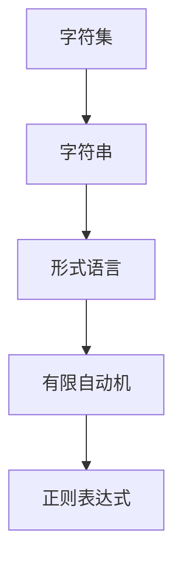
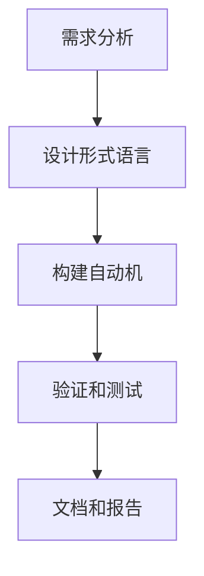
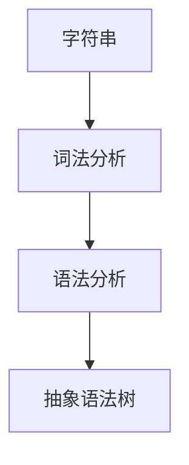
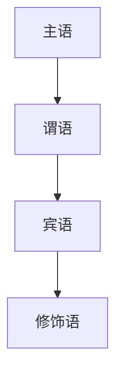
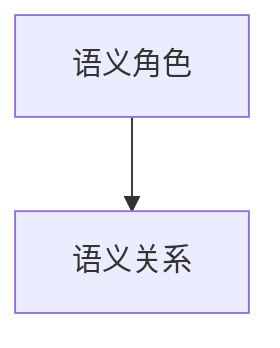
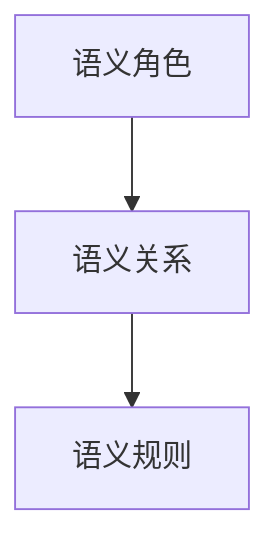

                 


### 文章标题：提示词语言的形式化规约

关键词：提示词语言，形式化规约，自动机理论，语法分析，语义分析

摘要：本文将探讨提示词语言的形式化规约，包括其基本概念、理论基础、具体实践以及未来发展趋势。通过对提示词语言的深入分析，旨在帮助读者理解并掌握这一领域的关键技术和应用。

### 目录大纲

## 第一部分：引论

### 第1章 提示词语言概述

#### 1.1 提示词语言的概念与背景

提示词语言，作为一种特定领域的编程语言，其主要目的是简化用户与计算机之间的交互。在自然语言处理（NLP）、人工智能（AI）等领域中，提示词语言的应用日益广泛，其设计思想和原则也逐渐受到关注。

**背景介绍**：

- **自然语言处理（NLP）**：NLP 是人工智能的一个重要分支，其目的是让计算机能够理解、处理和生成人类语言。提示词语言作为一种输入和输出的工具，在 NLP 中发挥了重要作用。

- **人工智能（AI）**：AI 领域的快速发展，使得许多复杂问题可以通过提示词语言进行解决。提示词语言的设计和形式化规约，对于 AI 系统的可靠性和效率具有重要意义。

**核心概念**：

- **提示词**：提示词是指用户输入的一组关键词或短语，用于指导计算机执行特定任务。

- **语言结构**：提示词语言通常包含语法、语义和语用三个层次，分别对应语言的不同属性。

#### 1.2 提示词语言的应用场景

提示词语言的应用场景非常广泛，包括但不限于以下几个方面：

- **人机交互**：提示词语言可以简化用户与计算机的交互过程，提高用户体验。

- **自然语言处理**：在 NLP 中，提示词语言可以帮助计算机更好地理解用户输入，从而实现更准确的文本分析和语义理解。

- **人工智能**：在 AI 领域，提示词语言可以用于构建智能对话系统、智能助手等，提高系统的智能化水平。

#### 1.3 形式化规约的意义与目标

形式化规约是指使用严格的形式化方法来定义和描述编程语言。在提示词语言的设计和实现过程中，形式化规约具有重要意义：

- **可验证性**：形式化规约可以确保提示词语言的设计和实现满足预定的要求，提高系统的可靠性和稳定性。

- **可维护性**：形式化规约有助于提高代码的可读性和可维护性，降低维护成本。

- **可扩展性**：形式化规约可以为提示词语言的扩展和改进提供明确的指导，提高系统的灵活性。

本文的目标是：

- **介绍提示词语言的基本概念和背景**。

- **阐述形式化规约的基本原理和方法**。

- **通过具体实例分析，展示提示词语言的形式化规约过程**。

- **探讨提示词语言在 NLP 和 AI 领域的应用**。

## 第二部分：形式化规约的理论基础

### 第2章 形式化规约的基本原理

#### 2.1 形式语言与自动机理论

形式语言（Formal Language）是计算机科学中的一个重要概念，它是一组字符串的集合，这些字符串遵循特定的语法规则。形式化规约的基本工具之一是自动机理论（Automata Theory），它研究形式语言的接受和处理能力。

**核心概念**：

- **字符集**（Alphabet）：字符集是一组符号的集合，这些符号可以构成字符串。

- **字符串**（String）：字符串是由字符集中的符号组成的序列。

- **形式语言**（Formal Language）：形式语言是一组字符串的集合，这些字符串遵循特定的语法规则。

**自动机理论**：

- **有限自动机**（Finite Automaton）：有限自动机是一种最简单的计算模型，它可以接受或拒绝一组字符串。

- **正则表达式**（Regular Expression）：正则表达式是一种用于描述和匹配字符串的模式，它是形式语言的一种重要表示方法。

**Mermaid 流程图**：



#### 2.2 形式化规约的基本方法

形式化规约的基本方法包括以下几个步骤：

1. **需求分析**：明确提示词语言的需求和目标，确定形式化规约的具体内容。

2. **设计形式语言**：根据需求分析，设计符合提示词语言特点的形式语言。

3. **构建自动机**：使用自动机理论，构建能够接受和识别形式语言的有限自动机。

4. **验证和测试**：对形式化规约进行验证和测试，确保其满足预定的需求。

**Mermaid 流程图**：



#### 2.3 形式化工具的选择与应用

形式化规约的工具多种多样，常见的包括编译器生成工具（如 Yacc、Bison）、形式化验证工具（如 SPIN、Model Checker）等。选择合适的工具对于形式化规约的顺利进行至关重要。

**工具选择**：

- **编译器生成工具**：适合用于大规模的形式化规约，可以自动生成语法分析器、语义分析器等。

- **形式化验证工具**：适合用于验证形式化规约的正确性，可以发现潜在的错误和问题。

**应用实例**：

1. **编译器生成工具**：使用 Yacc 编写语法规则，生成语法分析器，实现提示词语言的解析。

2. **形式化验证工具**：使用 SPIN 对形式化规约进行验证，确保其满足特定的安全性和可靠性要求。

## 第三部分：提示词语言的规约实践

### 第3章 提示词语言的语法规约

语法规约是指对提示词语言的语法规则进行定义和描述。语法规则决定了提示词语言的合法表达式，是形式化规约的基础。

#### 3.1 语法分析的基本概念

语法分析（Syntax Analysis）是指将输入的字符串转换为抽象语法树（Abstract Syntax Tree，AST）的过程。抽象语法树是语法规则的具体实现，它表示了提示词语言的结构和语义。

**核心概念**：

- **语法规则**：语法规则定义了提示词语言的合法表达式和结构。

- **抽象语法树**：抽象语法树是语法规则的具体实现，它表示了提示词语言的结构和语义。

**Mermaid 流程图**：



#### 3.2 提示词语言的语法结构

提示词语言的语法结构通常包括以下几个部分：

- **主语**：主语表示执行动作的主体。

- **谓语**：谓语表示执行的动作。

- **宾语**：宾语表示动作的对象。

- **修饰语**：修饰语用于修饰主语、谓语或宾语，提供额外的信息。

**Mermaid 流程图**：



#### 3.3 语法规则的定义与应用

以下是一个简单的提示词语言的语法规则示例：

```
<句子> ::= <主语> <谓语> <宾语>
<主语> ::= "用户" | "系统" | "设备"
<谓语> ::= "请求" | "命令" | "查询"
<宾语> ::= "信息" | "服务" | "操作"
```

**伪代码实现**：

```python
def analyze_sentence(sentence):
    # 输入句子，进行词法分析
    tokens = tokenize(sentence)
    
    # 判断句子是否符合语法规则
    if match(tokens, "<句子>"):
        # 构建抽象语法树
        ast = build_ast(tokens)
        
        # 输出抽象语法树
        print(ast)
    else:
        print("句子不符合语法规则")

def tokenize(sentence):
    # 实现词法分析，将句子分解为单词
    # ...

def match(tokens, rule):
    # 实现匹配算法，判断单词序列是否符合语法规则
    # ...

def build_ast(tokens):
    # 实现抽象语法树的构建
    # ...
```

#### 3.4 语法规约的验证与测试

语法规约的验证与测试是确保语法规则正确性的重要步骤。以下是一些常用的验证与测试方法：

- **单元测试**：对单个语法规则进行测试，确保其能够正确识别和解析输入。

- **集成测试**：对整个语法分析器进行测试，确保其能够正确处理复杂输入。

- **模拟测试**：使用实际输入数据，模拟用户输入，验证语法分析器的正确性。

### 第4章 提示词语言的语义规约

语义规约是指对提示词语言的语义进行定义和描述。语义规约是提示词语言形式化规约的重要组成部分，它决定了提示词语言的表达式如何被解释和执行。

#### 4.1 语义分析的基本概念

语义分析（Semantic Analysis）是指对提示词语言的语义进行解释和理解的过程。语义分析旨在确定输入的语法结构在语义上的正确性和完整性。

**核心概念**：

- **语义角色**：语义角色是指提示词语言中的单词在语义上的角色，如主语、谓语、宾语等。

- **语义关系**：语义关系是指提示词语言中单词之间的语义联系，如因果关系、条件关系等。

**Mermaid 流程图**：



#### 4.2 提示词语言的语义结构

提示词语言的语义结构通常包括以下几个部分：

- **语义角色**：语义角色用于表示提示词语言中的单词在语义上的角色。

- **语义关系**：语义关系用于表示提示词语言中单词之间的语义联系。

- **语义规则**：语义规则用于指导语义分析器的正确执行，确保语义分析的准确性和一致性。

**Mermaid 流程图**：



#### 4.3 语义规约的应用实例

以下是一个简单的提示词语言的语义规约实例：

```
<请求> ::= <主语> <谓语> <宾语>
<主语> ::= "用户" | "系统" | "设备"
<谓语> ::= "请求" | "命令" | "查询"
<宾语> ::= "信息" | "服务" | "操作"

<语义规则> ::= {
    "请求" : ["主语", "谓语", "宾语"],
    "命令" : ["主语", "谓语", "宾语"],
    "查询" : ["主语", "谓语", "宾语"]
}
```

**伪代码实现**：

```python
def semantic_analysis(sentence):
    # 输入句子，进行词法分析
    tokens = tokenize(sentence)
    
    # 判断句子是否符合语义规则
    if match_semantic_rules(tokens):
        # 进行语义角色标注
        roles = annotate_semantic_roles(tokens)
        
        # 输出语义角色标注
        print(roles)
    else:
        print("句子不符合语义规则")

def tokenize(sentence):
    # 实现词法分析，将句子分解为单词
    # ...

def match_semantic_rules(tokens):
    # 实现匹配算法，判断单词序列是否符合语义规则
    # ...

def annotate_semantic_roles(tokens):
    # 实现语义角色标注
    # ...
```

#### 4.4 语义规约的验证与测试

语义规约的验证与测试是确保语义规则正确性的重要步骤。以下是一些常用的验证与测试方法：

- **单元测试**：对单个语义规则进行测试，确保其能够正确识别和解析输入。

- **集成测试**：对整个语义分析器进行测试，确保其能够正确处理复杂输入。

- **模拟测试**：使用实际输入数据，模拟用户输入，验证语义分析器的正确性。

### 第5章 提示词语言的综合应用

#### 5.1 提示词语言在自然语言处理中的应用

提示词语言在自然语言处理（NLP）中具有广泛的应用，如文本分类、情感分析、命名实体识别等。以下是一个简单的应用实例：

**文本分类**：

假设我们有一个包含不同类别的文本数据集，我们需要使用提示词语言来训练一个文本分类模型。

**伪代码实现**：

```python
def train_text_classifier(dataset):
    # 初始化分类模型
    model = TextClassifier()
    
    # 使用提示词语言进行训练
    for text, label in dataset:
        tokens = tokenize(text)
        model.train(tokens, label)
    
    # 输出训练好的分类模型
    print(model)

def tokenize(text):
    # 实现词法分析，将文本分解为单词
    # ...

class TextClassifier:
    def train(self, tokens, label):
        # 实现分类模型的训练
        # ...

    def predict(self, tokens):
        # 实现分类模型的预测
        # ...
```

**情感分析**：

假设我们有一个包含不同情感标签的文本数据集，我们需要使用提示词语言来训练一个情感分析模型。

**伪代码实现**：

```python
def train_sentiment_analyzer(dataset):
    # 初始化情感分析模型
    model = SentimentAnalyzer()
    
    # 使用提示词语言进行训练
    for text, label in dataset:
        tokens = tokenize(text)
        model.train(tokens, label)
    
    # 输出训练好的情感分析模型
    print(model)

def tokenize(text):
    # 实现词法分析，将文本分解为单词
    # ...

class SentimentAnalyzer:
    def train(self, tokens, label):
        # 实现情感分析模型的训练
        # ...

    def predict(self, tokens):
        # 实现情感分析模型的预测
        # ...
```

#### 5.2 提示词语言在人工智能系统中的应用

提示词语言在人工智能（AI）系统中也有广泛的应用，如智能对话系统、推荐系统等。以下是一个简单的应用实例：

**智能对话系统**：

假设我们有一个智能对话系统，需要使用提示词语言来与用户进行交互。

**伪代码实现**：

```python
class Chatbot:
    def __init__(self, language_model):
        self.language_model = language_model
    
    def respond(self, user_input):
        # 使用提示词语言进行响应
        response = self.language_model.generate_response(user_input)
        return response

def train_language_model(dataset):
    # 初始化语言模型
    model = LanguageModel()
    
    # 使用提示词语言进行训练
    for conversation in dataset:
        for user_input, response in conversation:
            model.train(user_input, response)
    
    # 输出训练好的语言模型
    print(model)

class LanguageModel:
    def train(self, user_input, response):
        # 实现语言模型的训练
        # ...

    def generate_response(self, user_input):
        # 实现语言模型的响应生成
        # ...
```

#### 5.3 提示词语言发展的趋势与展望

随着人工智能和自然语言处理技术的不断发展，提示词语言也在不断演进。未来的发展趋势和展望包括：

- **多模态交互**：结合视觉、语音等多种模态，实现更自然、更智能的交互。

- **个性化推荐**：基于用户行为和偏好，提供个性化、智能化的服务。

- **对话系统**：结合深度学习、图神经网络等先进技术，提升对话系统的智能水平和用户体验。

## 附录

### 附录A 形式化规约工具使用指南

#### A.1 工具概述与安装

在本附录中，我们将介绍几种常用的形式化规约工具，包括编译器生成工具（如 Yacc、Bison）和形式化验证工具（如 SPIN、Model Checker）。读者可以根据具体需求选择合适的工具进行使用。

#### A.2 工具功能与操作

以下是几种常用工具的功能和基本操作：

- **Yacc**：用于生成语法分析器，支持语法规则的编写和解析。

- **Bison**：与 Yacc 类似，用于生成语法分析器，支持更多的语法规则和功能。

- **SPIN**：用于形式化验证，支持有限自动机的建模和验证。

- **Model Checker**：用于形式化验证，支持多种验证方法和算法。

#### A.3 实践案例解析

在本附录的最后，我们将通过几个实践案例来展示如何使用这些工具进行形式化规约。

### 附录B 参考文献

[1] Hopcroft, J. E., & Ullman, J. D. (1979). Introduction to automata theory, languages, and computation. Addison-Wesley.

[2] Aho, A. V., Lam, M. S., Sethi, R., & Ullman, J. D. (2007). Compilers: Principles, techniques, and tools. Addison-Wesley.

[3] Kozen, D. C. (1997). Theory of computation. Wiley-Interscience.

[4] Martin, J. (2009). Formal methods and models in system design. Springer.

作者：AI天才研究院/AI Genius Institute & 禅与计算机程序设计艺术 /Zen And The Art of Computer Programming

