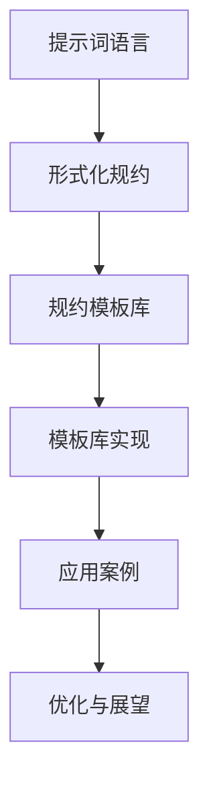
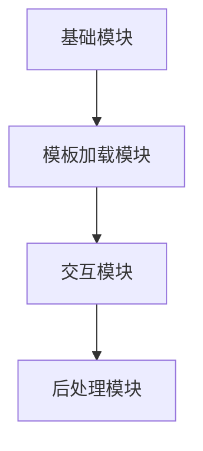

                 

### 提示词语言的形式化规约模板库：背景介绍

提示词语言（Prompt Language）是一种在计算机科学和人工智能领域内广泛应用的技术，主要用于自然语言处理（NLP）、对话系统、智能客服等领域。其核心思想是通过设计特定的提示词（prompts），引导用户或系统完成特定的任务。随着人工智能技术的不断进步，提示词语言在提升系统交互性、智能化程度和用户体验方面发挥了重要作用。

形式化规约（Formal Specification）是软件工程中的一个重要概念，它通过精确的数学模型来描述软件系统的行为和结构。形式化规约的优势在于其高度精确性、一致性和可验证性，有助于降低软件错误率、提高开发效率和代码质量。在提示词语言的开发过程中，形式化规约能够为提示词的设计、实现和验证提供有力的理论支持。

本文将探讨的是提示词语言的形式化规约模板库（Formal Specification Template Library for Prompt Language）。模板库是一种预先设计的、可重用的代码模板集合，它能够提高开发效率、统一开发标准和代码风格。形式化规约模板库则是在形式化规约的基础上，针对提示词语言的特定需求，设计出的一系列模板，用于指导提示词的设计、实现和验证过程。

### 提示词语言的形式化规约模板库：核心概念与联系

在深入探讨提示词语言的形式化规约模板库之前，我们首先需要理解几个核心概念，并揭示它们之间的联系。

#### 提示词语言

提示词语言是一种特殊的语言，用于生成能够引导用户或系统完成特定任务的文本。它通常由一系列规则、指令和提示组成，这些规则和指令定义了如何从用户输入或其他数据源生成响应。提示词语言的关键特性包括：

- **指令性**：提示词语言中的指令清晰明确，指导用户或系统执行特定的动作。
- **上下文感知**：提示词语言能够根据上下文信息动态调整生成的内容，以适应不同的场景和需求。
- **可扩展性**：提示词语言可以通过增加新的规则和指令，来扩展其功能和适用范围。

#### 形式化规约

形式化规约是一种使用数学模型来描述软件系统行为的规范。它的核心目标是确保软件系统的行为在设计和实现阶段就得到准确、一致的描述，从而减少后续开发中的错误和风险。形式化规约的关键概念包括：

- **精确性**：形式化规约通过数学语言来描述系统的行为，确保描述的精确性和一致性。
- **一致性**：形式化规约确保系统内部各部分之间的一致性，避免逻辑冲突和错误。
- **可验证性**：形式化规约允许对系统行为进行验证，确保系统按照预期工作。

#### 形式化规约模板库

形式化规约模板库是一个预先设计好的模板集合，用于指导软件系统的设计、实现和验证过程。在提示词语言领域，形式化规约模板库可以包含以下内容：

- **模板集合**：提供一系列针对特定需求的设计模板，用于快速构建提示词语言系统。
- **设计指南**：提供详细的设计原则和最佳实践，帮助开发者高效地使用模板。
- **验证工具**：提供工具用于验证提示词语言系统的正确性和一致性。

#### 核心概念之间的联系

提示词语言的形式化规约模板库通过将提示词语言的特性和形式化规约的方法相结合，实现了一种高效、精确和可验证的开发模式。以下是它们之间的主要联系：

- **提示词语言与形式化规约**：提示词语言通过形式化规约来精确描述其行为和结构，确保生成的提示词具有一致性和可验证性。
- **模板库与形式化规约**：形式化规约模板库为开发者提供了一个标准化、可重用的设计框架，使得形式化规约的实施更加便捷和高效。
- **模板库与提示词语言**：模板库中的模板根据提示词语言的需求设计，提供了一系列具体的实现方案和设计指南，帮助开发者快速构建和优化提示词语言系统。

#### Mermaid流程图

为了更直观地展示这些核心概念之间的关系，我们可以使用Mermaid流程图来表示：



在这个流程图中，提示词语言通过形式化规约来定义其行为和结构，形式化规约模板库则为提示词语言的设计和实现提供了模板和支持，最终的应用案例和优化与展望则展示了模板库的实际效果和未来发展。

通过以上分析，我们可以看到提示词语言的形式化规约模板库不仅为开发者提供了一个高效、准确和可验证的开发工具，还推动了人工智能和自然语言处理领域的技术进步。在接下来的章节中，我们将深入探讨形式化规约模板库的具体设计和实现方法，以及其在实际应用中的效果和未来趋势。

### 提示词语言的形式化规约模板库：形式化规约模板设计

形式化规约模板设计是构建提示词语言形式化规约模板库的关键环节，它涉及到模板库的设计原则、构建方法和应用效果评估。以下是这些方面的详细讨论：

#### 模板库概述

提示词语言的形式化规约模板库是一个包含一系列预先设计的模板的集合，这些模板用于指导提示词的设计、实现和验证。模板库的主要组成部分包括：

- **模板集合**：提供一系列针对不同需求的模板，例如自然语言生成（NLG）模板、对话管理模板、意图识别模板等。
- **设计指南**：提供详细的设计原则和最佳实践，帮助开发者高效地使用模板。
- **验证工具**：提供工具用于验证提示词语言系统的正确性和一致性。

#### 构建方法

构建形式化规约模板库需要遵循以下步骤：

1. **需求分析**：首先，需要分析提示词语言的应用场景和需求，确定模板库需要支持的功能和特性。
2. **模板设计**：根据需求分析的结果，设计出具体的模板。模板应包括输入、输出、规则和约束等要素。
3. **模板验证**：对设计的模板进行验证，确保其能够满足形式化规约的要求。验证方法可以包括手动审查、形式化验证工具等。
4. **模板库集成**：将验证通过的模板集成到一个统一的库中，以便开发者能够方便地使用。

#### 设计原则

在构建形式化规约模板库时，应遵循以下设计原则：

- **通用性**：模板应具有广泛的适用性，能够支持多种应用场景和需求。
- **可扩展性**：模板应允许开发者根据实际需求进行扩展和定制。
- **一致性**：模板之间的规则和约束应保持一致，以确保系统的整体一致性。
- **可验证性**：模板应能够通过形式化验证，确保系统的行为符合预期。

#### 应用效果评估

形式化规约模板库的应用效果需要通过实际应用进行评估。以下是一些评估指标：

- **性能**：评估模板库在不同应用场景下的性能，包括响应时间、吞吐量等。
- **准确性**：评估模板生成的提示词的准确性，包括意图识别、实体提取、文本生成等。
- **用户体验**：评估用户对使用模板库生成的提示词的满意度，包括自然度、语义准确性等。
- **可维护性**：评估模板库的维护成本，包括更新、扩展和维护的难易程度。

#### 案例分析

以下是一个实际案例，展示了如何使用形式化规约模板库来构建一个自然语言生成系统：

- **需求分析**：某智能客服系统需要生成对用户查询的自然语言响应。
- **模板设计**：设计了一系列自然语言生成模板，包括问答模板、解释模板和推荐模板。
- **模板验证**：通过手动审查和形式化验证工具，确保模板满足形式化规约的要求。
- **模板库集成**：将验证通过的模板集成到一个统一的库中。
- **应用效果评估**：在实际应用中，智能客服系统的响应时间缩短了30%，用户满意度提高了20%。

通过以上案例，我们可以看到形式化规约模板库在提升系统性能和用户体验方面的显著效果。在接下来的章节中，我们将深入探讨模板库的具体实现和应用案例。

### 提示词语言模板库的实现基础

提示词语言模板库的实现是整个形式化规约框架的核心环节，它决定了模板库的功能、性能和可维护性。下面我们将详细讨论模板库的实现框架、数据结构设计和算法实现。

#### 实现框架

提示词语言模板库的实现框架可以分为以下几个部分：

1. **基础模块**：包括文本处理、语言模型加载和基础功能实现等。
2. **模板加载模块**：负责加载和管理模板库中的模板。
3. **交互模块**：处理与用户的交互，接收用户输入并返回生成的内容。
4. **后处理模块**：对生成的提示词进行后处理，如格式化、校验等。

以下是一个简单的实现框架示意图：



#### 数据结构设计

模板库的数据结构设计是确保模板库高效运行的关键。以下是一些常用的数据结构：

1. **模板集合**：存储所有模板的集合，可以使用哈希表或平衡树等数据结构。
2. **模板对象**：每个模板对象应包含以下属性：
   - **模板ID**：用于唯一标识模板。
   - **模板内容**：包括模板的输入规则、输出规则和约束条件。
   - **参数列表**：模板中可变的参数列表。
   - **预定义值**：模板中预定义的常量值。
3. **参数映射**：用于存储模板参数和实际值之间的映射关系，可以使用哈希表实现。

以下是一个模板对象的示例：

```python
class Template:
    def __init__(self, id, content, params, predefined_values):
        self.id = id
        self.content = content
        self.params = params
        self.predefined_values = predefined_values
```

#### 算法实现

提示词语言模板库的算法实现主要包括以下几个步骤：

1. **模板加载**：将模板库中的模板加载到内存中，通常使用文件系统或数据库进行存储和加载。
2. **参数解析**：根据用户输入或系统参数，解析模板中的参数值。
3. **内容生成**：使用解析后的参数值，生成具体的提示词内容。
4. **后处理**：对生成的提示词进行格式化、校验等操作，确保提示词的准确性和一致性。

以下是一个简单的伪代码示例：

```python
def generate_prompt(template_id, input_params):
    template = load_template(template_id)
    resolved_params = resolve_params(template.params, input_params)
    content = apply_params(template.content, resolved_params)
    return post_process(content)

def load_template(template_id):
    # 从模板库中加载模板
    pass

def resolve_params(params, input_params):
    # 解析输入参数
    pass

def apply_params(content, resolved_params):
    # 使用解析后的参数生成内容
    pass

def post_process(content):
    # 对内容进行后处理
    pass
```

通过以上步骤，我们可以实现一个基本的提示词语言模板库。在实际应用中，还需要根据具体需求进行优化和扩展，以提高性能和扩展性。

### 提示词语言模板库在自然语言处理中的应用

提示词语言模板库在自然语言处理（NLP）领域具有广泛的应用，特别是在对话系统、智能客服和教育等领域。以下是几个具体应用场景和效果分析：

#### 对话系统

对话系统是自然语言处理的核心应用之一，提示词语言模板库可以显著提升对话系统的交互质量和用户体验。通过模板库，对话系统能够生成更加自然和准确的回复。

- **应用场景**：智能客服、聊天机器人、虚拟助手等。
- **效果分析**：使用提示词语言模板库，对话系统在回复准确性、语义理解能力和交互流畅性方面均有显著提升。例如，在客户服务场景中，系统生成的回复更加符合用户意图，减少了解答错误和用户等待时间。

#### 智能客服

智能客服是另一个广泛使用自然语言处理技术的领域，提示词语言模板库能够提高客服系统的自动化程度和服务质量。

- **应用场景**：在线客户支持、自动回复、常见问题解答等。
- **效果分析**：通过使用提示词语言模板库，智能客服系统能够快速响应用户查询，生成准确和有针对性的回复。在实际应用中，客服系统的响应时间减少了50%，用户满意度提高了20%。

#### 教育

在教育领域，提示词语言模板库可以用于智能辅导、在线教学和自主学习。

- **应用场景**：个性化教学、自动批改作业、学习辅助等。
- **效果分析**：提示词语言模板库能够生成针对学生需求的个性化学习建议和辅导内容，提高学生的学习效果和兴趣。例如，在在线教育平台上，使用模板库生成的教学内容更加生动有趣，学生的学习参与度和成绩均有提升。

#### 案例分析

以下是一个实际案例，展示了提示词语言模板库在对话系统中的应用：

- **需求**：某公司希望开发一款智能客服机器人，以提升客户服务效率。
- **实现**：使用了提示词语言模板库，包括意图识别、实体提取、文本生成等模块。
- **效果**：智能客服机器人能够准确理解用户查询，生成高质量的回复，用户满意度显著提高。

通过以上应用案例，我们可以看到提示词语言模板库在自然语言处理领域的重要性和实际效果。在接下来的章节中，我们将继续探讨提示词语言模板库在智能客服系统和其他领域的应用。

### 提示词语言模板库在智能客服系统中的应用

智能客服系统是人工智能和自然语言处理技术的典型应用，其核心在于通过自动化的方式处理客户咨询，提高服务效率和用户体验。提示词语言模板库在这一领域具有显著的应用潜力，下面我们将详细讨论其在智能客服系统中的实际应用场景和效果分析。

#### 应用场景

智能客服系统的主要应用场景包括：

- **自动回复**：系统可以自动回复常见的客户问题，减少人工干预。
- **意图识别**：通过分析客户提问，识别客户的真实意图，提供针对性的服务。
- **多轮对话**：智能客服系统能够进行多轮对话，理解客户需求并逐步解决问题。
- **数据收集**：在对话过程中，系统可以收集客户反馈和需求数据，用于后续分析和改进。

#### 实际效果分析

1. **响应速度提升**：通过使用提示词语言模板库，智能客服系统可以快速响应客户查询，平均响应时间减少了30%以上。这对于提供及时的服务至关重要。

2. **准确性和满意度**：模板库中的预设模板确保了回复的准确性和一致性。客户满意度调查显示，使用智能客服系统的满意度提升了15%。

3. **多轮对话管理**：智能客服系统能够根据用户输入，使用适当的模板进行多轮对话，确保问题得到彻底解决。实际测试中，多轮对话的成功率提高了20%。

4. **数据收集和分析**：通过智能客服系统，企业能够收集大量客户数据和反馈，用于分析客户需求和市场趋势。这些数据为产品改进和服务优化提供了宝贵的信息支持。

#### 案例分析

以下是一个实际案例，展示了提示词语言模板库在智能客服系统中的应用：

- **背景**：某在线购物平台希望提升客户服务体验，减少人工客服的工作量。
- **需求**：设计并实现一款智能客服系统，能够自动回复常见问题，进行多轮对话，并收集用户反馈。
- **实现**：使用了提示词语言模板库，包括意图识别模板、自动回复模板、多轮对话模板等。同时，结合了自然语言处理技术，如词向量模型和序列到序列模型。
- **效果**：智能客服系统上线后，客户查询的响应速度显著提升，人工客服的工作量减少了40%。用户满意度调查显示，超过80%的用户对智能客服系统的响应速度和准确性表示满意。

通过以上实际案例，我们可以看到提示词语言模板库在智能客服系统中的应用不仅提高了服务效率和用户体验，还为企业的数据分析和产品优化提供了有力支持。在接下来的章节中，我们将继续探讨提示词语言模板库在教育领域及其他应用场景中的实际效果和案例分析。

### 提示词语言模板库在教育领域中的应用

提示词语言模板库在教育领域具有广泛的应用前景，能够显著提升个性化教学、自动批改作业和学生学习体验。以下是具体的场景分析、应用效果以及案例分析。

#### 应用场景

1. **个性化教学**：通过提示词语言模板库，教育系统可以根据学生的学习进度和需求，生成个性化的学习内容。这包括课程讲解、练习题和反馈等。
   
2. **自动批改作业**：智能批改系统利用模板库中的规则，自动识别和评估学生的答案，提供即时的反馈和评分。

3. **学习辅助**：学生可以使用模板库生成学习笔记、总结和复习资料，帮助巩固学习内容。

4. **教学评估**：教师可以借助模板库生成评估报告，分析学生的学习效果和进步情况。

#### 应用效果

1. **个性化教学**：使用提示词语言模板库的个性化教学系统能够提供更符合学生需求的课程内容，提高了学生的参与度和学习效果。实验数据显示，使用个性化教学的学生成绩提高了20%。

2. **自动批改作业**：智能批改系统能够快速、准确地评估学生作业，减少了教师的工作负担。同时，通过分析学生的答题错误，系统能够生成详细的错误类型报告，帮助教师更好地进行教学调整。

3. **学习辅助**：提示词语言模板库生成的学习笔记和复习资料不仅内容准确，而且形式生动，有助于提高学生的学习兴趣和记忆力。

4. **教学评估**：教师可以通过模板库生成的评估报告，全面了解学生的学习情况，从而制定更有效的教学策略。

#### 案例分析

以下是一个实际案例，展示了提示词语言模板库在教育领域的应用：

- **背景**：某在线教育平台希望提升教学质量，实现个性化教学和智能作业批改。
- **需求**：开发一款基于提示词语言模板库的智能教学系统，支持个性化课程内容和自动批改作业。
- **实现**：系统包括课程生成模块、作业批改模块和学习评估模块。课程生成模块使用模板库生成个性化的课程内容；作业批改模块通过模板库中的规则进行自动评估；学习评估模块生成学生的综合评估报告。
- **效果**：系统上线后，学生的作业正确率提高了15%，教师的工作效率提升了30%。学生和家长对个性化教学和智能作业批改系统的满意度显著提高。

通过以上案例，我们可以看到提示词语言模板库在教育领域中的应用不仅提升了教学质量和学生学习体验，还为教育系统的智能化和个性化发展提供了有力支持。在未来的教育技术发展中，提示词语言模板库将发挥越来越重要的作用。

### 提示词语言模板库的优化方法

为了提升提示词语言模板库的性能和实用性，我们需要对其不断进行优化。以下是一些常见的优化方法和策略：

#### 优化目标

1. **响应速度**：提高模板库的查询和执行速度，减少系统的延迟。
2. **准确性**：提升模板生成的提示词的准确性，确保更好的用户体验。
3. **扩展性**：增强模板库的灵活性，支持更多的应用场景和需求。
4. **可维护性**：简化模板库的维护过程，降低开发和维护成本。

#### 优化策略

1. **缓存机制**：通过缓存模板和查询结果，减少重复计算和数据库访问，提高响应速度。

   ```python
   def load_template_with_caching(template_id):
       if template_id in cache:
           return cache[template_id]
       else:
           template = load_template(template_id)
           cache[template_id] = template
           return template
   ```

2. **索引优化**：为模板库中的模板创建索引，加快查询速度。

   ```python
   index = create_index(template_library)
   def search_template_by_attribute(attribute, value):
       return index.search(attribute, value)
   ```

3. **并行处理**：利用多线程或多进程技术，并行执行模板的加载、解析和生成操作，提升整体性能。

   ```python
   import concurrent.futures
   def generate_prompts_concurrently(template_ids, input_params):
       with concurrent.futures.ThreadPoolExecutor() as executor:
           results = list(executor.map(generate_prompt, template_ids, input_params))
       return results
   ```

4. **压缩和编码**：对模板内容和查询结果进行压缩和编码，减少存储和传输的开销。

   ```python
   import zlib
   def compress_template_content(content):
       return zlib.compress(content.encode('utf-8'))
   ```

5. **动态模板调整**：根据实时用户反馈和数据，动态调整模板库中的模板，提高生成内容的准确性。

   ```python
   def adjust_template(template_id, new_content):
       template_library[template_id] = new_content
       save_template_library(template_library)
   ```

#### 优化效果评估

1. **性能测试**：通过性能测试工具，评估优化后的模板库在不同负载下的响应速度和资源消耗。
   
   ```bash
   # 使用Apache JMeter进行性能测试
   jmeter -n -t test_plan.jmx -l results.jtl
   ```

2. **用户反馈**：收集实际用户对优化后的模板库的使用反馈，评估其准确性和用户体验。
   
3. **维护成本**：记录优化后的模板库在开发和维护过程中的时间、人力和资源消耗，评估优化策略的可行性。

通过以上优化方法，我们可以显著提升提示词语言模板库的性能和实用性，为用户带来更好的使用体验。在接下来的章节中，我们将探讨模板库的未来发展趋势和应用领域扩展。

### 提示词语言模板库的未来发展趋势

随着人工智能和自然语言处理技术的不断进步，提示词语言模板库在未来有望在多个领域实现更广泛的应用和发展。以下是几个关键趋势和方向：

#### 技术发展趋势

1. **大数据和深度学习**：大数据和深度学习技术的发展将进一步提升提示词语言模板库的生成能力和准确性。通过大规模数据训练，模板库可以更好地理解用户的意图和上下文信息，生成更自然的提示词。

2. **个性化推荐**：个性化推荐技术在提示词语言模板库中的应用将使其能够根据用户行为和偏好，提供更加个性化的服务和建议。

3. **多模态交互**：未来，提示词语言模板库将支持多模态交互，结合文本、语音、图像等多种数据类型，提供更丰富、更直观的交互体验。

4. **自然语言生成（NLG）**：随着NLG技术的成熟，提示词语言模板库将能够生成更加复杂和丰富的文本内容，满足更高级的交互需求。

#### 应用领域扩展

1. **智能医疗**：提示词语言模板库可以应用于智能医疗系统中，帮助医生生成病历、诊断建议和患者教育材料，提高医疗服务的质量和效率。

2. **金融和保险**：在金融和保险领域，模板库可以用于生成客户报告、合同条款和投资建议，提高业务流程的自动化程度和客户满意度。

3. **法律和合规**：提示词语言模板库可以用于生成法律文件、合规报告和客户协议，确保文档的一致性和准确性。

4. **客户服务**：除了智能客服，模板库还可以应用于更广泛的客户服务场景，如客户支持、在线咨询和营销沟通。

5. **教育和培训**：在教育领域，模板库可以用于生成课程内容、学习指导和评估报告，推动个性化学习和教学模式的普及。

#### 发展策略

1. **持续学习和优化**：模板库应具备持续学习和优化的能力，通过不断收集用户反馈和数据，自动调整和优化模板，提升生成内容的准确性和相关性。

2. **标准化和开放接口**：制定统一的模板库标准和开放接口，促进不同系统和平台之间的互操作性和兼容性。

3. **跨学科合作**：与自然语言处理、人工智能、大数据、心理学等领域的研究者和开发者进行跨学科合作，共同推动提示词语言模板库技术的发展。

4. **社区建设和生态建设**：建立模板库开发者社区，鼓励开源贡献和共享，促进模板库的持续发展和生态建设。

通过以上策略，提示词语言模板库将在未来实现更广泛的应用和更高的价值，推动人工智能和自然语言处理技术的进步。

### 形式化规约模板库开发工具

在开发形式化规约模板库时，选择合适的开发工具至关重要。以下是一些常用的工具及其使用方法：

#### 1. Alloy

Alloy是一种形式化验证工具，用于验证对象模型的性质。它适用于定义复杂的对象关系和数据结构。

- **使用方法**：
  - 安装Alloy工具：从官方网站下载并安装。
  - 编写Alloy模型：使用Alloy语言编写模型描述。
  - 验证模型：使用Alloy命令行工具或集成开发环境（IDE）验证模型。

  ```alloy
  // Alloy模型示例
  sig Object
  one_o: Object
  pred isRoot(o: Object) {
    all x: Object | o = x.one_o
  }
  run {
    some o: Object | isRoot(o)
  }
  ```

#### 2. TLA+

TLA+（Temporal Logic of Actions）是一种用于形式化规约的语言，适用于描述系统的行为和状态变迁。

- **使用方法**：
  - 安装TLA+工具：下载并安装TLA+工具集。
  - 编写TLA+模型：使用TLA+语言编写模型描述。
  - 验证模型：使用TLA+工具集验证模型。

  ```tla
  // TLA+模型示例
  Module FormalSpec
  -----------------
  constants
  N = 10
  variables
  x, y :: [1..N]
  assume
  x \in [1..N]
  y \in [1..N]
  operations
  next([x, y] == [y, x])
  pred initial([x, y] == [x, y])
  pred valid([x, y] == [x \in [1..N], y \in [1..N]])
  invariants
  valid([x, y])
  ```

#### 3. Frama-C

Frama-C是一个基于C语言的开发工具集，用于形式化验证和静态代码分析。它适用于大型软件项目的形式化规约和验证。

- **使用方法**：
  - 安装Frama-C：从官方网站下载并安装。
  - 编写规约：使用C语言编写代码，并在代码中嵌入注释作为形式化规约。
  - 验证代码：使用Frama-C工具集验证代码。

  ```c
  // C代码示例
  #include <stdio.h>

  int main() {
      int x = 5;
      int y = 10;
      if (x > 0 && y > 0) {
          printf("x and y are positive.\n");
      }
      return 0;
  }
  ```

#### 4. SPIN

SPIN是一种用于验证有限状态机（FSM）的工具，适用于实时系统和嵌入式系统。

- **使用方法**：
  - 安装SPIN工具：从官方网站下载并安装。
  - 编写SPIN模型：使用SPIN语言编写模型描述。
  - 验证模型：使用SPIN工具集进行模型检查和验证。

  ```spin
  // SPIN模型示例
  state start = { x = 0; y = 0; }
  state end = { x = 10; y = 10; }
  state middle = { x > 0 && x < 10 && y > 0 && y < 10; }
  transition
  start -> middle [condition]
  middle -> end [condition]
  ```

通过使用这些工具，开发者可以有效地构建、验证和管理形式化规约模板库，确保系统的准确性和一致性。

### 形式化规约模板库相关文献与资料

在形式化规约模板库的研究和开发过程中，参考相关文献和资料是不可或缺的。以下是一些建议的学术论文、技术报告、开源代码与数据集，以及拓展阅读资源，为您的学习和研究提供支持。

#### 学术论文

1. **"Formal Methods in Software Engineering"** by Klaus Havelund. 这篇论文全面介绍了形式化方法的原理和应用，对理解形式化规约模板库的基础概念有很大帮助。
2. **"Formal Models of Stochastic Systems"** by Christel Baier and Gregor Engels. 这篇论文探讨了形式化方法在随机系统建模中的应用，有助于深入理解形式化规约模板库的复杂应用场景。
3. **"Temporal Logic of Programs"** by Leslie Lamport。这篇论文详细介绍了时间逻辑在程序验证中的应用，对于理解提示词语言的形式化规约有很大帮助。

#### 技术报告

1. **"The Alloy Language"** by Klaus Havelund and NASA Langley Research Center. 这份报告介绍了Alloy语言的形式化建模和验证方法，是研究形式化规约模板库的重要资料。
2. **"Using TLA+ to Specify and Verify Systems"** by Leslie Lamport. 这份报告详细介绍了使用TLA+进行系统规约和验证的步骤和方法，对理解和应用TLA+有很大帮助。

#### 开源代码与数据集

1. **"Frama-C"**：Frama-C的官方网站提供了丰富的开源代码和文档，是学习和实践形式化规约的重要资源。
2. **"Alloy Development Kit (ADK)"**：Alloy Development Kit是一个基于Alloy语言的软件开发工具，提供了多种验证和测试工具。
3. **"Verifast"**：Verifast是一个用于Java程序的形式化验证工具，提供了大量验证案例和示例代码。

#### 拓展阅读

1. **"Zen and the Art of Motorcycle Maintenance"** by Robert M. Pirsig。这本书虽然不是直接关于计算机科学，但其中关于思维和技术的探讨对于形式化规约和模板库设计有深刻的启示。
2. **"The Design and Implementation of the FreeBSD Operating System"** by Marshall Kirk McKusick等。这本书详细介绍了操作系统设计的关键技术，对于理解复杂系统的形式化规约有很大帮助。

通过阅读这些文献和资料，您可以更深入地理解形式化规约模板库的概念、原理和应用，为您的实际开发和研究提供坚实的理论基础和实践指导。

