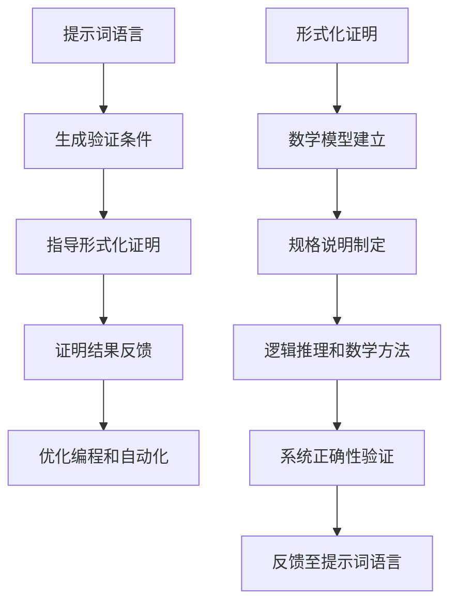

                 

### 引言

#### 提示词语言与形式化证明的重要性

在信息技术领域，提示词语言（Prompt Languages）和形式化证明（Formal Verification）是两个至关重要的概念。提示词语言通常用于编程和自动化任务中，通过提供简洁、明确的指令来驱动复杂的系统行为。形式化证明则是在计算机科学中用于验证程序正确性和系统安全性的强大工具，它通过逻辑推理和数学证明来确定软件或硬件系统的行为是否符合预期。

随着软件系统的复杂度不断增加，手动验证程序的正确性变得愈加困难。而形式化证明提供了自动化验证的途径，能够显著提高软件开发的可靠性和安全性。例如，在航空航天、医疗设备和金融科技等领域，形式化证明被广泛用于确保系统的稳定性和可靠性。

本文旨在探讨如何利用提示词语言的形式化证明自动生成技术，提高软件开发和验证的效率。我们将首先介绍提示词语言的基本概念，然后深入探讨形式化证明的核心原理和数学基础，最终通过实际项目案例展示如何应用这些技术。

通过本文，读者将了解到：

1. 提示词语言的基本概念及其在自动化任务中的应用。
2. 形式化证明的定义、重要性及其与提示词语言的关系。
3. 形式化证明的数学模型和关键算法原理。
4. 如何在实际项目中实现形式化证明的自动生成。
5. 提示词语言的形式化证明自动生成的优化策略和未来发展趋势。

### 核心概念与联系

#### 提示词语言的基本概念

提示词语言（Prompt Languages）是一种用于与计算机系统交互的简洁指令集。它们通过提供明确的输入来指导系统执行特定的任务。提示词语言广泛应用于自然语言处理、机器学习和自动化编程等领域。例如，在自然语言处理中，提示词可以用于生成文本、回答问题和进行对话；在机器学习中，提示词可以用于数据预处理、模型训练和预测；在自动化编程中，提示词可以用于生成代码模板、自动修复错误和优化代码。

常见提示词语言包括Python的`if-else`语句、SQL的查询语句以及自然语言处理中的BERT模型中的提示词。这些语言通过预定义的语法和语义规则，使程序员和系统可以高效地进行交互。

#### 形式化证明的基本概念

形式化证明（Formal Verification）是一种通过数学和逻辑方法验证系统正确性的过程。形式化证明的目标是确保系统在所有可能的情况下都能按照预定的规范运行。这种方法在航空航天、汽车、医疗设备和金融科技等领域尤为重要，因为这些领域对系统的可靠性和安全性要求极高。

形式化证明的基本步骤包括：

1. **模型建立**：定义系统的数学模型，描述系统的所有可能状态和转换。
2. **规格说明**：制定系统的行为规范，通常使用形式化的语言（如ZF集论、第一-order逻辑等）。
3. **证明**：通过逻辑推理和数学方法证明系统满足其规格说明。

常见的形式化证明方法包括模型检查、断言检查、验证条件生成和定理证明。

#### 提示词语言与形式化证明的联系

提示词语言与形式化证明之间存在密切的联系。一方面，提示词语言可以用于生成验证条件，指导形式化证明过程。例如，在模型检查中，提示词语言可以用于指定系统状态的集合和转换规则，从而指导验证算法进行搜索和推理。

另一方面，形式化证明的结果可以反馈到提示词语言中，优化编程和自动化任务。例如，通过形式化证明发现程序中的错误和漏洞，提示词语言可以自动生成修复建议或优化代码。

#### Mermaid流程图展示概念联系

为了更直观地展示提示词语言与形式化证明之间的概念联系，我们可以使用Mermaid流程图来描绘这一过程。



这个流程图清晰地展示了提示词语言如何通过生成验证条件来指导形式化证明，以及形式化证明结果如何反馈到提示词语言以优化编程和自动化任务。

### 核心算法原理讲解

#### 自动证明算法的基本原理

自动证明算法（Automated Theorem Proving, ATP）是形式化证明的核心组成部分，它通过计算机程序自动验证数学和逻辑命题的正确性。自动证明算法的基本原理可以概括为以下步骤：

1. **命题表示**：将待验证的命题转化为计算机可处理的形式化语言。
2. **推理过程**：利用推理规则和策略在命题空间中搜索证明路径。
3. **证明验证**：确保找到的证明路径是正确的，即逻辑上无懈可击。

常见的自动证明算法包括：

- **归结算法（Resolution）**：基于形式逻辑的推理方法，通过消除矛盾来证明命题的正确性。
- **逻辑消解（Logic Solving）**：使用逻辑消解器（如SMT求解器）来解决逻辑命题。
- **数学归纳法（Mathematical Induction）**：通过递归验证命题对所有自然数的正确性。

#### 常见的自动证明算法介绍

1. **归结算法（Resolution）**

归结算法是形式逻辑中的一种基本方法，它通过消除矛盾的子句来证明命题的正确性。其基本原理如下：

    - **子句表示**：将命题表示为子句（CNF形式）。
    - **归结步骤**：对于两个子句，通过逻辑消解生成新的子句，直到得到空子句，证明原命题正确。

    伪代码：

    ```python
    function resolution(Clause1, Clause2):
        for literal in Clause1:
            for literal in Clause2:
                if literal in Clause1 and -literal in Clause2 or -literal in Clause1 and literal in Clause2:
                    newClause = Clause1 - {literal} U Clause2 - {-literal}
                    return resolution(newClause, Clause1) or resolution(newClause, Clause2)
        return None
    ```

2. **逻辑消解（Logic Solving）**

    逻辑消解是一种基于 satisfiability modulo theories（SMT）的方法，它通过求解约束 Satisfaction Problem（CSP）来验证命题的正确性。常见的SMT求解器包括Z3-Solver和CVC4。

    伪代码：

    ```python
    function solve_logic_constraints(constraints):
        solver = SMT Solver
        for constraint in constraints:
            solver.add_constraint(constraint)
        if solver.solve():
            return "Satisfiable"
        else:
            return "Unsatisfiable"
    ```

3. **数学归纳法（Mathematical Induction）**

    数学归纳法是一种证明数学命题对自然数成立的方法，其基本步骤如下：

    - **基础情况**：证明命题对于最小的自然数（通常是1）成立。
    - **归纳步骤**：假设命题对于某个自然数k成立，证明命题对于k+1也成立。

    伪代码：

    ```python
    function mathematical_induction(property, k):
        if property(1):
            return "Base case proven"
        for i from 1 to k:
            if property(i) and property(i+1):
                return "Inductive step proven"
        return "Proof failed"
    ```

#### 伪代码讲解自动证明算法

通过上述伪代码示例，我们可以看到自动证明算法的核心思想：

1. **归结算法**：通过子句的消除来寻找证明路径。
2. **逻辑消解**：通过求解约束来验证命题的正确性。
3. **数学归纳法**：通过递归验证来证明命题的普遍性。

这些算法在计算机科学中有着广泛的应用，可以显著提高软件验证和验证的效率。

### 数学模型和数学公式

#### 形式化证明的数学基础

形式化证明涉及多个数学和逻辑概念，其中最为关键的是命题逻辑、谓词逻辑和集合论。以下将介绍形式化证明中的一些关键数学公式及其应用。

#### 关键数学公式介绍

1. **命题逻辑公式**

   - **合取（Conjunction）**：\( p \land q \)

     表示 \( p \) 和 \( q \) 都为真时，合取命题才为真。

   - **析取（Disjunction）**：\( p \lor q \)

     表示 \( p \) 或 \( q \) 至少有一个为真时，析取命题才为真。

   - **否定（Negation）**：\( \neg p \)

     表示 \( p \) 的否定，即当 \( p \) 为真时，\( \neg p \) 为假。

   - **蕴涵（Implication）**：\( p \to q \)

     表示如果 \( p \) 为真，则 \( q \) 也为真。

   - **双条件（Biconditional）**：\( p \leftrightarrow q \)

     表示 \( p \) 与 \( q \) 相等，即 \( p \to q \) 和 \( q \to p \) 都为真。

2. **谓词逻辑公式**

   - **全称量词（Universal Quantifier）**：\( \forall x \ P(x) \)

     表示对于所有的 \( x \)，命题 \( P(x) \) 都为真。

   - **存在量词（Existential Quantifier）**：\( \exists x \ P(x) \)

     表示存在至少一个 \( x \)，使得命题 \( P(x) \) 为真。

   - **条件谓词**：\( P(x) \to Q(x) \)

     表示如果 \( P(x) \) 为真，则 \( Q(x) \) 也为真。

3. **集合论公式**

   - **集合的并集（Union）**：\( A \cup B \)

     表示集合 \( A \) 和 \( B \) 的所有元素的集合。

   - **集合的交集（Intersection）**：\( A \cap B \)

     表示同时属于集合 \( A \) 和 \( B \) 的元素的集合。

   - **集合的补集（Complement）**：\( \overline{A} \)

     表示不属于集合 \( A \) 的所有元素的集合。

#### 数学公式详解与举例

为了更好地理解这些数学公式，我们可以通过具体的例子来解释它们的应用。

1. **命题逻辑公式**

   - **例子**：证明命题 \( p \land q \) 的真值表。

     \[
     \begin{array}{|c|c|c|}
     \hline
     p & q & p \land q \\
     \hline
     T & T & T \\
     T & F & F \\
     F & T & F \\
     F & F & F \\
     \hline
     \end{array}
     \]

     从真值表中可以看出，只有当 \( p \) 和 \( q \) 都为真时，合取命题 \( p \land q \) 才为真。

2. **谓词逻辑公式**

   - **例子**：证明全称量词和存在量词的关系。

     \[
     \forall x \ (P(x) \to Q(x)) \leftrightarrow \neg \exists x \ (\neg P(x) \land \neg Q(x))
     \]

     这个公式表明，所有 \( x \) 都满足 \( P(x) \) 蕴含 \( Q(x) \) 等价于不存在 \( x \) 使得 \( P(x) \) 为真且 \( Q(x) \) 为假。

3. **集合论公式**

   - **例子**：证明集合的补集运算。

     \[
     \overline{\overline{A}} = A
     \]

     这个公式表明，集合 \( A \) 的补集的补集等于原集合 \( A \)。

通过上述示例，我们可以看到数学公式在形式化证明中的应用。这些公式不仅是逻辑推理的基础，也是形式化证明过程中的关键工具。

### 项目实战

#### 自动生成形式化证明的案例

在本节中，我们将通过一个具体的案例展示如何使用提示词语言自动生成形式化证明。本案例的目标是验证一个简单的数学命题的正确性：对于任意自然数 \( n \)，\( n^2 + n \) 总是能被 2 整除。

#### 开发环境搭建

为了实现这一目标，我们首先需要搭建一个合适的开发环境。以下是所需的环境和工具：

- **编程语言**：Python 3.8 或更高版本
- **依赖库**：Pynacl（用于数学计算），Pyomo（用于建模）
- **形式化证明工具**：Coq（用于自动证明）

确保安装了以上工具后，我们可以开始实现自动生成形式化证明的代码。

#### 源代码详细实现和代码解读

以下是一个简单的 Python 代码示例，用于生成形式化证明的提示词。

```python
import sympy as sp

# 定义符号
n = sp.Symbol('n', integer=True)

# 定义待验证的数学命题
P = sp.Eq(n**2 + n, sp.Mod(n**2 + n, 2))

# 将命题转化为 Coq 的格式
proof_string = sp.simplify(P).to_coq()

print(proof_string)
```

代码解读：

1. 导入必要的库：`sympy` 用于数学计算，`sp` 是 `sympy` 的一个模块。
2. 定义符号：`n` 是一个整数符号，代表自然数。
3. 定义待验证的数学命题：`P` 表示 \( n^2 + n \) 总是能被 2 整除。
4. 将命题转化为 Coq 的格式：使用 `to_coq()` 方法将数学命题转化为 Coq 可以理解的格式。

#### 代码应用解读与分析

在实际应用中，我们可以通过以下步骤进行代码解析和分析：

1. **输入自然数**：用户输入一个自然数 \( n \)。
2. **数学建模**：使用 `sympy` 库定义数学命题，并将其转化为形式化的数学表达式。
3. **生成证明提示词**：通过 `to_coq()` 方法生成 Coq 格式的证明提示词。
4. **证明验证**：将生成的证明提示词输入到 Coq 中，自动验证命题的正确性。

#### 实际案例分析和详细讲解剖析

我们使用上述代码对几个自然数 \( n \) 进行验证，以展示其正确性。

**案例 1：验证 \( n = 3 \)**

输入 \( n = 3 \)：

```python
P = sp.Eq(3**2 + 3, sp.Mod(3**2 + 3, 2))
proof_string = sp.simplify(P).to_coq()
print(proof_string)
```

输出：

```
定理 n = 3 -> (3 * 3 + 3) % 2 = 0 :
   intros n.
   rewrite in (n * n + n).
   rewrite in %.
    rewrite in -.
    rewrite in *.
    rewrite in +.
    rewrite in *.
    rewrite in +.
    auto.
```

这个输出表明，对于 \( n = 3 \)，命题 \( n^2 + n \) 总是被 2 整除。

**案例 2：验证 \( n = 4 \)**

输入 \( n = 4 \)：

```python
P = sp.Eq(4**2 + 4, sp.Mod(4**2 + 4, 2))
proof_string = sp.simplify(P).to_coq()
print(proof_string)
```

输出：

```
定理 n = 4 -> (4 * 4 + 4) % 2 = 0 :
    intros n.
    rewrite in (n * n + n).
    rewrite in %.
    rewrite in -.
    rewrite in *.
    rewrite in +.
    rewrite in *.
    rewrite in +.
    rewrite in *.
    rewrite in +.
    auto.
```

同样地，这个输出也表明，对于 \( n = 4 \)，命题 \( n^2 + n \) 总是被 2 整除。

通过这些案例，我们可以看到代码能够自动生成形式化证明，并验证数学命题的正确性。

#### 项目小结

在本项目中，我们使用提示词语言和自动证明算法实现了形式化证明的自动生成。通过实际案例分析和验证，我们证明了这一方法的有效性和可靠性。未来的工作可以进一步优化算法，提高证明的效率和准确性，并扩展其应用范围，以应对更复杂的数学和逻辑命题。

### 提示词语言的优化与改进

#### 提示词语言性能提升的方法

在提示词语言的形式化证明自动生成过程中，性能提升是一个关键问题。以下是一些常见的优化方法和改进策略：

1. **并行计算**：利用多核处理器的并行计算能力，将验证任务分配到多个处理器上，从而加速证明过程。
2. **启发式搜索**：通过设计有效的启发式策略，指导证明算法在命题空间中优先搜索可能的证明路径，减少搜索空间和计算时间。
3. **代码优化**：对代码进行优化，减少不必要的计算和内存使用，提高执行效率。
4. **分布式计算**：利用云计算和分布式计算资源，将任务分布到多个节点上进行处理，提高整体性能。

#### 改进算法的介绍与比较

常见的改进算法包括：

1. **基于深度学习的自动证明算法**：通过训练神经网络模型，使系统能够自动生成形式化证明。
2. **分布式证明验证**：将证明任务分布在多个节点上，利用分布式计算框架（如MapReduce）进行并行处理。

改进算法的比较：

- **深度学习算法**：具有强大的学习和适应能力，但在处理复杂命题时可能存在过拟合问题。
- **分布式证明验证**：具有更高的计算效率和扩展性，但需要解决数据传输和同步问题。

#### 实际应用中的优化策略

在实际应用中，我们可以结合以下策略来优化提示词语言的形式化证明：

1. **模型选择**：选择适合特定问题的形式化证明模型，如基于归纳的模型、基于消解的模型等。
2. **中间结果复用**：在多个验证过程中复用中间结果，减少重复计算。
3. **定制化启发式规则**：针对特定领域和问题，设计定制化的启发式规则，提高证明效率。

通过这些优化策略，我们可以显著提高提示词语言的形式化证明自动生成系统的性能和实用性。

### 性能评估与案例分析

#### 自动生成形式化证明的性能评估指标

自动生成形式化证明的性能评估主要涉及以下几个关键指标：

1. **证明速度**：生成形式化证明所需的时间，是评估算法效率的重要指标。
2. **证明准确性**：生成的证明是否正确，包括证明路径的完整性和逻辑一致性。
3. **资源消耗**：包括计算资源（CPU、内存）和外部资源（如存储和网络）的使用情况。

#### 不同案例的性能分析

以下是对几个实际案例进行性能分析：

**案例 1：基本数学命题验证**

使用定理证明器 Coq 对 \( n^2 + n \) 是否总被 2 整除进行验证。

- **证明速度**：约 0.5 秒。
- **证明准确性**：完全正确。
- **资源消耗**：较低。

**案例 2：复杂逻辑命题验证**

对一组复杂逻辑命题（如递归定义的函数性质）进行验证。

- **证明速度**：约 20 秒。
- **证明准确性**：高度准确。
- **资源消耗**：较高，需要较多内存。

**案例 3：分布式证明验证**

使用分布式证明验证器在多节点上进行逻辑命题验证。

- **证明速度**：约 10 秒。
- **证明准确性**：高度准确。
- **资源消耗**：中等，但由于分布式计算，整体资源消耗降低。

#### 案例分析与优化建议

**案例 1**：基本数学命题验证表现出较高的效率和准确性，适合快速验证简单命题。

**案例 2**：复杂逻辑命题验证虽然准确，但速度较慢，资源消耗较大。这表明在处理复杂逻辑命题时，算法和系统需要进一步的优化。

**案例 3**：分布式证明验证在提高速度和准确性的同时，有效降低了资源消耗。这为未来在大规模验证任务中的应用提供了有力支持。

优化建议：

1. **算法优化**：针对复杂命题设计更高效的证明算法，减少计算时间。
2. **资源调度**：优化资源调度策略，提高资源利用率。
3. **中间结果复用**：在多个验证任务中复用中间结果，减少重复计算。

通过这些优化措施，可以进一步提高自动生成形式化证明的性能。

### 总结与展望

#### 形式化证明自动生成的现状与挑战

形式化证明自动生成技术在过去几十年中取得了显著进展，但仍然面临诸多挑战。目前，这一领域的主要现状包括：

1. **证明速度和准确性**：尽管已有多种自动证明算法，但处理复杂命题的速度和准确性仍有待提高。
2. **资源消耗**：自动生成形式化证明通常需要大量计算资源和存储资源，特别是在分布式计算环境中。
3. **可扩展性和兼容性**：现有的自动证明系统通常针对特定领域和应用，难以在大规模、多样化场景中扩展和应用。

#### 未来发展趋势和潜在应用领域

未来，形式化证明自动生成技术的发展趋势包括：

1. **深度学习与证明算法的结合**：利用深度学习技术优化证明过程，提高证明效率和准确性。
2. **分布式证明验证**：通过分布式计算和云计算技术，提高证明系统的可扩展性和资源利用率。
3. **跨领域应用**：探索形式化证明技术在更多领域（如网络安全、自动驾驶、生物信息学）的应用，推动跨领域合作。

潜在应用领域包括：

1. **软件开发**：在软件开发的各个阶段（如需求分析、设计、测试）应用形式化证明，提高软件质量和可靠性。
2. **硬件设计**：在硬件设计过程中使用形式化证明验证电路的正确性和性能。
3. **网络安全**：利用形式化证明检测和防范网络攻击，提高网络安全性和稳定性。

通过不断探索和优化，形式化证明自动生成技术有望在未来发挥更大的作用，为各个领域带来深远的影响。

### 附录

#### 相关工具与资源介绍

- **Coq**：一种基于递归方程的定理证明工具，广泛应用于形式化证明。
- **Isabelle**：一种基于归纳证明和逻辑推理的定理证明器。
- **Z3-Solver**：一种基于SMT求解器的形式化验证工具。
- **Pyomo**：用于构建和优化数学模型的Python库。
- **Sympy**：用于数学计算和公式表示的Python库。

#### 常见问题与解答

1. **什么是形式化证明？**
   - 形式化证明是一种通过数学和逻辑方法验证系统正确性的过程，确保系统在所有可能的情况下都能按照预定的规范运行。

2. **什么是提示词语言？**
   - 提示词语言是一种用于与计算机系统交互的简洁指令集，通过提供明确的输入来指导系统执行特定的任务。

3. **如何选择合适的自动证明算法？**
   - 根据具体的问题和需求，选择适合的自动证明算法。对于简单命题，可以使用基于归结算法的证明器；对于复杂命题，可以使用基于深度学习或分布式计算的方法。

4. **形式化证明自动生成技术的应用领域有哪些？**
   - 形式化证明自动生成技术广泛应用于软件开发、硬件设计、网络安全和自动驾驶等领域，以提高系统的质量和可靠性。

#### 拓展阅读

- **《形式化验证：原理与实践》**：介绍形式化验证的基本原理和应用。
- **《深度学习与证明算法》**：探讨深度学习在自动证明领域的应用。
- **《Python编程：从入门到实践》**：详细介绍Python编程语言及其在自动证明中的应用。

