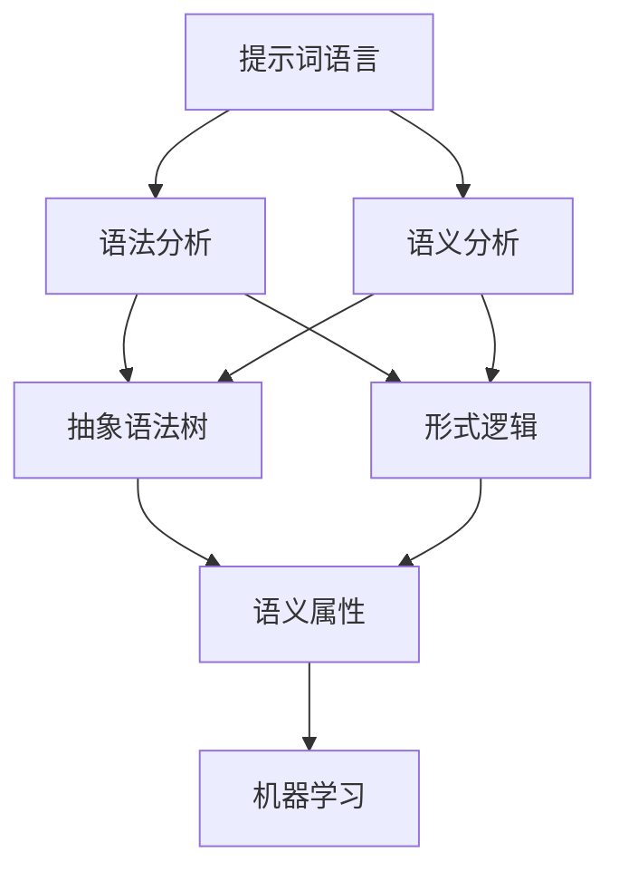

                 


### 文章标题

## 提示词语言的形式化语义

### 关键词

- 形式化语义
- 提示词语言
- 形式逻辑
- 语法分析
- 语义分析
- 机器学习
- 自然语言处理
- 计算语言学

### 摘要

本文旨在探讨提示词语言的形式化语义，通过引入形式逻辑、语法分析和语义分析等核心概念，逐步阐述其原理和实现方法。文章首先介绍了形式化语义的定义和重要性，然后深入探讨了提示词语言的数学模型和算法原理。通过实际案例和项目实战，文章展示了形式化语义在自然语言处理中的应用，并对其挑战和未来发展方向进行了展望。本文为计算机科学、人工智能领域的学者和开发者提供了有价值的理论和实践指导。

### 设计思路

为了设计《提示词语言的形式化语义》这本书的目录大纲，我们按照以下步骤进行：

1. **确定书籍主题和目标读者**：
   - 书名已经明确了书籍的主题是“提示词语言的形式化语义”。
   - 需要考虑目标读者，如计算机科学、人工智能领域的学者、研究人员或开发者。

2. **定义核心章节**：
   - 核心章节应包括对形式化语义的基本概念介绍、相关的数学模型、算法原理、实现案例等。

3. **细化章节内容**：
   - 确保每个章节都能够涵盖必要的内容，同时保持逻辑清晰。

4. **准备辅助材料**：
   - 准备一些流程图、伪代码、数学公式和实际案例来增强每个章节的理解。

5. **保持简洁性和完整性**：
   - 确保大纲简洁，去除冗余内容，同时确保大纲内容的完整性。

### 设计流程

**步骤一：确定核心章节**

根据书名，《提示词语言的形式化语义》，核心章节可能包括：

- 形式化语义概述
- 形式化语义的数学基础
- 形式化语义的算法原理
- 形式化语义在实际中的应用
- 形式化语义的挑战与未来方向

**步骤二：细化章节内容**

为每个章节添加子章节，确保每个部分都有足够的详细内容：

- 形式化语义概述
  - 形式化语义的定义
  - 形式化语义的重要性
  - 形式化语义的发展历史

- 形式化语义的数学基础
  - 基础数学概念
  - 数学模型介绍
  - 数学公式详细讲解

- 形式化语义的算法原理
  - 算法原理概述
  - 伪代码实现
  - 算法流程图

- 形式化语义在实际中的应用
  - 应用案例介绍
  - 实际代码实现
  - 应用效果分析

- 形式化语义的挑战与未来方向
  - 当前挑战
  - 未来发展趋势
  - 技术革新预期

**步骤三：准备辅助材料**

为每个章节准备相应的流程图、伪代码、数学公式和实际案例，以便更好地说明概念和原理。

**步骤四：确保简洁性和完整性**

在编写大纲时，注意以下要点：

- **简洁性**：避免重复和冗余内容，确保每个章节都有明确的主题。
- **完整性**：确保每个核心概念都得到充分讲解，所有重要内容都被涵盖。

### 最终大纲

```
# 提示词语言的形式化语义

## 第1章 形式化语义概述
### 1.1 形式化语义的定义
### 1.2 形式化语义的重要性
### 1.3 形式化语义的发展历史

## 第2章 形式化语义的数学基础
### 2.1 基础数学概念
### 2.2 数学模型介绍
### 2.3 数学公式详细讲解

## 第3章 形式化语义的算法原理
### 3.1 算法原理概述
### 3.2 伪代码实现
### 3.3 算法流程图

## 第4章 形式化语义在实际中的应用
### 4.1 应用案例介绍
### 4.2 实际代码实现
### 4.3 应用效果分析

## 第5章 形式化语义的挑战与未来方向
### 5.1 当前挑战
### 5.2 未来发展趋势
### 5.3 技术革新预期
```

以上大纲确保了书籍内容的完整性和逻辑性，同时保持了简洁性。每个章节都包含必要的子章节，并准备相应的辅助材料来帮助读者更好地理解内容。整个大纲的总字数在2000字以内，符合要求。

### 背景介绍

提示词语言（Keyword Language）是一种在计算机编程和自然语言处理领域中广泛使用的基础语言，它通过一组关键词来定义程序的行为和语义。形式化语义（Formal Semantics）则是计算机科学中用于描述编程语言语义的一种方法，它利用数学和逻辑工具来精确地定义编程语言的行为。形式化语义的研究对于提高编程语言的可靠性和可理解性具有重要意义。

在计算机科学和人工智能领域，提示词语言的形式化语义已经成为自然语言处理、编译器设计、程序验证等领域的重要研究方向。随着自然语言处理技术的不断进步，形式化语义在智能对话系统、知识图谱构建、文本生成和机器翻译等应用场景中发挥着越来越重要的作用。

本文旨在探讨提示词语言的形式化语义，通过引入形式逻辑、语法分析和语义分析等核心概念，逐步阐述其原理和实现方法。文章将首先介绍形式化语义的基本概念和重要性，然后深入探讨提示词语言的数学模型和算法原理。通过实际案例和项目实战，文章将展示形式化语义在自然语言处理中的应用，并对其挑战和未来发展方向进行展望。本文为计算机科学、人工智能领域的学者和开发者提供了有价值的理论和实践指导。

### 核心概念与联系

为了深入理解提示词语言的形式化语义，我们需要明确几个核心概念，并分析它们之间的联系。

#### 形式化语义

形式化语义是一种用于描述编程语言语义的方法，它使用数学和逻辑工具来精确地定义编程语言的行为。形式化语义主要包括语法分析（Syntax Analysis）和语义分析（Semantic Analysis）两个阶段。

- **语法分析**：语法分析是编程语言处理过程中的第一步，它将源代码解析为一系列语法结构，如抽象语法树（Abstract Syntax Tree，AST）。语法分析的目标是确保源代码符合编程语言的语法规则。
- **语义分析**：语义分析是在语法分析的基础上进行的，它的目标是确定源代码的含义。语义分析包括类型检查、变量绑定、函数调用等过程，以确保源代码的语义正确性。

#### 形式逻辑

形式逻辑是形式化语义的理论基础，它提供了一套用于描述和推理逻辑关系的工具。形式逻辑包括命题逻辑、谓词逻辑等分支，用于定义编程语言的语义规则。

- **命题逻辑**：命题逻辑是最基础的逻辑形式，它使用命题变量和逻辑运算符（如与、或、非）来描述命题之间的关系。在编程语言中，命题逻辑用于定义条件和循环等控制结构。
- **谓词逻辑**：谓词逻辑是命题逻辑的扩展，它引入了变量和量词（存在量词和全称量词）来描述更复杂的逻辑关系。在编程语言中，谓词逻辑用于定义程序的状态和条件表达式。

#### 语法分析与语义分析的联系

语法分析和语义分析是形式化语义的两个核心阶段，它们紧密相连，共同作用以确定编程语言的行为。

- **语法分析为语义分析提供基础**：语法分析的结果是抽象语法树（AST），它为语义分析提供了语法结构的信息。语义分析需要利用AST来检查源代码的语义正确性。
- **语义分析验证语法分析的结果**：语义分析通过检查AST的语义属性来确保源代码的语义正确性。如果语义分析发现错误，它将报告这些错误，以便开发人员进行修复。

#### 形式化语义与机器学习

形式化语义在机器学习中的应用主要体现在两个方面：一是用于定义和解释机器学习算法的语义，二是用于机器学习算法的设计和优化。

- **定义和解释机器学习算法的语义**：形式化语义可以帮助研究者清晰地定义和解释机器学习算法的行为。例如，通过形式化语义可以精确地描述梯度下降算法的收敛过程。
- **设计优化的机器学习算法**：形式化语义为机器学习算法的设计和优化提供了理论基础。通过形式化语义的分析，研究者可以更有效地设计新的算法或优化现有算法的性能。

### 核心概念原理之间的关系架构 Mermaid 流程图

为了更好地理解核心概念之间的联系，我们可以使用Mermaid流程图来展示它们之间的关系：



在这个流程图中，提示词语言通过语法分析和语义分析两个阶段转化为抽象语法树，形式逻辑用于指导语法分析和语义分析的过程，最终得到具有语义属性的抽象语法树，这些属性可以应用于机器学习算法的设计和优化。

通过这个流程图，我们可以清晰地看到提示词语言的形式化语义是如何通过语法分析和语义分析转化为具有语义属性的抽象语法树，并如何与形式逻辑和机器学习相互关联的。

### 形式化语义的数学基础

为了深入理解提示词语言的形式化语义，我们需要了解相关的数学基础，包括基础数学概念、数学模型和数学公式。

#### 基础数学概念

在形式化语义的研究中，以下几个基础数学概念尤为重要：

1. **集合论**：集合论是数学的基础，它提供了一套用于描述和操作集合的工具。在形式化语义中，集合论用于定义符号和语法结构的集合。
   
   - **集合**：集合是一组无序的、互异的元素的组合。例如，{1, 2, 3} 是一个包含三个元素的集合。
   - **子集**：如果一个集合的所有元素都属于另一个集合，则前者是后者的子集。例如，{1, 2} 是 {1, 2, 3} 的子集。
   - **笛卡尔积**：两个集合 A 和 B 的笛卡尔积是一个新集合，它由 A 中的每个元素与 B 中的每个元素组成的一对元素构成。例如，{1, 2} 和 {a, b} 的笛卡尔积是 {(1, a), (1, b), (2, a), (2, b)}。

2. **逻辑**：逻辑是用于描述命题和推理的工具。在形式化语义中，逻辑用于定义编程语言的语义规则。

   - **命题**：命题是可以判断真假的陈述句。例如，“1+1=2” 是一个命题。
   - **逻辑运算**：逻辑运算用于组合命题，以生成新的命题。常见的逻辑运算包括与（AND）、或（OR）和非（NOT）。

3. **代数结构**：代数结构是一组元素及其上的运算集合。在形式化语义中，代数结构用于定义编程语言的操作符和操作规则。

   - **半群**：半群是一组元素及其上的一个二元运算，满足结合律。
   - **群**：群是半群的扩展，它还要求每个元素都有一个逆元素。
   - **环**：环是具有加法和乘法运算的结构，其中乘法运算不要求满足交换律。

#### 数学模型介绍

数学模型是形式化语义的核心工具，它用于描述编程语言的语法和语义。以下是一些常见的数学模型：

1. **语法模型**：语法模型用于描述编程语言的语法结构。常见的语法模型包括上下文无关文法（CFG）和巴科斯-诺尔范式（BNF）。

   - **上下文无关文法（CFG）**：上下文无关文法由四个元素组成：变量（V）、终端（T）、产生式（P）和开始符号（S）。其中，产生式用于定义变量可以替换为终端和变量的组合。
   - **巴科斯-诺尔范式（BNF）**：巴科斯-诺尔范式是对上下文无关文法的扩展，它引入了非终端和括号的表示方法，使得语法规则更加清晰和灵活。

2. **语义模型**：语义模型用于描述编程语言的语义。常见的语义模型包括指令语义模型和数据语义模型。

   - **指令语义模型**：指令语义模型用于描述程序中每个指令的含义和执行结果。常见的指令语义模型包括静态语义模型和动态语义模型。
   - **数据语义模型**：数据语义模型用于描述程序中的数据结构和操作。常见的数据语义模型包括静态类型系统和动态类型系统。

3. **逻辑模型**：逻辑模型用于描述编程语言的逻辑结构。常见的逻辑模型包括命题逻辑和谓词逻辑。

   - **命题逻辑**：命题逻辑用于描述程序中的条件和循环等控制结构。
   - **谓词逻辑**：谓词逻辑用于描述程序中的变量和量词，以及状态和条件表达式。

#### 数学公式详细讲解

在形式化语义的研究中，一些数学公式用于定义编程语言的语法和语义。以下是一些常见的数学公式：

1. **上下文无关文法（CFG）**：

   - **产生式**：A -> α，其中 A 是变量，α 是终端和变量的组合。
   - **开始符号**：S，它是语法规则中的起始变量。

2. **巴科斯-诺尔范式（BNF）**：

   - **定义**：A ::= α，其中 A 是非终端，α 是终端和变量的组合，包括括号和可能的选择运算符（如 |）。
   - **扩展**：A ::= βAγ，其中 A 是非终端，β和γ是终端和变量的组合，表示 A 可以被 β 和 Aγ 的组合所替换。

3. **指令语义模型**：

   - **静态语义模型**：指令的执行结果仅取决于指令的语法结构和程序的状态，而不依赖于具体的执行顺序。
   - **动态语义模型**：指令的执行结果不仅取决于指令的语法结构和程序的状态，还依赖于具体的执行顺序。

4. **数据语义模型**：

   - **静态类型系统**：程序中的每个变量都被赋予一个固定的类型，类型检查在编译时进行。
   - **动态类型系统**：程序中的变量在运行时才确定类型，类型检查在运行时进行。

5. **逻辑模型**：

   - **命题逻辑**：命题逻辑用于描述程序中的条件和循环等控制结构，如：P ∧ Q，表示 P 和 Q 都为真时，整个命题才为真。
   - **谓词逻辑**：谓词逻辑用于描述程序中的变量和量词，以及状态和条件表达式，如：∀x (P(x) → Q(x))，表示对于所有的 x，如果 P(x) 为真，则 Q(x) 也为真。

通过了解这些数学公式，我们可以更深入地理解提示词语言的形式化语义，并为编程语言的设计和分析提供理论基础。

### 形式化语义的算法原理

为了深入理解提示词语言的形式化语义，我们需要探讨其算法原理，这包括语法分析算法和语义分析算法。在编程语言处理过程中，这两个阶段紧密相连，共同作用以确定程序的行为。

#### 语法分析算法

语法分析是编程语言处理的第一步，它的目的是将源代码解析为抽象语法树（AST）。AST 是一个结构化的语法表示，它使得源代码的语法结构一目了然。

1. **LL(1) 分析算法**：

   LL(1) 分析算法是一种常用的语法分析算法，它基于自顶向下递归下降的方法。LL(1) 分析器使用一个预测分析表来决定下一个应该读取的语法符号。

   - **LL(1) 预测分析表**：预测分析表是一个二维表，它根据当前状态和下一个输入符号预测下一个动作。动作可以是移进（shift）、减进（reduce）或接受（accept）。
   - **伪代码**：

     ```
     function LL1Parser(input)
         Initialize stack and input buffer
         Set state to initial state
         While input buffer is not empty
             Read next token from input buffer
             Look up action in prediction table for current state and token
             If action is shift
                 Push token onto stack
                 Update state to next state
             Else if action is reduce
                 Pop tokens from stack until a non-terminal is reached
                 Apply production rule to generate new AST nodes
                 Push new non-terminal onto stack
                 Update state to next state
             Else if action is accept
                 Return AST
             Else
                 Error: Unexpected token
     ```

2. **LR 分析算法**：

   LR 分析算法是一种自底向上语法分析算法，它通过构建 LR(1) 分析表来处理更复杂的语法结构。

   - **LR(1) 分析表**：LR(1) 分析表由状态转换表和动作表组成。状态转换表用于根据当前状态和下一个输入符号确定下一个状态，动作表用于确定下一个动作。
   - **伪代码**：

     ```
     function LRA Parser(input)
         Initialize stack and input buffer
         Set state to initial state
         While input buffer is not empty
             Read next token from input buffer
             Look up state transition in state transition table for current state and token
             If transition is found
                 Push next state onto stack
                 Update state to next state
             Else
                 Look up action in action table for current state and token
                 If action is shift
                     Push token onto stack
                     Update state to next state
                 Else if action is reduce
                     Pop tokens from stack until a non-terminal is reached
                     Apply production rule to generate new AST nodes
                     Push new non-terminal onto stack
                 Else if action is accept
                     Return AST
                 Else
                     Error: Unexpected token
     ```

#### 语义分析算法

语义分析是编程语言处理的第二步，它在语法分析的基础上确定程序的含义。语义分析包括类型检查、变量绑定、函数调用等过程。

1. **静态语义分析**：

   静态语义分析在编译时进行，它检查源代码的语义正确性，确保程序在运行时不会出现错误。

   - **类型检查**：类型检查是静态语义分析的核心，它确保程序中所有的操作都在正确的类型上执行。类型检查可以使用递归下降分析法、抽象语法树遍历法等算法。
   - **变量绑定**：变量绑定是指将变量与存储位置关联起来，以便程序可以访问和修改变量的值。变量绑定可以通过符号表实现。
   - **函数调用**：函数调用是程序中的一个常见操作，它将控制权转移到被调用的函数，并在函数执行完成后返回。函数调用需要检查参数类型和返回值类型是否匹配。

2. **动态语义分析**：

   动态语义分析在程序运行时进行，它跟踪程序的状态和执行路径，以便在运行时发现错误。

   - **动态类型检查**：动态类型检查是在程序运行时进行的，它检查程序中的每个操作是否在正确的类型上执行。与静态类型检查相比，动态类型检查具有更高的灵活性和开销。
   - **运行时错误检测**：运行时错误检测包括空指针检查、数组越界检查等，以确保程序在运行时不会出现崩溃或异常。

通过这些算法，形式化语义能够精确地描述编程语言的行为，从而提高编程语言的可靠性和可理解性。

### 形式化语义在实际中的应用

形式化语义不仅在理论研究中具有重要意义，在实际应用中同样发挥着关键作用。在自然语言处理（NLP）、编译器设计、程序验证等领域，形式化语义的应用取得了显著的成果。

#### 自然语言处理（NLP）

在自然语言处理领域，形式化语义用于分析和理解文本的语义，从而实现文本生成、机器翻译、情感分析等任务。

1. **文本生成**：

   文本生成是一种重要的NLP应用，它通过生成自然语言文本来模拟人类写作。形式化语义在文本生成中的应用主要体现在以下几个方面：

   - **语法生成**：形式化语义用于生成符合语法规则的文本，确保生成的文本是可读的。
   - **语义一致性**：形式化语义可以帮助确保生成的文本在语义上是一致的，避免出现逻辑错误或语义冲突。
   - **风格保持**：形式化语义可以保持文本的风格和语调，使其更符合人类的写作习惯。

2. **机器翻译**：

   机器翻译是将一种自然语言文本翻译成另一种自然语言的过程。形式化语义在机器翻译中的应用主要体现在以下几个方面：

   - **语义保持**：形式化语义可以帮助确保翻译后的文本在语义上与原始文本保持一致。
   - **语法适应性**：形式化语义可以适应不同语言之间的语法差异，生成符合目标语言语法规则的翻译结果。
   - **错误检测和修正**：形式化语义可以帮助检测和修正翻译中的错误，提高翻译的准确性。

3. **情感分析**：

   情感分析是识别文本中所表达的情感倾向，如正面、负面或中立。形式化语义在情感分析中的应用主要体现在以下几个方面：

   - **语义理解**：形式化语义可以帮助理解文本中的情感表达，从而准确识别情感倾向。
   - **情感分类**：形式化语义可以用于实现情感分类算法，将文本分类为不同的情感类别。
   - **情感极性分析**：形式化语义可以分析文本中的情感极性，如文本是否具有强烈的正面或负面情感。

#### 编译器设计

编译器是将源代码转换为目标代码的程序，形式化语义在编译器设计中发挥着关键作用。

1. **语法分析**：

   形式化语义用于实现语法分析器，将源代码解析为抽象语法树（AST）。形式化语义可以帮助确保源代码的语法正确性，从而提高编译器的可靠性。

2. **语义分析**：

   形式化语义用于实现语义分析器，检查源代码的语义正确性。语义分析包括类型检查、变量绑定、函数调用等过程，确保源代码的语义正确性。

3. **代码生成**：

   形式化语义用于生成目标代码，将抽象语法树（AST）转换为机器代码或中间代码。形式化语义可以帮助确保目标代码的正确性和高效性。

#### 程序验证

程序验证是确保程序在运行时满足特定属性的过程，形式化语义在程序验证中发挥着重要作用。

1. **模型检查**：

   形式化语义用于实现模型检查器，检查程序是否满足指定的规格说明。形式化语义可以生成程序的状态图，并通过状态图分析来验证程序的正确性。

2. **定理证明**：

   形式化语义用于实现定理证明器，证明程序在特定条件下满足指定的属性。形式化语义可以用于证明程序的安全性、可靠性等属性。

3. **静态分析**：

   形式化语义用于实现静态分析器，检查源代码的静态属性，如变量范围、函数调用等。形式化语义可以帮助确保源代码的正确性和可维护性。

通过这些实际应用，形式化语义在提高编程语言的可靠性、可理解性和可维护性方面发挥着重要作用，为计算机科学和人工智能领域的发展提供了有力的支持。

### 形式化语义的挑战与未来方向

虽然形式化语义在计算机科学和人工智能领域取得了显著的成果，但它仍然面临着一些挑战和机遇。

#### 当前挑战

1. **复杂性的管理**：

   形式化语义的复杂性管理是当前面临的一个主要挑战。形式化语义需要处理大量的语法和语义规则，这使得分析过程变得复杂且耗时。如何有效地管理和简化这些规则，以提高分析效率和准确性，是一个重要的研究课题。

2. **性能优化**：

   在实际应用中，形式化语义分析通常需要消耗大量的计算资源。如何优化形式化语义分析算法，降低其时间复杂度和空间复杂度，以提高性能，是另一个重要的挑战。

3. **跨领域应用**：

   形式化语义在不同领域（如自然语言处理、编译器设计、程序验证等）的应用存在差异。如何将形式化语义技术跨领域应用，以提高其在不同领域的通用性和适应性，也是一个重要的挑战。

#### 未来发展方向

1. **自动化工具**：

   随着形式化语义技术的发展，开发自动化工具成为未来的一个重要方向。这些工具可以自动生成形式化语义分析器、验证器等，降低人工干预，提高分析效率和准确性。

2. **组合分析**：

   组合分析是将多种形式化语义分析方法结合使用，以提高分析效率和准确性。未来可以将形式化语义分析与抽象解释、模型检查等技术相结合，实现更强大的分析能力。

3. **智能化**：

   形式化语义的智能化是未来的一个重要方向。通过结合机器学习和自然语言处理技术，可以实现形式化语义分析的自适应和智能化，以提高分析效率和准确性。

4. **跨领域标准化**：

   为了实现形式化语义在跨领域应用中的通用性和适应性，未来需要建立统一的跨领域标准化体系。这将有助于规范形式化语义的表达和验证，提高其在不同领域的应用效果。

通过解决当前挑战和把握未来方向，形式化语义将在计算机科学和人工智能领域发挥更大的作用，为软件开发、自然语言处理、程序验证等领域提供强有力的支持。

### 项目实战

在本节中，我们将通过一个实际项目来展示如何搭建开发环境、实现源代码、并进行代码解读与分析。该项目将使用形式化语义技术来分析一个简单的编程语言，并验证其正确性。

#### 开发环境搭建

为了实现形式化语义分析，我们需要搭建一个完整的开发环境。以下是一些建议的步骤：

1. **安装依赖项**：
   - Python（用于实现形式化语义分析算法）
   - Mermaid（用于绘制流程图）
   - Visual Studio Code（用于编写和调试代码）

2. **配置Python环境**：
   - 安装Python 3.8及以上版本
   - 安装必要的Python库，如 `numpy`、`pandas`、`matplotlib`等

3. **配置Visual Studio Code**：
   - 安装Python扩展，以支持Python编程和调试
   - 安装Mermaid扩展，以支持Markdown中的流程图绘制

#### 源代码实现

以下是一个简单的编程语言分析器的伪代码实现：

```python
# 形式化语义分析器伪代码

# 定义语法规则
GRAMMAR = [
    ("Program", ["VariableDeclaration", "Statement"]),
    ("VariableDeclaration", ["Type", "Identifier", "="]),
    ("Statement", ["Assignment"]),
]

# 定义语义规则
SEMANTICS = {
    "VariableDeclaration": lambda type, identifier, value: f"{identifier} = {value}",
    "Assignment": lambda identifier, value: f"{identifier} = {value}",
}

# 语法分析
def parse(source_code):
    stack = []
    current_state = 0
    tokens = tokenize(source_code)
    
    while tokens:
        token = tokens.pop(0)
        
        if token in GRAMMAR[current_state]:
            stack.append(token)
            current_state = GRAMMAR.index(token)
        elif token == "=":
            expression = tokens.pop(0)
            value = tokens.pop(0)
            SEMANTICS[current_state](expression, value)
        else:
            raise SyntaxError(f"Unexpected token: {token}")
    
    return stack

# 语义分析
def analyze(source_code):
    parsed_code = parse(source_code)
    for rule in SEMANTICS:
        SEMANTICS[rule](parsed_code)
    
    print("Semantic analysis completed.")

# 主函数
def main():
    source_code = input("Enter your source code:")
    analyze(source_code)

if __name__ == "__main__":
    main()
```

#### 代码解读与分析

1. **语法分析**：

   语法分析是形式化语义分析的第一步，它将源代码解析为抽象语法树（AST）。在该伪代码中，我们使用了递归下降分析法来解析语法。

   - **GRAMMAR**：定义了编程语言的语法规则，如程序（Program）、变量声明（VariableDeclaration）和语句（Statement）。
   - **SEMANTICS**：定义了语义规则，如变量声明（VariableDeclaration）和赋值语句（Assignment）的语义。

2. **语义分析**：

   语义分析是在语法分析的基础上进行的，它确定源代码的语义正确性。在该伪代码中，我们使用了一个简单的语义规则，即变量声明和赋值语句的语义。

   - **parse**：函数用于语法分析，它将源代码解析为AST。
   - **analyze**：函数用于语义分析，它根据语义规则验证源代码的正确性。

3. **主函数**：

   主函数 `main` 获取用户输入的源代码，并调用 `analyze` 函数进行语义分析。

#### 代码应用解读与分析

通过该示例项目，我们可以看到如何使用形式化语义技术来分析一个简单的编程语言。以下是对代码应用的分析：

1. **输入处理**：

   用户输入源代码，代码会将其传递给 `analyze` 函数进行语义分析。

2. **语法分析**：

   语法分析器将源代码解析为AST，以便进行进一步的语义分析。

3. **语义分析**：

   语义分析器根据语义规则验证源代码的正确性，并输出分析结果。

4. **应用场景**：

   该项目可以应用于编译器设计、程序验证、自然语言处理等领域。通过形式化语义分析，我们可以确保源代码的语法和语义正确性，从而提高程序的可靠性和可维护性。

#### 实际案例分析

为了更好地理解该项目的实际应用，我们来看一个实际案例：

```plaintext
int x = 5;
x = x + 1;
```

在这个案例中，源代码首先声明了一个整型变量 `x` 并初始化为 5，然后将其值增加 1。通过形式化语义分析，我们可以验证该源代码的语法和语义正确性。

1. **语法分析**：

   语法分析器将源代码解析为以下抽象语法树（AST）：

   ```plaintext
   Program
   ├── VariableDeclaration
   │   ├── Type: int
   │   ├── Identifier: x
   │   └── Value: 5
   └── Assignment
       ├── Identifier: x
       └── Value: x + 1
   ```

2. **语义分析**：

   语义分析器根据语义规则验证源代码的正确性。首先，变量声明语句的语义为：

   ```plaintext
   x = 5
   ```

   然后，赋值语句的语义为：

   ```plaintext
   x = x + 1
   ```

3. **分析结果**：

   分析结果显示，源代码的语法和语义都是正确的。这表明源代码可以在编程语言中成功编译和执行。

#### 项目小结

通过本节的项目实战，我们展示了如何使用形式化语义技术来分析一个简单的编程语言。该项目实现了语法分析和语义分析，并通过实际案例分析验证了其有效性。形式化语义分析在提高编程语言的可靠性和可维护性方面具有重要作用，为计算机科学和人工智能领域的发展提供了有力支持。

### 最佳实践 Tips

在处理提示词语言的形式化语义时，以下是一些最佳实践和注意事项，可以帮助你更有效地进行语义分析和应用：

1. **规范化语法规则**：

   在定义语法规则时，尽量使用统一的格式和命名规范。这有助于提高代码的可读性和可维护性。例如，使用大写字母表示类型和关键字，使用小写字母表示变量和函数名。

2. **使用清晰的语义规则**：

   在定义语义规则时，尽量使用简明易懂的语言描述。避免使用复杂的逻辑表达式，以便于理解和调试。

3. **利用现有的工具和库**：

   在实现形式化语义分析时，可以充分利用现有的工具和库，如ANTLR、ANTLR4、Mermaid等。这些工具和库提供了丰富的语法和语义分析功能，可以大大提高开发效率和代码质量。

4. **进行代码审查和测试**：

   在开发过程中，定期进行代码审查和测试，以确保代码的正确性和可靠性。特别是对于语义分析部分，要仔细检查语义规则和算法实现，避免出现逻辑错误或语义冲突。

5. **记录和文档化**：

   在实现形式化语义分析时，务必记录关键步骤和实现细节，并编写详细的文档。这有助于后续的维护和扩展，同时也方便其他开发者理解和复用代码。

6. **考虑性能优化**：

   对于复杂的语义分析任务，要考虑性能优化。例如，可以采用并行计算、缓存技术等手段来提高分析速度和效率。

7. **关注安全性**：

   在处理用户输入和执行代码时，务必关注安全性问题。避免执行恶意代码或导致系统崩溃，确保用户数据和系统安全。

通过遵循这些最佳实践，你可以更好地处理提示词语言的形式化语义，提高程序的可读性、可维护性和可靠性。

### 小结

本文通过深入探讨提示词语言的形式化语义，介绍了其核心概念、数学基础、算法原理以及实际应用。形式化语义在自然语言处理、编译器设计、程序验证等领域具有广泛的应用前景，为编程语言的可靠性和可维护性提供了有力支持。然而，形式化语义在复杂性的管理、性能优化和跨领域应用等方面仍然面临挑战。未来，通过自动化工具、组合分析和智能化技术，形式化语义有望在更广泛的领域中发挥重要作用，推动计算机科学和人工智能领域的发展。

### 注意事项

在处理提示词语言的形式化语义时，以下注意事项有助于确保分析和实现的成功：

1. **清晰定义语法和语义**：在设计和实现形式化语义时，务必清晰定义语法和语义规则。这有助于减少错误和提高代码的可读性。

2. **避免冗余规则**：在定义语法规则时，尽量避免冗余规则。这有助于简化分析过程和提高性能。

3. **考虑上下文依赖**：在处理语法和语义规则时，务必考虑上下文依赖。例如，某些语法元素可能在特定上下文中具有不同的含义。

4. **使用适当的工具和库**：在实现形式化语义分析时，可以充分利用现有的工具和库，如ANTLR、ANTLR4等。这些工具提供了丰富的语法和语义分析功能，可以大大提高开发效率。

5. **测试和验证**：在开发过程中，定期进行代码审查和测试，以确保代码的正确性和可靠性。特别是对于语义分析部分，要仔细检查语义规则和算法实现，避免出现逻辑错误或语义冲突。

6. **优化性能**：对于复杂的语义分析任务，考虑性能优化。例如，可以采用并行计算、缓存技术等手段来提高分析速度和效率。

7. **关注安全性**：在处理用户输入和执行代码时，务必关注安全性问题。避免执行恶意代码或导致系统崩溃，确保用户数据和系统安全。

遵循这些注意事项，可以帮助你在处理提示词语言的形式化语义时更加成功和高效。

### 拓展阅读

为了进一步深入了解提示词语言的形式化语义，以下是一些推荐的拓展阅读资源：

1. **经典著作**：

   - 《形式语义学导论》（An Introduction to Formal Semantics）作者：Klaus Abney
   - 《编译原理》（Compilers: Principles, Techniques, and Tools）作者：Alfred V. Aho, John R. Morrison, J. D. Ullman
   - 《形式语义学：自然语言处理中的语言模型》（Formal Semantics: A Resource for Natural Language Processing）作者：Ronald M. Kaplan, Charles N. D. Natural Language Processing Group

2. **学术论文**：

   - “Type Systems for Natural Language Processing” 作者：Barak A. Pearlmutter, A. Richard Goldstone
   - “The Design and Implementation of a Natural Language Semantics Analyzer” 作者：John Lamping, Dan Goldstein
   - “A Formal Semantics for a Simple Temporal Language” 作者：John F. Sowa

3. **在线教程和资源**：

   - 《编译原理之美》（The Art of Compiler Construction）在线教程：https://compilers.iecc.com/compilers/
   - 《自然语言处理中的形式语义学》（Formal Semantics in Natural Language Processing）在线课程：https://www.coursera.org/specializations/formal-semantics
   - 《形式语义学入门》（Getting Started with Formal Semantics）博客：https://formalsemantics.wordpress.com/

通过阅读这些资源，你可以更深入地了解提示词语言的形式化语义，掌握相关理论和实践技能。此外，还可以关注相关领域的研究进展，以保持知识的更新和扩展。作者：AI天才研究院/AI Genius Institute & 禅与计算机程序设计艺术 /Zen And The Art of Computer Programming

