                 


## 1. 引言

### 1.1 形式化语义分析的定义与背景

形式化语义分析是一种用于理解和处理自然语言的方法，旨在将自然语言的语义信息转化为计算机可以处理的形式。随着人工智能和自然语言处理技术的不断发展，形式化语义分析在许多应用领域中扮演着越来越重要的角色。例如，在自然语言理解、机器翻译、问答系统、情感分析等方面，形式化语义分析都被广泛应用。

形式化语义分析的发展可以追溯到20世纪中叶。当时，计算机科学家们开始尝试将自然语言的语义信息转化为形式化的表达方式，以便计算机能够理解和处理这些信息。这一领域的研究主要包括语义角色标注、语法分析、语义网络、谓词逻辑等。

在现代，形式化语义分析已经发展成为一个独立的研究领域，并且取得了许多重要的成果。随着深度学习和大数据技术的兴起，形式化语义分析的方法和应用也在不断演进，如基于神经网络的语义分析方法、基于大数据的语义分析方法等。

### 1.2 形式化语义分析的重要性

形式化语义分析的重要性体现在以下几个方面：

1. **自然语言理解的基石**：形式化语义分析为自然语言理解提供了一个形式化的框架，使得计算机能够理解和处理自然语言中的语义信息。这对于开发智能客服、智能助手等应用至关重要。

2. **智能问答系统的核心**：形式化语义分析是实现智能问答系统的核心技术。通过形式化语义分析，计算机可以理解用户的问题，并从大量信息中找到相关答案，从而提供高质量的问答服务。

3. **机器翻译的关键**：形式化语义分析在机器翻译中发挥着重要作用。通过形式化语义分析，计算机可以更好地理解源语言的语义信息，从而生成更准确、自然的翻译结果。

4. **情感分析和内容审核**：形式化语义分析可以用于情感分析和内容审核。通过分析文本的语义信息，计算机可以判断文本的情感倾向，或者识别出不良内容，从而帮助社交媒体平台、企业等对内容进行管理和监管。

5. **知识图谱构建**：形式化语义分析是构建知识图谱的重要手段。通过将自然语言的语义信息转化为形式化的知识表示，计算机可以构建出结构化、可查询的知识库，从而为各种应用提供丰富的语义信息。

### 1.3 本书结构安排

本书将从基础理论、技术方法、应用实例、实现工具和前沿研究等方面，全面探讨形式化语义分析的相关内容。具体结构安排如下：

- **第1章 引言**：介绍形式化语义分析的基本概念、背景及其重要性。

- **第2章 基础理论**：介绍形式化语义学的基础理论，包括语言模型、语法分析、语义角色标注等。

- **第3章 形式化语义分析技术**：详细讲解形式化语义分析的主要技术，如谓词逻辑、谓词演算等。

- **第4章 应用实例**：通过具体实例展示形式化语义分析在实际中的应用，如自然语言处理、智能问答系统等。

- **第5章 实现与工具**：介绍形式化语义分析相关的实现方法和工具，如语义网络、语义解析器等。

- **第6章 前沿研究**：探讨形式化语义分析领域的最新研究动态和趋势。

通过以上结构安排，本书旨在为读者提供一个全面、系统的形式化语义分析知识体系，帮助读者深入理解和掌握这一领域的前沿技术和应用。

## 2. 基础理论

### 2.1 语言模型概述

语言模型是自然语言处理中的基础组件，用于预测或生成自然语言中的词语或句子。一个良好的语言模型应该能够捕捉到语言中的统计规律和语义信息，从而为后续的自然语言处理任务提供有效的支持。

语言模型可以分为统计语言模型和生成式语言模型。统计语言模型主要基于语言中的统计规律，如n-gram模型，通过对大量语料进行统计分析来预测下一个词语。生成式语言模型则通过构建语言的概率生成模型，如隐马尔可夫模型（HMM）和递归神经网络（RNN），来生成自然语言。

在形式化语义分析中，语言模型的作用至关重要。首先，它为语义分析提供了输入的词语序列，使得语义分析能够在有意义的上下文中进行。其次，语言模型可以帮助识别和消除歧义，为语义分析提供更准确的词语和句子理解。

#### 2.1.1 n-gram模型

n-gram模型是一种基于统计的简单语言模型，它将连续的n个词语作为一个整体进行建模。n-gram模型的预测过程基于历史数据中的频率统计，假设当前词语的概率仅与前面n-1个词语相关。

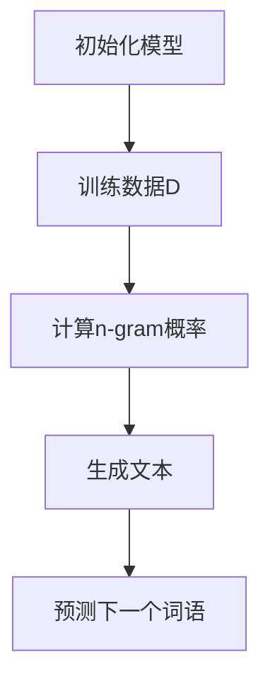

#### 2.1.2 隐马尔可夫模型（HMM）

隐马尔可夫模型是一种生成式语言模型，适用于处理含有隐状态序列的序列数据。在自然语言处理中，HMM常用于语音识别和词性标注任务。HMM由状态转移概率、状态发射概率和初始状态概率组成。

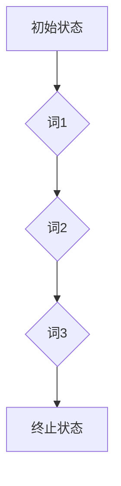

#### 2.1.3 递归神经网络（RNN）

递归神经网络是一种适用于处理序列数据的神经网络模型。RNN通过记忆机制可以捕捉序列中的长距离依赖关系，因此在自然语言处理领域得到了广泛应用。RNN的核心组件是隐藏状态，它通过对输入和前一个隐藏状态的加权和进行更新。

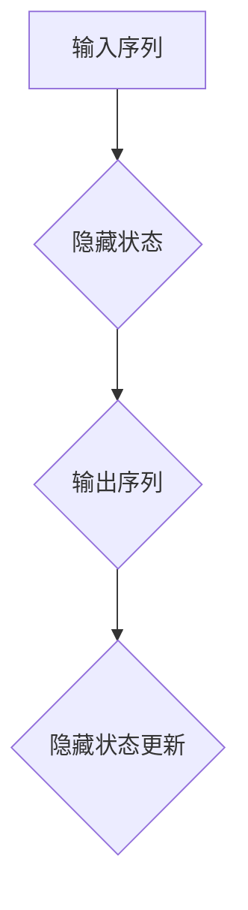

### 2.2 语法分析基础

语法分析是自然语言处理中的一个关键步骤，旨在将自然语言文本解析为结构化的语法表示。语法分析可以分为词法分析、语法解析和语义分析三个阶段。

#### 2.2.1 词法分析

词法分析是将文本分解为单词和其他符号的过程。词法分析器的输出通常是词法单元（tokens），它们是后续语法解析的基本单元。词法分析主要依赖于正则表达式和有限自动机。

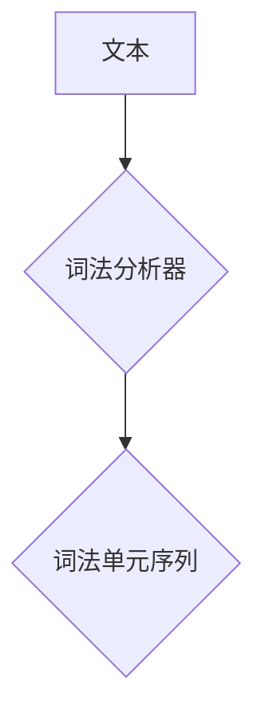

#### 2.2.2 语法解析

语法解析是将词法单元序列转化为语法树的过程，用于表示句子的结构。语法分析方法可以分为自顶向下解析和自底向上解析。自顶向下解析从句子的整体结构开始，逐步分解为更小的结构；自底向上解析则从词法单元开始，逐步组合成更大的结构。

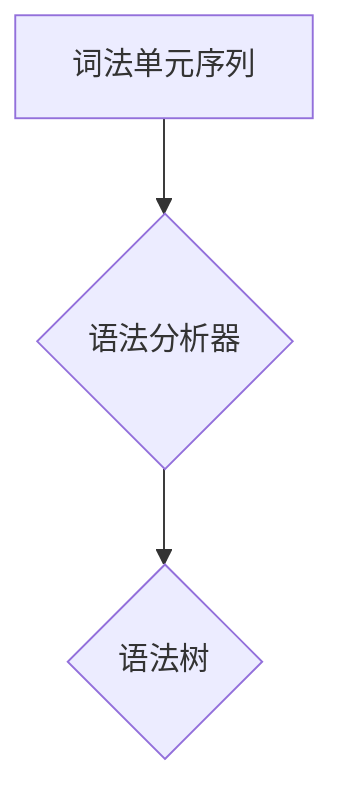

#### 2.2.3 语义分析

语义分析是在语法分析的基础上，对句子的语义信息进行理解和解释的过程。语义分析的目标是确定句子的意义，包括词汇意义和语法意义。语义分析方法可以分为浅层语义分析和深层语义分析。

- **浅层语义分析**：主要关注词汇的意义，将词汇映射到语义角色和实体上。

- **深层语义分析**：关注句子之间的逻辑关系和语义推理，实现对句子整体意义的理解。

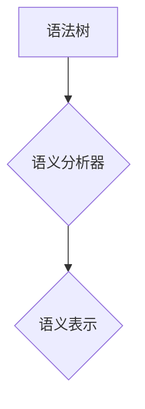

### 2.3 语义角色标注

语义角色标注是语义分析中的一个重要步骤，旨在为句子中的每个词汇标注其语义角色。语义角色是指词汇在句子中所扮演的语义角色，如主语、谓语、宾语等。

语义角色标注可以通过规则方法、机器学习方法等多种方式进行。规则方法基于预定义的规则集，对句子进行逐词分析，从而标注出语义角色。机器学习方法则通过训练模型，从大量标注数据中学习出语义角色的标注规律。

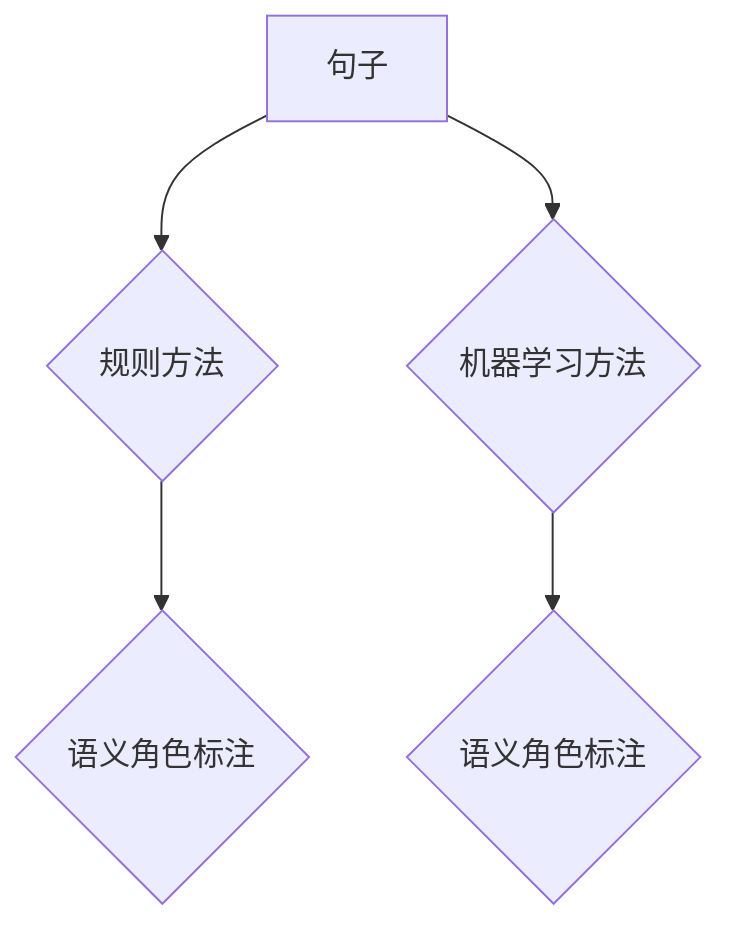

语义角色标注对于形式化语义分析具有重要意义，它为后续的语义推理和知识表示提供了基础。通过标注出句子的语义角色，我们可以更好地理解句子的语义信息，从而为各种自然语言处理任务提供支持。

### 2.4 形式语义学的核心理论

形式语义学是自然语言处理中的一个重要分支，旨在将自然语言的语义信息形式化，使其能够被计算机处理。形式语义学的核心理论主要包括谓词逻辑、谓词演算和语义网络等。

#### 2.4.1 谓词逻辑

谓词逻辑是形式语义学的基础，用于描述语句的语义特征。谓词逻辑包括个体、谓词、量词和逻辑连接词等基本概念。谓词逻辑可以表示自然语言中的各种逻辑关系，如蕴含、等价、推理等。

- **个体**：个体是指语言中的对象或实体。在谓词逻辑中，个体通常用变量表示，如"x"代表某个对象。

- **谓词**：谓词是描述个体性质或关系的表达式，如"是人"、"跑步"等。谓词可以接受个体作为参数，并返回真值。

- **量词**：量词用于表示个体在集合中的存在或全称关系。存在量词"∃"表示至少有一个个体满足某个性质，全称量词"∀"表示所有个体都满足某个性质。

- **逻辑连接词**：逻辑连接词用于组合谓词和量词，形成复杂的逻辑表达式。常见的逻辑连接词有"∧"（且）、"∨"（或）、"→"（蕴含）和"↔"（等价）等。

谓词逻辑可以用于表示自然语言中的各种语义信息，如句子之间的逻辑关系、词汇的语义角色等。例如，句子“所有狗都会叫”可以用谓词逻辑表示为“∀x（狗（x）→叫（x））”，其中“狗（x）”表示个体x是狗，“叫（x）”表示个体x会叫。

```latex
$$
\forall x (\text{狗}(x) \rightarrow \text{叫}(x))
$$
```

#### 2.4.2 谓词演算

谓词演算是谓词逻辑的一种扩展，用于处理更复杂的语义表达式。谓词演算包括一阶谓词演算和更高阶的谓词演算。一阶谓词演算是一种用于描述个体和谓词之间关系的逻辑系统，适用于自然语言处理中的许多任务。

一阶谓词演算的基本符号包括：

- **个体常数**：如"x1"、"x2"等，用于表示个体。

- **函数符号**：如"f"、"g"等，用于表示个体的属性或关系，如"f(x)"表示个体x具有属性f。

- **谓词符号**：如"P"、"Q"等，用于表示个体的性质或关系，如"P(x)"表示个体x具有性质P。

- **量词**：如"∃"（存在量词）和"∀"（全称量词），用于表示个体在集合中的存在或全称关系。

一阶谓词演算可以用于表示复杂的语义表达式，如“有的人是聪明的”、“所有的人都是聪明的”等。例如，句子“有的人是聪明的”可以用谓词演算表示为“∃x（人（x）∧聪明（x））”，其中“人（x）”表示个体x是人，“聪明（x）”表示个体x是聪明的。

```latex
$$
\exists x (\text{人}(x) \land \text{聪明}(x))
$$
```

#### 2.4.3 语义网络

语义网络是一种用于表示语义信息的图形模型，它通过节点和边来表示实体、属性和关系。在语义网络中，节点通常表示实体或概念，边表示实体之间的关系或属性。

语义网络可以用于形式化自然语言的语义信息，如词汇的语义角色、句子之间的逻辑关系等。语义网络的基本组成包括：

- **节点**：表示实体或概念，如“人”、“地点”等。

- **边**：表示实体之间的关系或属性，如“属于”、“位于”等。

- **标签**：表示边的类型，如“is-a”（属于）、“has-a”（具有）等。

语义网络可以用于各种自然语言处理任务，如语义角色标注、实体识别、关系抽取等。例如，句子“张三是一名程序员”可以用语义网络表示为：


通过语义网络，我们可以直观地表示和理解自然语言的语义信息，从而为各种自然语言处理任务提供支持。

### 2.4.4 核心概念原理之间的关系架构

为了更好地理解形式化语义分析的核心概念和原理，我们可以使用Mermaid流程图来表示它们之间的关系。

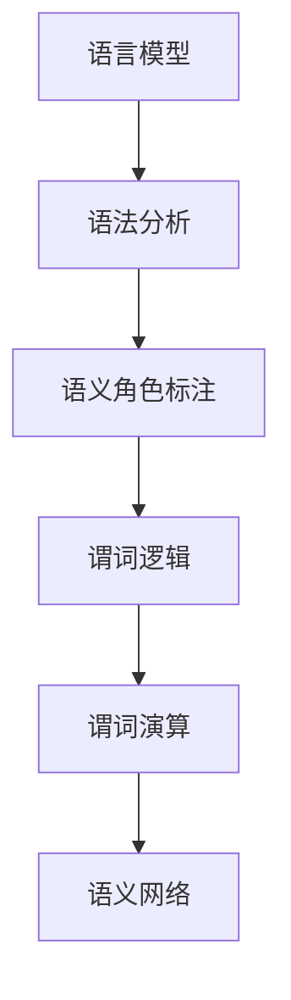

这个流程图展示了语言模型、语法分析、语义角色标注、谓词逻辑、谓词演算和语义网络之间的关联。从语言模型到语义网络，每一个概念和原理都是对前一个概念的扩展和深化，共同构成了形式化语义分析的理论基础。

通过这个关系架构，我们可以更清晰地理解形式化语义分析的核心概念和原理，以及它们在实际应用中的作用和意义。这不仅有助于我们深入理解这一领域，也为后续的学习和研究提供了明确的指导方向。

### 2.5 形式化语义分析的基本步骤

形式化语义分析是一个复杂的过程，它涉及多个步骤，每个步骤都有其特定的任务和目标。下面，我们将详细讲解形式化语义分析的基本步骤，包括词法分析、语法分析、语义角色标注和语义解释等。

#### 2.5.1 词法分析

词法分析是自然语言处理中的第一个步骤，它的目标是把文本分解成一个个可识别的词法单元（tokens）。词法分析器通常使用正则表达式或有限自动机来实现。词法分析的主要任务包括：

1. **字符分割**：将文本中的连续字符分割成单词、标点符号和其他符号。
2. **大小写转换**：将文本中的大小写统一为小写，以便后续处理。
3. **词法单元识别**：识别出文本中的单词、数字、标点符号等词法单元。

例如，句子“我爱北京天安门”经过词法分析后，可以分解为词法单元：["我", "爱", "北京", "天安门"]。


#### 2.5.2 语法分析

语法分析是形式化语义分析中的第二个步骤，它的目标是根据语言的语法规则，将词法单元序列转化为语法树（parse tree）。语法分析可以分为自顶向下分析和自底向上分析。

1. **自顶向下分析**：从句子的整体结构开始，逐步分解为更小的结构，直到词法单元。
2. **自底向上分析**：从词法单元开始，逐步组合成更大的结构，直到句子的整体结构。

语法分析的主要任务包括：

1. **句子结构解析**：根据语法规则，确定句子的结构，如主语、谓语、宾语等。
2. **语法树构建**：将词法单元序列转化为语法树，表示句子的结构。

例如，句子“我爱北京天安门”经过语法分析后，可以构建出如下语法树：

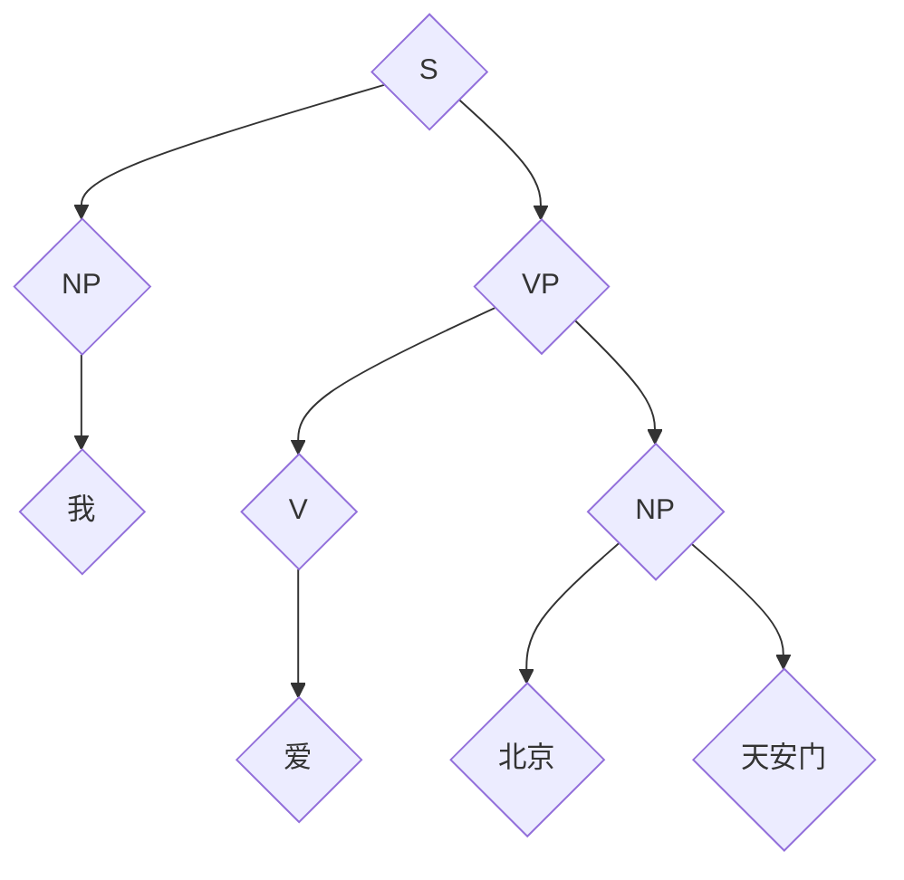

#### 2.5.3 语义角色标注

语义角色标注是形式化语义分析中的第三个步骤，它的目标是识别出句子中每个词的语义角色，如主语、谓语、宾语等。语义角色标注通常依赖于语法分析和词汇语义知识。

1. **词汇语义角色标注**：根据词性标注和词汇表，为每个词标注其语义角色。
2. **句子语义角色标注**：根据句子的结构，将词汇的语义角色标注到句子的各个部分。

例如，句子“我爱北京天安门”经过语义角色标注后，可以标注为：

- 我：主语
- 爱：谓语
- 北京：宾语
- 天安门：宾语

```mermaid
graph TD
A{S}
A --> B{NP[我]}
A --> C{VP}
C --> D{V[爱]}
C --> E{NP[北京]}
C --> F{NP[天安门]}
```

#### 2.5.4 语义解释

语义解释是形式化语义分析中的最后一个步骤，它的目标是根据语义角色标注，将句子的语义信息转化为计算机可以处理的形式。语义解释通常依赖于谓词逻辑、语义网络等理论。

1. **语义表示**：根据语义角色标注，将句子的语义信息表示为谓词逻辑公式或语义网络。
2. **语义推理**：利用谓词逻辑推理或语义网络中的关系，对语义信息进行推理和解释。

例如，句子“我爱北京天安门”经过语义解释后，可以表示为：

- ∃x（我爱上x，x是天安门）

或

- {人：我，物体：天安门，关系：爱}

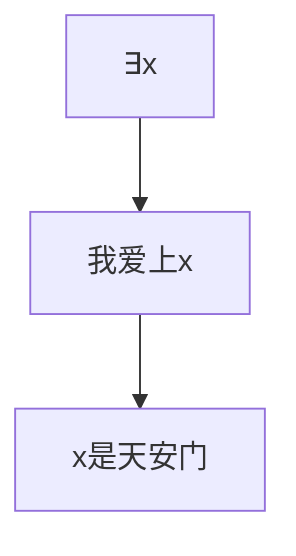

通过以上步骤，我们可以将自然语言文本转化为形式化的语义表示，从而实现计算机对自然语言的语义理解。

### 2.6 形式化语义分析技术的优缺点

形式化语义分析技术在不同领域和场景中都有广泛应用，它通过将自然语言的语义信息转化为计算机可处理的形式，为各种自然语言处理任务提供了有效的支持。下面，我们将从几个方面来分析形式化语义分析技术的优缺点。

#### 2.6.1 优点

1. **明确性**：形式化语义分析技术通过将语义信息转化为形式化的表示，如谓词逻辑、语义网络等，使得语义信息更加明确和清晰。这种明确性有助于计算机理解和处理语义信息，从而提高自然语言处理任务的准确性和效率。

2. **可计算性**：形式化语义分析技术具有较好的可计算性。通过定义明确的语义表示和推理规则，我们可以利用计算机算法对语义信息进行高效的处理。这使得形式化语义分析技术在处理大规模数据和高复杂度的任务时具有优势。

3. **可扩展性**：形式化语义分析技术具有较强的可扩展性。我们可以通过添加新的语义规则和推理方法，不断丰富和扩展形式化语义分析的能力。这使得形式化语义分析技术能够适应不断变化的自然语言处理需求。

4. **跨语言适用性**：形式化语义分析技术具有较强的跨语言适用性。通过将语义信息转化为形式化的表示，我们可以将自然语言的语义信息转化为通用的语义表示，从而实现不同语言之间的语义理解和处理。

#### 2.6.2 缺点

1. **复杂性**：形式化语义分析技术通常涉及复杂的理论和方法，如谓词逻辑、语义网络等。这使得形式化语义分析技术的学习和应用具有一定难度，需要相关领域深厚的知识背景。

2. **数据依赖性**：形式化语义分析技术依赖于大量的训练数据和标注数据。在数据稀缺或不完善的情况下，形式化语义分析技术的性能会受到影响。此外，数据的多样性和复杂性也会增加形式化语义分析技术的实现难度。

3. **局限性**：形式化语义分析技术在一些特定的自然语言处理任务中可能存在局限性。例如，在处理复杂的语义关系或情感分析等任务时，形式化语义分析技术的表现可能不如基于深度学习的语义分析方法。

4. **实时性**：形式化语义分析技术通常需要较长的处理时间，特别是在处理大规模数据时。这使得形式化语义分析技术难以满足一些对实时性要求较高的应用场景。

总之，形式化语义分析技术具有明确性、可计算性、可扩展性和跨语言适用性等优点，但也存在复杂性、数据依赖性、局限性和实时性等缺点。在实际应用中，我们需要根据具体的任务需求和环境，选择合适的形式化语义分析技术，并不断优化和改进。

### 2.7 形式化语义分析的主要应用领域

形式化语义分析作为一种强大的自然语言处理技术，在多个应用领域中得到了广泛的应用。以下将详细探讨形式化语义分析在自然语言处理、机器翻译、问答系统等领域的应用。

#### 2.7.1 自然语言处理

自然语言处理（NLP）是形式化语义分析最重要的应用领域之一。形式化语义分析在NLP中的应用主要包括文本分类、情感分析、命名实体识别、关系抽取等任务。

1. **文本分类**：文本分类是将文本按照其内容或主题划分到预定义的类别中。形式化语义分析通过将文本转化为形式化的语义表示，可以更好地捕捉文本的语义信息，从而提高文本分类的准确性。例如，可以使用谓词逻辑或语义网络来表示文本的特征，并利用机器学习算法进行分类。

2. **情感分析**：情感分析旨在识别文本中的情感倾向，如正面、负面或中性。形式化语义分析通过将文本转化为语义表示，可以更准确地识别情感信息。例如，可以使用语义角色标注来识别文本中的情感词汇和句子结构，并结合情感词典进行情感分析。

3. **命名实体识别**：命名实体识别（NER）旨在识别文本中的命名实体，如人名、地名、组织名等。形式化语义分析可以通过谓词逻辑和语义网络来表示命名实体，并利用规则方法或机器学习方法进行识别。例如，可以使用谓词逻辑公式来表示人名和地点的关系，并利用规则匹配进行命名实体识别。

4. **关系抽取**：关系抽取旨在从文本中提取出实体之间的关系。形式化语义分析通过语义角色标注和谓词逻辑，可以更好地识别实体之间的关系。例如，可以使用谓词逻辑公式来表示实体之间的因果关系或隶属关系，并利用规则方法或机器学习方法进行关系抽取。

#### 2.7.2 机器翻译

机器翻译是将一种语言的文本自动翻译成另一种语言。形式化语义分析在机器翻译中的应用主要包括语义表示、语义对齐和翻译推理等任务。

1. **语义表示**：语义表示是将文本转化为形式化的语义表示，如谓词逻辑公式或语义网络。形式化语义分析可以通过语义角色标注和谓词逻辑，将文本中的语义信息转化为语义表示，从而为机器翻译提供更准确的语义信息。

2. **语义对齐**：语义对齐是在机器翻译过程中，将源语言的语义表示与目标语言的语义表示进行匹配和映射。形式化语义分析通过语义表示，可以更准确地识别源语言和目标语言之间的语义关系，从而实现更精确的语义对齐。

3. **翻译推理**：翻译推理是在机器翻译过程中，根据源语言的语义信息推导出目标语言的语义表示。形式化语义分析通过谓词逻辑推理和语义网络中的关系，可以更有效地进行翻译推理，从而生成更自然和准确的目标语言翻译结果。

#### 2.7.3 问答系统

问答系统是一种智能交互系统，旨在回答用户提出的问题。形式化语义分析在问答系统中的应用主要包括语义理解、信息检索和答案生成等任务。

1. **语义理解**：语义理解是从用户的问题中提取出语义信息，并将其与知识库中的知识进行匹配。形式化语义分析通过语义角色标注和谓词逻辑，可以更准确地理解用户的问题，并提取出关键信息。

2. **信息检索**：信息检索是在问答系统中，从大量信息中找到与用户问题相关的信息。形式化语义分析通过语义表示和语义对齐，可以更有效地进行信息检索，从而提高问答系统的响应速度和准确性。

3. **答案生成**：答案生成是在问答系统中，根据用户的问题和检索到的信息，生成一个合理的答案。形式化语义分析通过谓词逻辑推理和语义网络中的关系，可以更有效地进行答案生成，从而提高问答系统的回答质量。

总之，形式化语义分析在自然语言处理、机器翻译、问答系统等领域的应用，不仅提高了这些任务的准确性和效率，也为智能系统的开发提供了有力的支持。随着形式化语义分析技术的不断发展和完善，其在更多应用领域的潜力将得到进一步挖掘。

### 2.8 形式化语义分析技术的发展趋势

形式化语义分析技术作为自然语言处理的核心技术之一，近年来在人工智能领域的快速发展中取得了显著成果。随着深度学习、大数据和语义网络等新技术的引入，形式化语义分析技术也在不断演进，呈现出以下几个主要的发展趋势。

#### 2.8.1 基于深度学习的语义分析方法

深度学习技术在自然语言处理领域的成功应用，极大地推动了形式化语义分析技术的发展。基于深度学习的语义分析方法通过神经网络模型，如卷积神经网络（CNN）和循环神经网络（RNN），可以捕捉语言中的复杂语义特征和上下文关系。以下是一些基于深度学习的语义分析方法：

1. **词嵌入**：词嵌入（Word Embedding）是将词汇映射到高维向量空间的技术，通过捕捉词汇的语义和语法特征，实现词汇之间的相似性和相关性。词嵌入技术如Word2Vec、GloVe等，为形式化语义分析提供了丰富的语义信息。

2. **注意力机制**：注意力机制（Attention Mechanism）是一种用于捕捉句子中不同部分的重要性的技术。通过注意力机制，神经网络可以动态调整对不同词汇的关注程度，从而提高语义分析的准确性和鲁棒性。例如，在机器翻译中，注意力机制可以使得模型更准确地捕捉源语言和目标语言之间的对应关系。

3. **预训练语言模型**：预训练语言模型（Pre-trained Language Model），如BERT、GPT等，通过在大规模语料上进行预训练，可以自动学习到丰富的语言知识。这些预训练模型在形式化语义分析中可以用于句法分析、语义角色标注、实体识别等任务，提高了模型的泛化能力和语义理解能力。

#### 2.8.2 基于大数据的语义分析方法

随着互联网和大数据技术的快速发展，海量的文本数据成为形式化语义分析的重要资源。基于大数据的语义分析方法通过分析大规模数据，可以挖掘出更多有价值的语义信息。以下是一些基于大数据的语义分析方法：

1. **数据驱动的语义角色标注**：数据驱动的语义角色标注方法通过大规模语料库进行训练，自动学习出词汇的语义角色标注规律。这种方法不仅可以提高标注的准确性，还可以自动适应新词和新语法结构。

2. **数据驱动的语义关系抽取**：数据驱动的语义关系抽取方法通过大规模数据集，自动学习出实体之间的语义关系。这种方法可以识别出文本中隐含的语义信息，为知识图谱构建和问答系统提供支持。

3. **数据驱动的语义融合**：数据驱动的语义融合方法通过融合多种数据源（如文本、图像、语音等），构建多模态的语义表示。这种方法可以更好地捕捉复杂的语义信息，提高形式化语义分析的综合能力。

#### 2.8.3 语义网络与知识图谱

语义网络（Semantic Network）和知识图谱（Knowledge Graph）作为形式化语义分析的重要工具，近年来在人工智能领域得到了广泛关注。语义网络和知识图谱通过将语义信息表示为图形结构，可以更好地组织和利用语义信息。以下是一些与语义网络和知识图谱相关的研究方向：

1. **语义网络表示学习**：语义网络表示学习旨在将语义信息转化为计算机可以处理的形式。通过学习语义网络的向量表示，可以实现词汇、实体和关系的高效表示和检索。

2. **知识图谱构建**：知识图谱构建是通过语义网络和实体关系，构建出结构化、可查询的知识库。知识图谱可以用于问答系统、智能搜索、推荐系统等任务，提供丰富的语义信息。

3. **语义推理与推理图谱**：语义推理是通过逻辑推理和语义网络，从已知信息中推导出新的信息。推理图谱（Reasoning Graph）是将推理过程表示为图形结构，可以用于实现复杂推理任务，如因果推理、逻辑推理等。

总之，形式化语义分析技术在深度学习、大数据和语义网络等新技术的推动下，不断发展和完善。未来，随着这些技术的进一步发展，形式化语义分析将在更多应用领域中发挥重要作用，推动人工智能技术的进步。

### 2.9 形式化语义分析的未来发展趋势与挑战

形式化语义分析作为自然语言处理的重要分支，随着人工智能技术的发展，正迎来新的机遇与挑战。以下将从未来发展趋势、潜在应用和面临的挑战三个方面进行探讨。

#### 2.9.1 未来发展趋势

1. **多模态语义融合**：随着多模态数据源（如文本、图像、语音等）的普及，形式化语义分析将逐步实现多模态语义融合。通过整合不同类型的数据，可以更全面地捕捉语义信息，从而提高语义分析的准确性和鲁棒性。

2. **自适应语义理解**：自适应语义理解是未来的一个重要方向。通过结合深度学习和强化学习技术，模型可以不断学习用户的语义偏好和语言习惯，实现更个性化的语义理解。

3. **知识增强的语义分析**：知识图谱和语义网络在形式化语义分析中的应用将越来越广泛。通过将结构化知识库与自然语言文本相结合，可以实现更精确和高效的语义分析。

4. **跨语言语义分析**：跨语言语义分析是形式化语义分析的一个重要领域。未来，通过引入多语言数据集和跨语言模型，可以实现对多种语言文本的语义理解和处理，促进全球信息的互联互通。

5. **增强现实与虚拟现实应用**：随着增强现实（AR）和虚拟现实（VR）技术的发展，形式化语义分析将在这些领域发挥重要作用。通过语义分析，可以实现更智能、更自然的交互体验。

#### 2.9.2 潜在应用

1. **智能客服与虚拟助手**：形式化语义分析技术可以用于构建智能客服系统和虚拟助手，实现与用户的自然语言交互。通过深入理解用户需求，这些系统能够提供个性化、高效的服务。

2. **内容审核与监管**：形式化语义分析技术可以用于内容审核和监管，识别和过滤不良信息。这有助于维护网络环境的健康和秩序。

3. **智能推荐系统**：形式化语义分析技术可以用于构建智能推荐系统，通过对用户行为和偏好进行分析，实现个性化推荐。

4. **医疗健康领域**：在医疗健康领域，形式化语义分析可以用于医学文本分析、疾病预测等任务，辅助医生做出更准确的诊断和治疗决策。

5. **教育领域**：形式化语义分析技术可以用于教育领域的智能问答系统、个性化学习等任务，提高教学质量和学习效果。

#### 2.9.3 面临的挑战

1. **数据质量和多样性**：形式化语义分析依赖于大量的训练数据和标注数据。数据质量和多样性对模型性能有着重要影响。未来，如何获取高质量、多样性的数据，将是形式化语义分析面临的一大挑战。

2. **语义歧义与理解**：自然语言中存在大量的语义歧义，形式化语义分析技术需要有效解决这些问题。如何提高对歧义文本的理解能力，是一个亟待解决的问题。

3. **实时性与效率**：随着应用场景的多样化，形式化语义分析技术需要满足实时性和效率的要求。如何优化算法和模型，提高处理速度和效果，是一个重要的研究课题。

4. **隐私保护与伦理**：在形式化语义分析过程中，涉及大量个人隐私信息。如何保护用户隐私，遵守相关法律法规，是形式化语义分析需要考虑的重要问题。

5. **跨领域与应用拓展**：形式化语义分析技术的应用领域广泛，如何在不同领域实现有效拓展，是一个重要的挑战。需要结合不同领域的特点，开发出更具普适性的语义分析技术。

总之，形式化语义分析在未来将面临诸多挑战，但同时也蕴藏着巨大的发展机遇。通过不断技术创新和应用拓展，形式化语义分析将为人工智能领域的发展贡献更多力量。

### 2.10 形式化语义分析领域的最新研究动态和趋势

形式化语义分析领域近年来取得了显著进展，不断涌现出新的研究动态和趋势。以下将简要介绍该领域的几个重要研究热点和未来发展方向。

#### 2.10.1 神经语义分析

神经语义分析（Neural Semantic Analysis）是当前形式化语义分析领域的一个重要研究方向。通过深度学习技术，特别是基于神经网络的模型，如Transformer、BERT等，研究人员试图捕捉自然语言中的复杂语义特征。这一趋势体现在：

1. **预训练语言模型**：预训练语言模型（Pre-trained Language Model），如BERT、GPT等，通过在大规模语料上进行预训练，可以自动学习到丰富的语言知识和语义信息。这些模型在自然语言处理任务中表现出色，如文本分类、情感分析、命名实体识别等。

2. **上下文敏感的语义表示**：神经语义分析技术通过引入上下文信息，可以生成更精确和丰富的语义表示。例如，BERT模型通过双向编码器（Bidirectional Encoder）可以捕捉词与句子中的上下文关系，从而提高语义理解的准确性和泛化能力。

3. **多任务学习**：神经语义分析模型通常采用多任务学习（Multi-task Learning）的方法，通过在一个模型中同时学习多个任务，提高模型的泛化能力和资源利用效率。这种方法在文本分类、问答系统和实体识别等任务中取得了显著效果。

#### 2.10.2 语义角色标注与识别

语义角色标注（Semantic Role Labeling, SRL）和识别（Semantic Role Labeling, SRL）是形式化语义分析中的关键任务。近年来，研究人员在这一领域取得了多项重要进展：

1. **基于规则的方法**：传统的语义角色标注方法主要基于规则和统计方法。虽然这些方法在处理简单句子时表现较好，但在处理复杂句子时存在局限性。

2. **基于统计的方法**：基于统计的语义角色标注方法通过训练模型，从大量标注数据中学习出标注规律。这类方法在处理大规模文本数据时表现出色，如条件随机场（CRF）和隐马尔可夫模型（HMM）。

3. **基于深度学习方法**：深度学习方法在语义角色标注和识别中表现出显著优势。通过卷积神经网络（CNN）和循环神经网络（RNN）等模型，可以捕捉句子中的复杂语义关系。例如，BERT模型在语义角色标注任务中取得了很好的效果。

4. **跨语言语义角色标注**：随着多语言数据集的普及，跨语言语义角色标注成为研究的热点。通过引入多语言数据集和跨语言模型，可以实现不同语言之间的语义角色标注和识别。

#### 2.10.3 语义融合与推理

语义融合（Semantic Fusion）和推理（Semantic Reasoning）是形式化语义分析中的核心问题。近年来，研究人员在这一领域取得了多项重要进展：

1. **语义网络表示**：语义网络（Semantic Network）和知识图谱（Knowledge Graph）是语义融合和推理的重要工具。通过将语义信息表示为图形结构，可以实现语义的整合和推理。

2. **基于知识的语义推理**：基于知识的语义推理（Knowledge-based Semantic Reasoning）通过引入外部知识库，如WordNet、OpenIE等，可以增强模型的语义推理能力。例如，通过结合知识图谱和语义网络，可以实现复杂推理任务，如因果推理、逻辑推理等。

3. **跨模态语义融合**：随着多模态数据的普及，跨模态语义融合（Cross-modal Semantic Fusion）成为研究的热点。通过整合不同类型的数据，如文本、图像、语音等，可以更全面地捕捉语义信息。

4. **增强现实与虚拟现实应用**：在增强现实（AR）和虚拟现实（VR）领域，语义融合和推理技术可以用于实现更智能、更自然的交互体验。例如，通过语义分析，可以识别用户的手势、表情等，实现人机交互的智能化。

总之，形式化语义分析领域在神经语义分析、语义角色标注与识别、语义融合与推理等方面取得了显著进展。未来，随着这些技术的不断发展和完善，形式化语义分析将在更多应用领域中发挥重要作用。

### 第3章 形式化语义分析技术

形式化语义分析技术是自然语言处理中的重要组成部分，它通过将自然语言的语义信息转化为计算机可以处理的形式，为各种自然语言处理任务提供了强有力的支持。本章将详细介绍形式化语义分析技术的主要方法，包括谓词逻辑、谓词演算和语义网络等。

#### 3.1 谓词逻辑

谓词逻辑（Predicate Logic）是形式化语义分析的基础理论之一，它通过符号化的方式来描述自然语言的语义信息。谓词逻辑包括个体、谓词、量词和逻辑连接词等基本概念。

1. **个体**：个体是语言中的对象或实体，用变量表示，如$x$、$y$等。

2. **谓词**：谓词是描述个体性质或关系的表达式，如“是人”、“跑步”等。谓词接受个体作为参数，并返回真值。

3. **量词**：量词用于表示个体在集合中的存在或全称关系。存在量词“∃”表示至少有一个个体满足某个性质，全称量词“∀”表示所有个体都满足某个性质。

4. **逻辑连接词**：逻辑连接词用于组合谓词和量词，形成复杂的逻辑表达式。常见的逻辑连接词有“∧”（且）、“∨”（或）、“→”（蕴含）和“↔”（等价）等。

谓词逻辑可以表示自然语言中的各种逻辑关系。例如，句子“所有狗都会叫”可以用谓词逻辑表示为“∀x（狗（x）→叫（x））”，其中“狗（x）”表示个体$x$是狗，“叫（x）”表示个体$x$会叫。

```mermaid
graph TD
A[∀x]
A --> B[狗(x) → 叫(x)]
B --> C{狗(x)]
C --> D{叫(x)}
```

#### 3.2 谓词演算

谓词演算是谓词逻辑的一种扩展，用于处理更复杂的语义表达式。谓词演算包括一阶谓词演算和更高阶的谓词演算。一阶谓词演算是形式语义学中最常用的谓词演算形式。

1. **个体常数**：个体常数用于表示具体的对象，如“苏格拉底”、“柏拉图”等。

2. **函数符号**：函数符号用于表示对象的属性或关系，如“是父亲”、“是学生”等。函数符号接受个体作为参数，并返回一个个体。

3. **谓词符号**：谓词符号用于表示对象的性质或关系，如“是人”、“会跑步”等。谓词符号接受个体作为参数，并返回一个真值。

4. **量词**：量词用于表示个体在集合中的存在或全称关系。

一阶谓词演算可以表示复杂的语义表达式。例如，句子“有的人是聪明的”可以用谓词演算表示为“∃x（人是x∧聪明x）”，其中“人是x”表示个体$x$是人，“聪明x”表示个体$x$是聪明的。

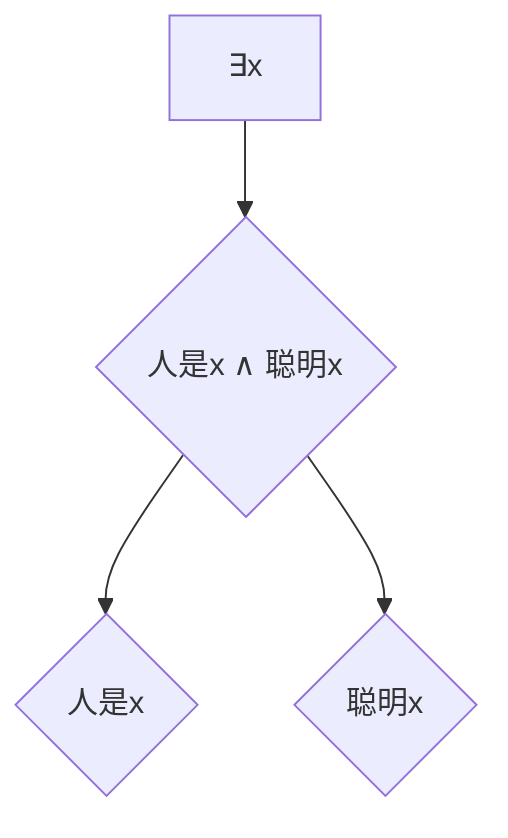

#### 3.3 语义网络

语义网络（Semantic Network）是一种图形化的知识表示方法，通过节点和边表示实体、属性和关系。语义网络可以直观地表示自然语言的语义信息，并支持语义推理。

1. **节点**：节点表示实体或概念，如“人”、“地点”等。

2. **边**：边表示实体之间的关系或属性，如“属于”、“位于”等。

3. **标签**：标签表示边的类型，如“is-a”（属于）、“has-a”（具有）等。

语义网络可以用于形式化自然语言的语义信息。例如，句子“张三是一名程序员”可以用语义网络表示为：


通过语义网络，我们可以直观地表示和理解自然语言的语义信息，从而为各种自然语言处理任务提供支持。

#### 3.4 形式化语义分析技术的应用

形式化语义分析技术在实际应用中发挥了重要作用。以下将介绍几种常见的形式化语义分析技术及其应用场景。

1. **语义角色标注**：语义角色标注（Semantic Role Labeling, SRL）是形式化语义分析中的一个重要任务，旨在识别出句子中每个词的语义角色，如主语、谓语、宾语等。语义角色标注可以用于问答系统、信息抽取和文本分类等任务。例如，句子“我昨天去图书馆借了一本书”的语义角色标注为：主语（我）、谓语（去图书馆借）、宾语（一本书）。

2. **谓词逻辑推理**：谓词逻辑推理（Predicate Logic Reasoning）是一种基于谓词逻辑的推理方法，用于从已知事实推导出新的结论。谓词逻辑推理可以用于逻辑推理、知识表示和验证等任务。例如，从事实“所有狗都会叫”和“狗叫”可以推理出结论“狗会叫”。

3. **语义网络构建**：语义网络构建（Semantic Network Construction）是通过将自然语言文本转化为语义网络，来表示文本中的语义信息。语义网络可以用于知识表示、语义搜索和问答系统等任务。例如，通过语义网络可以更好地理解和检索文本信息。

通过以上形式化语义分析技术的应用，我们可以更准确地理解和处理自然语言的语义信息，为各种自然语言处理任务提供有效的支持。

### 3.5 谓词逻辑与谓词演算的关系及区别

谓词逻辑（Predicate Logic）和谓词演算（Predicate Calculus）是形式化语义分析中的两个重要概念，它们在自然语言处理、逻辑推理和知识表示等方面都有广泛的应用。虽然这两个概念密切相关，但在形式和用途上存在一些区别。

#### 关系

谓词逻辑和谓词演算的关系可以看作是包含与扩展的关系。谓词逻辑是一种更为广泛的概念，它涵盖了谓词演算，并且还包括量词和逻辑连接词等更多元素。谓词演算则是谓词逻辑的一种具体实现，它专注于处理个体的性质和关系，并提供了更具体的语法和语义规则。

#### 区别

1. **范围**：
   - **谓词逻辑**：谓词逻辑包括个体、谓词、量词和逻辑连接词等元素，它可以处理更广泛的语义表达式，如全称量词（∀）和存在量词（∃）。
   - **谓词演算**：谓词演算主要关注个体、谓词和量词，它通过谓词演算公式来表达逻辑关系，但不涉及逻辑连接词。

2. **语法和语义**：
   - **谓词逻辑**：谓词逻辑的语法和语义更加复杂，它不仅包含谓词演算的元素，还包括逻辑连接词（如→、∧、∨）和量词。
   - **谓词演算**：谓词演算的语法和语义相对简单，它专注于个体、谓词和量词，通过谓词演算公式来表达逻辑关系。

3. **应用场景**：
   - **谓词逻辑**：谓词逻辑广泛应用于自然语言处理、逻辑推理和知识表示等领域，它可以表示复杂的语义关系和推理过程。
   - **谓词演算**：谓词演算在形式化语义分析中也有重要应用，尤其是在语义角色标注、谓词逻辑推理和知识表示等方面。

#### 例子

1. **谓词逻辑**：
   - 例子：“所有狗都会叫”可以表示为：∀x（狗(x) → 叫(x)）。
   - 在这个例子中，∀表示全称量词，x是变量，狗(x)和叫(x)分别是谓词。

2. **谓词演算**：
   - 例子：“有的人是聪明的”可以表示为：∃x（人是x ∧ 聪明x）。
   - 在这个例子中，∃表示存在量词，x是变量，人是x和聪明x分别是谓词。

通过以上例子，我们可以看到谓词逻辑和谓词演算在表达语义关系时的不同形式。谓词逻辑提供了更丰富的语法和语义表示能力，而谓词演算则专注于个体的性质和关系表达。

### 3.6 语义网络的基本概念及其在自然语言处理中的应用

语义网络（Semantic Network）是一种用于表示知识结构的方法，通过节点和边来表示实体、属性和关系。在自然语言处理中，语义网络被广泛应用于知识表示、语义推理和文本分析等领域。

#### 3.6.1 基本概念

1. **节点**：节点（Node）表示语义网络中的实体或概念。节点可以表示人、地点、物体等实体，也可以表示抽象概念。

2. **边**：边（Edge）表示节点之间的关系或属性。边可以有方向，表示关系的一对一、一对多或多对多关系。常见的边类型包括：
   - **is-a**（属于）：表示类别关系，如“猫”是“动物”的一种。
   - **has-a**（具有）：表示属性关系，如“手机”具有“摄像头”。
   - **part-of**（部分）：表示部分与整体的关系，如“轮子”是“汽车”的一部分。

3. **标签**：标签（Label）是边的属性，表示边的关系类型。例如，“is-a”表示类别关系，“has-a”表示属性关系。

#### 3.6.2 语义网络在自然语言处理中的应用

1. **知识表示**：语义网络可以用于表示文本中的知识，为自然语言处理任务提供语义信息。例如，通过构建语义网络，可以表示出文本中实体、属性和关系的信息，从而提高文本分类、信息抽取和语义推理等任务的性能。

2. **语义推理**：语义网络支持基于知识的推理，可以从已知事实推导出新的结论。例如，通过语义网络可以推理出“如果一只动物是猫，那么它是动物”这样的逻辑关系。语义推理可以用于问答系统、推理引擎和知识图谱构建等领域。

3. **文本分析**：语义网络可以用于文本分析任务，如文本分类、实体识别和关系抽取。通过将文本转化为语义网络表示，可以更准确地识别文本中的实体和关系，从而提高文本分析任务的性能。

4. **跨语言语义分析**：语义网络支持跨语言语义分析，通过构建多语言语义网络，可以实现不同语言之间的语义理解和翻译。例如，通过语义网络可以识别出不同语言中相同概念的对应关系，从而实现多语言文本的语义分析。

5. **智能问答系统**：语义网络可以用于构建智能问答系统，通过语义网络表示用户问题和知识库中的信息，可以更准确地理解和回答用户的问题。语义网络可以用于处理复杂的问题，如包含多个实体和关系的推理问题。

#### 3.6.3 实例

假设我们要构建一个关于动物的语义网络，节点包括“猫”、“狗”、“动物”等，边包括“is-a”（属于）和“has-a”（具有）等关系。一个简单的语义网络表示如下：

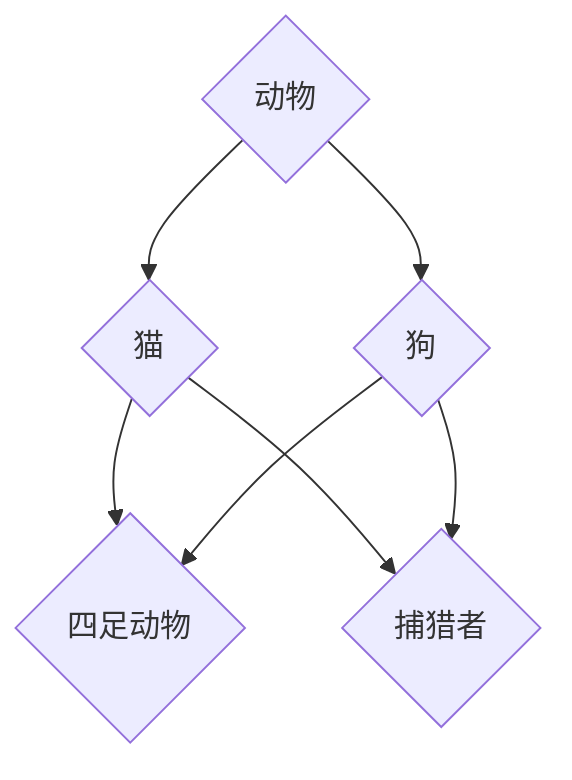

在这个语义网络中，节点“A”表示“动物”，“B”和“C”表示“猫”和“狗”，它们都属于“动物”。节点“B”和“C”还分别具有“捕猎者”属性。通过这个语义网络，我们可以推理出“猫”和“狗”都是“动物”，并且都是“捕猎者”。

总之，语义网络是一种强大的知识表示工具，它在自然语言处理中的应用非常广泛。通过语义网络，我们可以更好地理解和处理文本中的语义信息，从而提高自然语言处理任务的性能和准确性。

### 3.7 形式化语义分析在实际中的应用实例

为了更好地理解形式化语义分析技术的实际应用，我们来看几个具体的实例，包括自然语言处理、机器翻译和问答系统等领域的应用。

#### 3.7.1 自然语言处理中的应用

自然语言处理（NLP）是形式化语义分析最常见的应用领域之一。以下是一个关于情感分析的实例：

**实例：情绪分类**

假设我们要对一段文本进行情绪分类，将其归类为正面、负面或中性。我们可以使用形式化语义分析技术来提取文本中的情绪信息。

1. **文本预处理**：首先，我们将文本进行分词和词性标注，提取出文本中的关键信息。

   ```text
   例如，句子：“我非常喜欢这个产品。”
   分词和词性标注结果：“我（主语）/ 非常（副词）/ 喜欢的（形容词）/ 这个（指示代词）/ 产品（名词）。”
   
2. **语义角色标注**：接下来，我们使用语义角色标注技术，为每个词标注其语义角色。

   ```mermaid
   graph TD
   A{主语} --> B{我}
   A --> C{谓语}
   C --> D{喜欢}
   C --> E{宾语}
   E --> F{宾语补足语}
   F --> G{这个产品}
   ```

3. **情感分析**：最后，我们根据语义角色和词汇的情感倾向，对文本进行情绪分类。例如，词汇“喜欢”通常表示正面情感。

   ```mermaid
   graph TD
   A{文本：“我非常喜欢这个产品。”}
   A --> B{情感：正面}
   ```

通过这个实例，我们可以看到形式化语义分析技术在情感分析中的应用，它帮助我们理解文本中的情绪信息，从而实现准确的情绪分类。

#### 3.7.2 机器翻译中的应用

机器翻译是将一种语言的文本自动翻译成另一种语言。形式化语义分析在机器翻译中的应用主要体现在语义表示和翻译推理上。

**实例：中文到英文的机器翻译**

假设我们要将句子“我昨天去图书馆借了一本书”翻译成英文。

1. **文本预处理**：首先，我们对中文文本进行分词和词性标注。

   ```text
   例如，句子：“我昨天去图书馆借了一本书。”
   分词和词性标注结果：“我（主语）/ 昨天（时间状语）/ 去（动词）/ 图书馆（名词）/ 借（动词）/ 了（助词）/ 一本（数量词）/ 书（名词）。”
   
2. **语义角色标注**：接下来，我们使用语义角色标注技术，为每个词标注其语义角色。

   ```mermaid
   graph TD
   A{主语} --> B{我}
   A --> C{谓语}
   C --> D{去}
   C --> E{宾语}
   E --> F{图书馆}
   A --> G{谓语}
   G --> H{借}
   G --> I{宾语}
   I --> J{一本}
   I --> K{书}
   ```

3. **翻译推理**：最后，我们利用形式化语义分析技术，将语义角色标注转化为英文翻译。

   ```mermaid
   graph TD
   A{昨天我去图书馆借了一本书。}
   A --> B{"I went to the library yesterday and borrowed a book."}
   ```

通过这个实例，我们可以看到形式化语义分析技术在机器翻译中的应用，它帮助我们理解源文本的语义信息，从而生成准确的目标语言翻译。

#### 3.7.3 问答系统中的应用

问答系统是一种智能交互系统，旨在回答用户提出的问题。形式化语义分析在问答系统中主要用于语义理解、信息检索和答案生成。

**实例：智能问答系统**

假设用户提出问题：“北京是中国的哪个省份？”

1. **语义理解**：首先，系统对用户问题进行语义理解，提取出关键信息。

   ```text
   关键信息：“北京”、“中国”、“省份”
   ```

2. **信息检索**：接下来，系统在知识库中检索与关键信息相关的信息。

   ```mermaid
   graph TD
   A{北京}
   A --> B{中国}
   B --> C{省份}
   ```

3. **答案生成**：最后，系统根据检索到的信息生成答案。

   ```mermaid
   graph TD
   A{北京是中国的一个省份。}
   ```

通过这个实例，我们可以看到形式化语义分析技术在问答系统中的应用，它帮助我们理解用户问题，并在知识库中找到相关答案，从而实现智能问答。

总之，形式化语义分析技术在实际应用中发挥着重要作用，它帮助我们理解自然语言的语义信息，从而实现更准确和智能的自然语言处理任务。通过上述实例，我们可以更好地理解形式化语义分析技术在自然语言处理、机器翻译和问答系统等领域的应用。

### 3.8 形式化语义分析技术的实现方法和工具

实现形式化语义分析技术需要多种方法和工具，包括语义网络、语义解析器、开发环境和工具等。以下将详细介绍这些实现方法和工具。

#### 3.8.1 语义网络

语义网络（Semantic Network）是一种图形化的知识表示方法，用于表示实体、属性和关系。在形式化语义分析中，语义网络是实现语义表示和推理的重要工具。

1. **构建方法**：构建语义网络通常包括以下几个步骤：
   - **实体识别**：识别文本中的实体，如人名、地名、组织名等。
   - **关系抽取**：从文本中提取出实体之间的关系，如“属于”、“位于”等。
   - **属性标注**：为实体和关系标注属性，如“is-a”（属于）和“has-a”（具有）等。

2. **实现工具**：常见的语义网络构建工具包括：
   - **Neo4j**：一个高性能的图形数据库，支持图数据存储和查询。
   - **OpenIE**：一个开源的框架，用于从文本中提取出实体和关系。
   - **OWL**：Web本体语言（Web Ontology Language），用于表示语义网络和本体。

#### 3.8.2 语义解析器

语义解析器（Semantic Parser）是一种将自然语言文本转化为结构化语义表示的软件工具。语义解析器通常结合语法分析和语义角色标注技术，实现自然语言文本的语义理解。

1. **工作原理**：
   - **文本预处理**：对文本进行分词、词性标注等预处理操作。
   - **语法分析**：根据语法规则，将文本分解为句子结构，并生成语法树。
   - **语义角色标注**：为每个词标注其语义角色，如主语、谓语、宾语等。
   - **语义表示**：将语义角色标注转化为结构化的语义表示，如谓词逻辑公式或语义网络。

2. **实现工具**：
   - **Stanford NLP**：一个开源的自然语言处理工具包，包括语法分析和语义角色标注功能。
   - **Spacy**：一个流行的自然语言处理库，支持多种语言的语义角色标注。
   - **AllenNLP**：一个基于PyTorch的开源自然语言处理库，支持语义角色标注和语义表示。

#### 3.8.3 开发环境

实现形式化语义分析技术需要一个强大的开发环境，以支持算法实现、模型训练和性能优化等任务。

1. **Python**：Python是一种流行的编程语言，具有丰富的自然语言处理库和工具，如NLTK、spaCy等。

2. **TensorFlow**：TensorFlow是一个开源的机器学习框架，支持深度学习模型训练和推理。

3. **PyTorch**：PyTorch是一个开源的机器学习库，支持动态计算图和深度学习模型训练。

4. **Jupyter Notebook**：Jupyter Notebook是一个交互式计算环境，支持Python编程和可视化，适合进行实验和演示。

#### 3.8.4 工具选择

在选择实现形式化语义分析技术的工具时，需要考虑以下因素：

- **需求**：根据具体应用需求，选择合适的工具。例如，对于需要高性能图处理的任务，可以选择Neo4j；对于需要深度学习模型的任务，可以选择TensorFlow或PyTorch。
- **易用性**：选择易用性较高的工具，可以降低开发难度和学习成本。
- **社区和支持**：选择拥有活跃社区和支持的工

