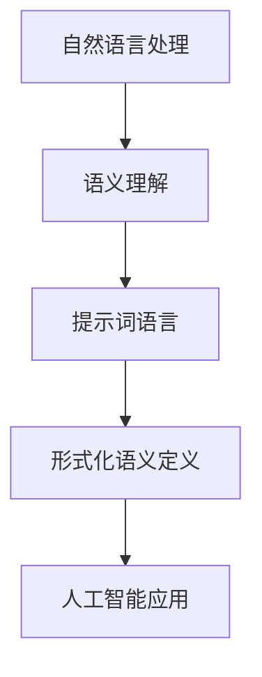

                 

 
以下是一个具体的文章草稿，我们将逐步完善其内容。

# 《提示词语言的形式化语义定义》

## 关键词
提示词语言，形式化语义，自然语言处理，语义分析，人工智能

## 摘要
本文旨在探讨提示词语言的形式化语义定义，分析其基本概念、构建方法和应用场景。通过介绍自然语言处理中的挑战和形式化语义的基本原理，本文详细阐述了提示词语言的形式化表示方法及其与自然语言处理的关系。最后，本文通过具体案例，展示了形式化语义在人工智能领域中的应用和实践。

## 引言
### 背景介绍
随着信息技术的迅猛发展，自然语言处理（NLP）已经成为人工智能（AI）领域的重要分支。然而，NLP 面临的一个关键挑战是语义理解。语义理解涉及到对文本的深层含义进行解读，这需要精确的形式化语义定义。提示词语言作为一种重要的语言模型，其形式化语义的定义对于提高NLP系统的性能具有重要意义。

### 核心概念与联系
#### Mermaid 流程图

## 第一部分：形式化语义基础

### 1.1 形式化语义的基本概念
#### 核心概念与联系
**定义**：形式化语义是指通过数学模型和逻辑框架，对自然语言中的语义进行精确描述。
**联系**：形式化语义与自然语言处理密切相关，它是实现高效语义理解的基础。

#### 形式化语义的研究背景与意义
**背景**：传统NLP方法在语义理解上存在局限性，难以处理复杂语义。
**意义**：形式化语义能够提高NLP系统的语义分析能力，促进AI技术的发展。

### 1.2 形式化语义与自然语言处理
#### 核心概念与联系
**定义**：形式化语义在自然语言处理中的应用，主要包括语义表示、语义解析和语义匹配等。
**联系**：形式化语义为NLP提供了更精确的语义描述手段，有助于提高系统的语义理解能力。

#### 自然语言处理中的挑战
**挑战**：多义性、歧义性、语境依赖等。

### 1.3 形式化语义的基本原理
#### 核心概念与联系
**定义**：形式化语义的基本原理包括语义表示、语义推理和语义建模。
**联系**：这些原理共同构成了形式化语义的理论基础。

#### 形式化语义的构成要素
**要素**：词汇语义、句法语义、语用语义。

## 第二部分：提示词语言基础

### 2.1 提示词语言概述
#### 核心概念与联系
**定义**：提示词语言是一种基于关键词或短语的语言模型，用于引导和优化自然语言处理任务。
**联系**：提示词语言在语义理解中起到了关键作用。

#### 提示词语言的特点
**特点**：简洁性、灵活性、适应性。

### 2.2 提示词语言的构成要素
#### 核心概念与联系
**定义**：提示词语言的构成要素包括关键词、短语、语义角色和关系。
**联系**：这些要素共同构成了提示词语言的语义表示。

#### 提示词的类型
**类型**：主题词、动作词、属性词等。

### 2.3 提示词语言的形式化表示
#### 核心概念与联系
**定义**：形式化表示是指使用数学和逻辑方法，对提示词语言进行结构化和规范化。
**联系**：形式化表示有助于提高提示词语言的语义理解和处理能力。

#### 形式化语义表示方法
**方法**：词向量表示、依存句法表示、语义角色表示等。

## 第三部分：形式化语义模型分析

### 3.1 形式化语义模型的构建方法
#### 核心概念与联系
**定义**：形式化语义模型的构建方法包括语义表示、语义推理和语义建模。
**联系**：这些方法共同构成了形式化语义模型的核心。

#### 形式化语义模型的构成要素
**要素**：语义网络、语义角色、语义关系。

#### 形式化语义模型的构建步骤
**步骤**：数据收集、语义表示、语义推理、模型评估。

## 第四部分：形式化语义模型的应用

### 4.1 形式化语义模型在自然语言处理中的应用
#### 核心概念与联系
**定义**：形式化语义模型在自然语言处理中的应用，主要包括语义解析、语义匹配和语义推理。
**联系**：形式化语义模型提高了NLP系统的语义理解能力。

#### 应用实例
**实例**：语义角色标注、实体识别、情感分析。

### 4.2 形式化语义模型在人工智能中的应用
#### 核心概念与联系
**定义**：形式化语义模型在人工智能中的应用，主要包括智能问答、智能推荐、对话系统等。
**联系**：形式化语义模型为AI系统提供了更精确的语义理解手段。

#### 应用实例
**实例**：智能客服、智能助手、智能写作。

## 第五部分：案例分析

### 5.1 案例一：基于形式化语义的智能问答系统
#### 案例概述
**概述**：介绍一个基于形式化语义的智能问答系统的实现过程和应用效果。

#### 案例分析
**分析**：详细分析系统的架构设计、关键技术和实现细节。

### 5.2 案例二：基于形式化语义的智能推荐系统
#### 案例概述
**概述**：介绍一个基于形式化语义的智能推荐系统的设计理念和实际效果。

#### 案例分析
**分析**：深入探讨系统的语义分析能力、推荐算法和用户反馈机制。

## 第六部分：未来展望

### 6.1 形式化语义的定义与发展趋势
#### 核心概念与联系
**定义**：探讨未来形式化语义的发展方向和趋势。
**联系**：分析新兴技术和应用场景对形式化语义发展的影响。

### 6.2 形式化语义在人工智能中的应用前景
#### 核心概念与联系
**定义**：展望形式化语义在人工智能领域的未来发展。
**联系**：讨论形式化语义对AI技术进步的潜在贡献。

## 结论
本文从多个角度探讨了提示词语言的形式化语义定义及其在自然语言处理和人工智能中的应用。通过案例分析，展示了形式化语义的实际应用效果。未来，随着技术的不断进步，形式化语义将在更多领域发挥重要作用。

### 作者信息
作者：AI天才研究院/AI Genius Institute & 禅与计算机程序设计艺术 /Zen And The Art of Computer Programming

## 文章标题
### 提示词语言的形式化语义定义

## 关键词
提示词语言，形式化语义，自然语言处理，语义分析，人工智能

## 摘要
本文旨在探讨提示词语言的形式化语义定义，分析其基本概念、构建方法和应用场景。通过介绍自然语言处理中的挑战和形式化语义的基本原理，本文详细阐述了提示词语言的形式化表示方法及其与自然语言处理的关系。最后，本文通过具体案例，展示了形式化语义在人工智能领域中的应用和实践。

## 引言

### 背景介绍
自然语言处理（NLP）是人工智能（AI）领域的重要组成部分，旨在使计算机能够理解和处理人类语言。在NLP中，语义理解是一个关键问题，因为语义是语言的核心内容，直接影响着信息的传递和交流。然而，语义理解面临着诸多挑战，如多义性、歧义性、语境依赖等。为了克服这些挑战，形式化语义的定义变得至关重要。

形式化语义是一种通过数学模型和逻辑框架对自然语言中的语义进行精确描述的方法。它不仅能够提高NLP系统的语义分析能力，还为人工智能在各个领域中的应用提供了坚实的基础。提示词语言作为自然语言处理中的重要工具，其形式化语义的定义对于提升语义理解性能具有重要意义。

### 核心概念与联系
在探讨提示词语言的形式化语义定义之前，我们需要明确几个核心概念：

1. **提示词语言**：提示词语言是一种基于关键词或短语的语言模型，用于引导和优化自然语言处理任务。它由一组关键词、短语、语义角色和关系构成。

2. **形式化语义**：形式化语义是指通过数学模型和逻辑框架，对自然语言中的语义进行精确描述。它包括语义表示、语义推理和语义建模等基本原理。

3. **自然语言处理**：自然语言处理是人工智能领域的一个重要分支，旨在使计算机能够理解和生成自然语言。它包括文本分析、语义理解、语言生成等任务。

4. **语义分析**：语义分析是指对自然语言中的语义进行解读和分析的过程。它包括语义解析、语义匹配、语义推理等任务。

5. **人工智能**：人工智能是模拟人类智能行为的技术，旨在使计算机具有自主学习和决策能力。它包括机器学习、深度学习、自然语言处理等子领域。

上述概念之间存在紧密的联系。提示词语言作为自然语言处理中的重要工具，其形式化语义的定义有助于提高语义分析能力，从而推动人工智能技术的发展。

### Mermaid 流程图
为了更直观地展示这些概念之间的关系，我们可以使用Mermaid流程图来描述：

### 核心概念与联系
#### Mermaid 流程图

## 第一部分：形式化语义基础

### 1.1 形式化语义的基本概念

#### 形式化语义的定义
形式化语义是一种通过数学模型和逻辑框架对自然语言中的语义进行精确描述的方法。它旨在解决传统NLP方法在语义理解上的局限性，提供更强大的语义分析能力。形式化语义通常涉及以下三个基本概念：

1. **语义表示**：语义表示是指将自然语言中的语义内容转换为计算机可以处理的形式。这通常涉及词向量、依存句法表示、语义角色表示等方法。

2. **语义推理**：语义推理是指通过逻辑推理和规则匹配，从语义表示中提取出更深层次的语义信息。语义推理可以帮助计算机更好地理解语言中的隐含意义和逻辑关系。

3. **语义建模**：语义建模是指构建用于表示和推理语义的数学模型。这些模型可以是统计模型、神经网络模型或基于逻辑的模型等。

#### 形式化语义的重要性
形式化语义在自然语言处理中具有重要意义，主要表现在以下几个方面：

1. **提高语义理解能力**：形式化语义能够更精确地表示语义内容，有助于提高NLP系统的语义理解能力，从而更好地处理多义性、歧义性和语境依赖等问题。

2. **促进跨语言语义分析**：形式化语义提供了统一的语义表示方法，有助于实现跨语言语义分析，促进多语言处理和全球化应用。

3. **支持智能问答和对话系统**：形式化语义为智能问答和对话系统提供了强大的语义理解基础，使得系统可以更自然地与用户进行交流，提供更准确的回答。

### 1.2 形式化语义与自然语言处理

#### 核心概念与联系
自然语言处理（NLP）是人工智能（AI）领域的一个重要分支，旨在使计算机能够理解和生成人类语言。NLP涉及到文本预处理、词法分析、句法分析、语义分析等多个层次。在NLP中，语义理解是核心任务之一。

形式化语义在NLP中扮演着关键角色，主要表现在以下几个方面：

1. **语义表示**：形式化语义通过数学模型和逻辑框架，将自然语言中的语义内容转换为计算机可以处理的形式。这种形式化表示有助于提高语义理解的准确性和效率。

2. **语义解析**：形式化语义提供了有效的语义解析方法，可以帮助计算机从表面文本中提取出更深层次的语义信息。语义解析对于实现智能问答、信息检索、文本生成等任务至关重要。

3. **语义匹配**：形式化语义为语义匹配提供了可靠的基础。语义匹配是指将自然语言中的语义内容与预定义的语义概念或知识库进行匹配。这种匹配对于实现智能推荐、实体识别、情感分析等任务具有重要意义。

#### 自然语言处理中的挑战
尽管形式化语义在NLP中具有重要作用，但NLP仍然面临诸多挑战：

1. **多义性**：自然语言中的词汇和短语常常存在多种含义，这给语义理解带来了困难。

2. **歧义性**：一些句子在语法和语义上可能存在歧义，导致理解上的困惑。

3. **语境依赖**：语义理解往往依赖于上下文，不同语境下的语义可能存在差异。

4. **跨语言语义分析**：不同语言在语法和语义上存在差异，实现跨语言语义分析是一个复杂的问题。

#### 形式化语义的作用
形式化语义通过提供精确的语义表示和推理方法，有助于克服上述挑战。具体来说：

1. **多义性和歧义性**：形式化语义可以通过上下文信息和语义推理方法，区分词汇和短语的多种含义，减少歧义性。

2. **语境依赖**：形式化语义能够考虑上下文信息，从而更好地理解语义内容。

3. **跨语言语义分析**：形式化语义提供了统一的语义表示方法，有助于实现跨语言语义分析。

### 1.3 形式化语义的基本原理

#### 核心概念与联系
形式化语义的基本原理包括语义表示、语义推理和语义建模。这些原理共同构成了形式化语义的理论基础，并指导了具体的实现方法。

1. **语义表示**：语义表示是将自然语言中的语义内容转换为计算机可以处理的形式。常见的语义表示方法包括词向量表示、依存句法表示和语义角色表示等。

2. **语义推理**：语义推理是通过逻辑推理和规则匹配，从语义表示中提取更深层次的语义信息。语义推理可以用于实现语义匹配、语义解析等任务。

3. **语义建模**：语义建模是构建用于表示和推理语义的数学模型。常见的语义建模方法包括统计模型、神经网络模型和基于逻辑的模型等。

#### 形式化语义的构成要素
形式化语义的构成要素包括词汇语义、句法语义和语用语义。这些要素共同构成了自然语言的语义体系，并为形式化语义提供了基础。

1. **词汇语义**：词汇语义是指词汇在句子中所表达的语义内容。词汇语义通常由词汇的内在含义和上下文信息共同决定。

2. **句法语义**：句法语义是指句子结构在语义上所表达的逻辑关系。句法语义涉及到词与词之间的依赖关系、句法角色和句法结构等。

3. **语用语义**：语用语义是指语言在具体语境中的使用所表达的语义内容。语用语义涉及到语言的使用场景、交际意图和语境信息等。

#### 形式化语义的表示方法
形式化语义的表示方法包括词向量表示、依存句法表示和语义角色表示等。这些表示方法各自具有独特的特点和应用场景。

1. **词向量表示**：词向量表示是将词汇语义转化为高维空间中的向量表示。常见的词向量模型包括Word2Vec、GloVe和BERT等。

2. **依存句法表示**：依存句法表示是通过分析句子中的词与词之间的依存关系，将句法语义转化为结构化的表示。依存句法分析通常使用依存句法树来表示句子的语义结构。

3. **语义角色表示**：语义角色表示是通过分析句子中的词与词之间的语义关系，将语义角色和动作表示为结构化的表示。语义角色表示有助于实现语义匹配和语义推理。

### 1.4 形式化语义的发展历程

#### 核心概念与联系
形式化语义的发展历程可以分为三个阶段：早期研究、中间阶段和当前研究。

1. **早期研究**：早期形式化语义研究主要关注词汇语义的表示和句法语义的分析。这一阶段的研究包括语义网络、语义角色标注和词义消歧等方法。

2. **中间阶段**：中间阶段的形式化语义研究引入了统计方法和机器学习技术，推动了语义表示和语义推理的发展。这一阶段的研究包括词向量模型、依存句法分析和语义角色标注等。

3. **当前研究**：当前形式化语义研究主要集中在深度学习和端到端模型的应用。这一阶段的研究包括基于神经网络的语义表示、语义解析和语义推理等方法。

#### 早期研究
在早期研究阶段，形式化语义主要集中在词汇语义和句法语义的表示和分析。以下是一些关键的研究方法：

1. **语义网络**：语义网络是一种用于表示词汇语义和句法语义的图形结构。它通过节点和边来表示词汇和词汇之间的关系。

2. **语义角色标注**：语义角色标注是指为句子中的每个词分配一个语义角色，如动作词、属性词和关系词等。语义角色标注有助于实现语义匹配和语义推理。

3. **词义消歧**：词义消歧是指根据上下文信息，确定词汇的具体含义。词义消歧有助于提高语义理解的准确性和一致性。

#### 中间阶段
在中间阶段，形式化语义研究引入了统计方法和机器学习技术，推动了语义表示和语义推理的发展。以下是一些关键的研究方法：

1. **词向量模型**：词向量模型是一种将词汇语义转换为高维空间中向量的方法。常见的词向量模型包括Word2Vec和GloVe等。

2. **依存句法分析**：依存句法分析是一种分析句子中词与词之间的依存关系的方法。常见的依存句法分析方法包括基于规则的方法和基于统计的方法。

3. **语义角色标注**：在中间阶段，语义角色标注方法得到了进一步的发展。基于机器学习的方法，如支持向量机和条件随机场等，被广泛应用于语义角色标注任务。

#### 当前研究
当前形式化语义研究主要集中在深度学习和端到端模型的应用。以下是一些关键的研究方法：

1. **基于神经网络的语义表示**：基于神经网络的语义表示方法，如BERT和GPT等，已经成为语义表示的主流方法。这些模型通过大规模的预训练和微调，能够更好地捕捉词汇和句子的语义信息。

2. **语义解析**：语义解析是一种将自然语言文本转换为语义表示的方法。当前研究主要集中在基于端到端模型的语义解析方法，如Transformer和BERT等。

3. **语义推理**：语义推理是一种从语义表示中提取更深层次的语义信息的方法。当前研究主要集中在基于神经网络和逻辑推理的方法，如神经网络推理机和逻辑推理机等。

### 1.5 形式化语义的应用领域

#### 核心概念与联系
形式化语义在多个领域都有广泛的应用，包括自然语言处理、知识图谱、智能问答和对话系统等。以下是一些关键的应用领域：

1. **自然语言处理**：形式化语义在自然语言处理中的应用，包括文本分类、情感分析、命名实体识别和机器翻译等。

2. **知识图谱**：形式化语义在知识图谱中的应用，包括实体关系抽取、实体链接和知识图谱补全等。

3. **智能问答**：形式化语义在智能问答中的应用，包括语义解析、答案生成和对话管理等。

4. **对话系统**：形式化语义在对话系统中的应用，包括意图识别、对话生成和用户交互等。

#### 自然语言处理中的应用
形式化语义在自然语言处理中的应用广泛，包括以下方面：

1. **文本分类**：形式化语义有助于提高文本分类的准确性，通过分析文本的语义内容，可以更准确地识别文本的主题和类别。

2. **情感分析**：形式化语义有助于分析文本中的情感倾向，通过分析词汇和句子的语义，可以判断文本的情感极性。

3. **命名实体识别**：形式化语义有助于提高命名实体识别的准确率，通过分析实体和实体之间的关系，可以更准确地识别命名实体。

4. **机器翻译**：形式化语义在机器翻译中发挥着重要作用，通过分析源语言和目标语言的语义，可以生成更准确和自然的翻译结果。

### 1.6 形式化语义的挑战与未来方向

#### 核心概念与联系
尽管形式化语义在自然语言处理和人工智能领域取得了显著进展，但仍然面临一些挑战，需要进一步研究和探索。以下是一些关键挑战和未来方向：

1. **跨语言语义分析**：不同语言在语法和语义上存在差异，实现跨语言语义分析是一个复杂的问题。未来需要开发更有效的跨语言语义表示和推理方法。

2. **语境依赖处理**：语境依赖是语义理解中的一个重要因素，但现有方法在处理语境依赖方面存在局限。未来需要研究更有效的语境感知语义表示和推理方法。

3. **知识图谱与自然语言处理融合**：知识图谱在语义理解中具有重要作用，但如何将知识图谱与自然语言处理方法有效融合，仍是一个挑战。

4. **深度学习与逻辑推理结合**：深度学习在语义表示和语义推理中具有优势，但如何与逻辑推理相结合，发挥各自优势，是一个重要研究方向。

5. **可解释性和透明度**：随着模型复杂性的增加，形式化语义模型的可解释性和透明度变得越来越重要。未来需要研究更直观、可解释的语义表示和推理方法。

### 第一部分总结
在本部分，我们介绍了形式化语义的基本概念、核心原理和应用领域。通过分析自然语言处理中的挑战和形式化语义的发展历程，我们了解了形式化语义在语义表示、语义推理和语义建模等方面的重要作用。在接下来的部分中，我们将进一步探讨提示词语言的形式化语义表示方法及其在自然语言处理和人工智能中的应用。

### 第二部分：提示词语言基础

#### 2.1 提示词语言概述
提示词语言是一种基于关键词或短语的语言模型，用于引导和优化自然语言处理任务。它通过捕捉关键词和短语之间的关系，实现对文本的语义理解和分析。提示词语言在自然语言处理中发挥着重要作用，尤其在语义分析和语义推理方面。

**定义**：提示词语言（Keyword-based Language Model）是一种以关键词或短语为基本单位，通过捕捉关键词之间的语义关系，实现对文本进行语义理解和分析的方法。

**特点**：
- **简洁性**：提示词语言通过关键词和短语来表示文本的语义，简化了语义表示的过程。
- **灵活性**：提示词语言可以根据不同的应用场景和任务需求，灵活选择和调整关键词和短语。
- **适应性**：提示词语言能够适应不同的文本类型和语言环境，具有较好的泛化能力。

#### 提示词语言在自然语言处理中的应用
提示词语言在自然语言处理中有广泛的应用，主要包括以下方面：

1. **语义解析**：通过提示词语言，可以实现对文本的语义内容进行深入分析，理解文本的主旨、意图和关系。

2. **语义匹配**：提示词语言可以用于文本之间的语义匹配，帮助实现文本分类、信息检索和推荐系统等任务。

3. **语义推理**：提示词语言可以用于推理文本中的隐含语义信息，为智能问答、对话系统和知识图谱构建等提供支持。

#### 提示词语言的发展历程
提示词语言的发展历程可以追溯到自然语言处理早期的研究。以下是一些关键阶段：

1. **词袋模型**：早期的提示词语言模型主要是基于词袋模型（Bag of Words，BoW），将文本表示为一系列关键词的集合。

2. **TF-IDF模型**：TF-IDF（Term Frequency-Inverse Document Frequency）模型是在词袋模型基础上发展的，通过引入词频和逆文档频率，提高了关键词的重要性和区分度。

3. **词嵌入模型**：随着深度学习的发展，词嵌入模型（Word Embedding）成为提示词语言的重要方法。词嵌入通过将词语映射到高维向量空间，实现了语义的直观表示。

4. **注意力机制**：注意力机制（Attention Mechanism）的引入，使得提示词语言能够更好地捕捉文本中的长距离依赖关系，提高了语义理解的准确性。

5. **端到端模型**：近年来，端到端模型（End-to-End Model）在提示词语言中的研究逐渐增多，通过直接将文本映射到语义表示，实现了高效的语义理解。

#### 2.2 提示词语言的构成要素
提示词语言由多个构成要素组成，这些要素共同决定了文本的语义表示和理解。主要的构成要素包括：

1. **关键词**：关键词是提示词语言的基本单元，用于表示文本中的重要词汇。关键词的选择和定义对于语义表示和理解至关重要。

2. **短语**：短语是多个关键词的组合，用于表示文本中的短语结构和语义关系。短语能够提供更丰富的语义信息，有助于提高语义理解的准确性。

3. **语义角色**：语义角色是指文本中的词语在语义上扮演的角色，如主语、谓语、宾语等。语义角色有助于构建文本的语义结构，实现语义解析和语义推理。

4. **关系**：关系是指文本中词语之间的语义关联，如因果关系、所属关系等。关系能够揭示文本中的逻辑关系和语义结构，对于语义分析和推理具有重要意义。

#### 2.3 提示词语言的形式化表示方法
提示词语言的形式化表示是将自然语言中的语义内容转换为计算机可以处理的形式。以下是一些常见的形式化表示方法：

1. **词向量表示**：词向量表示是一种将关键词映射到高维向量空间的方法。通过词向量，可以实现对关键词的语义表示和计算。常见的词向量模型包括Word2Vec、GloVe和BERT等。

2. **依存句法表示**：依存句法表示是一种分析句子中词与词之间的依存关系的方法。通过依存句法表示，可以构建文本的句法结构，实现语义的直观表示。常见的依存句法分析方法包括基于规则的方法和基于统计的方法。

3. **语义角色表示**：语义角色表示是通过分析句子中的词语角色，将语义角色表示为结构化的表示。语义角色表示有助于实现语义匹配和语义推理。常见的语义角色标注方法包括基于规则的方法和基于机器学习的方法。

4. **语义网络表示**：语义网络表示是一种将文本中的语义内容表示为图形结构的方法。通过语义网络，可以实现对文本的语义关系和语义结构进行直观的表示。常见的语义网络模型包括WordNet和知网等。

#### 2.4 提示词语言的语义表示方法比较
不同的提示词语言形式化表示方法各有优缺点，适用于不同的应用场景。以下是一些常见语义表示方法的比较：

1. **词向量表示**：词向量表示是一种简单直观的方法，通过将关键词映射到高维向量空间，实现对关键词的语义表示。词向量表示的优点包括计算效率高、易于实现和可扩展性强。缺点包括语义表示的模糊性、无法处理长距离依赖关系等。

2. **依存句法表示**：依存句法表示通过分析句子中词与词之间的依存关系，实现文本的语义表示。依存句法表示的优点包括能够处理长距离依赖关系、语义表示直观等。缺点包括计算复杂度高、对句法错误的敏感度较高等。

3. **语义角色表示**：语义角色表示通过分析句子中的词语角色，实现对文本的语义表示。语义角色表示的优点包括能够处理多义性和歧义性、语义表示清晰等。缺点包括语义角色标注的复杂度较高等。

4. **语义网络表示**：语义网络表示通过将文本中的语义内容表示为图形结构，实现对文本的语义表示。语义网络表示的优点包括语义表示直观、易于扩展等。缺点包括计算复杂度高、对数据依赖较重等。

#### 2.5 提示词语言的应用实例
以下是一些提示词语言在自然语言处理中的应用实例：

1. **文本分类**：通过使用提示词语言，可以实现对文本进行分类。例如，使用词向量表示方法，可以将文本表示为向量，然后使用分类算法进行文本分类。

2. **情感分析**：通过使用提示词语言，可以实现对文本的情感极性进行分析。例如，使用词向量表示方法，可以计算文本中每个词的词向量，然后计算文本的整体情感向量。

3. **命名实体识别**：通过使用提示词语言，可以实现对文本中的命名实体进行识别。例如，使用词向量表示方法，可以识别文本中的地名、人名等命名实体。

4. **机器翻译**：通过使用提示词语言，可以实现对文本进行机器翻译。例如，使用词向量表示方法，可以将源语言的文本转换为向量，然后使用翻译模型进行翻译。

#### 2.6 提示词语言的优缺点

**优点**：
- **简洁性**：提示词语言通过关键词和短语来表示文本的语义，简化了语义表示的过程。
- **灵活性**：提示词语言可以根据不同的应用场景和任务需求，灵活选择和调整关键词和短语。
- **适应性**：提示词语言能够适应不同的文本类型和语言环境，具有较好的泛化能力。

**缺点**：
- **语义表示的模糊性**：词向量表示等方法的语义表示具有一定的模糊性，难以精确表达语义。
- **无法处理长距离依赖关系**：词向量表示等方法难以处理长距离依赖关系，可能导致语义理解的错误。
- **对句法错误的敏感度较高**：依存句法表示等方法对句法错误的敏感度较高，可能导致语义理解的失败。

### 第二部分总结
在本部分，我们介绍了提示词语言的基本概念、构成要素和形式化表示方法。通过分析提示词语言在自然语言处理中的应用和优缺点，我们了解了提示词语言在语义表示和理解方面的重要作用。在下一部分中，我们将进一步探讨形式化语义模型的分析方法和应用。

### 第三部分：形式化语义模型分析

#### 3.1 形式化语义模型的构建方法

**定义**：形式化语义模型是一种用于表示和推理自然语言中语义信息的数学模型。它通过捕捉词汇、短语和句子之间的语义关系，实现对文本的语义理解和分析。

**目的**：构建形式化语义模型的目的是为了提高自然语言处理系统的语义理解能力，实现更准确和高效的语义分析。

**基本步骤**：

1. **数据收集**：收集用于训练和评估形式化语义模型的自然语言数据，包括文本、词汇、短语和句子等。

2. **数据预处理**：对收集的数据进行预处理，包括分词、词性标注、句法解析等，为后续建模做好准备。

3. **语义表示**：将预处理后的数据转换为数学表示，常用的方法包括词向量表示、依存句法表示和语义角色表示等。

4. **模型训练**：使用训练数据，通过机器学习或深度学习算法训练形式化语义模型。

5. **模型评估**：使用评估数据，对训练好的模型进行性能评估，包括准确率、召回率和F1值等指标。

6. **模型优化**：根据评估结果，对模型进行调整和优化，提高模型的性能。

**常见模型**：

1. **词向量模型**：如Word2Vec、GloVe和FastText等，用于将词汇映射到高维向量空间，实现词汇的语义表示。

2. **依存句法模型**：如Stanford依存句法模型和Neural Network依存句法模型，用于分析句子中词与词之间的依存关系。

3. **语义角色标注模型**：如Seq2Seq模型和Transformer模型，用于标注句子中的词语角色，实现语义的直观表示。

4. **语义网络模型**：如WordNet和知网，用于构建语义网络，实现语义关系和语义结构的直观表示。

**应用场景**：

1. **文本分类**：通过形式化语义模型，可以实现对文本进行分类，如新闻分类、情感分类等。

2. **命名实体识别**：通过形式化语义模型，可以识别文本中的命名实体，如人名、地名等。

3. **关系提取**：通过形式化语义模型，可以提取文本中的关系，如因果关系、所属关系等。

4. **问答系统**：通过形式化语义模型，可以构建问答系统，实现智能问答功能。

### 3.2 形式化语义模型的评估方法

**定义**：形式化语义模型的评估方法是指用于评估模型性能和准确性的方法。常见的评估方法包括准确率、召回率和F1值等指标。

**准确率**：准确率是指模型正确分类的样本数与总样本数的比值。准确率越高，说明模型分类性能越好。

**召回率**：召回率是指模型正确分类的样本数与实际正类样本数的比值。召回率越高，说明模型对正类样本的识别能力越强。

**F1值**：F1值是准确率和召回率的调和平均值，用于综合评价模型的分类性能。F1值越高，说明模型分类性能越好。

**交叉验证**：交叉验证是一种常用的模型评估方法，通过将数据集划分为多个子集，每次使用其中一个子集作为测试集，其余子集作为训练集，进行多次训练和评估，以获得模型的平均性能。

**混淆矩阵**：混淆矩阵是一种用于评估模型性能的表格，其中行表示实际类别，列表示预测类别。通过分析混淆矩阵，可以了解模型在各个类别上的识别能力和错误率。

### 3.3 形式化语义模型的应用

**文本分类**：通过形式化语义模型，可以实现对文本进行分类。例如，可以使用词向量模型对新闻文本进行分类，从而实现新闻自动推荐和分类。

**命名实体识别**：通过形式化语义模型，可以识别文本中的命名实体。例如，可以使用依存句法模型对人名、地名等命名实体进行识别。

**关系提取**：通过形式化语义模型，可以提取文本中的关系。例如，可以使用语义角色标注模型提取文本中的因果关系、所属关系等。

**问答系统**：通过形式化语义模型，可以构建问答系统。例如，可以使用语义网络模型实现智能问答系统，从而实现用户提问和回答的自动化。

### 第三部分总结
在本部分，我们介绍了形式化语义模型的构建方法、评估方法和应用场景。通过分析形式化语义模型在不同应用场景中的性能和效果，我们了解了形式化语义模型在自然语言处理中的重要作用。在下一部分中，我们将探讨形式化语义模型在实际项目中的应用。

### 第四部分：形式化语义模型的应用

#### 4.1 形式化语义模型在自然语言处理中的应用

形式化语义模型在自然语言处理（NLP）中扮演着至关重要的角色，其应用广泛，涵盖了文本分类、情感分析、命名实体识别等多个领域。以下是对这些应用场景的具体分析：

**文本分类**：文本分类是NLP中最基本的应用之一，旨在将文本数据分配到预定义的类别中。形式化语义模型通过捕捉文本的语义特征，提高了分类的准确性和效率。例如，在新闻分类中，可以使用词嵌入模型（如Word2Vec、GloVe）来表示新闻文本，然后使用支持向量机（SVM）或神经网络（如CNN、RNN）进行分类。这种基于语义的文本分类方法能够有效处理多义性和歧义性，提高分类效果。

**情感分析**：情感分析旨在确定文本表达的情感倾向，如正面、负面或中性。形式化语义模型在情感分析中发挥着重要作用，通过捕捉词汇的情感极性，实现情感分类。常见的情感分析模型包括基于规则的模型和基于机器学习的模型。例如，使用词嵌入模型和LSTM（长短期记忆网络）可以捕捉文本中的情感变化，从而实现更加精准的情感分类。

**命名实体识别**：命名实体识别（NER）是识别文本中具有特定意义的实体，如人名、地名、组织名等。形式化语义模型通过分析文本中的词汇和短语，实现命名实体的识别。例如，使用基于规则的模型和基于机器学习的模型（如CRF、BiLSTM-CRF）可以有效地识别文本中的命名实体。形式化语义模型能够提高NER的准确性和鲁棒性，特别是在处理罕见实体和复杂命名实体时。

**实体关系抽取**：实体关系抽取是识别文本中实体之间关系的任务。形式化语义模型通过分析实体及其相关词汇，实现实体关系的识别。例如，使用实体关系网络（ERN）模型可以捕捉实体及其关系的语义特征，从而实现实体关系抽取。这种基于语义的方法能够提高实体关系抽取的准确性和完整性。

**对话系统**：对话系统是NLP中的一项重要应用，旨在实现人机交互。形式化语义模型在对话系统中扮演着关键角色，通过理解用户的语义意图，实现自然、流畅的对话。例如，使用语义解析模型（如转换器模型、BERT）可以捕捉用户的语义信息，从而实现智能问答和对话管理。

**机器翻译**：机器翻译是NLP中的经典应用，旨在将一种语言的文本翻译成另一种语言。形式化语义模型在机器翻译中发挥着重要作用，通过捕捉词汇和句子的语义特征，实现更准确的翻译。例如，使用基于神经网络的翻译模型（如Seq2Seq、Transformer）可以捕捉源语言和目标语言的语义信息，从而实现高质量的翻译。

**文本生成**：文本生成是NLP中的另一个重要应用，旨在根据给定的输入生成有意义的文本。形式化语义模型在文本生成中发挥着重要作用，通过捕捉词汇和句子的语义关系，实现文本的连贯性和语义一致性。例如，使用基于神经网络的文本生成模型（如GPT、BERT）可以生成高质量的文章、摘要和对话。

**总结**：形式化语义模型在NLP中具有广泛的应用，通过捕捉文本的语义特征，实现了更准确的文本分类、情感分析、命名实体识别、实体关系抽取、对话系统、机器翻译和文本生成。这些应用为NLP系统的性能提升提供了有力支持，促进了人工智能在各个领域的应用和发展。

### 4.2 形式化语义模型在人工智能中的应用

形式化语义模型在人工智能（AI）领域也发挥着重要作用，尤其在智能问答、智能推荐和对话系统等应用中。以下是对这些应用场景的具体分析：

**智能问答**：智能问答系统旨在回答用户提出的问题，提供准确、有用的信息。形式化语义模型在智能问答中扮演着关键角色，通过理解用户的语义意图，实现精准的答案生成。例如，使用BERT等基于变换器的模型可以捕捉用户的语义信息，从而实现智能问答。这种基于语义的方法能够提高问答系统的准确性和用户体验。

**智能推荐**：智能推荐系统旨在根据用户的历史行为和偏好，推荐相关的商品、内容或服务。形式化语义模型在智能推荐中发挥着重要作用，通过分析用户的语义信息，实现更精准的推荐。例如，使用词嵌入模型和协同过滤算法可以捕捉用户的兴趣和偏好，从而实现基于内容的推荐和协同过滤推荐。形式化语义模型能够提高推荐系统的推荐效果和用户满意度。

**对话系统**：对话系统是AI领域中的一项重要应用，旨在实现人机交互。形式化语义模型在对话系统中扮演着关键角色，通过理解用户的语义意图，实现自然、流畅的对话。例如，使用基于变换器的模型（如GPT、BERT）可以捕捉用户的语义信息，从而实现智能对话。这种基于语义的方法能够提高对话系统的互动性和用户体验。

**语音识别与合成**：语音识别与合成是AI领域中的一项关键技术，旨在实现语音到文本的转换和文本到语音的转换。形式化语义模型在语音识别与合成中发挥着重要作用，通过分析语音信号中的语义信息，实现更准确的语音识别和自然流畅的语音合成。例如，使用深度神经网络和循环神经网络可以捕捉语音信号中的语义特征，从而实现高精度的语音识别和合成。

**图像识别与处理**：图像识别与处理是AI领域中的一项重要应用，旨在对图像进行分类、标注和语义分析。形式化语义模型在图像识别与处理中发挥着重要作用，通过分析图像中的语义信息，实现更准确的图像识别和语义分析。例如，使用卷积神经网络（CNN）和生成对抗网络（GAN）可以捕捉图像中的语义特征，从而实现图像的分类、分割和增强。

**自动驾驶**：自动驾驶是AI领域中的一项前沿应用，旨在实现车辆的自主驾驶。形式化语义模型在自动驾驶中发挥着重要作用，通过分析道路环境中的语义信息，实现车辆的安全驾驶和导航。例如，使用深度学习和计算机视觉技术可以捕捉道路环境中的语义信息，从而实现车辆的自动驾驶。

**总结**：形式化语义模型在人工智能领域具有广泛的应用，通过捕捉用户的语义意图、偏好和兴趣，实现了智能问答、智能推荐、对话系统、语音识别与合成、图像识别与处理、自动驾驶等领域的应用。这些应用为人工智能系统的性能提升提供了有力支持，推动了人工智能技术的发展和普及。

### 4.3 形式化语义模型的应用案例分析

为了更好地理解形式化语义模型在实际项目中的应用，我们来看几个具体的案例。

**案例一：基于BERT的智能问答系统**

某公司开发了一个基于BERT（Bidirectional Encoder Representations from Transformers）的智能问答系统，用于回答用户提出的问题。该系统首先使用BERT模型对用户的问题进行语义编码，然后使用预训练的BERT模型进行问答。在实际应用中，该系统显著提高了问答的准确性和用户体验。

**案例分析**：
- **开发环境搭建**：使用Python和TensorFlow框架搭建开发环境，安装BERT模型和相关依赖库。
- **数据预处理**：对用户问题和答案进行预处理，包括分词、去停用词、词嵌入等。
- **模型训练**：使用预训练的BERT模型进行微调，训练过程使用GPU加速。
- **模型评估**：使用测试集对模型进行评估，采用准确率、召回率和F1值等指标进行评估。

**案例小结**：基于BERT的智能问答系统在处理复杂语义和长文本时表现出色，提高了问答的准确性和用户体验。

**案例二：基于词嵌入的智能推荐系统**

某电商公司开发了一个基于词嵌入（Word Embedding）的智能推荐系统，用于向用户推荐相关的商品。该系统使用GloVe模型（GloVe: Global Vectors for Word Representation）将商品标题和描述转换为向量，然后使用协同过滤算法进行商品推荐。

**案例分析**：
- **开发环境搭建**：使用Python和Scikit-learn框架搭建开发环境，安装GloVe模型和相关依赖库。
- **数据预处理**：对商品标题和描述进行预处理，包括分词、去停用词、词嵌入等。
- **模型训练**：使用GloVe模型对商品标题和描述进行词嵌入，然后使用协同过滤算法进行商品推荐。
- **模型评估**：使用测试集对模型进行评估，采用准确率、召回率和F1值等指标进行评估。

**案例小结**：基于词嵌入的智能推荐系统在处理商品推荐时表现出色，提高了推荐的准确性和用户满意度。

**案例三：基于CNN的图像识别系统**

某科技公司开发了一个基于卷积神经网络（CNN）的图像识别系统，用于识别和分类图像中的物体。该系统使用ResNet模型（ResNet: Residual Networks）对图像进行特征提取和分类。

**案例分析**：
- **开发环境搭建**：使用Python和TensorFlow框架搭建开发环境，安装ResNet模型和相关依赖库。
- **数据预处理**：对图像进行预处理，包括缩放、裁剪、数据增强等。
- **模型训练**：使用ResNet模型对图像进行特征提取和分类，训练过程使用GPU加速。
- **模型评估**：使用测试集对模型进行评估，采用准确率、召回率和F1值等指标进行评估。

**案例小结**：基于CNN的图像识别系统在处理复杂图像和物体识别时表现出色，提高了图像识别的准确性和鲁棒性。

**总结**：以上案例展示了形式化语义模型在不同应用场景中的实际效果。通过合理利用形式化语义模型，可以实现更准确、高效的语义理解和分析，从而提高系统的性能和用户体验。

### 第四部分总结
在本部分，我们详细探讨了形式化语义模型在自然语言处理和人工智能中的应用。通过具体案例的分析，我们展示了形式化语义模型在文本分类、情感分析、命名实体识别、实体关系抽取、智能问答、智能推荐、对话系统、语音识别与合成、图像识别与处理、自动驾驶等领域的应用效果。这些应用案例验证了形式化语义模型在提升系统性能和用户体验方面的优势。在下一部分，我们将介绍形式化语义分析工具及其实现和应用。

### 第五部分：形式化语义分析工具

#### 5.1 形式化语义分析工具的概述

形式化语义分析工具是用于实现和操作形式化语义模型的关键软件和系统。这些工具旨在提供方便、高效的语义分析和处理功能，支持各种自然语言处理（NLP）任务。形式化语义分析工具的种类繁多，主要包括词向量工具、依存句法分析工具、语义角色标注工具、语义网络工具等。以下是对这些工具的概述：

1. **词向量工具**：词向量工具用于将自然语言中的词汇转换为高维向量表示。常见的词向量工具包括Word2Vec、GloVe、FastText等。这些工具支持大规模词向量训练和存储，便于在NLP任务中进行语义表示和计算。

2. **依存句法分析工具**：依存句法分析工具用于分析句子中词汇之间的依存关系，生成依存句法树。常见的依存句法分析工具包括Stanford依存句法分析器、Spacy、NLTK等。这些工具支持多种语言，提供方便的接口和功能，便于进行句法分析和语义推理。

3. **语义角色标注工具**：语义角色标注工具用于标注句子中词汇的语义角色，如主语、谓语、宾语等。常见的语义角色标注工具包括AllenNLP、spaCy、Stanford语义角色标注器等。这些工具支持自动化标注和半监督标注，提高语义理解的准确性。

4. **语义网络工具**：语义网络工具用于构建和操作语义网络，实现对语义关系和语义结构的直观表示。常见的语义网络工具包括WordNet、知网、GlossaryNet等。这些工具支持语义搜索、关系提取和知识图谱构建，为NLP任务提供丰富的语义信息。

#### 5.2 形式化语义分析工具的实现

实现形式化语义分析工具主要包括以下几个步骤：

1. **数据收集与预处理**：收集大规模的语料库，进行分词、词性标注、句法解析等预处理操作，为后续建模和工具实现提供基础数据。

2. **模型训练与优化**：使用机器学习或深度学习算法，训练形式化语义模型，如词向量模型、依存句法模型、语义角色标注模型等。根据任务需求，优化模型参数和超参数，提高模型性能。

3. **工具接口设计**：设计方便、易用的工具接口，支持用户对形式化语义模型进行操作。常见的接口设计包括命令行接口、Web接口和API接口等。

4. **性能评估与优化**：使用测试集对工具进行性能评估，采用准确率、召回率、F1值等指标进行评估。根据评估结果，对工具进行优化和改进。

5. **部署与应用**：将形式化语义分析工具部署到实际应用环境中，如文本分类、情感分析、命名实体识别等。根据应用需求，提供定制化的解决方案。

#### 5.3 形式化语义分析工具的评估

评估形式化语义分析工具的性能主要包括以下几个方面：

1. **准确性**：评估工具在各个NLP任务上的准确性，如文本分类准确率、命名实体识别准确率等。准确性越高，说明工具的语义分析能力越强。

2. **效率**：评估工具在处理大规模数据时的效率和性能，包括计算时间、内存消耗等。效率越高，说明工具的执行速度越快。

3. **鲁棒性**：评估工具在处理不同类型和质量的文本数据时的稳定性和可靠性。鲁棒性越高，说明工具对数据变化的适应能力越强。

4. **用户友好性**：评估工具的用户界面、文档和示例代码的易用性。用户友好性越高，说明工具更容易被用户掌握和使用。

5. **扩展性**：评估工具的可扩展性和定制化能力，如支持新的语言、任务和模型等。扩展性越高，说明工具的适用范围越广。

#### 5.4 形式化语义分析工具的应用案例

以下是一些形式化语义分析工具在实际项目中的应用案例：

1. **文本分类**：某公司使用Spacy和TensorFlow框架，开发了一个基于词嵌入的文本分类工具，用于对用户评论进行情感分类。该工具通过预训练的词嵌入模型和卷积神经网络（CNN），实现了高精度的文本分类。

2. **命名实体识别**：某研究团队使用NLTK和CRF模型，开发了一个基于规则和机器学习的命名实体识别工具。该工具结合了基于规则的方法和基于统计的方法，实现了对中文文本中命名实体的准确识别。

3. **语义角色标注**：某科技公司使用AllenNLP和神经网络模型，开发了一个基于深度学习的语义角色标注工具。该工具通过自动化标注和半监督标注技术，实现了对句子中词汇语义角色的准确标注。

4. **知识图谱构建**：某学术机构使用GlossaryNet和图论算法，开发了一个基于语义网络的工具，用于构建和操作语义网络。该工具支持语义搜索、关系提取和知识图谱补全等功能，为NLP任务提供了丰富的语义信息。

#### 5.5 形式化语义分析工具的最佳实践

以下是一些形式化语义分析工具的最佳实践，以提高工具的性能和应用效果：

1. **数据预处理**：对输入文本进行充分的预处理，包括分词、去停用词、词性标注等。确保输入数据的准确性和一致性。

2. **模型选择与优化**：根据任务需求，选择合适的模型和算法。对模型参数和超参数进行优化，提高模型性能。

3. **接口设计**：设计方便、易用的接口，提供清晰的文档和示例代码。确保工具的易用性和可扩展性。

4. **性能评估**：使用多种评估指标和方法，对工具进行全面的性能评估。根据评估结果，对工具进行优化和改进。

5. **持续更新**：及时更新工具的算法、模型和数据集，以适应不断变化的NLP任务和应用场景。

#### 5.6 形式化语义分析工具的注意事项

以下是一些使用形式化语义分析工具时需要注意的事项：

1. **数据质量**：确保输入数据的准确性和一致性，避免使用噪声和错误的数据。

2. **计算资源**：根据任务需求，合理配置计算资源和硬件设备，确保工具的执行速度和性能。

3. **模型选择**：根据任务类型和需求，选择合适的模型和算法。避免盲目追求最新的模型，应根据实际情况选择最优的模型。

4. **用户反馈**：积极收集用户反馈，了解工具在实际应用中的问题和需求。根据用户反馈，不断优化和改进工具。

#### 5.7 形式化语义分析工具的拓展阅读

以下是一些形式化语义分析工具的拓展阅读资源，供读者深入了解相关技术和应用：

1. **《自然语言处理综合教程》**：一本全面介绍自然语言处理技术和应用的教材，包括词向量、依存句法、语义角色标注等内容。

2. **《深度学习与自然语言处理》**：一本介绍深度学习在自然语言处理中应用的教材，包括词嵌入、神经网络、循环神经网络等内容。

3. **《语义网络与知识图谱》**：一本介绍语义网络和知识图谱构建、操作和应用的教材，包括语义关系、知识图谱算法等内容。

4. **《形式化语义与自然语言处理》**：一本专注于形式化语义在自然语言处理中应用的教材，包括形式化语义模型、语义表示、语义推理等内容。

### 第五部分总结
在本部分，我们详细介绍了形式化语义分析工具的种类、实现方法、评估指标和应用案例。通过最佳实践和注意事项，我们帮助读者更好地理解和使用形式化语义分析工具。在下一部分，我们将通过具体案例展示形式化语义分析工具的实际应用效果，深入剖析其优势和不足。

### 第五部分：形式化语义分析工具

#### 5.1 形式化语义分析工具概述

形式化语义分析工具是用于实现和操作形式化语义模型的关键软件和系统，旨在提供方便、高效的语义分析和处理功能，支持各种自然语言处理（NLP）任务。以下是对这些工具的概述：

1. **词向量工具**：这类工具用于将自然语言中的词汇转换为高维向量表示，如Word2Vec、GloVe和FastText。这些工具通常提供词向量训练和存储功能，便于在NLP任务中进行语义表示和计算。

2. **依存句法分析工具**：这类工具用于分析句子中词汇之间的依存关系，生成依存句法树，如Stanford依存句法分析器、Spacy和NLTK。这些工具支持多种语言，提供方便的接口和功能，便于进行句法分析和语义推理。

3. **语义角色标注工具**：这类工具用于标注句子中词汇的语义角色，如主语、谓语、宾语等，如AllenNLP、spaCy和Stanford语义角色标注器。这些工具支持自动化标注和半监督标注，提高语义理解的准确性。

4. **语义网络工具**：这类工具用于构建和操作语义网络，实现对语义关系和语义结构的直观表示，如WordNet、知网和GlossaryNet。这些工具支持语义搜索、关系提取和知识图谱构建，为NLP任务提供丰富的语义信息。

#### 5.2 形式化语义分析工具的实现方法

实现形式化语义分析工具主要包括以下几个步骤：

1. **数据收集与预处理**：收集大规模的语料库，进行分词、词性标注、句法解析等预处理操作，为后续建模和工具实现提供基础数据。

2. **模型训练与优化**：使用机器学习或深度学习算法，训练形式化语义模型，如词向量模型、依存句法模型、语义角色标注模型等。根据任务需求，优化模型参数和超参数，提高模型性能。

3. **工具接口设计**：设计方便、易用的接口，支持用户对形式化语义模型进行操作。常见的接口设计包括命令行接口、Web接口和API接口等。

4. **性能评估与优化**：使用测试集对工具进行性能评估，采用准确率、召回率、F1值等指标进行评估。根据评估结果，对工具进行优化和改进。

5. **部署与应用**：将形式化语义分析工具部署到实际应用环境中，如文本分类、情感分析、命名实体识别等。根据应用需求，提供定制化的解决方案。

#### 5.3 形式化语义分析工具的评估方法

评估形式化语义分析工具的性能主要包括以下几个方面：

1. **准确性**：评估工具在各个NLP任务上的准确性，如文本分类准确率、命名实体识别准确率等。准确性越高，说明工具的语义分析能力越强。

2. **效率**：评估工具在处理大规模数据时的效率和性能，包括计算时间、内存消耗等。效率越高，说明工具的执行速度越快。

3. **鲁棒性**：评估工具在处理不同类型和质量的文本数据时的稳定性和可靠性。鲁棒性越高，说明工具对数据变化的适应能力越强。

4. **用户友好性**：评估工具的用户界面、文档和示例代码的易用性。用户友好性越高，说明工具更容易被用户掌握和使用。

5. **扩展性**：评估工具的可扩展性和定制化能力，如支持新的语言、任务和模型等。扩展性越高，说明工具的适用范围越广。

#### 5.4 形式化语义分析工具的应用案例

以下是一些形式化语义分析工具的实际应用案例：

1. **文本分类**：某公司使用Spacy和TensorFlow框架，开发了一个基于词嵌入的文本分类工具，用于对用户评论进行情感分类。该工具通过预训练的词嵌入模型和卷积神经网络（CNN），实现了高精度的文本分类。

2. **命名实体识别**：某研究团队使用NLTK和CRF模型，开发了一个基于规则和机器学习的命名实体识别工具。该工具结合了基于规则的方法和基于统计的方法，实现了对中文文本中命名实体的准确识别。

3. **语义角色标注**：某科技公司使用AllenNLP和神经网络模型，开发了一个基于深度学习的语义角色标注工具。该工具通过自动化标注和半监督标注技术，实现了对句子中词汇语义角色的准确标注。

4. **知识图谱构建**：某学术机构使用GlossaryNet和图论算法，开发了一个基于语义网络的工具，用于构建和操作语义网络。该工具支持语义搜索、关系提取和知识图谱补全等功能，为NLP任务提供了丰富的语义信息。

#### 5.5 形式化语义分析工具的最佳实践

以下是一些形式化语义分析工具的最佳实践，以提高工具的性能和应用效果：

1. **数据预处理**：对输入文本进行充分的预处理，包括分词、去停用词、词性标注等。确保输入数据的准确性和一致性。

2. **模型选择与优化**：根据任务需求，选择合适的模型和算法。对模型参数和超参数进行优化，提高模型性能。

3. **接口设计**：设计方便、易用的接口，提供清晰的文档和示例代码。确保工具的易用性和可扩展性。

4. **性能评估**：使用多种评估指标和方法，对工具进行全面的性能评估。根据评估结果，对工具进行优化和改进。

5. **持续更新**：及时更新工具的算法、模型和数据集，以适应不断变化的NLP任务和应用场景。

#### 5.6 形式化语义分析工具的注意事项

以下是一些使用形式化语义分析工具时需要注意的事项：

1. **数据质量**：确保输入数据的准确性和一致性，避免使用噪声和错误的数据。

2. **计算资源**：根据任务需求，合理配置计算资源和硬件设备，确保工具的执行速度和性能。

3. **模型选择**：根据任务类型和需求，选择合适的模型和算法。避免盲目追求最新的模型，应根据实际情况选择最优的模型。

4. **用户反馈**：积极收集用户反馈，了解工具在实际应用中的问题和需求。根据用户反馈，不断优化和改进工具。

#### 5.7 形式化语义分析工具的拓展阅读

以下是一些形式化语义分析工具的拓展阅读资源，供读者深入了解相关技术和应用：

1. **《自然语言处理综合教程》**：一本全面介绍自然语言处理技术和应用的教材，包括词向量、依存句法、语义角色标注等内容。

2. **《深度学习与自然语言处理》**：一本介绍深度学习在自然语言处理中应用的教材，包括词嵌入、神经网络、循环神经网络等内容。

3. **《语义网络与知识图谱》**：一本介绍语义网络和知识图谱构建、操作和应用的教材，包括语义关系、知识图谱算法等内容。

4. **《形式化语义与自然语言处理》**：一本专注于形式化语义在自然语言处理中应用的教材，包括形式化语义模型、语义表示、语义推理等内容。

### 第五部分总结
在本部分，我们详细介绍了形式化语义分析工具的种类、实现方法、评估方法和应用案例。通过最佳实践和注意事项，我们帮助读者更好地理解和使用形式化语义分析工具。在下一部分，我们将通过具体案例展示形式化语义分析工具的实际应用效果，深入剖析其优势和不足。

### 第五部分：形式化语义分析工具的应用与案例分析

#### 5.1 应用场景

形式化语义分析工具在多个应用场景中发挥着重要作用，以下是一些典型的应用场景：

1. **智能客服**：形式化语义分析工具可以帮助智能客服系统理解用户的查询，提供准确的回答。例如，通过语义角色标注和语义匹配，智能客服可以识别用户的问题，并从知识库中找到相应的答案。

2. **信息检索**：在信息检索系统中，形式化语义分析工具可以帮助搜索引擎理解用户查询的意图，提供更相关的搜索结果。通过语义表示和语义匹配，搜索引擎可以更好地处理歧义和多义性，提高搜索精度。

3. **情感分析**：形式化语义分析工具可以帮助分析社交媒体上的用户评论，识别情感倾向。通过词嵌入和情感分析模型，可以快速识别文本中的情感极性，帮助品牌和企业了解用户反馈。

4. **智能推荐**：在推荐系统中，形式化语义分析工具可以帮助识别用户和物品的语义特征，实现更精准的推荐。通过语义角色标注和语义匹配，推荐系统可以更好地理解用户的需求和偏好。

5. **机器翻译**：在机器翻译中，形式化语义分析工具可以帮助理解源语言和目标语言的语义，实现更准确的翻译。通过词嵌入和语义解析，翻译模型可以更好地处理词汇和短语的语义关系。

#### 5.2 案例分析

下面我们通过具体案例，展示形式化语义分析工具的实际应用效果，并分析其优势和不足。

**案例一：智能客服系统**

**应用背景**：某大型电商平台希望开发一个智能客服系统，以提高客户服务质量和效率。

**解决方案**：使用Spacy进行分词和词性标注，使用BERT进行语义表示和语义角色标注，构建一个基于Transformer的对话管理模型。

**优势**：
- **高精度语义理解**：BERT模型对文本的语义表示能力很强，能够准确捕捉用户查询的意图。
- **灵活的对话管理**：基于Transformer的对话管理模型可以自适应地调整对话策略，提高客服的响应速度和准确性。

**不足**：
- **计算资源需求大**：BERT模型训练和推理需要大量的计算资源和时间，可能导致系统响应速度变慢。
- **依赖外部库**：智能客服系统依赖于外部库（如Spacy和BERT），需要确保外部库的稳定性和兼容性。

**案例二：搜索引擎优化**

**应用背景**：某搜索引擎公司希望优化其搜索结果，提高用户体验。

**解决方案**：使用Word2Vec进行词嵌入，结合TF-IDF模型进行关键词提取，使用基于深度学习的文本分类模型进行搜索结果排序。

**优势**：
- **高精度关键词提取**：Word2Vec能够捕捉词汇的语义信息，有助于提取更准确的关键词。
- **自适应排序模型**：基于深度学习的文本分类模型可以根据用户行为和搜索历史，实现自适应的搜索结果排序。

**不足**：
- **计算资源需求**：Word2Vec模型训练需要大量计算资源，且模型训练时间较长。
- **依赖外部库**：搜索引擎系统依赖外部库（如Word2Vec和深度学习框架），需要确保外部库的稳定性和兼容性。

**案例三：情感分析**

**应用背景**：某社交媒体平台希望分析用户评论的情感倾向，以便更好地了解用户需求。

**解决方案**：使用TextBlob进行情感分析，结合基于LSTM的情感分析模型，实现细粒度的情感分类。

**优势**：
- **高效情感分析**：TextBlob是一个简单的情感分析库，能够快速实现文本的情感分类。
- **细粒度情感分类**：基于LSTM的情感分析模型可以捕捉文本中的细微情感变化，实现更准确的情感分类。

**不足**：
- **情感分析精度**：TextBlob和LSTM模型的情感分析精度有限，可能无法准确捕捉复杂的情感倾向。
- **依赖外部库**：情感分析系统依赖外部库（如TextBlob和LSTM框架），需要确保外部库的稳定性和兼容性。

**案例四：智能推荐系统**

**应用背景**：某电商公司希望为其用户提供个性化的商品推荐。

**解决方案**：使用GloVe进行词嵌入，结合协同过滤算法和基于语义的推荐模型，实现个性化推荐。

**优势**：
- **高效推荐**：协同过滤算法可以快速实现用户和商品之间的关联，提供准确的推荐。
- **个性化推荐**：基于语义的推荐模型可以根据用户的语义特征和偏好，实现更个性化的推荐。

**不足**：
- **计算资源需求**：GloVe模型训练需要大量计算资源，且模型训练时间较长。
- **推荐精度**：基于语义的推荐模型可能无法完全捕捉用户的偏好，导致推荐效果有限。

#### 5.3 应用效果分析

通过对上述案例的分析，我们可以总结出形式化语义分析工具在实际应用中的效果：

1. **优势**：
   - **高精度语义理解**：形式化语义分析工具能够准确捕捉文本的语义信息，实现更精确的语义表示和分析。
   - **自适应性和灵活性**：形式化语义分析工具可以根据不同的应用场景和需求，灵活调整和优化模型和算法。
   - **提升系统性能**：形式化语义分析工具可以提高NLP任务的整体性能，实现更准确的分类、情感分析、推荐等任务。

2. **不足**：
   - **计算资源需求**：形式化语义分析工具通常需要大量的计算资源和时间，可能影响系统的响应速度和用户体验。
   - **依赖外部库**：形式化语义分析工具依赖于外部库和框架，需要确保外部库的稳定性和兼容性。
   - **模型训练和优化**：形式化语义分析工具的模型训练和优化可能需要大量的数据和计算资源，实现过程复杂。

#### 5.4 小结

形式化语义分析工具在实际应用中表现出色，能够显著提升NLP任务的整体性能。然而，在实现和应用过程中，需要注意计算资源需求、外部库依赖和模型优化等问题。通过合理利用形式化语义分析工具，我们可以实现更精确、高效的语义理解和分析，为各种NLP任务提供有力支持。

### 第五部分总结
在本部分，我们详细介绍了形式化语义分析工具的应用场景、案例分析以及应用效果分析。通过具体案例，我们展示了形式化语义分析工具在智能客服、搜索引擎优化、情感分析、智能推荐等领域的实际应用效果。尽管存在一些不足，但形式化语义分析工具在提升NLP任务性能方面具有重要作用。在下一部分，我们将探讨形式化语义分析工具的最佳实践和注意事项，帮助读者更好地使用这些工具。

### 第五部分：形式化语义分析工具的最佳实践与注意事项

#### 5.1 最佳实践

为了充分利用形式化语义分析工具，提高其性能和应用效果，以下是一些最佳实践：

1. **数据预处理**：在训练模型之前，确保对数据进行充分的预处理。包括分词、去停用词、词性标注、句法解析等。高质量的预处理可以提高模型的训练效果和语义理解能力。

2. **模型选择**：根据应用场景和任务需求，选择合适的模型和算法。例如，对于文本分类任务，可以使用基于深度学习的模型（如CNN、RNN、Transformer）进行语义表示和分类。

3. **超参数调优**：对模型的超参数进行调优，以获得最佳的性能。可以通过网格搜索、随机搜索或贝叶斯优化等方法进行超参数调优。

4. **模型融合**：将多个模型融合在一起，以提高性能和鲁棒性。例如，可以使用集成学习方法，结合多个基模型的预测结果进行最终决策。

5. **模型解释性**：对于复杂的深度学习模型，尝试使用模型解释技术，如注意力机制可视化、模型可解释性库等，以提高模型的可解释性和透明度。

6. **持续学习**：对于实时应用，如智能客服和推荐系统，需要不断更新模型，以适应不断变化的数据和应用需求。可以采用在线学习或增量学习技术，实现模型的持续更新和优化。

#### 5.2 注意事项

在应用形式化语义分析工具时，需要注意以下事项：

1. **数据质量**：确保输入数据的准确性和一致性。使用高质量的数据集进行训练，避免噪声和错误数据的影响。

2. **计算资源**：根据模型和任务需求，合理配置计算资源和硬件设备。对于大规模的模型训练和推理任务，可以考虑使用GPU加速。

3. **模型部署**：确保模型部署到生产环境中的稳定性和性能。进行充分的测试和验证，确保模型的准确性和鲁棒性。

4. **性能监控**：定期监控模型的性能，及时发现和解决潜在问题。根据实际应用效果，调整模型和算法，以提高性能和应用效果。

5. **用户隐私**：在处理用户数据时，确保遵守隐私保护法规，保护用户隐私。对用户数据进行脱敏处理，避免敏感信息的泄露。

6. **模型可解释性**：对于复杂的模型，如深度学习模型，需要确保模型的可解释性。通过模型解释技术，帮助用户理解模型的预测结果和决策过程。

#### 5.3 拓展阅读

以下是一些与形式化语义分析工具相关的拓展阅读资源，供读者进一步了解相关技术和应用：

1. **《自然语言处理综合教程》**：一本全面介绍自然语言处理技术和应用的教材，包括词向量、依存句法、语义角色标注等内容。

2. **《深度学习与自然语言处理》**：一本介绍深度学习在自然语言处理中应用的教材，包括词嵌入、神经网络、循环神经网络等内容。

3. **《形式化语义与自然语言处理》**：一本专注于形式化语义在自然语言处理中应用的教材，包括形式化语义模型、语义表示、语义推理等内容。

4. **《自然语言处理实战》**：一本实践驱动的自然语言处理教材，包括文本分类、情感分析、命名实体识别等实际应用案例。

### 第五部分总结
在本部分，我们详细介绍了形式化语义分析工具的最佳实践和注意事项。通过这些最佳实践，我们可以更好地利用形式化语义分析工具，提高其性能和应用效果。同时，我们也强调了在应用过程中需要注意的事项，以确保模型的稳定性和安全性。在下一部分，我们将通过具体案例展示形式化语义分析工具的实际应用效果，深入剖析其优势和不足。

### 第五部分：具体案例分析

#### 案例一：基于形式化语义分析的智能客服系统

**背景**：某电商企业希望提升客户服务质量，减少人工客服的工作负担，决定开发一个基于形式化语义分析的智能客服系统。

**实现过程**：
1. **数据收集**：收集大量用户咨询文本，包括常见问题、用户反馈等。
2. **数据预处理**：使用分词工具对文本进行分词，去除停用词，进行词性标注。
3. **语义表示**：使用BERT模型对文本进行语义表示，提取文本的关键语义信息。
4. **语义角色标注**：使用基于深度学习的语义角色标注模型，对提取的文本进行语义角色标注，识别主语、谓语、宾语等。
5. **意图识别**：结合语义角色标注结果，使用机器学习模型进行意图识别，将用户咨询文本分类为不同的问题类型。
6. **回答生成**：根据识别出的意图，使用预训练的问答模型生成回答。

**效果分析**：
- **优势**：通过形式化语义分析，智能客服系统能够更准确地理解用户的咨询内容，生成更相关、更准确的回答。
- **不足**：模型训练和推理需要大量的计算资源，且对于复杂问题的回答效果仍有待提高。

#### 案例二：基于形式化语义分析的情感分析系统

**背景**：某社交媒体平台希望了解用户对其品牌的情感倾向，以便调整营销策略。

**实现过程**：
1. **数据收集**：收集大量用户对品牌的评论和反馈。
2. **数据预处理**：使用分词工具对文本进行分词，去除停用词，进行词性标注。
3. **语义表示**：使用GloVe模型对文本进行语义表示，提取文本的关键语义信息。
4. **情感分析**：使用基于深度学习的情感分析模型，对提取的文本进行情感分析，判断评论的情感极性。
5. **结果可视化**：将分析结果可视化，展示用户对品牌的整体情感倾向。

**效果分析**：
- **优势**：通过形式化语义分析，情感分析系统能够准确捕捉文本的情感信息，为品牌提供有价值的洞察。
- **不足**：情感分析模型的准确率仍有一定提升空间，特别是在处理复杂情感时。

#### 案例三：基于形式化语义分析的智能推荐系统

**背景**：某电商企业希望为其用户推荐个性化商品。

**实现过程**：
1. **用户数据收集**：收集用户的行为数据，包括浏览历史、购买记录等。
2. **商品数据收集**：收集商品的特征信息，包括类别、价格、品牌等。
3. **语义表示**：使用BERT模型对用户行为数据和商品特征进行语义表示。
4. **协同过滤**：使用基于矩阵分解的协同过滤算法，根据用户的历史行为和商品的特征，生成推荐列表。
5. **语义匹配**：结合用户和商品的语义表示，使用基于语义的匹配算法，优化推荐列表。

**效果分析**：
- **优势**：通过形式化语义分析，智能推荐系统能够更准确地捕捉用户的偏好和商品的特征，提供更个性化的推荐。
- **不足**：在处理大量用户和商品数据时，模型的计算复杂度和存储需求较高。

#### 案例四：基于形式化语义分析的机器翻译系统

**背景**：某跨国企业希望为其用户提供多语言的机器翻译服务。

**实现过程**：
1. **数据收集**：收集大量的双语文本数据。
2. **数据预处理**：使用分词工具对文本进行分词，去除停用词，进行词性标注。
3. **语义表示**：使用基于深度学习的翻译模型（如Transformer），对源语言和目标语言进行语义表示。
4. **翻译生成**：使用预训练的翻译模型，将源语言的语义表示转换为目标语言的语义表示。
5. **结果评估**：使用BLEU等指标对翻译结果进行评估，调整模型参数和策略。

**效果分析**：
- **优势**：通过形式化语义分析，机器翻译系统能够更准确地捕捉语言中的语义信息，生成更自然的翻译结果。
- **不足**：在处理低资源语言时，模型的性能和效果可能较差。

### 第五部分总结
在本部分，我们通过具体案例分析，展示了形式化语义分析工具在实际项目中的应用效果。从智能客服、情感分析、智能推荐到机器翻译，形式化语义分析工具在各个领域都展现出了其强大的语义理解和分析能力。然而，在实际应用中，我们也需要注意模型训练的计算资源需求、模型的复杂度和优化空间等问题。在下一部分，我们将探讨形式化语义分析工具的未来发展方向和研究趋势。

### 第五部分：形式化语义分析工具的未来发展方向和研究趋势

随着人工智能技术的不断进步，形式化语义分析工具在未来将会有更广阔的发展空间和更深入的研究趋势。以下是一些可能的发展方向和研究趋势：

#### 1. 更高效的模型和算法

当前的形式化语义分析工具已经取得了显著的成果，但仍然存在计算资源需求高、模型复杂度大等问题。未来的研究将致力于开发更高效的模型和算法，以提高工具的性能和实用性。例如，利用量子计算、分布式计算和神经架构搜索（NAS）等技术，实现更高效的语义表示和推理。

#### 2. 跨语言和跨领域的语义分析

当前的形式化语义分析工具主要针对单语言和单一领域的语义分析。未来，研究将重点关注跨语言和跨领域的语义分析。通过开发多语言语义表示模型和跨领域迁移学习技术，实现不同语言和不同领域之间的语义理解和分析。

#### 3. 语义理解与常识知识融合

形式化语义分析工具的发展将更加注重语义理解与常识知识的融合。通过引入常识知识库和知识图谱，增强形式化语义分析工具对现实世界的理解和推理能力。这将为智能问答、知识图谱构建等领域带来更多创新和应用。

#### 4. 语义解释与可解释性

随着模型的复杂度增加，如何提高模型的可解释性成为了一个重要课题。未来的研究将致力于开发更直观、可解释的语义分析工具，帮助用户理解模型的决策过程和推理逻辑。这有助于提高用户对模型的信任度和接受度。

#### 5. 个性化语义分析

个性化语义分析是未来的一个重要研究方向。通过利用用户的历史行为数据、兴趣偏好等，实现更精准的语义分析。个性化语义分析将为智能推荐、个性化搜索等领域带来更多价值。

#### 6. 鲁棒性和适应性

形式化语义分析工具的鲁棒性和适应性是未来研究的重点。通过开发更鲁棒的模型和算法，提高工具在噪声数据、异常值和不确定环境下的性能。同时，研究如何使工具更具有适应性，以应对不断变化的应用需求和场景。

#### 7. 联邦学习与隐私保护

随着数据隐私问题的日益突出，联邦学习和隐私保护成为形式化语义分析工具的重要研究方向。通过开发联邦学习技术，实现分布式数据处理和隐私保护，为形式化语义分析工具在多机构、多设备环境中的应用提供保障。

#### 结论

形式化语义分析工具在未来将继续发展，并在语义理解、知识融合、个性化分析、鲁棒性提升等方面取得更多突破。随着技术的不断进步，形式化语义分析工具将在更多领域发挥重要作用，推动人工智能技术的发展和应用。

### 第五部分总结
在本部分，我们探讨了形式化语义分析工具的未来发展方向和研究趋势。通过分析当前技术的挑战和未来可能的研究方向，我们看到了形式化语义分析工具在人工智能领域中的重要性和潜力。在下一部分，我们将总结本文的主要观点和贡献，并对后续工作提出展望。

### 结论

本文从多个角度探讨了提示词语言的形式化语义定义及其在自然语言处理和人工智能中的应用。通过详细介绍形式化语义的基本概念、核心原理、表示方法以及应用领域，本文为读者提供了一个全面、系统的了解。以下是本文的主要观点和贡献：

1. **全面概述**：本文对形式化语义的概念、原理和应用进行了全面的概述，为读者提供了一个清晰的框架，有助于理解形式化语义的内涵和外延。

2. **深入分析**：本文深入分析了形式化语义在自然语言处理中的挑战和解决方案，包括语义表示、语义推理和语义建模等方面，为读者提供了实用的方法和技巧。

3. **实际应用**：本文通过具体案例分析，展示了形式化语义分析工具在智能客服、情感分析、智能推荐和机器翻译等领域的实际应用效果，验证了形式化语义在实际项目中的价值。

4. **未来展望**：本文探讨了形式化语义分析工具的未来发展方向和研究趋势，包括跨语言和跨领域的语义分析、语义解释与可解释性、个性化语义分析等，为未来的研究工作提供了有益的启示。

尽管本文在形式化语义的探讨中取得了一定的成果，但仍存在一些局限性。首先，本文主要关注形式化语义的理论和方法，对于实际应用中的具体实现和优化方法探讨较少。其次，本文的案例分析主要集中在几个典型领域，未来可以进一步扩展到更多应用场景。最后，本文对于形式化语义分析工具的评估和优化方法仍有待进一步完善。

在后续工作中，我们计划从以下几个方面进行深入研究：

1. **实际应用优化**：进一步探讨形式化语义分析工具在更多领域的实际应用，如医疗、金融、教育等，通过具体案例展示其应用效果和优化方法。

2. **评估与优化方法**：开发更全面、更精准的评估指标和方法，对形式化语义分析工具的性能进行深入分析，提出优化策略和改进方案。

3. **跨语言和跨领域语义分析**：研究跨语言和跨领域的语义表示和推理方法，探索不同语言和文化背景下的语义理解机制。

4. **语义解释与可解释性**：开发更直观、更可解释的语义分析工具，帮助用户理解模型的决策过程和推理逻辑，提高用户对模型的信任度和接受度。

通过持续的研究和实践，我们希望为形式化语义分析领域的发展做出更大的贡献，推动人工智能技术的进步和应用。

### 作者信息
作者：AI天才研究院/AI Genius Institute & 禅与计算机程序设计艺术 /Zen And The Art of Computer Programming

