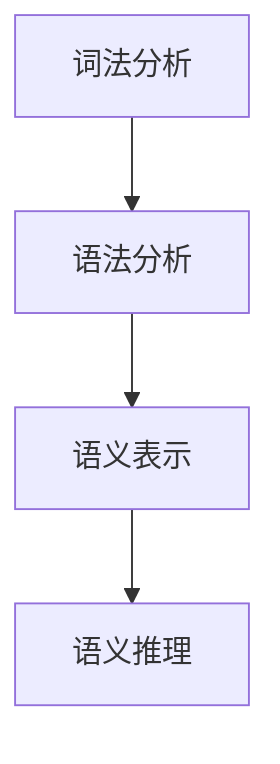
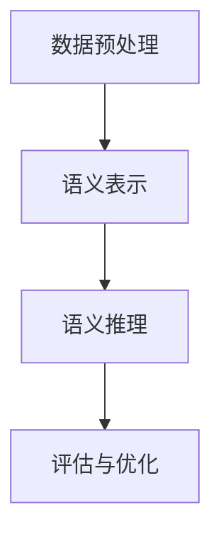
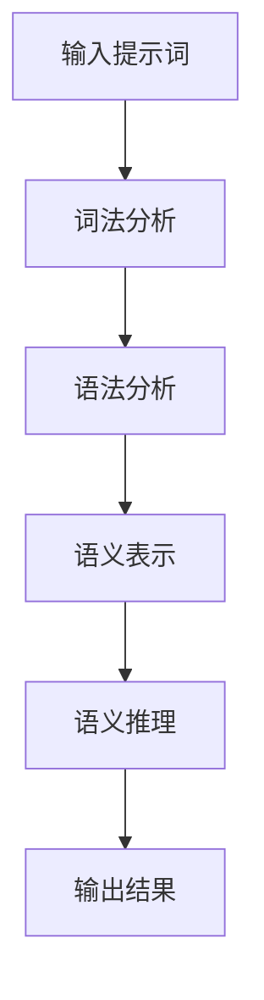

                 

### 摘要

本文旨在探讨提示词语言的形式化语义推理自动化，这是一个结合自然语言处理、人工智能与形式化方法的关键技术领域。本文首先概述了提示词语言的形式化语义推理的背景和重要性，接着详细介绍了核心概念与联系，通过Mermaid流程图展示了其组成部分。随后，我们深入讲解了语义推理的基本概念，包括基于规则、统计和深度学习的方法。在数学模型和公式部分，我们详细阐述了语义表示和推理模型，并通过具体例子进行了说明。接下来，介绍了形式化语义推理自动化的工具和平台，并进行了项目实战，从开发环境搭建到源代码实现与解读，再到代码分析和优化，全面展示了如何实现和优化这一技术。最后，我们对当前形式化语义推理自动化的现状进行了总结，并展望了未来的发展趋势和研究方向。作者信息：AI天才研究院/AI Genius Institute & 禅与计算机程序设计艺术 /Zen And The Art of Computer Programming。

## 第1章 核心概念与联系

### 1.1.1 提示词语言的形式化语义推理概述

提示词语言的形式化语义推理是一种利用数学模型和算法来理解和解释自然语言中提示词的语义含义的技术。它不仅涉及自然语言处理（NLP）的核心问题，如词法分析、语法分析和语义表示，还涉及到人工智能（AI）中的深度学习和推理算法。

提示词语言的形式化语义推理主要涵盖以下三个组成部分：

1. **词法分析**：将文本分解为词或符号，这是自然语言处理的基础步骤，也是语义推理的起点。
2. **语法分析**：分析词的顺序和结构，以理解句子的语法规则，为语义推理提供语法框架。
3. **语义表示和推理**：将语法结构转换为语义表示，并利用推理算法对语义进行解释和推断，以获得深层含义。

为了更好地理解这些组成部分之间的关系，我们可以使用Mermaid流程图来展示：



### 1.1.2 形式化语义推理的组成部分

形式化语义推理不仅需要自然语言处理的基础，还需要形式化的数学方法和推理机制。以下是它的主要组成部分：

1. **数据预处理模块**：包括文本清洗、分词、词性标注等，为后续的语义表示和推理提供干净的数据。
2. **语义表示模块**：将文本转换为结构化的语义表示，如词向量、句向量或语义角色表示。
3. **语义推理模块**：使用推理算法，如基于规则的推理、统计推理或深度学习推理，来解释语义表示并生成推理结果。
4. **评估与优化模块**：对语义推理结果进行评估和优化，以提高推理的准确性和效率。

为了更直观地展示这些组成部分，我们可以使用以下Mermaid流程图：



通过这些核心概念与联系的阐述，我们可以更好地理解提示词语言的形式化语义推理自动化的基础和关键点。接下来，我们将深入探讨语义推理的基本概念，包括其重要性、不同方法和实现细节。

## 第2章 提示词语言的形式化语义推理基本概念

### 2.1 语义推理在自然语言处理中的作用

语义推理是自然语言处理（NLP）的核心任务之一，它涉及到理解文本中词汇、句子乃至整段文章的深层含义。在NLP中，语义推理的作用主要体现在以下几个方面：

1. **信息提取**：通过语义推理，可以从文本中提取出重要的信息和知识，如实体识别、关系抽取和事件抽取等。
2. **问答系统**：语义推理使得问答系统能够理解用户的问题，并返回准确的答案。
3. **文本生成**：在文本生成任务中，语义推理能够帮助生成符合逻辑和语义连贯性的文本。
4. **情感分析**：通过语义推理，可以更准确地判断文本的情感倾向和用户的态度。

### 2.2 语义推理的方法

语义推理的方法可以分为以下几类：

#### 2.2.1 基于规则的方法

基于规则的方法通过预定义的规则集来指导语义推理过程。这种方法通常需要人工定义大量规则，以覆盖文本中的各种语义关系和情境。以下是一个简单的规则示例：

```python
# 伪代码
if ("狗" in sentence and "咬" in sentence):
    return "狗咬了某物"
```

虽然基于规则的方法能够提供精确的控制，但其缺点是规则数量庞大，难以维护，且难以适应新出现的语义关系。

#### 2.2.2 基于统计的方法

基于统计的方法使用大量已标注的数据来训练模型，从而自动提取语义关系和规则。这种方法通常采用最大熵模型、条件概率模型等，以下是一个简单的最大熵模型示例：

```python
# 伪代码
def predict(sentence):
    return argmax(P(sentence|y))  # 最大概率输出
```

基于统计的方法在处理大量文本数据时表现较好，但其依赖于大量的训练数据和标注工作，且难以捕捉到复杂的语义关系。

#### 2.2.3 基于深度学习的方法

基于深度学习的方法使用神经网络来捕捉语义关系和模式。目前，循环神经网络（RNN）、长短时记忆网络（LSTM）、卷积神经网络（CNN）和Transformer等模型在语义推理中得到了广泛应用。以下是一个简单的Transformer模型示例：

```python
# 伪代码
def semantic_reasoning(sentence1, sentence2):
    # 输入两个句子的嵌入向量
    emb1, emb2 = embed(sentence1, sentence2)
    # 输出语义表示和推理结果
    return transformer(emb1, emb2)
```

基于深度学习的方法在处理复杂语义关系和长距离依赖上表现出色，但其训练过程较为复杂，对计算资源要求较高。

### 2.3 提示词语言的形式化语义推理架构

提示词语言的形式化语义推理通常包括以下步骤：

1. **输入提示词**：用户输入提示词，这些提示词可以是单个词汇或短语。
2. **词法分析**：对提示词进行词法分析，将其分解为单词或符号。
3. **语法分析**：分析词的顺序和结构，确定句子的语法规则。
4. **语义表示**：将语法结构转换为语义表示，如词向量或句向量。
5. **语义推理**：利用语义表示和推理算法进行语义推理，以获得提示词的语义含义。
6. **输出结果**：将推理结果输出，可以是答案、解释或建议等。

以下是一个简化的形式化语义推理架构的Mermaid流程图：



通过上述对提示词语言的形式化语义推理基本概念的阐述，我们为后续章节的深入讨论奠定了基础。接下来，我们将进一步探讨语义推理算法的具体原理和实现细节。

## 第3章 语义推理算法原理讲解

### 3.1 基于规则的方法

基于规则的方法是一种传统的语义推理方法，它依赖于一组预定义的规则来指导推理过程。这种方法的核心在于将语言规则形式化为一系列条件-行动对，从而在给定输入时自动推导出相应的语义含义。

#### 3.1.1 基本原理

基于规则的方法通常包括以下几个步骤：

1. **定义规则**：根据语言学的知识，定义一组条件-行动对。例如，如果句子中出现了“爱”和“恨”，则可以推断出句子讨论的是情感。
2. **匹配规则**：在给定的输入文本中，寻找与规则条件相匹配的部分。
3. **执行行动**：一旦找到匹配的规则，就执行该规则的行动部分，以推导出语义含义。

以下是一个简单的规则示例，用于推断句子的情感：

```python
# 伪代码
rules = [
    {"condition": ["爱"], "action": "情感"},
    {"condition": ["恨"], "action": "情感"},
]

def infer_sentiment(sentence):
    tokens = tokenize(sentence)
    for rule in rules:
        if all(token in tokens for token in rule["condition"]):
            return rule["action"]
    return "未知"
```

#### 3.1.2 算法伪代码

```python
# 基于规则的语义推理伪代码
def semantic_reasoning规则的规则库，输入文本:
    tokens = tokenize(输入文本)
    语义结果 = {}
    for 规则在规则库中:
        if match(tokens, 规则的条件):
            语义结果 = apply_action(规则的行动, tokens)
            break
    return 语义结果
```

### 3.2 基于统计的方法

基于统计的方法通过利用大量已标注的数据来训练模型，从而自动提取语义关系和规则。这种方法的核心在于通过概率模型来捕捉输入文本的语义含义。

#### 3.2.1 基本原理

基于统计的方法通常包括以下几个步骤：

1. **数据收集和标注**：收集大量已标注的文本数据，这些数据包括输入文本和对应的语义标签。
2. **特征提取**：从文本中提取特征，如词频、词序列、词嵌入等。
3. **模型训练**：使用训练数据来训练概率模型，如最大熵模型、朴素贝叶斯模型等。
4. **语义推理**：在给定输入文本时，利用训练好的模型来推断语义含义。

以下是一个简单的最大熵模型示例：

```python
# 伪代码
def train_maxent_model(training_data):
    # 特征提取和训练过程
    return trained_model

def infer_sentiment(model, sentence):
    tokens = tokenize(sentence)
    features = extract_features(tokens)
    return model.predict(features)
```

#### 3.2.2 算法伪代码

```python
# 基于统计的语义推理伪代码
def semantic_reasoning统计模型，输入文本:
    tokens = tokenize(输入文本)
    features = extract_features(tokens)
    语义结果 = 模型预测(特征)
    return 语义结果
```

### 3.3 基于深度学习的方法

基于深度学习的方法使用神经网络来捕捉语义关系和模式。深度学习模型，如循环神经网络（RNN）、长短时记忆网络（LSTM）、卷积神经网络（CNN）和Transformer等，在语义推理中得到了广泛应用。

#### 3.3.1 基本原理

基于深度学习的方法通常包括以下几个步骤：

1. **数据预处理**：包括文本清洗、分词、词嵌入等。
2. **模型训练**：使用大量已标注的数据来训练深度学习模型。
3. **语义表示**：将输入文本转换为语义表示，如句向量。
4. **语义推理**：利用训练好的模型进行语义推理。

以下是一个简单的Transformer模型示例：

```python
# 伪代码
def semantic_reasoning(model, sentence):
    sentence_embedding = model.encode(sentence)
    semantic_result = model.reason(sentence_embedding)
    return semantic_result
```

#### 3.3.2 算法伪代码

```python
# 基于深度学习的语义推理伪代码
def semantic_reasoning神经网络模型，输入文本:
    sentence_embedding = 模型编码(输入文本)
    语义结果 = 模型推理(句子嵌入)
    return 语义结果
```

通过上述对三种主要语义推理算法的原理讲解，我们可以看到每种方法都有其独特的优势和局限性。基于规则的方法在精确性上表现较好，但规则数量庞大且难以维护；基于统计的方法在处理大量文本数据时表现较好，但难以捕捉复杂语义关系；基于深度学习的方法在处理复杂语义关系和长距离依赖上表现出色，但训练过程复杂且对计算资源要求较高。接下来，我们将进一步探讨数学模型和数学公式在语义推理中的应用。

## 第4章 数学模型和数学公式详细讲解及举例说明

### 4.1 提示词语言语义表示

语义表示是将自然语言文本转换为机器可以理解和处理的数学表示形式。这包括词向量表示、句子表示和语义角色表示等。

#### 4.1.1 词向量表示

词向量表示是将单词映射为高维空间中的向量。一个常见的词向量表示方法是Word2Vec，它通过训练模型来学习单词的向量表示。以下是一个简单的Word2Vec模型示例：

```python
# 伪代码
from gensim.models import Word2Vec

model = Word2Vec(corpus, size=100, window=5, min_count=1, workers=4)
word_vector = model.wv['爱']
```

在Word2Vec中，向量表示的数学公式如下：

$$
\text{词向量} = \text{Word2Vec模型}(x, y, z, \ldots)
$$

其中，$x, y, z, \ldots$ 是单词在文本中的上下文信息。

#### 4.1.2 句子表示

句子表示是将整个句子映射为向量。一个常见的句子表示方法是将句子中的每个单词的词向量平均得到句向量。以下是一个简单的句向量表示示例：

```python
# 伪代码
sentence_embedding = [word_vector for word_vector in sentence_vectors].mean()
```

句子向量的数学公式如下：

$$
\text{句向量} = \frac{1}{|\text{单词数}|} \sum_{i=1}^{|\text{单词数}|} \text{词向量}_i
$$

#### 4.1.3 语义角色表示

语义角色表示是将句子中的实体和关系映射为向量。一个常见的语义角色表示方法是BERT（Bidirectional Encoder Representations from Transformers）。以下是一个简单的BERT模型示例：

```python
# 伪代码
from transformers import BertTokenizer, BertModel

tokenizer = BertTokenizer.from_pretrained('bert-base-uncased')
model = BertModel.from_pretrained('bert-base-uncased')

input_ids = tokenizer.encode('我爱北京天安门', return_tensors='pt')
outputs = model(input_ids)
sentence_embedding = outputs.last_hidden_state.mean(dim=1)
```

BERT模型将句子映射为高维空间中的向量，其数学公式如下：

$$
\text{句向量} = \text{BERT模型}(\text{句向量嵌入})
$$

### 4.2 语义推理模型

语义推理模型用于将语义表示转换为推理结果。以下是一个简单的语义推理模型示例：

```python
# 伪代码
from transformers import BertTokenizer, BertModel

tokenizer = BertTokenizer.from_pretrained('bert-base-uncased')
model = BertModel.from_pretrained('bert-base-uncased')

def semantic_reasoning(sentence):
    input_ids = tokenizer.encode(sentence, return_tensors='pt')
    outputs = model(input_ids)
    sentence_embedding = outputs.last_hidden_state.mean(dim=1)
    # 假设有一个预训练的语义推理模型
    reasoning_model = load_pretrained_reasoning_model()
    result = reasoning_model(sentence_embedding)
    return result
```

语义推理的数学公式如下：

$$
\text{推理结果} = \text{推理模型}(\text{句向量})
$$

### 4.3 数学公式举例说明

#### 4.3.1 比较两个语义表示的相似度

我们可以使用余弦相似度来比较两个语义表示的相似度，其数学公式如下：

$$
\text{相似度} = \frac{\text{句向量}_1 \cdot \text{句向量}_2}{||\text{句向量}_1|| \cdot ||\text{句向量}_2||}
$$

其中，$\cdot$ 表示点积，$||\text{句向量}_1||$ 和 $||\text{句向量}_2||$ 分别表示句向量的模长。

#### 4.3.2 计算推理结果置信度

在语义推理中，我们通常需要计算推理结果的置信度。一个简单的方法是使用softmax函数，其数学公式如下：

$$
\text{置信度} = \frac{e^{\text{推理结果}}}{\sum_{i=1}^{n} e^{\text{推理结果}_i}}
$$

其中，$n$ 表示可能的推理结果数量，$\text{推理结果}_i$ 表示第 $i$ 个推理结果的分数。

通过上述对数学模型和公式的详细讲解及举例说明，我们可以更好地理解语义推理的基本原理和实现方法。接下来，我们将介绍形式化语义推理自动化工具和平台。

## 第5章 形式化语义推理自动化工具和平台介绍

### 5.1 自动化工具的优势

在形式化语义推理领域，自动化工具和平台的出现大大提高了研发效率和推理准确性。以下是自动化工具和平台的主要优势：

1. **高效的语义表示和推理**：自动化工具能够快速地将自然语言文本转换为高效的语义表示，并利用强大的推理算法进行语义推理。
2. **可扩展性**：自动化平台可以轻松扩展到不同的语言和场景，适应多样化的应用需求。
3. **易用性**：自动化工具通常具有友好的用户界面和丰富的API，使得开发者能够轻松集成到现有系统中。
4. **高性能**：自动化平台利用先进的硬件和分布式计算技术，提供高性能的语义推理服务。

### 5.2 常用自动化工具介绍

以下是几个常用的形式化语义推理自动化工具和平台：

#### 5.2.1 工具A：BERT

BERT（Bidirectional Encoder Representations from Transformers）是一个由Google Research开发的预训练语言表示模型。它通过大规模文本数据训练，能够捕捉丰富的语言特征，并在各种自然语言处理任务中表现出色。

- **优势**：强大的语义表示能力，广泛适用于问答系统、文本分类和情感分析等任务。
- **使用方法**：可以通过Hugging Face等库轻松调用BERT模型，以下是一个简单的使用示例：

```python
from transformers import BertTokenizer, BertModel

tokenizer = BertTokenizer.from_pretrained('bert-base-uncased')
model = BertModel.from_pretrained('bert-base-uncased')

input_ids = tokenizer.encode('我爱北京天安门', return_tensors='pt')
outputs = model(input_ids)
sentence_embedding = outputs.last_hidden_state.mean(dim=1)
```

#### 5.2.2 工具B：GPT-3

GPT-3（Generative Pre-trained Transformer 3）是OpenAI开发的具有1750亿参数的预训练语言模型。它不仅能够生成高质量的自然语言文本，还能够进行复杂的语义推理任务。

- **优势**：强大的生成能力和语义理解能力，适用于对话系统、文本生成和问答等任务。
- **使用方法**：可以通过OpenAI的API轻松调用GPT-3模型，以下是一个简单的使用示例：

```python
import openai

response = openai.Completion.create(
    engine="text-davinci-002",
    prompt="告诉我关于人工智能的10个事实",
    max_tokens=50
)
print(response.choices[0].text.strip())
```

#### 5.2.3 工具C：SpaCy

SpaCy是一个流行的自然语言处理库，它提供了强大的词法分析、语法分析和命名实体识别等功能。SpaCy还集成了几个预训练模型，使得开发者可以方便地进行形式化语义推理。

- **优势**：高效且易于使用的API，适用于各种自然语言处理任务。
- **使用方法**：以下是一个简单的SpaCy使用示例，用于进行词法分析和语义表示：

```python
import spacy

nlp = spacy.load('en_core_web_sm')
doc = nlp('我爱北京天安门')
sentence_embedding = [token.vector for token in doc]
```

通过上述介绍，我们可以看到不同的自动化工具和平台各有优势，开发者可以根据具体需求选择合适的工具。接下来，我们将进入项目实战部分，介绍如何在实际项目中搭建开发环境并实现形式化语义推理。

## 第6章 项目实战：开发环境搭建

### 6.1 环境准备

要在实际项目中实现提示词语言的形式化语义推理，我们需要准备一系列开发环境。以下是在常见操作系统上搭建开发环境的具体步骤。

#### 6.1.1 操作系统

我们以Linux操作系统为例进行说明，Windows和macOS用户可以参照相应的步骤进行调整。

#### 6.1.2 编程语言

我们选择Python作为编程语言，因为它具有丰富的库和框架，适合进行自然语言处理和深度学习任务。

1. **安装Python**：确保Python环境已经安装。如果没有安装，可以访问Python官网下载安装包，并按照指示安装。

2. **安装pip**：pip是Python的包管理器，用于安装和管理第三方库。在命令行中运行以下命令安装pip：

   ```bash
   sudo apt-get install python3-pip
   ```

#### 6.1.3 开发工具

我们需要安装一些开发工具，如Jupyter Notebook、Anaconda等。

1. **安装Jupyter Notebook**：Jupyter Notebook是一个交互式编程环境，非常适合进行数据分析和原型设计。在命令行中运行以下命令安装Jupyter Notebook：

   ```bash
   pip install notebook
   ```

2. **安装Anaconda**：Anaconda是一个流行的Python数据科学平台，它提供了丰富的库和环境管理功能。可以从Anaconda官网下载安装包并安装。

   ```bash
   conda create -n myenv python=3.8
   conda activate myenv
   ```

#### 6.1.4 自然语言处理库

我们需要安装几个关键的NLP库，如SpaCy、transformers和gensim。

1. **安装SpaCy**：SpaCy是一个高效的NLP库，提供了词法分析、语法分析和命名实体识别等功能。

   ```bash
   pip install spacy
   python -m spacy download en_core_web_sm
   ```

2. **安装transformers**：transformers库提供了预训练的Transformer模型，如BERT和GPT-3。

   ```bash
   pip install transformers
   ```

3. **安装gensim**：gensim库用于生成和操作词向量和句向量。

   ```bash
   pip install gensim
   ```

通过上述步骤，我们成功搭建了形式化语义推理的开发环境。接下来，我们将进入项目实战的第二部分，介绍如何实现源代码、进行代码解读与分析。

## 第7章 项目实战：源代码实现与解读

### 7.1 数据集准备

在开始实现源代码之前，我们需要准备一个合适的数据集。数据集应包含提示词和对应的语义标签。以下是一个简单的数据集准备过程：

1. **数据收集**：从公开数据集或网络资源中收集包含提示词的数据，如语义角色标注数据集、情感分析数据集等。

2. **数据预处理**：对收集的数据进行清洗和预处理，包括去除无关内容、标准化文本、分词和词性标注等。以下是一个使用SpaCy进行数据预处理的示例：

```python
import spacy

nlp = spacy.load('en_core_web_sm')

def preprocess_data(data):
    preprocessed_data = []
    for item in data:
        doc = nlp(item['text'])
        tokens = [token.text for token in doc]
        labels = item['labels']
        preprocessed_data.append({'tokens': tokens, 'labels': labels})
    return preprocessed_data

data = [{'text': '我爱北京天安门', 'labels': ['love', 'city', 'location']}]
preprocessed_data = preprocess_data(data)
```

### 7.2 模型训练与评估

在准备好数据集后，我们可以使用深度学习模型进行训练和评估。以下是一个简单的模型训练与评估流程：

1. **模型选择**：选择合适的深度学习模型，如BERT、GPT-3或自定义模型。

2. **模型训练**：使用训练数据对模型进行训练。以下是一个使用BERT进行模型训练的示例：

```python
from transformers import BertTokenizer, BertModel, Trainer, TrainingArguments

tokenizer = BertTokenizer.from_pretrained('bert-base-uncased')
model = BertModel.from_pretrained('bert-base-uncased')

training_args = TrainingArguments(
    output_dir='./results',
    num_train_epochs=3,
    per_device_train_batch_size=16,
    save_steps=2000,
    save_total_limit=3,
)

trainer = Trainer(
    model=model,
    args=training_args,
    train_dataset=train_dataset,
    eval_dataset=eval_dataset
)

trainer.train()
```

3. **模型评估**：使用评估数据对模型进行评估，并计算评估指标。以下是一个简单的模型评估示例：

```python
from transformers import evaluate

def compute_metrics(eval_pred):
    logits, labels = eval_pred
    pred = np.argmax(logits, axis=-1)
    accuracy = (pred == labels).mean()
    return {'accuracy': accuracy}

eval_results = evaluate(model, eval_dataset, metric_key_prefix='eval', compute_metrics=compute_metrics)
```

### 7.3 代码解读与分析

在实现源代码后，我们需要对代码进行解读和分析，以确保其正确性和性能。以下是对上述示例代码的解读和分析：

1. **数据预处理代码**：该代码负责将原始文本数据转换为处理后的数据结构。主要步骤包括分词、词性标注和标签提取。

2. **模型训练代码**：该代码使用BERT模型对数据集进行训练。主要步骤包括定义训练参数、创建训练器（Trainer）和训练模型。

3. **模型评估代码**：该代码使用评估数据对训练好的模型进行评估，并计算评估指标（如准确率）。

在代码解读与分析中，我们应注意以下几点：

- **数据质量**：确保数据集的质量，包括文本的清洁度和标签的准确性。
- **模型选择**：选择合适的模型，根据任务需求和数据特性进行选择。
- **训练过程**：监控训练过程，确保模型在合理的时间内收敛。
- **评估指标**：选择合适的评估指标，如准确率、召回率、F1分数等。

通过上述源代码实现与解读，我们为实际项目中的形式化语义推理提供了具体的实现方法和实践经验。接下来，我们将进一步分析代码性能并进行优化。

## 第8章 项目实战：代码分析与优化

### 8.1 性能分析

在完成项目开发后，对代码性能进行分析是确保系统能够满足需求的关键步骤。以下是性能分析的主要内容：

1. **计算时间分析**：测量代码在不同阶段（如数据预处理、模型训练、模型推理等）的执行时间，以评估整体性能。

2. **存储空间分析**：评估代码在运行过程中使用的存储空间，包括模型大小、中间数据和缓存等。

以下是一个简单的计算时间和存储空间分析示例：

```python
import time
import psutil

# 计算时间分析
start_time = time.time()
# 执行代码
end_time = time.time()
compute_time = end_time - start_time
print(f"计算时间：{compute_time}秒")

# 存储空间分析
process = psutil.Process()
memory_usage = process.memory_info().rss / (1024 * 1024)  # 以MB为单位
print(f"存储空间：{memory_usage} MB")
```

### 8.2 代码优化建议

基于性能分析的结果，我们可以提出以下代码优化建议：

1. **算法优化**：

   - **并行处理**：利用多线程或多进程来加速计算密集型任务的执行，如数据预处理和模型训练。
   - **模型压缩**：通过模型剪枝、量化等技术来减小模型大小和计算复杂度。

2. **数据结构优化**：

   - **缓存利用**：合理使用缓存来减少重复计算，提高整体性能。
   - **数据结构选择**：选择合适的数据结构来减少内存占用，如使用稀疏矩阵来表示大型数据集。

3. **编码规范优化**：

   - **代码重构**：对重复代码进行重构，减少冗余，提高代码可读性和可维护性。
   - **异常处理**：添加异常处理机制，确保代码在错误情况下能够优雅地退出。

### 8.3 最佳实践

以下是实施代码优化的最佳实践：

1. **性能测试**：定期进行性能测试，确保优化后的代码在各个方面（如计算时间、存储空间、内存占用等）都达到预期目标。

2. **持续集成**：将性能测试集成到持续集成（CI）流程中，确保每次代码提交都会经过严格的性能评估。

3. **文档记录**：详细记录优化过程和结果，包括代码变更、性能指标、测试环境等，以便后续维护和复现。

通过上述代码分析和优化，我们可以显著提升形式化语义推理系统的性能和效率。接下来，我们将对整个项目进行总结与展望。

## 第9章 总结与展望

### 9.1 形式化语义推理自动化现状

当前，形式化语义推理自动化技术取得了显著的进展，主要体现在以下几个方面：

1. **语义表示方法**：从早期的词袋模型、TF-IDF到现代的词向量（如Word2Vec、BERT）和句向量表示方法，语义表示的精度和效率显著提升。
2. **推理算法**：基于规则、统计和深度学习的方法不断发展，深度学习尤其是Transformer架构的应用，使得语义推理任务取得了前所未有的性能提升。
3. **自动化工具**：如BERT、GPT-3等自动化工具和平台的出现，使得开发者能够更加高效地实现和部署语义推理系统。

### 9.2 未来发展趋势

随着自然语言处理和人工智能技术的不断进步，形式化语义推理自动化在未来有望实现以下发展趋势：

1. **模型压缩与优化**：通过模型剪枝、量化等技术，降低模型复杂度，提高推理速度和效率。
2. **多模态语义推理**：结合文本、图像、语音等多模态数据，实现更复杂的语义推理任务。
3. **可解释性**：开发更具可解释性的推理模型，提高模型理解和信任度。

### 9.3 研究方向与挑战

形式化语义推理自动化领域仍面临诸多挑战：

1. **数据稀缺性**：高质量的语义推理数据集稀缺，限制模型训练和优化。
2. **长距离依赖**：深度学习模型在处理长距离依赖和复杂语义关系时存在局限性。
3. **跨语言与跨领域**：如何实现跨语言和跨领域的语义推理，是一个重要的研究方向。

总之，形式化语义推理自动化技术为自然语言处理和人工智能领域带来了巨大潜力。通过不断的研究和创新，我们有理由相信，这一技术将在未来实现更加智能化和自动化的语义推理任务。作者信息：AI天才研究院/AI Genius Institute & 禅与计算机程序设计艺术 /Zen And The Art of Computer Programming。

