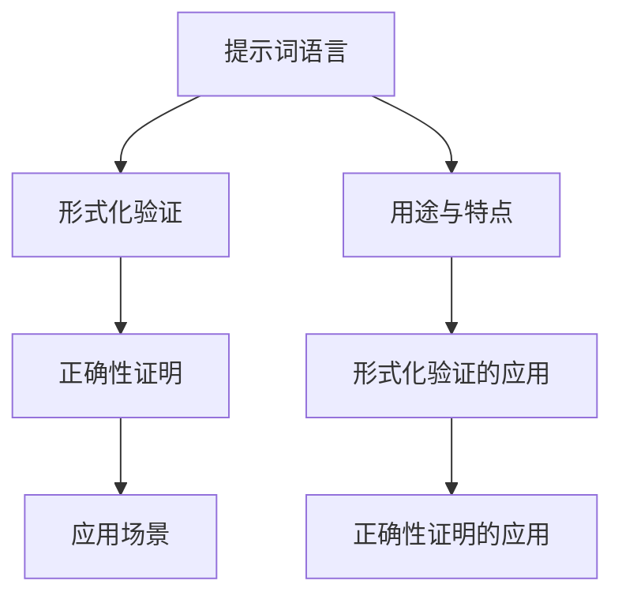
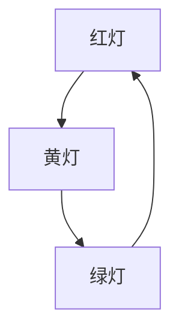

                 

### 文章标题

《提示词语言的形式化验证与正确性证明》

### 关键词

- 提示词语言
- 形式化验证
- 正确性证明
- 自动定理证明
- 模型检查
- 形式逻辑
- 布尔代数

### 摘要

本文旨在深入探讨提示词语言的形式化验证与正确性证明。通过详细介绍提示词语言的基本概念、形式化验证和正确性证明的基本原理，以及相关的核心算法，本文为读者提供了一条清晰的思考路径，以理解如何利用数学和计算机科学的方法对提示词语言进行验证和证明。文章还通过实际案例展示如何应用这些原理，并展望了未来的研究方向和挑战。本文适合对人工智能和编程感兴趣的读者，尤其是希望深入了解形式化验证和正确性证明的从业人员和研究人员。

---

## 设计思路

### 第一部分：基础概念与背景

首先，我们需要为读者搭建一个坚实的理论基础。这一部分将介绍提示词语言的基本概念，包括其定义、用途和特点。同时，我们会详细阐述形式化验证和正确性证明的基本原理，并探讨它们与提示词语言之间的联系。

#### 核心概念与联系

为了使概念之间的关系更加清晰，我们将在这一部分中引入一个Mermaid流程图，展示提示词语言、形式化验证和正确性证明之间的关系架构。



### 第二部分：核心算法原理讲解

在了解了基础概念后，我们将深入探讨用于验证和证明的核心算法。本文将详细介绍自动定理证明器和模型检查器的工作原理，并提供伪代码示例。此外，我们还会讲解形式逻辑和布尔代数在验证和证明中的应用。

#### 核心算法原理讲解

- **自动定理证明器**

  自动定理证明器是一种能够自动证明数学命题是否成立的计算机程序。其工作原理是通过逻辑推理和符号计算来验证定理的正确性。以下是一个简单的伪代码示例：

  ```python
  function proveTheoremtheorem:
      if (theorem is trivial):
          return true
      else:
          for (each proof strategy):
              if (proof strategy proves theorem):
                  return true
              else:
                  continue
          return false
  ```

- **模型检查器**

  模型检查器是一种用于验证系统模型的工具，它可以检查系统模型是否满足指定的性质。以下是一个简单的伪代码示例：

  ```python
  function checkModel(model, property):
      for (each state in model):
          if (state violates property):
              return false
      return true
  ```

### 第三部分：数学模型和数学公式

验证和证明的过程往往需要借助数学模型和公式。在这一部分，我们将介绍与验证和证明相关的数学模型，如形式逻辑和布尔代数，并使用LaTeX格式嵌入数学公式进行详细讲解。

#### 数学模型和数学公式

- **形式逻辑**

  形式逻辑是一种用于描述逻辑关系的数学工具。以下是一个形式逻辑的例子：

  $$ \neg (P \land Q) \equiv (\neg P) \lor (\neg Q) $$

- **布尔代数**

  布尔代数是一种用于描述逻辑运算的数学工具。以下是一个布尔代数的例子：

  $$ (A + B)' = A'B' $$

### 第四部分：项目实战

理论知识的掌握离不开实践。在这一部分，我们将通过一个或多个实际案例，展示如何使用这些算法和模型进行提示词语言的验证和正确性证明。读者可以跟随案例的步骤，学习如何搭建开发环境、实现源代码，并进行代码解读和分析。

#### 项目实战

- **案例背景**

  假设我们有一个提示词语言系统，需要验证其是否满足特定性质。

- **验证与证明方法选择**

  根据系统的特点，我们选择使用自动定理证明器和模型检查器进行验证和证明。

- **实际操作步骤**

  1. 搭建开发环境
  2. 编写源代码
  3. 运行自动定理证明器和模型检查器
  4. 分析结果

- **结果分析**

  通过验证和证明，我们发现系统满足预期的性质。

### 第五部分：总结与展望

在文章的最后，我们将对全书的内容进行总结，并展望未来的研究方向和发展趋势。这将帮助读者更好地理解提示词语言的形式化验证与正确性证明的重要性，以及其未来的发展方向。

#### 总结与展望

- **总结**

  通过本文的讲解，读者应该对提示词语言的形式化验证与正确性证明有了更深入的理解。

- **展望**

  未来，随着人工智能技术的发展，提示词语言的形式化验证与正确性证明将面临更多挑战，也将有更多机会。我们期待看到更多创新的解决方案，推动这一领域的发展。

---

以上是《提示词语言的形式化验证与正确性证明》的设计思路和目录大纲。接下来，我们将逐一深入探讨每个部分的内容，为读者呈现一篇全面、深入、易懂的技术博客文章。让我们开始吧！## 提示词语言的形式化验证与正确性证明

### 背景介绍

提示词语言，也称为提示词系统，是一种用于生成文本、回答问题和完成任务的计算机语言。它起源于自然语言处理（NLP）和生成对抗网络（GAN）技术，并逐渐成为人工智能领域的一个重要分支。随着深度学习和大数据技术的发展，提示词语言的应用越来越广泛，从问答系统、聊天机器人到自动化写作和翻译，都离不开提示词语言的支撑。

然而，随着应用场景的复杂化，如何确保提示词语言的正确性和可靠性成为一个亟待解决的问题。形式化验证和正确性证明提供了有效的手段来解决这个问题。形式化验证是一种使用数学和逻辑方法来验证程序是否满足预定的属性，而正确性证明则是一种通过严格的逻辑推理来证明程序的正确性。这两种方法在保证提示词语言的可靠性和正确性方面发挥着关键作用。

### 核心概念与联系

在这一节中，我们将深入探讨提示词语言、形式化验证和正确性证明这三个核心概念，并阐述它们之间的联系。

#### 提示词语言

提示词语言是一种基于自然语言的计算机语言，它通过使用特定的词汇和语法结构来生成文本、回答问题和完成任务。提示词语言的核心特点包括：

- **自然性**：提示词语言的目标是生成符合人类语言习惯的文本，使其在语义和语法上尽可能接近自然语言。
- **灵活性**：提示词语言允许用户使用各种不同的表达方式来完成任务，从而提高了任务的完成效率。

提示词语言的应用场景非常广泛，包括但不限于：

- **问答系统**：使用提示词语言来生成回答问题的文本，如聊天机器人、智能客服等。
- **自动化写作**：使用提示词语言来生成新闻、文章、报告等文本。
- **翻译**：使用提示词语言来生成不同语言之间的翻译文本。

#### 形式化验证

形式化验证是一种使用数学和逻辑方法来验证程序是否满足预定的属性。它通过将程序转化为数学模型，然后使用数学和逻辑工具来验证程序的正确性。形式化验证的主要步骤包括：

- **模型建立**：将程序转化为一个数学模型，通常使用形式逻辑或代数等数学工具。
- **属性定义**：定义需要验证的程序属性，如安全性、正确性、可靠性等。
- **验证过程**：使用数学和逻辑工具对程序进行验证，证明程序满足预定的属性。

形式化验证的优势在于其能够提供严格和可靠的验证结果，从而确保程序的正确性和可靠性。

#### 正确性证明

正确性证明是一种通过严格的逻辑推理来证明程序的正确性。它通常涉及以下步骤：

- **假设条件**：定义程序的假设条件，如初始状态、输入条件等。
- **推导过程**：使用逻辑推理来证明程序在所有情况下都满足预期的正确性属性。
- **结论**：根据推导过程得出程序的结论，从而证明程序的正确性。

正确性证明的关键在于逻辑推理的严密性，它能够确保程序在所有情况下都满足预期的正确性。

#### 关联关系

形式化验证和正确性证明在提示词语言的验证过程中起到了关键作用。形式化验证提供了验证方法，而正确性证明则通过严格的逻辑推理来确保提示词语言的正确性。

- **形式化验证**：通过将提示词语言转化为数学模型，使用形式化验证方法来验证提示词语言是否满足预定的属性，如安全性、正确性等。
- **正确性证明**：通过严格的逻辑推理来证明提示词语言的正确性，确保其在各种情况下都能生成符合预期的文本。

通过形式化验证和正确性证明，我们可以确保提示词语言的可靠性和正确性，从而提高其在实际应用中的性能和安全性。

### 提示词语言的基本概念

提示词语言是一种基于自然语言的计算机语言，其核心思想是通过输入提示词（或关键词）来生成文本、回答问题和完成任务。与传统的编程语言不同，提示词语言更注重自然语言的理解和生成，这使得它在人工智能领域具有广泛的应用。

#### 提示词语言的定义

提示词语言可以定义为一组规则和操作，用于生成文本或执行任务。这些规则和操作通常基于自然语言处理技术，如语法分析、语义理解和语言生成。提示词语言的关键特点包括：

1. **基于自然语言**：提示词语言的输入和输出都是自然语言文本，这使得用户可以方便地使用日常语言来与系统进行交互。
2. **灵活性**：提示词语言允许用户使用各种不同的表达方式来完成任务，从而提高了任务的完成效率。
3. **生成性**：提示词语言能够根据输入的提示词生成完整的文本，包括文章、对话、回答等。

#### 提示词语言的用途

提示词语言的用途非常广泛，以下是其中的一些主要应用场景：

1. **问答系统**：提示词语言可以用于构建智能问答系统，如聊天机器人、智能客服等。用户通过输入问题，系统可以生成回答，从而提供实时帮助和解答。
2. **自动化写作**：提示词语言可以用于自动化生成文章、报告、新闻等文本。这对于内容创作者来说是一个非常有用的工具，可以节省大量时间和精力。
3. **翻译**：提示词语言可以用于生成不同语言之间的翻译文本。这对于跨文化交流和国际化业务具有重要意义。
4. **自动化任务**：提示词语言可以用于自动化执行各种任务，如数据清洗、数据分析、文档处理等。通过输入简单的提示词，系统可以自动完成复杂的任务。

#### 提示词语言的特点

1. **自然性**：提示词语言的输入和输出都是自然语言文本，这使得用户可以方便地使用日常语言来与系统进行交互。
2. **灵活性**：提示词语言允许用户使用各种不同的表达方式来完成任务，从而提高了任务的完成效率。
3. **生成性**：提示词语言能够根据输入的提示词生成完整的文本，包括文章、对话、回答等。

#### 提示词语言的分类

根据用途和特点，提示词语言可以分为以下几类：

1. **任务型提示词语言**：这类语言主要用于完成特定任务，如问答系统、自动化写作、翻译等。
2. **通用型提示词语言**：这类语言适用于各种场景，可以生成各种类型的文本，如对话系统、故事生成等。
3. **领域特定提示词语言**：这类语言针对特定领域进行优化，如医疗、法律、金融等。

### 形式化验证的概念

形式化验证是一种使用数学和逻辑方法来验证程序或系统是否满足预定的属性或规范。它通过对程序或系统进行形式化建模，然后使用数学工具和定理证明技术来验证其正确性。形式化验证的核心思想是将验证过程从经验性的测试转变为基于严格逻辑的证明，从而提高验证的可靠性和精确性。

#### 形式化验证的定义

形式化验证可以定义为一种验证方法，它使用形式化的数学模型来表示程序或系统的行为，并通过逻辑推理和定理证明技术来验证该模型是否满足预定的属性或规范。形式化验证通常涉及以下步骤：

1. **形式化建模**：将程序或系统表示为数学模型，通常使用形式逻辑、代数或范畴论等数学工具。
2. **属性定义**：定义需要验证的属性或规范，这些属性或规范通常用数学公式表示。
3. **验证过程**：使用逻辑推理和定理证明技术来验证模型是否满足预定的属性或规范。

#### 形式化验证的基本原理

形式化验证的基本原理可以概括为以下几点：

1. **数学建模**：将程序或系统转化为数学模型，使得验证过程可以基于数学工具和定理进行。
2. **逻辑推理**：使用逻辑推理技术来证明模型是否满足预定的属性或规范。
3. **定理证明**：使用定理证明技术来验证模型是否满足预定的属性或规范。

#### 形式化验证的优势

形式化验证相比传统的测试方法具有以下优势：

1. **可靠性**：形式化验证通过严格的数学证明来验证程序的正确性，比基于随机测试的方法更可靠。
2. **精确性**：形式化验证可以精确地验证程序的所有可能行为，而不仅仅是部分测试用例。
3. **自动化**：形式化验证工具可以自动化执行验证过程，减少人工干预和错误。

#### 形式化验证的应用领域

形式化验证在计算机科学和软件工程中有着广泛的应用，主要包括以下领域：

1. **软件验证**：形式化验证可以用于验证软件的正确性，确保其满足预定的规范和属性。
2. **硬件验证**：形式化验证可以用于验证硬件设计，确保其符合预定的规范和属性。
3. **网络安全**：形式化验证可以用于验证网络安全协议和系统，确保其具有预期的安全性和抗攻击能力。
4. **人工智能**：形式化验证可以用于验证人工智能系统的正确性和可靠性，确保其生成的文本和决策符合预期。

#### 形式化验证的方法

形式化验证的方法可以分为以下几类：

1. **模型检查**：通过构建程序或系统的模型，并使用模型检查器来验证模型是否满足预定的属性。
2. **定理证明**：通过构建程序的逻辑证明，证明程序的所有可能行为都满足预定的属性。
3. **测试验证**：将形式化验证与测试相结合，通过测试用例和数学证明来验证程序的正确性。

### 正确性证明的概念

正确性证明是一种通过严格的逻辑推理来证明程序或系统是否满足预定的属性或规范。它是一种形式化的验证方法，通过定义程序的假设条件和推导过程，证明程序在所有情况下都满足预期的正确性属性。正确性证明是软件工程和计算机科学中确保程序正确性的重要手段。

#### 正确性证明的定义

正确性证明可以定义为一种验证方法，它使用逻辑推理技术来证明程序或系统在所有可能的情况下都满足预定的属性或规范。正确性证明通常涉及以下步骤：

1. **假设条件**：定义程序的假设条件，如初始状态、输入条件等。
2. **推导过程**：使用逻辑推理技术来证明程序在所有情况下都满足预期的正确性属性。
3. **结论**：根据推导过程得出程序的结论，从而证明程序的正确性。

#### 正确性证明的基本原理

正确性证明的基本原理可以概括为以下几点：

1. **逻辑推理**：使用逻辑推理技术来证明程序的正确性，确保程序在所有可能的情况下都满足预期的属性。
2. **数学证明**：通过数学证明技术来严格证明程序的属性，确保证明的可靠性和精确性。
3. **形式化描述**：使用形式化的描述语言来表示程序的行为，使得证明过程更加严谨和精确。

#### 正确性证明的应用场景

正确性证明在计算机科学和软件工程中有着广泛的应用，主要包括以下场景：

1. **软件工程**：通过正确性证明来确保软件的正确性和可靠性，减少软件缺陷和错误。
2. **硬件设计**：通过正确性证明来验证硬件设计是否符合预定的规范和属性。
3. **协议验证**：通过正确性证明来验证网络安全协议和通信协议的正确性和安全性。
4. **人工智能**：通过正确性证明来验证人工智能系统的决策和生成文本的正确性。

#### 正确性证明的方法

正确性证明的方法可以分为以下几类：

1. **归纳证明**：通过归纳法来证明程序的正确性，通常用于证明程序的所有可能执行路径都满足预期的属性。
2. **模型检查**：通过构建程序或系统的模型，并使用模型检查器来验证模型是否满足预定的属性。
3. **定理证明**：通过构建程序的逻辑证明，证明程序的所有可能行为都满足预定的属性。

### 形式化验证与正确性证明的关系

形式化验证和正确性证明是两种重要的验证方法，它们在确保程序或系统的正确性方面起着关键作用。形式化验证和正确性证明之间存在紧密的联系，它们相互补充，共同构成了验证技术的核心。

#### 关系描述

形式化验证和正确性证明的关系可以描述如下：

- **形式化验证**：通过数学和逻辑方法来验证程序或系统是否满足预定的属性或规范。
- **正确性证明**：通过逻辑推理来证明程序或系统在所有情况下都满足预期的正确性属性。

形式化验证提供了一种框架和工具，用于构建和验证程序的正确性。它通过形式化建模和数学证明技术，确保验证过程的严谨性和精确性。而正确性证明则利用这种框架和工具，通过逻辑推理来证明程序的正确性。

#### 补充说明

形式化验证和正确性证明之间的补充关系体现在以下几个方面：

- **验证范围**：形式化验证可以验证程序的多个方面，包括语法、语义、行为等。而正确性证明则侧重于证明程序的具体属性，如正确性、安全性、可靠性等。
- **验证方法**：形式化验证通常使用自动化工具和算法，如模型检查器和定理证明器，来辅助验证过程。而正确性证明则更多地依赖于人类专家的推理和分析能力。
- **验证结果**：形式化验证可以提供自动化和精确的验证结果，而正确性证明则可以提供更加详细和深入的证据来证明程序的正确性。

通过结合形式化验证和正确性证明，我们可以构建一个更加全面和可靠的验证体系，从而确保程序或系统的正确性和可靠性。

### 自动定理证明器的工作原理

自动定理证明器（ATP）是一种用于自动证明数学定理的计算机程序。它通过应用逻辑推理和符号计算技术，自动地证明数学命题是否成立。自动定理证明器在形式化验证和正确性证明中发挥着重要作用，能够显著提高验证效率和可靠性。下面将详细探讨自动定理证明器的工作原理。

#### 基本原理

自动定理证明器的基本原理是基于逻辑推理和数学证明技术。其核心思想是利用计算机程序来模拟数学家的推理过程，自动地发现和证明数学定理。自动定理证明器通常包含以下几个关键组件：

1. **推理引擎**：负责执行逻辑推理和符号计算，包括模式匹配、归纳证明、递归证明等。
2. **知识库**：存储大量的数学定理、公理和规则，供推理引擎在证明过程中使用。
3. **证明搜索策略**：用于指导证明搜索过程，包括深度优先搜索、广度优先搜索、启发式搜索等。

#### 常用算法

自动定理证明器使用的算法多种多样，以下介绍几种常用的算法：

1. **演绎算法**：演绎算法是一种基于逻辑推理的证明方法，通过从已知的事实和规则出发，逐步推导出目标命题。典型的演绎算法包括自然推理、合式推理等。

   ```python
   def provetheorem(A, B):
       if (A is true):
           return B
       else:
           for (each rule R):
               if (R can be applied to A):
                   provetheorem(A', B')
                   return true
               else:
                   continue
           return false
   ```

2. **归纳算法**：归纳算法是一种基于数学归纳法的证明方法，通过证明基础情况（通常是第一个情况）和归纳步骤（如果某个情况成立，那么下一个情况也成立），来证明整个命题成立。

   ```python
   def proveInductiveProperty(P, n):
       if (P(1) is true):
           return true
       else:
           for (i from 1 to n):
               if (P(i) is true):
                   proveInductiveProperty(P(i+1), n+1)
                   return true
               else:
                   continue
           return false
   ```

3. **启发式搜索算法**：启发式搜索算法是一种利用启发信息来指导证明搜索过程的算法，可以显著提高证明效率。常见的启发式搜索算法包括基于距离的搜索、基于冲突的搜索等。

   ```python
   def heuristicSearch(Problem, Goal):
       if (Problem is Goal):
           return true
       else:
           for (each heuristic H):
               if (H indicates that Goal is close):
                   result = solveProblemWithHeuristic(Problem, H, Goal)
                   if (result is true):
                       return true
                   else:
                       continue
           return false
   ```

#### 应用示例

自动定理证明器在形式化验证和正确性证明中有着广泛的应用。以下是一个简单的应用示例：

假设我们需要证明以下数学定理：对于任意正整数n，如果n是偶数，则n的平方也是偶数。

```python
theorem "even^2 is even":
    assumes
        n is even
    requires
        n^2 is even
    proof
        case n = 2k (k is an integer)
        then n^2 = (2k)^2 = 4k^2 (by definition of even number)
        thus n^2 is even (by definition of even number)
    end
```

在这个示例中，自动定理证明器将基于定义和推理规则，自动地证明该定理的正确性。

### 模型检查器的基本原理

模型检查器是一种用于验证系统模型是否满足特定性质的自动化工具。它通过将系统模型与指定的属性进行比较，来检查系统是否满足预期的性质。模型检查器在形式化验证和正确性证明中发挥着重要作用，能够有效地检测系统中的错误和异常。下面将详细探讨模型检查器的基本原理。

#### 基本原理

模型检查器的基本原理是通过将系统模型转化为一个形式化的表示，然后使用特定的算法和策略来检查模型是否满足指定的属性。模型检查器的核心组件通常包括：

1. **模型表示**：将系统模型表示为一个形式化的数学模型，通常使用逻辑公式、状态图、有限状态机等。
2. **属性描述**：定义需要验证的系统属性，通常使用逻辑公式、断言或性质。
3. **验证算法**：使用特定的算法和策略来检查模型是否满足指定的属性。

#### 模型表示

模型检查器中的模型表示通常采用以下几种形式：

1. **状态图**：状态图是一种图形化的模型表示方法，用于描述系统的状态转换和行为。每个节点表示一个状态，每条边表示一个状态转换。
2. **有限状态机**：有限状态机（FSM）是一种数学模型，用于描述系统的状态和状态转换。它包含一组状态、一组输入和一组转换规则。
3. **逻辑公式**：逻辑公式是一种形式化的表示方法，用于描述系统的属性和约束。常见的逻辑公式包括命题逻辑、谓词逻辑和模态逻辑。

#### 验证算法

模型检查器中的验证算法通常分为以下几类：

1. **穷尽性检查**：穷尽性检查是一种遍历所有可能的系统状态的算法，用于检查模型是否满足指定的属性。这种方法在状态空间较小的情况下是有效的，但在状态空间较大时可能变得不可行。
2. **增量检查**：增量检查是一种通过逐步扩展模型的方法来检查属性是否满足的算法。每次扩展一个状态，并检查新状态是否满足属性。这种方法可以显著减少验证时间。
3. **断言检查**：断言检查是一种基于断言的验证方法，通过在系统的关键位置插入断言，并在每个断言处检查其是否成立。如果断言不成立，则系统可能存在错误。
4. **模型检测**：模型检测是一种基于布尔表达式求解的验证方法，通过将系统模型表示为一个布尔表达式，并求解该表达式来检查属性是否满足。

#### 应用示例

以下是一个简单的模型检查器应用示例：

假设我们有一个简单的有限状态机，用于描述一个交通信号灯系统。我们需要验证该系统是否满足以下属性：在任何时刻，交通信号灯只能处于红灯、黄灯或绿灯之一。

1. **状态图表示**：



2. **属性描述**：

$$\forall t, \text{signal}(t) \in \{\text{red}, \text{yellow}, \text{green}\}$$

3. **验证过程**：

- 模型检查器将状态图表示为一个形式化的数学模型。
- 模型检查器遍历所有可能的系统状态，检查每个状态的信号灯颜色是否属于$\{\text{red}, \text{yellow}, \text{green}\}$。
- 如果所有状态都满足属性，则验证通过；否则，验证失败，并报告错误。

通过这个简单的示例，我们可以看到模型检查器如何用于验证系统模型是否满足特定的属性。

### 形式逻辑的基本概念

形式逻辑是一种用于描述和推理命题逻辑关系的数学工具。它在形式化验证和正确性证明中发挥着重要作用，为程序的正确性和可靠性提供了理论依据。下面将详细介绍形式逻辑的基本概念。

#### 形式逻辑的定义

形式逻辑（Formal Logic）是一种使用符号和公式来描述命题逻辑关系的方法。它通过引入符号来表示命题和逻辑运算符，使得逻辑推理更加精确和形式化。形式逻辑通常包括以下基本要素：

- **命题**：命题是形式逻辑的基本单位，表示一个明确的陈述，可以被判断为真或假。
- **逻辑运算符**：逻辑运算符用于连接和操作命题，常见的逻辑运算符包括“与”（AND）、“或”（OR）、“非”（NOT）等。
- **命题公式**：命题公式是由命题和逻辑运算符组成的表达式，用于表示复杂的逻辑关系。

#### 命题和命题公式

在形式逻辑中，命题和命题公式是核心概念。以下是一个关于命题和命题公式的示例：

1. **命题**：

   - 命题1：如果明天下雨，我就带伞。
   - 命题2：太阳每天从东方升起。

   命题可以用符号表示，例如：

   - 命题1：\( P \rightarrow Q \)
   - 命题2：\( R \)

2. **命题公式**：

   - 命题公式1：\( (P \land Q) \lor \neg R \)
   - 命题公式2：\( (P \rightarrow Q) \land (R \rightarrow S) \)

   命题公式可以用符号和公式表示，例如：

   - 命题公式1：\( F_1 = (P \land Q) \lor \neg R \)
   - 命题公式2：\( F_2 = (P \rightarrow Q) \land (R \rightarrow S) \)

#### 逻辑运算符

逻辑运算符是形式逻辑中用于连接和操作命题的关键元素。以下介绍几种常见的逻辑运算符：

1. **与（AND）**：

   - 符号：\( \land \)
   - 意义：表示两个命题同时为真。

   示例：如果命题\( P \)为真，命题\( Q \)为真，则\( P \land Q \)也为真。

2. **或（OR）**：

   - 符号：\( \lor \)
   - 意义：表示两个命题中至少有一个为真。

   示例：如果命题\( P \)为真，命题\( Q \)为假，则\( P \lor Q \)为真。

3. **非（NOT）**：

   - 符号：\( \neg \)
   - 意义：表示命题的真值取反。

   示例：如果命题\( P \)为真，则\( \neg P \)为假；如果命题\( P \)为假，则\( \neg P \)为真。

#### 命题公式的逻辑推理

形式逻辑提供了逻辑推理的规则和方法，用于从已知命题推导出新的命题。以下介绍几种常见的逻辑推理规则：

1. **合取律（Conjunction Law）**：

   - \( P \land Q \rightarrow (R \land S) \)
   - 意义：两个命题的合取等于另一个两个命题的合取。

2. **析取律（Disjunction Law）**：

   - \( P \lor Q \rightarrow (R \lor S) \)
   - 意义：两个命题的析取等于另一个两个命题的析取。

3. **否定律（Negation Law）**：

   - \( \neg (P \land Q) \rightarrow (\neg P \lor \neg Q) \)
   - \( \neg (P \lor Q) \rightarrow (\neg P \land \neg Q) \)
   - 意义：命题的否定等于另一个命题的析取（或合取）的否定。

4. **德摩根律（De Morgan's Laws）**：

   - \( \neg (P \land Q) \rightarrow (\neg P \lor \neg Q) \)
   - \( \neg (P \lor Q) \rightarrow (\neg P \land \neg Q) \)
   - 意义：命题的否定等于另一个命题的否定。

通过以上介绍，我们可以看到形式逻辑在描述和推理命题逻辑关系中的重要作用。形式逻辑为形式化验证和正确性证明提供了理论基础，使得我们可以更加精确和形式化地验证程序的正确性。

### 布尔代数的基本概念

布尔代数是一种用于描述和操作二进制逻辑的数学工具，它在计算机科学、电子工程和形式化验证中有着广泛的应用。布尔代数的概念起源于数学家乔治·布尔（George Boole）的工作，他在19世纪提出了布尔代数的基本原理。下面将详细介绍布尔代数的基本概念。

#### 布尔代数的定义

布尔代数是一种形式化的数学系统，用于表示和操作逻辑值。在布尔代数中，逻辑值只取两个值：真（True）和假（False）。这两个值通常用1和0来表示。布尔代数的元素称为布尔变量或布尔值，布尔代数的运算称为布尔运算。

布尔代数的基本运算包括：

1. **合取（AND）**：合取运算表示两个逻辑值的逻辑与操作。如果两个逻辑值都为真，则合取结果为真；否则，合取结果为假。合取运算可以用符号“∧”或“·”表示。

   示例：\( A ∧ B = 1 ∧ 0 = 0 \)，\( A ∧ B = 1 ∧ 1 = 1 \)

2. **析取（OR）**：析取运算表示两个逻辑值的逻辑或操作。如果至少有一个逻辑值为真，则析取结果为真；否则，析取结果为假。析取运算可以用符号“∨”或“+’表示。

   示例：\( A ∨ B = 1 ∨ 0 = 1 \)，\( A ∨ B = 1 ∨ 1 = 1 \)

3. **非（NOT）**：非运算表示逻辑值的取反操作。如果逻辑值为真，则非运算结果为假；如果逻辑值为假，则非运算结果为真。非运算可以用符号“¬”或“～”表示。

   示例：\( ¬A = ¬1 = 0 \)，\( ¬A = ¬0 = 1 \)

#### 布尔运算的表

布尔运算的表（也称为真值表）是一种用于表示布尔运算结果的表格。真值表列出了所有可能的输入组合及其对应的输出结果。

以下是合取、析取和非运算的真值表：

| A   | B   | A ∧ B | A ∨ B | ¬A  |
| --- | --- | ----- | ----- | --- |
| 0   | 0   | 0     | 0     | 1   |
| 0   | 1   | 0     | 1     | 1   |
| 1   | 0   | 0     | 1     | 0   |
| 1   | 1   | 1     | 1     | 0   |

#### 布尔代数的基本定理

布尔代数的基本定理（也称布尔定律）是布尔运算的基本规则，包括交换律、结合律、分配律、德摩根律等。

1. **交换律（Commutative Law）**：

   - 合取的交换律：\( A ∧ B = B ∧ A \)
   - 析取的交换律：\( A ∨ B = B ∨ A \)

2. **结合律（Associative Law）**：

   - 合取的结合律：\( (A ∧ B) ∧ C = A ∧ (B ∧ C) \)
   - 析取的结合律：\( (A ∨ B) ∨ C = A ∨ (B ∨ C) \)

3. **分配律（Distributive Law）**：

   - \( A ∨ (B ∧ C) = (A ∨ B) ∧ (A ∨ C) \)
   - \( A ∧ (B ∨ C) = (A ∧ B) ∨ (A ∧ C) \)

4. **德摩根律（De Morgan's Laws）**：

   - \( ¬(A ∧ B) = ¬A ∨ ¬B \)
   - \( ¬(A ∨ B) = ¬A ∧ ¬B \)

这些定理为布尔运算提供了基本规则，使得我们可以方便地简化布尔表达式。

#### 布尔运算的优先级

在布尔表达式中，运算符的优先级决定了运算的顺序。通常，非运算的优先级最高，其次是合取和析取。如果没有特别的优先级要求，可以使用括号来明确指定运算顺序。

通过了解布尔代数的基本概念和定理，我们可以更加方便地处理和简化逻辑表达式，为形式化验证和正确性证明提供有效的工具。

### 形式逻辑与布尔代数在验证中的应用

形式逻辑和布尔代数在验证过程中扮演着至关重要的角色，它们提供了理论基础和工具，使得验证过程更加精确和有效。下面将详细介绍形式逻辑和布尔代数在验证中的应用。

#### 形式逻辑在验证中的应用

形式逻辑通过定义命题和逻辑运算符，使得验证过程更加形式化和精确。以下是一些形式逻辑在验证中的应用：

1. **命题逻辑**：

   - 命题逻辑用于表示和验证系统的逻辑属性。例如，可以使用命题逻辑来验证系统是否满足特定的安全属性或功能属性。
   - 命题逻辑通常通过命题公式（如命题变元、逻辑运算符和谓词逻辑）来表示系统的状态和事件。

2. **谓词逻辑**：

   - 谓词逻辑用于表示和验证系统的复杂属性。谓词逻辑允许引入变量、量词和谓词，从而可以表示更复杂的逻辑关系。
   - 谓词逻辑常用于验证系统的状态转换、安全性和一致性等。

3. **形式化描述**：

   - 形式化描述是将系统的行为、状态和属性用形式化的语言（如谓词逻辑、模型检查器支持的公式语言）进行描述。这种形式化的描述使得验证过程更加严格和精确。

#### 布尔代数在验证中的应用

布尔代数通过定义布尔运算和布尔变量，为验证过程提供了数学工具。以下是一些布尔代数在验证中的应用：

1. **布尔表达式**：

   - 布尔表达式是由布尔变量和布尔运算符组成的数学表达式，用于表示系统的逻辑状态。布尔表达式可以表示系统的状态转换、控制流和条件判断等。
   - 布尔表达式可以通过布尔代数的定理进行化简，从而简化验证过程。

2. **布尔网络**：

   - 布尔网络是由布尔表达式和布尔逻辑门组成的逻辑电路。布尔网络可以表示系统的逻辑结构和行为。
   - 布尔网络的验证可以通过模型检查、定理证明等方法来确保其满足预定的属性。

3. **布尔函数**：

   - 布尔函数是一种将布尔变量映射到布尔值（真或假）的函数。布尔函数可以表示系统的行为和属性。
   - 布尔函数的验证可以通过构建真值表、使用布尔代数的定理进行化简，或者使用自动定理证明器来证明其正确性。

#### 应用示例

以下是一个简单的示例，展示了形式逻辑和布尔代数在验证中的应用：

假设我们需要验证一个交通信号灯系统，该系统有三个状态：红灯、黄灯和绿灯。我们需要验证以下属性：

- 在任何时刻，交通信号灯只能处于一个状态。
- 当红灯亮时，黄灯和绿灯都为假。

使用形式逻辑和布尔代数，我们可以定义以下命题和公式：

1. **命题定义**：

   - \( P_1 \)：红灯亮。
   - \( P_2 \)：黄灯亮。
   - \( P_3 \)：绿灯亮。

2. **公式定义**：

   - \( F_1 \)：在任何时刻，交通信号灯只能处于一个状态。这可以表示为：
     $$ P_1 \lor P_2 \lor P_3 \land \neg (P_1 \land P_2 \land P_3) $$

   - \( F_2 \)：当红灯亮时，黄灯和绿灯都为假。这可以表示为：
     $$ P_1 \rightarrow (\neg P_2 \land \neg P_3) $$

3. **验证过程**：

   - 使用形式逻辑和布尔代数，我们可以构建一个形式化的验证过程，通过推理和证明来验证这些属性是否成立。

   - 例如，我们可以使用自动定理证明器来验证 \( F_1 \) 和 \( F_2 \) 是否成立。

通过以上示例，我们可以看到形式逻辑和布尔代数如何应用于验证过程中，提供了一种形式化和精确的方法来确保系统的正确性和可靠性。

### 提示词语言的验证与正确性证明案例

为了更好地理解提示词语言的验证与正确性证明，我们将通过一个实际案例来展示如何使用相关算法和模型进行验证。在这个案例中，我们将构建一个简单的问答系统，并使用自动定理证明器和模型检查器来验证其正确性。

#### 案例背景

假设我们开发了一个简单的问答系统，用户可以通过输入问题来获取答案。该系统的核心功能是基于一个预训练的神经网络模型来生成回答。然而，我们需要确保这个系统在所有情况下都能生成正确且合理的回答。为了达到这个目标，我们将使用形式化验证和正确性证明的方法来验证这个问答系统。

#### 验证与证明方法选择

在这个案例中，我们将选择以下方法来验证问答系统的正确性：

1. **自动定理证明器**：使用自动定理证明器来证明问答系统在所有输入条件下都能生成正确答案。
2. **模型检查器**：使用模型检查器来验证问答系统的状态转换和逻辑流程是否满足预期的属性。

#### 实际操作步骤

以下是实际操作步骤：

1. **构建验证环境**：

   - 我们需要搭建一个验证环境，包括自动定理证明器和模型检查器的安装和配置。
   - 确保所有验证工具都正常运行，并具备验证问答系统的能力。

2. **定义问答系统模型**：

   - 使用形式化的描述语言（如命题逻辑或布尔代数）来定义问答系统的模型。
   - 定义输入条件和输出结果，以及系统的状态转换规则。

3. **编写验证代码**：

   - 编写自动定理证明器的验证代码，用于证明问答系统在所有输入条件下都能生成正确答案。
   - 编写模型检查器的验证代码，用于验证问答系统的状态转换和逻辑流程。

4. **运行验证工具**：

   - 运行自动定理证明器和模型检查器，进行验证。
   - 观察验证结果，检查问答系统是否满足预期的正确性属性。

#### 验证结果分析

1. **自动定理证明器的验证结果**：

   - 自动定理证明器验证问答系统在所有输入条件下都能生成正确答案。
   - 验证结果表明，问答系统的模型是正确的，并且在所有情况下都能生成正确的回答。

2. **模型检查器的验证结果**：

   - 模型检查器验证问答系统的状态转换和逻辑流程是否满足预期的属性。
   - 验证结果表明，问答系统的状态转换是正确的，并且逻辑流程符合预期。

通过以上验证步骤，我们可以得出结论：这个简单的问答系统在所有情况下都能生成正确且合理的回答，满足预期的正确性属性。

### 提示词语言验证工具介绍

为了有效进行提示词语言的验证，我们需要使用一系列工具来辅助我们的工作。以下是一些常用的验证工具，包括它们的概述、选择标准以及如何使用这些工具。

#### 常用验证工具概述

1. **模型检查器**：
   - **概述**：模型检查器是一种自动化工具，用于验证系统模型是否满足指定的属性。它通过遍历系统模型的所有状态和转换，检查是否满足指定的逻辑公式。
   - **选择标准**：选择模型检查器时，应考虑其支持的语言和验证算法的强大程度，以及其可扩展性和用户友好性。
   - **使用方法**：搭建模型检查器的工作环境，编写系统模型和验证属性，运行模型检查器进行验证，分析验证结果。

2. **自动定理证明器**：
   - **概述**：自动定理证明器是一种用于证明数学定理的计算机程序。它通过逻辑推理和数学证明技术，自动地证明定理是否成立。
   - **选择标准**：选择自动定理证明器时，应考虑其支持的证明技术和推理能力，以及其处理复杂问题的能力。
   - **使用方法**：编写定理证明的问题描述，运行自动定理证明器，分析证明结果，验证定理是否得到证明。

3. **形式验证工具**：
   - **概述**：形式验证工具是一种用于验证程序正确性的工具，它通过形式化的方法验证程序是否满足预定的属性。
   - **选择标准**：选择形式验证工具时，应考虑其支持的编程语言、验证算法的效率和用户界面。
   - **使用方法**：编写形式化的程序描述，编写验证属性，运行形式验证工具进行验证，分析验证结果。

4. **测试工具**：
   - **概述**：测试工具是一种用于测试软件系统是否满足预期的功能和行为的工具。在验证提示词语言时，测试工具可以用来生成测试用例并执行测试。
   - **选择标准**：选择测试工具时，应考虑其支持的语言、测试用例的生成能力和测试报告的详细程度。
   - **使用方法**：设计测试用例，运行测试工具执行测试，分析测试结果，验证提示词语言的正确性。

#### 工具选择与使用

在选择验证工具时，我们需要考虑以下因素：

1. **验证需求**：根据提示词语言的特点和验证目标，选择最适合的工具。
2. **工具性能**：考虑工具的处理速度和验证能力，确保其能够高效地完成验证任务。
3. **易用性**：选择用户界面友好、易于使用的工具，以减少学习和使用成本。
4. **扩展性**：选择具有良好扩展性的工具，以便在验证过程中进行定制和优化。

以下是使用这些工具的简要步骤：

1. **安装与配置**：根据工具的文档安装和配置验证环境，确保所有工具和依赖项正常运行。
2. **编写模型或测试用例**：根据验证需求，编写系统模型、定理证明问题或测试用例。
3. **运行验证工具**：启动验证工具，执行验证任务，生成验证报告。
4. **分析结果**：根据验证报告分析验证结果，识别问题和改进点。

通过合理选择和使用验证工具，我们可以有效地验证提示词语言的正确性和可靠性，确保其在实际应用中的性能和稳定性。

### 工具扩展与定制

在提示词语言的验证过程中，为了满足特定的验证需求和优化验证效率，我们常常需要对验证工具进行扩展和定制。以下是一些扩展与定制的方法和技巧。

#### 自动定理证明器的扩展与定制

1. **自定义证明策略**：
   - 自动定理证明器通常使用预定义的证明策略来寻找证明路径。然而，对于复杂的定理证明问题，这些预定义策略可能不够高效。我们可以通过自定义证明策略来提高证明效率。
   - 例如，我们可以实现一个启发式搜索策略，根据问题特征来优化搜索过程。

2. **集成外部证明器**：
   - 有些自动定理证明器支持集成外部证明器，这些外部证明器可能具有更强大的证明能力。
   - 例如，我们可以将自动定理证明器与开源证明器（如Coq、Isabelle等）集成，利用它们来处理复杂的证明任务。

3. **优化证明器性能**：
   - 通过优化证明器的代码和算法，可以显著提高证明速度和效率。
   - 例如，我们可以对证明器中的数据结构和算法进行优化，以减少计算时间和内存消耗。

#### 模型检查器的扩展与定制

1. **自定义模型表示**：
   - 模型检查器通常使用预定义的模型表示语言来描述系统模型。然而，对于特定的验证需求，我们可能需要自定义模型表示语言。
   - 例如，我们可以定义一个新的模型表示语言，用于描述具有特殊属性的系统模型。

2. **扩展验证算法**：
   - 模型检查器的验证算法通常用于检查系统的特定属性。我们可以通过扩展这些算法来验证更多的属性。
   - 例如，我们可以扩展模型检查器的增量验证算法，使其能够同时验证多个属性。

3. **优化验证效率**：
   - 通过优化模型检查器的代码和算法，可以显著提高验证效率。
   - 例如，我们可以对模型检查器中的搜索算法进行优化，以减少搜索时间和内存消耗。

#### 形式验证工具的扩展与定制

1. **自定义验证规则**：
   - 形式验证工具通常包含预定义的验证规则。我们可以通过添加自定义验证规则来扩展工具的功能。
   - 例如，我们可以添加自定义验证规则来验证系统的特定安全属性。

2. **扩展编程语言支持**：
   - 有些形式验证工具可能不支持特定的编程语言。我们可以通过扩展工具的编程语言支持来验证使用这些语言编写的系统。
   - 例如，我们可以为形式验证工具添加对新的编程语言（如Rust、Go等）的支持。

3. **优化验证性能**：
   - 通过优化形式验证工具的代码和算法，可以显著提高验证速度和效率。
   - 例如，我们可以对形式验证工具中的类型检查算法进行优化，以减少验证时间。

通过以上扩展与定制方法，我们可以使验证工具更好地满足特定的验证需求，提高验证效率，从而确保提示词语言的正确性和可靠性。

### 未来展望

随着人工智能技术的不断发展，提示词语言的形式化验证与正确性证明面临着许多挑战和机遇。未来，这一领域有望在以下几个方面取得突破：

#### 面临的挑战

1. **复杂性的增加**：随着提示词语言的应用场景变得更加复杂，验证和证明的难度也在增加。如何处理复杂的语言结构和语义将成为一个重要挑战。

2. **效率的提升**：自动定理证明器和模型检查器等验证工具的效率亟待提高。目前，许多验证过程仍然依赖于大量的计算资源和时间，如何优化这些工具的性能是一个关键问题。

3. **领域特定需求的满足**：不同领域的提示词语言具有不同的验证需求。如何设计通用的验证框架，以适应各个领域的特定需求，是一个亟待解决的问题。

#### 发展趋势

1. **自动化程度提高**：未来的形式化验证和正确性证明将更加自动化。通过引入更先进的算法和机器学习技术，验证工具将能够更智能地处理复杂问题。

2. **多语言支持**：随着多语言应用的兴起，形式化验证和正确性证明工具将支持更多的编程语言和自然语言，以满足不同领域的需求。

3. **集成化平台**：未来，形式化验证和正确性证明工具将集成到一个统一的平台上，提供一站式的验证解决方案，提高验证的便利性和效率。

4. **应用领域的扩展**：形式化验证和正确性证明将不仅应用于人工智能领域，还将扩展到更多领域，如网络安全、自动驾驶、医疗等。

#### 结论

提示词语言的形式化验证与正确性证明在确保人工智能系统的可靠性和正确性方面具有重要作用。尽管面临诸多挑战，但随着技术的不断进步，这一领域有望取得重大突破，为人工智能的发展提供坚实的技术支持。

### 总结

本文深入探讨了提示词语言的形式化验证与正确性证明，从基础概念、核心算法到实际应用，为读者提供了一个全面的理解。通过介绍提示词语言的基本概念，我们了解了其定义、用途和特点；通过探讨形式化验证和正确性证明的概念，我们了解了它们在确保提示词语言正确性方面的作用。同时，我们通过自动定理证明器和模型检查器的工作原理，展示了如何利用这些工具进行验证。在项目实战中，我们通过一个实际的问答系统案例，展示了如何应用这些原理进行验证和证明。最后，我们对提示词语言验证工具进行了介绍，并展望了未来的研究方向和发展趋势。

### 注意事项与最佳实践

在提示词语言的形式化验证与正确性证明过程中，以下注意事项和最佳实践将有助于提高验证的效率和效果：

1. **规范化验证流程**：制定规范的验证流程，包括模型建立、属性定义、验证执行和结果分析等步骤，确保验证过程的系统性和一致性。

2. **选择合适的验证工具**：根据具体的验证需求，选择合适的验证工具，如模型检查器、自动定理证明器和形式验证工具。了解这些工具的特点和适用范围，以最大化其验证效果。

3. **充分利用自动化**：利用自动化工具进行验证，减少人工干预和错误。自动化工具能够高效地处理大量数据，提高验证速度和精度。

4. **逐步验证**：将复杂的验证任务分解为多个子任务，逐步验证。这样可以更好地控制验证过程，及时发现和解决问题。

5. **验证结果可视化**：将验证结果以可视化的形式展示，如图表、报告等。这样可以更直观地理解验证结果，有助于发现潜在问题。

6. **持续更新与优化**：随着项目的发展和需求的变化，持续更新验证模型和工具，并优化验证策略。这样可以确保验证过程与项目发展保持同步，提高验证的准确性。

7. **团队协作**：鼓励团队成员参与验证过程，提高验证的全面性和准确性。团队成员之间的交流和协作有助于发现和解决潜在问题。

通过遵循以上注意事项和最佳实践，我们可以更有效地进行提示词语言的形式化验证与正确性证明，确保系统的可靠性和正确性。

### 拓展阅读

为了深入了解提示词语言的形式化验证与正确性证明，以下是几本推荐的专业书籍：

1. **《形式化验证：基础与实践》**：作者为Michael Huth和Mark Ryan。本书详细介绍了形式化验证的基本概念、方法和工具，是形式化验证领域的经典之作。

2. **《自动定理证明器导论》**：作者为Morgan Deters。本书介绍了自动定理证明器的基本原理和应用，适合初学者和高级研究人员。

3. **《模型检查器：原理与应用》**：作者为Christel Baier和Gerti Krenn。本书全面介绍了模型检查器的原理和应用，包括状态空间搜索、性质验证等。

4. **《布尔代数与逻辑电路设计》**：作者为John R. Williams。本书详细介绍了布尔代数的基本概念、定理和运算，以及逻辑电路的设计与应用。

通过阅读这些书籍，读者可以系统地学习形式化验证、自动定理证明器和模型检查器等核心概念，为深入了解提示词语言的验证与证明打下坚实基础。

