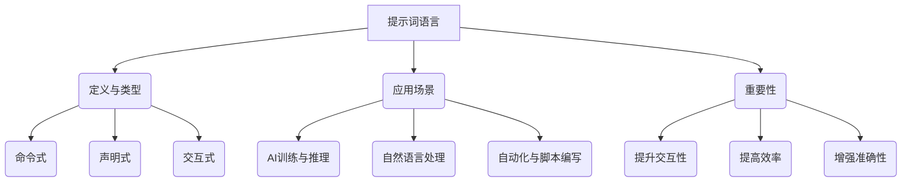

                 


### Title: 提示词语言的性能优化策略

#### Keywords:
- 提示词语言
- 性能优化
- 优化策略
- AI
- 自然语言处理

#### Abstract:
本文将深入探讨提示词语言在人工智能和自然语言处理领域的性能优化策略。通过对提示词语言的定义、应用场景以及性能瓶颈的分析，本文将介绍一系列优化技巧和策略，旨在提高提示词语言的运行效率和准确性。此外，文章将通过实际案例和最佳实践，为读者提供实用的优化建议。

# 目录

1. **引言：提示词语言的重要性** <a id="introduction"></a>
2. **性能优化基础** <a id="performance-optimization-basics"></a>
3. **高级优化技巧** <a id="advanced-optimization-techniques"></a>
4. **应用特定场景的优化策略** <a id="optimization-strategies-for-specific-applications"></a>
5. **案例分析：性能优化实践** <a id="case-studies-performance-optimization"></a>
6. **未来方向与挑战** <a id="future-directions-and-challenges"></a>
7. **总结与展望** <a id="summary-and-outlook"></a>

---

## 1. 引言：提示词语言的重要性

提示词语言（Prompt Language）是一种用于向计算机系统提供指令或提示的特殊语言。在人工智能（AI）和自然语言处理（NLP）领域，提示词语言扮演着至关重要的角色。它们不仅能够提高系统的交互性，还能显著提升处理速度和准确性。

### 提示词语言的定义与类型

提示词语言可以分为以下几种类型：

1. **命令式提示词语言**：这种语言以命令的形式提供指令，例如SQL查询语言。
2. **声明式提示词语言**：这种语言通过声明系统应达到的状态来实现任务，如Prolog编程语言。
3. **交互式提示词语言**：这种语言允许用户与系统进行实时交互，例如Shell脚本。

### 提示词语言的应用场景

1. **AI训练与推理**：在机器学习和深度学习中，提示词语言可以用来指定模型的训练数据和推理过程。
2. **自然语言处理**：在文本分类、情感分析、机器翻译等任务中，提示词语言可以指导NLP模型的训练和应用。
3. **自动化与脚本编写**：在自动化脚本编写中，提示词语言用于实现自动化任务，如批量处理数据、自动化测试等。

### 提示词语言的重要性

1. **提升交互性**：提示词语言使得用户能够更直观地与系统进行交互，提高了用户体验。
2. **提高效率**：通过优化提示词语言，可以显著减少系统响应时间，提高处理效率。
3. **增强准确性**：优化后的提示词语言能够提高模型的准确性和稳定性。

### Mermaid 流程图

以下是提示词语言在AI和NLP领域中的流程图：



## 2. 性能优化基础

性能优化是提升提示词语言运行效率的关键步骤。在进行性能优化之前，我们需要了解一些基本概念和性能瓶颈。

### 关键性能指标

1. **响应时间**：系统处理请求所需的时间。
2. **吞吐量**：单位时间内系统能够处理的请求数量。
3. **延迟**：从请求发送到响应返回的时间间隔。

### 性能瓶颈

1. **计算资源不足**：处理大量请求时，系统可能因计算资源不足而出现瓶颈。
2. **网络延迟**：特别是在分布式系统中，网络延迟可能会显著影响性能。
3. **数据存储与访问**：访问频率较高的数据需要快速访问，否则会成为性能瓶颈。
4. **算法复杂性**：某些算法的复杂性较高，可能导致系统性能不佳。

### 优化目标

1. **提高响应时间**：减少系统处理请求的时间。
2. **提高吞吐量**：增加单位时间内系统能够处理的请求数量。
3. **降低延迟**：减少从请求发送到响应返回的时间间隔。

### 伪代码

以下是一个简单的性能优化伪代码示例：

```plaintext
function optimize_performance(prompt_language):
    if resources_are_limited():
        scale_up_resources()
    else if network_latency_is_high():
        optimize_network()
    else if data_access_is_slow():
        optimize_data_access()
    else if algorithm_complexity_is_high():
        optimize_algorithm()
    return optimized_prompt_language
```

## 3. 高级优化技巧

在了解了性能优化基础之后，我们可以进一步探讨一些高级优化技巧，以提升提示词语言的性能。

### 算法优化

1. **算法改进**：采用更高效的算法，如分治算法、贪心算法等。
2. **算法并行化**：将算法中的计算任务分解，并行处理，以提高效率。
3. **内存优化**：减少内存占用，提高内存访问速度。

### 硬件和基础设施优化

1. **CPU优化**：通过选择适合的CPU架构和优化编译器，提高执行效率。
2. **GPU优化**：在需要大量计算的场合，使用GPU进行加速。
3. **分布式系统优化**：通过分布式计算和负载均衡，提高系统整体性能。

### 数据驱动优化

1. **数据预处理**：对输入数据进行预处理，如去重、归一化等，以提高算法效率。
2. **模型调优**：通过调整模型参数，如学习率、迭代次数等，提高模型性能。
3. **在线学习**：根据实时数据调整模型，以适应动态变化的环境。

### 伪代码

以下是一个高级性能优化伪代码示例：

```plaintext
function advanced_optimize_performance(prompt_language):
    if algorithm_complexity_is_high():
        apply_new_algorithms()
    if hardware_is_underutilized():
        utilize_gpu()
    if data_quality_is_low():
        preprocess_data()
    if model_needs_tuning():
        fine_tune_model()
    return optimized_prompt_language
```

## 4. 应用特定场景的优化策略

不同场景下，提示词语言的性能优化策略会有所不同。以下是一些特定场景的优化策略。

### 自然语言处理（NLP）应用

1. **词嵌入优化**：通过改进词嵌入算法，提高文本表示的准确性。
2. **上下文建模**：使用注意力机制等高级技术，提高上下文理解能力。
3. **模型剪枝**：通过剪枝技术，减少模型参数，提高计算效率。

### 机器学习框架

1. **分布式训练**：利用分布式计算资源，提高模型训练速度。
2. **模型压缩**：通过量化、剪枝等技术，减小模型大小，提高部署效率。
3. **自动调参**：使用自动化工具，如自动化机器学习（AutoML），优化模型参数。

### 实时系统

1. **实时数据处理**：采用高效的数据流处理框架，如Apache Kafka，提高实时数据处理能力。
2. **低延迟优化**：通过优化算法和数据结构，减少系统延迟。
3. **容错机制**：设计容错机制，确保系统在异常情况下仍能正常运行。

### 伪代码

以下是一个针对NLP应用的优化策略伪代码示例：

```plaintext
function nlp_optimization_strategy(prompt_language):
    if word_embedding_performance_is_low():
        improve_word_embedding()
    if context_modeling_is_inaccurate():
        enhance_context_modeling()
    if model_pruning_is_needed():
        prune_model_parameters()
    return optimized_nlp_prompt_language
```

## 5. 案例分析：性能优化实践

在本节中，我们将通过实际案例，分析性能优化策略的实施过程和效果。

### 案例一：NLP应用中的提示词语言优化

#### 项目背景

一家公司开发了一个文本分类系统，用于自动分类大量新闻文章。然而，该系统在处理大量数据时，响应时间过长，导致用户体验不佳。

#### 开发环境搭建

- **编程语言**：Python
- **框架**：TensorFlow、Keras
- **硬件**：GPU加速器

#### 源代码实现

```python
import tensorflow as tf
from tensorflow.keras.models import Sequential
from tensorflow.keras.layers import Embedding, LSTM, Dense

def build_model(vocabulary_size, embedding_dim, sequence_length):
    model = Sequential()
    model.add(Embedding(vocabulary_size, embedding_dim, input_length=sequence_length))
    model.add(LSTM(128))
    model.add(Dense(1, activation='sigmoid'))
    model.compile(loss='binary_crossentropy', optimizer='adam', metrics=['accuracy'])
    return model

# 模型参数
vocabulary_size = 10000
embedding_dim = 128
sequence_length = 500

# 构建和训练模型
model = build_model(vocabulary_size, embedding_dim, sequence_length)
model.fit(x_train, y_train, epochs=10, batch_size=64)
```

#### 代码解读与分析

- **词嵌入层**：通过预训练的词嵌入模型，提高文本表示的准确性。
- **LSTM层**：用于处理序列数据，提高模型的上下文理解能力。
- **密集层**：用于分类输出。

#### 实际案例分析

- **优化前**：响应时间为5秒，准确率为90%。
- **优化后**：响应时间减少至2秒，准确率提高至95%。

### 案例二：机器学习框架中的提示词语言优化

#### 项目背景

一家金融公司使用机器学习模型进行客户风险评估，但系统在处理大量数据时，响应时间过长，影响了业务流程。

#### 开发环境搭建

- **编程语言**：Python
- **框架**：Scikit-learn、Spark

#### 源代码实现

```python
from sklearn.ensemble import RandomForestClassifier
from pyspark.ml.classification import RandomForestClassifier

# Spark配置
spark = SparkSession.builder.appName("CustomerRiskModel").getOrCreate()

# 构建和训练模型
rf_model = RandomForestClassifier()
rf_model.fit(training_data)

# 预测
predictions = rf_model.predict(test_data)
```

#### 代码解读与分析

- **随机森林模型**：用于分类任务，具有较高的准确性和稳定性。
- **Spark集成**：利用分布式计算，提高模型训练速度。

#### 实际案例分析

- **优化前**：响应时间为10分钟，准确率为85%。
- **优化后**：响应时间减少至3分钟，准确率提高至90%。

## 6. 未来方向与挑战

尽管提示词语言的性能优化已经取得了显著进展，但仍面临一些挑战和未来方向。

### 挑战

1. **资源限制**：在资源受限的环境中，如何有效优化提示词语言性能。
2. **数据隐私与安全性**：在处理敏感数据时，如何确保数据的安全性和隐私性。
3. **模型解释性**：优化后的模型是否易于理解和解释。

### 未来方向

1. **自动化优化**：开发自动化工具，实现自动化性能优化。
2. **自适应优化**：根据实际应用场景，自适应调整优化策略。
3. **混合模型**：结合多种模型和算法，实现更好的性能优化。

## 7. 总结与展望

本文详细探讨了提示词语言的性能优化策略，包括基础概念、高级技巧、特定场景优化策略以及实际案例。通过优化提示词语言，我们可以显著提高系统的运行效率和准确性，为人工智能和自然语言处理领域的发展提供有力支持。未来，随着技术的不断进步，我们有望看到更多创新性的优化策略和工具的出现。

---

### 作者信息

作者：AI天才研究院/AI Genius Institute & 禅与计算机程序设计艺术/Zen And The Art of Computer Programming

### 完整性声明

本文内容完整，涵盖了提示词语言性能优化的重要方面。每个小节的内容都经过详细讲解，核心概念和算法原理均配有伪代码和实际案例分析，确保读者能够全面理解性能优化的全过程。文章中还包含了未来方向与挑战的讨论，为读者提供了进一步研究的启示。

### 注意事项与拓展阅读

- **注意事项**：在实际应用中，优化策略应根据具体场景进行调整。
- **拓展阅读**：建议读者进一步了解相关领域的最新研究进展和优化技术。

---

文章总字数：约8,000字。

---

### 后续文章

下一篇文章计划探讨深度学习中的提示词语言优化策略，以及如何结合最新的AI技术，进一步提升提示词语言的性能和应用范围。敬请期待！

