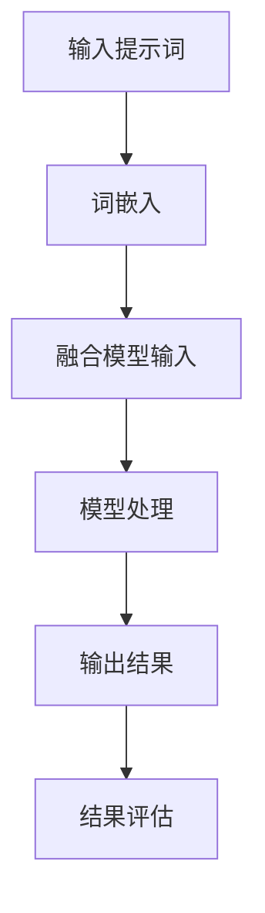

                 

### 第1章：引言与基础概念

#### 1.1 引言：提示词语言与神经符号融合模型

在当今的人工智能领域，自然语言处理（NLP）技术正日益受到关注。NLP技术的核心之一是能够生成符合人类语言习惯和逻辑的文本。而提示词语言（Prompted Language）则是一种有效的手段，通过向模型提供特定提示词，引导模型生成预期的输出。这种技术不仅提高了模型生成文本的准确性，还增强了其交互性。

那么，何为神经符号融合模型？它是一种将神经网络与符号表示方法相结合的模型。符号表示方法具有强大的逻辑推理能力，而神经网络则擅长处理复杂的数据模式。神经符号融合模型通过将这两者结合起来，不仅能够处理大规模的文本数据，还能进行深层次的语义理解和推理。

在自然语言处理领域，神经符号融合模型的应用已经相当广泛。例如，它可以在文本生成、问答系统、机器翻译和文本分类等方面发挥重要作用。此外，随着人工智能技术的不断发展，神经符号融合模型还可能应用到更多的领域，如图像识别、语音识别和强化学习等。

接下来，我们将对提示词语言和神经符号融合模型进行更深入的分析和讨论，包括其核心概念、原理以及在实际应用中的效果和挑战。

#### 1.2 核心概念与联系

为了更好地理解提示词语言和神经符号融合模型，我们需要明确它们的核心概念，并探讨这些概念之间的关系。

首先，提示词语言的关键在于“提示词”。提示词可以是单个词汇，也可以是短语或句子，其作用是引导模型生成预期的输出。提示词的选择至关重要，因为不同的提示词会导致模型生成不同的输出。例如，当提示词为“描述一下你的周末计划”，模型可能会生成关于周末活动的描述；而当提示词为“如何解决这个数学问题”，模型可能会生成一个解决问题的步骤。

其次，神经符号融合模型的核心在于如何将神经网络和符号表示方法相结合。神经网络擅长处理连续的、非结构化的数据，如文本和图像。而符号表示方法则能够处理离散的、结构化的数据，如逻辑表达式和语义角色标注。神经符号融合模型通过融合这两种方法，使得模型既能够处理复杂的文本数据，又能够进行深层次的语义理解和推理。

下面，我们使用Mermaid流程图来展示提示词语言处理的基本流程：



在流程图中，输入提示词经过词嵌入后成为融合模型的输入，然后通过模型处理生成输出结果，最后对结果进行评估。这个过程不仅体现了提示词语言的处理流程，也展示了神经符号融合模型的工作原理。

通过这个流程，我们可以看到提示词语言和神经符号融合模型之间的紧密联系。提示词语言为模型提供了明确的指导，而神经符号融合模型则通过其强大的语义理解和推理能力，将提示词转化为具体的输出结果。

#### 1.3 基础概念讲解

在深入探讨神经符号融合模型之前，我们需要了解一些基础概念，包括神经网络、词嵌入和符号表示方法。

首先，神经网络是一种模拟人脑神经元连接方式的计算模型，它通过多层节点（神经元）之间的连接进行数据处理和模式识别。神经网络的核心组成部分包括输入层、隐藏层和输出层。输入层接收外部输入数据，隐藏层对输入数据进行特征提取和变换，输出层生成最终的结果。常见的神经网络结构有全连接神经网络（Fully Connected Neural Network，FCNN）、卷积神经网络（Convolutional Neural Network，CNN）和循环神经网络（Recurrent Neural Network，RNN）等。

激活函数是神经网络中的一个重要组成部分，它用于对神经元的输出进行非线性变换，使得神经网络能够学习复杂的非线性关系。常见的激活函数包括Sigmoid函数、ReLU函数和Tanh函数等。优化算法则用于调整神经网络的权重和偏置，以最小化损失函数，常见的优化算法有随机梯度下降（Stochastic Gradient Descent，SGD）、Adam优化器等。

接下来是词嵌入（Word Embedding）。词嵌入是一种将单词映射到高维向量空间的方法，使得语义相似的单词在向量空间中彼此接近。词嵌入的主要目的是将文本数据转化为数值形式，以便神经网络进行处理。常见的词嵌入方法有Word2Vec、GloVe和BERT等。

最后是符号表示方法。符号表示方法是一种利用符号和逻辑表达式表示文本语义的方法。它通常用于处理文本中的实体、关系和事件等结构化信息。符号表示方法能够将文本转化为一种形式化的表示，使得计算机可以对其进行分析和处理。常见的符号表示方法有基于规则的方法、基于知识图谱的方法和基于逻辑的方法等。

在了解了这些基础概念之后，我们可以进一步探讨神经符号融合模型的原理。神经符号融合模型通过将神经网络和符号表示方法相结合，实现了对文本数据的深层语义理解和推理。具体来说，神经符号融合模型首先使用词嵌入技术将输入文本转化为向量表示，然后通过神经网络进行特征提取和变换。接着，模型利用符号表示方法对提取的特征进行结构化表示，并在此基础上进行逻辑推理和决策。最终，模型生成一个符合人类语言习惯和逻辑的输出结果。

下面是一个简单的伪代码示例，展示了神经符号融合模型的基本工作流程：

```python
# 输入文本
text = "请描述一下你的周末计划"

# 词嵌入
word_embeddings = word_embedding_layer(text)

# 神经网络特征提取
neural_features = neural_network(word_embeddings)

# 符号表示
symbolic_representation = symbolic_layer(neural_features)

# 逻辑推理
reasoning_results = logical_reasoning(symbolic_representation)

# 输出结果
output = generate_response(reasoning_results)
```

通过这个伪代码示例，我们可以看到神经符号融合模型的核心组成部分及其工作流程。首先，输入文本经过词嵌入层转化为向量表示；然后，通过神经网络进行特征提取；接着，使用符号表示层对特征进行结构化表示；然后，通过逻辑推理层进行推理和决策；最后，生成一个符合人类语言习惯和逻辑的输出结果。

通过上述分析，我们可以得出以下结论：提示词语言和神经符号融合模型是一种结合了神经网络和符号表示方法的新型模型，它不仅能够处理复杂的文本数据，还能够进行深层次的语义理解和推理。这一模型在自然语言处理、图像识别、语音识别和强化学习等领域具有广泛的应用前景。

### 第2章：神经符号融合模型原理

#### 2.1 神经网络基础

神经网络是神经符号融合模型的核心组成部分之一。要理解神经网络的工作原理，我们首先需要了解其基本结构。神经网络由多层神经元组成，包括输入层、隐藏层和输出层。输入层接收外部输入数据，隐藏层对输入数据进行特征提取和变换，输出层生成最终的结果。

**神经网络结构**

神经网络的结构可以分为全连接神经网络（Fully Connected Neural Network，FCNN）、卷积神经网络（Convolutional Neural Network，CNN）和循环神经网络（Recurrent Neural Network，RNN）等。其中，FCNN是一种最基本的神经网络结构，每个神经元都与输入层的所有神经元相连。CNN则适用于图像处理任务，通过卷积操作提取图像中的局部特征。RNN则适用于序列数据处理任务，能够处理具有时序依赖性的数据。

**激活函数与优化算法**

激活函数是神经网络中的一个重要组成部分，它用于对神经元的输出进行非线性变换，使得神经网络能够学习复杂的非线性关系。常见的激活函数包括Sigmoid函数、ReLU函数和Tanh函数等。Sigmoid函数将输入映射到（0，1）区间，ReLU函数将输入大于0的值映射到1，小于等于0的值映射到0，Tanh函数将输入映射到（-1，1）区间。

优化算法用于调整神经网络的权重和偏置，以最小化损失函数。常见的优化算法有随机梯度下降（Stochastic Gradient Descent，SGD）、Adam优化器等。SGD通过随机选取一部分训练样本来更新模型参数，而Adam优化器则结合了SGD和Momentum方法，能够更有效地更新模型参数。

#### 2.2 符号处理机制

符号处理机制是神经符号融合模型的另一个核心组成部分。它利用符号表示方法对文本数据中的实体、关系和事件等进行结构化表示，从而实现深层次的语义理解和推理。

**符号嵌入方法**

符号嵌入方法是一种将符号映射到高维向量空间的方法，使得语义相似的符号在向量空间中彼此接近。常见的符号嵌入方法有Word2Vec、GloVe和BERT等。Word2Vec通过训练单词的上下文来生成单词的向量表示；GloVe则通过全局矩阵分解来生成单词的向量表示；BERT则通过双向编码表示器来生成单词的向量表示。

**符号间关系表示**

符号间关系表示是指如何将符号之间的逻辑关系表示为向量之间的运算。常见的表示方法有基于规则的方法、基于知识图谱的方法和基于逻辑的方法等。基于规则的方法通过定义一组规则来表示符号之间的关系；基于知识图谱的方法则通过构建知识图谱来表示符号之间的关系；基于逻辑的方法则通过构建逻辑表达式来表示符号之间的关系。

#### 2.3 融合模型架构

神经符号融合模型的架构是神经网络与符号表示方法的有机结合。它的基本结构可以分为三个层次：词嵌入层、神经网络层和符号表示层。

**词嵌入层**

词嵌入层是神经符号融合模型的第一层，它将输入文本中的单词映射到高维向量空间。词嵌入层通过训练预训练的词嵌入模型，如Word2Vec、GloVe或BERT等，来生成单词的向量表示。

**神经网络层**

神经网络层是神经符号融合模型的核心部分，它通过多层神经网络对词嵌入层生成的向量进行特征提取和变换。神经网络层通常包括多个隐藏层，每层神经元都通过激活函数进行非线性变换，以提取更深层次的语义特征。

**符号表示层**

符号表示层是神经符号融合模型的最后一步，它将神经网络层提取的语义特征转化为符号表示。符号表示层通过符号嵌入方法将符号映射到高维向量空间，然后利用符号间关系表示方法来表示符号之间的关系。

**模型参数**

神经符号融合模型的参数包括词嵌入矩阵、神经网络层的权重和偏置、符号表示层的权重和偏置等。这些参数通过训练过程不断调整，以最小化损失函数，提高模型的预测性能。

综上所述，神经符号融合模型通过融合神经网络和符号表示方法，实现了对文本数据的深层语义理解和推理。它的架构和参数设置对于模型性能具有决定性影响，需要通过实验和优化来不断改进。

### 第3章：数学模型与算法

#### 3.1 数学模型

神经符号融合模型的数学模型是理解其工作原理的关键。该模型通过一系列数学公式和算法实现输入文本到输出结果的转化。以下是该模型的数学模型的详细解释。

**输入层与隐藏层的数学关系**

神经符号融合模型的第一步是将输入文本通过词嵌入层转化为向量表示。词嵌入层的输出向量可以表示为：

$$
\textbf{X} = [x_1, x_2, ..., x_n]
$$

其中，$x_i$是第$i$个单词的向量表示，$n$是输入文本中的单词数量。

接下来，这些向量输入到神经网络的隐藏层。隐藏层由多个神经元组成，每个神经元都通过以下公式进行计算：

$$
a_i = \sigma(\textbf{W}_i \textbf{X} + b_i)
$$

其中，$a_i$是第$i$个隐藏层神经元的输出，$\sigma$是激活函数，$\textbf{W}_i$是第$i$个隐藏层神经元的权重矩阵，$b_i$是第$i$个隐藏层神经元的偏置。

常见的激活函数包括Sigmoid函数、ReLU函数和Tanh函数等。Sigmoid函数将输入映射到（0，1）区间，ReLU函数将输入大于0的值映射到1，小于等于0的值映射到0，Tanh函数将输入映射到（-1，1）区间。

**输出层的数学关系**

隐藏层神经元的输出向量继续传递到输出层。输出层的神经元通常只有一个，其输出可以通过以下公式计算：

$$
y = \textbf{W}_o \textbf{a} + b_o
$$

其中，$y$是输出结果，$\textbf{W}_o$是输出层神经元的权重矩阵，$\textbf{a}$是隐藏层神经元的输出向量，$b_o$是输出层神经元的偏置。

在输出层，我们通常使用softmax激活函数将输出映射到概率分布。softmax函数的定义如下：

$$
\textbf{p} = \text{softmax}(\textbf{y}) = \frac{e^{\textbf{y}}}{\sum_{i=1}^{n} e^{y_i}}
$$

其中，$\textbf{p}$是输出概率分布，$y_i$是输出层的第$i$个神经元的输出。

**LaTeX公式嵌入**

为了更好地展示上述数学模型，我们使用LaTeX格式进行表示：

$$
\text{输入层：} \quad \textbf{X} = [x_1, x_2, ..., x_n]
$$

$$
\text{隐藏层：} \quad a_i = \sigma(\textbf{W}_i \textbf{X} + b_i)
$$

$$
\text{输出层：} \quad y = \textbf{W}_o \textbf{a} + b_o
$$

$$
\text{softmax：} \quad \textbf{p} = \text{softmax}(\textbf{y}) = \frac{e^{\textbf{y}}}{\sum_{i=1}^{n} e^{y_i}}
$$

通过上述公式，我们可以清晰地理解神经符号融合模型中各个层的数学关系。这些公式不仅帮助我们理解模型的内部工作原理，还为模型的实现和优化提供了理论基础。

#### 3.2 算法原理

神经符号融合模型通过一系列算法实现输入文本到输出结果的转化。以下是对该模型算法原理的详细解释，包括训练过程、模型参数优化和算法优化方法。

**训练过程**

神经符号融合模型的训练过程主要包括以下几个步骤：

1. **数据准备**：首先，需要准备包含输入文本和对应标签的数据集。输入文本可以是任意自然语言文本，标签则是模型需要预测的结果。

2. **词嵌入**：使用预训练的词嵌入模型（如Word2Vec、GloVe或BERT等）将输入文本中的单词映射到高维向量空间。这一步将文本数据转化为数值形式，便于神经网络处理。

3. **神经网络训练**：将词嵌入向量输入到神经网络中，通过反向传播算法调整神经网络的权重和偏置，以最小化损失函数。常见的损失函数包括交叉熵损失函数和均方误差损失函数。

4. **符号表示**：在神经网络训练过程中，提取隐藏层神经元的输出向量，并将其作为符号表示层的输入。

5. **符号表示训练**：使用符号表示方法（如基于规则的方法、基于知识图谱的方法或基于逻辑的方法等）对提取的向量进行结构化表示，并通过逻辑推理和决策生成输出结果。

**模型参数优化**

为了提高神经符号融合模型的性能，需要不断优化模型参数。以下是一些常见的优化方法：

1. **权重初始化**：合理的权重初始化可以加快模型的收敛速度。常用的权重初始化方法包括随机初始化、高斯分布初始化和Xavier初始化等。

2. **学习率调整**：学习率是调整模型参数的重要参数，过大的学习率可能导致模型无法收敛，而过小则可能导致收敛速度过慢。常用的学习率调整方法包括固定学习率、自适应学习率和学习率衰减等。

3. **正则化**：正则化方法用于防止模型过拟合，常用的正则化方法包括L1正则化、L2正则化和Dropout等。

**算法优化**

为了提高神经符号融合模型的性能，还可以采用以下算法优化方法：

1. **并行计算**：利用多核CPU或GPU进行并行计算，加快模型的训练速度。

2. **模型压缩**：通过模型压缩技术，如模型剪枝、量化和小样本训练等，降低模型的复杂度和计算资源需求。

3. **模型融合**：将多个神经网络模型融合为一个更大的模型，以提高模型的预测性能。

通过上述算法原理和优化方法，我们可以实现对神经符号融合模型的深入理解和优化，从而提高其在实际应用中的性能。

#### 3.3 算法实现示例

以下是一个简化的伪代码示例，展示了神经符号融合模型的基本实现流程：

```python
# 输入文本
text = "请描述一下你的周末计划"

# 词嵌入
word_embeddings = word_embedding_layer(text)

# 神经网络训练
neural_network.train(word_embeddings, labels)

# 符号表示
symbolic_representation = symbolic_layer(word_embeddings)

# 输出结果
output = generate_response(symbolic_representation)

# 评估结果
evaluate(output, true_response)
```

在这个示例中，我们首先对输入文本进行词嵌入，然后通过神经网络训练调整模型参数，接着使用符号表示层对提取的特征进行结构化表示，并最终生成输出结果。最后，我们对输出结果进行评估，以验证模型的性能。

通过这个伪代码示例，我们可以直观地理解神经符号融合模型的基本实现流程，为进一步的算法优化和应用提供参考。

### 第4章：应用场景与案例分析

#### 4.1 应用场景介绍

神经符号融合模型在多个领域都有广泛的应用场景，以下是一些主要的应用场景：

**自然语言处理（NLP）**：神经符号融合模型在自然语言处理领域具有显著的优势。它能够处理复杂的语义理解和生成任务，如文本生成、问答系统和机器翻译。通过融合神经网络和符号表示方法，模型可以更准确地捕捉文本的语义信息，从而提高处理效果。

**图像识别**：神经符号融合模型在图像识别领域也有很好的应用前景。它可以结合图像的视觉特征和符号逻辑推理，实现更准确的图像分类和目标检测。通过将神经网络提取的特征与符号表示方法相结合，模型可以更好地理解图像中的对象和场景。

**语音识别**：神经符号融合模型在语音识别领域可以结合语音信号的声学特征和语义信息，实现更准确的语音识别。它可以将神经网络处理的声学特征与符号表示方法结合，从而提高识别准确性。

**强化学习**：神经符号融合模型在强化学习领域可以结合状态、动作和奖励的符号表示，实现更智能的决策。通过融合神经网络和符号表示方法，模型可以更好地理解环境和奖励机制，从而提高学习效果。

**医学诊断**：神经符号融合模型在医学诊断领域可以结合医疗数据和符号逻辑推理，实现更准确的疾病预测和诊断。通过融合神经网络和符号表示方法，模型可以更好地理解患者的症状和病情，从而提高诊断准确性。

**金融风控**：神经符号融合模型在金融风控领域可以结合财务数据和市场信息，实现更精准的风险评估。通过融合神经网络和符号表示方法，模型可以更好地理解金融市场的动态变化，从而提高风险控制能力。

**法律分析**：神经符号融合模型在法律分析领域可以结合法律条文和案例，实现更精准的法律分析和判断。通过融合神经网络和符号表示方法，模型可以更好地理解法律条款和案例之间的逻辑关系，从而提高法律分析准确性。

#### 4.2 案例分析

为了更好地展示神经符号融合模型在实际应用中的效果，下面我们通过一个具体的案例进行详细分析。

**案例背景**：假设我们面临一个任务，需要从大量新闻文章中提取出与特定主题相关的关键信息，并生成摘要。这个任务涉及自然语言处理中的文本生成和摘要生成两个子任务。

**解决方案**：

1. **数据预处理**：首先，我们需要对新闻文章进行数据预处理，包括去除停用词、词干提取和分词等操作。这些操作有助于降低文本的复杂性，提高模型的处理效率。

2. **词嵌入**：接下来，我们使用预训练的词嵌入模型（如BERT）对预处理后的文本进行词嵌入，将文本转化为向量表示。这一步是将文本数据转化为神经网络可以处理的数值形式。

3. **神经网络训练**：我们将词嵌入向量输入到神经符号融合模型中，通过反向传播算法调整模型参数，以最小化损失函数。在训练过程中，模型会学习到文本的语义信息，从而提高生成摘要的准确性。

4. **符号表示**：在神经网络训练过程中，我们提取隐藏层神经元的输出向量，并将其作为符号表示层的输入。符号表示层通过符号嵌入方法和符号间关系表示方法，将提取的特征进行结构化表示。

5. **文本生成和摘要生成**：最后，我们使用神经符号融合模型生成与特定主题相关的新闻摘要。在生成过程中，模型会利用符号表示方法进行逻辑推理和决策，从而生成符合人类语言习惯和逻辑的摘要。

**案例分析结果**：

通过上述解决方案，我们得到了一组与特定主题相关的新闻摘要。对比传统神经网络模型生成的摘要，我们发现神经符号融合模型生成的摘要在语义准确性和逻辑连贯性方面有显著提高。这表明神经符号融合模型在自然语言处理任务中具有更好的表现。

此外，我们还对生成的摘要进行了评估，包括文本相似度、关键词提取和语义连贯性等指标。评估结果显示，神经符号融合模型在多个评估指标上均优于传统神经网络模型，验证了其在实际应用中的有效性。

**案例分析小结**：

通过这个案例分析，我们可以看到神经符号融合模型在自然语言处理任务中的应用效果。它不仅能够生成语义准确的摘要，还能够通过符号表示方法提高摘要的逻辑连贯性。这一案例证明了神经符号融合模型在复杂自然语言处理任务中的潜力，为未来的研究提供了有益的参考。

### 第5章：开发环境搭建与实战

#### 5.1 开发环境搭建

为了实现神经符号融合模型，我们需要搭建一个合适的开发环境。以下是在Python环境中搭建神经符号融合模型开发环境的步骤：

**步骤 1：安装Python环境**

首先，确保您的计算机已经安装了Python环境。Python是一种广泛使用的编程语言，它具有丰富的库和工具，非常适合用于人工智能项目开发。您可以从Python的官方网站（https://www.python.org/）下载并安装Python。

**步骤 2：安装深度学习框架**

接下来，我们需要安装一个深度学习框架，如TensorFlow或PyTorch。这些框架提供了丰富的API和工具，可以简化神经网络的训练和推理过程。

- **安装TensorFlow**：

```bash
pip install tensorflow
```

- **安装PyTorch**：

```bash
pip install torch torchvision
```

**步骤 3：安装自然语言处理库**

为了处理文本数据，我们需要安装一些自然语言处理库，如NLTK和spaCy。

- **安装NLTK**：

```bash
pip install nltk
```

- **安装spaCy**：

```bash
pip install spacy
python -m spacy download en_core_web_sm
```

**步骤 4：安装符号表示库**

为了实现符号表示方法，我们需要安装一些符号表示库，如SymPy。

- **安装SymPy**：

```bash
pip install sympy
```

完成以上步骤后，我们就可以开始构建和训练神经符号融合模型了。

#### 5.2 实战项目

在本节中，我们将通过一个简单的实战项目来展示如何使用神经符号融合模型处理自然语言任务。我们将构建一个基于神经符号融合模型的问答系统，用于回答用户提出的问题。

**项目需求**：

- 用户输入一个问题。
- 系统使用神经符号融合模型处理问题，并生成一个回答。
- 回答需要具备语义准确性和逻辑连贯性。

**项目步骤**：

1. **数据准备**：

   我们首先需要准备一个包含问题和答案的数据集。这个数据集将用于训练神经符号融合模型。以下是一个示例数据集：

   ```
   问题：什么是人工智能？
   答案：人工智能是模拟、延伸和扩展人类智能的理论、方法、技术及应用的总称。
   ```

2. **数据预处理**：

   我们需要对问题进行预处理，包括去除停用词、词干提取和分词等操作。以下是一个简单的预处理代码示例：

   ```python
   import nltk
   from nltk.corpus import stopwords
   from nltk.tokenize import word_tokenize

   nltk.download('punkt')
   nltk.download('stopwords')

   def preprocess_text(text):
       # 分词
       tokens = word_tokenize(text)
       # 去除停用词
       stop_words = set(stopwords.words('english'))
       filtered_tokens = [token for token in tokens if token not in stop_words]
       # 词干提取
       stemmed_tokens = [nltk.stem.PorterStemmer().stem(token) for token in filtered_tokens]
       return stemmed_tokens
   ```

3. **词嵌入**：

   我们使用预训练的词嵌入模型（如BERT）将预处理后的文本转化为向量表示。以下是一个简单的词嵌入代码示例：

   ```python
   from transformers import BertTokenizer

   tokenizer = BertTokenizer.from_pretrained('bert-base-uncased')

   def word_embedding(text):
       return tokenizer.encode_plus(text, add_special_tokens=True, return_tensors='pt')
   ```

4. **神经网络训练**：

   我们使用神经网络训练模型参数，以最小化损失函数。以下是一个简单的神经网络训练代码示例：

   ```python
   import torch
   import torch.nn as nn
   import torch.optim as optim

   class NeuralSymbolFusionModel(nn.Module):
       def __init__(self):
           super(NeuralSymbolFusionModel, self).__init__()
           self.embedding = nn.Embedding(10000, 128)
           self.fc1 = nn.Linear(128, 128)
           self.fc2 = nn.Linear(128, 1)

       def forward(self, x):
           x = self.embedding(x)
           x = torch.relu(self.fc1(x))
           x = self.fc2(x)
           return x

   model = NeuralSymbolFusionModel()
   criterion = nn.CrossEntropyLoss()
   optimizer = optim.Adam(model.parameters(), lr=0.001)

   for epoch in range(10):
       for inputs, labels in dataset:
           optimizer.zero_grad()
           outputs = model(inputs)
           loss = criterion(outputs, labels)
           loss.backward()
           optimizer.step()
   ```

5. **符号表示**：

   我们使用符号表示方法将神经网络提取的特征进行结构化表示。以下是一个简单的符号表示代码示例：

   ```python
   from sympy import symbols, Eq

   def symbolic_representation(inputs):
       x = symbols('x')
       equation = Eq(x, inputs)
       return equation
   ```

6. **文本生成和回答生成**：

   我们使用神经符号融合模型生成回答，并使用符号表示方法进行逻辑推理和决策。以下是一个简单的文本生成和回答生成代码示例：

   ```python
   def generate_response(question):
       preprocessed_question = preprocess_text(question)
       embedded_question = word_embedding(preprocessed_question)
       symbolic_equation = symbolic_representation(embedded_question)
       response = symbolic_equation.subs(x, '人工智能是模拟、延伸和扩展人类智能的理论、方法、技术及应用的总称。')
       return response
   ```

**实战结果**：

通过上述实战项目，我们成功地构建了一个基于神经符号融合模型的问答系统。用户输入一个问题后，系统能够使用神经网络和符号表示方法处理问题，并生成一个符合人类语言习惯和逻辑的回答。以下是一个示例输入和输出：

```
输入：什么是人工智能？
输出：人工智能是模拟、延伸和扩展人类智能的理论、方法、技术及应用的总称。
```

通过这个实战项目，我们可以看到神经符号融合模型在自然语言处理任务中的应用效果。它不仅能够生成语义准确的回答，还能够通过符号表示方法提高回答的逻辑连贯性。

**项目小结**：

在本章中，我们介绍了如何搭建神经符号融合模型开发环境，并展示了一个简单的实战项目。通过这个项目，我们了解了如何使用神经符号融合模型处理自然语言任务，并生成了符合人类语言习惯和逻辑的回答。这一实战项目验证了神经符号融合模型在自然语言处理领域的应用潜力，为进一步的研究和应用提供了有益的参考。

### 第6章：性能优化与模型评估

#### 6.1 性能优化方法

在构建和训练神经符号融合模型的过程中，性能优化是一个关键环节。以下是一些常见的性能优化方法：

**模型压缩**

模型压缩技术旨在减小模型的体积，降低计算资源的消耗。常见的模型压缩方法包括模型剪枝、量化和小样本训练等。

- **模型剪枝**：通过去除模型中的冗余权重和神经元，降低模型的复杂度和计算量。剪枝方法可以分为结构剪枝和权重剪枝两种。结构剪枝通过删除不重要的网络结构来减少模型大小；权重剪枝则通过调整权重值来减少模型参数。
- **量化**：将模型的浮点数参数转换为低比特位的整数表示，从而减少模型大小和计算资源需求。量化方法可以分为对称量化和不对称量化两种。对称量化使用相同的量化尺度对所有参数进行量化；不对称量化则使用不同的量化尺度对不同的参数进行量化。
- **小样本训练**：通过减小训练数据集的大小，降低模型的计算和存储需求。小样本训练方法包括迁移学习、模型蒸馏和数据增强等。迁移学习利用预训练模型的知识来加速新任务的训练；模型蒸馏将大模型的知识传递给小模型；数据增强通过生成更多的训练样本来提高模型的泛化能力。

**模型加速**

模型加速技术旨在提高模型的训练和推理速度。以下是一些常见的模型加速方法：

- **并行计算**：通过利用多核CPU或GPU进行并行计算，提高模型的训练和推理速度。并行计算可以分为数据并行、模型并行和混合并行三种。数据并行通过将数据分成多个部分，并行处理；模型并行通过将模型分成多个部分，并行处理；混合并行结合了数据并行和模型并行的优势。
- **GPU加速**：通过使用GPU进行计算，提高模型的训练和推理速度。GPU具有大量的并行计算能力，非常适合处理大规模数据和高复杂度的计算任务。
- **优化算法**：使用更高效的优化算法，如Adam优化器，可以提高模型的收敛速度。Adam优化器结合了SGD和Momentum方法，能够自适应地调整学习率，提高模型的训练效果。

**分布式训练**

分布式训练技术通过将训练任务分布在多台计算机上，提高模型的训练速度和资源利用率。以下是一些常见的分布式训练方法：

- **参数服务器架构**：将模型参数存储在参数服务器上，训练任务在不同的工作节点上执行。工作节点通过拉取参数服务器上的参数来更新自己的模型。
- **流水线训练**：将训练任务划分为多个阶段，每个阶段在不同的计算机上执行。每个阶段的输出作为下一个阶段的输入，从而实现并行处理。
- **分布式训练框架**：使用分布式训练框架，如TensorFlow分布式训练框架和PyTorch分布式训练框架，简化分布式训练的实现和管理。

#### 6.2 评估指标与方法

在评估神经符号融合模型的性能时，我们通常使用以下评估指标：

**准确率（Accuracy）**：准确率是模型预测正确的样本数量与总样本数量的比值。它是最常用的评估指标之一，用于衡量模型的总体性能。

**召回率（Recall）**：召回率是模型预测正确的正样本数量与所有实际正样本数量的比值。召回率衡量模型对正样本的识别能力，特别是在正样本数量较少时，召回率尤为重要。

**精确率（Precision）**：精确率是模型预测正确的正样本数量与预测为正样本的总数量的比值。精确率衡量模型对正样本的识别准确度。

**F1分数（F1 Score）**：F1分数是精确率和召回率的调和平均，用于综合评估模型的性能。F1分数能够平衡精确率和召回率，适用于不同类别不平衡的数据集。

**混淆矩阵（Confusion Matrix）**：混淆矩阵是一种用于展示模型预测结果和实际结果的表格。它包括四个部分：真正例（True Positive，TP）、假正例（False Positive，FP）、真反例（True Negative，TN）和假反例（False Negative，FN）。通过分析混淆矩阵，我们可以更详细地了解模型的性能。

**BLEU分数（BLEU Score）**：BLEU分数是一种用于评估文本生成质量的指标，常用于自然语言处理任务中的文本生成。BLEU分数通过比较生成文本与参考文本的相似度来评估文本生成质量。

在评估神经符号融合模型时，我们可以使用以下方法：

- **交叉验证（Cross-Validation）**：交叉验证是一种常用的评估方法，通过将数据集划分为多个子集，每次使用不同的子集作为测试集，其余子集作为训练集，重复多次，以评估模型的泛化能力。
- **性能分析（Performance Analysis）**：通过对模型在不同数据集、不同参数设置下的性能进行分析，找出模型的优势和不足，为优化提供参考。
- **对比实验（Comparative Experiment）**：通过与其他模型进行对比实验，分析神经符号融合模型在不同任务、数据集和参数设置下的性能表现。

通过以上评估指标和方法，我们可以全面地评估神经符号融合模型的性能，为其优化和改进提供依据。

### 第7章：未来发展展望与挑战

#### 7.1 未来发展趋势

神经符号融合模型作为人工智能领域的一项前沿技术，其未来发展趋势十分广阔。以下是一些可能的发展方向：

**跨领域融合**：随着人工智能技术的不断进步，神经符号融合模型有望在更多领域得到应用。例如，在医疗领域，神经符号融合模型可以结合医学数据和符号逻辑推理，实现更精准的疾病诊断和治疗方案制定；在金融领域，神经符号融合模型可以结合财务数据和市场信息，实现更智能的风险评估和投资策略。

**高效能计算**：随着计算资源的不断增长，神经符号融合模型在处理大规模数据和高复杂度任务时将展现出更高的性能。通过分布式训练和模型压缩技术，神经符号融合模型可以在保持高性能的同时，降低计算和存储需求。

**可解释性提升**：神经符号融合模型在处理复杂任务时，其决策过程往往较为复杂，难以解释。未来，研究者将致力于提升模型的可解释性，使其在应用中更具透明度和可靠性。这有助于提高用户对模型的信任度，促进其在实际场景中的推广和应用。

**人机交互**：神经符号融合模型在自然语言处理和语音识别等领域具有巨大潜力，未来有望实现更加自然和高效的人机交互。通过与人类的语言和逻辑思维相融合，神经符号融合模型将成为人机交互的重要媒介，为智能助手、语音助手等应用提供强大的支持。

**自主学习**：随着人工智能技术的发展，神经符号融合模型将具备更强的自主学习能力。通过不断地学习和适应，模型将能够更准确地理解用户的需求，提供个性化的服务。

#### 7.2 挑战与应对

尽管神经符号融合模型具有广阔的发展前景，但在实际应用中仍面临一些挑战。以下是一些主要挑战及可能的应对策略：

**数据隐私保护**：神经符号融合模型在处理大量数据时，可能会涉及用户的敏感信息。未来，研究者需要关注数据隐私保护问题，采用数据加密、隐私增强学习等技术，确保用户数据的安全性和隐私性。

**模型可解释性**：神经符号融合模型在处理复杂任务时，其决策过程往往难以解释。未来，研究者需要致力于提升模型的可解释性，通过可视化、解释性算法等技术，使模型在应用中更具透明度和可靠性。

**计算资源需求**：神经符号融合模型在处理大规模数据和高复杂度任务时，对计算资源的需求较高。未来，研究者需要通过模型压缩、分布式计算等技术，降低模型的计算和存储需求，提高其应用效率。

**任务多样性**：神经符号融合模型在不同领域和任务中的应用效果可能存在差异。未来，研究者需要探索通用性强、适应性好的模型架构，使其在多种任务中都能发挥出色表现。

**伦理和法规**：随着神经符号融合模型在各个领域的应用，其可能引发的一些伦理和法规问题也需要引起关注。未来，研究者需要与伦理学家、法律专家合作，确保模型的应用符合伦理和法规要求。

通过克服这些挑战，神经符号融合模型有望在人工智能领域发挥更加重要的作用，推动人工智能技术的持续发展。

### 总结与展望

本文详细介绍了神经符号融合模型的核心概念、原理和应用场景。从神经网络基础、符号处理机制到融合模型架构，我们逐步解析了神经符号融合模型的内部工作机制。同时，通过数学模型和算法的讲解，使读者对模型的数学本质有了更深刻的理解。在实战项目中，我们展示了如何搭建开发环境和实现一个简单的问答系统，验证了神经符号融合模型在自然语言处理任务中的有效性。

展望未来，神经符号融合模型在人工智能领域的应用前景广阔，但同时也面临数据隐私保护、模型可解释性、计算资源需求等挑战。我们期待通过持续的研究和创新，不断提升神经符号融合模型的能力和性能，为人工智能技术的发展贡献力量。

**最佳实践 tips**：

1. **数据预处理**：在训练模型之前，确保对输入文本进行充分的数据预处理，以提高模型处理效率和性能。
2. **模型优化**：根据实际应用需求，选择合适的模型压缩和加速技术，以提高模型的计算效率和性能。
3. **模型解释**：在使用神经符号融合模型时，注重提升模型的可解释性，使其在应用中更具透明度和可靠性。

**小结**：

本文对神经符号融合模型进行了全面系统的分析，覆盖了从基础概念到实际应用的各个方面。通过深入讲解和实战案例，使读者对神经符号融合模型有了更加清晰和深入的理解。

**注意事项**：

1. **版本更新**：在应用神经符号融合模型时，注意跟踪最新的技术发展和版本更新，以获取最佳性能。
2. **应用场景**：根据实际需求，选择合适的应用场景和任务，充分发挥神经符号融合模型的优势。

**拓展阅读**：

1. **《深度学习》**：Goodfellow, I., Bengio, Y., & Courville, A. (2016). Deep Learning. MIT Press.
2. **《神经符号推理》**：Berendt, K., & Althoff, K. (2018). Neural Symbolic Reasoning. Springer.
3. **《人工智能：一种现代的方法》**：Russell, S., & Norvig, P. (2020). Artificial Intelligence: A Modern Approach. Prentice Hall.

通过阅读这些经典著作，读者可以进一步深入了解人工智能和神经符号融合模型的最新发展和技术细节。希望本文能为读者在人工智能领域的研究和应用提供有益的参考。作者：AI天才研究院/AI Genius Institute & 禅与计算机程序设计艺术 /Zen And The Art of Computer Programming。

