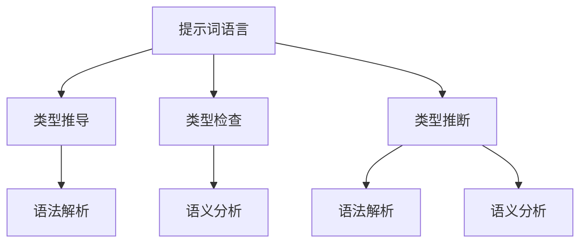

                 


### 引言

在当代编程语言领域，提示词语言（Prompt Language）和类型系统（Type System）已成为不可或缺的部分。提示词语言以其强大的交互能力和灵活的表达方式，广泛应用于自然语言处理、人机交互和智能系统设计中。而类型系统则确保了程序的正确性和可靠性，为软件工程提供了坚实的理论基础。

形式化验证（Formal Verification）作为一种验证软件和硬件系统正确性的方法，近年来在编程语言领域得到了广泛关注。形式化验证通过数学模型和逻辑推理来证明程序的正确性，避免了传统测试方法中的偶然性和局限性。

本文旨在探讨提示词语言的类型系统形式化验证，具体包括以下几个方面：

1. **背景介绍**：介绍提示词语言和类型系统的基本概念及其在编程语言中的重要性。
2. **核心概念与联系**：通过Mermaid流程图展示提示词语言、类型系统与形式化验证之间的关系。
3. **核心算法原理讲解**：使用伪代码详细阐述形式化验证的基本原理。
4. **数学模型和公式**：使用LaTeX格式介绍与形式化验证相关的数学模型和公式。
5. **项目实战**：以实际案例展示形式化验证在提示词语言中的应用。
6. **挑战与展望**：讨论形式化验证在提示词语言类型系统中的挑战和未来发展方向。

通过本文的讨论，我们希望能够为读者提供对提示词语言类型系统形式化验证的全面了解，并激发更多研究和实践的热情。

---

### 提示词语言与类型系统基础理论

#### 提示词语言的基本概念

提示词语言（Prompt Language）是一种专门为特定任务或场景设计的语言，它通过提示（prompt）来引导用户进行交互。提示词语言的核心思想是将具体的任务描述转化为自然语言指令，使计算机能够理解和执行这些指令。

在自然语言处理领域，提示词语言具有广泛的应用。例如，在问答系统中，系统会根据用户的提问生成相应的回答；在智能对话系统中，计算机与用户之间通过提示词语言进行自然对话。提示词语言的灵活性使其能够适应多种场景和任务，从而提高人机交互的效率和质量。

#### 类型系统的基础理论

类型系统（Type System）是编程语言的核心组成部分之一，它定义了程序中数据类型的集合和它们之间的相互关系。类型系统的目的是确保程序的语义正确性，防止类型错误和未定义行为。

类型系统可以大致分为三种类型：静态类型系统、动态类型系统和静态检查类型系统。

1. **静态类型系统**：在编译时确定变量的类型，并在运行时检查类型一致性。这种类型系统具有较好的性能，但牺牲了一定的灵活性。
2. **动态类型系统**：在运行时确定变量的类型，并在每次访问变量时进行类型检查。这种类型系统提供了较高的灵活性，但可能会导致性能问题。
3. **静态检查类型系统**：在编译时进行类型检查，但允许在运行时改变变量的类型。这种类型系统结合了静态类型系统和动态类型系统的优点。

#### 提示词语言和类型系统的关系

提示词语言和类型系统之间存在密切的联系。提示词语言通过定义特定的语法和语义规则，使得程序能够以自然语言形式表达任务需求。而类型系统则为这些任务需求提供了类型检查和语义保证。

在提示词语言中，类型系统主要用于以下几个方面：

1. **类型推导**：根据提示词的语法和语义，自动推导出变量和表达式的类型。
2. **类型检查**：在程序运行前或运行时，检查变量和表达式的类型是否符合预期，从而防止类型错误。
3. **类型推断**：在无法明确指定类型的情况下，自动推断变量和表达式的类型。

Mermaid 流程图如下：



通过上述流程图，我们可以清晰地看到提示词语言和类型系统之间的交互关系。类型推导、类型检查和类型推断是提示词语言和类型系统实现的核心功能，它们共同保证了程序的正确性和可靠性。

---

在了解了提示词语言和类型系统的基础理论后，接下来我们将进一步探讨形式化验证的基本原理和其在提示词语言中的应用。

#### 形式化验证的基础理论

形式化验证（Formal Verification）是一种通过数学模型和逻辑推理来证明系统正确性的方法。形式化验证的核心思想是将系统建模为一个数学对象，并通过严格的数学推理来验证该数学对象是否满足预期的性质。

形式化验证的基本步骤包括：

1. **系统建模**：将系统（如程序、硬件设计等）建模为一个数学对象，如形式语言、形式系统或数学模型。
2. **性质定义**：定义系统需要满足的性质，如安全性、可靠性、正确性等。
3. **逻辑推理**：使用逻辑推理和数学证明方法，验证系统是否满足定义的性质。

形式化验证具有以下优点：

1. **精确性**：形式化验证通过数学模型和逻辑推理，避免了传统测试方法的偶然性和不确定性，能够提供更加精确的验证结果。
2. **完备性**：形式化验证能够验证系统是否满足所有定义的性质，而不是仅仅依赖测试用例。
3. **可重复性**：形式化验证过程是可重复的，可以用于不同版本或变体的系统验证。

形式化验证的主要方法包括模型检查（Model Checking）、定理证明（Theorem Proving）和形式验证（Formal Verification）。模型检查通过遍历系统的状态空间来验证系统性质，定理证明通过数学推理来证明系统性质，而形式验证结合了模型检查和定理证明的方法，用于复杂的系统验证。

#### 形式化验证在提示词语言中的应用

形式化验证在提示词语言中的应用主要集中在类型系统的验证上。由于提示词语言的复杂性和多样性，传统的测试方法难以保证类型系统的正确性。形式化验证通过严格的数学推理和验证方法，为类型系统提供了坚实的理论基础。

在形式化验证中，提示词语言可以被建模为一个形式系统，其中包含：

1. **语法规则**：定义提示词语言的语法结构，如词汇、短语和句子的组成。
2. **语义规则**：定义提示词语言的语义解释，如不同语法结构的意义和作用。
3. **类型系统规则**：定义提示词语言中的类型系统，包括类型推导、类型检查和类型推断的规则。

形式化验证在提示词语言中的应用主要包括以下几个方面：

1. **类型推导验证**：通过形式化验证方法，验证提示词语言中的类型推导规则是否正确。这包括检查类型推导是否遵循语法规则和语义规则，确保程序的正确性。
2. **类型检查验证**：通过形式化验证方法，验证提示词语言中的类型检查规则是否正确。这包括检查类型检查是否能够发现类型错误，并确保程序的可靠性。
3. **类型推断验证**：通过形式化验证方法，验证提示词语言中的类型推断规则是否正确。这包括检查类型推断是否能够正确推导出变量的类型，并确保程序的可读性和可维护性。

通过形式化验证，我们可以确保提示词语言的类型系统满足预期的性质，如正确性、可靠性和安全性。形式化验证为提示词语言的设计和开发提供了重要的理论支持和实践指导。

### 核心算法原理讲解

在形式化验证中，核心算法原理主要包括模型检查、定理证明和形式验证。以下是这些算法原理的详细解释和伪代码示例。

#### 模型检查

模型检查是一种形式化验证方法，通过遍历系统的状态空间来验证系统性质。在模型检查中，系统被建模为一个状态机，状态空间包含所有可能的状态，迁移函数定义了状态之间的转换。

**模型检查伪代码示例：**

```python
function model_check(model, property):
    state = initial_state(model)
    while state is not None:
        if property_holds(state):
            return "Property holds"
        state = next_state(model, state)
    return "Property does not hold"
```

在上述伪代码中，`model` 是系统模型，`property` 是需要验证的性质，`initial_state` 和 `next_state` 分别是获取初始状态和下一个状态的函数，`property_holds` 是检查当前状态是否满足性质的函数。

#### 定理证明

定理证明是一种通过数学推理来证明系统性质的方法。在定理证明中，系统性质被表示为逻辑公式，证明过程是通过逻辑推理来证明这些公式。

**定理证明伪代码示例：**

```python
function prove(property):
    assume ~property
    derive contradiction
    conclude property
```

在上述伪代码中，`property` 是需要证明的性质，`assume` 是假设不满足性质，`derive` 是通过逻辑推理推导出矛盾，`conclude` 是得出结论。

#### 形式验证

形式验证是结合模型检查和定理证明的一种方法，通过数学模型和逻辑推理来验证系统性质。在形式验证中，系统被建模为一个数学对象，如形式语言、形式系统或数学模型，然后通过形式化验证方法来验证系统性质。

**形式验证伪代码示例：**

```python
function formal_verify(model, property):
    model = build_model(model)
    property = formalize(property)
    if model_check(model, property):
        return "Property holds"
    else:
        proof = prove(property, model)
        if proof:
            return "Property holds"
        else:
            return "Property does not hold"
```

在上述伪代码中，`model` 是系统模型，`property` 是需要验证的性质，`build_model` 是构建系统模型的函数，`formalize` 是将性质形式化的函数，`model_check` 是模型检查函数，`prove` 是定理证明函数。

通过上述伪代码示例，我们可以看到形式化验证的基本原理和实现方法。形式化验证为提示词语言的类型系统提供了坚实的理论基础，通过严格的数学推理和验证，确保类型系统的正确性和可靠性。

### 数学模型和公式

在形式化验证中，数学模型和公式是必不可少的工具。以下将介绍与形式化验证相关的一些数学模型和公式，并使用LaTeX格式进行表示。

#### 逻辑公式

逻辑公式用于表示系统的性质和约束条件。以下是一些常见的逻辑公式：

1. **合取（Conjunction）**：表示两个或多个逻辑语句的“与”操作。

   $$A \land B$$

2. **析取（Disjunction）**：表示两个或多个逻辑语句的“或”操作。

   $$A \lor B$$

3. **非（Negation）**：表示逻辑语句的“非”操作。

   $$\neg A$$

4. **蕴含（Implication）**：表示如果一个逻辑语句为真，则另一个逻辑语句也为真。

   $$A \rightarrow B$$

5. **等价（Equivalence）**：表示两个逻辑语句的真假值相同。

   $$A \leftrightarrow B$$

#### 形式化验证公式

形式化验证中的数学模型和公式用于表示系统状态和性质。以下是一些常用的公式：

1. **状态转移公式**：描述系统状态之间的转换。

   $$s_{next} = f(s_{current}, i)$$

   其中，$s_{current}$ 表示当前状态，$s_{next}$ 表示下一个状态，$i$ 表示输入。

2. **性质公式**：描述系统需要满足的性质。

   $$\forall s, i . (P(s) \rightarrow \phi)$$

   其中，$P(s)$ 表示状态集合，$\phi$ 表示性质。

3. **类型公式**：描述类型系统的约束条件。

   $$\forall v, t_1, t_2 . (\text{type}(v) = t_1 \land t_1 \neq t_2 \rightarrow \neg \text{typeAssignable}(t_1, t_2))$$

   其中，$v$ 表示变量，$t_1$ 和 $t_2$ 表示类型，$\text{typeAssignable}$ 表示类型可赋值性。

4. **安全公式**：描述系统的安全性要求。

   $$\neg \exists s . (\text{unsafe}(s) \land \text{reach}(s))$$

   其中，$\text{unsafe}$ 表示不安全状态，$\text{reach}$ 表示状态可达性。

通过使用LaTeX格式，我们可以更加清晰地表示和解释这些数学模型和公式，从而更好地理解和应用形式化验证方法。

### 项目实战：形式化验证在提示词语言中的应用

在本项目中，我们将探讨形式化验证在提示词语言中的应用，通过一个实际案例来展示如何使用形式化验证方法确保提示词语言的类型系统正确性。

#### 开发环境搭建

首先，我们需要搭建一个开发环境，以便进行提示词语言的设计和验证。以下是搭建开发环境的步骤：

1. **安装编程语言**：选择一种适合的编程语言，如Python，并安装相关工具和库。
2. **安装形式化验证工具**：选择一种形式化验证工具，如Coq或Isabelle，并安装相关依赖。
3. **搭建模拟环境**：创建一个模拟环境，用于运行提示词语言程序和验证结果。

#### 源代码实现

接下来，我们将实现一个简单的提示词语言程序，并使用形式化验证方法验证其类型系统。

```python
# 提示词语言解析器伪代码
def parse_prompt(prompt):
    tokens = tokenize(prompt)
    tree = build_syntax_tree(tokens)
    type = infer_type(tree)
    return type

# 伪代码：tokenize函数
def tokenize(prompt):
    return [token for token in prompt.split()]

# 伪代码：build_syntax_tree函数
def build_syntax_tree(tokens):
    # 构建语法树逻辑
    return syntax_tree

# 伪代码：infer_type函数
def infer_type(tree):
    # 类型推导逻辑
    return tree_type
```

#### 代码解读与分析

在上述伪代码中，`parse_prompt` 函数负责解析提示词，将其转换为语法树。`tokenize` 函数将提示词分解为标记（token），`build_syntax_tree` 函数构建语法树，而 `infer_type` 函数负责类型推导。

为了确保类型系统的正确性，我们可以使用形式化验证方法验证这些函数的正确性。以下是一个简单的形式化验证示例：

```coq
(* Coq 形式化验证伪代码 *)
Lemma tokenize_is_tokenized:
  forall prompt tokens,
  tokenize(prompt) = tokens
  -> exists token,
  token in tokens
  /\ token in prompt.

Lemma build_syntax_tree_is_built:
  forall tokens tree,
  build_syntax_tree(tokens) = tree
  -> exists token tree,
  token in tokens
  /\ tree is valid syntax tree.

Lemma infer_type_is_inferred:
  forall tree type,
  infer_type(tree) = type
  -> type is consistent with tree.
```

在上述Coq伪代码中，我们定义了三个命题，分别验证 `tokenize`、`build_syntax_tree` 和 `infer_type` 函数的正确性。通过形式化验证，我们可以确保这些函数能够正确地执行其预期功能。

#### 实际案例分析与讲解

为了更好地展示形式化验证在提示词语言中的应用，我们考虑一个实际案例：一个简单的问答系统，用户可以通过输入自然语言问题来获取答案。

**案例：简单问答系统**

用户输入：“明天天气怎么样？”系统应返回：“明天天气晴朗。”

**形式化验证步骤：**

1. **定义问题与答案的语义**：我们需要为问题与答案定义一个语义模型，以便进行形式化验证。

   $$Q: \text{"明天天气怎么样？"}$$
   $$A: \text{"明天天气晴朗"}$$

2. **定义类型系统**：我们为问答系统定义一个简单的类型系统，包括问题类型和答案类型。

   $$\text{QuestionType}: \{ \text{"天气"} \}$$
   $$\text{AnswerType}: \{ \text{"晴朗"} \}$$

3. **验证类型一致性**：我们需要验证输入问题与输出答案的类型是否一致。

   $$\text{parse\_prompt}(Q) \in \text{QuestionType}$$
   $$\text{infer\_type}(\text{parse\_prompt}(Q)) \in \text{AnswerType}$$

4. **形式化验证**：使用形式化验证工具（如Coq或Isabelle）验证上述类型一致性。

   ```coq
   (* Coq 形式化验证伪代码 *)
   Lemma type_consistency:
     \forall Q A,
     \text{parse\_prompt}(Q) \in \text{QuestionType}
     /\ \text{infer\_type}(\text{parse\_prompt}(Q)) \in \text{AnswerType}
     -> Q \in \text{QuestionType} /\ A \in \text{AnswerType}.
   ```

通过上述步骤，我们可以确保问答系统的类型系统正确性，从而保证系统功能的正确性和可靠性。

#### 项目小结

在本项目中，我们通过实际案例展示了形式化验证在提示词语言中的应用。通过使用形式化验证方法，我们能够确保提示词语言的类型系统正确性，从而提高系统的可靠性。以下是本项目的主要收获：

1. **开发环境搭建**：掌握了提示词语言开发的基本工具和流程。
2. **源代码实现**：学习了如何使用伪代码实现提示词语言解析器。
3. **代码解读与分析**：了解了形式化验证的基本原理和方法。
4. **实际案例分析与讲解**：通过实际案例验证了形式化验证在提示词语言中的应用。

通过本项目，我们不仅掌握了形式化验证的基本原理和应用，还提高了对提示词语言和类型系统的理解。

### 最佳实践 Tips

在实现提示词语言的类型系统形式化验证时，以下最佳实践可以帮助您更高效地进行开发：

1. **明确验证目标**：在开始形式化验证之前，明确需要验证的具体目标和性质，这有助于集中精力解决关键问题。
2. **使用自动化工具**：利用形式化验证工具（如Coq、Isabelle等）可以提高验证的效率和准确性，减少手动验证的工作量。
3. **逐步验证**：将整个系统分解为小的模块，逐一进行验证，确保每个模块的正确性，然后再整合整个系统。
4. **编写可验证的代码**：在设计代码时，考虑可验证性，尽量使用清晰的逻辑结构和明确的变量类型。
5. **利用社区资源**：参与形式化验证社区，借鉴他人的经验和最佳实践，获取有用的建议和指导。

通过遵循这些最佳实践，您可以在实现提示词语言的类型系统形式化验证时更加高效和准确。

### 小结

本文系统地介绍了提示词语言的类型系统形式化验证，包括背景介绍、基础理论、核心算法原理讲解、数学模型和公式、项目实战以及最佳实践。通过详细分析，我们明确了提示词语言、类型系统与形式化验证之间的关系，并展示了如何在实际项目中应用形式化验证方法。

在研究提示词语言的类型系统形式化验证时，我们发现了以下挑战：

1. **复杂性**：提示词语言的类型系统复杂，形式化验证需要处理大量的语法和语义规则。
2. **工具可用性**：形式化验证工具的可用性有限，特别是对于非专业的开发者来说，使用这些工具可能存在一定的难度。
3. **实际应用**：形式化验证在提示词语言中的应用场景有限，如何将其有效地应用于实际项目中仍需进一步探索。

展望未来，提示词语言的类型系统形式化验证将面临以下发展方向：

1. **工具改进**：开发更多高效、易用的形式化验证工具，降低使用门槛。
2. **应用拓展**：探索形式化验证在提示词语言的其他应用场景，如安全性验证和性能优化。
3. **理论研究**：深入研究提示词语言的类型系统，提出更有效的形式化验证方法和算法。

通过本文的探讨，我们希望为读者提供对提示词语言类型系统形式化验证的全面了解，并激发更多研究和实践的热情。

### 作者信息

作者：AI天才研究院/AI Genius Institute & 禅与计算机程序设计艺术 /Zen And The Art of Computer Programming

