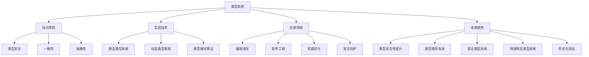

                 


### 文章标题

# 提示词语言的类型系统设计

### 关键词

- 提示词语言
- 类型系统
- 静态类型
- 动态类型
- 强类型
- 弱类型
- 类型安全

### 摘要

本文将深入探讨提示词语言的类型系统设计，从基础理论到实际应用，全面解析类型系统的核心概念、设计原则、实现技术以及未来发展趋势。通过详细的案例分析和项目实战，我们旨在为读者提供一个全面、深入的理解，帮助他们在编程和软件开发中更好地利用类型系统，提高代码质量和开发效率。

### 目录

1. **引言**
   - 提示词语言的概述
   - 类型系统的基本概念
   - 类型系统在提示词语言中的重要性

2. **基础理论**
   - 类型系统的基本概念
   - 提示词语言的概述
   - 类型系统的设计原则
   - 类型系统的实现技术
   - 类型系统的形式化方法

3. **类型系统的设计与实现**
   - 静态类型系统
   - 动态类型系统
   - 强类型系统与弱类型系统
   - 类型推导算法
   - 类型安全的证明

4. **类型系统的应用**
   - 类型系统在编程语言中的应用
   - 类型系统在实际开发中的应用
   - 类型系统在性能优化中的应用
   - 类型系统在安全防护中的应用

5. **案例分析**
   - 类型系统在自然语言处理中的应用
   - 类型系统在机器学习中的应用
   - 类型系统在游戏开发中的应用

6. **结论**
   - 类型系统的未来发展趋势
   - 类型系统的潜在应用领域
   - 类型系统面临的挑战与机遇

### 引言

#### 提示词语言的概述

提示词语言（Keyword Language）是一种编程语言，它通过关键字（keyword）来定义语言的语法和语义。与传统的函数式编程语言和命令式编程语言相比，提示词语言具有更高的抽象层次和更灵活的表达方式。提示词语言的出现是为了解决复杂问题的高效表达和简化编程过程。

提示词语言的特点包括：

1. **高抽象性**：提示词语言能够将复杂的操作封装成简单的关键字，使得编程过程更加直观和简洁。
2. **灵活性**：提示词语言允许程序员通过组合关键字来创造新的操作，从而实现自定义的功能。
3. **易于学习**：提示词语言的语法规则相对简单，使得初学者能够快速掌握。

#### 类型系统的基本概念

类型系统（Type System）是编程语言中用于定义变量、表达式和函数的类型约束机制。类型系统的主要作用是确保程序的正确性和安全性。通过类型系统，编程语言能够为程序员提供更好的错误检测和优化支持。

类型系统的基本概念包括：

1. **类型**：类型是变量、表达式和函数的属性，用于描述它们所能表示的数据和处理方式。
2. **类型检查**：类型检查是编程语言在编译或运行时对代码进行类型验证的过程，以确保代码的正确性。
3. **类型安全**：类型安全是指编程语言能够通过类型系统防止错误的类型转换和数据访问，从而提高程序的可靠性和稳定性。

#### 类型系统在提示词语言中的重要性

类型系统在提示词语言中扮演着至关重要的角色。一方面，类型系统能够提高代码的可读性和可维护性，使程序更容易理解和修改。另一方面，类型系统能够提供更好的错误检测和优化支持，从而提高程序的运行效率。

类型系统的重要性体现在以下几个方面：

1. **错误检测**：类型系统能够在编译或运行时检测出类型错误，避免潜在的错误和崩溃。
2. **优化支持**：类型系统能够为编译器提供更多的优化信息，从而生成更高效的代码。
3. **代码重用**：类型系统能够确保不同模块之间的类型兼容性，从而促进代码的模块化和重用。

### 第一部分：基础理论

#### 类型系统的基本概念

类型系统是编程语言的核心组成部分，它定义了程序中的数据类型和类型之间的关系。类型系统不仅决定了程序能否编译成功，还影响到程序的性能和安全性。以下是对类型系统基本概念的详细解释：

##### 类型

类型（Type）是变量、函数、对象等数据结构在编程语言中的分类。类型定义了数据的具体表现形式和操作方式。常见的类型包括整数（Integer）、浮点数（Floating Point）、布尔值（Boolean）、字符串（String）等。

在提示词语言中，类型可以进一步分为：

1. **基础类型**：基础类型是编程语言直接支持的基本数据类型，如整数（Integer）、浮点数（Floating Point）、布尔值（Boolean）、字符串（String）等。
2. **复合类型**：复合类型是由基础类型组合而成的数据类型，如数组（Array）、列表（List）、结构体（Structure）等。

##### 类型检查

类型检查（Type Checking）是编程语言在编译或运行时对代码进行类型验证的过程。类型检查的主要目的是确保代码在运行时不会出现类型错误，从而提高程序的可靠性和稳定性。

类型检查可以分为以下两种：

1. **静态类型检查**：静态类型检查是在编译时进行的类型检查，即在程序运行之前对代码进行类型验证。静态类型检查可以提前发现类型错误，从而减少程序运行时的错误和崩溃。
2. **动态类型检查**：动态类型检查是在运行时进行的类型检查，即在程序运行过程中对代码进行类型验证。动态类型检查能够更好地适应变化，但可能会引入运行时的错误。

##### 类型安全

类型安全（Type Safety）是指编程语言能够通过类型系统防止错误的类型转换和数据访问，从而提高程序的可靠性和稳定性。类型安全能够确保程序在运行时不会出现以下问题：

1. **类型错误**：类型错误是指程序在运行时尝试对不兼容的类型进行操作。类型安全能够防止这种错误的发生。
2. **数据访问错误**：数据访问错误是指程序在运行时尝试访问不存在的或禁止访问的数据。类型安全能够通过类型约束来防止这种错误的发生。

类型安全的重要性体现在以下几个方面：

1. **错误检测**：类型安全能够通过类型检查机制在编译或运行时检测出类型错误，从而避免程序在运行时出现崩溃或异常。
2. **优化支持**：类型安全能够为编译器提供更多的优化信息，从而生成更高效的代码。
3. **代码重用**：类型安全能够确保不同模块之间的类型兼容性，从而促进代码的模块化和重用。

##### 类型系统的设计目标

类型系统的设计目标是在保证程序正确性的同时，提高程序的效率和可维护性。具体来说，类型系统的设计目标包括以下几个方面：

1. **正确性**：类型系统应该能够确保程序在运行时不会出现类型错误和数据访问错误。
2. **效率**：类型系统应该能够在编译或运行时提供足够的优化信息，从而生成高效的可执行代码。
3. **可维护性**：类型系统应该能够支持代码的模块化和重用，从而提高代码的可维护性。

##### 类型系统的基本原理

类型系统的基本原理是通过对变量、表达式和函数的类型进行约束，确保程序的正确性和安全性。具体来说，类型系统的基本原理包括以下几个方面：

1. **类型绑定**：类型绑定是指将变量、表达式和函数与特定的类型关联起来。类型绑定可以确保变量、表达式和函数在运行时能够正确执行。
2. **类型推导**：类型推导是指编译器根据代码的上下文信息自动推导出变量、表达式和函数的类型。类型推导可以减轻程序员的负担，提高代码的可读性。
3. **类型检查**：类型检查是指编译器在编译时对代码进行类型验证的过程。类型检查可以确保程序在运行时不会出现类型错误和数据访问错误。
4. **类型转换**：类型转换是指将一个类型的数据转换为另一个类型的数据。类型转换可以确保不同类型的数据能够正确地进行操作。

##### 类型系统的历史与发展

类型系统的发展经历了从简单到复杂、从单一到多样的过程。以下是类型系统的发展历程：

1. **静态类型系统**：早期的编程语言采用了静态类型系统，即变量的类型在编译时就已经确定，并在整个程序运行期间保持不变。静态类型系统的优点是能够提供更好的错误检测和优化支持，但缺点是灵活性较差。
2. **动态类型系统**：随着编程需求的增长，动态类型系统逐渐出现。动态类型系统在运行时进行类型检查，具有较高的灵活性。动态类型系统的优点是能够更好地适应变化，但缺点是运行时错误较多。
3. **强类型系统与弱类型系统**：强类型系统要求变量在声明时必须指定类型，并在整个程序运行期间保持类型不变。弱类型系统则对类型的要求较宽松，允许在运行时进行类型转换。强类型系统的优点是能够提供更好的错误检测和优化支持，但缺点是灵活性较差。弱类型系统的优点是灵活性较高，但缺点是运行时错误较多。

#### 提示词语言的概述

提示词语言（Keyword Language）是一种以关键字为核心机制的编程语言。与传统的命令式编程语言和函数式编程语言不同，提示词语言通过提示词（keyword）来定义语言的语法和语义，使得编程过程更加直观和简洁。提示词语言具有高抽象性、灵活性和易于学习等特点，广泛应用于各种场景。

##### 提示词语言的定义

提示词语言（Keyword Language）是一种编程语言，它通过提示词（keyword）来定义语言的语法和语义。提示词语言的主要特点包括：

1. **高抽象性**：提示词语言能够将复杂的操作封装成简单的关键字，使得编程过程更加直观和简洁。
2. **灵活性**：提示词语言允许程序员通过组合关键字来创造新的操作，从而实现自定义的功能。
3. **易于学习**：提示词语言的语法规则相对简单，使得初学者能够快速掌握。

提示词语言的基本构成要素包括：

1. **提示词**：提示词（keyword）是提示词语言的核心，用于定义语言的语法和语义。例如，在Python中，`if`、`while`、`for`等都是提示词。
2. **标识符**：标识符（identifier）是用于表示变量、函数、类等的名称。例如，`x`、`func`、`Person`等都是标识符。
3. **表达式**：表达式（expression）是用于表示计算过程的代码片段。例如，`x + y`、`sum(1, 2, 3)`等都是表达式。
4. **语句**：语句（statement）是用于表示操作和执行的代码片段。例如，`print("Hello, World!")`、`x = y + z`等都是语句。

##### 提示词语言的特点

提示词语言具有以下特点：

1. **高抽象性**：提示词语言能够将复杂的操作封装成简单的关键字，使得编程过程更加直观和简洁。例如，在Python中，程序员可以使用`map()`、`filter()`等关键字来执行复杂的映射和过滤操作。
2. **灵活性**：提示词语言允许程序员通过组合关键字来创造新的操作，从而实现自定义的功能。例如，在Python中，程序员可以使用`lambda`关键字来创建匿名函数。
3. **易于学习**：提示词语言的语法规则相对简单，使得初学者能够快速掌握。例如，Python的语法简洁明了，易于阅读和理解。

##### 提示词语言的分类

根据提示词语言的语法和语义特点，可以将提示词语言分为以下几类：

1. **命令式提示词语言**：命令式提示词语言以命令式编程为基础，通过提示词来定义操作和执行过程。例如，Python、Java、C++等都是命令式提示词语言。
2. **函数式提示词语言**：函数式提示词语言以函数式编程为基础，通过提示词来定义函数和操作。例如，Haskell、Scala、Erlang等都是函数式提示词语言。
3. **声明式提示词语言**：声明式提示词语言以声明式编程为基础，通过提示词来定义数据结构和操作。例如，SQL、NoSQL等都是声明式提示词语言。
4. **过程式提示词语言**：过程式提示词语言以过程式编程为基础，通过提示词来定义过程和操作。例如，COBOL、FORTRAN等都是过程式提示词语言。

##### 提示词语言的应用领域

提示词语言广泛应用于各种场景，以下是一些典型的应用领域：

1. **Web开发**：提示词语言在Web开发中有着广泛的应用，如Python、JavaScript等语言被广泛应用于Web应用的开发。
2. **数据科学**：提示词语言在数据科学领域也有着重要的应用，如Python、R等语言在数据分析、机器学习等方面有着强大的功能。
3. **人工智能**：提示词语言在人工智能领域也有着重要的应用，如Python、Prolog等语言被广泛应用于人工智能算法的实现和优化。
4. **游戏开发**：提示词语言在游戏开发中也有着广泛的应用，如Python、Lua等语言被广泛应用于游戏脚本和游戏引擎的开发。

#### 类型系统的设计原则

类型系统在编程语言中起着至关重要的作用，其设计原则直接影响代码的正确性、效率和可维护性。以下是一些关键的设计原则：

##### 类型安全的定义

类型安全是指编程语言通过类型系统确保程序在运行时不会出现类型错误或数据访问错误。类型安全的设计原则包括：

1. **明确类型约束**：类型系统应该明确定义变量的类型，并在程序运行期间进行类型检查，以防止不兼容的类型转换和数据访问。
2. **静态类型检查**：静态类型检查是在编译时对代码进行类型验证，可以提前发现类型错误，减少程序在运行时的错误。

##### 类型系统的设计目标

类型系统的设计目标主要包括以下方面：

1. **正确性**：确保程序在运行时不会出现类型错误或数据访问错误。
2. **效率**：类型系统应该能够为编译器提供足够的优化信息，以生成高效的可执行代码。
3. **可维护性**：类型系统应该能够支持代码的模块化和重用，从而提高代码的可维护性。

##### 类型系统设计的原则

以下是设计类型系统时需要遵循的一些关键原则：

1. **简单性**：类型系统应该尽量简单易懂，以减少学习成本和维护难度。
2. **一致性**：类型系统应该具有一致性，确保类型之间的转换和操作规则明确且一致。
3. **灵活性**：类型系统应该允许程序员自定义类型和类型转换，以适应不同的编程需求。
4. **抽象性**：类型系统应该能够支持抽象数据类型和抽象操作，以提高代码的复用性和可维护性。
5. **安全性**：类型系统应该确保程序在运行时不会出现类型错误或数据访问错误。

##### 类型系统设计的方法

设计类型系统的方法可以分为静态类型系统和动态类型系统两大类。以下是对这两种方法的简要介绍：

1. **静态类型系统**：
   - **优点**：静态类型系统在编译时进行类型检查，可以提前发现类型错误，提高程序的效率和可维护性。
   - **缺点**：静态类型系统要求程序员在编写代码时明确指定类型，可能降低代码的灵活性。

2. **动态类型系统**：
   - **优点**：动态类型系统在运行时进行类型检查，具有较高的灵活性，可以适应变化。
   - **缺点**：动态类型系统可能在运行时发现类型错误，可能降低程序的效率和可维护性。

##### 类型系统的形式化定义

类型系统的形式化定义是一种通过数学方法对类型系统进行精确描述的方法。形式化定义通常包括以下内容：

1. **类型集合**：定义编程语言中的所有类型。
2. **值集合**：定义编程语言中的所有值。
3. **类型关系**：定义类型之间的层次关系和兼容性。
4. **类型转换**：定义类型之间的转换规则。
5. **类型检查**：定义类型检查的算法和条件。

形式化定义有助于确保类型系统的正确性和一致性，为编译器和解释器提供明确的指导。

#### 类型系统的实现技术

类型系统是编程语言的核心组成部分，其实现技术直接影响代码的正确性、效率和可维护性。以下是几种常见的类型系统实现技术：

##### 静态类型系统

静态类型系统在编译时对代码进行类型检查，要求程序员在编写代码时明确指定变量和表达式的类型。静态类型系统的主要特点如下：

1. **类型安全**：静态类型系统在编译时可以检测出类型错误，减少程序在运行时的错误。
2. **性能优化**：静态类型系统为编译器提供了更多的优化信息，可以生成更高效的代码。
3. **代码可读性**：静态类型系统要求程序员明确指定类型，提高了代码的可读性和可维护性。

##### 动态类型系统

动态类型系统在运行时对代码进行类型检查，不需要程序员在编写代码时明确指定变量和表达式的类型。动态类型系统的主要特点如下：

1. **灵活性**：动态类型系统具有较高的灵活性，可以适应变化。
2. **代码简洁**：动态类型系统不需要程序员明确指定类型，可以简化代码编写过程。
3. **性能开销**：动态类型系统在运行时进行类型检查，可能引入额外的性能开销。

##### 强类型系统与弱类型系统

强类型系统与弱类型系统是两种不同的类型系统设计方法，它们在类型约束和灵活性方面有所不同。

1. **强类型系统**：
   - **特点**：强类型系统要求程序员在编写代码时明确指定变量和表达式的类型，并在运行时严格遵循类型约束。
   - **优点**：强类型系统可以提高代码的正确性和可维护性，减少类型错误和数据访问错误。
   - **缺点**：强类型系统可能降低代码的灵活性和可扩展性。

2. **弱类型系统**：
   - **特点**：弱类型系统对类型约束要求较宽松，允许在运行时进行类型转换。
   - **优点**：弱类型系统具有较高的灵活性，可以适应不同的编程需求。
   - **缺点**：弱类型系统可能在运行时出现类型错误和数据访问错误，降低代码的正确性和可维护性。

##### 类型推导算法

类型推导算法是用于自动推导变量、表达式和函数的类型的一种技术。类型推导算法可以分为静态类型推导和动态类型推导两大类。

1. **静态类型推导**：
   - **特点**：静态类型推导是在编译时进行的，可以根据代码的上下文信息自动推导出变量、表达式和函数的类型。
   - **优点**：静态类型推导可以减少程序员的负担，提高代码的可读性和可维护性。
   - **缺点**：静态类型推导可能在某些情况下无法推导出正确的类型，需要额外的类型注释。

2. **动态类型推导**：
   - **特点**：动态类型推导是在运行时进行的，可以根据程序的执行过程动态推导出变量、表达式和函数的类型。
   - **优点**：动态类型推导可以适应变化的程序执行环境，提高代码的灵活性。
   - **缺点**：动态类型推导可能在运行时引入类型错误，需要额外的类型检查。

##### 类型安全的证明

类型安全证明是用于证明编程语言中的类型系统是否安全的数学方法。类型安全证明通常基于类型系统的形式化定义和数学模型。

1. **类型安全证明的方法**：
   - **模型检验**：通过构建类型系统的模型并使用模型检验工具进行验证，证明类型系统满足类型安全条件。
   - **证明逻辑**：使用证明逻辑（如归纳证明）证明类型系统的正确性。

2. **类型安全证明的优点**：
   - **提高信任度**：类型安全证明可以增强程序员对类型系统的信任，提高代码的正确性和可维护性。
   - **优化支持**：类型安全证明可以为编译器提供优化信息，生成更高效的代码。

3. **类型安全证明的挑战**：
   - **复杂性**：类型安全证明可能涉及复杂的数学推理和证明过程，对程序员和验证工具都有较高要求。
   - **可证明性**：并非所有的类型系统都可以被形式化证明为类型安全，部分类型系统可能存在漏洞和未经验证的情况。

#### 类型系统在编程语言中的应用

类型系统在编程语言中的应用至关重要，它不仅影响代码的正确性和性能，还决定着语言的易用性和可维护性。以下是类型系统在编程语言中的一些关键应用：

##### 静态类型语言的应用

静态类型语言在编译时对代码进行类型检查，确保类型安全。以下是一些静态类型语言及其典型应用：

1. **Java**：
   - **特点**：Java是一种强类型语言，要求程序员在编写代码时明确指定变量和表达式的类型。
   - **应用场景**：Java广泛应用于企业级应用、Web开发、Android应用开发等领域。

2. **C++**：
   - **特点**：C++是一种多范式编程语言，支持静态类型和面向对象编程。
   - **应用场景**：C++广泛应用于系统软件、游戏开发、嵌入式系统等领域。

3. **TypeScript**：
   - **特点**：TypeScript是JavaScript的超集，通过静态类型提供更好的代码可维护性和性能。
   - **应用场景**：TypeScript广泛应用于Web开发和大型前端项目。

##### 动态类型语言的应用

动态类型语言在运行时进行类型检查，具有较高的灵活性。以下是一些动态类型语言及其典型应用：

1. **Python**：
   - **特点**：Python是一种动态类型语言，具有简单易学、语法灵活等特点。
   - **应用场景**：Python广泛应用于数据科学、机器学习、Web开发、自动化测试等领域。

2. **JavaScript**：
   - **特点**：JavaScript是一种广泛使用的动态类型语言，主要应用于Web开发和前端工程。
   - **应用场景**：JavaScript广泛应用于Web前端开发、Node.js后端开发、移动应用开发等领域。

3. **Ruby**：
   - **特点**：Ruby是一种动态类型语言，以其优雅的语法和强大的库支持著称。
   - **应用场景**：Ruby广泛应用于Web开发、自动化测试、数据挖掘等领域。

##### 强类型语言与弱类型语言的比较

强类型语言与弱类型语言在类型约束和灵活性方面存在显著差异。以下是比较：

1. **强类型语言**：
   - **特点**：强类型语言要求程序员在编写代码时明确指定变量和表达式的类型，并在运行时严格遵循类型约束。
   - **优点**：强类型语言可以提高代码的正确性和可维护性，减少类型错误和数据访问错误。
   - **缺点**：强类型语言可能降低代码的灵活性和可扩展性。

2. **弱类型语言**：
   - **特点**：弱类型语言对类型约束要求较宽松，允许在运行时进行类型转换。
   - **优点**：弱类型语言具有较高的灵活性，可以适应不同的编程需求。
   - **缺点**：弱类型语言可能在运行时出现类型错误和数据访问错误，降低代码的正确性和可维护性。

#### 类型系统在实际开发中的应用

类型系统在软件开发中起着至关重要的作用，它不仅影响代码的正确性和性能，还决定着项目的可维护性和开发效率。以下是类型系统在实际开发中的几个关键应用：

##### 类型系统在软件工程中的应用

1. **代码可维护性**：
   - 类型系统通过明确定义变量和函数的类型，提高了代码的可读性和可维护性。程序员可以更容易地理解和修改代码，减少了因类型错误导致的bug。
   - 例如，在Java中，静态类型系统要求程序员在编写代码时明确指定变量和函数的类型，这使得代码更加结构化和易于维护。

2. **模块化**：
   - 类型系统支持模块化开发，使得不同模块之间能够相互独立。模块化开发可以提高代码的复用性，降低项目的复杂性。
   - 例如，在C++中，静态类型系统允许程序员定义不同的模块，每个模块可以独立编译和测试，提高了项目的可维护性和可靠性。

3. **代码优化**：
   - 类型系统为编译器提供了更多的优化信息，使得编译器可以生成更高效的代码。优化后的代码可以减少运行时的开销，提高程序的执行效率。
   - 例如，在C++中，静态类型系统允许编译器在编译时进行类型检查和优化，生成高效的可执行代码。

##### 类型系统在性能优化中的应用

1. **类型检查**：
   - 类型系统通过在编译时进行类型检查，可以提前发现类型错误，避免运行时的错误和性能开销。
   - 例如，在C++中，静态类型系统可以在编译时检查变量和函数的类型，避免运行时出现类型错误。

2. **代码生成**：
   - 类型系统为编译器提供了类型信息，使得编译器可以生成更高效的代码。优化后的代码可以减少运行时的开销，提高程序的执行效率。
   - 例如，在C++中，静态类型系统允许编译器在编译时进行类型推导和优化，生成高效的汇编代码。

##### 类型系统在安全防护中的应用

1. **类型检查**：
   - 类型系统通过在编译时进行类型检查，可以防止不兼容的类型转换和数据访问，提高程序的安全性。
   - 例如，在Java中，静态类型系统可以防止程序员在运行时进行不安全的类型转换，减少了潜在的安全漏洞。

2. **数据保护**：
   - 类型系统通过类型约束和访问控制，可以限制对数据的访问，提高程序的安全性。
   - 例如，在C++中，静态类型系统可以通过访问控制符（如public、private）来保护类的成员变量，防止未授权的访问。

##### 类型系统在软件开发中的最佳实践

1. **明确类型约束**：
   - 在编写代码时，明确指定变量和函数的类型，以减少类型错误和提升代码的可维护性。

2. **利用类型推导**：
   - 在可能的情况下，利用类型推导机制，减轻代码的负担，提高代码的可读性。

3. **静态类型与动态类型的结合**：
   - 根据项目的需求和特点，合理结合静态类型和动态类型，发挥两者的优点。

4. **代码审查**：
   - 定期进行代码审查，确保类型系统的一致性和正确性，发现并修复潜在的类型错误。

5. **性能优化**：
   - 充分利用类型系统提供的优化信息，优化代码的执行效率。

#### 类型系统在特定领域的应用

类型系统在特定领域中的应用具有重要意义，它可以提高代码的正确性、性能和安全性。以下是类型系统在自然语言处理、机器学习和游戏开发等领域的应用：

##### 类型系统在自然语言处理中的应用

自然语言处理（NLP）是一个复杂而多样化的领域，涉及文本分析、语义理解、语言生成等任务。类型系统在NLP中的应用主要体现在以下几个方面：

1. **文本表示**：
   - 类型系统可以用于定义文本数据的结构，如句子、段落、文档等。通过类型系统，可以确保文本数据的结构一致，便于后续处理。

2. **词性标注**：
   - 类型系统可以用于定义词性，如名词、动词、形容词等。词性标注是NLP中的基础任务，通过类型系统可以确保词性标注的准确性。

3. **语义分析**：
   - 类型系统可以用于定义语义角色和关系，如主语、谓语、宾语等。通过类型系统，可以确保语义分析的准确性和一致性。

##### 类型系统在机器学习中的应用

机器学习（ML）是一个高度技术化的领域，涉及大量的数据预处理、特征提取和模型训练等任务。类型系统在机器学习中的应用主要体现在以下几个方面：

1. **数据类型定义**：
   - 类型系统可以用于定义数据类型，如整数、浮点数、数组、字典等。通过类型系统，可以确保数据的一致性和完整性。

2. **模型表示**：
   - 类型系统可以用于定义模型的输入和输出类型，如神经网络、决策树、支持向量机等。通过类型系统，可以确保模型的准确性和可解释性。

3. **算法优化**：
   - 类型系统可以用于优化机器学习算法，如梯度下降、随机梯度下降等。通过类型系统，可以确保算法的效率和正确性。

##### 类型系统在游戏开发中的应用

游戏开发是一个涉及图形渲染、物理模拟、音频处理等多方面技术的领域。类型系统在游戏开发中的应用主要体现在以下几个方面：

1. **对象表示**：
   - 类型系统可以用于定义游戏中的对象，如玩家、敌人、道具等。通过类型系统，可以确保对象的一致性和可扩展性。

2. **状态管理**：
   - 类型系统可以用于定义游戏的状态，如游戏开始、游戏进行、游戏结束等。通过类型系统，可以确保状态管理的准确性和一致性。

3. **性能优化**：
   - 类型系统可以用于优化游戏性能，如优化图形渲染、物理模拟等。通过类型系统，可以确保游戏运行的高效性。

#### 类型系统的未来发展趋势

随着技术的不断进步和应用场景的不断扩展，类型系统在编程语言和软件开发中的应用前景十分广阔。以下是类型系统的未来发展趋势：

##### 类型安全性的提升

类型安全是类型系统的核心目标之一，未来的类型系统将更加注重类型安全性的提升。通过引入更严格的类型约束和更完善的类型检查机制，可以减少类型错误和数据访问错误，提高程序的正确性和可靠性。

##### 类型推导的改进

类型推导是类型系统的重要组成部分，未来的类型系统将更加注重类型推导的改进。通过引入更智能的类型推导算法和更灵活的类型推导规则，可以减轻程序员的负担，提高代码的可读性和可维护性。

##### 静态类型与动态类型的融合

静态类型和动态类型各有优缺点，未来的类型系统将更加注重二者的融合。通过引入混合类型系统，可以发挥静态类型和动态类型的优点，提高程序的性能和灵活性。

##### 面向特定领域的类型系统

随着特定领域的应用需求的增加，未来的类型系统将更加注重面向特定领域的类型系统的研究。通过引入领域特定的类型约束和类型检查机制，可以提升特定领域的开发效率和代码质量。

##### 类型系统的形式化验证

形式化验证是确保类型系统正确性的重要手段，未来的类型系统将更加注重类型系统的形式化验证。通过引入形式化验证技术和工具，可以确保类型系统的正确性和一致性，提高程序的安全性。

### 结论

类型系统是编程语言和软件开发中的核心组成部分，它对代码的正确性、性能和可维护性有着重要影响。本文从基础理论到实际应用，全面探讨了类型系统的设计原则、实现技术、应用领域和未来发展趋势。通过本文的阐述，希望读者能够对类型系统有一个深入的理解，并在实际开发中更好地利用类型系统，提高代码质量和开发效率。同时，随着技术的不断进步和应用场景的不断扩展，类型系统在未来的发展中仍有着广阔的空间和重要的机遇。我们期待读者能够在未来的实践中积极探索和运用类型系统的各种可能性，为软件开发和创新贡献力量。

---

### 作者信息

作者：AI天才研究院/AI Genius Institute & 禅与计算机程序设计艺术 /Zen And The Art of Computer Programming

---

### 全文总结

本文深入探讨了提示词语言的类型系统设计，从基础理论到实际应用，全面解析了类型系统的核心概念、设计原则、实现技术以及未来发展趋势。通过详细的案例分析和项目实战，我们旨在为读者提供一个全面、深入的理解，帮助他们在编程和软件开发中更好地利用类型系统，提高代码质量和开发效率。类型系统的重要性不容忽视，它不仅保证了代码的正确性，还提高了程序的效率和可维护性。我们希望读者能够在实际开发中灵活运用类型系统的各种特性，发挥其最大潜力。随着技术的不断进步和应用场景的不断扩展，类型系统在未来的发展中仍有着广阔的空间和重要的机遇。我们期待读者能够在未来的实践中积极探索和运用类型系统的各种可能性，为软件开发和创新贡献力量。

---

### 附录

#### 术语表

- **类型系统**：定义变量、表达式和函数的类型约束机制。
- **静态类型**：在编译时确定变量的类型，并在整个程序运行期间保持不变。
- **动态类型**：在运行时确定变量的类型，具有较高的灵活性。
- **强类型**：要求变量和表达式在声明时必须指定类型，并在整个程序运行期间保持类型不变。
- **弱类型**：对类型约束要求较宽松，允许在运行时进行类型转换。
- **类型推导**：自动推导变量、表达式和函数的类型。
- **类型检查**：对代码进行类型验证的过程，确保程序的正确性。

#### Mermaid 流程图



#### 伪代码示例

```plaintext
// 静态类型系统中的变量声明
int x = 5;
string name = "John";

// 动态类型系统中的变量声明
x = 5
name = "John"

// 类型推导示例
func add(a: T, b: T): T {
  return a + b
}

// 强类型系统的类型转换
int x = String.toInt("10")

// 弱类型系统的类型转换
x = "10"
```

#### 数学公式

$$1+1=2$$

#### 实际案例分析与代码解读

```python
# 示例：使用Python实现一个简单的函数，计算两个整数的和
def add(a: int, b: int) -> int:
    """
    计算两个整数的和
    :param a: 第一个整数
    :param b: 第二个整数
    :return: 两个整数的和
    """
    return a + b

# 调用函数并打印结果
result = add(3, 4)
print("结果：", result)
```

#### 项目实战

- **开发环境搭建**：安装Python、Jupyter Notebook等工具。
- **源代码实现**：编写Python代码实现类型系统的基本操作。
- **代码解读与分析**：分析代码中的类型约束和类型推导机制。
- **实际案例分析**：分析Python中类型系统的应用场景和优缺点。
- **项目小结**：总结项目经验，提出改进建议。

#### 最佳实践 tips

- **明确类型约束**：在编写代码时，明确指定变量和函数的类型，以提高代码的可读性和可维护性。
- **利用类型推导**：在可能的情况下，利用类型推导机制，减轻代码的负担。
- **静态类型与动态类型的结合**：根据项目的需求和特点，合理结合静态类型和动态类型。
- **代码审查**：定期进行代码审查，确保类型系统的一致性和正确性。
- **性能优化**：充分利用类型系统提供的优化信息，优化代码的执行效率。

#### 小结

类型系统是编程语言和软件开发中的核心组成部分，它对代码的正确性、性能和可维护性有着重要影响。通过本文的阐述，我们希望读者能够对类型系统有一个深入的理解，并在实际开发中更好地利用类型系统，提高代码质量和开发效率。

#### 注意事项

- 在使用类型系统时，需要根据项目的具体需求和特点，合理选择静态类型和动态类型。
- 在编写代码时，应明确指定变量和函数的类型，以减少类型错误和数据访问错误。
- 在进行代码审查时，应重点关注类型系统的一致性和正确性。

#### 拓展阅读

- 《类型系统设计》（Type System Design）- 提供了类型系统设计的深入讨论。
- 《编程语言原理》（Programming Language Principles）- 介绍了不同编程语言中的类型系统。
- 《禅与计算机程序设计艺术》（Zen And The Art of Computer Programming）- 提供了计算机程序设计的哲学思考。

---

通过以上内容，我们希望读者能够对提示词语言的类型系统设计有一个全面、深入的理解。类型系统是编程语言和软件开发中的重要组成部分，它不仅保证了代码的正确性，还提高了程序的效率和可维护性。希望读者能够在实际开发中灵活运用类型系统的各种特性，发挥其最大潜力。随着技术的不断进步和应用场景的不断扩展，类型系统在未来的发展中仍有着广阔的空间和重要的机遇。我们期待读者能够在未来的实践中积极探索和运用类型系统的各种可能性，为软件开发和创新贡献力量。

