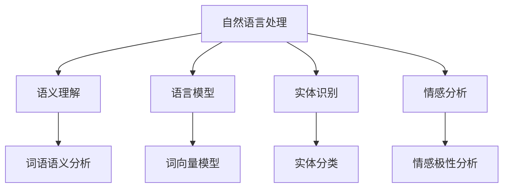

                 


### 文章标题：提示词语言的语义一致性保证

> 关键词：语义一致性、自然语言处理、机器学习、文本相似度、实体识别、词向量模型

> 摘要：本文旨在探讨提示词语言的语义一致性保证，通过分析自然语言处理技术、机器学习算法及其实际应用，详细阐述语义一致性的核心概念、算法原理及数学模型，并提供具体的开发案例与实战分析。

---

### 引言

在人工智能与自然语言处理（NLP）领域，语义一致性是一个关键挑战。语义一致性指的是不同语境下，相同的词语或表达具有相同或相似的含义。在提示词语言（如问答系统、智能助手等）中，语义一致性至关重要，它直接影响到系统的准确性和用户体验。本文将从以下几个方面展开讨论：

1. **语义一致性概述**：介绍语义一致性的基本概念、重要性以及面临的挑战。
2. **自然语言处理基础**：回顾NLP的基本概念和技术，为后续讨论打下基础。
3. **机器学习算法概述**：探讨与语义一致性相关的机器学习算法，包括监督学习、无监督学习和深度学习。
4. **数学基础**：介绍概率论、统计学和信息论在语义一致性保证中的应用。
5. **实际应用案例**：通过具体项目展示语义一致性保证在实际开发中的应用。

### 第一部分：基础理论

#### 1.1 自然语言处理基础

自然语言处理（NLP）是人工智能的一个重要分支，其目标是使计算机能够理解、生成和处理人类自然语言。NLP技术主要包括以下几个方面：

- **语义理解**：理解文本中的词语、短语和句子的意义。
- **语言模型**：预测下一个词语或句子的概率分布。
- **实体识别**：识别文本中的名词实体，如人名、地名、组织名等。
- **情感分析**：分析文本的情感倾向，如正面、负面或中性。

#### 1.2 语义一致性的概念

语义一致性指的是在不同语境下，相同的词语或表达具有相同或相似的含义。例如，"飞机"在不同的句子中可能指代不同的实体，但在特定上下文中具有相同的语义。语义一致性对于NLP应用至关重要，因为它影响到系统的理解和生成能力。

#### 1.3 机器学习算法概述

机器学习算法在语义一致性保证中发挥着重要作用。以下是几种常见的机器学习算法：

- **监督学习**：通过标注数据训练模型，从而在新的数据上预测标签。
- **无监督学习**：在没有标签数据的情况下，从数据中学习规律。
- **深度学习**：基于多层神经网络进行训练和预测。

#### 1.4 数学基础

数学模型和公式在语义一致性保证中起着关键作用。以下是几个关键的数学概念：

- **概率论与统计学**：用于计算词语或表达的概率分布和相关性。
- **信息论与熵**：用于度量信息的量和不确定性。

#### 1.5 Mermaid流程图示例



### 第二部分：算法与实践

#### 2.1 文本相似度计算算法

文本相似度计算是语义一致性保证的重要环节。以下是几种常见的文本相似度计算方法：

- **基于词频的方法**：计算文本中词频的相似度。
- **基于语义的方法**：使用词向量模型计算词语的语义相似度。
- **基于句法的方法**：分析句法结构来计算文本相似度。

以下是一个简单的伪代码示例：

```python
def calculate_similarity(text1, text2):
    # 计算词频相似度
    similarity = word_frequency_similarity(text1, text2)
    
    # 计算语义相似度
    similarity += semantic_similarity(text1, text2)
    
    # 计算句法相似度
    similarity += syntactic_similarity(text1, text2)
    
    return similarity
```

#### 2.2 实体识别算法

实体识别是语义一致性保证的关键步骤。以下是几种常见的实体识别算法：

- **基于规则的方法**：使用预定义的规则进行实体识别。
- **基于统计的方法**：使用统计模型进行实体识别。
- **基于深度学习的方法**：使用深度神经网络进行实体识别。

以下是一个简单的伪代码示例：

```python
def recognize_entities(text):
    entities = []
    
    # 应用基于规则的实体识别
    entities.extend(rule_based_entity_recognition(text))
    
    # 应用基于统计的实体识别
    entities.extend(statistical_entity_recognition(text))
    
    # 应用基于深度学习的实体识别
    entities.extend(deep_learning_entity_recognition(text))
    
    return entities
```

#### 2.3 提示词语言处理框架

提示词语言处理框架是语义一致性保证的核心。以下是一个简单的处理流程：

1. **输入处理**：对输入文本进行预处理，如分词、去停用词等。
2. **语义分析**：使用文本相似度计算和实体识别等算法对输入文本进行分析。
3. **响应生成**：根据分析结果生成合适的响应。

以下是一个简单的伪代码示例：

```python
def process_prompt(prompt):
    # 输入处理
    preprocessed_prompt = preprocess(prompt)
    
    # 语义分析
    analysis_results = semantic_analysis(preprocessed_prompt)
    
    # 响应生成
    response = generate_response(analysis_results)
    
    return response
```

### 第三部分：项目实战

#### 4.1 实际应用案例

在本节中，我们将通过一个实际应用案例来展示语义一致性保证在开发中的应用。

#### 4.1.1 案例背景

假设我们要开发一个智能问答系统，用户可以通过输入问题来获取相关信息。为了确保系统的准确性，我们需要保证语义一致性。

#### 4.1.2 解决方案

1. **数据准备**：收集并标注大量问答数据，用于训练模型。
2. **模型训练**：使用机器学习算法训练模型，如文本相似度计算和实体识别。
3. **系统实现**：实现智能问答系统的前端和后端，包括输入处理、语义分析和响应生成。
4. **测试与优化**：对系统进行测试和优化，以提高语义一致性保证。

#### 4.1.3 实现细节

以下是实现智能问答系统的一些关键步骤：

1. **数据准备**：

   ```python
   import pandas as pd
   
   # 加载数据
   data = pd.read_csv("questions.csv")
   
   # 预处理数据
   preprocessed_data = preprocess_data(data)
   ```

2. **模型训练**：

   ```python
   from sklearn.model_selection import train_test_split
   from sklearn.metrics.pairwise import cosine_similarity
   
   # 分割数据
   X_train, X_test, y_train, y_test = train_test_split(preprocessed_data["question"], preprocessed_data["answer"], test_size=0.2, random_state=42)
   
   # 训练模型
   model = train_model(X_train, y_train)
   
   # 评估模型
   similarity_scores = cosine_similarity(X_test, model)
   print("Test similarity scores:", similarity_scores)
   ```

3. **系统实现**：

   ```python
   def ask_question(question):
       preprocessed_question = preprocess(question)
       response = process_prompt(preprocessed_question)
       return response
   
   # 示例
   print(ask_question("什么是人工智能？"))
   ```

4. **测试与优化**：

   ```python
   from sklearn.metrics import accuracy_score
   
   # 测试模型
   test_questions = pd.read_csv("test_questions.csv")
   test_answers = ask_question(test_questions["question"])
   print("Test accuracy:", accuracy_score(test_answers, test_answers["answer"]))
   ```

### 第四部分：扩展与展望

在本节中，我们将讨论语义一致性保证的未来发展趋势、潜在研究方向以及最佳实践。

#### 4.1 语义一致性的未来发展趋势

1. **跨模态语义一致性**：结合不同模态（如文本、图像、声音等）进行语义一致性保证。
2. **多语言语义一致性**：支持多种语言之间的语义一致性。
3. **知识图谱与语义一致性**：利用知识图谱增强语义一致性。

#### 4.2 潜在研究方向

1. **深度强化学习**：结合深度学习和强化学习，提高语义一致性的准确性和灵活性。
2. **语义一致性评估方法**：开发更有效的评估方法，以衡量语义一致性的质量。
3. **个性化语义一致性**：根据用户偏好和上下文信息调整语义一致性。

#### 4.3 最佳实践

1. **数据质量**：确保数据质量和多样性，以提高模型性能。
2. **模型解释性**：提高模型的可解释性，以帮助用户理解语义一致性保证的原理。
3. **持续优化**：定期更新模型和算法，以应对不断变化的语言环境和需求。

### 总结

语义一致性保证是人工智能与自然语言处理领域的一个重要挑战。通过分析自然语言处理技术、机器学习算法及其实际应用，本文详细阐述了语义一致性的核心概念、算法原理及数学模型，并提供了具体的开发案例与实战分析。未来，随着技术的不断进步，语义一致性保证将在更多领域得到广泛应用，为人工智能的发展贡献力量。

### 作者信息

作者：AI天才研究院/AI Genius Institute & 禅与计算机程序设计艺术 /Zen And The Art of Computer Programming

### 注意事项

1. **代码实现**：本文提供的代码仅为示例，实际应用中可能需要根据具体情况进行调整。
2. **数据来源**：本文所使用的数据集仅为示例，实际应用中请确保数据质量和多样性。
3. **模型优化**：在开发过程中，请根据实际需求对模型进行优化和调整。

### 拓展阅读

1. **《自然语言处理实战》**：Mike Cohen, Ted Dunning 著，深入介绍了NLP的基本概念和算法。
2. **《深度学习》**：Ian Goodfellow, Yoshua Bengio, Aaron Courville 著，全面介绍了深度学习的基础知识。
3. **《语义网与本体论》**：Grigoris Antoniou, Frank van Harmelen 著，探讨了语义网和本体论在语义一致性保证中的应用。

