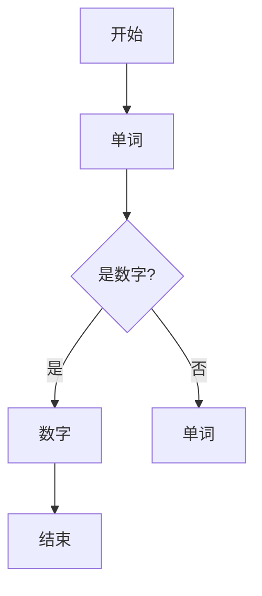
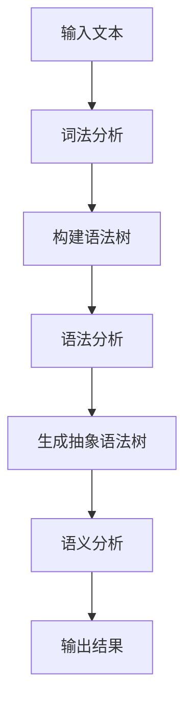

                 


### 《提示词语言的语法结构：设计与实现》目录大纲

**关键词**：提示词语言，语法结构，设计，实现，算法原理，实际应用

**摘要**：本文深入探讨了提示词语言的语法结构，包括其设计思路、实现方法和实际应用。通过分析核心概念和算法原理，以及具体的实现细节，本文为读者提供了一个全面的技术指南，旨在帮助开发者更好地理解和运用提示词语言的语法结构。

---

## 第一部分：基础概念与理论

### 1.1 提示词语言概述

#### 1.1.1 定义与背景

提示词语言是一种基于上下文的关键词提取技术，它通过对文本进行语义分析，提取出具有代表性的关键词。这一技术广泛应用于搜索引擎、自然语言处理和内容推荐等领域。

#### 1.1.2 发展历程

提示词语言的发展经历了从简单的关键词提取到基于机器学习和深度学习的复杂模型的过程。随着计算能力和算法的进步，提示词语言的准确性和效率得到了显著提升。

#### 1.1.3 核心概念

- **关键词提取**：从文本中提取最具代表性的词汇。
- **上下文**：关键词提取时，文本的上下文环境对关键词的选择具有重要影响。
- **语义分析**：通过语义分析，理解文本的含义和结构，从而更准确地提取关键词。

### 1.2 语法结构的理论基础

#### 1.2.1 语法树的构建

语法树是描述语言结构的一种图形表示方法。它将文本分解成一系列语法规则，每个规则对应一个节点，节点之间的关系形成了一棵树。

#### 1.2.2 词法分析

词法分析是将文本分解成一个个单词或符号的过程。它是语法分析的基础，对于确保文本的语法正确性具有重要意义。

#### 1.2.3 语法分析

语法分析是在词法分析的基础上，根据语法规则对文本进行结构分析的过程。它通过构建语法树，描述文本的语法结构。

### 1.3 核心算法原理

#### 1.3.1 上下文无关文法

上下文无关文法（CFG）是一种描述语言结构的形式化方法。它通过一组产生式规则，定义了语言的结构。

#### 1.3.2 递归下降分析

递归下降分析是一种语法分析方法，它通过递归调用语法规则，逐步构建语法树。

#### 1.3.3 LL(1)分析

LL(1)分析是一种自顶向下的语法分析方法，它通过前瞻集来避免递归调用的二义性。

### 1.4 语法结构的Mermaid流程图

#### 1.4.1 语法规则表示

使用Mermaid流程图，我们可以直观地表示语法规则，如：



#### 1.4.2 解析过程

通过Mermaid流程图，我们可以描述语法解析的过程，如：



## 第二部分：设计与实现

### 2.1 设计原则与方法

#### 2.1.1 简洁性

设计应尽可能简洁，减少不必要的复杂性。

#### 2.1.2 扩展性

设计应具备良好的扩展性，以便适应未来的需求变化。

#### 2.1.3 健壮性

设计应具备足够的健壮性，以应对各种异常情况。

### 2.2 算法原理与伪代码

#### 2.2.1 递归下降分析算法

伪代码如下：

```python
function parse(input_text):
    if input_text is empty:
        return success
    token = tokenize(input_text)
    if not match(token, grammar_rule):
        return failure
    parse_recursive(token.children)
    return success

function parse_recursive(tokens):
    if tokens is empty:
        return
    token = tokens[0]
    for rule in grammar_rules:
        if match(token, rule):
            apply_action(token, rule)
            parse_recursive(tokens[1:])
            return
    return failure
```

#### 2.2.2 动态规划算法

伪代码如下：

```python
function dynamic_parse(input_text):
    dp = initialize_dp(input_text)
    for i in range(1, len(input_text) + 1):
        for j in range(i, len(input_text) + 1):
            dp[i, j] = find_best_parse(input_text[i:j])
    return dp[len(input_text), len(input_text)]

function find_best_parse(substring):
    for rule in grammar_rules:
        if apply_action(substring, rule):
            return rule
    return failure
```

### 2.3 实现细节与工具选择

#### 2.3.1 编译器设计

编译器设计应考虑词法分析、语法分析和语义分析等环节，以及各个环节之间的数据传递和处理。

#### 2.3.2 解析器实现

解析器实现应考虑递归下降分析或动态规划算法，以及如何处理语法错误和异常情况。

#### 2.3.3 工具链集成

工具链集成应考虑如何整合各种工具，如文本处理库、语法分析器和解释器等。

## 第三部分：实际案例

### 2.4 语法结构在实际中的应用

#### 2.4.1 编程语言实现

在编程语言中，语法结构是至关重要的。通过提示词语言的语法结构，我们可以更好地理解和实现编程语言的语法规则。

#### 2.4.2 自然语言处理

在自然语言处理中，提示词语言的语法结构可以帮助我们提取关键词、构建语法树，并进行语义分析。

#### 2.4.3 人工智能应用

在人工智能应用中，提示词语言的语法结构可以用于构建知识图谱、自然语言理解和推理等。

### 2.5 项目实战

#### 2.5.1 开发环境搭建

搭建一个开发环境，包括编程语言、文本处理库和语法分析器等。

#### 2.5.2 代码实现与解读

实现一个简单的提示词语言解析器，并对其进行详细解读。

#### 2.5.3 案例分析

通过实际案例，分析提示词语言的语法结构在实际应用中的作用和效果。

## 第四部分：总结与展望

### 3.1 总结与回顾

本文系统地介绍了提示词语言的语法结构，包括其设计思路、实现方法和实际应用。通过具体的实现案例，我们展示了提示词语言的语法结构在实际开发中的应用效果。

### 3.2 未来发展方向

随着人工智能和自然语言处理技术的不断发展，提示词语言的语法结构将在更多领域得到应用。未来的研究方向包括：

- 提高语法结构的解析效率和准确性。
- 将提示词语言与深度学习技术相结合，实现更强大的语义分析能力。
- 探索提示词语言在多语言处理和跨语言理解中的应用。

---

**作者**：AI天才研究院/AI Genius Institute & 禅与计算机程序设计艺术 /Zen And The Art of Computer Programming

