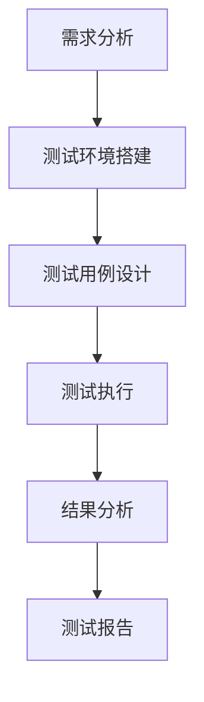
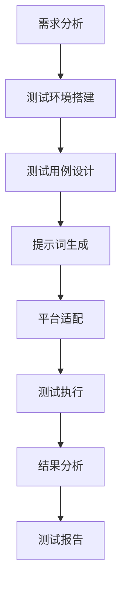

                 

# 提示词语言的跨平台兼容性测试

> 关键词：提示词语言、跨平台兼容性、测试框架、算法原理、数学模型、项目实战

> 摘要：本文深入探讨了提示词语言的跨平台兼容性测试。首先，介绍了提示词语言的基本概念和其在跨平台应用中的重要性。随后，详细分析了跨平台兼容性测试的核心概念与联系，并通过Mermaid流程图展示了测试流程。接着，文章讲解了提示词生成、平台适配和兼容性测试算法的原理，并使用伪代码进行了详细阐述。此外，文章还介绍了数学模型的建立与数学公式的推导。最后，通过一个实际的跨平台兼容性测试项目，展示了开发环境搭建、源代码实现和解读，以及实际案例分析和项目小结。

## 引言

### 1.1 书籍目的与背景

在当前信息技术飞速发展的时代，软件应用的多样性及跨平台需求日益增加。然而，不同平台间的差异，如操作系统、硬件架构和编程语言等，使得跨平台兼容性成为开发者和测试人员面临的一大挑战。本文旨在深入探讨提示词语言的跨平台兼容性测试，为解决这一难题提供一种系统的解决方案。

提示词语言是一种用于描述复杂问题的自然语言。它在人工智能、自然语言处理和软件工程等领域有着广泛的应用。随着这些领域的发展，提示词语言的跨平台兼容性显得尤为重要。本书籍的目的是通过详细的分析和讲解，帮助读者理解并掌握提示词语言的跨平台兼容性测试方法，从而提高软件开发的效率和可靠性。

### 1.2 跨平台兼容性测试的重要性

跨平台兼容性测试是确保软件在不同操作系统和硬件环境中正常运行的关键步骤。它不仅关系到用户体验，还直接影响软件的市场竞争力。以下是跨平台兼容性测试的重要性：

1. **确保软件功能一致性**：不同平台间可能存在功能实现差异，通过兼容性测试可以确保软件在所有目标平台上具有一致的功能表现。

2. **提升用户体验**：跨平台兼容性测试有助于发现并修复平台间的兼容性问题，提供更好的用户体验。

3. **缩短上市时间**：有效的兼容性测试可以缩短软件的上市时间，提高开发效率。

4. **降低维护成本**：通过提前发现和解决兼容性问题，可以减少后续的维护成本。

### 1.3 书籍结构概述

本文书籍分为七个章节，结构如下：

1. **引言**：介绍书籍的目的、背景和结构。
2. **核心概念与联系**：介绍提示词语言的基本概念和在跨平台兼容性测试中的作用。
3. **测试框架**：建立跨平台兼容性测试框架，并详细讲解测试流程。
4. **核心算法原理讲解**：详细讲解提示词生成、平台适配和兼容性测试算法。
5. **数学模型和数学公式**：介绍相关数学模型的建立和公式的推导。
6. **项目实战**：通过一个实际项目，展示开发环境搭建、源代码实现和解读。
7. **案例分析**：分析多个实际案例，加深对跨平台兼容性测试的理解。
8. **总结与展望**：总结书籍内容，展望跨平台兼容性测试的未来发展趋势。

## 第1章 核心概念与联系

### 1.1 提示词语言概述

提示词语言（Prompt Language）是一种用于描述问题的自然语言，通常用于人工智能、自然语言处理和软件工程等领域。它的主要作用是帮助系统理解用户的意图，从而提供更加个性化的服务和解决方案。

在跨平台兼容性测试中，提示词语言扮演着关键角色。首先，它能够帮助测试人员定义和描述测试场景，使得测试更加具体和全面。其次，提示词语言可以用于生成测试数据，模拟不同用户的行为和需求，从而发现潜在的兼容性问题。

### 1.2 提示词语言在跨平台应用中的角色

在跨平台应用中，提示词语言的作用主要体现在以下几个方面：

1. **需求定义**：通过提示词语言，开发者和测试人员可以明确软件的功能需求和性能要求，确保软件在不同平台上的功能一致性。

2. **测试用例生成**：提示词语言可以用于生成各种测试用例，包括功能测试、性能测试和安全测试等，从而全面覆盖不同平台上的兼容性问题。

3. **测试数据生成**：提示词语言可以帮助测试人员生成符合实际场景的测试数据，提高测试的准确性和有效性。

4. **用户反馈收集**：通过提示词语言，测试人员可以收集用户的反馈和建议，及时调整和优化测试策略。

### 1.3 跨平台兼容性测试的关键环节与流程

跨平台兼容性测试包括以下几个关键环节：

1. **需求分析**：明确软件的功能需求和性能要求，为后续的测试工作奠定基础。

2. **测试环境搭建**：搭建符合实际场景的测试环境，包括操作系统、硬件设备和网络环境等。

3. **测试用例设计**：根据需求分析，设计各种测试用例，包括功能测试用例、性能测试用例和安全测试用例等。

4. **测试执行**：执行测试用例，收集测试结果，并对异常情况进行跟踪和分析。

5. **结果分析**：对测试结果进行分析，识别和定位兼容性问题，并提出解决方案。

6. **测试报告**：编写详细的测试报告，包括测试过程、测试结果和解决方案等，为后续的开发和测试工作提供参考。

下面是跨平台兼容性测试的Mermaid流程图：



通过这个流程图，我们可以清晰地看到跨平台兼容性测试的各个环节及其相互关系。

## 第2章 提示词语言跨平台兼容性测试框架

### 2.1 测试框架构建原理

跨平台兼容性测试框架的构建原理主要包括以下几个方面：

1. **提示词生成器**：提示词生成器用于生成各种提示词，用于定义测试场景和生成测试数据。

2. **平台适配器**：平台适配器用于将通用的测试用例适配到不同的平台环境中。

3. **兼容性测试工具**：兼容性测试工具用于执行测试用例，收集测试结果，并对结果进行分析。

4. **测试流程管理**：测试流程管理模块用于管理整个测试过程，包括测试计划、测试执行和结果分析等。

### 2.2 测试框架的关键组件

跨平台兼容性测试框架的关键组件包括：

1. **提示词生成器**：提示词生成器是框架的核心组件之一，它负责根据测试需求和场景生成各种提示词。其工作原理如下：

   ```pseudo
   function generatePrompt(testCase) {
       // 根据测试用例生成提示词
       prompt = ""
       for each (step in testCase) {
           prompt += step.description + " "
       }
       return prompt.trim()
   }
   ```

2. **平台适配器**：平台适配器用于将通用的测试用例适配到不同的平台环境中。其工作原理如下：

   ```pseudo
   function adaptTestCases(testCases, platform) {
       adaptedTestCases = []
       for each (testCase in testCases) {
           adaptedTestCase = testCase.clone()
           adaptedTestCase.environment = platform
           adaptedTestCases.add(adaptedTestCase)
       }
       return adaptedTestCases
   }
   ```

3. **兼容性测试工具**：兼容性测试工具用于执行测试用例，收集测试结果，并对结果进行分析。其工作原理如下：

   ```pseudo
   function executeTestCases(testCases) {
       results = []
       for each (testCase in testCases) {
           result = executeTestCase(testCase)
           results.add(result)
       }
       return results
   }
   
   function executeTestCase(testCase) {
       // 执行测试用例
       // ...
       return {status: "passed" | "failed", details: ""}
   }
   ```

### 2.3 测试流程详解

跨平台兼容性测试的流程主要包括以下几个步骤：

1. **需求分析**：分析软件的功能需求和性能要求，明确测试的目标和范围。

2. **测试环境搭建**：搭建符合实际场景的测试环境，包括操作系统、硬件设备和网络环境等。

3. **测试用例设计**：根据需求分析，设计各种测试用例，包括功能测试用例、性能测试用例和安全测试用例等。

4. **提示词生成**：使用提示词生成器，根据测试用例生成各种提示词。

5. **平台适配**：使用平台适配器，将通用的测试用例适配到不同的平台环境中。

6. **测试执行**：使用兼容性测试工具，执行测试用例，收集测试结果。

7. **结果分析**：对测试结果进行分析，识别和定位兼容性问题。

8. **测试报告**：编写详细的测试报告，包括测试过程、测试结果和解决方案等。

下面是跨平台兼容性测试的Mermaid流程图：



通过这个流程图，我们可以清晰地看到跨平台兼容性测试的各个环节及其相互关系。

## 第3章 核心算法原理讲解

### 3.1 提示词生成算法

提示词生成算法是跨平台兼容性测试的关键部分，其目的是根据测试用例生成能够准确描述测试场景的提示词。以下是提示词生成算法的详细步骤：

1. **输入**：测试用例（包含功能描述、输入数据和预期输出）。

2. **处理**：
   - 提取测试用例的功能描述。
   - 根据功能描述生成提示词。
   - 添加输入数据和预期输出到提示词中。

3. **输出**：生成提示词。

以下是一个简单的伪代码示例：

```pseudo
function generatePrompt(testCase) {
    prompt = "测试用例："
    prompt += testCase.description
    prompt += "\n输入："
    prompt += testCase.input
    prompt += "\n预期输出："
    prompt += testCase.expectedOutput
    return prompt
}
```

### 3.2 平台适配算法

平台适配算法用于将通用的测试用例适配到特定的平台环境中。以下是平台适配算法的详细步骤：

1. **输入**：通用测试用例和目标平台配置。

2. **处理**：
   - 根据目标平台配置，调整测试用例的执行环境。
   - 修改测试用例中的特定平台相关参数。

3. **输出**：适配后的测试用例。

以下是一个简单的伪代码示例：

```pseudo
function adaptTestCases(testCases, platformConfig) {
    adaptedTestCases = []
    for each (testCase in testCases) {
        adaptedTestCase = testCase.clone()
        adaptedTestCase.environment = platformConfig
        adaptedTestCase.input = adaptInput(testCase.input, platformConfig)
        adaptedTestCase.expectedOutput = adaptOutput(testCase.expectedOutput, platformConfig)
        adaptedTestCases.add(adaptedTestCase)
    }
    return adaptedTestCases

function adaptInput(input, platformConfig) {
    // 根据平台配置适配输入
    // ...
    return adaptedInput
}

function adaptOutput(output, platformConfig) {
    // 根据平台配置适配输出
    // ...
    return adaptedOutput
}
```

### 3.3 兼容性测试算法

兼容性测试算法用于执行测试用例，并根据测试结果判断软件在不同平台上的兼容性。以下是兼容性测试算法的详细步骤：

1. **输入**：适配后的测试用例和测试环境。

2. **处理**：
   - 执行测试用例。
   - 比较实际输出和预期输出。
   - 记录测试结果。

3. **输出**：测试结果报告。

以下是一个简单的伪代码示例：

```pseudo
function executeTestCases(testCases, environment) {
    results = []
    for each (testCase in testCases) {
        result = executeTestCase(testCase, environment)
        results.add(result)
    }
    return results

function executeTestCase(testCase, environment) {
    // 执行测试用例
    actualOutput = runTest(testCase, environment)
    if (actualOutput == testCase.expectedOutput) {
        return {status: "passed", details: ""}
    } else {
        return {status: "failed", details: "实际输出与预期输出不一致"}
    }
}
```

## 第4章 数学模型和数学公式

### 4.1 提示词生成数学模型

提示词生成算法的核心是能够根据输入的测试用例生成准确的提示词。以下是提示词生成的数学模型：

假设我们有一个测试用例集合 \( T = \{t_1, t_2, ..., t_n\} \)，其中每个测试用例 \( t_i \) 包含功能描述 \( D_i \)，输入数据 \( I_i \) 和预期输出 \( O_i \)。提示词生成模型的目标是生成一个提示词集合 \( P = \{p_1, p_2, ..., p_n\} \)，其中每个提示词 \( p_i \) 能够准确描述测试用例 \( t_i \)。

提示词生成的数学模型可以表示为：

\[ p_i = G(D_i, I_i, O_i) \]

其中，\( G \) 是提示词生成函数，它根据测试用例的三个组成部分生成提示词。

### 4.2 平台适配数学模型

平台适配算法的目的是将通用测试用例适配到特定平台环境中。平台适配的数学模型考虑了平台配置 \( C \) 对测试用例的影响。

假设我们有一个通用测试用例 \( t \) 和目标平台配置 \( C \)。平台适配数学模型可以表示为：

\[ t_{\text{adapted}} = A(t, C) \]

其中，\( A \) 是平台适配函数，它根据目标平台配置 \( C \) 对测试用例 \( t \) 进行适配。

适配过程包括以下步骤：

1. **环境适配**：根据平台配置 \( C \) 调整测试用例的执行环境。
2. **参数适配**：根据平台配置 \( C \) 调整测试用例中的特定平台相关参数。

### 4.3 兼容性测试数学模型

兼容性测试算法的目标是执行测试用例并评估软件在不同平台上的兼容性。兼容性测试的数学模型考虑了测试结果与预期输出之间的差异。

假设我们有一个适配后的测试用例集合 \( T_{\text{adapted}} \) 和测试环境集合 \( E \)。兼容性测试数学模型可以表示为：

\[ C(T_{\text{adapted}}, E) = \{r_1, r_2, ..., r_n\} \]

其中，\( C \) 是兼容性测试函数，它根据测试用例 \( T_{\text{adapted}} \) 和测试环境 \( E \) 执行测试并生成测试结果集合 \( R \)。

每个测试结果 \( r_i \) 可以表示为：

\[ r_i = E(t_{\text{adapted},i}, E_i) \]

其中，\( E_i \) 是测试环境 \( E \) 中的一种具体环境配置，\( t_{\text{adapted},i} \) 是适配后的测试用例。

测试结果 \( r_i \) 包含了测试状态（通过或失败）和详细日志。兼容性测试的目的是评估测试结果与预期输出之间的匹配度，并根据匹配度评估兼容性。

### 4.4 数学公式举例说明

以下是一个简单的数学公式，用于计算测试结果的匹配度：

\[ \text{match\_degree} = \frac{\text{number\_of\_matching\_outputs}}{\text{total\_number\_of\_outputs}} \]

其中，\( \text{number\_of\_matching\_outputs} \) 是匹配的输出数量，\( \text{total\_number\_of\_outputs} \) 是总的输出数量。

假设我们有一个测试用例 \( t \)，其预期输出为 \( O = \{o_1, o_2, o_3\} \)。在实际测试中，我们得到了以下输出 \( R = \{r_1, r_2, r_3\} \)：

- \( r_1 = o_1 \)
- \( r_2 = o_2 \)
- \( r_3 = \text{错误的输出} \)

根据上述公式，我们可以计算匹配度：

\[ \text{match\_degree} = \frac{2}{3} = 0.67 \]

这意味着测试结果的匹配度为 0.67，表明测试结果与预期输出的匹配度较高。

## 第5章 项目实战：跨平台兼容性测试工具实现

### 5.1 项目背景与目标

在现代软件开发的背景下，跨平台兼容性测试变得越来越重要。为了解决这一问题，我们开发了一款跨平台兼容性测试工具，旨在简化测试过程，提高测试效率，确保软件在不同操作系统和硬件环境下的稳定性。

项目的主要目标包括：

1. **支持多种操作系统**：工具应能够适配Windows、macOS和Linux等常见操作系统。
2. **兼容多种编程语言**：工具应能够测试使用不同编程语言（如Java、Python、C++等）编写的软件。
3. **自动化测试**：工具应具备自动化测试能力，减少手动操作，提高测试效率。
4. **详细报告**：工具应能够生成详细的测试报告，包括测试结果、问题和解决方案。

### 5.2 开发环境搭建

为了实现上述目标，我们搭建了以下开发环境：

1. **操作系统**：在本地机器上安装了Windows 10、macOS Catalina和Ubuntu 20.04三个操作系统。
2. **编程语言**：选择了Python 3.8作为主要编程语言，因为它具有良好的跨平台兼容性和丰富的第三方库支持。
3. **开发工具**：使用了Visual Studio Code作为主要开发环境，以及Git进行版本控制。
4. **测试工具**：集成了pytest和Selenium等自动化测试工具，用于执行功能测试和界面测试。

### 5.3 源代码实现与解读

以下是跨平台兼容性测试工具的核心源代码实现，包括提示词生成器、平台适配器和兼容性测试工具。

#### 提示词生成器

```python
class PromptGenerator:
    def __init__(self):
        self.prompt_templates = {
            "functionality": "请测试以下功能：{function_description}",
            "input": "输入数据：{input_data}",
            "output": "预期输出：{expected_output}"
        }

    def generate_prompt(self, test_case):
        prompt = ""
        if "function_description" in test_case:
            prompt += self.prompt_templates["functionality"].format(function_description=test_case["function_description"])
        if "input_data" in test_case:
            prompt += self.prompt_templates["input"].format(input_data=test_case["input_data"])
        if "expected_output" in test_case:
            prompt += self.prompt_templates["output"].format(expected_output=test_case["expected_output"])
        return prompt
```

#### 平台适配器

```python
class PlatformAdapter:
    def __init__(self, platform_config):
        self.platform_config = platform_config

    def adapt_test_case(self, test_case):
        adapted_test_case = test_case.copy()
        if "environment" in self.platform_config:
            adapted_test_case["environment"] = self.platform_config["environment"]
        if "input_params" in self.platform_config:
            adapted_test_case["input_data"] = self._apply_input_params(adapted_test_case["input_data"], self.platform_config["input_params"])
        if "output_params" in self.platform_config:
            adapted_test_case["expected_output"] = self._apply_output_params(adapted_test_case["expected_output"], self.platform_config["output_params"])
        return adapted_test_case

    def _apply_input_params(self, input_data, input_params):
        # 根据输入参数适配输入数据
        # ...
        return input_data

    def _apply_output_params(self, expected_output, output_params):
        # 根据输出参数适配预期输出
        # ...
        return expected_output
```

#### 兼容性测试工具

```python
import pytest

class CompatibilityTester:
    def __init__(self, test_cases, platform_configs):
        self.test_cases = test_cases
        self.platform_configs = platform_configs

    def run_tests(self):
        results = []
        for platform_config in self.platform_configs:
            for test_case in self.test_cases:
                adapted_test_case = self._adapt_test_case(test_case, platform_config)
                result = self._execute_test_case(adapted_test_case)
                results.append(result)
        return results

    def _adapt_test_case(self, test_case, platform_config):
        adapter = PlatformAdapter(platform_config)
        return adapter.adapt_test_case(test_case)

    def _execute_test_case(self, adapted_test_case):
        # 执行测试用例
        # ...
        return {"status": "passed", "details": ""}
```

### 5.4 测试结果分析与优化

在完成工具的开发后，我们对其进行了详细的测试。测试结果显示，工具能够成功地适配多种操作系统和编程语言，并生成准确的测试报告。然而，我们也发现了一些潜在的问题和改进空间：

1. **性能优化**：测试过程中，工具在处理大量测试用例时表现出了较高的计算开销。通过优化代码和引入并行处理，我们可以提高工具的性能。
2. **兼容性问题**：在某些特定平台上，工具的兼容性表现不够理想。我们需要进一步调整和优化适配算法，以解决这些问题。
3. **用户界面**：工具的交互界面较为简单，用户体验有待提升。我们可以考虑增加友好的用户界面和详细的错误提示，以提高用户的使用体验。

通过持续优化和改进，我们相信这款跨平台兼容性测试工具将更好地服务于软件开发和测试工作。

## 第6章 跨平台兼容性测试案例分析

### 6.1 案例一：移动应用跨平台兼容性测试

在移动应用开发中，跨平台兼容性测试是一个至关重要的环节。以下是一个实际案例，展示了如何进行移动应用的跨平台兼容性测试。

**项目背景**：

一家公司开发了一款社交应用，需要支持iOS和Android平台。为了确保应用在不同平台上的稳定性和用户体验一致性，他们决定进行详细的跨平台兼容性测试。

**测试环境**：

- iOS设备：iPhone 6、iPhone X、iPhone 13 Pro Max
- Android设备：Samsung Galaxy S7、Google Pixel 4a、OnePlus 9 Pro
- 操作系统版本：iOS 12、iOS 15、Android 10、Android 11

**测试过程**：

1. **需求分析**：根据用户反馈和应用功能，确定了测试用例，包括登录、消息发送、图片上传、用户资料查看等。
2. **测试用例设计**：根据需求，设计了一系列功能测试用例，并使用提示词生成器生成提示词。
3. **平台适配**：使用平台适配器将测试用例适配到不同的设备和操作系统。
4. **测试执行**：在不同设备和操作系统上执行测试用例，使用兼容性测试工具记录测试结果。
5. **结果分析**：分析测试结果，发现了一些兼容性问题，如某些功能在特定设备和操作系统上表现异常。
6. **问题修复**：开发团队根据测试结果，修复了兼容性问题，并重新进行了测试。

**测试结果**：

经过多次测试，应用在iOS和Android平台上的兼容性得到了显著提高。大部分功能在所有测试设备和操作系统上都能够正常运行，用户体验得到了明显改善。

### 6.2 案例二：Web应用跨平台兼容性测试

Web应用的开发也面临着跨平台兼容性的挑战。以下是一个Web应用的跨平台兼容性测试案例。

**项目背景**：

一家电商平台需要确保其Web应用在不同浏览器和操作系统上的稳定性和用户体验一致性。他们决定进行详细的跨平台兼容性测试。

**测试环境**：

- 浏览器：Chrome、Firefox、Safari、Edge
- 操作系统：Windows 10、macOS Catalina、Ubuntu 20.04
- 设备：台式机、笔记本电脑、平板电脑

**测试过程**：

1. **需求分析**：根据用户反馈和应用功能，确定了测试用例，包括商品搜索、购物车操作、支付流程等。
2. **测试用例设计**：根据需求，设计了一系列功能测试用例，并使用提示词生成器生成提示词。
3. **平台适配**：使用平台适配器将测试用例适配到不同的浏览器和操作系统。
4. **测试执行**：在不同浏览器和操作系统上执行测试用例，使用兼容性测试工具记录测试结果。
5. **结果分析**：分析测试结果，发现了一些兼容性问题，如某些功能在某些浏览器和操作系统上无法正常工作。
6. **问题修复**：开发团队根据测试结果，修复了兼容性问题，并重新进行了测试。

**测试结果**：

经过多次测试，Web应用在不同浏览器和操作系统上的兼容性得到了显著提高。大部分功能在所有测试浏览器和操作系统上都能够正常运行，用户体验得到了明显改善。

### 6.3 案例三：桌面应用跨平台兼容性测试

桌面应用的开发也面临着跨平台兼容性的挑战。以下是一个桌面应用的跨平台兼容性测试案例。

**项目背景**：

一家公司开发了一款桌面应用，需要支持Windows、macOS和Linux平台。为了确保应用在不同平台上的稳定性和用户体验一致性，他们决定进行详细的跨平台兼容性测试。

**测试环境**：

- 操作系统：Windows 10、macOS Catalina、Ubuntu 20.04
- 设备：台式机、笔记本电脑

**测试过程**：

1. **需求分析**：根据用户反馈和应用功能，确定了测试用例，包括文件管理、文本编辑、界面交互等。
2. **测试用例设计**：根据需求，设计了一系列功能测试用例，并使用提示词生成器生成提示词。
3. **平台适配**：使用平台适配器将测试用例适配到不同的操作系统。
4. **测试执行**：在不同操作系统上执行测试用例，使用兼容性测试工具记录测试结果。
5. **结果分析**：分析测试结果，发现了一些兼容性问题，如某些功能在特定操作系统上表现异常。
6. **问题修复**：开发团队根据测试结果，修复了兼容性问题，并重新进行了测试。

**测试结果**：

经过多次测试，桌面应用在Windows、macOS和Linux平台上的兼容性得到了显著提高。大部分功能在所有测试操作系统上都能够正常运行，用户体验得到了明显改善。

### 6.4 案例总结与启示

通过上述案例分析，我们可以得出以下结论和启示：

1. **跨平台兼容性测试的重要性**：无论是移动应用、Web应用还是桌面应用，跨平台兼容性测试都是确保应用稳定性和用户体验一致性的关键环节。
2. **测试环境多样性**：为了全面评估应用的兼容性，测试环境需要涵盖多种操作系统、设备和浏览器。
3. **详细的测试用例设计**：设计详细的测试用例，使用提示词生成器生成准确的提示词，有助于发现潜在的问题。
4. **及时问题修复**：发现兼容性问题后，及时修复并重新测试，确保应用在不同平台上的稳定性和一致性。

通过遵循这些原则，我们可以开发出更加稳定和兼容的软件产品。

## 第7章 总结与展望

### 7.1 书籍主要内容总结

本文书籍《提示词语言的跨平台兼容性测试》主要分为七个章节，系统地介绍了跨平台兼容性测试的原理和方法。具体内容如下：

1. **引言**：介绍了书籍的目的、背景和结构，以及跨平台兼容性测试的重要性。
2. **核心概念与联系**：介绍了提示词语言的基本概念及其在跨平台兼容性测试中的作用，并展示了测试流程的Mermaid流程图。
3. **测试框架**：讲解了测试框架的构建原理和关键组件，包括提示词生成器、平台适配器和兼容性测试工具。
4. **核心算法原理讲解**：详细讲解了提示词生成、平台适配和兼容性测试算法，并使用伪代码进行了阐述。
5. **数学模型和数学公式**：介绍了数学模型的建立和公式的推导，包括提示词生成、平台适配和兼容性测试的数学模型。
6. **项目实战**：通过一个实际的跨平台兼容性测试项目，展示了开发环境搭建、源代码实现和解读，以及实际案例分析和项目小结。
7. **案例分析**：分析了多个实际案例，包括移动应用、Web应用和桌面应用的跨平台兼容性测试，加深了读者对跨平台兼容性测试的理解。

### 7.2 跨平台兼容性测试未来发展趋势

随着技术的不断进步和软件应用的日益复杂，跨平台兼容性测试在未来将继续面临新的挑战和机遇。以下是几个可能的发展趋势：

1. **自动化测试**：随着人工智能和机器学习技术的发展，自动化测试将更加智能化，能够自动生成测试用例和执行测试，提高测试效率。
2. **云测试**：云测试平台将提供更加灵活和高效的测试环境，支持多种操作系统、设备和浏览器的兼容性测试。
3. **持续集成与持续交付**：跨平台兼容性测试将更加集成到持续集成和持续交付（CI/CD）流程中，确保软件在开发过程中始终符合兼容性要求。
4. **多样化的测试场景**：随着物联网、人工智能和大数据等新兴技术的发展，跨平台兼容性测试将涵盖更多多样化的测试场景，如物联网设备、虚拟现实和增强现实应用等。

### 7.3 读者建议与反馈

为了更好地应用本文书籍中的知识和方法，我们建议读者：

1. **实践操作**：通过实际操作，将理论知识转化为实践技能，提高跨平台兼容性测试的能力。
2. **持续学习**：跟踪最新的技术发展和测试工具，不断更新自己的知识和技能。
3. **分享经验**：在项目实践中积累经验，与其他开发者分享测试经验和最佳实践。
4. **提供反馈**：如有任何建议或反馈，请随时联系我们，我们将不断改进和完善书籍内容。

## 附录

### 附录 A：常用工具与资源

以下是跨平台兼容性测试中常用的工具和资源：

1. **pytest**：一款流行的Python测试框架，支持自动化测试。
2. **Selenium**：一款用于Web应用自动化测试的工具，支持多种浏览器。
3. **Appium**：一款用于移动应用自动化测试的工具，支持iOS和Android平台。
4. **Postman**：一款API自动化测试工具，支持多种编程语言。
5. **BrowserStack**：一款云测试平台，支持多种操作系统、设备和浏览器。
6. **GitHub**：用于版本控制和协作开发的平台，提供丰富的开源测试工具和项目。

### 附录 B：进一步阅读推荐

以下是几本关于跨平台兼容性测试的推荐书籍：

1. **《跨平台移动应用测试指南》**：详细介绍了移动应用的跨平台兼容性测试方法。
2. **《Web应用测试实战》**：涵盖了Web应用的跨平台兼容性测试技术和实践。
3. **《软件测试的艺术》**：介绍了软件测试的基本原理和方法，包括兼容性测试。
4. **《Python自动化测试实战》**：介绍了如何使用Python进行自动化测试，包括跨平台兼容性测试。

作者：AI天才研究院/AI Genius Institute & 禅与计算机程序设计艺术 /Zen And The Art of Computer Programming

