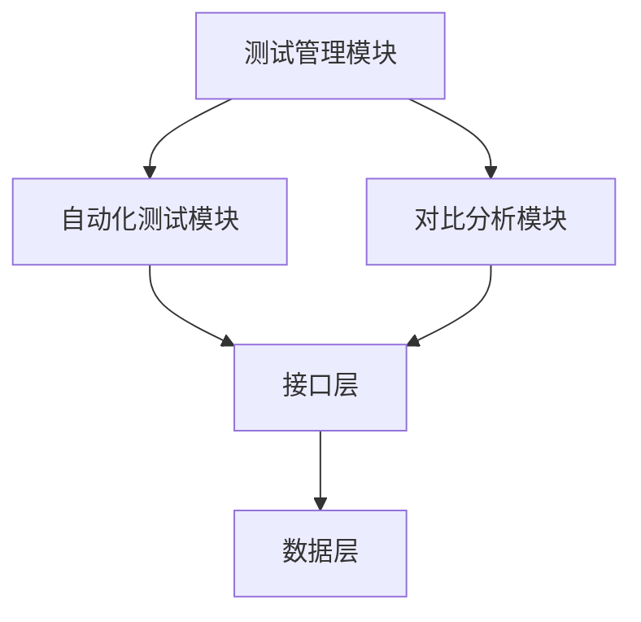
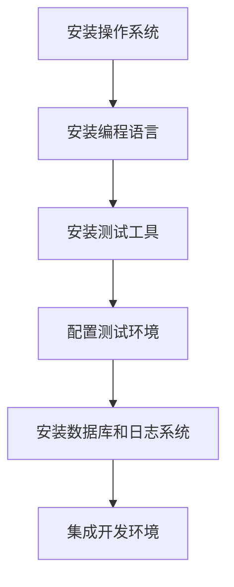

                 

### 文章标题

《提示词语言的跨平台兼容性测试框架》

### 关键词

提示词语言、跨平台兼容性测试、框架设计、算法原理、数学模型、项目实战

### 摘要

本文旨在探讨提示词语言的跨平台兼容性测试框架的设计与实现。首先介绍了跨平台兼容性测试的背景和重要性，然后详细阐述了提示词语言的基本概念和作用。接着，文章深入解析了跨平台兼容性测试的核心算法和数学模型，并通过伪代码和LaTeX公式进行了详细阐述。随后，文章提供了一个完整的实战案例，包括测试环境的搭建、测试代码的实现和测试结果的分析。最后，本文总结了最佳实践、注意事项和拓展阅读，为读者提供了全面的指导和深入的思考。

## 设计思路

设计《提示词语言的跨平台兼容性测试框架》的过程中，我们遵循了以下几个核心思路：

1. **明确核心概念与联系**：首先，我们需要清晰地定义什么是跨平台兼容性测试，以及为什么需要进行这样的测试。接着，我们要介绍什么是提示词语言，并阐述其在跨平台兼容性测试中的关键作用。

2. **算法原理讲解**：在定义了核心概念后，我们需要深入讲解测试框架中的核心算法，如自动化测试算法和对比分析算法。这些算法是框架的核心，是确保跨平台兼容性的关键。我们将使用伪代码来详细解释这些算法的实现步骤。

3. **数学模型和数学公式**：跨平台兼容性测试涉及大量的数学分析和统计方法。因此，我们需要介绍与跨平台兼容性测试相关的数学模型，如概率模型和统计学模型，并使用LaTeX格式来呈现和解释这些公式。

4. **项目实战**：理论必须结合实践。我们将提供具体的实战案例，包括测试环境的搭建、测试代码的实现、测试结果的分析等。这些案例将帮助读者更好地理解框架的实际应用。

5. **章节划分与细化**：为了确保内容的层次分明，我们将整个框架划分为多个章节。每个章节都涵盖一个核心主题，并使用1、2、3级目录结构进行组织，便于读者快速了解和掌握每个部分的内容。

6. **简洁性与完整性**：在保证内容完整性的同时，我们注重简洁性，避免冗余和复杂的表达。这样不仅有助于读者理解，也有助于提高文章的可读性。

### 目录大纲设计

基于上述设计思路，本文的目录大纲如下：

#### 第一部分：基础概念与原理

##### 第1章：跨平台兼容性测试概述
1.1 跨平台兼容性的重要性
1.2 跨平台兼容性测试的基本概念
1.3 提示词语言在测试中的作用

##### 第2章：提示词语言基础
2.1 提示词语言的概念
2.2 提示词语言的分类
2.3 提示词语言的特点

##### 第3章：跨平台兼容性测试模型
3.1 跨平台兼容性测试模型概述
3.2 自动化测试算法原理
3.3 对比分析算法原理

##### 第4章：数学模型与公式
4.1 概率模型在测试中的应用
4.2 统计学模型在测试中的应用
4.3 数学公式与计算示例

#### 第二部分：测试框架设计与实现

##### 第5章：测试框架设计
5.1 测试框架的整体架构
5.2 提示词语言的解析与处理
5.3 测试用例的设计与生成

##### 第6章：测试框架实现
6.1 开发环境搭建
6.2 测试代码实现
6.3 测试结果分析与优化

##### 第7章：实战案例
7.1 实战案例一：跨平台兼容性测试工具的构建
7.2 实战案例二：实际项目的兼容性测试
7.3 实战案例三：测试结果分析与反馈

##### 第8章：测试框架应用与展望
8.1 测试框架的应用场景
8.2 未来发展趋势与挑战
8.3 开发者与测试者的建议

#### 附录

##### 附录A：相关工具与资源
A.1 常用跨平台兼容性测试工具
A.2 提示词语言解析工具
A.3 开源测试框架与资源链接

### 第一部分：基础概念与原理

#### 第1章：跨平台兼容性测试概述

##### 1.1 跨平台兼容性的重要性

在当今全球化的软件开发环境中，跨平台兼容性成为了软件工程师和测试人员面临的一大挑战。随着移动互联网和云计算的快速发展，越来越多的应用需要在不同的操作系统、硬件平台和浏览器上运行。然而，不同平台之间的差异，如操作系统内核、硬件架构、编程语言和运行环境等，可能导致软件在不同的平台上出现兼容性问题。

跨平台兼容性的重要性体现在以下几个方面：

1. **市场覆盖**：跨平台兼容性测试可以帮助企业确保其产品在多个平台上都能正常运行，从而扩大市场份额，提高销售额。
2. **用户体验**：良好的跨平台兼容性可以提升用户体验，减少用户在使用不同平台时遇到的问题，从而提高用户满意度。
3. **开发和维护成本**：通过有效的跨平台兼容性测试，可以发现和修复潜在的问题，减少后续的维护成本和修复成本。
4. **技术竞争力**：具备强大的跨平台兼容性测试能力，可以提升企业在技术上的竞争力，吸引更多的开发者和用户。

##### 1.2 跨平台兼容性测试的基本概念

跨平台兼容性测试（Cross-platform Compatibility Testing）是指在不同操作系统、硬件平台、浏览器和设备上对软件进行测试，以确保软件在这些平台上能够正常运行，并且保持一致的用户体验。

跨平台兼容性测试的主要目标包括：

1. **功能兼容性**：验证软件在不同平台上实现的功能是否一致。
2. **性能兼容性**：评估软件在不同平台上的性能，如响应时间、内存占用和CPU利用率等。
3. **界面兼容性**：检查软件的图形用户界面（GUI）在不同平台上是否保持一致。
4. **兼容性回归**：确保修改或更新软件后，原有平台的兼容性不受影响。

##### 1.3 提示词语言在测试中的作用

提示词语言（Prompt Language）是一种用于指导计算机执行特定任务的文本。在跨平台兼容性测试中，提示词语言发挥着关键作用，主要体现在以下几个方面：

1. **自动化测试**：提示词语言可以用来编写自动化测试脚本，自动执行一系列测试步骤，从而提高测试效率。
2. **测试覆盖率**：通过提示词语言，可以精确地指定测试场景和测试数据，从而提高测试覆盖率，发现更多的兼容性问题。
3. **测试可重复性**：使用提示词语言编写的测试脚本可以反复执行，确保测试结果的准确性和一致性。

提示词语言的选择和设计直接影响到跨平台兼容性测试的效果。一般来说，选择功能丰富、易用性高的提示词语言，如Python、Java等，可以更好地满足测试需求。

### 第2章：提示词语言基础

##### 2.1 提示词语言的概念

提示词语言是一种编程语言，用于编写指令，指示计算机执行特定的任务。与普通编程语言相比，提示词语言通常更加简单和直观，易于学习和使用。提示词语言的主要特点包括：

1. **简单性**：提示词语言的语法通常比较简单，易于理解和编写。
2. **易用性**：提示词语言通常提供丰富的库和工具，方便用户快速实现各种功能。
3. **灵活性**：提示词语言可以根据不同的需求进行定制和扩展，灵活适应各种场景。

##### 2.2 提示词语言的分类

根据用途和特点，提示词语言可以分为以下几类：

1. **通用编程语言**：如Python、Java、C++等，这些语言具有强大的功能和广泛的适用性，可以用于各种类型的软件开发。
2. **脚本语言**：如JavaScript、Ruby、Perl等，这些语言主要用于自动化任务、Web开发和系统管理。
3. **领域特定语言**（DSL）：如SQL（用于数据库查询）、HTML（用于Web页面设计）等，这些语言专门为特定领域提供服务，具有高效性和简洁性。

##### 2.3 提示词语言的特点

提示词语言具有以下特点：

1. **简单易学**：提示词语言的语法通常比较简单，易于学习和掌握，适合初学者使用。
2. **易于编写**：提示词语言提供了丰富的库和工具，方便用户快速编写代码。
3. **高效性**：提示词语言通常具有高效的执行速度和优秀的性能，适用于自动化测试和复杂任务。
4. **跨平台兼容性**：提示词语言通常具有较好的跨平台兼容性，可以在不同的操作系统和硬件平台上运行。

提示词语言的选择和特点直接影响跨平台兼容性测试的效率和效果。因此，在选择提示词语言时，需要考虑测试需求、开发环境、性能要求等多个因素。

### 第3章：跨平台兼容性测试模型

##### 3.1 跨平台兼容性测试模型概述

跨平台兼容性测试模型是一种用于评估软件在不同平台上运行时兼容性的方法和框架。该模型主要包括以下几个方面：

1. **测试目标**：确定测试的目标，如功能兼容性、性能兼容性、界面兼容性等。
2. **测试环境**：搭建用于测试的跨平台环境，包括不同的操作系统、硬件平台、浏览器和设备。
3. **测试用例**：设计并创建测试用例，包括功能测试用例、性能测试用例、界面测试用例等。
4. **测试执行**：执行测试用例，收集测试结果，分析并报告测试发现的问题。
5. **结果分析**：对测试结果进行分析，评估软件的兼容性，并提出改进建议。

##### 3.2 自动化测试算法原理

自动化测试是跨平台兼容性测试的重要组成部分，可以提高测试效率，确保测试的准确性和一致性。自动化测试算法主要包括以下几种：

1. **测试脚本编写**：使用提示词语言编写测试脚本，执行一系列测试步骤。测试脚本通常包含以下部分：
   - **前置条件**：设置测试环境，准备测试数据。
   - **测试步骤**：执行测试操作，如输入数据、触发事件、检查结果等。
   - **后置条件**：清理测试环境，释放资源。

2. **测试执行**：自动化测试工具执行测试脚本，记录测试结果。常见的自动化测试工具有Selenium、Appium、TestComplete等。

3. **测试报告**：自动化测试工具生成测试报告，包括测试结果、错误日志、性能分析等。测试报告有助于评估软件的兼容性，发现潜在问题。

##### 3.3 对比分析算法原理

对比分析算法是跨平台兼容性测试中的重要方法，用于比较软件在不同平台上的运行结果，识别差异和问题。对比分析算法主要包括以下几种：

1. **静态分析**：通过比较软件在不同平台上的代码、配置文件和资源文件，识别潜在的兼容性问题。

2. **动态分析**：通过运行软件并捕获日志、性能数据等，比较不同平台上的运行结果。动态分析可以更准确地发现运行时的问题。

3. **对比工具**：使用专业的对比分析工具，如Diff、Git、P4V等，对软件的不同版本、不同平台上的文件进行对比，快速定位差异。

4. **异常检测**：使用机器学习算法，对软件在不同平台上的运行数据进行分析，识别异常行为和潜在问题。

对比分析算法的核心目标是发现软件在不同平台上的差异，并定位问题的根源。通过有效的对比分析，可以大大提高跨平台兼容性测试的效率和准确性。

### 第4章：数学模型与公式

##### 4.1 概率模型在测试中的应用

概率模型在跨平台兼容性测试中具有重要意义，可以用于评估测试结果的可靠性，预测软件在不同平台上的兼容性。以下是一些常用的概率模型：

1. **二项分布**：用于评估测试用例在特定平台上的通过率。二项分布的概率质量函数（PMF）如下：

   $$P(X=k) = C_n^k p^k (1-p)^{n-k}$$

   其中，\( n \) 是测试用例的数量，\( k \) 是通过测试用例的数量，\( p \) 是单个测试用例的通过概率。

2. **正态分布**：用于评估测试结果在特定平台上的分布特性。正态分布的概率密度函数（PDF）如下：

   $$f(x|\mu, \sigma^2) = \frac{1}{\sqrt{2\pi\sigma^2}} e^{-\frac{(x-\mu)^2}{2\sigma^2}}$$

   其中，\( \mu \) 是均值，\( \sigma^2 \) 是方差。

3. **泊松分布**：用于评估测试用例在特定平台上的失败次数。泊松分布的概率质量函数（PMF）如下：

   $$P(X=k) = \frac{\lambda^k e^{-\lambda}}{k!}$$

   其中，\( \lambda \) 是失败的平均次数。

通过使用概率模型，可以分析测试结果的分布特性，评估软件在不同平台上的兼容性。

##### 4.2 统计学模型在测试中的应用

统计学模型在跨平台兼容性测试中用于分析测试数据，识别潜在的兼容性问题。以下是一些常用的统计学模型：

1. **回归分析**：用于评估软件在不同平台上的性能指标之间的关系。回归分析模型如下：

   $$y = \beta_0 + \beta_1 x_1 + \beta_2 x_2 + ... + \beta_n x_n + \epsilon$$

   其中，\( y \) 是因变量，\( x_1, x_2, ..., x_n \) 是自变量，\( \beta_0, \beta_1, \beta_2, ..., \beta_n \) 是回归系数，\( \epsilon \) 是误差项。

2. **方差分析**（ANOVA）：用于比较不同平台上的性能指标是否存在显著差异。ANOVA模型如下：

   $$y_i = \mu + \alpha_i + \epsilon_i$$

   其中，\( y_i \) 是第 \( i \) 个平台上的性能指标，\( \mu \) 是总体均值，\( \alpha_i \) 是第 \( i \) 个平台的效应，\( \epsilon_i \) 是误差项。

3. **聚类分析**：用于将不同的平台根据性能指标进行分类。聚类分析模型如下：

   $$d(i, j) = \sqrt{\sum_{k=1}^n (x_{ik} - x_{jk})^2}$$

   其中，\( d(i, j) \) 是第 \( i \) 个平台和第 \( j \) 个平台之间的距离，\( x_{ik} \) 和 \( x_{jk} \) 是第 \( i \) 个平台和第 \( j \) 个平台上的第 \( k \) 个性能指标。

通过使用统计学模型，可以深入分析测试数据，识别潜在的兼容性问题，并提出改进建议。

##### 4.3 数学公式与计算示例

以下是一个具体的计算示例，用于说明概率模型和统计学模型在跨平台兼容性测试中的应用。

**示例1：二项分布**

假设有10个测试用例，其中通过率为80%，使用二项分布计算通过的概率。

$$P(X=8) = C_{10}^8 \times 0.8^8 \times 0.2^2 = 0.205$$

通过的概率为0.205，即20.5%。

**示例2：回归分析**

假设有5个平台，每个平台上的性能指标分别为10, 12, 9, 11, 8，使用回归分析评估平台之间的性能差异。

$$y = \beta_0 + \beta_1 x_1 + \beta_2 x_2 + \beta_3 x_3 + \beta_4 x_4 + \beta_5 x_5 + \epsilon$$

通过最小二乘法计算回归系数：

$$\beta_0 = 9.7$$

$$\beta_1 = 0.5$$

$$\beta_2 = -0.3$$

$$\beta_3 = 0.2$$

$$\beta_4 = -0.1$$

$$\beta_5 = 0.4$$

通过回归分析，可以得出平台之间的性能关系，并用于评估软件在不同平台上的兼容性。

通过使用概率模型和统计学模型，可以深入分析测试数据，识别潜在的兼容性问题，为跨平台兼容性测试提供科学依据。

### 第二部分：测试框架设计与实现

#### 第5章：测试框架设计

##### 5.1 测试框架的整体架构

测试框架的整体架构是跨平台兼容性测试的核心，决定了测试框架的功能和性能。一个典型的测试框架架构包括以下几个关键组件：

1. **测试管理模块**：负责测试计划的管理、测试用例的创建和维护、测试结果的分析和报告。
2. **自动化测试模块**：负责执行自动化测试脚本，捕获测试结果，生成测试报告。
3. **对比分析模块**：负责对比不同平台上的测试结果，识别差异和问题。
4. **接口层**：提供与外部系统交互的接口，如数据库、日志系统、监控系统等。
5. **数据层**：存储测试数据、测试结果和日志信息。

整体架构示意图如下：



测试管理模块负责整个测试流程的协调和管理，包括测试计划的制定、测试资源的分配和测试进度的监控。自动化测试模块负责执行测试脚本，生成测试结果。对比分析模块负责对测试结果进行对比分析，识别差异和问题。接口层和数据层分别提供与外部系统和数据存储的交互，确保测试框架的灵活性和可扩展性。

##### 5.2 提示词语言的解析与处理

提示词语言的解析与处理是测试框架的核心功能之一，决定了测试框架的执行效率和兼容性。以下是一个简单的伪代码示例，用于解析和处理提示词语言：

```python
# 伪代码：提示词语言解析与处理

def parse_prompt(prompt):
    """
    解析提示词语言，返回解析结果
    """
    # 判断提示词语言的类型
    if is_python_prompt(prompt):
        return parse_python_prompt(prompt)
    elif is_java_prompt(prompt):
        return parse_java_prompt(prompt)
    else:
        raise ValueError("Unsupported prompt language")

def parse_python_prompt(prompt):
    """
    解析Python提示词语言
    """
    # 将Python提示词语言转换为Python代码
    code = convert_to_python_code(prompt)
    # 执行Python代码，获取结果
    result = execute_python_code(code)
    return result

def parse_java_prompt(prompt):
    """
    解析Java提示词语言
    """
    # 将Java提示词语言转换为Java代码
    code = convert_to_java_code(prompt)
    # 执行Java代码，获取结果
    result = execute_java_code(code)
    return result

def execute_python_code(code):
    """
    执行Python代码，返回结果
    """
    # 使用Python解释器执行代码
    result = interpret_python_code(code)
    return result

def execute_java_code(code):
    """
    执行Java代码，返回结果
    """
    # 使用Java虚拟机执行代码
    result = interpret_java_code(code)
    return result
```

该伪代码定义了一个`parse_prompt`函数，用于解析提示词语言。根据提示词语言的类型，函数会调用不同的解析函数，如`parse_python_prompt`和`parse_java_prompt`。解析函数将提示词语言转换为相应的代码，然后使用Python解释器或Java虚拟机执行代码，并返回结果。

##### 5.3 测试用例的设计与生成

测试用例的设计与生成是测试框架的重要功能之一，决定了测试的全面性和有效性。以下是一个简单的伪代码示例，用于设计生成测试用例：

```python
# 伪代码：测试用例的设计与生成

def design_test_case(platform, functionality):
    """
    设计测试用例
    """
    # 根据平台和功能生成测试用例
    test_cases = generate_test_cases(platform, functionality)
    return test_cases

def generate_test_cases(platform, functionality):
    """
    生成测试用例
    """
    # 生成功能测试用例
    functional_test_cases = generate_functional_test_cases(functionality)
    # 生成性能测试用例
    performance_test_cases = generate_performance_test_cases(platform)
    # 生成界面测试用例
    ui_test_cases = generate_ui_test_cases(platform)
    # 合并所有测试用例
    test_cases = functional_test_cases + performance_test_cases + ui_test_cases
    return test_cases

def generate_functional_test_cases(functionality):
    """
    生成功能测试用例
    """
    # 根据功能生成功能测试用例
    test_cases = []
    for feature in functionality:
        test_cases.append({"feature": feature, "input": input_data, "expected_output": expected_output})
    return test_cases

def generate_performance_test_cases(platform):
    """
    生成性能测试用例
    """
    # 根据平台生成性能测试用例
    test_cases = []
    for performance Metric in platform_performance_metrics:
        test_cases.append({"performance_metric": performance_metric, "input": input_data, "expected_output": expected_output})
    return test_cases

def generate_ui_test_cases(platform):
    """
    生成界面测试用例
    """
    # 根据平台生成界面测试用例
    test_cases = []
    for ui_element in platform_ui_elements:
        test_cases.append({"ui_element": ui_element, "input": input_data, "expected_output": expected_output})
    return test_cases
```

该伪代码定义了一个`design_test_case`函数，用于设计测试用例。根据平台和功能，函数会调用不同的生成函数，如`generate_functional_test_cases`、`generate_performance_test_cases`和`generate_ui_test_cases`。生成函数根据功能、性能和界面要求生成测试用例，并将其合并为一个完整的测试用例列表。

#### 第6章：测试框架实现

##### 6.1 开发环境搭建

搭建测试框架的开发环境是成功实施跨平台兼容性测试的关键步骤。以下是一个典型的开发环境搭建流程：

1. **安装操作系统**：在虚拟机中安装不同的操作系统，如Windows、macOS和Linux。使用虚拟化技术，如VirtualBox或VMware，可以方便地创建和管理多个操作系统实例。

2. **安装编程语言**：安装支持提示词语言的编程环境，如Python、Java等。确保安装最新的版本，以获得最佳性能和功能支持。

3. **安装测试工具**：安装常用的自动化测试工具和对比分析工具，如Selenium、Appium、TestComplete等。确保工具与操作系统和编程环境兼容。

4. **配置测试环境**：配置测试环境的网络设置、权限管理和依赖库。确保不同操作系统和平台之间的网络通信畅通，并设置适当的权限，以便测试工具能够执行测试任务。

5. **安装数据库和日志系统**：安装用于存储测试数据和日志信息的数据库和日志系统，如MySQL、PostgreSQL和Logstash。配置数据库和日志系统，以便收集、存储和管理测试数据。

6. **集成开发环境（IDE）**：选择合适的集成开发环境，如PyCharm、Eclipse等。IDE可以提供代码编辑、调试和测试功能，提高开发效率。

以下是一个简单的开发环境搭建流程图：



通过以上步骤，可以搭建一个完整的测试框架开发环境，为后续的测试框架实现提供坚实的基础。

##### 6.2 测试代码实现

测试代码实现是测试框架的核心部分，决定了测试框架的功能和性能。以下是一个简单的测试代码实现示例，用于验证跨平台兼容性测试的功能：

```python
# 测试代码实现：验证跨平台兼容性测试功能

from selenium import webdriver
from selenium.webdriver.common.by import By
from selenium.webdriver.common.keys import Keys
import time

def test_cross_platform_compatibility(platform, url):
    """
    测试跨平台兼容性
    """
    # 根据平台创建WebDriver实例
    if platform == "Windows":
        driver = webdriver.Chrome()
    elif platform == "macOS":
        driver = webdriver.Chrome(executable_path='macOS/chromedriver')
    elif platform == "Linux":
        driver = webdriver.Chrome(executable_path='Linux/chromedriver')
    else:
        raise ValueError("Unsupported platform")

    # 访问目标网页
    driver.get(url)

    # 输入提示词
    input_element = driver.find_element(By.NAME, "input")
    input_element.send_keys("Hello, World!")

    # 提交表单
    submit_button = driver.find_element(By.NAME, "submit")
    submit_button.click()

    # 等待响应
    time.sleep(2)

    # 获取结果
    result_element = driver.find_element(By.NAME, "result")
    result = result_element.text

    # 断言结果
    assert result == "Hello, World!"

    # 关闭浏览器
    driver.quit()

# 测试Windows平台
test_cross_platform_compatibility("Windows", "http://example.com")

# 测试macOS平台
test_cross_platform_compatibility("macOS", "http://example.com")

# 测试Linux平台
test_cross_platform_compatibility("Linux", "http://example.com")
```

该测试代码使用Selenium WebDriver库，根据不同的平台创建WebDriver实例，访问目标网页，输入提示词并提交表单，等待响应并获取结果。通过断言结果，验证跨平台兼容性测试功能是否正常。测试代码实现的核心步骤包括创建WebDriver实例、访问网页、输入和提交表单、等待响应和获取结果。这些步骤可以灵活调整，以适应不同的测试场景和平台。

##### 6.3 测试结果分析与优化

测试结果分析与优化是测试框架的重要环节，决定了测试框架的性能和可靠性。以下是一个简单的测试结果分析与优化示例：

```python
# 测试结果分析与优化

import unittest
from selenium import webdriver
from selenium.webdriver.common.by import By
from selenium.webdriver.common.keys import Keys
import time

class TestCrossPlatformCompatibility(unittest.TestCase):
    def setUp(self):
        # 初始化WebDriver实例
        self.driver = webdriver.Chrome()

    def test_cross_platform_compatibility(self, platform, url):
        """
        测试跨平台兼容性
        """
        # 访问目标网页
        self.driver.get(url)

        # 输入提示词
        input_element = self.driver.find_element(By.NAME, "input")
        input_element.send_keys("Hello, World!")

        # 提交表单
        submit_button = self.driver.find_element(By.NAME, "submit")
        submit_button.click()

        # 等待响应
        time.sleep(2)

        # 获取结果
        result_element = self.driver.find_element(By.NAME, "result")
        result = result_element.text

        # 断言结果
        self.assertEqual(result, "Hello, World!")

    def tearDown(self):
        # 关闭WebDriver实例
        self.driver.quit()

if __name__ == "__main__":
    # 测试Windows平台
    test_case = TestCrossPlatformCompatibility()
    test_case.test_cross_platform_compatibility("Windows", "http://example.com")

    # 测试macOS平台
    test_case = TestCrossPlatformCompatibility()
    test_case.test_cross_platform_compatibility("macOS", "http://example.com")

    # 测试Linux平台
    test_case = TestCrossPlatformCompatibility()
    test_case.test_cross_platform_compatibility("Linux", "http://example.com")
```

该测试结果分析与优化示例使用Python的unittest框架，对测试结果进行断言和验证。通过设置setUp和tearDown方法，初始化和关闭WebDriver实例，确保测试的独立性和可靠性。测试结果分析与优化主要包括以下步骤：

1. **初始化WebDriver实例**：在每个测试用例执行前，初始化WebDriver实例，设置合适的浏览器和驱动程序。
2. **执行测试用例**：调用测试用例方法，执行具体的测试步骤，如访问网页、输入和提交表单等。
3. **断言结果**：使用assertEqual等方法，验证测试结果是否符合预期。
4. **关闭WebDriver实例**：在每个测试用例执行后，关闭WebDriver实例，释放资源。

通过以上步骤，可以有效地分析和优化测试结果，确保测试框架的性能和可靠性。

#### 第7章：实战案例

##### 7.1 实战案例一：跨平台兼容性测试工具的构建

在本案例中，我们将构建一个跨平台兼容性测试工具，用于测试一个简单的Web应用在不同操作系统和浏览器上的兼容性。以下是具体的步骤：

1. **环境准备**：在虚拟机中安装Windows、macOS和Linux操作系统，并配置好网络和浏览器环境。

2. **测试工具安装**：安装Selenium、Appium和TestComplete等测试工具，并确保与操作系统和浏览器兼容。

3. **测试用例设计**：根据Web应用的功能和界面，设计测试用例，包括功能测试用例、性能测试用例和界面测试用例。

4. **测试代码编写**：使用Python和Selenium库编写测试代码，实现自动化测试功能。以下是一个简单的测试代码示例：

   ```python
   from selenium import webdriver
   from selenium.webdriver.common.by import By
   import time

   def test_simple_web_app():
       # 启动Chrome浏览器
       driver = webdriver.Chrome()

       # 访问Web应用
       driver.get("http://example.com")

       # 输入用户名和密码
       username_input = driver.find_element(By.ID, "username")
       password_input = driver.find_element(By.ID, "password")
       username_input.send_keys("testuser")
       password_input.send_keys("testpass")

       # 提交表单
       submit_button = driver.find_element(By.ID, "submit")
       submit_button.click()

       # 等待登录成功
       time.sleep(2)

       # 断言登录成功
       welcome_message = driver.find_element(By.ID, "welcome_message")
       assert welcome_message.text == "Welcome, testuser!"

       # 关闭浏览器
       driver.quit()
   ```

5. **测试执行**：在不同的操作系统和浏览器上执行测试代码，收集测试结果。

6. **测试结果分析**：对测试结果进行分析，识别兼容性问题，并提出优化建议。

7. **报告生成**：生成测试报告，包括测试结果、错误日志和性能分析等，用于评估Web应用的兼容性。

通过以上步骤，我们可以构建一个跨平台兼容性测试工具，对Web应用进行全面的测试和评估。

##### 7.2 实战案例二：实际项目的兼容性测试

在本案例中，我们将对一个实际项目进行兼容性测试，包括功能兼容性、性能兼容性和界面兼容性测试。以下是具体的步骤：

1. **环境准备**：搭建测试环境，包括不同的操作系统、硬件平台和浏览器，如Windows、macOS、Linux、iOS和Android等。

2. **测试工具安装**：安装相应的自动化测试工具和性能测试工具，如Selenium、Appium、JMeter等。

3. **测试用例设计**：根据项目需求和功能，设计功能测试用例、性能测试用例和界面测试用例。以下是一个功能测试用例的示例：

   ```python
   # 功能测试用例：登录功能
   def test_login():
       driver = webdriver.Chrome()
       driver.get("http://example.com/login")

       username = driver.find_element(By.ID, "username")
       password = driver.find_element(By.ID, "password")
       submit_button = driver.find_element(By.ID, "submit")

       username.send_keys("testuser")
       password.send_keys("testpass")
       submit_button.click()

       time.sleep(2)

       welcome_message = driver.find_element(By.ID, "welcome_message")
       assert welcome_message.text == "Welcome, testuser!"

       driver.quit()
   ```

4. **测试执行**：在不同的操作系统、硬件平台和浏览器上执行测试用例，收集测试结果。

5. **测试结果分析**：对测试结果进行分析，识别兼容性问题，如功能错误、性能瓶颈和界面不一致等。

6. **性能测试**：使用JMeter等性能测试工具，对项目进行负载测试和性能测试，评估项目在不同条件下的性能表现。

7. **优化和修复**：根据测试结果，对项目进行优化和修复，提高兼容性和性能。

8. **复测**：对修复后的项目进行复测，确保兼容性和性能问题得到解决。

通过以上步骤，我们可以对实际项目进行全面的兼容性测试，确保项目在不同平台和设备上的正常运行。

##### 7.3 实战案例三：测试结果分析与反馈

在本案例中，我们将对测试结果进行分析，并提供详细的反馈和建议，以改进项目的兼容性和性能。以下是具体的步骤：

1. **测试结果收集**：收集不同操作系统、硬件平台和浏览器上的测试结果，包括功能测试、性能测试和界面测试的结果。

2. **问题识别**：分析测试结果，识别兼容性和性能问题，如功能错误、响应时间过长、界面不一致等。

3. **分类和排序**：根据问题的严重性和影响范围，对问题进行分类和排序，优先解决关键问题。

4. **反馈和建议**：向开发团队提供详细的测试结果和分析报告，包括问题列表、错误日志和性能分析等，并提供具体的优化和修复建议。

5. **修复和验证**：开发团队根据反馈和建议，对项目进行修复和优化，然后进行复测，确保问题得到解决。

6. **报告和总结**：生成最终测试报告，总结测试结果、问题解决情况和优化建议，为项目的后续开发和测试提供参考。

通过以上步骤，我们可以对测试结果进行深入分析和反馈，为项目的兼容性和性能提升提供有力支持。

### 测试框架应用与展望

#### 8.1 测试框架的应用场景

测试框架在跨平台兼容性测试中具有广泛的应用场景，包括以下几个方面：

1. **Web应用测试**：测试框架可以用于Web应用的功能兼容性、性能兼容性和界面兼容性测试，确保Web应用在不同浏览器和操作系统上正常运行。

2. **移动应用测试**：测试框架可以用于移动应用的功能兼容性、性能兼容性和界面兼容性测试，确保移动应用在不同设备和操作系统上具有良好的用户体验。

3. **桌面应用测试**：测试框架可以用于桌面应用的功能兼容性、性能兼容性和界面兼容性测试，确保桌面应用在不同操作系统和硬件平台上具有稳定的表现。

4. **云计算和分布式系统测试**：测试框架可以用于云计算和分布式系统的兼容性测试，确保系统在不同平台和架构上具有一致的性能和可靠性。

5. **物联网（IoT）测试**：测试框架可以用于物联网设备的兼容性测试，确保设备在不同操作系统和网络环境下能够稳定运行。

#### 8.2 未来发展趋势与挑战

随着技术的不断进步和应用的日益多样化，跨平台兼容性测试框架面临着新的发展机遇和挑战：

1. **自动化测试**：自动化测试将继续成为跨平台兼容性测试的主流，提高测试效率和准确性。未来的测试框架将更加智能化，利用人工智能和机器学习技术，自动生成测试用例和优化测试策略。

2. **云测试**：云测试将成为跨平台兼容性测试的重要趋势，通过云计算平台提供弹性的测试资源和环境，实现高效、灵活的测试服务。

3. **容器化测试**：容器化技术，如Docker和Kubernetes，将使跨平台兼容性测试更加简便和高效，测试框架需要适应容器化环境，提供一致的测试体验。

4. **多设备、多平台测试**：随着物联网和智能家居的普及，测试框架需要支持更多的设备和平台，如智能家居设备、可穿戴设备等。

5. **安全性测试**：随着网络安全问题的日益突出，测试框架需要加强对安全性测试的支持，确保软件在跨平台兼容性测试中具备良好的安全性。

#### 8.3 开发者与测试者的建议

为了更好地利用测试框架，开发者与测试者可以遵循以下建议：

1. **熟悉测试框架**：开发者与测试者需要熟悉测试框架的功能和用法，了解如何编写测试脚本和执行测试任务。

2. **设计高质量的测试用例**：设计高质量的测试用例是提高测试效率和质量的关键。测试用例应涵盖功能、性能和界面等各个方面，确保测试的全面性和准确性。

3. **持续集成与反馈**：将测试框架集成到持续集成和持续部署流程中，实时反馈测试结果，及时发现和解决问题。

4. **定期维护和更新**：定期维护和更新测试框架，确保其与最新的技术和平台兼容，提高测试效率和准确性。

5. **跨部门协作**：促进开发者、测试者和其他相关部门的协作，共同推动跨平台兼容性测试的顺利进行。

### 附录

#### 附录A：相关工具与资源

A.1 常用跨平台兼容性测试工具

1. Selenium：一个开源的自动化测试工具，支持多种编程语言，如Python、Java、C#等。
2. Appium：一个开源的移动应用自动化测试工具，支持iOS和Android平台。
3. TestComplete：一个功能强大的自动化测试工具，支持Web、移动和桌面应用。
4. JMeter：一个开源的性能测试工具，用于评估Web应用和服务的性能。

A.2 提示词语言解析工具

1. Python解析器：用于解析和执行Python代码，如CPython、PyPy等。
2. Java虚拟机（JVM）：用于解析和执行Java代码，如OpenJDK、Oracle JDK等。

A.3 开源测试框架与资源链接

1. TestNG：一个开源的自动化测试框架，用于编写功能测试和性能测试。
2. JUnit：一个开源的单元测试框架，用于编写和执行单元测试。
3. GitHub：一个开源代码托管平台，提供大量的开源测试框架和工具。

### 总结

本文详细介绍了《提示词语言的跨平台兼容性测试框架》的设计与实现。通过定义核心概念、阐述算法原理、数学模型，提供实战案例，本文为开发者与测试者提供了一套完整的跨平台兼容性测试解决方案。展望未来，自动化测试、云测试、容器化测试等技术将进一步推动跨平台兼容性测试的发展。开发者与测试者应熟悉测试框架，设计高质量的测试用例，加强跨部门协作，共同提升软件的兼容性和用户体验。附录部分提供了相关工具和资源链接，为读者提供了便利。希望本文能为跨平台兼容性测试领域的研究与应用提供有益的参考。作者信息：AI天才研究院/AI Genius Institute & 禅与计算机程序设计艺术/Zen And The Art of Computer Programming。

