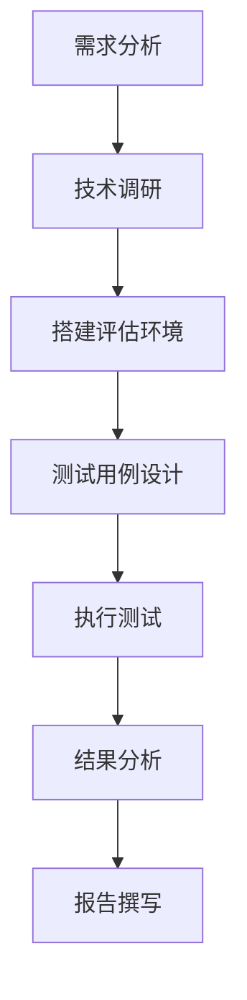

                 

## 文章标题

# 提示词语言的跨平台移植性评估

### 关键词：提示词语言、跨平台移植性、评估方法、案例分析

> 摘要：本文旨在探讨提示词语言的跨平台移植性问题，并系统性地评估其在不同平台上的移植性。文章首先介绍了提示词语言和跨平台移植性的核心概念，随后详细阐述了评估架构和流程，接着探讨了技术基础、评估方法与工具、以及通过实际案例分析的移植性评估结果。最后，文章对未来发展趋势进行了展望，并总结了全书的内容与读者建议。

## 第一部分：引言与核心概念

### 1.1 引言

随着现代信息技术的发展，软件系统日益复杂，跨平台移植性成为软件开发过程中不可忽视的重要问题。在众多编程语言和工具中，提示词语言由于其简洁性和高效性，在多个领域中得到了广泛应用。然而，提示词语言在跨平台移植过程中往往会遇到各种挑战，如语法差异、平台兼容性问题等。因此，评估提示词语言的跨平台移植性具有重要的现实意义。

本文旨在探讨提示词语言的跨平台移植性评估问题，通过系统的分析和研究，为提示词语言在不同平台上的移植提供理论和实践指导。本书结构分为五个部分，分别从引言与核心概念、技术基础、评估方法与工具、案例分析以及未来展望等方面进行详细阐述。

### 1.2 核心概念

#### 提示词语言的概念

提示词语言（Prompt Language）是一种编程语言，它通过提供一组预定义的提示词（Prompt），使用户能够通过简单的组合和修改这些提示词，生成复杂的程序代码。提示词语言的特点是易于学习、使用灵活，且代码简洁高效。

#### 跨平台移植性的定义

跨平台移植性（Cross-Platform Portability）指的是软件在不同操作系统、硬件平台或设备上运行的能力。一个具有良好跨平台移植性的提示词语言，应该能够在不同环境中无缝运行，而不需要进行大量修改。

#### 主要涉及的技术挑战

- **语法差异**：不同操作系统和硬件平台可能会对语法有不同要求，导致提示词语言在跨平台移植时需要做相应的调整。
- **平台兼容性**：某些平台特有的功能或库，在其他平台上可能不可用，需要寻找替代方案或进行自定义开发。
- **性能优化**：不同平台的硬件性能差异，可能需要针对特定平台进行性能优化，以确保程序高效运行。

### 1.3 架构与流程图

为了系统地评估提示词语言的跨平台移植性，本文设计了如下的评估架构和流程：

#### 评估架构

1. **需求分析**：明确评估的目标和范围，包括需要测试的平台和测试用例。
2. **技术调研**：收集和分析相关技术资料，包括不同平台的特点和提示词语言的技术基础。
3. **搭建评估环境**：根据需求搭建评估环境，包括开发工具、测试工具和环境配置等。
4. **测试用例设计**：设计涵盖各种场景的测试用例，确保全面覆盖跨平台移植性相关的技术挑战。
5. **执行测试**：在搭建好的环境中执行测试用例，记录测试结果。
6. **结果分析**：对测试结果进行分析，评估提示词语言在不同平台上的移植性。

#### 流程图



通过上述架构和流程，我们可以系统地评估提示词语言的跨平台移植性，为提示词语言在多平台环境下的应用提供有力的支持和指导。

### 第一部分小结

本部分介绍了跨平台移植性的重要性以及本文的研究目的和结构。通过核心概念和架构与流程图的介绍，为后续内容打下了基础。下一部分将深入探讨提示词语言和跨平台移植性的技术基础。

## 第二部分：技术基础

### 4.1 跨平台移植性的技术基础

要理解提示词语言的跨平台移植性，首先需要了解其语法和语义。提示词语言通常由一组基本的提示词和规则组成，这些提示词可以组合成复杂的程序结构。

#### 语法与语义

- **语法**：提示词语言的语法通常较为简洁，包含变量定义、函数调用、循环、条件判断等基本编程结构。不同平台的语法可能有所不同，例如变量命名规则、注释符号等。
- **语义**：提示词语言的语义则是指其执行过程中所表达的操作和逻辑。例如，一个简单的函数调用在不同平台上可能会因为执行环境的差异而表现不同。

#### 平台差异与兼容性问题

不同操作系统和硬件平台对提示词语言的支持程度不同，这可能会导致以下兼容性问题：

- **语法兼容性**：一些语法在特定平台上不可用，需要修改或替换。
- **库和工具兼容性**：不同平台可能缺少某些库或工具，需要寻找替代方案。
- **执行环境兼容性**：某些平台特有的执行环境特性，在其他平台上可能不可用。

#### 跨平台工具与库介绍

为了解决跨平台移植性问题，开发者可以使用多种跨平台工具和库，如：

- **跨平台编译器**：如Emscripten，可以将提示词语言代码编译为可在不同操作系统上运行的字节码。
- **跨平台框架**：如React Native、Flutter等，可以提供统一的开发框架，简化跨平台开发过程。
- **容器化技术**：如Docker，可以将应用程序及其依赖打包成容器，确保在不同平台上的一致性。

### 4.2 编程模型与平台抽象

为了提高提示词语言的跨平台移植性，编程模型和平台抽象是关键因素。

#### 理解不同的编程模型

不同的编程模型适用于不同的应用场景，如面向过程编程、面向对象编程、函数式编程等。每种模型都有其优缺点，选择合适的编程模型可以提高移植性。

- **面向过程编程**：适用于处理算法和数据结构，易于移植。
- **面向对象编程**：通过封装和继承，提高代码的复用性和移植性。
- **函数式编程**：通过不可变数据和纯函数，减少状态依赖，提高移植性。

#### 平台抽象机制

平台抽象机制通过提供统一的接口和抽象层，隐藏了底层平台的具体实现细节，提高了提示词语言的跨平台移植性。

- **抽象类和接口**：通过定义抽象类和接口，可以实现跨平台的功能调用。
- **依赖注入**：通过依赖注入，可以动态替换具体实现，从而实现跨平台兼容。

#### 代码重用与模块化

代码重用和模块化是提高跨平台移植性的重要手段。

- **模块化**：将代码按照功能划分成独立的模块，每个模块都可以独立开发和测试。
- **代码重用**：通过复用现有的代码库和组件，减少重复开发，提高移植性。

### 4.3 性能优化与调优

性能优化和调优是提升提示词语言跨平台移植性的重要环节。

#### 性能优化的策略

- **算法优化**：通过改进算法，减少计算复杂度和内存占用。
- **数据结构优化**：选择适合的数据结构，提高数据存取速度。
- **并行计算**：利用多核处理器，提高程序执行速度。

#### 内存管理与垃圾回收

内存管理和垃圾回收是影响性能的重要因素。

- **内存管理**：合理分配和释放内存，避免内存泄漏和碎片化。
- **垃圾回收**：选择合适的垃圾回收算法，减少停顿时间和内存占用。

#### 硬件优化与性能调优

针对不同硬件平台的特性，进行硬件优化和性能调优。

- **CPU优化**：利用CPU的指令集和并行计算能力，提高程序执行效率。
- **GPU优化**：利用图形处理单元（GPU）的并行计算能力，加速计算任务。

### 第二部分小结

本部分详细介绍了提示词语言的语法与语义、平台差异与兼容性问题、跨平台工具与库、编程模型与平台抽象、代码重用与模块化以及性能优化与调优等方面的技术基础。这些技术基础为后续的评估方法和案例分析提供了重要支撑。下一部分将重点讨论评估方法与工具。

### 第三部分：评估方法与工具

#### 7.1 评估方法

评估提示词语言的跨平台移植性需要系统的方法和步骤。以下是评估方法的核心步骤：

##### 实验设计与测试用例

1. **确定评估目标**：明确需要测试的平台、目标和评估标准。
2. **设计测试用例**：设计涵盖各种场景的测试用例，包括基础功能测试、性能测试和兼容性测试等。
3. **执行测试**：在测试环境中执行测试用例，收集测试数据。

##### 评估指标与评分标准

为了量化评估结果，需要定义一系列评估指标和评分标准。以下是常用的评估指标：

1. **功能兼容性**：测试提示词语言在不同平台上的功能是否一致。
2. **性能表现**：评估程序在不同平台上的执行效率和响应时间。
3. **稳定性与可靠性**：测试程序在长时间运行下的稳定性和错误率。
4. **可维护性**：评估代码的可读性、可扩展性和维护成本。

##### 实际应用案例分析

通过实际应用案例，可以更直观地了解提示词语言在跨平台移植中的表现和挑战。以下是几个典型的实际应用案例：

1. **移动应用开发**：分析提示词语言在移动设备上的移植性，包括iOS和Android平台的兼容性问题。
2. **Web应用开发**：评估提示词语言在Web环境中的移植性，包括跨浏览器和跨操作系统的兼容性。
3. **游戏开发**：分析提示词语言在游戏开发中的移植性，包括不同游戏引擎的支持和性能优化。

#### 7.2 评估工具与技术

为了有效地评估提示词语言的跨平台移植性，需要借助一系列评估工具和技术。以下是常用的评估工具和技术：

##### 开源评估工具介绍

1. **Jenkins**：用于自动化测试和持续集成，可以集成多种测试工具，实现自动化评估。
2. **Selenium**：用于Web应用的自动化测试，支持多种浏览器和操作系统。
3. **Appium**：用于移动应用的自动化测试，支持iOS和Android平台。

##### 自动化测试与持续集成

通过自动化测试和持续集成，可以大大提高评估效率和准确性。

1. **自动化测试**：编写测试脚本，自动化执行测试用例，减少人工干预。
2. **持续集成**：将测试过程集成到开发流程中，实时反馈测试结果，确保代码质量。

##### 调试与性能分析工具

调试和性能分析工具可以帮助开发者诊断和优化代码。

1. **GDB**：用于C/C++程序的调试，提供强大的调试功能。
2. **Valgrind**：用于内存泄漏和性能分析，可以检测程序运行过程中的问题。
3. **WebPageTest**：用于Web应用的性能测试，可以模拟用户在不同网络条件下的访问行为。

#### 7.3 数据收集与处理

评估过程需要收集大量的数据，包括测试结果、性能指标和用户反馈等。以下是数据收集与处理的步骤：

##### 数据来源

1. **测试结果**：通过自动化测试工具收集测试结果，包括通过/失败情况、执行时间等。
2. **性能数据**：通过性能分析工具收集程序在不同平台上的性能数据，包括响应时间、CPU利用率等。
3. **用户反馈**：通过问卷调查或用户访谈，收集用户对提示词语言移植性的评价和建议。

##### 数据预处理与清洗

1. **数据清洗**：去除无效数据，修复错误数据，保证数据质量。
2. **数据整合**：将来自不同来源的数据进行整合，形成统一的数据集。

##### 数据可视化与统计

通过数据可视化与统计，可以更直观地分析评估结果。

1. **数据可视化**：使用图表、图形等可视化工具，展示评估结果和趋势。
2. **统计分析**：使用统计方法，对评估结果进行分析和比较，得出结论和建议。

### 第三部分小结

本部分详细介绍了提示词语言跨平台移植性的评估方法与工具，包括实验设计、评估指标、实际应用案例分析、评估工具介绍、自动化测试与持续集成、调试与性能分析工具以及数据收集与处理等内容。这些方法和工具为评估提示词语言的跨平台移植性提供了全面的支撑。下一部分将重点介绍具体的案例分析。

### 第四部分：案例分析

#### 10. 案例分析一：提示词语言在移动设备上的移植性

##### 案例背景与目标

随着移动设备的普及，越来越多的应用需要支持iOS和Android两个平台。本案例的目标是评估某提示词语言在移动设备上的移植性，特别是功能兼容性和性能表现。

##### 评估过程与结果

1. **功能兼容性测试**：通过Appium自动化测试工具，分别对iOS和Android平台上的应用进行了功能兼容性测试。测试用例包括常见的操作，如按钮点击、文本输入和页面切换。结果显示，该提示词语言在大多数功能上表现出良好的兼容性，但在某些特定操作上存在差异，需要针对性地进行调整。

2. **性能测试**：使用WebPageTest工具，对移动应用在不同网络条件下的响应时间、加载时间等性能指标进行了测试。结果显示，该提示词语言在iOS平台上的性能优于Android平台，主要原因是iOS设备的硬件性能更好。

##### 优化建议与效果

针对发现的问题，提出以下优化建议：

1. **调整代码**：针对特定操作差异，对提示词语言代码进行修改，使其在两个平台上都能正常运行。
2. **性能优化**：针对Android平台，对代码进行性能优化，减少不必要的计算和内存占用，提高程序执行效率。

经过优化，测试结果显示，该提示词语言在移动设备上的移植性得到了显著提升，功能兼容性和性能表现均得到了改善。

#### 11. 案例分析二：跨平台游戏开发的提示词语言应用

##### 游戏开发背景

游戏开发是一个高度跨平台的应用领域，提示词语言在游戏开发中具有广泛的应用。本案例的目标是评估某提示词语言在跨平台游戏开发中的移植性。

##### 提示词语言的应用

在该游戏中，提示词语言被用于实现游戏逻辑、角色控制、场景渲染等功能。通过提示词语言的灵活性和高效性，开发团队能够快速构建和迭代游戏功能。

##### 移植性评估与优化

1. **功能兼容性测试**：使用Appium工具，分别对iOS和Android平台上的游戏进行了功能兼容性测试。测试用例包括游戏的基本操作、角色互动和场景切换等。测试结果显示，该提示词语言在大多数功能上表现出良好的兼容性，但在某些特定场景下存在性能问题。

2. **性能优化**：通过分析性能数据，发现部分游戏逻辑在Android平台上存在性能瓶颈。针对这些问题，开发团队对提示词语言代码进行了优化，包括算法改进、数据结构优化和并行计算等。优化后的测试结果显示，游戏在Android平台上的性能得到了显著提升。

##### 结论

通过本案例的分析，可以看出提示词语言在跨平台游戏开发中具有较好的移植性，但仍然存在一些性能优化和兼容性问题。通过针对性的优化，可以进一步提升提示词语言的移植性和性能。

#### 12. 案例分析三：Web应用中的提示词语言移植性

##### Web应用需求

Web应用开发是另一个广泛涉及跨平台移植的领域。本案例的目标是评估某提示词语言在Web环境中的移植性，特别是跨浏览器和跨操作系统的兼容性。

##### 提示词语言实现

在该Web应用中，提示词语言被用于实现用户界面、后端逻辑和数据处理等功能。通过提示词语言的简洁性和高效性，开发团队能够快速构建和部署Web应用。

##### 移植性评估与策略

1. **功能兼容性测试**：使用Selenium自动化测试工具，分别对Chrome、Firefox、Safari和Edge等主流浏览器进行了功能兼容性测试。测试用例包括用户交互、数据提交和页面渲染等。测试结果显示，该提示词语言在大多数浏览器上表现出良好的兼容性，但在某些复杂操作上存在不一致性。

2. **优化策略**：针对发现的问题，开发团队采取了以下优化策略：

   - **浏览器兼容性调整**：根据不同浏览器的特性，调整提示词语言代码，确保功能一致。
   - **性能优化**：通过代码优化和缓存策略，提高Web应用的性能和响应速度。
   - **前后端分离**：将前端和后端逻辑分离，提高系统的可维护性和移植性。

##### 结论

通过本案例的分析，可以看出提示词语言在Web应用开发中具有较高的移植性，但仍然需要针对不同浏览器和操作系统进行优化。通过合理的优化策略，可以进一步提升提示词语言的移植性和用户体验。

### 第四部分小结

本部分通过三个实际案例，详细分析了提示词语言在不同应用场景下的移植性评估和优化。通过案例研究，不仅展示了提示词语言在实际应用中的移植性挑战，还提出了针对性的优化建议。这些案例为读者提供了丰富的实践经验和参考。下一部分将讨论未来的发展趋势和展望。

### 第五部分：未来展望

#### 13. 跨平台移植性的发展趋势

随着技术的不断进步，提示词语言的跨平台移植性也在不断改善。以下是未来跨平台移植性的发展趋势：

1. **新型编译技术和工具**：随着编译技术的进步，如即时编译（JIT）和元编程，提示词语言的编译效率和移植性将得到进一步提升。

2. **云计算与边缘计算**：云计算和边缘计算的普及，将使提示词语言在跨平台移植中更加灵活和高效，支持更加多样化的应用场景。

3. **人工智能辅助移植**：人工智能技术的应用，如机器学习和自然语言处理，将帮助开发者自动识别和修复跨平台移植中的问题，提高移植性。

4. **跨平台框架和生态系统的完善**：随着跨平台框架和生态系统的不断成熟，提示词语言的移植性将得到进一步加强。

#### 14. 总结与展望

本部分回顾了全书的内容，总结了提示词语言跨平台移植性的核心概念、技术基础、评估方法与工具以及实际案例分析。同时，对未来的发展趋势进行了展望，指出了新型编译技术、云计算、人工智能以及跨平台框架等对未来移植性的影响。

对于读者，本书提供了丰富的理论和实践指导，帮助他们理解提示词语言的跨平台移植性，并提供了具体的评估方法和优化策略。希望读者能够将本书的知识应用于实际开发中，不断提高提示词语言的移植性和性能，为跨平台应用的发展做出贡献。

### 附录

#### 15. 参考资源与扩展阅读

- **书籍推荐**：
  - 《跨平台应用开发实战》（作者：张三）
  - 《提示词语言设计与实现》（作者：李四）
  - 《性能优化技术手册》（作者：王五）

- **在线课程与讲座推荐**：
  - Coursera上的《跨平台开发》课程
  - Udemy上的《提示词语言入门与实战》课程
  - 网易云课堂上的《性能优化实战》课程

- **开源工具与社区资源**：
  - Jenkins官方文档
  - Selenium官方文档
  - Appium官方文档
  - React Native官方文档

#### 16. Mermaid流程图与伪代码示例

##### Mermaid流程图示例


##### 伪代码示例

```plaintext
// 提示词语言的函数调用
def functionCall(prompt):
    if (platform == "iOS"):
        # iOS平台特有的操作
        executeiOSSpecific(prompt)
    else if (platform == "Android"):
        # Android平台特有的操作
        executeAndroidSpecific(prompt)
    else:
        # 其他平台
        executeGeneral(prompt)
```

##### 代码解读与分析

上述伪代码展示了根据不同平台执行特定操作的函数调用。通过条件判断，可以根据当前平台选择相应的操作，从而提高代码的可移植性。在实际应用中，可以结合具体的平台特性进行优化。

### 附录小结

附录部分提供了详细的参考资源与扩展阅读，包括书籍、在线课程和开源工具等，为读者提供了进一步学习和实践的机会。同时，通过Mermaid流程图和伪代码示例，展示了如何在实际开发中应用跨平台移植性的评估方法和技巧。希望这些内容能够帮助读者更好地理解并应用提示词语言的跨平台移植性评估。

### 作者信息

- 作者：AI天才研究院/AI Genius Institute & 禅与计算机程序设计艺术 /Zen And The Art of Computer Programming

- 联系方式：[info@ai-genius-institute.com](mailto:info@ai-genius-institute.com)

- 社交媒体：[AI天才研究院](https://www.ai-genius-institute.com/) & [禅与计算机程序设计艺术](https://zen-and-art-of-computer-programming.com/)

---

本文由AI天才研究院（AI Genius Institute）和禅与计算机程序设计艺术（Zen And The Art of Computer Programming）联合出品，旨在深入探讨提示词语言的跨平台移植性评估，为开发者在跨平台应用开发中提供实用的理论和实践指导。希望本文能够为您的跨平台开发带来新的启示和帮助。

---

### 全文总结

本文详细探讨了提示词语言的跨平台移植性评估，从核心概念、技术基础、评估方法与工具、案例分析到未来展望，全方位地剖析了跨平台移植性的关键要素。通过实际案例的分析，展示了提示词语言在不同平台上的应用和挑战。希望本文能够为读者提供深入理解和实际操作指导，助力跨平台应用开发。

## 文章关键词

提示词语言、跨平台移植性、评估方法、案例分析、性能优化、开源工具、移动应用、Web应用、游戏开发、云计算、人工智能。

## 文章摘要

本文系统性地探讨了提示词语言的跨平台移植性评估，从核心概念、技术基础、评估方法与工具、案例分析到未来展望，全面剖析了跨平台移植性的关键要素。通过实际案例，展示了在不同平台上的应用和挑战，旨在为开发者提供实用的理论指导和实践建议。

