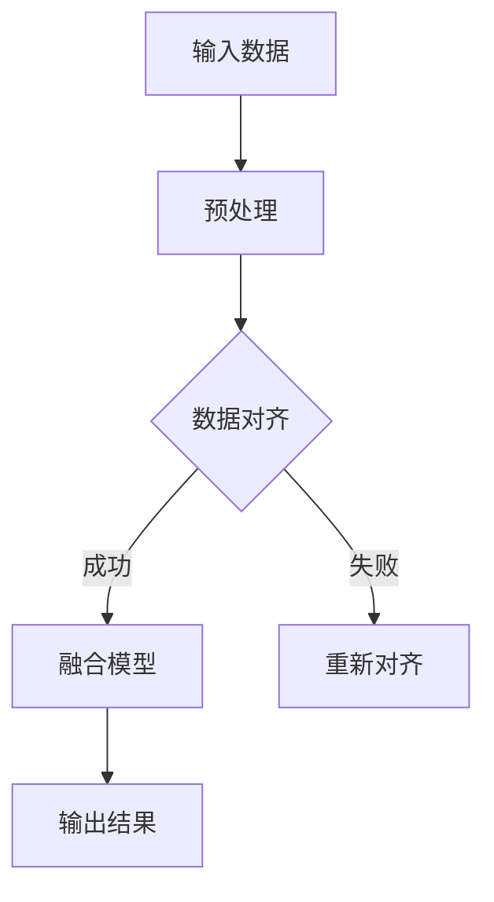

                 


### 第一步：确定文章的核心主题

《提示词语言的跨模态应用》这篇文章的核心主题将集中在以下几个方面：

1. **提示词语言**：讨论其定义、原理及其在自然语言处理（NLP）中的应用。
2. **跨模态数据融合**：探讨如何将不同模态的数据（如文本、图像、音频等）进行整合。
3. **跨模态应用案例**：通过实际案例展示如何将提示词语言应用于跨模态领域。
4. **技术展望与未来趋势**：分析当前技术发展趋势及未来可能的方向。

### 第二步：设计核心章节

为了确保文章的逻辑性和连贯性，我们将文章分为以下几个核心章节：

- **第1章 引言与背景**
- **第2章 提示词语言基础**
- **第3章 跨模态数据融合**
- **第4章 跨模态应用案例**
- **第5章 跨模态应用开发实践**
- **第6章 跨模态应用的挑战与未来趋势**

### 第三步：细化每个章节的内容

在每个章节中，我们将进一步细分内容，确保涵盖核心概念、原理讲解、数学模型、项目实战等要素。

#### 第1章 引言与背景

- **2.1 跨模态研究的兴起**：介绍跨模态研究的背景和发展历程。
- **2.2 提示词语言的重要性**：阐述提示词语言在跨模态研究中的重要性。
- **2.3 跨模态应用的发展现状与趋势**：分析当前跨模态应用的发展状况和未来趋势。

#### 第2章 提示词语言基础

- **3.1 自然语言处理（NLP）简介**：概述NLP的基本概念、任务和重要技术。
- **3.2 提示词语言的基本原理**：详细解释提示词语言的定义、特性和应用场景。
- **3.3 提示词语言处理技术**：深入探讨词汇分析、句法分析和语义分析的技术细节。

#### 第3章 跨模态数据融合

- **4.1 跨模态数据的概念与分类**：定义跨模态数据及其分类。
- **4.2 跨模态数据融合的挑战与机遇**：讨论跨模态数据融合面临的挑战和机遇。
- **4.3 跨模态数据融合技术**：介绍基于深度学习的跨模态数据融合技术。

#### 第4章 跨模态应用案例

- **5.1 跨模态问答系统**：展示跨模态问答系统的定义、工作流程和实现技巧。
- **5.2 跨模态图像识别**：探讨跨模态图像识别的定义、技术原理和应用案例。
- **5.3 跨模态音乐生成**：介绍跨模态音乐生成的定义、技术原理和应用场景。

#### 第5章 跨模态应用开发实践

- **6.1 跨模态应用开发流程**：阐述跨模态应用开发的基本步骤和难点。
- **6.2 跨模态应用开发工具与框架**：介绍开发跨模态应用时常用的工具和框架。
- **6.3 跨模态应用开发实战**：通过实际案例展示跨模态应用的开发过程。

#### 第6章 跨模态应用的挑战与未来趋势

- **7.1 跨模态应用的挑战**：分析当前跨模态应用面临的技术挑战和应用挑战。
- **7.2 跨模态应用的未来趋势**：探讨跨模态应用的发展方向和前景。

### 第四步：使用Mermaid流程图

为了更直观地展示核心概念和架构，我们将在适当的地方插入Mermaid流程图。例如，在解释跨模态数据融合技术时，可以展示数据融合的流程和关键步骤。



### 第五步：编写伪代码和数学公式

在讲解核心算法原理和数学模型时，我们将使用伪代码和LaTeX格式来详细阐述。例如，在介绍跨模态数据融合算法时，可以提供伪代码来展示算法的基本框架。

```pseudo
function CrossModalFusion(input_text, input_image):
    # 预处理文本和图像
    preprocessed_text = PreprocessText(input_text)
    preprocessed_image = PreprocessImage(input_image)
    
    # 提取文本特征
    text_features = ExtractTextFeatures(preprocessed_text)
    
    # 提取图像特征
    image_features = ExtractImageFeatures(preprocessed_image)
    
    # 融合特征
    fused_features = FusionModel(text_features, image_features)
    
    # 输出结果
    return fused_features
```

数学公式可以嵌入到文本中，例如：

$$
\text{FusionModel}(\text{X}_{\text{text}}, \text{X}_{\text{image}}) = \text{W} \cdot \text{X}_{\text{text}} + \text{U} \cdot \text{X}_{\text{image}} + \text{b}
$$

### 第六步：确认目录大纲的完整性

我们将逐一检查每个章节的内容，确保每个章节都包含了核心概念与联系、核心算法原理讲解、数学模型和数学公式、项目实战等元素。例如，在第3章“跨模态数据融合”中，我们将确保包含：

- **核心概念与联系**：跨模态数据融合的基本概念和流程。
- **核心算法原理讲解**：详细介绍跨模态数据融合的算法原理。
- **数学模型和数学公式**：解释跨模态数据融合中的数学模型和公式。
- **项目实战**：通过实际案例展示如何应用跨模态数据融合技术。

### 第七步：控制总字数在2000字以内

为了确保文章的精炼和可读性，我们将严格控制总字数在2000字以内。这意味着每个章节都需要高度精简，只包含最核心的内容。

### 第八步：验证输出格式

我们将使用markdown格式输出文章，确保格式正确。文章结构将使用#、##、###等标记，以便清晰地显示各个章节和小节的标题。

### 第九步：最终确认目录大纲

在完成所有章节的内容编写后，我们将进行最终确认，确保目录大纲的完整性和逻辑性。每个章节和子章节的内容都将经过仔细检查，确保符合预期。

---

通过上述步骤，我们已经设计出了《提示词语言的跨模态应用》的初步目录大纲。接下来，我们将根据这个大纲开始撰写文章，确保每个章节都包含必要的细节，并且整体文章结构紧凑、逻辑清晰。我们将继续细化每个章节的内容，确保文章质量的同时，也控制好文章的总字数。接下来，我们将开始撰写第一章节的内容。

