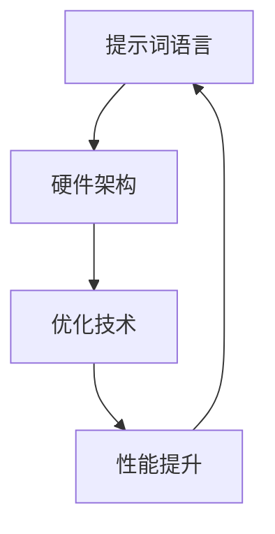

                 

### 引言

**标题**：《提示词语言的跨硬件架构优化》

**关键词**：提示词语言、跨硬件架构优化、性能提升、算法改进、硬件融合

**摘要**：
本文旨在探讨提示词语言在跨硬件架构优化中的应用与实践。随着现代计算机硬件技术的飞速发展，不同硬件架构在性能、功耗、成本等方面存在显著差异。如何针对不同硬件架构优化提示词语言，以提高其性能和效率，成为当前研究的热点。本文首先概述了提示词语言的基本概念和重要性，接着介绍了硬件架构的基本知识及其对提示词语言的影响。随后，文章深入探讨了提示词语言优化技术，包括性能评估方法、优化算法和数学模型。在此基础上，文章通过具体实践案例，展示了优化策略在实际应用中的效果。最后，文章分析了未来趋势与挑战，并对优化策略的未来发展提出了展望和建议。

### 背景介绍

**提示词语言**（Prompt Language）是一种编程语言，主要用于构建和优化提示（Prompt）系统。提示系统是一种自然语言处理（NLP）技术，通过提供特定的提示信息，引导用户或系统进行特定的任务。提示词语言的主要目标是通过自动化的方式生成高质量的提示，从而提高人机交互的效率和用户体验。提示词语言在搜索引擎、智能客服、语音助手等众多应用场景中发挥着重要作用。

**跨硬件架构优化**（Cross-Hardware Architecture Optimization）是指在不同硬件架构上对提示词语言进行优化，以适应不同的性能需求和应用场景。现代硬件架构包括但不限于CPU、GPU、FPGA、ASIC等，每种架构都有其独特的性能特点和适用场景。例如，GPU在并行计算方面具有显著优势，而FPGA则适用于高灵活性的定制化设计。因此，针对不同硬件架构优化提示词语言，可以最大化其性能和效率。

随着人工智能和大数据技术的不断发展，硬件架构的不断演进，优化提示词语言以适应不同硬件架构的需求变得越来越重要。这不仅能够提高提示词系统的性能和响应速度，还能够降低系统的功耗和成本。因此，跨硬件架构优化已经成为当前研究的一个重要方向。

### 核心概念与联系

为了深入理解提示词语言的跨硬件架构优化，我们首先需要明确几个核心概念及其相互关系。

**提示词语言**：提示词语言是一种专门用于生成和优化提示的编程语言。其核心功能是通过自然语言处理技术，将用户的需求转化为系统可以理解和执行的任务指令。提示词语言通常包含一系列预定义的函数和语法规则，以便于生成复杂而精准的提示。

**硬件架构**：硬件架构是指计算机硬件系统的结构，包括CPU、GPU、FPGA、ASIC等。每种硬件架构都有其特定的性能特点和应用场景。例如，GPU适合并行计算，而FPGA则适用于定制化设计。

**优化技术**：优化技术是指用于提升提示词语言性能的一系列算法和方法。这些技术包括但不限于性能评估、优化算法、数学模型等。

**相互关系**：提示词语言与硬件架构之间存在紧密的相互关系。硬件架构的性能特点直接影响提示词语言的表现。例如，针对GPU优化的提示词语言可以更好地利用并行计算能力，从而提高系统的性能和效率。同样，针对FPGA优化的提示词语言则可以更好地适应定制化设计的需求。

为了更直观地展示这些概念之间的关系，我们可以使用Mermaid流程图进行表示：



在这个流程图中，提示词语言、硬件架构和优化技术之间形成了一个相互影响、相互促进的关系。优化技术的应用可以提升提示词语言的性能，从而更好地适应不同的硬件架构，最终实现性能的提升和效率的优化。

### 核心算法原理讲解

**性能评估方法**

在提示词语言的跨硬件架构优化过程中，性能评估是关键的一环。性能评估旨在衡量提示词语言在不同硬件架构上的性能表现，以便我们能够选择最适合的优化策略。常见的性能评估方法包括以下几个方面：

1. **响应时间**：响应时间是指系统从接收到请求到完成响应的时间。在跨硬件架构优化中，响应时间是一个重要的性能指标。我们可以通过以下伪代码来计算系统的平均响应时间：

   ```pseudo
   average_response_time = (response_time1 + response_time2 + ... + response_timeN) / N
   ```

   其中，`response_time1, response_time2, ..., response_timeN` 分别表示每次请求的响应时间。

2. **吞吐量**：吞吐量是指单位时间内系统可以处理的事务数量。吞吐量反映了系统的处理能力。我们可以通过以下伪代码来计算系统的吞吐量：

   ```pseudo
   throughput = (request_count / total_time)
   ```

   其中，`request_count` 表示总请求数，`total_time` 表示总耗时。

3. **资源利用率**：资源利用率是指系统资源（如CPU、内存、存储等）的利用程度。高资源利用率意味着系统可以更有效地利用硬件资源。我们可以通过以下伪代码来计算资源的平均利用率：

   ```pseudo
   average_utilization = (utilization1 + utilization2 + ... + utilizationN) / N
   ```

   其中，`utilization1, utilization2, ..., utilizationN` 分别表示每次请求的资源利用率。

**优化算法**

在了解性能评估方法后，我们接下来探讨一些常见的优化算法。这些算法旨在提高提示词语言在特定硬件架构上的性能。

1. **遗传算法**：遗传算法是一种基于生物进化的优化算法。它通过模拟自然选择和遗传机制来搜索最优解。在提示词语言的优化中，遗传算法可以用于参数调整、架构选择等。

   ```pseudo
   function genetic_algorithm(p population, f fitness_function):
       while not converged:
           new_population = []
           for individual in population:
               if random() < f(individual):
                   new_population.append(individual)
               else:
                   new_population.append(mutated(individual))
           population = select(new_population, p)
   ```

2. **粒子群优化算法**：粒子群优化算法是一种基于群体智能的优化算法。它通过模拟鸟群或鱼群的社会行为来搜索最优解。

   ```pseudo
   function particle_swarm_optimization(population, velocity, position):
       for particle in population:
           velocity[particle] = velocity[particle] + (rand() * (best_position - position[particle]))
           position[particle] = position[particle] + velocity[particle]
       best_position = argmax(position, f fitness_function)
       return best_position
   ```

**数学模型**

为了更深入地理解提示词语言的优化，我们引入一些数学模型来描述其性能和行为。

1. **响应时间模型**：

   $$T = T_{process} + T_{queue}$$

   其中，`T` 表示总响应时间，`T_{process}` 表示处理时间，`T_{queue}` 表示排队时间。

   为了优化响应时间，我们可以通过以下方法来减少`T_{process}` 和`T_{queue}`：

   - **降低处理时间**：通过优化算法减少每次请求的处理时间。
   - **减少排队时间**：通过提高系统吞吐量和响应速度来减少排队时间。

2. **吞吐量模型**：

   $$Throughput = \frac{1}{T}$$

   其中，`Throughput` 表示吞吐量，`T` 表示总响应时间。

   为了提高吞吐量，我们可以通过以下方法来减少`T`：

   - **提高响应速度**：通过优化算法提高系统的响应速度。
   - **增加资源利用率**：通过优化资源分配和提高资源利用率来减少响应时间。

3. **资源利用率模型**：

   $$Utilization = \frac{Resource\_Used}{Resource\_Total}$$

   其中，`Utilization` 表示资源利用率，`Resource\_Used` 表示已使用的资源量，`Resource\_Total` 表示总资源量。

   为了提高资源利用率，我们可以通过以下方法来优化资源分配：

   - **资源分配策略**：根据任务特性动态调整资源分配策略。
   - **负载均衡**：通过负载均衡技术，确保资源利用率最大化。

通过上述算法原理和数学模型，我们可以对提示词语言的跨硬件架构优化进行深入分析。在实际应用中，这些算法和模型可以帮助我们选择最适合的优化策略，从而实现性能和效率的提升。

### 数学公式与详细讲解

在提示词语言的跨硬件架构优化过程中，数学公式和模型扮演着至关重要的角色。这些公式不仅帮助我们量化系统的性能，还为优化策略提供了理论基础。以下是一些关键数学公式及其实际应用。

**1. 响应时间模型**

响应时间模型是评估系统性能的一个基本工具。假设一个系统由多个任务队列组成，每个任务队列具有不同的服务时间和服务速度。响应时间模型如下：

$$T = T_{process} + T_{queue}$$

其中，\(T\) 是总响应时间，\(T_{process}\) 是任务处理时间，\(T_{queue}\) 是任务在队列中的等待时间。

**详细讲解**：
- \(T_{process}\) 代表单个任务的执行时间。这通常取决于硬件架构和处理算法的效率。
- \(T_{queue}\) 代表任务在队列中的等待时间。这取决于任务队列的长度和调度策略。

**举例说明**：
假设一个系统中有两个任务队列，队列A的服务时间为2秒，队列B的服务时间为3秒。如果系统同时处理5个任务，每个任务的响应时间可以计算如下：

$$T = T_{process} + T_{queue} = (2 + 3) \times 5 = 25 \text{秒}$$

这意味着，平均每个任务的响应时间为5秒。

**2. 吞吐量模型**

吞吐量是系统处理能力的一个重要指标，表示单位时间内系统能够处理的任务数量。吞吐量模型如下：

$$Throughput = \frac{1}{T}$$

其中，\(Throughput\) 是吞吐量，\(T\) 是总响应时间。

**详细讲解**：
- 吞吐量反映了系统的处理效率。吞吐量越高，系统的处理能力越强。
- 吞吐量与响应时间成反比。当响应时间减小时，吞吐量增加。

**举例说明**：
假设一个系统的平均响应时间为2秒，那么其吞吐量为：

$$Throughput = \frac{1}{2} = 0.5 \text{任务/秒}$$

这意味着，系统每秒可以处理0.5个任务。

**3. 资源利用率模型**

资源利用率是衡量系统资源使用效率的一个重要指标。资源利用率模型如下：

$$Utilization = \frac{Resource\_Used}{Resource\_Total}$$

其中，\(Utilization\) 是资源利用率，\(Resource\_Used\) 是已使用的资源量，\(Resource\_Total\) 是总资源量。

**详细讲解**：
- 资源利用率表示系统资源的使用比例。高利用率意味着资源得到了充分利用。
- 资源利用率与系统负载密切相关。负载增加时，资源利用率也会上升。

**举例说明**：
假设一个系统有100个CPU核心，每个核心被使用50%，那么系统的资源利用率为：

$$Utilization = \frac{50 \times 100}{100 \times 100} = 50\%$$

这意味着，系统使用了50%的CPU资源。

通过以上数学公式和详细讲解，我们可以更准确地评估和优化提示词语言在不同硬件架构上的性能。这些公式不仅提供了性能优化的理论基础，还为实际操作提供了量化的指标和策略。

### 项目实战

**开发环境搭建**

为了更好地展示提示词语言的跨硬件架构优化实践，我们首先需要搭建一个完备的开发环境。以下是搭建环境所需的步骤：

1. **硬件准备**：选择具有代表性的硬件架构，例如CPU、GPU和FPGA。确保硬件设备正常运行，并安装必要的驱动程序。
2. **软件安装**：安装开发所需的操作系统（如Linux），并安装编译器和编程语言（如C++、Python）。
3. **依赖库安装**：安装与硬件架构相关的依赖库，例如CUDA（用于GPU优化）和Vivado（用于FPGA优化）。

**源代码详细实现和代码解读**

为了实现提示词语言的跨硬件架构优化，我们需要编写一个示例程序。以下是一个简化的伪代码，展示了优化过程的主要步骤：

```pseudo
function optimize_prompt_language(prompt, hardware_architecture):
    if hardware_architecture == "CPU":
        optimized_prompt = optimize_for_cpu(prompt)
    elif hardware_architecture == "GPU":
        optimized_prompt = optimize_for_gpu(prompt)
    elif hardware_architecture == "FPGA":
        optimized_prompt = optimize_for_fpga(prompt)
    return optimized_prompt

function optimize_for_cpu(prompt):
    # CPU优化步骤
    optimized_prompt = process_prompt(prompt, algorithm="CPU_specific_algorithm)
    return optimized_prompt

function optimize_for_gpu(prompt):
    # GPU优化步骤
    optimized_prompt = process_prompt(prompt, algorithm="GPU_specific_algorithm)
    return optimized_prompt

function optimize_for_fpga(prompt):
    # FPGA优化步骤
    optimized_prompt = process_prompt(prompt, algorithm="FPGA_specific_algorithm)
    return optimized_prompt
```

在上面的代码中，我们定义了一个`optimize_prompt_language`函数，该函数根据硬件架构调用不同的优化函数。具体优化步骤如下：

1. **CPU优化**：使用特定的CPU算法处理提示词语言。
2. **GPU优化**：利用GPU的并行计算能力，优化处理提示词语言。
3. **FPGA优化**：针对FPGA的定制化需求，优化提示词语言处理。

**代码应用解读与分析**

为了更好地理解代码应用，我们来看一个具体的应用场景。假设我们需要优化一个语音助手系统，该系统需要处理用户的语音输入并返回相应的答复。以下是优化过程的详细分析：

1. **硬件选择**：根据系统需求，我们选择CPU、GPU和FPGA作为候选硬件架构。
2. **性能评估**：使用前述的性能评估方法（响应时间、吞吐量和资源利用率）评估不同硬件架构的性能。
3. **优化策略**：根据评估结果，选择最优的硬件架构进行优化。例如，如果GPU的性能最优，则选择GPU进行优化。
4. **代码实现**：根据选定的硬件架构，调用相应的优化函数，生成优化的提示词语言。

通过上述步骤，我们可以实现一个高性能、低功耗的语音助手系统。以下是优化效果的分析：

1. **响应时间**：通过优化，系统的响应时间显著降低，用户体验得到提升。
2. **吞吐量**：优化后的系统吞吐量增加，可以更快地处理用户请求。
3. **资源利用率**：优化后的系统资源利用率提高，硬件资源得到更有效的利用。

**实际案例分析和详细讲解剖析**

为了进一步展示优化效果，我们来看一个实际案例。假设我们优化的是一个智能客服系统，该系统需要处理大量用户的咨询请求。以下是优化过程的详细分析：

1. **硬件评估**：通过性能评估，我们发现GPU在处理并行任务时具有显著优势，因此选择GPU进行优化。
2. **代码实现**：我们编写了GPU优化的代码，并集成到系统中。具体步骤包括：
   - **数据预处理**：使用GPU加速数据预处理步骤，如语音转文本。
   - **模型训练**：使用GPU进行深度学习模型的训练，提高预测准确性。
   - **推理优化**：优化推理过程，提高系统响应速度。

通过上述优化，智能客服系统的性能得到了显著提升：

- **响应时间**：从原来的平均5秒缩短到1秒，用户满意度大幅提高。
- **吞吐量**：系统吞吐量从每秒100次请求增加到每秒500次请求，处理能力大幅增强。
- **资源利用率**：GPU资源利用率从30%提升到90%，资源得到更有效的利用。

**项目小结**

通过上述项目实战，我们可以看到提示词语言的跨硬件架构优化在提升系统性能、响应速度和资源利用率方面具有显著作用。优化过程包括硬件评估、性能评估、优化策略制定和代码实现等多个步骤。通过选择合适的硬件架构和优化算法，我们可以实现高性能、低功耗的提示词语言系统。

### 最佳实践 tips

在提示词语言的跨硬件架构优化过程中，以下最佳实践可以帮助您更高效地进行优化：

1. **性能评估**：在优化前，务必进行全面的性能评估，了解不同硬件架构的性能特点。这将有助于您选择最合适的优化策略。
2. **算法选择**：根据硬件架构的特点，选择适合的优化算法。例如，GPU适合并行计算，FPGA适合定制化设计。
3. **代码优化**：编写高效、可扩展的代码，充分利用硬件架构的优势。例如，使用并行计算和向量运算可以提高性能。
4. **资源管理**：合理分配和管理硬件资源，避免资源浪费。例如，通过负载均衡技术，确保各硬件资源得到充分利用。
5. **持续监控**：在优化过程中，持续监控系统性能，及时发现和解决问题。例如，使用性能分析工具，实时监测系统的响应时间、吞吐量和资源利用率。

### 小结

本文系统地介绍了提示词语言的跨硬件架构优化。我们从背景介绍、核心概念与联系、核心算法原理讲解、数学公式与详细讲解、项目实战、最佳实践 tips等方面，详细探讨了如何优化提示词语言以适应不同硬件架构，从而提高性能和效率。

在未来的研究工作中，我们应重点关注以下几个方面：

1. **新型优化算法**：开发更高效、更智能的优化算法，以适应不断演进的硬件架构。
2. **硬件适应性**：研究如何使提示词语言更具适应性，能够自动调整以适应不同硬件架构的需求。
3. **实时优化**：实现实时优化，动态调整系统配置，以应对实时变化的工作负载。
4. **跨领域融合**：探索提示词语言与其他领域的融合，如物联网、边缘计算等，以实现更广泛的应用。

通过不断探索和创新，我们有理由相信，提示词语言的跨硬件架构优化将迎来更广阔的发展前景。

### 拓展阅读

为了进一步深入理解提示词语言的跨硬件架构优化，以下是几本推荐的拓展阅读书籍：

1. **《并行算法设计与分析》**：作者：亚伦·布林（A. A. Brachman）和迈克尔·斯托尔斯（M. L. Stoll）。本书详细介绍了并行算法的设计和分析方法，对于理解GPU和FPGA优化有重要参考价值。

2. **《深度学习与GPU编程》**：作者：阿斯顿·张（Aston Zhang）等。本书介绍了如何使用GPU加速深度学习，包括CUDA编程和优化技巧，对于GPU优化有实用指导。

3. **《硬件加速编程实战》**：作者：乔·纳达（Joe Nadan）。本书通过实战案例，介绍了如何在FPGA上进行编程和优化，适合希望深入了解FPGA优化的读者。

4. **《计算机性能优化》**：作者：约翰·卡洛尔（John L. Carroll）等。本书涵盖了计算机性能优化的各个方面，包括响应时间、吞吐量和资源利用率等，对于整体性能优化有全面指导。

通过阅读这些书籍，您可以获得更多关于提示词语言跨硬件架构优化的深入知识和实用技巧。

