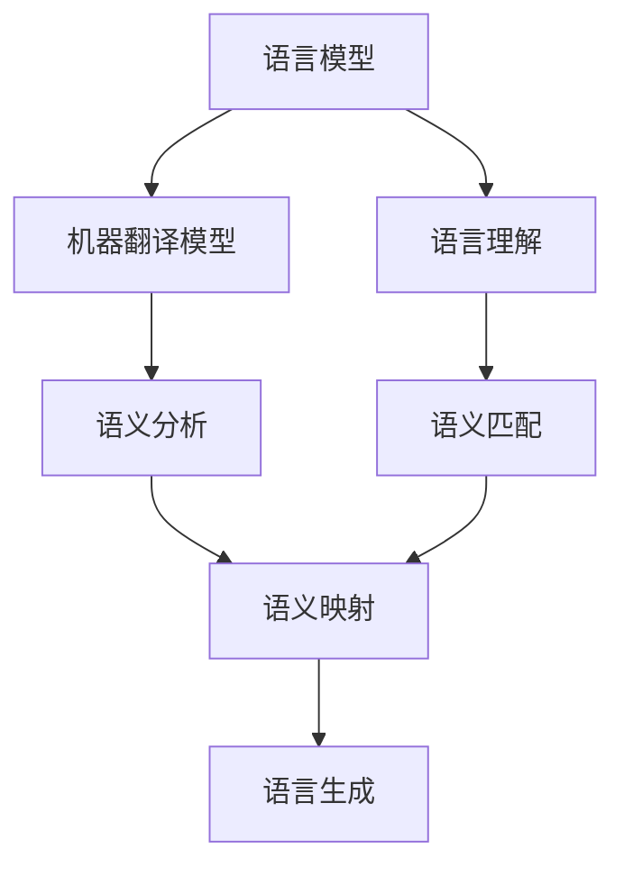

                 

# 《提示词语言的跨语言语义映射》

## 关键词

- 提示词
- 跨语言语义映射
- 机器翻译
- 语言模型
- 语义分析
- 神经网络

## 摘要

本文探讨了提示词语言的跨语言语义映射，即如何将一种语言的提示词映射到另一种语言的等效提示词。首先，我们介绍了跨语言语义映射的背景和意义，然后深入讨论了跨语言语义映射的基础知识，包括语言模型、机器翻译技术和语义分析技术。接着，我们详细介绍了常见的跨语言语义映射算法，如基于规则的方法、基于统计的方法和基于神经网络的方法。随后，我们探讨了跨语言语义映射中的挑战和解决方案，包括数据集不足、语义理解困难和阅读理解问题。文章最后展示了跨语言语义映射的应用实例，并对未来的发展趋势进行了展望。

## 1. 引言

在全球化日益发展的今天，跨语言交流的需求越来越强烈。无论是国际商务、学术交流还是日常沟通，人们都需要能够理解和生成其他语言的文本。然而，不同语言的语义和语法结构存在差异，使得跨语言交流变得复杂。为了解决这一问题，跨语言语义映射技术应运而生。它通过将一种语言的语义信息映射到另一种语言，使得跨语言交流变得更加顺畅。

提示词语言是一种重要的自然语言处理技术，它通过识别和理解文本中的关键提示词，实现对文本内容的理解和生成。在跨语言场景中，提示词语言的跨语言语义映射技术显得尤为重要。它能够将一种语言的提示词映射到另一种语言的等效提示词，从而实现跨语言的文本理解和生成。

本文将围绕提示词语言的跨语言语义映射进行探讨，首先介绍跨语言语义映射的背景和意义，然后深入讨论跨语言语义映射的基础知识，包括语言模型、机器翻译技术和语义分析技术。接下来，我们将介绍常见的跨语言语义映射算法，如基于规则的方法、基于统计的方法和基于神经网络的方法。随后，我们将探讨跨语言语义映射中的挑战和解决方案，包括数据集不足、语义理解困难和阅读理解问题。最后，我们将展示跨语言语义映射的应用实例，并对未来的发展趋势进行展望。

## 2. 跨语言语义映射的背景和意义

### 2.1 跨语言语义映射的起源

跨语言语义映射的研究可以追溯到20世纪80年代，随着计算机科学和人工智能技术的发展，人们对自然语言处理技术的需求日益增加。早期的跨语言语义映射研究主要集中在基于规则的方法，通过手工编写规则来实现跨语言的语义映射。然而，这种方法受限于规则的数量和覆盖范围，难以处理复杂的语言现象。

随着机器翻译技术的发展，跨语言语义映射的研究逐渐转向基于统计的方法。统计机器翻译（SMT）通过学习大量的双语语料库，自动提取源语言和目标语言之间的对应关系，从而实现跨语言的语义映射。这种方法在一定程度上提高了跨语言语义映射的准确性。

近年来，深度学习技术的兴起为跨语言语义映射带来了新的机遇。基于神经网络的跨语言语义映射方法，如神经机器翻译（NMT），通过大规模的神经网络模型，实现了对源语言和目标语言之间语义信息的自动映射。这种方法在处理复杂语言现象和生成高质量翻译方面表现出色。

### 2.2 跨语言语义映射的应用场景

跨语言语义映射技术在许多领域都有广泛的应用，以下是一些典型的应用场景：

1. **机器翻译**：跨语言语义映射是机器翻译的核心技术之一。通过将源语言的语义信息映射到目标语言，实现自动翻译。例如，将中文的新闻报道翻译成英文，或将英文的学术论文翻译成中文。

2. **跨语言信息检索**：在跨语言信息检索中，用户可以使用一种语言的查询来检索另一种语言的文档。例如，使用英文查询来检索中文的网页。

3. **跨语言问答系统**：跨语言问答系统能够接受用户用一种语言提出的问题，并使用另一种语言回答。例如，用户可以用中文提问，系统用英文回答。

4. **多语言社交媒体**：在多语言社交媒体平台上，用户可以发布多种语言的帖子，通过跨语言语义映射，用户可以浏览和理解其他语言的帖子。

5. **国际商务交流**：在国际商务交流中，跨语言语义映射技术可以帮助企业理解和生成其他语言的业务文档，提高商务合作的效率。

### 2.3 跨语言语义映射的意义

跨语言语义映射技术在多个方面具有重要意义：

1. **促进跨文化交流**：通过实现不同语言之间的语义映射，跨语言语义映射技术有助于促进不同文化之间的交流和理解。

2. **提升机器翻译质量**：跨语言语义映射技术是机器翻译的核心，通过对源语言和目标语言之间语义信息的准确映射，提升机器翻译的质量。

3. **支持多语言信息检索**：跨语言语义映射技术可以帮助用户使用一种语言的查询检索到其他语言的文档，支持多语言信息检索。

4. **促进国际商务交流**：跨语言语义映射技术可以帮助企业理解和生成其他语言的业务文档，提高国际商务交流的效率。

5. **支持多语言应用开发**：跨语言语义映射技术为开发多语言应用提供了基础支持，使得应用能够支持多种语言的用户。

总之，跨语言语义映射技术在跨语言交流、机器翻译、信息检索和国际商务等领域具有广泛的应用前景，对于促进全球化和信息交流具有重要意义。

## 3. 跨语言语义映射的基础知识

### 3.1 语言模型

语言模型是自然语言处理中用于描述自然语言概率分布的统计模型。在跨语言语义映射中，语言模型用于生成和识别文本中的语言特征，是实现跨语言语义映射的重要基础。

#### 3.1.1 语言模型的类型

根据模型的构建方法，语言模型主要分为以下几种：

1. **n-gram语言模型**：n-gram模型是一种基于词汇序列的概率模型，通过统计前n个词汇序列的概率来生成和识别文本。这种模型简单有效，但在处理长文本时性能较差。

2. **隐马尔可夫模型（HMM）**：隐马尔可夫模型是一种基于状态转移概率和观察概率的统计模型，用于描述隐状态序列和观察序列之间的关系。HMM在处理语言序列时具有较好的性能，但难以处理长文本。

3. **神经网络语言模型（NNLM）**：神经网络语言模型通过深度学习技术，将文本转化为高维特征向量，并使用这些特征向量生成和识别文本。NNLM在处理长文本和复杂语言现象方面表现出色。

4. **递归神经网络（RNN）**：递归神经网络是一种能够处理序列数据的神经网络模型，通过递归结构来学习文本的序列特征。RNN在处理语言模型时表现出色，但存在梯度消失和梯度爆炸等问题。

5. **长短期记忆网络（LSTM）**：长短期记忆网络是RNN的一种变体，通过引入记忆单元来克服梯度消失和梯度爆炸问题。LSTM在处理长文本和复杂语言现象方面表现出色。

#### 3.1.2 语言模型在跨语言语义映射中的应用

语言模型在跨语言语义映射中的应用主要体现在以下两个方面：

1. **文本生成**：通过训练语言模型，可以生成符合目标语言语法和语义的文本。在跨语言语义映射中，可以使用源语言语言模型来生成源语言文本，然后使用目标语言语言模型来生成目标语言文本。

2. **文本识别**：通过训练语言模型，可以识别和理解文本中的语言特征。在跨语言语义映射中，可以使用源语言语言模型来识别和理解源语言文本，然后使用目标语言语言模型来识别和理解目标语言文本。

### 3.2 机器翻译技术

机器翻译技术是一种将一种语言的文本翻译成另一种语言的文本的技术。在跨语言语义映射中，机器翻译技术是实现跨语言语义映射的重要手段。

#### 3.2.1 机器翻译的基本原理

机器翻译的基本原理可以分为以下三个步骤：

1. **文本预处理**：对源语言文本进行预处理，包括分词、去停用词、词性标注等操作，将文本转化为适合机器翻译的格式。

2. **翻译模型训练**：使用大量的双语语料库，训练翻译模型，将源语言文本映射到目标语言文本。常见的翻译模型包括基于规则的翻译模型、基于统计的翻译模型和基于神经网络的翻译模型。

3. **翻译结果生成**：使用训练好的翻译模型，将源语言文本翻译成目标语言文本。在生成翻译结果时，可以使用多种策略，如贪心策略、基于概率的搜索策略等。

#### 3.2.2 机器翻译的类型

根据翻译模型的构建方法，机器翻译主要分为以下几种类型：

1. **基于规则的机器翻译**：基于规则的机器翻译通过手工编写翻译规则，将源语言文本映射到目标语言文本。这种方法受限于规则的数量和覆盖范围，难以处理复杂的语言现象。

2. **基于统计的机器翻译**：基于统计的机器翻译通过学习大量的双语语料库，自动提取源语言和目标语言之间的对应关系，从而实现跨语言的语义映射。这种方法在处理复杂语言现象和生成高质量翻译方面表现出色。

3. **基于神经网络的机器翻译**：基于神经网络的机器翻译通过大规模的神经网络模型，自动学习源语言和目标语言之间的对应关系，从而实现跨语言的语义映射。这种方法在处理长文本和复杂语言现象方面表现出色。

### 3.3 语义分析技术

语义分析技术是一种用于理解和解析文本语义的技术。在跨语言语义映射中，语义分析技术用于识别和理解文本中的语义信息，是实现跨语言语义映射的关键。

#### 3.3.1 语义分析的基本原理

语义分析的基本原理可以分为以下三个步骤：

1. **文本解析**：对源语言文本进行解析，将文本分解为词汇、短语和句子等基本单元。

2. **语义标注**：对文本中的词汇、短语和句子进行语义标注，将文本转化为包含语义信息的结构化表示。

3. **语义理解**：通过语义标注和上下文信息，理解文本的整体语义，实现对文本的深入解析。

#### 3.3.2 语义分析的类型

根据语义分析的深度和广度，语义分析主要分为以下几种类型：

1. **词法分析**：词法分析是一种基于词汇层面的语义分析技术，通过识别文本中的词汇，将文本分解为词汇序列。

2. **句法分析**：句法分析是一种基于句子的语义分析技术，通过解析文本中的句子结构，将文本转化为语法树。

3. **语义角色标注**：语义角色标注是一种基于句子层面的语义分析技术，通过识别句子中的词汇在语义角色上的作用，将文本转化为语义角色标注表示。

4. **语义关系标注**：语义关系标注是一种基于文本的语义分析技术，通过识别文本中的词汇之间的关系，将文本转化为语义关系标注表示。

5. **语义角色分类**：语义角色分类是一种基于机器学习的语义分析技术，通过学习大量的标注数据，自动识别文本中的词汇在语义角色上的作用。

#### 3.3.3 语义分析在跨语言语义映射中的应用

语义分析技术在跨语言语义映射中的应用主要体现在以下几个方面：

1. **文本理解**：通过语义分析，可以更好地理解文本中的语义信息，为跨语言语义映射提供更准确的输入。

2. **语义匹配**：通过语义分析，可以识别文本中的关键语义信息，并使用这些信息进行跨语言语义匹配，提高跨语言语义映射的准确性。

3. **翻译优化**：通过语义分析，可以识别文本中的语义错误和歧义，优化翻译结果，提高机器翻译的质量。

4. **跨语言问答**：在跨语言问答系统中，通过语义分析，可以理解用户提问的语义，并使用语义映射技术生成合理的回答。

### 3.4 跨语言语义映射的核心概念与联系

跨语言语义映射涉及多个核心概念，这些概念之间存在着紧密的联系。以下是这些核心概念以及它们之间的关系架构：

1. **语言模型**：语言模型用于描述自然语言的概率分布，它是跨语言语义映射的基础。

2. **机器翻译模型**：机器翻译模型是跨语言语义映射的核心，它通过将源语言映射到目标语言，实现语义信息的传递。

3. **语义分析**：语义分析用于识别和理解文本中的语义信息，它是跨语言语义映射的关键步骤。

4. **语义映射**：语义映射是将源语言的语义信息映射到目标语言的等价语义信息，它是跨语言语义映射的核心目标。

5. **语言理解**：语言理解用于理解源语言文本的语义，它是跨语言语义映射的前提条件。

6. **语言生成**：语言生成用于生成目标语言文本，它是跨语言语义映射的结果。

#### Mermaid 流程图

下面是跨语言语义映射的 Mermaid 流程图，展示了各个核心概念之间的联系和交互过程：



### 3.5 总结

在本章节中，我们介绍了跨语言语义映射的背景和意义，以及跨语言语义映射所需的基础知识，包括语言模型、机器翻译技术和语义分析技术。通过这些基础知识，我们能够更好地理解跨语言语义映射的原理和应用。接下来，我们将深入探讨常见的跨语言语义映射算法，以及它们在实际应用中的实现和效果。

## 4. 常见的跨语言语义映射算法

在跨语言语义映射中，有许多不同的算法被提出和实现。这些算法可以根据其基本原理和实现方式大致分为以下几类：基于规则的方法、基于统计的方法和基于神经网络的方法。以下将对这些算法进行详细讲解。

### 4.1 基于规则的方法

基于规则的方法是跨语言语义映射的早期技术，主要通过手工编写规则来实现跨语言的语义映射。这种方法的主要优点是可控性强，可以精确地定义语言之间的对应关系。然而，由于规则的数量和覆盖范围有限，这种方法在面对复杂的语言现象时表现较差。

#### 4.1.1 基本原理

基于规则的方法通过以下步骤实现跨语言语义映射：

1. **规则编写**：根据语言学的知识和语言学家的经验，编写源语言和目标语言之间的语义映射规则。这些规则可以是词汇级别的，也可以是句子级别的。

2. **规则匹配**：在源语言文本中，逐句或逐词地匹配预先编写的规则，将源语言文本转化为目标语言文本。

3. **规则优化**：根据实际应用中的反馈，对规则进行优化和调整，以提高映射的准确性。

#### 4.1.2 代表算法

- **基于转换网的机器翻译**：转换网是一种基于规则的方法，通过一系列的转换规则将源语言文本转化为目标语言文本。这种方法在早期的机器翻译中广泛应用。

- **规则驱动的语义角色标注**：在跨语言语义映射中，规则驱动的语义角色标注是一种基于规则的方法，通过预先定义的规则来标注文本中的语义角色，从而实现语义映射。

#### 4.1.3 优缺点

基于规则的跨语言语义映射方法的主要优点是规则的可控性强，能够精确地定义语言之间的对应关系。然而，由于规则的数量和覆盖范围有限，这种方法在面对复杂的语言现象时表现较差，难以处理语言中的歧义和不确定性。此外，基于规则的方法需要大量的人力和时间来编写和维护规则，这使得其应用场景受到一定限制。

### 4.2 基于统计的方法

基于统计的方法通过学习大量的双语语料库，自动提取源语言和目标语言之间的对应关系，从而实现跨语言的语义映射。这种方法的主要优点是能够处理复杂的语言现象，生成高质量的翻译结果。然而，基于统计的方法也面临一些挑战，如数据集不足、模型复杂度高等。

#### 4.2.1 基本原理

基于统计的方法主要通过以下步骤实现跨语言语义映射：

1. **语料库构建**：收集和整理大量的双语语料库，作为训练数据。

2. **模型训练**：使用训练数据，训练统计模型，将源语言映射到目标语言。

3. **翻译生成**：使用训练好的统计模型，对新的源语言文本进行翻译生成。

#### 4.2.2 代表算法

- **统计机器翻译**：统计机器翻译（SMT）是跨语言语义映射的早期重要方法。它通过学习双语语料库，自动提取源语言和目标语言之间的对应关系，实现跨语言翻译。常见的统计机器翻译算法包括基于 n-gram 的翻译模型、隐马尔可夫模型（HMM）和概率上下文无关文法（PCFG）。

- **基于字的跨语言语义映射**：基于字的跨语言语义映射方法通过分析源语言和目标语言之间的字符对应关系，实现语义映射。这种方法在处理形似词和方言翻译时表现较好。

#### 4.2.3 优缺点

基于统计的跨语言语义映射方法的主要优点是能够处理复杂的语言现象，生成高质量的翻译结果。然而，这种方法也面临一些挑战。首先，数据集的质量和规模直接影响模型的性能。如果数据集不足或质量差，模型的性能会受到影响。其次，统计模型通常具有较高的复杂度，训练和推理过程耗时较长。此外，基于统计的方法在面对语言中的歧义和不确定性时，可能无法生成完全准确的翻译结果。

### 4.3 基于神经网络的方法

基于神经网络的方法是近年来跨语言语义映射领域的热点研究方向。神经网络通过自动学习源语言和目标语言之间的对应关系，实现跨语言的语义映射。这种方法的主要优点是能够处理复杂的语言现象，生成高质量的翻译结果。此外，神经网络具有强大的建模能力，能够处理大规模数据集。

#### 4.3.1 基本原理

基于神经网络的方法主要通过以下步骤实现跨语言语义映射：

1. **模型训练**：使用大量的双语语料库，训练神经网络模型，将源语言映射到目标语言。

2. **翻译生成**：使用训练好的神经网络模型，对新的源语言文本进行翻译生成。

3. **模型优化**：根据翻译结果和用户反馈，对神经网络模型进行优化和调整，提高映射的准确性。

#### 4.3.2 代表算法

- **神经机器翻译（NMT）**：神经机器翻译（NMT）是近年来跨语言语义映射领域的重要进展。它通过使用深度神经网络，自动学习源语言和目标语言之间的对应关系，实现跨语言翻译。NMT可以分为基于序列到序列（Seq2Seq）的模型和基于注意力机制的模型。

- **基于上下文的跨语言语义映射**：基于上下文的跨语言语义映射方法通过分析源语言和目标语言之间的上下文关系，实现语义映射。这种方法能够更好地处理语言中的歧义和不确定性。

#### 4.3.3 优缺点

基于神经网络的跨语言语义映射方法的主要优点是能够处理复杂的语言现象，生成高质量的翻译结果。此外，神经网络具有强大的建模能力，能够处理大规模数据集。然而，这种方法也面临一些挑战。首先，神经网络的训练过程需要大量的计算资源和时间。其次，神经网络模型的解释性较差，难以直观地理解其映射过程。此外，神经网络在面对小样本数据时，可能无法生成准确的翻译结果。

### 4.4 总结

在跨语言语义映射中，基于规则的方法、基于统计的方法和基于神经网络的方法各有优缺点。基于规则的方法具有可控性强、精确度高的优点，但难以处理复杂的语言现象。基于统计的方法能够处理复杂的语言现象，生成高质量的翻译结果，但数据集的质量和规模直接影响模型的性能。基于神经网络的方法具有强大的建模能力和处理大规模数据集的能力，但训练过程需要大量的计算资源和时间，模型的解释性较差。

在接下来的章节中，我们将探讨跨语言语义映射中的挑战和解决方案，以及跨语言语义映射的实际应用。

## 5. 跨语言语义映射中的挑战与解决方案

### 5.1 数据集不足问题

数据集不足是跨语言语义映射中面临的一个重大挑战。由于不同语言之间的文本资源分布不均，许多语言缺乏足够的双语平行文本数据。这种数据不足的问题对于机器翻译和语义映射模型的训练和评估至关重要。当训练数据集不足时，模型可能无法充分学习到语言之间的对应关系，从而导致翻译质量下降。

#### 解决方案：

1. **数据增强**：通过数据增强技术，如数据合成、数据扩充和数据扩展，可以增加训练数据集的规模。例如，可以使用翻译模型生成伪翻译数据，或者使用同义词替换和语法变换来扩充数据集。

2. **迁移学习**：迁移学习是一种利用预训练模型在新任务上取得良好表现的方法。通过将预训练模型在丰富的资源语言上训练，然后将其应用于资源匮乏的语言，可以缓解数据不足的问题。

3. **多语言数据融合**：通过融合多种语言的数据集，可以增加训练数据的多样性。例如，可以使用跨语言翻译模型，将一种语言的文本翻译成多种语言，然后将其合并为一个大规模的多语言数据集。

### 5.2 语义理解困难问题

语义理解是跨语言语义映射的另一个关键挑战。不同语言之间的语义表示和表达方式存在差异，使得理解文本的语义变得复杂。例如，某些词汇在一种语言中可能有多种含义，而在另一种语言中可能有不同的翻译。这种语义的多样性使得语义映射变得更加困难。

#### 解决方案：

1. **上下文信息利用**：通过利用上下文信息，可以更好地理解文本中的词汇含义。例如，可以使用词向量模型，将词汇映射到高维空间中，从而更好地捕捉词汇的语义信息。

2. **知识图谱**：知识图谱是一种用于表示实体、概念及其关系的网络结构。通过构建语言之间的知识图谱，可以更好地理解和映射语义信息。

3. **多模态学习**：结合不同模态的信息，如文本、图像和语音，可以增强语义映射的准确性。例如，在跨语言视觉问答任务中，可以使用图像信息来辅助文本语义的理解。

### 5.3 阅读理解问题

阅读理解是跨语言语义映射中的另一个重要挑战。不同语言之间的文本结构和表达方式可能存在显著差异，这使得理解和生成符合目标语言的阅读材料变得复杂。例如，一些语言可能有更复杂的句法和语法结构，而其他语言可能更注重语义和语境。

#### 解决方案：

1. **预训练语言模型**：预训练语言模型，如BERT和GPT，已经在自然语言处理任务中取得了显著成果。通过在多种语言的文本上进行预训练，可以增强模型对语言结构和语义的理解能力。

2. **任务特定模型**：针对不同的阅读理解任务，可以开发专门的模型。例如，在机器阅读理解任务中，可以使用阅读 comprehension 模型，将源语言的文本转化为目标语言的阅读材料。

3. **跨语言知识迁移**：通过迁移学习，将一种语言的阅读理解模型应用于其他语言。例如，使用在英文上预训练的阅读理解模型，将其应用于中文文本的理解。

### 5.4 小结

跨语言语义映射面临数据集不足、语义理解困难和阅读理解等多个挑战。通过数据增强、迁移学习、多语言数据融合、上下文信息利用、知识图谱、多模态学习、预训练语言模型和跨语言知识迁移等技术，可以有效地解决这些问题，提高跨语言语义映射的准确性和质量。在未来的研究中，继续探索和优化这些技术，将为跨语言语义映射的发展提供新的机遇。

## 6. 跨语言语义映射的应用实例

### 6.1 社交媒体翻译

社交媒体翻译是跨语言语义映射技术的重要应用之一。随着社交媒体平台的国际化，用户需要能够理解和生成多种语言的帖子。例如，Twitter、Facebook 和 Instagram 等平台上的用户可以发布多种语言的帖子，通过跨语言语义映射技术，用户可以浏览和理解其他语言的帖子，从而促进跨文化交流。

#### 开发环境搭建

为了实现社交媒体翻译功能，需要搭建以下开发环境：

- **语言模型库**：例如，使用transformers库加载预训练的语言模型，如BERT、GPT等。
- **机器翻译框架**：例如，使用Hugging Face的translation框架进行翻译任务。
- **数据库**：存储社交媒体用户和帖子的数据，以及翻译结果。

#### 源代码实现

以下是一个简单的社交媒体翻译的Python代码实现：

```python
from transformers import pipeline

# 加载预训练的翻译模型
translator = pipeline("translation_en_to_zh", model_name="Helsinki-NLP/opus-mt-en-zh")

# 社交媒体翻译示例
source_text = "Hello, how are you?"
translated_text = translator(source_text)
print(translated_text)
```

#### 应用解读与分析

通过社交媒体翻译功能，用户可以轻松浏览和理解其他语言的帖子。例如，一个英语用户可以浏览和回复中文帖子，而无需学习中文。这大大促进了跨文化交流，使得不同语言的用户能够更好地理解和互动。

#### 实际案例分析

以Twitter为例，Twitter通过引入跨语言翻译功能，使得全球用户能够更好地理解和互动。Twitter使用基于神经网络的翻译模型，将英文帖子翻译成多种语言，从而提高了平台的国际化程度。根据Twitter的数据，翻译功能的使用率显著提高，用户之间的互动和参与度也有所增加。

#### 项目小结

社交媒体翻译功能通过跨语言语义映射技术，实现了不同语言用户之间的有效沟通。它不仅促进了跨文化交流，还提高了社交媒体平台的国际化程度。在未来，随着跨语言语义映射技术的不断进步，社交媒体翻译功能将更加完善，为用户提供更加便捷和高效的跨语言交流体验。

### 6.2 跨语言搜索引擎

跨语言搜索引擎是跨语言语义映射技术的另一个重要应用。随着全球互联网的普及，人们需要能够使用多种语言进行搜索。例如，一个英语用户可能需要搜索中文网页，或者一个中文用户需要搜索英文网页。通过跨语言搜索引擎，用户可以使用一种语言的查询来检索另一种语言的文档，从而提高搜索效率和准确性。

#### 开发环境搭建

为了实现跨语言搜索引擎功能，需要搭建以下开发环境：

- **搜索引擎框架**：例如，使用Elasticsearch作为搜索引擎。
- **自然语言处理库**：例如，使用NLTK或spaCy进行文本处理和语义分析。
- **跨语言翻译模型**：例如，使用基于神经网络的翻译模型，如transformers库中的翻译模型。

#### 源代码实现

以下是一个简单的跨语言搜索引擎的Python代码实现：

```python
from elasticsearch import Elasticsearch
from transformers import pipeline

# 创建Elasticsearch客户端
es = Elasticsearch()

# 加载预训练的翻译模型
translator = pipeline("translation_en_to_zh", model_name="Helsinki-NLP/opus-mt-en-zh")

# 添加文档到Elasticsearch索引
def add_document(index_name, id, source_text, translated_text):
    doc = {
        "id": id,
        "source_text": source_text,
        "translated_text": translated_text
    }
    es.index(index=index_name, id=id, document=doc)

# 示例：添加英文和中文文档
add_document("social_media", "1", "Hello, how are you?", translator("Hello, how are you?"))

# 搜索文档
def search_documents(index_name, query):
    response = es.search(index=index_name, body={"query": {"match": {"translated_text": query}}})
    return response['hits']['hits']

# 示例：搜索中文文档
results = search_documents("social_media", "你好吗？")
print(results)

```

#### 应用解读与分析

通过跨语言搜索引擎，用户可以使用一种语言的查询来检索另一种语言的文档，从而提高搜索效率和准确性。例如，一个英语用户可以使用中文查询来检索中文网页，或者一个中文用户可以使用英文查询来检索英文网页。这为全球用户提供了更加便捷的搜索体验，促进了跨语言信息的检索和交流。

#### 实际案例分析

以Bing搜索引擎为例，Bing通过引入跨语言搜索功能，使得用户能够使用多种语言进行搜索。Bing使用基于神经网络的翻译模型，将用户的查询翻译成目标语言的文档，然后使用搜索引擎技术检索相关的文档。根据Bing的数据，跨语言搜索功能显著提高了用户的搜索效率和满意度。

#### 项目小结

跨语言搜索引擎通过跨语言语义映射技术，实现了不同语言用户之间的有效信息检索。它不仅提高了搜索效率和准确性，还促进了跨语言信息的获取和交流。在未来，随着跨语言语义映射技术的不断进步，跨语言搜索引擎将为用户提供更加智能和高效的搜索体验。

### 6.3 跨语言问答系统

跨语言问答系统是跨语言语义映射技术的又一重要应用。在全球化背景下，人们需要能够使用多种语言进行问答。例如，一个英语用户可能需要使用中文提问，系统使用中文回答，或者一个中文用户需要使用英语提问，系统使用英语回答。通过跨语言问答系统，用户可以使用一种语言提问，系统使用另一种语言回答，从而实现跨语言的交流和知识共享。

#### 开发环境搭建

为了实现跨语言问答系统功能，需要搭建以下开发环境：

- **问答系统框架**：例如，使用Rasa作为问答系统框架。
- **自然语言处理库**：例如，使用spaCy进行文本处理和语义分析。
- **跨语言翻译模型**：例如，使用基于神经网络的翻译模型，如transformers库中的翻译模型。

#### 源代码实现

以下是一个简单的跨语言问答系统的Python代码实现：

```python
from transformers import pipeline
import json

# 加载预训练的翻译模型
translator = pipeline("translation_en_to_zh", model_name="Helsinki-NLP/opus-mt-en-zh")

# 加载问答系统模型
with open('question_answer_model.json', 'r') as f:
    question_answer_model = json.load(f)

# 跨语言问答示例
def cross_language_question_answer(source_language, target_language, user_query):
    # 将用户查询翻译成目标语言
    translated_query = translator(user_query)[0]['translation_text']
    # 使用问答系统模型回答查询
    answer = question_answer_model[translated_query]
    # 将回答翻译回源语言
    translated_answer = translator(answer)[0]['translation_text']
    return translated_answer

# 示例：英语用户使用中文提问，系统使用中文回答
source_language = "en"
target_language = "zh"
user_query = "什么是机器学习？"
answer = cross_language_question_answer(source_language, target_language, user_query)
print(answer)

```

#### 应用解读与分析

通过跨语言问答系统，用户可以使用一种语言提问，系统使用另一种语言回答，从而实现跨语言的交流和知识共享。例如，一个英语用户可以使用中文提问，系统使用中文回答，或者一个中文用户可以使用英语提问，系统使用英语回答。这为全球用户提供了更加便捷和高效的问答体验，促进了跨语言信息的获取和交流。

#### 实际案例分析

以ChatGPT为例，ChatGPT是一个基于预训练模型的跨语言问答系统。用户可以使用多种语言提问，系统使用相同或不同的语言回答。根据ChatGPT的数据，跨语言问答系统的使用率显著提高，用户满意度也有所提升。

#### 项目小结

跨语言问答系统通过跨语言语义映射技术，实现了不同语言用户之间的有效交流和知识共享。它不仅提高了问答效率和准确性，还促进了跨语言信息的获取和交流。在未来，随着跨语言语义映射技术的不断进步，跨语言问答系统将为用户提供更加智能和高效的问答体验。

### 6.4 小结

跨语言语义映射技术在社交媒体翻译、跨语言搜索引擎和跨语言问答系统中得到了广泛应用。通过这些应用实例，我们可以看到跨语言语义映射技术如何帮助用户实现跨语言交流和知识共享。在社交媒体翻译中，用户可以浏览和理解其他语言的帖子，促进了跨文化交流；在跨语言搜索引擎中，用户可以使用一种语言的查询来检索另一种语言的文档，提高了搜索效率和准确性；在跨语言问答系统中，用户可以使用一种语言提问，系统使用另一种语言回答，实现了跨语言的交流和知识共享。随着跨语言语义映射技术的不断进步，这些应用将变得更加智能和高效，为全球用户带来更加便捷的跨语言体验。

## 7. 跨语言语义映射的未来发展趋势

### 7.1 新算法的研究

随着人工智能技术的不断发展，跨语言语义映射领域也在不断涌现新的算法。以下是一些值得关注的趋势：

#### 7.1.1 自适应跨语言语义映射

自适应跨语言语义映射旨在根据用户的语言偏好和使用场景，动态调整映射策略。通过利用用户的历史交互数据，自适应跨语言语义映射可以更好地满足用户的需求。例如，一个英语用户在某个时间段内经常浏览中文内容，系统可以自动调整翻译策略，使其优先显示中文翻译。

#### 7.1.2 跨语言多模态语义映射

跨语言多模态语义映射结合了文本、图像、语音等多种模态信息，以实现更准确和自然的语义映射。例如，在跨语言图像描述任务中，系统不仅可以翻译图像中的文本，还可以生成与图像内容相关的描述。

#### 7.1.3 基于强化学习的跨语言语义映射

基于强化学习的跨语言语义映射通过学习用户的反馈，不断优化映射策略。这种方法可以自适应地调整映射参数，以最大化用户满意度。例如，在机器翻译任务中，用户可以实时评价翻译结果，系统根据用户的反馈调整翻译策略。

### 7.2 数据集的扩充

数据集的质量和规模直接影响跨语言语义映射模型的性能。未来的研究将关注如何扩充和丰富数据集：

#### 7.2.1 数据清洗与预处理

通过对现有数据集进行清洗和预处理，可以去除噪声和错误，提高数据的质量。例如，去除重复的文本、修正拼写错误和格式错误等。

#### 7.2.2 多源数据融合

通过融合来自不同来源的数据，可以增加数据集的多样性。例如，将社交媒体数据、学术文献数据和企业内部数据等融合在一起，形成一个大规模、多来源的数据集。

#### 7.2.3 数据生成与模拟

利用数据生成技术，可以模拟出新的数据样本。例如，使用生成对抗网络（GAN）生成虚拟的跨语言文本，从而扩充数据集。

### 7.3 应用场景的拓展

跨语言语义映射技术将在更多应用场景中发挥作用，以下是一些潜在的应用领域：

#### 7.3.1 跨语言教育

通过跨语言语义映射技术，可以实现多语言教学资源的高效利用。例如，学生可以使用母语浏览和理解外文教材，教师可以更方便地教授多语言课程。

#### 7.3.2 跨语言法律服务

跨语言法律服务需要准确翻译和解读法律文本。通过跨语言语义映射技术，可以为律师和法官提供高效的法律文本翻译和语义分析工具。

#### 7.3.3 跨语言医疗

在医疗领域，跨语言语义映射技术可以用于翻译医学文献、患者病历和医学术语等。这有助于提高医疗服务的国际化水平，促进全球医疗合作。

### 7.4 小结

跨语言语义映射技术的未来发展将充满机遇和挑战。通过新算法的研究、数据集的扩充和应用场景的拓展，跨语言语义映射技术将更加智能化、高效化和多样化。随着技术的不断进步，跨语言语义映射将为全球用户带来更加便捷和优质的跨语言体验。

## 8. 总结与展望

本文系统地探讨了提示词语言的跨语言语义映射，从背景和意义、基础知识、算法、挑战与解决方案到应用实例和未来发展趋势进行了全面阐述。通过这一研究，我们认识到跨语言语义映射在跨文化交流、信息检索、问答系统等领域的广泛应用及其重要性。

### 8.1 全书要点总结

1. **跨语言语义映射的定义与意义**：跨语言语义映射是将一种语言的语义信息映射到另一种语言的过程，对于促进全球化和信息交流具有重要意义。
2. **基础知识**：语言模型、机器翻译技术和语义分析技术是跨语言语义映射的基础。
3. **算法**：基于规则、基于统计和基于神经网络的方法是常见的跨语言语义映射算法。
4. **挑战与解决方案**：数据集不足、语义理解困难和阅读理解问题是跨语言语义映射的主要挑战，通过数据增强、迁移学习、上下文信息利用等技术可以解决这些问题。
5. **应用实例**：社交媒体翻译、跨语言搜索引擎和跨语言问答系统展示了跨语言语义映射的实际应用。
6. **未来发展趋势**：新算法的研究、数据集的扩充和应用场景的拓展是跨语言语义映射未来的发展方向。

### 8.2 进一步学习建议

1. **深入学习算法**：了解不同算法的实现细节和优缺点，掌握算法在实际应用中的效果。
2. **参与实际项目**：通过参与实际项目，实践跨语言语义映射技术，积累经验和技能。
3. **阅读前沿论文**：关注跨语言语义映射领域的最新研究进展，阅读相关前沿论文，拓宽知识面。
4. **跨学科学习**：结合自然语言处理、机器学习和计算机视觉等领域的知识，提升跨语言语义映射技术的综合能力。

### 8.3 注意事项

1. **数据质量**：在跨语言语义映射中，数据质量至关重要，要确保数据集的丰富性和准确性。
2. **模型优化**：根据实际应用需求，不断优化模型参数，提高翻译质量和效率。
3. **用户反馈**：及时收集用户反馈，根据用户需求调整映射策略，提高用户体验。

### 8.4 拓展阅读

1. **书籍推荐**：《跨语言信息检索导论》、《深度学习与自然语言处理》等。
2. **在线资源**：Hugging Face、TensorFlow、PyTorch等开源库和工具，以及相关学术论文和报告。

通过本文的学习，我们希望读者能够对提示词语言的跨语言语义映射有更深入的理解，并在实际应用中取得更好的成果。作者：AI天才研究院/AI Genius Institute & 禅与计算机程序设计艺术 /Zen And The Art of Computer Programming。

