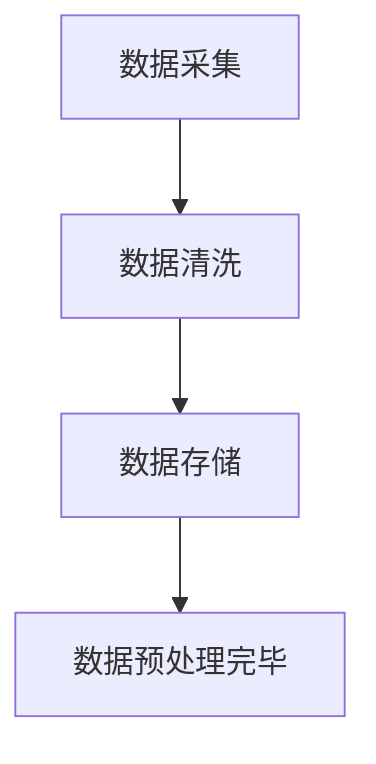
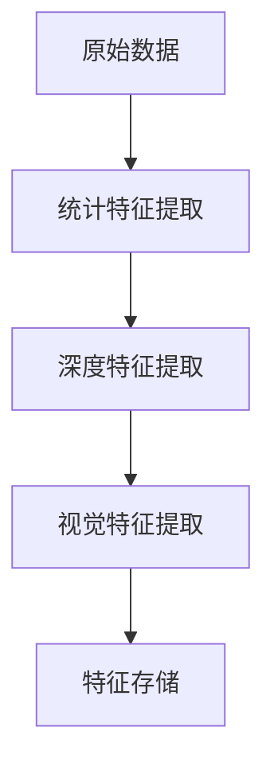
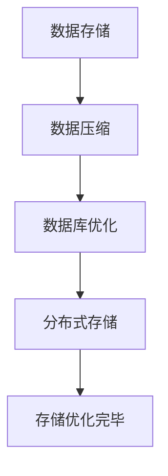
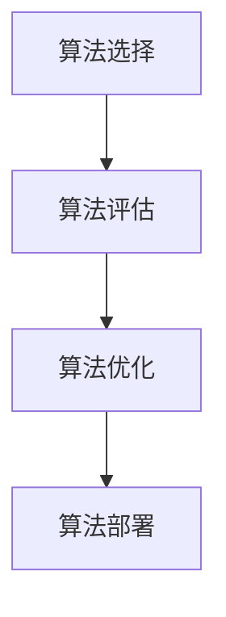
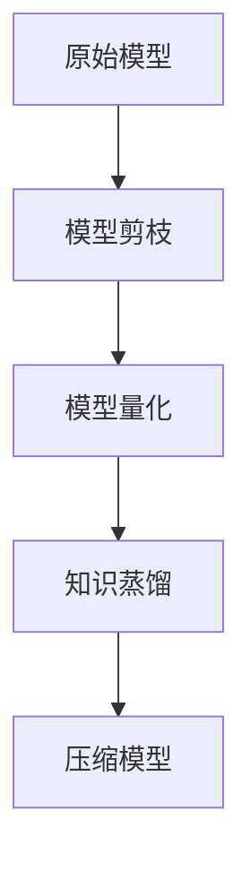
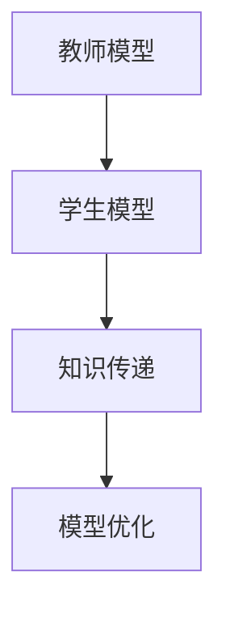

                 

# 《提示词语言的边缘计算优化与延迟降低》

## 关键词
边缘计算、提示词语言、优化算法、延迟降低、硬件优化、实时应用案例

## 摘要
本文旨在探讨边缘计算中的优化与延迟降低问题，重点关注提示词语言在这一领域的应用。文章首先介绍了边缘计算的基本概念及其在当前信息技术发展中的重要性。随后，我们详细分析了提示词语言的基础知识及其在边缘计算中的角色。在此基础上，文章深入探讨了边缘计算优化技术的各个方面，包括数据预处理、算法优化和硬件优化。接着，我们重点讨论了如何利用提示词语言在边缘计算中进行优化，并举例说明了相关的延迟降低技术。文章随后通过实际应用案例，展示了这些技术在智能交通系统、智能家居和工业物联网等领域的应用效果。最后，文章总结了当前的研究进展，并对未来的研究方向进行了展望。

## 引言

### 1.1 书籍背景与目标

#### 1.1.1 边缘计算的发展背景

随着互联网和物联网技术的飞速发展，数据量呈指数级增长，传统的云计算模式已无法满足对实时性和低延迟的迫切需求。边缘计算作为一种分布式计算架构，通过将数据处理和分析能力推向网络边缘，实现了对数据处理的就近处理，从而大大降低了延迟和带宽消耗。边缘计算在智能制造、智能交通、智慧城市等领域展现出了巨大的潜力。

#### 1.1.2 提示词语言的重要性

提示词语言（Keyword Language）是人工智能领域的一种重要技术，通过预设的关键词对输入信息进行识别和分类，广泛应用于自然语言处理、信息检索和智能问答等领域。随着边缘计算的发展，提示词语言在边缘设备中的应用变得愈发重要，它不仅提高了系统的响应速度，还降低了数据传输的负担。

#### 1.1.3 优化与延迟降低的需求

边缘计算环境中，设备的计算资源和网络带宽相对有限，如何在有限的资源下实现高效的计算和低延迟的数据处理成为亟待解决的问题。优化和延迟降低技术是边缘计算实现高效运作的关键，它们不仅能够提升系统的性能，还能延长设备的使用寿命。

### 1.2 阅读指南

#### 1.2.1 读者背景要求

本文适合具有计算机科学、信息技术背景的读者，特别是对边缘计算、自然语言处理和优化算法有一定了解的技术专业人士。对于初学者，建议先掌握边缘计算和提示词语言的基本概念，再深入阅读本文。

#### 1.2.2 阅读建议

本文采用逻辑清晰、结构紧凑的叙述方式，通过实际案例分析和详细讲解，帮助读者全面理解边缘计算优化与延迟降低的技术原理和应用。建议读者按章节顺序阅读，以便系统地掌握相关知识。

## 第1章 基础概念

### 1.1 边缘计算基础

#### 1.1.1 边缘计算定义与原理

边缘计算（Edge Computing）是一种分布式计算架构，它将数据处理、存储和分析等能力分散到网络的边缘设备上，以减少对中心服务器的依赖。边缘计算的核心思想是将数据处理的近源执行（Proximity Data Processing），即在数据产生的地方进行数据处理，从而实现低延迟、高效率和实时性的目标。

#### 1.1.2 边缘计算的优势与挑战

边缘计算的优势在于：

- **降低延迟**：通过将数据处理推向边缘，减少了数据传输的距离和时间，从而降低了系统的响应时间。
- **减少带宽消耗**：边缘计算减少了需要传输到中心服务器的数据量，降低了网络带宽的消耗。
- **提高系统可靠性**：边缘计算可以通过分布式架构实现容错和负载均衡，提高了系统的可靠性。

然而，边缘计算也面临着以下挑战：

- **资源有限**：边缘设备的计算资源和存储资源相对有限，需要优化资源使用。
- **异构性**：边缘设备种类繁多，具有异构性，需要设计适应多种设备的优化算法。
- **安全性**：边缘计算涉及大量的数据传输和处理，需要确保数据的安全性和隐私保护。

#### 1.1.3 边缘计算架构

边缘计算架构通常包括以下几个层次：

- **端设备**：包括智能手机、平板电脑、嵌入式设备等，是数据产生的源头。
- **边缘节点**：包括路由器、网关、服务器等，负责数据的初步处理和传输。
- **中心服务器**：负责大规模数据的存储和处理，提供全局视图和高级服务。

### 1.2 提示词语言基础

#### 1.2.1 提示词语言定义

提示词语言是一种用于描述和识别文本信息的计算机语言，通过预设的关键词对输入文本进行分类和标记。提示词语言通常由一系列规则和模式组成，这些规则用于识别文本中的关键词、短语和句子结构。

#### 1.2.2 提示词语言类型

根据应用场景的不同，提示词语言可以分为以下几类：

- **分类提示词语言**：用于对文本进行分类，例如新闻分类、邮件分类等。
- **命名实体识别提示词语言**：用于识别文本中的命名实体，如人名、地名、组织名等。
- **关系抽取提示词语言**：用于提取文本中实体之间的关系，如“张三”和“北京”之间的关系。
- **事件抽取提示词语言**：用于提取文本中的事件信息，如时间、地点、参与者等。

#### 1.2.3 提示词语言在边缘计算中的应用

在边缘计算中，提示词语言主要用于以下几个方面：

- **实时数据处理**：通过提示词语言对实时数据进行分类和过滤，实现快速响应。
- **智能识别**：利用提示词语言进行图像识别、语音识别和自然语言理解等任务。
- **隐私保护**：通过提示词语言对敏感信息进行隐藏和混淆，保护用户隐私。

### 1.3 优化与延迟降低概念

#### 1.3.1 优化目标

边缘计算优化旨在提高系统的整体性能，包括以下几个方面：

- **降低延迟**：通过优化数据处理和传输过程，减少系统的响应时间。
- **提高资源利用率**：通过资源调度和负载均衡，最大化利用边缘设备的计算和存储资源。
- **增强系统可靠性**：通过冗余设计和故障恢复机制，提高系统的可靠性。

#### 1.3.2 延迟降低的重要性

延迟降低在边缘计算中至关重要，主要体现在以下几个方面：

- **用户体验**：降低延迟可以提供更流畅的交互体验，提高用户的满意度。
- **实时性要求**：对于某些应用场景，如自动驾驶、智能监控等，低延迟是系统正常运行的基本要求。
- **系统效率**：降低延迟可以提高系统的整体效率，减少资源的浪费。

#### 1.3.3 优化方法分类

边缘计算优化方法可以分为以下几类：

- **数据预处理**：通过数据压缩、特征提取和预处理，减少数据传输和处理量。
- **算法优化**：通过优化算法选择和模型压缩，提高数据处理速度。
- **硬件优化**：通过硬件加速和资源调度，提高设备的计算和存储能力。
- **网络优化**：通过网络编码和路由优化，提高数据传输效率。

## 第2章 边缘计算优化技术

### 2.1 数据预处理

#### 2.1.1 数据采集与清洗

数据预处理是边缘计算优化的重要环节，首先需要对数据进行采集和清洗。数据采集包括传感器数据、用户输入数据和日志数据等。数据清洗的主要目的是去除噪声、错误和冗余数据，确保数据的质量和一致性。

##### Mermaid 流程图：


#### 2.1.2 数据特征提取

数据特征提取是将原始数据转换为有意义的信息，用于后续的模型训练和推理。特征提取方法包括统计特征提取、深度特征提取和视觉特征提取等。

##### Mermaid 流程图：


#### 2.1.3 数据存储优化

数据存储优化旨在减少数据存储的空间占用和访问延迟。常见的方法包括数据压缩、数据库优化和分布式存储等。

##### Mermaid 流程图：


### 2.2 算法优化

#### 2.2.1 算法选择与评估

算法选择是边缘计算优化中的关键步骤，需要根据具体应用场景和性能要求选择合适的算法。算法评估主要包括准确率、召回率、F1 值等指标。

##### Mermaid 流程图：


#### 2.2.2 模型压缩

模型压缩是将大规模模型转换为小规模模型，以提高边缘设备的可部署性和运行效率。常见的模型压缩方法包括模型剪枝、量化、知识蒸馏等。

##### Mermaid 流程图：


#### 2.2.3 模型蒸馏

模型蒸馏是将大模型的知识传递给小模型，以提高小模型的性能。模型蒸馏过程中，大模型作为教师模型，小模型作为学生模型进行训练。

##### Mermaid 流程图：


### 2.3 硬件优化

#### 2.3.1 硬件加速

硬件加速是将计算任务通过特定的硬件设备（如GPU、FPGA等）进行加速，以提高数据处理速度。硬件加速主要包括GPU加速、FPGA加速和ASIC加速等。

##### Mermaid 流程图：
```mermaid
graph TD
A[计算任务] --> B[G

