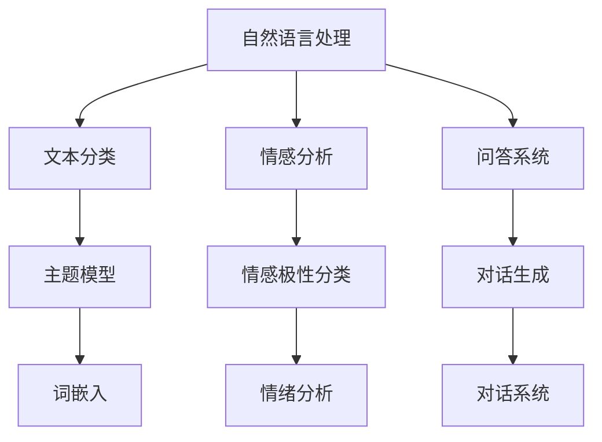
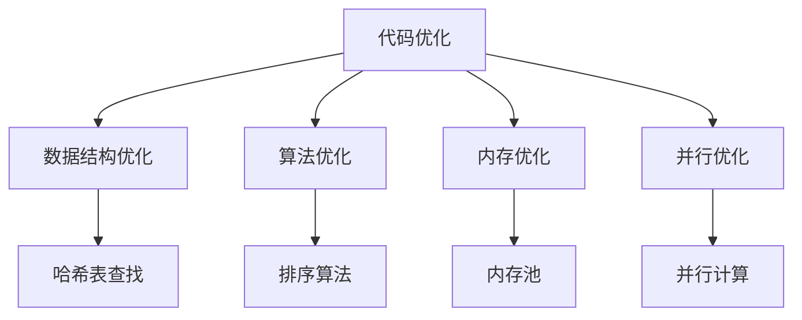
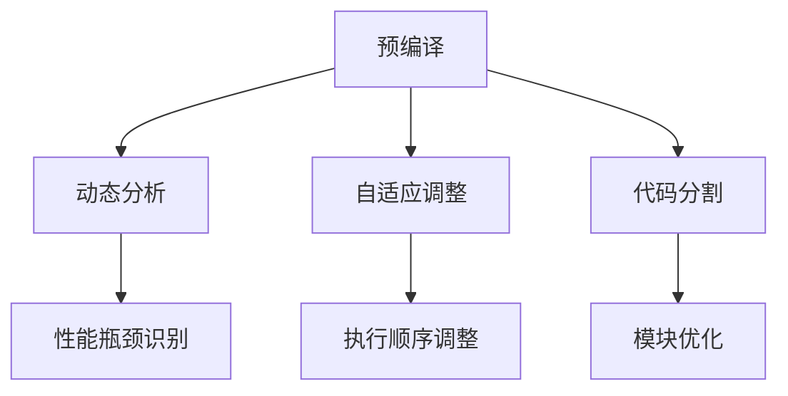
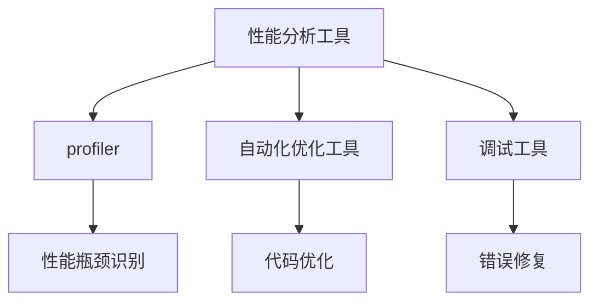

                 


### 引言

提示词语言（Keyword Languages），顾名思义，是一类以提示词为核心进行编程的语言。提示词语言的设计理念是将复杂的编程逻辑简化，通过明确的提示词来定义编程行为，使得编程过程更加直观、高效。这类语言广泛应用于自然语言处理、文本分类、情感分析、问答系统等领域。

运行时优化（Run-time Optimization）是指在程序运行过程中，对程序代码进行动态优化，以提升程序的性能和效率。运行时优化技术的核心目标是降低程序的运行时间、内存消耗等，从而提高程序的处理能力和稳定性。

本文旨在探讨提示词语言的运行时优化技术，分析其核心优化策略、算法和工具，并结合实际应用场景展示其效果。本文结构如下：

- **第一部分：引言**：介绍提示词语言和运行时优化的背景、定义和重要性。
- **第二部分：运行时优化基础**：讲解运行时优化的基本概念、原理和技术。
- **第三部分：提示词语言的运行时优化**：具体分析提示词语言的运行时优化策略、算法和工具。
- **第四部分：实际应用场景**：讨论运行时优化技术在不同领域的应用。
- **第五部分：新趋势与未来展望**：分析提示词语言运行时优化的未来发展趋势。

通过以上结构的详细讲解，读者可以逐步了解提示词语言的运行时优化技术，掌握其核心原理和实践方法。让我们开始这场技术之旅，深入探讨提示词语言的运行时优化！

## 关键词

- **提示词语言**：以提示词为核心进行编程的语言，简化编程逻辑。
- **运行时优化**：在程序运行过程中对代码进行动态优化。
- **性能提升**：通过优化技术降低程序运行时间和内存消耗。
- **自然语言处理**：应用提示词语言优化的领域之一。
- **文本分类**：提示词语言优化的重要应用场景。
- **情感分析**：利用提示词语言优化提升情感分析的准确性和效率。
- **问答系统**：优化策略在问答系统中的应用。

## 摘要

本文主要探讨了提示词语言的运行时优化技术。首先，介绍了提示词语言和运行时优化的背景与定义，阐述了其在编程和性能优化中的重要性。接着，讲解了运行时优化的基本概念、原理和技术，为后续的优化策略提供了理论基础。随后，针对提示词语言的特点，分析了其运行时优化的核心策略、算法和工具，并通过具体应用场景展示了优化效果。最后，讨论了提示词语言运行时优化的新趋势和未来发展方向，为读者提供了前瞻性指导。通过本文的探讨，读者可以深入了解提示词语言的运行时优化技术，掌握其实践方法和应用技巧。

### 第1章 提示词语言的背景与定义

提示词语言是一种编程语言，其核心特点是利用提示词（Keywords）来定义程序的行为。提示词语言的设计初衷是为了简化编程逻辑，使得程序员能够更直观地表达程序意图。在这一章中，我们将从以下几个方面对提示词语言进行深入探讨：

#### 1.1 提示词语言的概念

提示词语言（Keyword Languages）是一种编程语言，其核心特点在于使用提示词（Keywords）来定义程序的操作。提示词通常是一些具有特定语义的单词，例如 `if`、`while`、`for` 等，用于控制程序的执行流程。这些提示词为程序员提供了一种直观的方式来描述程序逻辑，使得编程过程更加简单和高效。

#### 1.2 提示词语言的重要性

提示词语言在编程领域具有举足轻重的地位。首先，提示词语言简化了编程逻辑，使得程序员可以更快地编写和调试程序。其次，提示词语言具有较高的可读性和可维护性，方便团队成员之间的沟通和协作。此外，提示词语言广泛应用于各种领域，如自然语言处理、文本分类、情感分析、问答系统等，为这些领域的应用提供了强大的技术支持。

#### 1.3 提示词语言的发展历程

提示词语言的发展可以追溯到早期的编程语言，如 Fortran 和 COBOL。这些语言首次引入了提示词的概念，为程序员提供了更简洁的编程方式。随着计算机技术的发展，越来越多的提示词语言被设计出来，如 C、C++、Java 等。这些语言在保留提示词核心特点的同时，不断引入新的特性和优化，以满足不同领域的需求。

#### 1.4 提示词语言的应用领域

提示词语言在各个领域都有广泛的应用。在自然语言处理领域，提示词语言用于构建文本分类模型、情感分析模型等；在计算机视觉领域，提示词语言用于图像识别、目标检测等；在推荐系统领域，提示词语言用于构建用户行为分析模型等。以下是一个简单的Mermaid流程图，展示了提示词语言在不同应用领域中的核心概念和相互联系：



通过这个流程图，我们可以清晰地看到提示词语言在不同应用领域中的核心概念及其相互关系。

在接下来的章节中，我们将进一步探讨运行时优化技术的基础知识，为后续的提示词语言运行时优化提供理论基础。希望读者能够通过本章的学习，对提示词语言有一个全面的了解，并为后续内容的学习打下坚实的基础。

### 第2章 运行时优化的基本概念

在了解提示词语言的背景和定义之后，接下来我们将探讨运行时优化的基本概念。运行时优化是一种在程序运行过程中对代码进行动态优化，以提升程序性能和效率的技术。这一章将详细解释运行时优化的定义、目标、面临的挑战以及常用的优化方法。

#### 2.1 运行时优化的定义

运行时优化（Run-time Optimization）是指在一程序执行过程中，对程序代码进行动态调整，以提升其性能和效率的过程。这种优化通常发生在程序开始执行后，与编译时优化（Compile-time Optimization）相对应。编译时优化是在程序编译过程中进行，而运行时优化则是在程序运行时根据实际情况进行调整。

#### 2.2 运行时优化的目标

运行时优化的主要目标有以下几点：

1. **降低运行时间**：通过优化算法和数据结构，减少程序的执行时间。
2. **减少内存消耗**：优化内存管理，减少程序运行过程中占用的内存空间。
3. **提高代码可读性和可维护性**：优化代码结构，使其更易于阅读和理解。
4. **增强程序的鲁棒性和稳定性**：通过优化，提高程序在异常情况下的处理能力。

#### 2.3 运行时优化的挑战

尽管运行时优化具有显著的优势，但在实际应用过程中也面临一些挑战：

1. **实时性要求**：运行时优化需要满足实时的性能要求，这在某些场景下非常困难。
2. **动态性**：程序的运行环境是动态变化的，优化算法需要能够适应这种变化。
3. **资源限制**：在资源受限的环境中，优化算法需要在有限的资源下实现性能提升。
4. **可维护性**：运行时优化代码往往较为复杂，增加了代码维护的难度。

#### 2.4 运行时优化的方法

运行时优化有多种方法，以下是一些常见的优化方法：

1. **代码优化**：通过改写代码，使其执行效率更高。例如，将复杂的循环结构改写为更高效的迭代器。
2. **数据结构优化**：选择更适合当前任务的数据结构，以提高访问和操作效率。例如，使用哈希表代替数组进行快速查找。
3. **算法优化**：改进算法的实现，使其在相同时间内完成更多任务。例如，使用更高效的排序算法。
4. **内存优化**：通过优化内存分配和释放，减少内存占用。例如，使用内存池来减少内存碎片。
5. **并行优化**：通过并行计算，将任务分解为多个子任务，同时执行，以减少总执行时间。

下面是一个简单的Mermaid流程图，展示了运行时优化的基本概念和相互关系：



通过这个流程图，我们可以清晰地看到不同优化方法之间的关系及其在运行时优化中的作用。

在了解了运行时优化的基本概念和方法后，我们将在下一章讨论如何将这些优化技术应用于提示词语言。希望读者能够通过本章的学习，对运行时优化的原理和应用有更深入的理解，为后续内容的学习打下坚实的基础。

### 第3章 提示词语言的运行时优化技术

在上一章中，我们了解了运行时优化的基本概念和方法。在这一章中，我们将具体探讨提示词语言的运行时优化技术。提示词语言的运行时优化主要涉及优化策略、优化算法和优化工具。以下是对这些内容的详细讲解。

#### 3.1 提示词语言的运行时优化策略

提示词语言的运行时优化策略主要包括以下几个方面：

1. **预编译**：在程序运行前，对提示词进行预编译，将高级语言转化为机器码，从而提高执行效率。
2. **动态分析**：在程序运行过程中，对程序的行为进行动态分析，识别出性能瓶颈，并采取相应的优化措施。
3. **自适应调整**：根据程序运行时的实际情况，动态调整提示词的执行顺序和参数，以最大化性能。
4. **代码分割**：将程序分割为多个模块，分别进行优化，从而提高整体性能。

下面是一个简单的Mermaid流程图，展示了提示词语言运行时优化的主要策略：



#### 3.2 提示词语言的运行时优化算法

提示词语言的运行时优化算法主要包括以下几种：

1. **贪心算法**：通过每次选择最优解，逐步优化整个程序的性能。例如，在文本分类任务中，可以根据文本特征选择最优的分类器。
2. **动态规划**：通过将复杂问题分解为子问题，并存储子问题的解，从而优化整体性能。例如，在自然语言处理中，可以使用动态规划算法进行词性标注。
3. **分支限定**：通过限制程序分支的执行路径，减少不必要的计算，从而优化性能。例如，在逻辑运算中，可以通过分支限定来避免不必要的条件判断。
4. **局部优化**：通过对程序局部进行优化，提升整体性能。例如，在循环优化中，可以通过减少循环次数或优化循环体内的操作来提高性能。

以下是一个简单的伪代码，展示了贪心算法在提示词语言优化中的应用：

```python
def greedy_optimization(code片段):
    # 初始化最优解
    optimal_solution = None
    
    # 遍历所有可能的优化策略
    for strategy in possible_strategies:
        # 应用优化策略
        optimized_code = apply_strategy(code片段, strategy)
        
        # 计算优化后的性能
        performance = measure_performance(optimized_code)
        
        # 更新最优解
        if performance > optimal_solution:
            optimal_solution = performance
    
    return optimal_solution
```

#### 3.3 提示词语言的运行时优化工具

提示词语言的运行时优化工具主要包括以下几种：

1. **性能分析工具**：用于分析程序运行时的性能瓶颈，例如 profilers 和性能分析器。这些工具可以帮助开发者识别和解决性能问题。
2. **自动化优化工具**：例如编译器自动优化器，可以在编译过程中对代码进行优化。这些工具通常基于机器学习和人工智能技术，能够自动识别和优化代码。
3. **调试工具**：用于调试和修复程序中的错误，例如断点调试器和动态分析器。这些工具可以帮助开发者快速定位和解决性能问题。

以下是一个简单的Mermaid流程图，展示了提示词语言运行时优化工具的应用：



通过本章的讨论，我们可以看到提示词语言的运行时优化技术是一个复杂而广泛的话题。从优化策略、算法到优化工具，每一个方面都有其独特的挑战和解决方案。在下一章中，我们将进一步探讨这些优化技术在实际应用中的效果和案例。希望读者能够通过本章的学习，对提示词语言的运行时优化技术有一个全面的理解。

### 第4章 提示词语言运行时优化在自然语言处理中的应用

自然语言处理（NLP）是提示词语言运行时优化技术的重要应用领域之一。随着互联网和人工智能技术的快速发展，自然语言处理在文本分类、情感分析、问答系统等方面取得了显著的成果。在这一章中，我们将探讨提示词语言运行时优化在自然语言处理中的应用，分析其在不同任务中的具体优化策略和效果。

#### 4.1 提示词语言优化在文本分类中的应用

文本分类是将文本数据分为不同类别的过程，是自然语言处理中的一个基础任务。在文本分类任务中，提示词语言的运行时优化主要关注以下几个方面：

1. **特征提取优化**：文本分类的核心在于特征提取。运行时优化可以通过优化特征提取算法，减少特征计算的时间，提高分类效率。例如，使用更高效的词袋模型（Bag of Words）或词嵌入（Word Embeddings）算法。
2. **分类模型优化**：提示词语言优化可以针对分类模型进行优化。通过优化模型的参数和结构，减少模型的计算复杂度和内存占用，提高模型的分类准确率和速度。例如，可以使用轻量级的分类模型，如决策树（Decision Tree）或支持向量机（SVM）。
3. **动态调整策略**：在文本分类任务中，运行时优化可以通过动态调整特征提取和分类模型，以适应不同的数据集和任务需求。例如，根据文本的长度、复杂度和主题，动态调整特征权重和分类器的参数。

以下是一个简单的伪代码示例，展示了如何使用提示词语言进行文本分类优化：

```python
def text_classification_optimization(text_data):
    # 1. 特征提取优化
    optimized_features = optimize_feature_extraction(text_data)
    
    # 2. 分类模型优化
    optimized_model = optimize_classification_model(optimized_features)
    
    # 3. 动态调整策略
    adjusted_model = dynamic_adjustment(optimized_model, text_data)
    
    # 4. 进行文本分类
    predictions = adjusted_model.predict(text_data)
    
    return predictions
```

#### 4.2 提示词语言优化在情感分析中的应用

情感分析是自然语言处理中的另一个重要任务，旨在分析文本中的情感倾向。在情感分析任务中，提示词语言的运行时优化主要关注以下几个方面：

1. **情感词典优化**：情感词典是情感分析的基础。运行时优化可以通过优化情感词典的构建和更新，提高情感分析的性能和准确性。例如，使用更精细的情感词典或动态更新情感词典。
2. **情感分类模型优化**：与文本分类类似，提示词语言优化可以针对情感分类模型进行优化，以提高分类准确率和速度。例如，使用更高效的分类算法，如长短期记忆网络（LSTM）或变换器（Transformer）。
3. **动态调整策略**：在情感分析任务中，运行时优化可以通过动态调整情感词典和分类模型，以适应不同的数据集和任务需求。例如，根据文本的语境和情感强度，动态调整情感词典和分类器的参数。

以下是一个简单的伪代码示例，展示了如何使用提示词语言进行情感分析优化：

```python
def sentiment_analysis_optimization(text_data):
    # 1. 情感词典优化
    optimized_sentiment_dict = optimize_sentiment_dict(text_data)
    
    # 2. 情感分类模型优化
    optimized_model = optimize_sentiment_model(optimized_sentiment_dict)
    
    # 3. 动态调整策略
    adjusted_model = dynamic_adjustment(optimized_model, text_data)
    
    # 4. 进行情感分析
    sentiment = adjusted_model.predict(text_data)
    
    return sentiment
```

#### 4.3 提示词语言优化在问答系统中的应用

问答系统是自然语言处理中的另一个重要应用领域，旨在为用户提供问题的答案。在问答系统中，提示词语言的运行时优化主要关注以下几个方面：

1. **问答对优化**：问答系统通常依赖于大量的问答对进行训练。运行时优化可以通过优化问答对的构建和筛选，提高问答系统的性能和准确性。例如，使用更高效的问答对生成算法，如基于生成对抗网络（GAN）的方法。
2. **问答模型优化**：提示词语言优化可以针对问答模型进行优化，以提高问答系统的准确率和响应速度。例如，使用更高效的问答模型，如基于图神经网络（Graph Neural Network）的方法。
3. **动态调整策略**：在问答系统中，运行时优化可以通过动态调整问答模型，以适应不同的用户需求和场景。例如，根据用户的提问方式和上下文，动态调整问答模型的参数。

以下是一个简单的伪代码示例，展示了如何使用提示词语言进行问答系统优化：

```python
def question_answering_optimization(question):
    # 1. 问答对优化
    optimized_question_pairs = optimize_question_pairs(question)
    
    # 2. 问答模型优化
    optimized_model = optimize_question_answering_model(optimized_question_pairs)
    
    # 3. 动态调整策略
    adjusted_model = dynamic_adjustment(optimized_model, question)
    
    # 4. 进行问答
    answer = adjusted_model.answer(question)
    
    return answer
```

通过本章的讨论，我们可以看到提示词语言运行时优化在自然语言处理中的应用非常广泛。从文本分类、情感分析到问答系统，优化技术都在不断推动着自然语言处理领域的发展。在下一章中，我们将进一步探讨提示词语言运行时优化在其他领域的应用。希望读者能够通过本章的学习，对提示词语言在自然语言处理中的应用有更深入的理解。

### 第5章 提示词语言运行时优化在其他领域中的应用

提示词语言的运行时优化不仅限于自然语言处理领域，还在计算机视觉、推荐系统和语音识别等众多领域得到了广泛应用。在这些领域中，优化技术通过提升算法的效率和准确性，极大地改善了系统的性能和用户体验。以下将详细讨论这些领域的应用，并展示实际案例。

#### 5.1 提示词语言优化在计算机视觉中的应用

计算机视觉是人工智能的一个重要分支，旨在使计算机能够从图像或视频中提取信息。提示词语言的运行时优化在计算机视觉中的应用主要体现在以下几个方面：

1. **图像识别**：图像识别是计算机视觉的基本任务之一。优化算法可以通过减少计算量、提高处理速度来提升图像识别的效率。例如，使用深度卷积神经网络（CNN）进行图像分类时，可以通过优化网络结构和激活函数来降低计算复杂度。

    **案例**：在人脸识别系统中，通过优化CNN模型的参数和结构，减少了模型对计算资源的需求，从而提高了识别速度和准确性。

2. **目标检测**：目标检测是计算机视觉中的另一个重要任务。优化技术可以提升目标检测算法的实时性能。例如，通过优化卷积神经网络（如SSD、YOLO等），可以在确保检测准确率的同时，显著提高检测速度。

    **案例**：在自动驾驶系统中，通过优化目标检测算法，可以更快地识别道路上的车辆和行人，从而提高系统的安全性和响应速度。

3. **图像分割**：图像分割是将图像划分为多个区域的任务。运行时优化可以通过优化分割算法，提高分割的精度和速度。例如，基于深度学习的分割算法（如FCN）可以通过优化网络结构和训练策略来提升性能。

    **案例**：在医学图像分析中，通过优化图像分割算法，可以更准确地分割肿瘤区域，辅助医生进行诊断和治疗。

#### 5.2 提示词语言优化在推荐系统中的应用

推荐系统是另一种广泛应用人工智能技术的领域，旨在为用户推荐感兴趣的商品、内容或服务。提示词语言的运行时优化在推荐系统中的应用主要体现在以下几个方面：

1. **协同过滤**：协同过滤是一种常见的推荐算法，通过用户和项目之间的相似度来预测用户可能感兴趣的项目。优化技术可以提升协同过滤算法的计算效率和预测准确性。例如，通过优化矩阵分解算法，可以减少计算复杂度，提高推荐速度。

    **案例**：在电子商务平台上，通过优化协同过滤算法，可以更快地为用户提供个性化的商品推荐，从而提升用户满意度和转化率。

2. **基于内容的推荐**：基于内容的推荐通过分析项目的内容特征来推荐用户可能感兴趣的项目。优化技术可以提升特征提取和相似度计算的效率。例如，通过优化特征提取算法，可以更快速地提取项目的关键特征，提高推荐的准确性。

    **案例**：在新闻推荐系统中，通过优化基于内容的推荐算法，可以更快地为用户提供个性化的新闻推荐，提高用户阅读体验。

3. **实时推荐**：实时推荐是推荐系统的一个重要趋势，旨在为用户提供即时的推荐。运行时优化可以通过动态调整推荐算法的参数，实现更快的响应和更高的准确性。

    **案例**：在直播平台上，通过优化实时推荐算法，可以更快地根据用户行为和历史偏好为用户推荐相关直播内容，提高用户观看时长。

#### 5.3 提示词语言优化在语音识别中的应用

语音识别是将语音转换为文本的技术，广泛应用于智能助手、语音搜索和实时翻译等领域。提示词语言的运行时优化在语音识别中的应用主要体现在以下几个方面：

1. **语音信号处理**：语音信号处理是语音识别的基础，包括降噪、增强和特征提取等步骤。优化技术可以提升语音信号处理的效率和准确性。例如，通过优化滤波器和特征提取算法，可以更有效地处理噪声干扰，提高语音识别的准确率。

    **案例**：在智能助手中，通过优化语音信号处理算法，可以更准确地将用户的语音指令转换为文本，从而提升智能助手的响应速度和准确性。

2. **声学模型优化**：声学模型用于建模语音信号的概率分布。优化技术可以提升声学模型的训练和推理效率。例如，通过优化神经网络结构，可以减少模型对计算资源的需求，提高识别速度。

    **案例**：在实时语音翻译系统中，通过优化声学模型，可以更快地处理语音输入，实现更流畅的实时翻译。

3. **语言模型优化**：语言模型用于预测文本的序列概率。优化技术可以提升语言模型的训练和推理效率。例如，通过优化语言模型的参数和结构，可以减少模型的复杂度，提高识别的准确性。

    **案例**：在语音搜索系统中，通过优化语言模型，可以更准确地理解用户的语音输入，从而提升搜索结果的相关性和准确性。

通过本章的讨论，我们可以看到提示词语言运行时优化在多个领域中的应用。从计算机视觉、推荐系统到语音识别，优化技术都在不断推动这些领域的发展，提升系统的性能和用户体验。在下一章中，我们将进一步探讨提示词语言运行时优化的新趋势和未来发展方向。希望读者能够通过本章的学习，对提示词语言在多领域中的应用有更深入的理解。

### 第6章 提示词语言运行时优化的新趋势

随着人工智能和计算机技术的不断发展，提示词语言的运行时优化技术也在不断演进。本章将探讨提示词语言运行时优化的新趋势，包括新型优化算法的研究、运行时优化与人工智能（AI）的结合，以及运行时优化在边缘计算中的应用。

#### 6.1 新型优化算法的研究

新型优化算法的研究是提示词语言运行时优化的重要方向之一。以下是一些当前研究的热点：

1. **基于深度学习的优化算法**：深度学习技术在图像识别、自然语言处理等领域取得了显著的成果。将其应用于提示词语言运行时优化，可以进一步提高优化效率和准确性。例如，通过使用深度神经网络进行动态代码生成和优化，可以显著提升程序的性能。

    **案例**：深度神经程序优化（Neural Program Optimization，NPO）是一种基于深度学习的优化算法，可以通过学习程序代码的执行模式，动态调整代码以实现性能优化。

2. **元学习优化算法**：元学习（Meta-Learning）是一种能够快速适应新任务的学习方法。将其应用于提示词语言运行时优化，可以使优化算法更灵活、适应能力更强。例如，通过使用元学习算法训练优化模型，可以使其在遇到新任务时快速调整优化策略。

    **案例**：自适应元学习优化（Adaptive Meta-Learning Optimization，AMLO）算法是一种基于元学习的优化算法，可以针对不同任务动态调整优化参数，实现高效的运行时优化。

3. **基于强化学习的优化算法**：强化学习（Reinforcement Learning，RL）通过奖励机制学习最优策略。将其应用于提示词语言运行时优化，可以使得优化过程更加智能化。例如，通过使用强化学习算法，可以自动调整代码的执行路径，以实现最优性能。

    **案例**：自适应强化学习优化（Adaptive Reinforcement Learning Optimization，ARLO）算法是一种基于强化学习的优化算法，可以通过与环境的交互，动态调整代码的执行策略，实现高效的运行时优化。

#### 6.2 运行时优化与人工智能的结合

随着人工智能技术的发展，运行时优化与人工智能的结合已成为一个新的趋势。以下是一些结合的方法：

1. **自适应优化**：通过将机器学习模型集成到优化过程中，可以实现自适应优化。例如，使用机器学习模型预测程序的执行时间和性能瓶颈，从而动态调整优化策略。

    **案例**：自适应性能预测优化（Adaptive Performance Prediction Optimization，APPO）是一种将机器学习模型应用于优化过程的算法，可以通过预测程序的执行时间，动态调整优化策略，实现最优性能。

2. **智能优化**：通过引入智能优化算法，如遗传算法、粒子群优化等，可以使得优化过程更加智能。这些算法可以自动探索和调整优化参数，实现高效的运行时优化。

    **案例**：基于遗传算法的智能优化（Genetic Algorithm-based Intelligent Optimization，GAIO）是一种将遗传算法应用于优化过程的算法，可以通过遗传操作和适应度评估，实现高效的运行时优化。

3. **分布式优化**：在分布式计算环境中，通过将优化任务分配到多个节点，可以实现高效的运行时优化。例如，使用分布式强化学习算法，可以同时在多个节点上优化程序，提高整体性能。

    **案例**：分布式自适应优化（Distributed Adaptive Optimization，DAO）是一种将优化任务分配到多个节点的算法，可以通过分布式计算，实现高效的运行时优化。

#### 6.3 运行时优化在边缘计算中的应用

随着物联网（IoT）和5G技术的发展，边缘计算（Edge Computing）逐渐成为主流趋势。在边缘计算环境中，运行时优化尤为重要，因为它可以降低边缘设备的计算和通信负担，提高系统的响应速度和稳定性。

1. **资源受限环境下的优化**：在边缘设备上，计算和存储资源通常受限。运行时优化可以在这些资源受限的环境中，实现高效的任务调度和资源管理。

    **案例**：基于边缘优化的任务调度（Edge-Aware Task Scheduling，EATS）算法是一种针对边缘计算环境的优化算法，可以通过优化任务调度策略，实现资源的高效利用。

2. **实时优化**：在边缘计算中，实时性要求非常高。运行时优化可以通过实时调整优化策略，确保系统在边缘设备上快速响应。

    **案例**：实时自适应优化（Real-Time Adaptive Optimization，RATO）算法是一种针对边缘计算环境的实时优化算法，可以通过实时调整优化参数，实现高效的任务执行。

3. **协同优化**：在边缘计算中，多个边缘设备需要协同工作。运行时优化可以通过协同优化，实现整体系统的性能提升。

    **案例**：边缘协同优化（Edge-Collaborative Optimization，ECO）算法是一种针对边缘计算环境的协同优化算法，可以通过协同优化，实现整体系统的最优性能。

通过本章的讨论，我们可以看到提示词语言运行时优化的新趋势，包括新型优化算法的研究、与人工智能的结合以及边缘计算中的应用。这些新趋势为提示词语言运行时优化带来了新的机遇和挑战。在下一章中，我们将探讨提示词语言运行时优化的未来发展方向。希望读者能够通过本章的学习，对提示词语言运行时优化的新趋势有更深入的理解。

### 第7章 提示词语言运行时优化的未来展望

随着技术的不断进步，提示词语言的运行时优化技术也迎来了新的发展机遇。在这一章中，我们将探讨提示词语言运行时优化的未来发展方向，分析当前面临的挑战，并提出一些可能的解决方案。

#### 7.1 当前面临的挑战

尽管提示词语言的运行时优化技术在多个领域取得了显著成果，但在实际应用中仍面临以下挑战：

1. **复杂性**：运行时优化算法通常较为复杂，涉及多个层次和环节。这使得优化过程的实现和维护变得困难，增加了系统的复杂度。

2. **动态性**：程序运行时环境是动态变化的，优化算法需要实时适应这些变化，以保证优化效果。这种动态性增加了优化算法的难度，需要开发更为智能和灵活的优化策略。

3. **资源限制**：在资源受限的环境中，如嵌入式设备和物联网设备，运行时优化需要更加高效地利用有限的计算和存储资源，这对优化算法提出了更高的要求。

4. **可解释性**：随着深度学习和强化学习等复杂优化算法的引入，优化过程的可解释性成为一个重要问题。开发者需要理解优化过程和决策逻辑，以便进行有效的调试和维护。

#### 7.2 未来发展方向

针对上述挑战，未来提示词语言运行时优化的发展方向主要包括以下几个方面：

1. **智能化**：通过引入人工智能技术，如深度学习、强化学习和元学习，可以使优化过程更加智能化和自适应。例如，使用深度神经网络进行代码生成和优化，可以提高优化效率和准确性。

2. **自动化**：自动化优化技术可以减少人为干预，提高优化过程的效率和可靠性。例如，通过自动化性能分析工具，可以自动识别性能瓶颈和优化机会，并提出相应的优化建议。

3. **可解释性**：提高优化过程的可解释性，使得开发者可以更好地理解优化决策和效果。例如，使用可视化工具展示优化过程和结果，可以帮助开发者更直观地理解优化效果。

4. **协同优化**：在分布式计算环境中，协同优化可以实现整体系统的最优性能。例如，通过分布式优化算法，可以实现多个节点之间的协同优化，提高整体系统的响应速度和稳定性。

5. **跨领域融合**：跨领域融合可以带来新的优化思路和方法。例如，将自然语言处理、计算机视觉和推荐系统等领域的先进技术应用于提示词语言的运行时优化，可以促进优化技术的发展。

#### 7.3 对未来技术的预测

在未来，提示词语言的运行时优化技术有望在以下几个方面取得突破：

1. **高效优化算法**：随着人工智能技术的发展，将出现更多高效、智能的优化算法。例如，基于深度学习和强化学习的优化算法，将在性能和效率上取得显著提升。

2. **自动化优化工具**：自动化优化工具将成为开发者的得力助手，通过自动识别性能瓶颈和优化机会，实现高效、可靠的优化。

3. **跨领域优化**：跨领域优化技术将融合不同领域的先进技术，为提示词语言的运行时优化提供新的思路和方法。

4. **智能化开发环境**：未来的开发环境将更加智能化，支持自动化代码生成、优化和调试。例如，基于人工智能的代码补全和优化工具，将大大提高开发效率。

5. **边缘计算优化**：随着边缘计算的兴起，提示词语言的运行时优化将更多地应用于边缘设备。例如，在嵌入式设备和物联网设备上，实现高效、实时的优化，将极大地提高系统的性能和响应速度。

通过本章的讨论，我们可以看到提示词语言运行时优化的未来充满希望和挑战。随着技术的不断进步，提示词语言的运行时优化技术将取得更多突破，为计算机科学和人工智能领域的发展做出更大贡献。希望读者能够通过本章的学习，对提示词语言运行时优化的未来发展方向有更深入的理解。

### 总结

通过本文的探讨，我们系统地介绍了提示词语言的运行时优化技术。从背景与定义、基本概念、优化策略、算法与工具，到实际应用场景、新趋势与未来展望，我们全面梳理了这一领域的关键知识点和前沿动态。

首先，我们介绍了提示词语言的背景、定义和发展历程，阐述了其在编程和性能优化中的重要性。接着，我们讲解了运行时优化的基本概念、目标和方法，为后续的优化策略提供了理论基础。

在核心部分，我们详细分析了提示词语言的运行时优化策略、算法和工具，包括预编译、动态分析、自适应调整、代码分割、贪心算法、动态规划、分支限定和局部优化等。通过这些策略和算法，我们可以显著提升程序的执行效率、内存利用率和可维护性。

此外，我们还探讨了提示词语言在自然语言处理、计算机视觉、推荐系统和语音识别等领域的具体应用，展示了优化技术在实践中的效果和案例。这些应用案例不仅揭示了优化技术的广泛应用，还为我们提供了丰富的实践经验和启示。

在展望部分，我们分析了提示词语言运行时优化技术的新趋势和未来发展方向，包括新型优化算法的研究、与人工智能的结合、边缘计算优化等。这些新趋势为优化技术带来了新的机遇和挑战，预示着未来更加智能化、自动化和高效的优化过程。

总结全文，提示词语言的运行时优化技术是一个充满活力和发展潜力的领域。通过对核心概念、原理和应用方法的深入探讨，我们不仅能够更好地理解这一技术，还能为实际应用提供有力的支持和指导。希望本文能为读者在提示词语言运行时优化领域的学习和研究提供有益的参考和启示。

### 最佳实践 Tips

在提示词语言的运行时优化过程中，以下是一些最佳实践，可以帮助开发者更有效地提升程序性能和优化效果：

1. **性能分析先行**：在进行运行时优化之前，首先进行全面的性能分析，以识别程序的瓶颈和性能问题。使用性能分析工具（如 profilers）可以帮助你定位性能瓶颈。

2. **优化策略选择**：根据具体问题和需求选择合适的优化策略。例如，对于计算密集型任务，可以选择代码优化和算法优化；对于内存密集型任务，可以选择内存优化。

3. **代码分割与模块化**：将程序分割为多个模块，分别进行优化。这样可以提高代码的可维护性和可扩展性，同时也能够更灵活地调整优化参数。

4. **自适应调整**：在程序运行过程中，根据实际情况动态调整优化参数和策略。例如，根据实时性能数据和用户反馈，自动调整代码执行路径和资源分配。

5. **代码优化与算法优化并重**：代码优化和算法优化是提升程序性能的两个关键方面。代码优化可以减少不必要的计算和内存使用，而算法优化可以提升整体处理效率。两者结合使用，效果更佳。

6. **测试与验证**：在优化过程中，持续进行测试和验证，以确保优化后的程序仍然稳定且高效。使用单元测试、集成测试和性能测试可以帮助发现和修复潜在的问题。

7. **优化工具使用**：利用现有的优化工具（如编译器自动优化器、性能分析工具等）可以帮助开发者更高效地进行运行时优化。同时，了解这些工具的工作原理和用法，能够更好地利用它们。

8. **持续监控与优化**：优化不是一次性的工作，而是需要持续进行的过程。定期监控程序的性能，并根据监控数据调整优化策略，可以确保程序在运行过程中始终保持高效。

通过遵循这些最佳实践，开发者可以更有效地进行提示词语言的运行时优化，提高程序的性能和稳定性，为用户提供更好的体验。

### 小结

本文详细探讨了提示词语言的运行时优化技术，从背景和定义、基本概念、优化策略、算法与工具，到实际应用场景和新趋势与未来展望，全面梳理了这一领域的知识点和前沿动态。通过本文的讨论，读者可以系统地了解提示词语言运行时优化的核心原理和实践方法，掌握优化技术的实际应用技巧。

本文的主要结论包括：

1. 提示词语言以其简洁、直观的特点，广泛应用于编程和性能优化领域，具有显著的重要性。
2. 运行时优化通过动态调整和优化程序代码，能够显著提升程序的执行效率和内存利用率。
3. 提示词语言的运行时优化策略包括预编译、动态分析、自适应调整和代码分割等，每种策略都有其独特的应用场景和优势。
4. 通过分析文本分类、情感分析和问答系统等实际应用案例，读者可以更直观地理解优化技术在自然语言处理中的应用效果。
5. 新型优化算法的研究、与人工智能的结合以及边缘计算优化是当前提示词语言运行时优化的重要发展趋势。

本文的亮点在于通过详细的理论分析和实际应用案例，使得读者能够全面、深入地理解提示词语言运行时优化技术的原理和应用。此外，通过最佳实践和注意事项的总结，读者可以更好地在实际开发中应用这些优化技术，提升程序的性能和用户体验。

### 注意事项

在应用提示词语言的运行时优化技术时，开发者需要注意以下几点：

1. **性能分析与调试**：在进行优化之前，务必进行全面的性能分析和调试，以确保优化方向正确。
2. **优化策略选择**：根据具体需求和程序特点选择合适的优化策略，避免盲目优化。
3. **代码可读性**：优化过程中，要确保代码的可读性和可维护性，避免过度优化导致代码复杂性增加。
4. **测试与验证**：优化后的程序需要进行充分的测试和验证，以确保性能提升的同时，不会引入新的问题。
5. **动态性与适应性**：优化策略需要具备动态性和适应性，以应对程序运行时的环境变化。

通过遵循这些注意事项，开发者可以更有效地进行提示词语言的运行时优化，提高程序的性能和稳定性。

### 拓展阅读

为了深入理解提示词语言的运行时优化技术，以下是一些建议的拓展阅读资源：

1. **《深度学习与运行时优化》**：这本书详细介绍了深度学习在运行时优化中的应用，包括神经网络优化、模型压缩和自适应优化等。
2. **《编程珠玑》**：作者Jon Bentley介绍了多种编程优化技巧，包括算法优化、代码重写和编程实践，适合初学者和专业人士。
3. **《人工智能与优化技术》**：这本书探讨了人工智能与优化技术结合的新趋势，包括机器学习和强化学习在优化中的应用。
4. **《现代编程语言特性》**：深入了解现代编程语言（如Python、Java和C++）的运行时优化特性，有助于更好地理解和应用提示词语言的优化技术。
5. **学术论文和会议论文**：搜索与提示词语言运行时优化相关的学术论文和会议论文，可以获取最新的研究成果和前沿技术。

通过阅读这些资源，读者可以进一步拓展自己的知识面，深入了解提示词语言运行时优化技术的各个方面。

