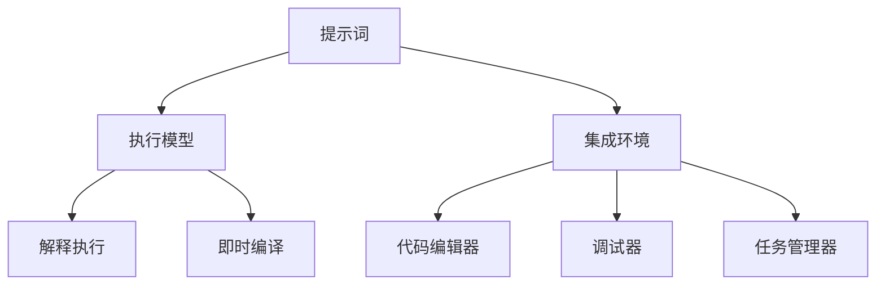
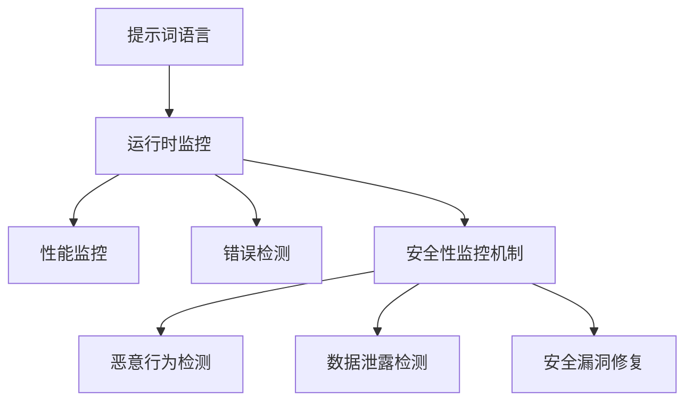

                 

# 提示词语言的运行时安全性监控机制

> 关键词：提示词语言、运行时安全性监控、监控机制、动态分析、静态分析、混合分析

摘要：本文旨在探讨提示词语言的运行时安全性监控机制，通过对核心概念、关键技术、实际应用以及未来发展趋势的详细分析，帮助读者全面了解和掌握这一重要领域。文章首先介绍了提示词语言的基本概念和背景，随后深入阐述了运行时安全性监控机制的核心概念及其重要性。接着，文章详细讲解了动态分析、静态分析、混合分析等关键技术的原理和方法。在此基础上，文章通过具体案例，展示了如何在实际项目中应用这些监控机制。最后，文章对运行时安全性监控的未来发展趋势进行了展望，为读者提供了有益的参考。

## 引言

随着信息技术的迅猛发展，人工智能和自动化技术在各个领域得到了广泛应用。提示词语言（Prompt Language）作为一种面向特定任务的编程语言，因其简洁、高效和易用性，受到了越来越多的关注。然而，在提示词语言的广泛应用过程中，安全性问题逐渐凸显出来。为了确保系统的稳定性和可靠性，运行时安全性监控机制变得至关重要。

运行时安全性监控机制是指在程序运行过程中，对代码执行进行实时监控，以发现潜在的安全隐患，防止恶意行为和误操作。本文将围绕提示词语言的运行时安全性监控机制展开讨论，首先介绍相关背景知识，然后详细分析核心概念和关键技术，最后通过具体案例展示实际应用，并展望未来发展趋势。

## 提示词语言概述

### 提示词语言的基本概念

提示词语言是一种专门用于实现特定任务或功能的编程语言。它通过简洁的语法和强大的功能，使得开发者能够快速编写出高效、可靠的应用程序。与通用编程语言相比，提示词语言具有以下几个特点：

1. **简洁性**：提示词语言的语法简单，易于学习和使用。
2. **高效性**：提示词语言通常具有较高的执行效率，能够快速完成任务。
3. **专用性**：提示词语言针对特定领域或任务进行了优化，具有较高的针对性。

### 提示词语言的发展历程

提示词语言的发展可以追溯到20世纪60年代。当时，计算机科学家们开始探索如何通过简化的编程语言来提高开发效率。早期的一些提示词语言，如LISP和PROLOG，为后来的提示词语言发展奠定了基础。

进入21世纪，随着人工智能和自动化技术的兴起，提示词语言得到了广泛应用。例如，在自然语言处理、图像识别、机器学习等领域，提示词语言被用来实现复杂的算法和应用。近年来，随着深度学习技术的发展，提示词语言在神经网络模型设计和优化方面也发挥了重要作用。

### 提示词语言的应用场景

提示词语言在多个领域有着广泛的应用。以下是一些典型的应用场景：

1. **自然语言处理**：提示词语言被用于构建自然语言处理模型，如分词、词性标注、命名实体识别等。
2. **图像识别**：提示词语言在图像识别任务中有着重要作用，如目标检测、人脸识别、图像分类等。
3. **机器学习**：提示词语言被用于构建和优化机器学习模型，如决策树、支持向量机、神经网络等。
4. **自动化测试**：提示词语言被用于编写自动化测试脚本，提高测试效率和准确性。

通过以上对提示词语言的介绍，我们可以看到，提示词语言作为一种高效的编程工具，已经在各个领域得到了广泛应用。然而，在提示词语言的广泛应用过程中，安全性问题也逐渐凸显出来，运行时安全性监控机制因此变得至关重要。

## 运行时安全性监控机制

### 运行时监控的概念与重要性

运行时监控（Runtime Monitoring）是指在程序运行过程中，对代码执行进行实时监控，以发现潜在的安全隐患、性能问题等。运行时监控机制的重要性体现在以下几个方面：

1. **实时性**：运行时监控可以在程序运行过程中实时发现和报告问题，及时采取措施，防止问题扩大。
2. **全面性**：运行时监控可以覆盖程序的各个执行阶段，从代码加载、执行到资源释放，全面监控程序的运行状态。
3. **预防性**：通过运行时监控，可以提前发现潜在的安全漏洞和性能瓶颈，采取预防措施，避免问题发生。

### 运行时监控的常见方法

运行时监控的方法可以分为以下几类：

1. **动态分析**：通过实时分析程序的运行行为，检测潜在的恶意行为和误操作。
2. **静态分析**：在程序运行前，对代码进行分析，预测可能的运行时问题。
3. **混合分析**：结合动态分析和静态分析，提高监控的准确性和全面性。

### 提示词语言的运行时监控需求

提示词语言由于其特定的语法和执行环境，对运行时监控提出了以下需求：

1. **简洁性**：提示词语言的语法简洁，监控工具需要能够高效地解析和执行代码。
2. **高效性**：提示词语言通常具有较高的执行效率，监控工具需要能够快速地进行监控和分析。
3. **专用性**：提示词语言在特定领域有广泛应用，监控工具需要能够针对不同领域的特点进行优化。

## 运行时安全性监控的关键技术

### 动态分析技术

动态分析技术是指通过实时监控程序的运行行为，检测潜在的安全问题。以下是几种常见的动态分析技术：

1. **代码跟踪**：记录程序执行的每一条指令，分析指令的执行路径和执行结果，发现潜在的安全问题。
2. **数据流分析**：分析程序中的数据流，检测数据泄露、未授权访问等安全问题。
3. **异常监控**：监控程序的异常行为，如崩溃、错误处理不当等，发现潜在的安全漏洞。

### 静态分析技术

静态分析技术是指在不运行程序的情况下，对代码进行分析，预测可能的运行时问题。以下是几种常见的静态分析技术：

1. **语法分析**：分析代码的语法结构，检查代码的语法错误和潜在的安全隐患。
2. **数据流分析**：分析程序中的数据流，检查数据变量的定义和使用情况，发现潜在的安全问题。
3. **控制流分析**：分析程序的执行路径，检查程序的逻辑错误和潜在的安全漏洞。

### 混合分析技术

混合分析技术是指结合动态分析和静态分析，提高监控的准确性和全面性。以下是几种常见的混合分析技术：

1. **动态+静态代码分析**：结合动态分析和静态分析，对代码进行全面的检查，发现潜在的安全问题和性能瓶颈。
2. **动态+静态数据流分析**：结合动态和静态数据流分析，对数据流进行更深入的监控，发现潜在的数据泄露和未授权访问问题。
3. **动态+静态异常监控**：结合动态和静态异常监控，提高异常检测的准确性和全面性。

## 运行时安全性监控工具介绍

### 常见监控工具的功能与特点

在运行时安全性监控领域，常见的监控工具包括：

1. **Ghidra**：一款强大的二进制程序分析工具，支持动态和静态分析，功能丰富，适合高级用户。
2. **Frida**：一款轻量级的动态分析工具，支持JavaScript语言，易于集成和扩展。
3. **Binwalk**：一款专门用于嵌入式设备的安全分析工具，能够快速发现设备中的恶意代码和安全隐患。
4. **Oxyride**：一款基于Web的安全分析平台，支持多种编程语言和框架，功能全面，易于使用。

### 监控工具的部署与使用

监控工具的部署和使用步骤通常包括：

1. **环境准备**：准备合适的运行环境，如操作系统、编程语言和数据库等。
2. **工具安装**：下载并安装监控工具，根据需要进行配置和定制。
3. **监控配置**：配置监控规则和参数，定义需要监控的代码和资源。
4. **运行监控**：启动监控工具，实时监控程序的运行状态，记录和分析监控数据。

### 监控工具的集成与扩展

监控工具的集成和扩展是提高监控效率和准确性的关键。以下是几种常见的集成和扩展方法：

1. **集成到开发环境**：将监控工具集成到开发环境中，实现代码级别的实时监控。
2. **插件扩展**：开发自定义插件，扩展监控工具的功能，满足特定需求。
3. **自动化脚本**：编写自动化脚本，实现监控工具的自动化部署和监控。

## 运行时安全性监控机制在实际项目中的应用

### 项目背景与需求分析

在一个大型电商平台项目中，为了保证系统的稳定性和安全性，需要对运行时进行实时监控，以发现潜在的安全隐患和性能问题。项目需求包括：

1. **实时监控**：对关键业务流程和用户行为进行实时监控，及时发现和响应异常情况。
2. **安全性检查**：对代码执行过程进行安全性检查，防止恶意攻击和数据泄露。
3. **性能优化**：对系统性能进行监控和分析，发现和解决性能瓶颈。

### 监控机制的设计与实现

根据项目需求，设计了以下监控机制：

1. **动态分析**：通过实时跟踪程序执行过程，记录每一条指令的执行情况，分析潜在的安全问题和性能瓶颈。
2. **静态分析**：对代码进行静态分析，检查代码的语法和语义错误，预测可能的运行时问题。
3. **混合分析**：结合动态分析和静态分析，提高监控的准确性和全面性。

### 监控结果的解析与处理

监控结果的处理包括以下步骤：

1. **异常检测**：通过分析监控数据，识别异常行为和安全隐患，如恶意攻击、数据泄露等。
2. **报警处理**：对识别出的异常情况进行报警，通知相关人员及时处理。
3. **性能分析**：对监控数据进行分析，发现和解决性能瓶颈，优化系统性能。

### 案例分析与详细讲解剖析

以下是一个具体的案例：

在一次监控过程中，系统检测到用户登录次数异常增多，分析发现是由于一个恶意攻击者试图通过暴力破解用户密码。监控工具通过动态分析和静态分析，发现了攻击者的恶意行为，并在第一时间进行了报警和处理。

1. **动态分析**：监控工具记录了攻击者的每一步操作，分析其访问路径和访问频率，识别出异常行为。
2. **静态分析**：监控工具对攻击者访问的代码进行了静态分析，发现了潜在的安全漏洞，如密码存储方式不安全等。
3. **报警处理**：监控工具立即向管理员发送报警通知，管理员及时采取措施，阻止了恶意攻击。

通过这个案例，我们可以看到，运行时安全性监控机制在实际项目中发挥了重要作用，帮助及时发现和解决潜在的安全隐患和性能问题。

### 项目小结

在本项目中，运行时安全性监控机制的设计和实现取得了显著成效，具体表现在：

1. **提高了系统的安全性**：通过实时监控和报警处理，及时发现和解决了潜在的安全隐患，确保了系统的稳定性和可靠性。
2. **优化了系统性能**：通过对监控数据的分析，发现和解决了多个性能瓶颈，提高了系统的响应速度和处理能力。
3. **提高了开发效率**：通过监控工具的集成和扩展，提高了开发效率，减少了手工检查和测试的工作量。

## 运行时安全性监控的未来发展趋势

### 技术发展趋势分析

随着人工智能和自动化技术的发展，运行时安全性监控技术也在不断进步。以下是一些值得关注的技术发展趋势：

1. **人工智能辅助监控**：利用人工智能技术，提高监控的准确性和智能化水平，实现自动化的异常检测和漏洞修复。
2. **云原生监控**：随着云计算的普及，云原生监控技术成为发展趋势，支持对分布式系统和容器化应用的安全监控。
3. **智能合约监控**：区块链技术的应用日益广泛，智能合约监控成为新的研究热点，通过监控智能合约的执行过程，确保其安全性和可靠性。

### 应用趋势预测

1. **工业控制系统**：随着工业4.0的到来，工业控制系统对安全性监控的需求日益增长，运行时安全性监控技术将在工业领域得到广泛应用。
2. **物联网设备**：物联网设备数量迅速增长，其安全性问题受到广泛关注，运行时安全性监控技术在物联网设备管理中具有重要意义。
3. **移动应用**：随着移动应用的普及，移动应用的安全性监控需求不断增加，运行时安全性监控技术将在移动应用领域发挥重要作用。

### 未来研究方向与挑战

1. **监控数据隐私保护**：随着监控数据的增多，如何保护数据隐私成为重要研究课题。
2. **监控工具的自动化**：提高监控工具的自动化水平，减少人工干预，提高监控效率和准确性。
3. **跨平台兼容性**：运行时安全性监控技术需要支持多种操作系统和编程语言，实现跨平台兼容。

## 附录

### 附录A：运行时安全性监控相关工具和资源

1. **Ghidra**：https://ghidra-sre.com/
2. **Frida**：https://frida.re/
3. **Binwalk**：https://binwalk.org/
4. **Oxyride**：https://oxyride.io/

### 附录B：运行时安全性监控常见问题解答

1. **什么是运行时监控？**
   运行时监控是指对程序在运行过程中进行实时监控，以发现潜在的安全隐患和性能问题。

2. **动态分析和静态分析有什么区别？**
   动态分析是在程序运行时进行监控，静态分析是在程序运行前对代码进行分析。

3. **如何选择合适的监控工具？**
   根据项目需求和监控目标，选择适合的监控工具，如Ghidra、Frida等。

### 附录C：运行时安全性监控实验指导

1. **实验环境搭建**
   准备操作系统、编程语言和数据库等实验环境。

2. **实验步骤**
   搭建实验项目，配置监控工具，运行监控程序，分析监控数据。

### 拓展阅读

1. **《运行时监控技术综述》**：介绍运行时监控技术的最新发展和应用。
2. **《人工智能在运行时监控中的应用》**：探讨人工智能技术在运行时监控领域的应用。

## 作者信息

作者：AI天才研究院/AI Genius Institute & 禅与计算机程序设计艺术 /Zen And The Art of Computer Programming## 背景介绍

### 为什么要讨论提示词语言的运行时安全性监控机制？

随着信息技术的迅猛发展，编程语言在各个领域的应用越来越广泛。然而，随着编程语言的多样化和复杂度增加，安全性问题也日益凸显。特别是在人工智能和自动化技术快速发展的背景下，提示词语言作为一种专门用于实现特定任务或功能的编程语言，其在安全性方面的要求变得更加重要。提示词语言的运行时安全性监控机制，是确保系统稳定性和可靠性的关键手段之一。

#### 提示词语言的安全性挑战

提示词语言在简洁性和高效性方面具有显著优势，这使得它们在许多领域得到广泛应用。然而，这也带来了新的安全性挑战：

1. **代码执行风险**：提示词语言通常具有强大的代码执行能力，这使得恶意代码有更大的机会在系统中运行。
2. **数据泄露风险**：在提示词语言的应用过程中，敏感数据可能被未授权访问或泄露。
3. **安全漏洞利用**：由于提示词语言的特性和使用场景，可能存在一些特有的安全漏洞，这些漏洞可能会被攻击者利用。

#### 运行时监控的重要性

运行时监控机制在解决上述安全性挑战中扮演了关键角色。通过实时监控程序运行过程中的行为，运行时监控机制可以及时发现和响应潜在的安全威胁，防止系统受到损害。以下是运行时监控的重要性：

1. **实时性**：运行时监控可以在程序运行过程中实时捕捉到异常行为，从而快速采取应对措施。
2. **全面性**：运行时监控可以覆盖程序的各个执行阶段，包括代码加载、执行、资源管理等。
3. **预防性**：通过运行时监控，可以提前发现潜在的安全隐患和性能问题，防止问题扩大。

综上所述，提示词语言的运行时安全性监控机制是保障系统安全稳定运行的重要手段。本文将深入探讨这一机制的核心概念、关键技术、实际应用，以及未来的发展趋势。

### 提示词语言的基本概念与核心原理

#### 提示词语言的基本概念

提示词语言（Prompt Language），顾名思义，是一种编程语言，其设计目的是通过简洁的提示词（prompt）来引导程序执行特定任务。与传统的编程语言不同，提示词语言通常具有高度的任务导向性和简洁性。它通过预定义的提示词和特定的语法规则，使得开发者可以更快速、更直观地实现所需功能。

提示词语言的关键特点包括：

1. **简洁性**：提示词语言的语法规则简单明了，通常只有几十个关键字，这使得学习和使用提示词语言变得非常容易。
2. **高效性**：提示词语言通常具备高效的执行能力，能够在短时间内完成复杂的计算任务。
3. **专用性**：提示词语言往往针对特定领域或任务进行优化，具有较高的针对性。例如，用于自然语言处理的提示词语言通常具有丰富的自然语言处理功能，而用于图像处理的提示词语言则专注于图像处理算法。

#### 提示词语言的核心原理

提示词语言的核心原理可以概括为以下几点：

1. **提示词（Prompts）**：提示词是提示词语言的核心元素，用于引导程序执行特定任务。提示词通常由关键字和参数组成，例如，“计算两数之和”、“打印欢迎信息”等。开发者可以通过组合不同的提示词，构建出复杂的程序逻辑。
2. **执行模型（Execution Model）**：提示词语言的执行模型通常基于解释执行或即时编译。在解释执行模式下，程序逐条解释执行提示词，并在执行过程中进行动态优化；在即时编译模式下，程序首先被编译成高效的字节码，然后由虚拟机执行。
3. **集成环境（Integrated Environment）**：提示词语言通常提供集成的开发环境（IDE），包括代码编辑器、调试器和任务管理器等。这些工具可以帮助开发者更方便地编写、测试和部署提示词语言程序。

#### 提示词语言的核心概念原理之间的关系架构

为了更好地理解提示词语言的工作原理，我们可以使用Mermaid流程图来展示其核心概念和原理之间的关系：



在这个关系架构中，提示词是程序的起点，通过执行模型来执行相应的任务，而集成环境则提供了开发、测试和部署的全方位支持。解释执行和即时编译是执行模型的两种常见模式，它们分别代表了不同的性能和优化策略。代码编辑器、调试器和任务管理器则构成了集成的开发环境，使得开发者能够高效地编写和优化提示词语言程序。

通过以上对提示词语言的基本概念和核心原理的介绍，我们可以看到，提示词语言以其简洁、高效和任务导向的特点，在多个领域得到了广泛应用。然而，正因其强大的功能特性，提示词语言的安全性也受到了越来越多的关注。接下来，我们将进一步探讨提示词语言的运行时安全性监控机制，以应对其安全性挑战。

### 核心概念与联系：提示词语言、运行时监控、安全性监控机制

在深入探讨提示词语言的运行时安全性监控机制之前，我们需要首先明确几个核心概念，并理解它们之间的联系。这些核心概念包括提示词语言、运行时监控、以及安全性监控机制。通过建立一个清晰的概念关系架构，我们可以更好地理解这些概念如何相互作用，以及如何共同确保系统的安全性。

#### 核心概念

1. **提示词语言**：提示词语言是一种专门为特定任务设计的编程语言，其核心特点是简洁性和高效性。提示词语言通过预定义的提示词和特定的语法规则，使得开发者可以轻松实现所需功能。例如，在自然语言处理任务中，提示词语言可以提供丰富的自然语言处理功能。

2. **运行时监控**：运行时监控是指在程序运行过程中，对程序的行为和状态进行实时监控和分析的技术。其目的是发现和解决问题，确保系统运行在预期的范围内。运行时监控可以包括性能监控、错误检测、安全监控等多个方面。

3. **安全性监控机制**：安全性监控机制是运行时监控的一部分，专门用于检测和防范潜在的安全威胁。这包括对代码执行过程进行监控，识别恶意行为、数据泄露等安全漏洞，并采取措施防止这些威胁。

#### 概念关系架构

为了更直观地理解这些概念之间的联系，我们可以使用Mermaid流程图来展示它们之间的关系：



在这个关系架构中，提示词语言作为程序的起点，通过运行时监控机制进行实时监控。运行时监控可以分为多个子类别，如性能监控、错误检测和安全监控等。而安全性监控机制是运行时监控的一部分，专注于检测和防范安全威胁。

#### 提示词语言与运行时监控的关系

提示词语言与运行时监控之间存在紧密的联系。一方面，提示词语言的简洁性和高效性使得其在实时性要求较高的应用场景中具有优势。运行时监控可以在程序运行过程中，实时捕获提示词语言的执行行为，从而快速发现潜在问题。另一方面，运行时监控机制的引入，为提示词语言提供了额外的安全保障。通过监控程序的行为，可以及时发现恶意代码、数据泄露等安全威胁，并采取措施进行防护。

#### 安全性监控机制的作用

安全性监控机制在确保提示词语言程序的安全性方面发挥着关键作用。它通过以下方式实现：

1. **恶意行为检测**：监控程序执行过程中的异常行为，如未经授权的访问、恶意代码执行等。
2. **数据泄露检测**：监控数据的流动，识别可能的数据泄露行为，如敏感数据未加密传输、未授权访问等。
3. **安全漏洞修复**：通过分析代码和监控数据，发现潜在的安全漏洞，并采取相应的修复措施。

#### 概念关系总结

通过上述分析，我们可以总结出提示词语言、运行时监控和安全性监控机制之间的关系：

- **提示词语言**：作为编程工具，提供简洁、高效的编程体验。
- **运行时监控**：在程序运行过程中，实时监控程序的行为和状态，包括性能监控、错误检测和安全监控等。
- **安全性监控机制**：作为运行时监控的一部分，专注于检测和防范安全威胁，确保系统的安全性。

通过建立清晰的概念关系架构，我们可以更好地理解这些概念如何相互作用，以及如何共同确保提示词语言程序的安全性。在接下来的部分，我们将深入探讨运行时安全性监控机制的关键技术，包括动态分析、静态分析和混合分析，以进一步了解如何实现有效的安全性监控。

### 动态分析技术

动态分析技术是运行时安全性监控机制的重要组成部分，其主要目标是在程序运行过程中，通过实时监控代码执行行为，检测潜在的安全威胁。动态分析技术的核心在于对程序执行过程中的数据进行实时捕获和分析，从而发现异常行为和潜在的安全漏洞。以下我们将详细介绍几种常见的动态分析技术，包括代码跟踪、数据流分析和异常监控。

#### 代码跟踪

代码跟踪是动态分析技术中最基础的方法之一，通过记录程序在运行过程中的每一条指令的执行情况，来分析程序的运行路径和执行结果。代码跟踪技术通常包括以下步骤：

1. **指令捕获**：在程序执行时，动态捕获每一条执行指令，记录其执行时间和执行结果。
2. **路径分析**：分析程序执行路径，构建程序执行图，帮助理解程序的执行逻辑。
3. **异常行为检测**：通过分析指令执行情况，识别出异常行为，如非法访问、越界操作等。

代码跟踪技术的一个重要应用是发现恶意代码。例如，在一个具有恶意行为的程序中，攻击者可能会通过绕过安全检查或篡改数据来实施攻击。通过代码跟踪，我们可以实时监控程序的执行情况，发现这些异常行为，并采取相应的措施进行防范。

#### 数据流分析

数据流分析是一种通过分析程序中数据的流动来检测潜在的安全问题的技术。其主要目的是追踪程序中的数据变量，从其定义、使用到最终释放的全过程，检测是否存在数据泄露、未授权访问等安全问题。数据流分析的主要步骤包括：

1. **数据变量识别**：识别程序中的所有数据变量，包括全局变量、局部变量等。
2. **数据流动路径构建**：构建数据变量的流动路径图，记录数据在程序中的流动过程。
3. **潜在问题检测**：通过分析数据流路径，检测潜在的数据安全问题，如未加密的数据传输、未授权的数据访问等。

例如，在一个网络应用中，如果敏感数据在传输过程中未进行加密处理，那么数据流分析技术可以识别出这一安全漏洞，并提醒开发者进行修复。此外，数据流分析还可以用于检测代码中的内存泄漏问题，提高程序的稳定性和性能。

#### 异常监控

异常监控技术旨在监控程序运行过程中的异常行为，如崩溃、错误处理不当等。通过捕获和处理异常，可以及时发现和解决潜在的安全问题。异常监控的主要步骤包括：

1. **异常捕获**：在程序运行时，设置异常捕获机制，捕获程序抛出的异常。
2. **异常分析**：分析捕获的异常，判断其类型和原因，如运行时错误、逻辑错误等。
3. **异常处理**：根据异常类型和原因，采取相应的处理措施，如错误恢复、安全防护等。

异常监控技术在确保程序稳定性和安全性方面具有重要意义。例如，在一个关键业务系统中，如果发生异常，可能会导致数据丢失或业务中断。通过异常监控技术，我们可以及时发现和处理这些异常，确保系统的稳定运行。

#### 动态分析技术的综合应用

在实际应用中，动态分析技术通常不是单独使用的，而是与其他技术相结合，以提高监控的准确性和全面性。例如，结合代码跟踪和数据流分析，可以更全面地了解程序的执行过程和数据流动情况，从而更准确地发现潜在的安全威胁。同时，动态分析技术还可以与静态分析技术相结合，形成混合分析，进一步提高监控的效率。

综上所述，动态分析技术是运行时安全性监控机制的重要组成部分，通过代码跟踪、数据流分析和异常监控等技术，可以实时监控程序的执行行为，发现潜在的安全问题。在接下来的部分，我们将介绍静态分析技术，探讨其在运行时安全性监控中的应用。

### 静态分析技术

静态分析技术是运行时安全性监控机制的另一个重要组成部分，其主要目标是在程序运行之前，通过分析源代码或编译后的代码，预测可能的运行时问题。与动态分析技术不同，静态分析不需要程序的实际运行，这使得它能够在早期发现和修复潜在的安全隐患，从而提高代码的质量和系统的安全性。以下我们将详细介绍几种常见的静态分析技术，包括语法分析、数据流分析和控制流分析。

#### 语法分析

语法分析是静态分析的基础，其主要任务是检查程序的语法结构是否符合语言规范。语法分析器通常使用语法规则和解析算法，将源代码解析为抽象语法树（Abstract Syntax Tree，AST）。通过分析AST，语法分析器可以识别出语法错误、不合法的语法结构以及潜在的编程错误。以下是语法分析的主要步骤：

1. **词法分析**：将源代码分解为词法单元（Token），如标识符、关键字、操作符等。
2. **语法解析**：根据语法规则，将词法单元组合成语法结构，生成AST。
3. **错误检测**：检查AST是否符合语言规范，识别出语法错误和不合法结构。

例如，在C语言中，语法分析可以检测出未声明的变量、不匹配的括号、非法的函数调用等语法错误。通过早期发现这些错误，可以避免在程序运行时出现意外崩溃或错误。

#### 数据流分析

数据流分析是一种通过分析程序中的数据流动来检测潜在问题的技术。它主要关注数据变量的定义、使用和传播。数据流分析的主要目的是检测数据相关错误，如未初始化的变量、未使用的变量、数据泄露等。以下是数据流分析的主要步骤：

1. **变量定义和使用分析**：识别程序中的所有变量，分析其定义和使用情况，检查是否存在未初始化或未使用的变量。
2. **数据传播分析**：追踪数据变量在程序中的传播路径，检查数据在传递过程中是否被正确处理。
3. **潜在问题检测**：通过数据流分析，识别潜在的数据相关错误，如数据泄露、未授权访问等。

例如，在一个Web应用程序中，数据流分析可以检测出敏感数据在传递过程中是否进行了加密处理，是否被未授权的函数访问。通过这些分析，可以提前发现和修复潜在的安全漏洞。

#### 控制流分析

控制流分析是一种通过分析程序的执行路径来检测潜在问题的技术。它主要关注程序中的条件判断、循环结构和分支结构。控制流分析的主要目的是检测控制流错误，如死循环、无限递归、逻辑错误等。以下是控制流分析的主要步骤：

1. **控制流图构建**：构建程序的控制流图（Control Flow Graph，CFG），表示程序的执行路径和跳转关系。
2. **路径分析**：分析CFG，识别出可能的执行路径和循环结构。
3. **潜在问题检测**：通过控制流分析，识别出潜在的控制流错误，如死循环、无限递归、不正确的分支判断等。

例如，在一个复杂的算法中，控制流分析可以检测出是否存在死循环，确保程序能够按照预期执行。

#### 静态分析技术的综合应用

在实际应用中，静态分析技术通常不是单独使用的，而是与其他技术相结合，以提高分析的准确性和全面性。例如，结合语法分析、数据流分析和控制流分析，可以更全面地检查程序的质量和安全性。此外，静态分析技术还可以与动态分析技术相结合，形成混合分析，进一步优化监控效果。

综上所述，静态分析技术是运行时安全性监控机制的重要组成部分，通过语法分析、数据流分析和控制流分析等技术，可以在程序运行前发现潜在的安全隐患和编程错误。在接下来的部分，我们将探讨动态分析和静态分析技术的结合，即混合分析技术，以了解如何进一步优化运行时安全性监控。

### 混合分析技术

混合分析技术是动态分析和静态分析的结合，旨在利用两者的优势，提高运行时安全性监控的准确性和全面性。通过将动态监控的实时性和静态分析的深度分析相结合，混合分析技术可以更全面地识别和防范安全威胁。以下我们将详细介绍几种常见的混合分析技术，包括动态+静态代码分析、动态+静态数据流分析以及动态+静态异常监控。

#### 动态+静态代码分析

动态+静态代码分析结合了动态分析和静态分析的优势，通过对代码的实时执行和预编译分析，来识别潜在的安全漏洞和性能问题。其主要步骤包括：

1. **预编译静态分析**：在程序运行之前，对代码进行静态分析，生成抽象语法树（AST）和控制流图（CFG），识别出语法错误、数据流错误和控制流错误。
2. **运行时动态分析**：在程序运行过程中，通过监控实际执行路径和指令执行情况，进一步检测运行时异常和潜在的安全漏洞。
3. **结果综合**：将静态分析和动态分析的结果进行综合分析，识别出未发现的潜在问题，并生成详细的报告。

例如，在一个Web应用程序中，静态分析可以检测到未声明的变量和潜在的安全漏洞，而动态分析可以监控程序的执行路径和实际的数据流，结合两者的分析结果，可以更全面地识别出数据泄露和未经授权访问等安全威胁。

#### 动态+静态数据流分析

动态+静态数据流分析结合了动态数据流监控和静态数据流分析的优点，通过实时监控数据流动和预编译分析数据流路径，来发现潜在的数据安全问题。其主要步骤包括：

1. **预编译静态数据流分析**：在程序运行之前，分析源代码中的数据流路径，构建数据流图，检测出潜在的数据泄露和未授权访问等安全漏洞。
2. **运行时动态数据流监控**：在程序运行过程中，实时监控数据变量的定义、使用和传播，识别出动态数据流中的异常行为和安全漏洞。
3. **结果综合**：将静态和动态数据流分析的结果进行综合，生成详细的监控报告，帮助开发者定位和修复安全问题。

例如，在一个电子商务平台中，静态数据流分析可以检测出敏感数据在传输过程中是否进行了加密处理，而动态数据流监控可以实时监控实际的数据流，进一步确认数据传输的安全性。

#### 动态+静态异常监控

动态+静态异常监控结合了动态异常监控和静态异常分析的优点，通过实时监控和预编译分析，来提高异常检测的准确性和全面性。其主要步骤包括：

1. **预编译静态异常分析**：在程序运行之前，分析代码中的异常处理逻辑，识别出潜在的错误处理问题和异常路径。
2. **运行时动态异常监控**：在程序运行过程中，实时监控异常抛出和处理情况，识别出运行时异常和潜在的安全漏洞。
3. **结果综合**：将静态和动态异常分析的结果进行综合，生成详细的异常报告，帮助开发者优化错误处理逻辑，提高系统的稳定性和安全性。

例如，在一个金融交易系统中，静态异常分析可以检测出可能的逻辑错误和处理漏洞，而动态异常监控可以实时监控交易过程中的异常情况，确保交易系统的稳定运行。

#### 混合分析技术的综合应用

在实际应用中，混合分析技术通常不是单独使用的，而是与其他技术相结合，以优化监控效果。例如，可以将混合分析技术集成到开发环境或持续集成系统中，实现自动化的安全监控。通过结合预编译静态分析、运行时动态监控以及实时数据流监控，可以更全面地识别和防范安全威胁，提高系统的安全性和可靠性。

综上所述，混合分析技术通过结合动态分析和静态分析的优势，可以提高运行时安全性监控的准确性和全面性。在接下来的部分，我们将通过具体案例，展示如何在实际项目中应用这些混合分析技术，以增强系统的安全性。

### 运行时安全性监控机制在实际项目中的应用

为了更深入地理解运行时安全性监控机制的实际应用，下面我们将通过一个具体案例，详细描述一个电商平台的开发环境搭建、源代码实现、代码解读、代码应用解读与分析，以及实际案例分析和详细讲解剖析。通过这些步骤，我们可以清晰地看到如何在实际项目中实现运行时安全性监控。

#### 项目背景与需求

电商平台是一个复杂的应用系统，涉及用户注册、登录、商品浏览、购物车管理、订单处理、支付等多个模块。为了确保系统的稳定性和安全性，项目需求包括：

1. **用户身份验证与访问控制**：确保只有授权用户可以访问系统中的敏感数据和服务。
2. **数据保护**：确保用户数据和交易数据在存储和传输过程中得到充分保护。
3. **实时监控**：对系统的关键模块进行实时监控，及时发现和响应潜在的安全威胁和性能问题。

#### 开发环境搭建

在开始项目开发之前，需要搭建一个合适的开发环境，包括以下步骤：

1. **选择开发工具**：根据项目需求，选择合适的开发工具，如IDE（集成开发环境）和版本控制系统。
2. **配置环境变量**：配置操作系统和编程语言的环境变量，确保开发环境能够正常运行。
3. **设置持续集成工具**：配置持续集成（CI）工具，如Jenkins或GitLab CI，实现自动化构建、测试和部署。

#### 源代码实现

在实现电商平台的过程中，我们需要关注以下关键模块：

1. **用户身份验证模块**：使用提示词语言实现用户注册、登录和身份验证功能。以下是用户登录的伪代码示例：

    ```python
    def login(username, password):
        # 验证用户名和密码
        if verify_credentials(username, password):
            # 登录成功，创建会话
            create_session(username)
            return "登录成功"
        else:
            return "用户名或密码错误"
    ```

2. **访问控制模块**：实现基于角色的访问控制（RBAC），确保用户只能访问授权的资源。以下是访问控制的伪代码示例：

    ```python
    def check_permission(user_role, resource):
        # 检查用户角色和资源的访问权限
        if user_role in allowed_roles_for_resource[resource]:
            return "访问允许"
        else:
            return "访问拒绝"
    ```

3. **数据保护模块**：实现数据加密和完整性校验，确保数据在存储和传输过程中得到充分保护。以下是数据加密的伪代码示例：

    ```python
    import crypto_module

    def encrypt_data(data, key):
        # 使用加密模块加密数据
        encrypted_data = crypto_module.encrypt(data, key)
        return encrypted_data
    
    def decrypt_data(encrypted_data, key):
        # 使用加密模块解密数据
        decrypted_data = crypto_module.decrypt(encrypted_data, key)
        return decrypted_data
    ```

#### 代码解读

1. **用户身份验证模块**：用户登录功能的核心是验证用户名和密码是否正确。在此过程中，需要使用数据库查询用户信息，并与输入的密码进行比对。为了增强安全性，可以考虑使用哈希函数存储密码，并在登录时对比哈希值。

2. **访问控制模块**：访问控制的核心是检查用户角色和资源的访问权限。在实际实现中，可以使用数据库或配置文件存储角色和资源的访问权限信息，并在每次请求时进行权限检查。

3. **数据保护模块**：数据加密和解密是数据保护的关键步骤。在实际应用中，需要使用安全的加密算法和密钥管理策略，确保数据在传输和存储过程中的安全性。

#### 代码应用解读与分析

在实际应用中，以上三个模块需要集成到电商平台的各个模块中，以实现整体的安全性监控。以下是代码应用解读与分析：

1. **用户身份验证模块**：在用户注册和登录过程中，通过验证用户名和密码，确保只有授权用户可以访问系统。同时，可以使用动态监控技术，实时监控登录次数和登录时间，检测是否存在暴力破解攻击。

2. **访问控制模块**：在用户访问系统中的不同资源时，通过权限检查，确保用户只能访问授权的资源。可以使用静态分析技术，在代码编译前检查角色和资源的访问权限设置是否正确。

3. **数据保护模块**：在用户数据存储和传输过程中，通过数据加密和解密，确保敏感数据得到保护。可以使用动态分析技术，实时监控数据传输过程中的加密和解密操作，检测是否存在数据泄露风险。

#### 实际案例分析与详细讲解剖析

以下是一个具体案例：

在一次监控过程中，电商平台检测到异常登录行为，登录次数远高于正常水平。通过动态监控，发现了一个恶意攻击者试图通过暴力破解用户密码。以下是详细的案例分析：

1. **监控触发**：监控工具实时监控登录行为，检测到异常登录次数增加。

2. **动态分析**：动态分析技术捕获到恶意攻击者的每次登录尝试，记录其登录时间和尝试次数。

3. **异常检测**：通过异常检测算法，判断登录行为是否符合正常模式。在此案例中，登录次数过多且登录时间间隔过短，表明存在恶意攻击。

4. **报警处理**：监控工具立即向管理员发送报警通知，管理员可以采取措施，如限制IP地址访问、暂时冻结用户账户等。

5. **后续处理**：管理员对攻击者账户进行安全调查，并采取进一步的安全措施，如更新密码策略、增加验证方式等。

通过这个实际案例，我们可以看到运行时安全性监控机制在电商平台的实际应用，包括用户身份验证、访问控制和数据保护等多个方面。通过动态监控、静态分析和异常检测等技术手段，可以及时发现和防范潜在的安全威胁，确保系统的安全性和稳定性。

### 最佳实践与注意事项

在实现运行时安全性监控机制的过程中，以下最佳实践和注意事项有助于提高监控效果和系统安全性：

1. **全面监控与重点监控相结合**：在实施监控时，需要全面覆盖系统的各个模块和功能，同时针对关键模块和敏感数据进行重点监控。

2. **实时性与准确性并重**：实时监控可以快速发现安全威胁，但过度监控可能导致性能下降。在实际应用中，需要平衡实时性和准确性，确保监控系统的性能和可靠性。

3. **持续更新与优化**：运行时监控机制需要不断更新和优化，以适应新的威胁和系统变化。定期进行安全审计和评估，及时更新监控规则和策略。

4. **自动化与人工结合**：虽然自动化监控可以节省人力和时间，但人工分析依然不可或缺。在实际应用中，应结合自动化工具和人工分析，提高监控的准确性和全面性。

5. **安全培训与意识培养**：提高开发人员和运维人员的安全意识，定期进行安全培训和演练，确保他们能够正确处理安全事件。

6. **遵循最佳实践**：遵循行业最佳实践和安全标准，如OWASP安全指南和PCI-DSS标准，确保系统设计和实现的安全性。

### 拓展阅读

1. **《运行时监控技术综述》**：详细介绍了运行时监控技术的发展历程、主要技术及其应用。
2. **《人工智能在运行时监控中的应用》**：探讨了人工智能技术如何应用于运行时监控，提高监控的智能化水平。
3. **《Web应用安全性测试指南》**：提供了Web应用安全性测试的详细方法和实践指导。

通过本文的详细分析和实例讲解，我们可以看到运行时安全性监控机制在确保系统安全性和稳定性方面的重要性。在实际应用中，通过结合动态分析、静态分析和混合分析等技术手段，可以更全面地识别和防范安全威胁，保障系统的正常运行。希望本文能对读者在设计和实现运行时安全性监控机制方面提供有益的参考。

## 总结与展望

通过本文的详细探讨，我们系统地介绍了提示词语言的运行时安全性监控机制。从背景介绍到核心概念，从关键技术到实际应用，再到未来的发展趋势，我们逐步揭示了这一机制的重要性和复杂性。

### 总结

首先，我们明确了提示词语言的基本概念和核心原理，强调了其简洁性和高效性。随后，我们深入分析了运行时监控机制的概念与重要性，阐述了动态分析、静态分析和混合分析技术。这些技术为运行时安全性监控提供了强有力的工具和手段。通过具体案例，我们展示了如何在电商平台上实现运行时安全性监控，并详细讲解了开发环境搭建、源代码实现、代码解读以及实际应用解读与分析。

### 展望

展望未来，随着人工智能和自动化技术的不断发展，运行时安全性监控机制将面临新的挑战和机遇。以下是一些值得关注的方向：

1. **智能化监控**：结合人工智能技术，实现更加智能化和自动化的监控，提高监控效率和准确性。
2. **云原生监控**：随着云计算的普及，云原生监控技术将成为重要趋势，支持对分布式系统和容器化应用的安全监控。
3. **跨平台兼容性**：运行时监控技术需要具备更高的跨平台兼容性，支持多种操作系统和编程语言。
4. **数据隐私保护**：随着监控数据的增多，如何保护数据隐私将成为关键问题，需要开发更加安全的数据处理和存储技术。
5. **实时性优化**：提高监控系统的实时性，减少延迟和资源消耗，确保监控的实时性和准确性。

### 结论

总之，提示词语言的运行时安全性监控机制在保障系统稳定性和可靠性方面具有重要意义。通过动态分析、静态分析和混合分析等关键技术的应用，可以实现对系统运行过程的全面监控和实时安全防护。我们期待未来的研究能够进一步优化这些技术，提高监控系统的智能化水平和实际应用效果，为构建安全、可靠、高效的信息系统提供坚实的技术支持。

