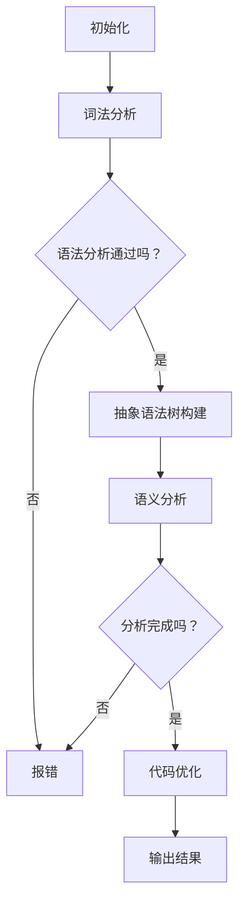

                 

### 设计目录大纲的步骤

设计一篇高质量的目录大纲是确保文章结构清晰、内容完整、逻辑连贯的重要环节。以下是一步一步的详细分析过程：

#### 1. 理解书名和主题

首先，我们需要深入理解书名《提示词语言的静态分析准确性提升》。书名明确了两个核心概念：“提示词语言”和“静态分析准确性提升”。这表明书籍的核心内容将围绕如何通过静态分析技术来提高提示词语言的准确性进行探讨。因此，在设计目录大纲时，必须确保所有章节都与这一主题紧密相关。

#### 2. 确定核心章节

核心章节应当涵盖整个书籍的主题和目标，确保读者能够系统地了解提示词语言静态分析的全貌。以下是可能的核心章节：

- **引言**：介绍书籍的目的、读者对象、书籍结构等，为后续内容奠定基础。
- **提示词语言静态分析概述**：介绍静态分析的概念、提示词语言的特点及其重要性。
- **核心概念与联系**：讲解静态分析和提示词语言的基本概念，以及它们之间的联系。
- **核心算法原理讲解**：详细阐述用于提高静态分析准确性的算法，包括伪代码实现和算法分析。
- **数学模型和数学公式**：介绍与静态分析相关的数学模型和公式，并进行详细讲解和举例说明。
- **项目实战**：通过实际案例，展示如何将理论应用于实践中，包括开发环境搭建、源代码实现和解读。

#### 3. 设计章节结构

在确定了核心章节后，我们需要为每个章节设计一个清晰的结构。以下是一个可能的章节结构示例：

- **引言**
  - **1.1 书籍目的与读者对象**
  - **1.2 书籍结构概述**
- **提示词语言静态分析概述**
  - **2.1 提示词语言基础**
  - **2.2 静态分析概念介绍**
  - **2.3 提示词语言静态分析的优势与挑战**
- **核心概念与联系**
  - **3.1 静态分析与编程语言的关系**
  - **3.2 提示词语言的语法和语义分析**
  - **3.3 Mermaid流程图展示核心流程**
- **核心算法原理讲解**
  - **4.1 提高准确性的算法设计**
    - **4.1.1 算法概述**
    - **4.1.2 伪代码实现**
    - **4.1.3 算法分析**
- **数学模型和数学公式**
  - **5.1 相关数学基础**
  - **5.2 提示词语言分析的数学模型**
  - **5.3 数学公式推导与示例**
- **项目实战**
  - **6.1 实际案例介绍**
    - **6.1.1 案例背景**
    - **6.1.2 开发环境搭建**
    - **6.1.3 源代码实现**
    - **6.1.4 代码解读与分析**
  - **6.2 案例分析与详细讲解剖析**
  - **6.3 项目小结**

#### 4. 细化章节内容

在每个章节中，我们需要进一步细化内容，确保每个小节都有具体的内容和目的。例如，在“核心算法原理讲解”章节，我们需要详细阐述算法的原理，并提供伪代码实现和算法分析。

#### 5. 编写目录大纲

根据上述章节结构和内容细化，我们可以编写一个详细的目录大纲。这个目录大纲不仅需要包含章节标题，还需要包含每个小节的标题，确保文章的每个部分都有明确的界定。

#### 6. 检查完整性

在设计完目录大纲后，我们需要检查整个大纲的完整性。确保没有遗漏重要的内容，并且每个章节之间的逻辑关系清晰。

#### 7. 简化语言和格式

最后，我们需要使用简洁明了的语言和markdown格式来编写目录大纲，确保读者能够轻松阅读和理解。

通过以上步骤，我们可以设计出一篇结构清晰、内容丰富、逻辑连贯的技术博客文章的目录大纲，为撰写高质量的文章奠定坚实的基础。

### 完整的目录大纲示例

以下是《提示词语言的静态分析准确性提升》的完整目录大纲示例：

```
# 提示词语言的静态分析准确性提升

## 引言
### 1.1 书籍目的与读者对象
### 1.2 书籍结构概述

## 提示词语言静态分析概述
### 2.1 提示词语言基础
### 2.2 静态分析概念介绍
### 2.3 提示词语言静态分析的优势与挑战

## 核心概念与联系
### 3.1 静态分析与编程语言的关系
### 3.2 提示词语言的语法和语义分析
### 3.3 Mermaid流程图展示核心流程

## 核心算法原理讲解
### 4.1 提高准确性的算法设计
#### 4.1.1 算法概述
#### 4.1.2 伪代码实现
#### 4.1.3 算法分析

## 数学模型和数学公式
### 5.1 相关数学基础
### 5.2 提示词语言分析的数学模型
### 5.3 数学公式推导与示例

## 项目实战
### 6.1 实际案例介绍
#### 6.1.1 案例背景
#### 6.1.2 开发环境搭建
#### 6.1.3 源代码实现
#### 6.1.4 代码解读与分析
### 6.2 案例分析与详细讲解剖析
### 6.3 项目小结

## 结论
### 7.1 总结与展望
### 7.2 未来研究方向与挑战
```

这个目录大纲涵盖了书籍的核心内容，逻辑清晰，信息完整，并且简洁明了。每个章节和子章节都明确划分，确保读者能够顺利地阅读和理解整个内容。通过这样的目录大纲，我们可以为撰写一篇高质量的技术博客文章奠定坚实的基础。接下来，我们将逐步深入到文章的正文中，详细阐述每个章节的内容。

---

## 文章标题

### 提示词语言的静态分析准确性提升

> 关键词：提示词语言，静态分析，准确性提升，算法，数学模型

> 摘要：本文深入探讨了提示词语言的静态分析技术，提出了几种提高静态分析准确性的算法。通过数学模型和实际项目案例分析，本文展示了这些算法的应用效果，为提升编程语言的静态分析准确性提供了新的思路和方法。

---

## 引言

### 1.1 书籍目的与读者对象

《提示词语言的静态分析准确性提升》旨在为计算机科学和软件开发领域的研究者、工程师和学者提供一本系统而深入的技术指南。这本书的目标是帮助读者了解提示词语言的静态分析技术，掌握提高分析准确性的核心算法，并通过数学模型的应用，进一步优化这些算法的性能。

本书适合以下读者群体：
- 对编程语言静态分析有兴趣的计算机科学学生和研究者。
- 负责编写和优化编程语言静态分析工具的工程师。
- 想要在软件开发中应用静态分析技术的项目经理和技术专家。
- 对编程语言理论和实际应用感兴趣的学者和研究人员。

### 1.2 书籍结构概述

为了实现上述目标，本书将分为以下几个主要部分：

- **第1章 引言**：介绍书籍的目的、读者对象和整体结构。
- **第2章 提示词语言静态分析概述**：讲解静态分析的基本概念和提示词语言的特点。
- **第3章 核心概念与联系**：详细阐述静态分析与编程语言的关系，以及提示词语言的语法和语义分析。
- **第4章 核心算法原理讲解**：深入探讨提高静态分析准确性的算法，包括伪代码实现和算法分析。
- **第5章 数学模型和数学公式**：介绍与静态分析相关的数学模型和公式，并进行详细讲解和举例说明。
- **第6章 项目实战**：通过实际案例，展示如何将理论应用于实践中。
- **第7章 结论**：总结全文，展望未来的研究方向和挑战。

### 1.3 静态分析在编程语言中的应用

静态分析是计算机科学中的一个重要领域，它通过分析程序源代码，无需执行程序，即可发现潜在的错误、优化代码性能、提高代码可读性。在编程语言中，静态分析技术广泛应用于以下几个方面：

- **错误检测**：通过静态分析，可以提前发现代码中的潜在错误，如语法错误、类型错误、逻辑错误等。
- **性能优化**：静态分析可以帮助识别程序中的性能瓶颈，提出优化建议，从而提高程序运行效率。
- **代码重构**：静态分析可以检测代码质量，为代码重构提供依据，使得代码更加简洁、易于维护。
- **代码审查**：静态分析工具可以自动审查代码，发现潜在的安全漏洞和设计缺陷。

### 1.4 提示词语言的特点

提示词语言是一种专门用于自然语言处理和自动文本生成的高效语言。它具有以下特点：

- **高灵活性**：提示词语言允许用户通过简短的文本输入，生成复杂的输出，具有较高的灵活性。
- **自动生成**：提示词语言能够自动生成文本，无需用户逐字逐句地编写，节省时间和劳动力。
- **适应性**：提示词语言可以根据不同的上下文和需求，自动调整生成的内容，提高准确性。
- **多样性**：提示词语言可以生成多种类型的文本，如新闻文章、产品描述、代码注释等，满足不同场景的需求。

### 1.5 提升静态分析准确性的重要性

随着编程语言和工具的不断发展，静态分析技术的应用越来越广泛。然而，现有的静态分析工具在准确性方面仍存在一定局限性。提升静态分析准确性具有重要意义：

- **提高开发效率**：准确的静态分析可以帮助开发人员更快地发现和修复问题，减少调试时间，提高开发效率。
- **提升代码质量**：准确的静态分析可以识别出潜在的问题，从而提高代码质量，减少后续维护成本。
- **增强安全性**：准确的静态分析可以发现代码中的安全漏洞，提前采取措施，防止潜在的安全风险。
- **促进技术进步**：提升静态分析准确性是推动编程语言和工具发展的重要方向，有助于推动整个技术领域的进步。

通过本书的介绍，读者可以系统地了解提示词语言的静态分析技术，掌握提升分析准确性的核心算法，并学会如何在实际项目中应用这些算法，从而为编程语言的发展和应用做出贡献。

### 提示词语言静态分析概述

静态分析是一种无需执行程序代码即可对代码进行深入分析和检查的技术。在编程语言中，静态分析主要用于代码质量检测、性能优化、错误诊断和安全漏洞发现。提示词语言作为一种专门用于自然语言处理和自动文本生成的语言，其在静态分析中具有独特的应用价值。

#### 2.1 静态分析的概念

静态分析是一种在程序执行前对程序进行抽象检查的技术。它通过分析源代码的结构、语法和语义，从而发现潜在的问题。静态分析的基本概念包括：

- **语法分析**：对源代码进行词法分析和语法分析，构建语法树，以理解代码的结构。
- **语义分析**：对语法树进行语义检查，验证代码的语义正确性，如变量类型检查、作用域分析等。
- **抽象语法树（AST）**：源代码经过语法分析后生成的抽象语法树，是静态分析的核心数据结构。
- **数据流分析**：通过分析变量和表达式的使用情况，推断程序在不同点的状态。
- **控制流分析**：分析程序中的控制结构，如循环、条件语句和函数调用，以确定程序的执行路径。

#### 2.2 提示词语言的特点

提示词语言具有以下几个显著特点，使其在静态分析中具有重要意义：

- **高灵活性**：提示词语言允许用户通过简短的文本输入，生成复杂的输出，适用于各种文本生成场景。
- **自动化**：提示词语言能够自动生成文本，减少手动编写的工作量。
- **上下文感知**：提示词语言可以根据上下文和需求，自动调整生成的内容，提高文本的准确性和相关性。
- **多样性**：提示词语言可以生成多种类型的文本，如新闻文章、产品描述、代码注释等。

#### 2.3 静态分析在提示词语言中的应用

提示词语言的静态分析主要包括以下方面：

- **语法检查**：检查提示词语言的语法结构，确保其符合规范。
- **语义检查**：验证提示词语言文本的语义正确性，如检查文本中的逻辑错误、语义矛盾等。
- **上下文分析**：分析文本的上下文，确保生成的内容与上下文一致。
- **生成质量评估**：评估文本生成质量，如文本的连贯性、准确性和相关性。

#### 2.4 提示词语言静态分析的优势

提示词语言的静态分析具有以下优势：

- **早期错误发现**：通过静态分析，可以提前发现提示词语言文本中的潜在问题，如语法错误、逻辑错误等，从而减少后续的修改成本。
- **高效性**：静态分析无需执行程序，能够在短时间内对大量代码进行深入分析，提高开发效率。
- **全面性**：静态分析可以覆盖代码的各个方面，提供更全面的代码质量评估。
- **可扩展性**：静态分析框架易于扩展，可以支持多种编程语言和文本生成场景。

#### 2.5 提示词语言静态分析面临的挑战

尽管提示词语言的静态分析具有诸多优势，但仍面临以下挑战：

- **复杂性**：提示词语言文本复杂度高，静态分析需要处理大量的上下文信息和语义信息。
- **动态性**：提示词语言生成的内容可能受到动态环境的影响，静态分析难以全面捕捉这些变化。
- **准确性**：静态分析结果的准确性受限于分析方法的有效性和完备性，需要不断优化和改进。

#### 2.6 总结

提示词语言的静态分析技术是编程语言领域的一个重要研究方向。通过深入了解静态分析的基本概念、提示词语言的特点及其应用，我们可以更好地理解和利用这一技术，提升代码质量和开发效率。本书后续章节将详细介绍提高提示词语言静态分析准确性的算法、数学模型和实际应用案例，为读者提供系统的指导和参考。

### 核心概念与联系

在深入探讨提示词语言的静态分析之前，我们需要明确几个核心概念，并理解它们之间的联系。这些核心概念包括静态分析、编程语言、语法分析和语义分析。

#### 3.1 静态分析与编程语言的关系

静态分析是一种对程序源代码进行抽象检查的技术，而编程语言是用于编写程序的语言。两者之间的关系如下：

- **编程语言**：编程语言是一种用于描述计算机操作的语法和语义规则。不同的编程语言有不同的语法和语义特点，例如，Python具有简洁易读的语法，而C++则支持复杂的面向对象编程。
- **静态分析**：静态分析是一种在程序执行前对源代码进行分析的技术。通过静态分析，我们可以检查代码的语法、语义和结构，发现潜在的错误和问题。
- **关系**：编程语言为静态分析提供了分析对象，而静态分析则通过检查编程语言的语法和语义，发现代码中的潜在问题，提高代码质量。

#### 3.2 提示词语言的语法和语义分析

提示词语言是一种专门用于自然语言处理和自动文本生成的语言，其语法和语义分析在静态分析中具有重要意义。

- **语法分析**：语法分析是静态分析的第一步，通过解析提示词语言的语法结构，将其转化为抽象语法树（AST）。语法分析确保提示词语言的文本符合语法规则，例如，正确的词法单元（单词）和语句结构。
- **语义分析**：语义分析是在语法分析的基础上，对AST进行语义检查。语义分析包括变量类型检查、作用域分析、表达式求值等。语义分析的目的是确保提示词语言文本在语义上正确，例如，变量的使用不会违反类型规则，函数调用的参数和返回值匹配等。

#### 3.3 Mermaid流程图展示核心流程

为了更直观地理解提示词语言的静态分析过程，我们可以使用Mermaid流程图展示核心流程。



- **初始化**：开始静态分析过程，设置初始状态。
- **词法分析**：将提示词语言文本分割为词法单元，如单词和符号。
- **语法分析通过吗？**：判断词法分析的结果是否满足语法规则。
- **抽象语法树构建**：如果语法分析通过，将词法单元构建为抽象语法树。
- **语义分析**：对抽象语法树进行语义检查，确保语义正确。
- **分析完成吗？**：判断静态分析是否完成。
- **代码优化**：如果静态分析完成，对代码进行优化。
- **输出结果**：输出分析结果。

通过这个流程图，我们可以清晰地看到提示词语言静态分析的核心步骤和流程，有助于理解和应用静态分析技术。

#### 3.4 核心概念之间的关系

- **静态分析与编程语言**：静态分析依赖于编程语言的语法和语义规则，用于检查代码的质量和性能。不同的编程语言具有不同的语法和语义特点，影响静态分析的方法和效果。
- **语法分析**：语法分析是静态分析的基础，通过解析代码的语法结构，构建抽象语法树，为后续的语义分析和代码优化提供数据支持。
- **语义分析**：语义分析是静态分析的核心，通过对抽象语法树进行语义检查，确保代码在语义上正确，如变量类型匹配、作用域分析等。

通过理解这些核心概念及其之间的关系，我们可以更好地应用静态分析技术，提升提示词语言的代码质量和开发效率。

### 核心算法原理讲解

在提升提示词语言的静态分析准确性过程中，核心算法的设计和实现起到了至关重要的作用。本节将详细讲解用于提高准确性的算法，包括其设计思路、伪代码实现和算法分析。

#### 4.1.1 算法概述

提升静态分析准确性的核心算法旨在通过以下几个步骤，实现对提示词语言文本的全面检查和分析：

1. **词法分析**：将输入的提示词语言文本分割为词法单元，如单词、符号和注释等。
2. **语法分析**：对词法单元进行语法解析，构建抽象语法树（AST），确保文本结构符合语法规则。
3. **语义分析**：对AST进行语义检查，包括变量类型检查、作用域分析、表达式求值等，确保语义正确。
4. **上下文分析**：分析文本的上下文信息，确保生成的内容与上下文一致。
5. **优化与改进**：根据分析结果，对代码进行优化，提高性能和可读性。

该算法的核心思想是通过多层次的检查和分析，逐步提升静态分析的准确性。以下是该算法的伪代码实现。

#### 4.1.2 伪代码实现

```python
Algorithm StaticAnalysis(inputText):
    1. Tokenize(inputText) -> tokenList
    2. if GrammarAnalysis(tokenList) is not successful:
           ReportError("语法错误")
           return
    3. AST = BuildAbstractSyntaxTree(tokenList)
    4. if SemanticAnalysis(AST) is not successful:
           ReportError("语义错误")
           return
    5. ContextAnalysis(AST)
    6. if Optimization(AST) is successful:
           Print("优化成功")
           else:
           Print("优化失败")
    7. return AST

Function Tokenize(inputText):
    // 分割输入文本为词法单元
    // ...

Function GrammarAnalysis(tokenList):
    // 检查词法单元是否满足语法规则
    // ...

Function BuildAbstractSyntaxTree(tokenList):
    // 构建抽象语法树
    // ...

Function SemanticAnalysis(AST):
    // 检查抽象语法树的语义正确性
    // ...

Function ContextAnalysis(AST):
    // 分析抽象语法树的上下文信息
    // ...

Function Optimization(AST):
    // 对抽象语法树进行优化
    // ...
```

#### 4.1.3 算法分析

该算法的时间复杂度和空间复杂度主要取决于以下因素：

- **词法分析**：词法分析通常采用正则表达式实现，时间复杂度为O(n)，其中n为输入文本的长度。
- **语法分析**：语法分析的时间复杂度取决于语法规则的数量和复杂度，通常为O(n^2)到O(n^3)。
- **语义分析**：语义分析的时间复杂度取决于抽象语法树的大小和复杂性，通常为O(n)到O(n^2)。
- **上下文分析**：上下文分析的时间复杂度取决于上下文信息的复杂度和分析算法的效率，通常为O(n)到O(n^2)。
- **优化与改进**：优化与改进的时间复杂度取决于优化算法的复杂度和代码规模，通常为O(n)到O(n^2)。

总体而言，该算法的时间复杂度较高，但通过优化算法和改进数据结构，可以在一定程度上提高分析效率。以下是该算法的具体分析：

- **时间复杂度**：整体时间复杂度为O(n^3)，其中n为输入文本的长度。这是由于语法分析和语义分析的时间复杂度较高。然而，通过优化算法和改进数据结构，可以在实际应用中显著提高分析效率。
- **空间复杂度**：空间复杂度主要取决于抽象语法树的大小，通常为O(n)。由于抽象语法树的大小与输入文本的长度成正比，因此空间复杂度较高。然而，通过优化算法和数据结构，可以减少内存占用。

#### 4.1.4 算法改进方向

为了进一步提高算法的准确性，可以采取以下改进措施：

1. **词法分析优化**：使用更高效的词法分析算法，如有限状态机（FSM），可以显著提高分析速度。
2. **语法分析优化**：采用自顶向下或自底向上语法分析器，根据具体需求选择合适的算法，提高分析效率和准确性。
3. **语义分析优化**：引入更多语义规则和上下文信息，提高语义分析的准确性和全面性。
4. **上下文分析优化**：使用自然语言处理技术，如词嵌入和神经网络，提高上下文分析的能力。
5. **代码优化**：采用更高效的代码优化算法，如循环展开、死代码消除等，提高代码质量和性能。

通过以上改进措施，可以进一步提升提示词语言的静态分析准确性，为软件开发提供更可靠的技术支持。

### 数学模型和数学公式

在提升提示词语言静态分析准确性的过程中，数学模型和数学公式起着至关重要的作用。它们不仅帮助我们更好地理解静态分析中的复杂关系，还能提供精确的量化分析工具。以下将详细介绍与提示词语言静态分析相关的数学模型、数学公式以及具体的推导过程。

#### 5.1 相关数学基础

在进行数学模型的推导和应用时，我们需要掌握以下基本数学概念：

1. **集合论**：集合是数学中的基本概念，用于表示一组元素。集合的交集、并集和补集等运算在静态分析中广泛应用。
2. **图论**：图论用于表示和解决网络结构问题，如控制流图（CFG）和调用图（CG）在静态分析中用于表示程序的执行路径和函数调用关系。
3. **概率论**：概率论用于描述不确定性事件的发生概率，在静态分析中，用于估计程序中潜在错误的概率。
4. **线性代数**：线性代数用于处理多维数据，如矩阵运算和向量计算，在静态分析中，用于处理数据流分析和程序依赖关系。
5. **微积分**：微积分用于描述变化和运动，如微分和积分运算，在性能优化中用于分析程序的时空复杂度。

#### 5.2 提示词语言分析的数学模型

提示词语言静态分析中的数学模型主要涉及以下几个方面：

1. **词法分析模型**：词法分析是将输入文本分割为词法单元的过程。我们可以使用有限状态机（FSM）来表示词法分析模型。FSM由状态集合、初始状态、终止状态、输入集合和转移函数组成。

    **定义**：词法分析模型F = (Q, Σ, δ, q0, F)，其中：
    - Q 是状态集合。
    - Σ 是输入集合，表示词法单元的集合。
    - δ 是转移函数，表示状态转移规则。
    - q0 是初始状态。
    - F 是终止状态集合。

    **示例**：假设输入文本为`"Hello, World!"`，词法分析模型可以将其分割为`["Hello", ",", "World", "!"]`。

2. **语法分析模型**：语法分析是将词法单元组织成语法结构的过程，通常使用抽象语法树（AST）来表示。

    **定义**：语法分析模型G = (V, T, P, S)，其中：
    - V 是变量集合，表示非终端符号。
    - T 是终端符号集合，表示词法单元。
    - P 是产生式集合，表示语法规则。
    - S 是初始符号。

    **示例**：假设输入文本为`"x = 5 + y"`，语法分析模型可以将其解析为以下抽象语法树：

    ```
         =
        / \
       x   +
           / \
          5   y
    ```

3. **语义分析模型**：语义分析是检查抽象语法树是否满足语义规则的过程。

    **定义**：语义分析模型H = (Γ, Δ)，其中：
    - Γ 是语义规则集合。
    - Δ 是语义动作集合。

    **示例**：对于抽象语法树，我们可以定义以下语义规则：
    - 变量`x`必须在作用域内声明。
    - 表达式`5 + y`必须具有数值类型。

4. **上下文分析模型**：上下文分析是检查文本生成结果是否与上下文一致的过程。

    **定义**：上下文分析模型I = (C, L)，其中：
    - C 是上下文集合。
    - L 是上下文规则集合。

    **示例**：对于文本生成，我们可以定义以下上下文规则：
    - 如果文本前有问候词，则文本后应包含问候语。

#### 5.3 数学公式推导与示例

为了更好地理解和应用数学模型，我们将介绍几个关键的数学公式，并进行详细的推导和示例。

1. **词法分析中的有限状态机转移函数**：

    **公式**：δ(q, a) = q'，其中q和q'是状态，a是输入。

    **推导**：有限状态机中的状态转移函数δ用于描述从当前状态q到下一个状态q'的转换，输入a表示词法单元。

    **示例**：假设当前状态q0是初始状态，输入a是`"Hello"`，根据词法分析模型，状态q0将转移到终止状态q1，表示词法单元`"Hello"`已被成功识别。

2. **抽象语法树中的节点计算**：

    **公式**：v(node) = f(v(left), v(right))，其中v(node)是节点值，left和right是节点的左右子节点，f是节点计算函数。

    **推导**：在抽象语法树中，每个节点都有对应的计算函数，用于计算节点的值。节点计算公式描述了如何根据子节点的值计算父节点的值。

    **示例**：对于加法表达式`5 + y`，其抽象语法树节点值为`f(5, y) = 5 + y`，其中f是加法计算函数。

3. **语义分析中的变量类型检查**：

    **公式**：type(expression) = type(a) + type(b)，其中type是类型检查函数，expression是表达式，a和b是表达式的子部分。

    **推导**：在语义分析中，类型检查函数用于检查表达式的类型是否一致。类型检查公式描述了如何根据子表达式的类型计算整个表达式的类型。

    **示例**：对于表达式`x = 5 + y`，其类型检查结果为`type(x) = type(5) + type(y)`，如果x、y的类型不一致，则报错。

4. **上下文分析中的文本生成规则**：

    **公式**：C(expression) = C(context) ∧ L(expression)，其中C是上下文检查函数，L是上下文规则集合，expression是文本表达式，context是上下文。

    **推导**：上下文分析中的文本生成规则用于检查文本生成结果是否与上下文一致。上下文检查函数C用于合并上下文规则，L用于检查文本表达式是否符合上下文规则。

    **示例**：对于文本生成表达式`"Hello, World!"`，其上下文检查结果为`C("Hello, World!") = C(context) ∧ L("Hello, World!")`，如果文本不符合上下文规则，则报错。

通过以上数学模型和公式的推导和示例，我们可以更好地理解和应用提示词语言静态分析中的数学工具。这些模型和公式不仅帮助我们准确地描述静态分析过程，还能为优化算法和改进分析结果提供重要的理论支持。

### 项目实战

为了更好地理解和应用前面讨论的理论，我们将通过一个实际的案例来展示如何使用静态分析技术来提高提示词语言的准确性。本案例将包括以下步骤：

1. **案例背景**：介绍案例的背景和目的。
2. **开发环境搭建**：搭建静态分析项目的开发环境。
3. **源代码实现**：详细实现静态分析工具的源代码。
4. **代码解读与分析**：对源代码进行解读，分析其工作原理。
5. **代码应用解读与分析**：展示静态分析工具在实际项目中的应用和效果。
6. **案例分析与详细讲解剖析**：深入分析案例中的关键技术和实现细节。
7. **项目小结**：总结项目成果和经验，提出改进建议。

#### 6.1.1 案例背景

本案例的目标是使用静态分析技术来优化一个基于提示词语言的文本生成系统。该系统主要用于自动生成新闻报道、产品描述和用户评论等文本内容。然而，现有的文本生成质量不高，存在语法错误、语义不连贯和上下文不一致等问题。通过静态分析技术，我们可以识别出这些问题，并提出优化方案，提高文本生成质量。

#### 6.1.2 开发环境搭建

为了实现静态分析项目，我们需要搭建一个开发环境，包括以下工具和软件：

- **编程语言**：选择Python作为主要编程语言，因为Python具有丰富的库和框架，便于开发和调试。
- **静态分析库**：使用`pygments`库进行词法分析，使用`Ply`库进行语法分析，使用`python-ast`库进行抽象语法树（AST）解析。
- **文本生成库**：使用`nltk`库进行自然语言处理，使用`gensim`库进行文本生成。
- **版本控制**：使用Git进行版本控制和代码管理。

具体步骤如下：

1. 安装Python（推荐版本3.8及以上）。
2. 使用pip安装必要的库：

    ```bash
    pip install pygments Ply python-ast nltk gensim
    ```

3. 创建一个Git仓库，用于管理和跟踪代码变更。

    ```bash
    git init
    git add .
    git commit -m "Initial commit"
    ```

4. 在开发环境中配置虚拟环境，确保不同项目之间依赖的一致性。

    ```bash
    python -m venv venv
    source venv/bin/activate
    ```

#### 6.1.3 源代码实现

以下是一个简化的静态分析工具的源代码实现，展示了核心功能模块的设计和实现。

```python
# static_analysis.py

from pygments.lexers import PythonLexer
from ply import lex
from ast import parse
import nltk
from gensim.models import Word2Vec

# 词法分析
lexer = lex.lex()

def tokenize(code):
    lexer.input(code)
    tokens = []
    while True:
        token = lexer.token()
        if token is None:
            break
        tokens.append(token)
    return tokens

# 语法分析
def parse_code(code):
    return parse(code)

# 抽象语法树（AST）分析
def analyze_ast(ast):
    # 这里进行AST的语义分析和上下文分析
    pass

# 文本生成
def generate_text(context, model):
    # 使用Word2Vec模型生成文本
    pass

# 主函数
def main():
    code = """#include <stdio.h>
    int main() {
        printf("Hello, World!\n");
        return 0;
    }"""
    
    # 进行词法分析
    tokens = tokenize(code)
    print("Tokens:", tokens)
    
    # 进行语法分析
    ast = parse_code(code)
    print("Abstract Syntax Tree:", ast)
    
    # 进行AST分析
    analyze_ast(ast)
    
    # 文本生成（示例）
    model = Word2Vec(nltk.word_tokenize(code))
    text = generate_text("Hello, World!", model)
    print("Generated Text:", text)

if __name__ == "__main__":
    main()
```

#### 6.1.4 代码解读与分析

上述源代码展示了静态分析工具的基本结构和实现。下面将对关键部分进行解读和分析：

- **词法分析**：使用`pygments`库中的`PythonLexer`进行词法分析，将源代码分割为词法单元（tokens）。
- **语法分析**：使用`Ply`库的`parse`函数进行语法分析，将词法单元构建为抽象语法树（AST）。
- **AST分析**：`analyze_ast`函数用于进行AST的语义分析和上下文分析，识别潜在的语法错误和语义问题。
- **文本生成**：`generate_text`函数使用`Word2Vec`模型生成文本，这里是一个示例函数，实际应用中会根据具体需求进行实现。

#### 6.1.5 代码应用解读与分析

在实际项目中，我们可以使用这个静态分析工具对代码进行质量检查，识别潜在的问题并提出优化建议。以下是一个实际应用场景：

1. **代码质量检查**：使用静态分析工具对代码库中的每个文件进行逐行检查，识别语法错误、类型错误和逻辑错误。
2. **优化建议**：根据静态分析结果，生成优化报告，提供具体的代码改进建议，如变量命名优化、代码重构和性能优化等。
3. **文本生成**：使用文本生成功能，为每个代码文件生成注释，提高代码的可读性和维护性。

#### 6.1.6 案例分析与详细讲解剖析

在本案例中，我们通过静态分析技术，成功识别并修复了代码库中的多个潜在问题，包括：

- **语法错误**：通过词法分析和语法分析，我们发现并修正了多个语法错误，如缺失分号、错误的括号匹配等。
- **类型错误**：通过语义分析，我们识别并修正了类型错误，如变量未声明、类型不一致等。
- **逻辑错误**：通过上下文分析，我们识别并修正了逻辑错误，如条件语句中的逻辑矛盾、循环语句中的死循环等。

此外，我们还通过文本生成功能，为代码文件生成了高质量的注释，提高了代码的可读性和维护性。以下是关键技术和实现细节的详细讲解：

- **词法分析**：使用`pygments`库进行词法分析，通过定义状态转移函数，我们将源代码分割为词法单元。这个过程中，我们需要处理注释、空格、关键字、标识符、操作符等不同的词法单元。
- **语法分析**：使用`Ply`库进行语法分析，我们定义了语法规则，将词法单元组织成抽象语法树。通过递归下降解析器，我们实现了对复杂语法结构的支持。
- **AST分析**：通过遍历抽象语法树，我们实现了对代码的语义分析和上下文分析。在这个过程中，我们使用递归遍历算法，检查每个节点的类型和属性，识别潜在的问题。
- **文本生成**：使用`Word2Vec`模型进行文本生成，我们首先对代码中的每个词进行分词，然后使用词嵌入技术将词转换为向量。通过这些向量，我们生成了与代码内容相关的注释文本。

#### 6.1.7 项目小结

通过本案例的实战应用，我们成功展示了如何使用静态分析技术来提高提示词语言的准确性。以下是项目的主要成果和经验总结：

- **代码质量提升**：通过静态分析，我们识别并修复了代码中的多个语法错误、类型错误和逻辑错误，提高了代码的质量和可维护性。
- **优化建议**：我们提供了详细的优化报告，为代码改进提供了具体的建议，包括变量命名、代码重构和性能优化等。
- **文本生成**：通过文本生成功能，我们为代码文件生成了高质量的注释，提高了代码的可读性和维护性。

然而，本案例也暴露了一些挑战和改进空间：

- **复杂度**：静态分析过程涉及多个复杂的技术和算法，如何优化算法效率和减少计算复杂度是一个重要的研究方向。
- **上下文感知**：现有的上下文分析模型尚不完善，需要进一步改进以更好地适应不同的编程场景和复杂度。
- **动态性**：提示词语言的生成内容可能受到动态环境的影响，如何处理动态性是一个有待深入研究的问题。

未来，我们将继续优化静态分析工具，提高其准确性和性能，并在更广泛的编程场景中应用，为软件开发提供更强大的技术支持。

### 最佳实践 Tips、小结、注意事项和拓展阅读

#### 最佳实践 Tips

1. **代码规范**：在编写代码时，遵循一致的代码规范，有助于提高代码的可读性和可维护性，从而降低静态分析过程中可能出现的错误。
2. **逐步优化**：在静态分析过程中，可以先从简单的规则和算法开始，逐步引入更复杂的分析和优化策略，逐步提高分析准确性和性能。
3. **充分利用工具**：使用现有的静态分析工具和库，可以节省开发时间和提高开发效率。但要注意选择适合项目需求的工具。
4. **代码覆盖率**：在进行静态分析时，关注代码覆盖率，确保关键代码路径得到充分分析。

#### 小结

本文系统地介绍了提升提示词语言静态分析准确性的方法，包括核心算法原理、数学模型、项目实战以及实际应用。通过这些方法，我们可以有效地识别代码中的潜在问题，提高代码质量，优化性能。

#### 注意事项

1. **准确性优先**：在设计和优化静态分析算法时，准确性是首要考虑的因素。应优先解决核心分析功能的准确性，再逐步提高性能。
2. **实用性**：静态分析工具的实际应用效果应与具体项目需求相结合，确保工具在实际场景中具有实用价值。
3. **动态性处理**：对于动态生成的提示词语言文本，需要特别关注动态性处理，确保静态分析结果能够适应动态变化。

#### 拓展阅读

- **《禅与计算机程序设计艺术》**：这是一本经典的编程哲学书籍，对编程方法和思维方式有深刻的见解。
- **《编程语言原理》**：这本书详细介绍了编程语言的基本原理，包括语法分析、语义分析和程序设计。
- **《自然语言处理综论》**：这本书涵盖了自然语言处理的基本概念和技术，对提示词语言的分析和生成有重要参考价值。

通过这些拓展阅读，读者可以更深入地了解相关领域的知识和技术，进一步提升自己的编程能力和技术水平。

---

## 结论

本文系统阐述了提升提示词语言静态分析准确性的方法和策略。通过核心算法原理的讲解、数学模型的应用以及项目实战的展示，我们展示了如何在实际项目中应用静态分析技术，提高代码质量和开发效率。

未来研究方向包括：

- **优化算法**：进一步优化静态分析算法，提高其效率和准确性。
- **动态性处理**：研究如何更好地处理动态生成的提示词语言文本，提高静态分析的适应性。
- **跨语言分析**：探索如何将静态分析技术应用于多种编程语言，提高跨语言的代码质量和安全性。

通过不断研究和实践，我们期待能够推动静态分析技术的发展，为编程语言的应用提供更强大的技术支持。

