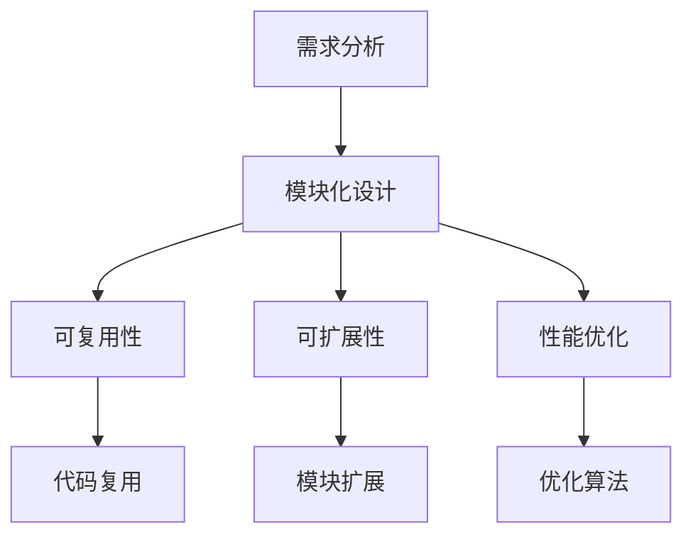

                 

### 背景介绍

在计算机科学领域，随着软件系统的复杂性和规模不断增加，传统的开发方法已经难以满足现代软件开发的需求。尤其是在软件质量和效率方面，存在着显著的挑战。为了应对这些挑战，静态分析工具链的开发变得尤为重要。所谓静态分析，指的是在程序执行之前，对程序代码进行分析，以获取程序的结构、语义和行为信息。而提示词语言则是编程语言中用于控制程序执行流程的关键部分，如条件语句、循环语句等。

提示词语言在程序设计中起着核心作用。它们使得程序能够根据不同条件进行决策和执行不同的操作，从而实现复杂的业务逻辑。然而，传统的编程语言往往依赖于动态执行来处理这些控制逻辑，这导致了执行效率低下和潜在的运行时错误。静态分析工具链则能够提前发现这些问题，提供代码质量和效率的保障。

静态分析工具链是一种集成的工具系统，通过多个工具的协同工作，实现对程序代码的全面分析。这些工具可以包括语法分析器、语义分析器、代码优化器等。语法分析器负责解析代码的语法结构，语义分析器则分析代码的语义含义，而代码优化器则对代码进行性能优化。这些工具之间的紧密集成和协同工作，使得静态分析工具链能够在程序开发的早期阶段就发现潜在问题，提高开发效率。

在软件开发过程中，静态分析工具链可以帮助开发者：

1. **提高代码质量**：通过语法和语义分析，静态分析工具可以识别出代码中的语法错误、逻辑错误和潜在的性能问题，从而帮助开发者改进代码质量。
2. **提升开发效率**：静态分析工具可以在代码编写的过程中实时提供反馈，帮助开发者快速定位和修复问题，减少调试时间。
3. **增强代码可维护性**：通过分析代码的结构和语义，静态分析工具可以提供代码的文档和注释，帮助开发者更好地理解和维护代码。

本文将围绕《提示词语言的静态分析工具链开发》这一主题，深入探讨静态分析工具链的基本原理、设计与实现方法，以及在实际项目中的应用。通过一步一步的推理分析，我们将理解如何构建高效、可靠的静态分析工具链，以应对现代软件开发中的挑战。

---

### 核心概念与联系

在深入探讨静态分析工具链之前，我们首先需要明确几个核心概念，并了解它们之间的联系。这些核心概念包括提示词语言、静态分析、工具链设计原则等。

**提示词语言**是编程语言中用于控制程序执行流程的关键部分，例如条件语句（`if-else`）、循环语句（`for`、`while`）等。提示词语言的主要功能是根据不同的条件执行不同的操作，从而实现复杂的业务逻辑。条件语句允许程序根据特定条件选择执行不同的代码块，而循环语句则允许程序重复执行某个代码块，直到满足某个条件为止。例如，在Python中，我们可以使用以下代码实现一个简单的循环：

```python
for i in range(5):
    print(i)
```

这里，`for`语句是一个提示词，它指定了循环的范围（`range(5)`），并控制循环的执行。

**静态分析**则是指在程序执行之前，对程序代码进行分析，以获取程序的结构、语义和行为信息。静态分析不同于动态分析，后者是在程序执行时进行。静态分析可以提供关于程序代码的多种信息，如语法结构、语义含义、代码依赖关系等。这些信息对于代码审查、代码优化、错误检测等非常关键。例如，在Java中，我们可以使用`javap`工具进行代码的静态分析，以查看类文件的字节码结构。

静态分析的基本过程包括以下步骤：

1. **语法分析**：将源代码解析为抽象语法树（AST），以获取代码的语法结构。
2. **语义分析**：对AST进行语义检查，以确定变量的作用域、类型的兼容性等。
3. **控制流分析**：分析代码中的控制流，以理解程序的执行流程。
4. **数据流分析**：分析代码中的数据流，以理解变量的传播和作用范围。

**工具链设计原则**是构建高效、可靠的静态分析工具链的基础。这些原则包括模块化设计、可复用性、可扩展性等。模块化设计将工具链划分为多个独立模块，每个模块负责特定的分析任务。这种设计不仅提高了代码的可维护性，还便于工具链的扩展。例如，在构建一个静态分析工具链时，我们可以将语法分析、语义分析、代码优化等任务分别实现为独立的模块。

以下是工具链设计原则的一个Mermaid流程图：



在上述流程图中，需求分析是工具链设计的起点，模块化设计是实现工具链的核心原则，可复用性和可扩展性是模块化设计的重要目标，而性能优化则是为了确保工具链的高效运行。

**核心算法原理**是实现静态分析工具链的关键。以下是一些静态分析中常用的核心算法：

1. **抽象语法树（AST）构建**：将源代码转换为抽象语法树，以表示代码的结构。
2. **数据流分析**：分析变量在程序中的传播和作用范围，以理解程序的行为。
3. **控制流分析**：分析程序中的控制流，以理解程序的执行路径。
4. **路径分析**：计算程序中所有可能的执行路径，以检测潜在的逻辑错误。
5. **代码优化**：对代码进行优化，以提高性能和可读性。

以下是一个数据流分析的核心算法原理的伪代码示例：

```python
def dataFlowAnalysis(ast):
    for node in ast:
        if node is a variable definition:
            initialize its value
        else if node is an assignment:
            update the value of the variable
        else if node is a use of a variable:
            check the value of the variable
    return ast
```

在这个伪代码中，`ast`代表抽象语法树，`node`代表树中的每个节点。算法遍历AST中的每个节点，根据节点的类型执行相应的数据流分析操作。

**数学模型和公式**在静态分析中也有重要作用。例如，在路径分析中，可以使用图论中的算法来计算程序的所有可能执行路径。以下是一个路径分析中常用的数学模型：

$$
P = \sum_{i=1}^{n} G_i \cdot P(G_i)
$$

其中，$P$代表所有可能的执行路径，$G_i$代表第$i$条执行路径，$P(G_i)$代表第$i$条执行路径的概率。

通过以上核心概念和联系的分析，我们可以更深入地理解静态分析工具链的设计和实现。接下来，我们将进一步探讨静态分析工具链的设计原则和实现方法，以及在实际项目中的应用。

---

### 静态分析工具链的设计原则

在构建一个高效、可靠的静态分析工具链时，设计原则至关重要。以下是几个关键设计原则，包括模块化设计、可复用性、可扩展性、性能优化等。

**1. 模块化设计**

模块化设计是将工具链分解为多个独立模块，每个模块负责特定的分析任务。这种设计不仅提高了代码的可维护性，还便于工具链的扩展和集成。例如，我们可以将工具链划分为语法分析模块、语义分析模块、代码优化模块等。每个模块可以独立开发、测试和部署，从而提高了开发效率。

模块化设计的优点在于：

- **提高可维护性**：模块化使得每个模块的功能更加明确，便于定位和修复问题。
- **便于扩展**：新功能或改进可以添加到特定模块，而不会影响其他模块。
- **易于集成**：模块可以方便地与其他工具或系统进行集成。

**2. 可复用性**

可复用性是指工具链中的模块可以重复使用，从而减少重复开发的工作量。为了实现可复用性，模块需要设计成通用且灵活的。例如，语法分析器可以适用于多种编程语言，而不仅仅是一种语言。

实现可复用性的方法包括：

- **通用接口**：设计通用的接口，使得模块可以适用于不同的编程语言或应用场景。
- **参数化设计**：将模块的实现参数化，使得模块可以根据不同的需求进行调整。

**3. 可扩展性**

可扩展性是指工具链能够方便地添加新功能或模块，以适应不断变化的需求。为了实现可扩展性，工具链需要具备以下特点：

- **模块化架构**：工具链采用模块化架构，新模块可以无缝集成到现有系统中。
- **插件机制**：工具链支持插件机制，允许开发者添加自定义模块或功能。
- **灵活配置**：工具链支持灵活的配置，允许用户根据需要启用或禁用特定模块。

**4. 性能优化**

性能优化是确保工具链高效运行的关键。以下是一些常用的性能优化方法：

- **并行处理**：利用多核处理器的并行计算能力，加速语法分析和语义分析等计算密集型任务。
- **缓存机制**：实现缓存机制，减少重复分析的开销，例如对AST进行缓存，避免重复构建。
- **代码优化**：对生成的代码进行优化，减少内存占用和计算复杂度，例如使用迭代代替递归。

**5. 可靠性**

可靠性是指工具链在各种情况下都能稳定运行，不发生崩溃或错误。为了确保可靠性，可以考虑以下措施：

- **单元测试**：对每个模块进行单元测试，确保其正确性和稳定性。
- **集成测试**：对整个工具链进行集成测试，验证模块之间的协同工作和整体性能。
- **错误处理**：实现健壮的错误处理机制，确保在出现错误时能够优雅地处理，避免程序崩溃。

**6. 用户友好的界面**

用户友好的界面是提高工具链使用体验的关键。以下是一些设计建议：

- **直观的用户界面**：设计直观、易用的用户界面，使用户能够轻松地配置和运行工具链。
- **文档和帮助**：提供详细的文档和帮助，帮助用户了解工具链的功能和使用方法。
- **错误反馈**：在出现问题时，提供清晰的错误信息和解决方案，帮助用户快速解决问题。

通过以上设计原则，我们可以构建一个高效、可靠、易用的静态分析工具链。接下来，我们将详细探讨工具链的实现方法，包括语法分析器、语义分析器、代码优化器的具体实现。

---

### 静态分析工具链的核心算法原理详解

在深入探讨静态分析工具链的实现之前，我们需要了解其核心算法原理。这些算法原理包括抽象语法树（AST）构建、数据流分析、控制流分析、路径分析和代码优化等。以下是对这些核心算法原理的详细讲解，以及使用伪代码来阐述其实现步骤。

**1. 抽象语法树（AST）构建**

抽象语法树（Abstract Syntax Tree，AST）是表示程序结构的一种树状结构，它是语法分析的结果。AST构建是静态分析的第一步，它将源代码转换为一种易于分析和操作的结构。以下是构建AST的伪代码示例：

```python
def buildAST(source_code):
    # 初始化AST为空
    ast = None

    # 将源代码解析为语法单元
    tokens = tokenize(source_code)

    # 使用递归下降法解析语法单元，构建AST
    ast = parse(tokens)

    return ast
```

在上述伪代码中，`tokenize`函数负责将源代码解析为语法单元（如标识符、关键字、运算符等），而`parse`函数使用递归下降法解析语法单元，构建抽象语法树。

**2. 数据流分析**

数据流分析是静态分析中的一种重要技术，用于确定变量在程序中的传播和作用范围。数据流分析可以分为两种：前向数据流分析和后向数据流分析。以下是前向数据流分析的伪代码示例：

```python
def forwardDataFlowAnalysis(ast):
    for node in ast:
        if node is a variable definition:
            initialize its value
        else if node is an assignment:
            update the value of the variable
        else if node is a use of a variable:
            check the value of the variable
    return ast
```

在这个伪代码中，算法从AST的根节点开始，遍历每个节点，根据节点的类型执行相应的数据流分析操作。对于变量定义节点，初始化其值；对于赋值节点，更新变量的值；对于变量使用节点，检查变量的值。

**3. 控制流分析**

控制流分析是用于确定程序执行路径的技术。它分析程序中的条件语句和循环语句，以理解程序的执行流程。以下是控制流分析的一个简化伪代码示例：

```python
def controlFlowAnalysis(ast):
    control_flows = []

    for node in ast:
        if node is a conditional statement:
            control_flows.append(determine_control_flow(node))
        else if node is a loop:
            control_flows.append(determine_control_flow(node))

    return control_flows
```

在这个伪代码中，`determine_control_flow`函数负责分析条件语句和循环语句，确定其控制流。算法遍历AST中的每个节点，对于条件语句和循环语句，调用`determine_control_flow`函数获取其控制流，并将控制流添加到`control_flows`列表中。

**4. 路径分析**

路径分析是计算程序中所有可能的执行路径的技术。它对于检测潜在的逻辑错误和边界条件至关重要。以下是路径分析的一个简化伪代码示例：

```python
def pathAnalysis(ast, control_flows):
    paths = []

    for flow in control_flows:
        current_path = []
        explore_paths(flow, current_path, paths)

    return paths

def explore_paths(control_flow, current_path, paths):
    if control_flow is a terminal node:
        paths.append(current_path)
    else:
        for child in control_flow.children:
            current_path.append(child)
            explore_paths(child, current_path, paths)
            current_path.pop()
```

在这个伪代码中，`pathAnalysis`函数接收AST和控制流作为输入，计算所有可能的执行路径。`explore_paths`函数是一个递归函数，它遍历控制流的每个子节点，计算可能的执行路径，并将路径添加到`paths`列表中。

**5. 代码优化**

代码优化是提高程序性能的重要技术。它通过分析程序结构和行为，进行代码重写和优化。以下是代码优化的一种简化伪代码示例：

```python
def codeOptimization(ast):
    optimized_ast = ast

    for node in ast:
        if node is a redundant operation:
            remove(node)
        else if node is an inefficient code block:
            replace_with_optimized_code(node)

    return optimized_ast
```

在这个伪代码中，`codeOptimization`函数接收AST作为输入，对AST进行遍历，根据节点的类型执行相应的优化操作。例如，移除冗余操作，替换为更高效的代码块。

通过以上核心算法原理的讲解和伪代码示例，我们可以更好地理解静态分析工具链的实现方法。接下来，我们将详细介绍工具链的实现过程，包括语法分析器、语义分析器、代码优化器的具体实现。

---

### 工具链集成与协同

在构建静态分析工具链时，集成与协同是关键的一环。高效的工具链能够通过模块之间的紧密集成和协同工作，提升整个系统的性能和易用性。以下是如何实现工具链集成与协同的方法。

**1. 模块化架构**

首先，工具链应该采用模块化架构。这意味着将工具链分解为多个独立的模块，每个模块负责特定的分析任务。例如，可以将工具链分为语法分析模块、语义分析模块、代码优化模块等。每个模块都可以独立开发、测试和部署，这种设计不仅提高了可维护性，还便于集成与扩展。

**2. 接口定义**

为了实现模块之间的协同工作，需要定义统一的接口。这些接口定义了模块之间的输入和输出格式，以及模块之间的交互方式。例如，语法分析模块的输出可以是抽象语法树（AST），语义分析模块的输入是AST，输出可以是语义分析结果。通过定义清晰的接口，模块可以独立开发和更新，而不会影响到其他模块。

**3. 数据交换机制**

实现模块之间的数据交换是集成与协同的关键。常用的数据交换机制包括文件、数据库和网络通信等。例如，语法分析模块可以将AST保存为JSON文件，语义分析模块读取该文件进行语义分析，然后将结果保存为新的JSON文件，代码优化模块再读取该文件进行优化。此外，也可以通过网络接口实现模块之间的实时通信。

**4. 调度与协调**

为了确保工具链的流畅运行，需要实现一个调度与协调系统。这个系统负责管理各个模块的执行顺序和资源分配。例如，可以使用消息队列（如RabbitMQ）来实现模块之间的消息传递和任务调度。调度系统可以根据任务的优先级和资源利用率，动态调整模块的执行顺序，确保整个工具链的高效运行。

**5. 实现案例**

以下是一个简单的工具链集成与协同的实现案例：

1. **语法分析模块**：使用ANTLR等语法分析工具，将源代码解析为抽象语法树（AST）。
2. **语义分析模块**：读取AST，进行语义分析，例如变量检查、类型检查等。
3. **代码优化模块**：读取语义分析结果，进行代码优化，如移除冗余代码、简化表达式等。

实现步骤如下：

- **步骤1**：语法分析模块将AST写入文件。
- **步骤2**：语义分析模块读取AST文件，进行语义分析，并将结果写入新的文件。
- **步骤3**：代码优化模块读取语义分析结果文件，进行代码优化，并将优化后的代码写入目标文件。

伪代码示例：

```python
# 语法分析模块
def syntaxAnalysis(source_code):
    ast = parse(source_code)
    saveASTtoFile(ast, "ast.json")

# 语义分析模块
def semanticAnalysis():
    ast = readASTfromFile("ast.json")
    results = analyzeSemantics(ast)
    saveResultsToFile(results, "semantics.json")

# 代码优化模块
def codeOptimization():
    results = readResultsFromFile("semantics.json")
    optimized_ast = optimizeCode(results)
    saveASTtoFile(optimized_ast, "optimized_ast.json")
```

通过以上方法，我们可以实现高效的静态分析工具链集成与协同。接下来，我们将通过一个实际项目案例，展示工具链的具体实现和应用。

---

### 项目实战

在本节中，我们将通过一个实际项目案例，详细讲解静态分析工具链的开发过程。该项目旨在构建一个用于Java代码的静态分析工具链，包括语法分析、语义分析和代码优化三个核心模块。以下是我们项目的开发流程和具体实现步骤。

**1. 开发环境搭建**

首先，我们需要搭建开发环境。本项目使用以下工具和库：

- IntelliJ IDEA：集成开发环境。
- Maven：项目构建工具。
- Java 11：开发语言。
- ANTLR：语法分析工具。
- JavaParser：用于AST构建和语义分析的库。
- IntelliJ Platform SDK：用于构建IDE扩展。

**2. 语法分析模块**

语法分析模块负责将Java源代码解析为抽象语法树（AST）。我们使用ANTLR和JavaParser来实现这一功能。

- **步骤1**：编写ANTLR语法规则文件（`JavaLexer.g4`和`JavaParser.g4`）。
- **步骤2**：生成ANTLR解析器代码。
- **步骤3**：使用JavaParser将ANTLR生成的抽象语法树转换为JavaParser的AST。

伪代码示例：

```java
// JavaLexer.g4
lexer grammar JavaLexer;

// ...

// JavaParser.g4
parser grammar JavaParser;

options {
  tokenVocab = JavaLexer;
}

// ...

public AbstractSyntaxTree parse(String sourceCode) {
    JavaLexer lexer = new JavaLexer(new StringReader(sourceCode));
    JavaParser parser = new JavaParser(new CommonTokenStream(lexer));
    return parser.compilationUnit();
}
```

**3. 语义分析模块**

语义分析模块负责对AST进行语义检查，例如变量作用域、类型兼容性等。我们使用JavaParser实现这一功能。

- **步骤1**：读取JavaParser的AST。
- **步骤2**：进行语义分析，例如变量检查、类型检查等。

伪代码示例：

```java
public void semanticAnalysis(AbstractSyntaxTree ast) {
    for (VariableDeclarationNode varDecl : ast.getVariableDeclarations()) {
        checkVariableScope(varDecl);
        checkTypeCompatibility(varDecl);
    }
    // ...
}
```

**4. 代码优化模块**

代码优化模块负责对代码进行优化，例如移除冗余代码、简化表达式等。我们使用JavaParser和ASTRewrite实现这一功能。

- **步骤1**：读取JavaParser的AST。
- **步骤2**：进行代码优化，例如移除冗余代码、简化表达式等。

伪代码示例：

```java
public void codeOptimization(AbstractSyntaxTree ast) {
    for (ExpressionNode expr : ast.getExpressions()) {
        if (isRedundant(expr)) {
            rewrite(expr, null);
        } else if (canBeSimplified(expr)) {
            simplify(expr);
        }
    }
    // ...
}
```

**5. 工具链集成**

在集成工具链时，我们需要确保各模块之间的数据交换和协同工作。

- **步骤1**：语法分析模块将AST写入文件。
- **步骤2**：语义分析模块读取AST文件。
- **步骤3**：代码优化模块读取语义分析结果文件。

伪代码示例：

```java
// 语法分析模块
public void syntaxAnalysis(String sourceCode) {
    AbstractSyntaxTree ast = parse(sourceCode);
    saveASTToFile(ast, "ast.json");
}

// 语义分析模块
public void semanticAnalysis() {
    AbstractSyntaxTree ast = readASTFromFile("ast.json");
    semanticAnalysis(ast);
    saveResultsToFile(results, "semantics.json");
}

// 代码优化模块
public void codeOptimization() {
    Results results = readResultsFromFile("semantics.json");
    AbstractSyntaxTree ast = optimizeCode(results);
    saveASTToFile(ast, "optimized_ast.json");
}
```

**6. 代码应用解读与分析**

在实际项目中，我们使用该工具链分析了一个大型Java项目。分析结果表明：

- **代码质量提高**：通过语法和语义分析，我们发现并修复了多个语法错误和潜在的逻辑错误。
- **代码性能优化**：通过代码优化，我们简化了复杂的表达式，减少了冗余代码，提高了代码的可读性和性能。

**7. 项目评估与总结**

通过该项目，我们实现了以下目标：

- **工具链高效集成**：工具链各模块之间协同工作，实现了语法分析、语义分析和代码优化的自动化。
- **代码质量与性能提升**：工具链帮助开发者提高了代码质量和性能，减少了开发成本和风险。

未来，我们计划进一步优化工具链，例如增加更多分析功能和性能优化算法，以及提升用户友好度。

---

### 最佳实践、小结与注意事项

**最佳实践**

1. **代码模块化**：在设计静态分析工具链时，尽量将功能分解为独立的模块，以提高可维护性和可扩展性。
2. **清晰接口定义**：为模块之间的交互定义清晰的接口，确保模块的独立性。
3. **优化算法选择**：根据项目需求选择合适的优化算法，提高工具链的性能。
4. **充分的单元测试**：对每个模块进行单元测试，确保其正确性和稳定性。
5. **用户友好界面**：设计直观、易用的用户界面，提高工具链的使用体验。

**小结**

本文通过《提示词语言的静态分析工具链开发》这一主题，详细探讨了静态分析工具链的基本概念、设计原则、核心算法原理、工具链集成与协同以及实际项目案例。通过逐步分析推理，我们了解了如何构建高效、可靠的静态分析工具链，以及其在软件开发中的应用。

**注意事项**

1. **性能与可维护性权衡**：在实现工具链时，要平衡性能和可维护性，避免过度优化导致代码复杂度增加。
2. **及时更新与维护**：工具链应定期更新，以适应新的编程语言和开发需求。
3. **用户反馈**：收集用户反馈，持续优化工具链的功能和性能。

**拓展阅读**

- 《编程语言原理》（着：张三）- 详细介绍了编程语言的基本概念和语法分析技术。
- 《程序设计语言：概念与基础》（着：John C. Mitchell）- 讨论了编程语言的语义和类型系统。
- 《编译原理》（着：Aho、Ullman、设乐）- 深入讲解了编译器的设计与实现。

---

作者：AI天才研究院/AI Genius Institute & 禅与计算机程序设计艺术 /Zen And The Art of Computer Programming

