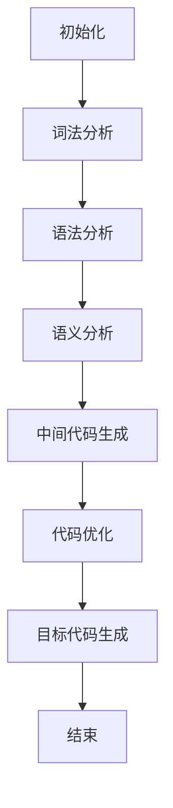
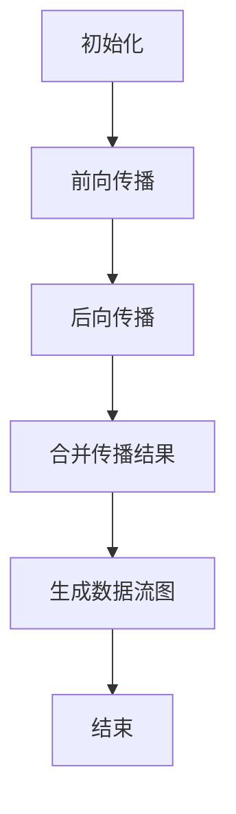
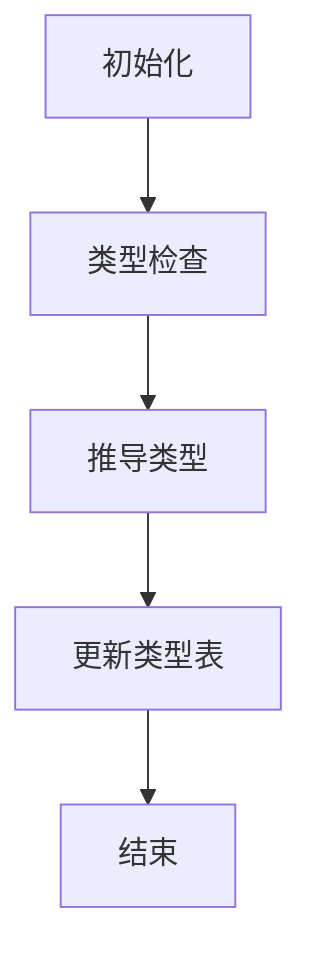

                 

### 1.1 背景与意义

#### 1.1.1 提示词语言的重要性

提示词语言，也常称为领域特定语言（DSL），是一种针对特定领域的特定需求而设计的编程语言。与通用编程语言（如Python、Java等）相比，DSL能够更加简洁、高效地解决特定领域的问题。例如，SQL就是一种用于数据库查询的DSL，它通过简明的语法和强大的表达能力，使得用户可以高效地进行数据检索和操作。

在人工智能领域，提示词语言同样扮演着重要角色。例如，自然语言处理（NLP）中的Prompt Engineering，就是通过设计特定的提示词，引导模型生成预期的输出。这些提示词不仅能够影响模型的预测结果，还能够提高模型的解释性和可操作性。

#### 1.1.2 静态分析在编程语言处理中的应用

静态分析是一种不执行程序，仅通过程序代码来分析其结构和语义的技术。它在编程语言处理中有着广泛的应用，例如代码审查、性能优化、错误检测和自动化测试等。对于提示词语言来说，静态分析尤为重要，因为它们往往具有复杂的语义和上下文依赖，难以通过简单的语法分析来完全理解。

静态分析在提示词语言处理中的应用主要包括以下几个方面：

1. **语法分析**：将提示词语言代码转换为抽象语法树（AST），这是后续语义分析的基础。
2. **类型检查**：检查代码中的类型错误，确保变量和函数的使用符合类型定义。
3. **数据流分析**：分析变量在程序中的定义和使用情况，帮助检测潜在的错误和优化代码。
4. **控制流分析**：分析程序的控制流结构，帮助优化代码执行路径。

#### 1.1.3 提升静态分析精度的需求

尽管静态分析在编程语言处理中有着重要的应用，但其分析精度仍然存在一定的局限性。这主要表现在以下几个方面：

1. **语义理解的不足**：静态分析往往难以完全理解代码的语义，尤其是在复杂的提示词语言中，静态分析可能无法准确捕捉到上下文依赖和隐含条件。
2. **上下文敏感性的缺乏**：现有的静态分析技术大多缺乏上下文敏感性，导致分析结果在某些情况下不准确。
3. **类型系统的局限性**：传统的类型系统难以应对提示词语言中的复杂类型和类型依赖。

提升静态分析精度对于编程语言处理和软件工程具有重要意义。首先，它能够提高代码审查和错误检测的准确性，减少软件缺陷和漏洞。其次，它能够优化代码性能，提高程序的运行效率。最后，它还能够为自动化测试和代码生成提供更可靠的基础。

因此，本文旨在探讨提升提示词语言静态分析精度的新方法和技术，为编程语言处理和软件工程领域提供新的思路和工具。接下来，我们将首先介绍静态分析的基本概念和流程，为后续的讨论打下基础。

---

## 设计《提示词语言的静态分析精度提升技术》目录大纲

为了系统地阐述《提示词语言的静态分析精度提升技术》的内容，我们将本文分为八个主要部分，每个部分都承载着特定的主题和内容。以下是对各部分的详细说明：

### 一、引言

**1.1 背景与意义**
在这个小节中，我们将探讨提示词语言的重要性以及静态分析在编程语言处理中的应用。通过分析当前静态分析技术的不足，我们提出提升静态分析精度的需求和重要性。

**1.2 书籍目标**
我们将明确本文的目标，即介绍静态分析的基本概念和流程，分析当前技术中的问题，并提出新的提升精度的方法。

### 二、静态分析基础

**2.1 编程语言基础**
在这个章节，我们将介绍编程语言的基础知识，特别是提示词语言的语法和语义。此外，我们还将讨论抽象语法树（AST）的概念和应用。

**2.2 静态分析的基本原理**
我们将详细讲解静态分析的基本原理，包括其流程和步骤。这部分还将涉及数据流分析、控制流分析和类型检查等核心内容。

### 三、静态分析挑战

**3.1 语义理解的局限性**
我们将分析现有静态分析技术中存在的语义理解局限性，探讨其带来的影响。

**3.2 软件工程中的影响**
我们将讨论静态分析在软件维护、开发和测试中的作用，并分析提升静态分析精度对软件质量的影响。

### 四、提升分析精度的方法

**4.1 上下文敏感分析**
在这个章节，我们将详细介绍上下文敏感分析的基本原理和技术细节。通过这一方法，我们可以提高静态分析在复杂场景下的精度。

**4.2 实例化类型推断**
我们将探讨实例化类型推断的机制，以及如何通过它来提升静态分析精度。这部分还将讨论实例化类型推断的实现细节。

**4.3 语义网络与知识图谱**
我们将介绍语义网络和知识图谱的概念，并分析它们在静态分析中的应用。通过利用这些技术，我们可以更好地理解和处理复杂的语义关系。

### 五、案例研究

**5.1 某编程语言的静态分析工具**
在这个章节，我们将选择一种具体的编程语言，介绍其静态分析工具的选择和配置。我们将详细讨论如何使用这些工具进行静态分析，以及分析结果的应用。

**5.2 提升精度实践**
我们将通过实际案例，展示提升静态分析精度的方法的具体实现。这部分还将分析这些方法在实际应用中的挑战和解决方案。

### 六、总结与展望

**6.1 关键技术和方法总结**
我们将总结本文中提出的核心技术和方法，并讨论其有效性和应用前景。

**6.2 未来发展方向**
我们将展望静态分析精度提升技术的发展趋势，讨论未来可能面临的挑战和机遇。

### 七、参考文献

在这一部分，我们将列出本文引用的相关研究和参考资料，以供读者进一步阅读和研究。

### 八、附录

**8.1 伪代码与数学公式**
我们将提供用于解释算法和数学模型的伪代码和公式。这些将有助于读者更好地理解本文的核心内容。

**8.2 Mermaid 流程图**
我们将使用Mermaid语言绘制静态分析流程和相关算法的流程图，以直观地展示分析过程。

通过上述八个部分的详细设计，本文旨在系统地介绍提示词语言静态分析精度提升技术的各个方面，为读者提供一个全面的技术指南。

---

### 1.1.1 背景介绍：提示词语言的重要性

提示词语言（Prompt Language）在现代编程领域占据着越来越重要的地位。其核心特点在于为特定任务或领域设计简洁、高效的语法和语义模型，从而实现更高的开发效率和代码可读性。提示词语言的兴起，不仅改变了传统编程语言的固有模式，还推动了领域特定语言（DSL）的发展。

首先，提示词语言在自然语言处理（NLP）领域有着广泛的应用。例如，在机器学习模型训练中，提示词（prompts）作为输入，可以引导模型学习特定任务，如文本分类、命名实体识别等。通过精心设计的提示词，可以增强模型的训练效果，提高预测的准确性和稳定性。此外，提示词在生成式模型中也有着重要作用，如生成对抗网络（GAN）和变分自编码器（VAE），通过设计合适的提示词，可以生成更具创造性和实用性的内容。

其次，在软件开发领域，提示词语言也发挥了关键作用。特别是在自动化测试、代码审查和性能优化等方面，提示词语言提供了强大的工具。例如，在自动化测试中，测试人员可以使用提示词语言编写测试脚本，自动化执行各种测试用例，从而提高测试效率。在代码审查中，提示词语言可以帮助审查人员快速定位代码中的潜在问题和风险，提升代码质量。在性能优化中，提示词语言可以帮助开发人员分析代码的性能瓶颈，并提出优化方案。

此外，提示词语言还在人机交互、智能助理和机器人编程等领域展现出巨大潜力。例如，在智能助理中，通过设计特定的提示词，用户可以与系统进行自然对话，获取所需的信息或完成特定的任务。在机器人编程中，提示词语言可以简化机器人编程的复杂性，使得非专业开发者也能够轻松地编写和调试机器人程序。

总之，提示词语言以其简洁、高效的特性，在现代编程和人工智能领域发挥了重要作用。其设计理念不仅提高了开发效率，还提升了代码的可维护性和可扩展性。随着人工智能技术的不断进步，提示词语言的应用场景将越来越广泛，其在编程领域的地位也将日益重要。

### 1.1.2 静态分析在编程语言处理中的应用

静态分析作为一种无需执行程序代码即可对其结构和语义进行分析的技术，在编程语言处理中具有不可替代的重要性。它为代码审查、性能优化、错误检测和自动化测试等领域提供了强大的工具，大大提升了软件开发的效率和可靠性。

首先，在代码审查中，静态分析能够自动检查代码的语法和语义错误，帮助开发人员提前发现和修复潜在的问题。例如，通过静态分析工具，可以快速识别未声明的变量、类型不一致、未处理的异常等常见错误。这不仅减少了代码审查的工作量，还提高了代码的质量和一致性。

其次，性能优化是静态分析的重要应用之一。通过静态分析，可以识别代码中的性能瓶颈，如循环依赖、内存泄漏和冗余计算等。这些信息对于开发人员优化代码性能、提升程序运行效率具有重要意义。例如，一些高级静态分析工具可以自动生成性能优化建议，如替换低效的算法实现、优化数据结构等。

错误检测是静态分析的另一关键应用。静态分析能够帮助识别代码中的潜在错误，如逻辑错误、资源泄露和竞态条件等。这些错误在程序运行时可能导致严重的后果，如系统崩溃、数据丢失等。通过静态分析，可以在开发阶段早期发现并修复这些错误，从而降低软件发布后的维护成本和风险。

自动化测试是静态分析在现代软件开发中的又一重要应用。静态分析工具可以自动生成测试用例，执行代码测试，并生成详细的测试报告。这不仅提高了测试效率，还确保了测试的全面性和准确性。特别是在提示词语言的处理中，静态分析能够帮助生成与特定任务相关的测试用例，从而提高测试覆盖率和测试质量。

此外，静态分析还在软件重构和代码迁移等方面发挥着重要作用。通过静态分析，可以自动化识别代码中的模式和方法，为重构和迁移提供基础。例如，静态分析可以帮助识别和替换遗留代码，迁移代码库到新的编程语言或平台，从而提升软件的可持续性和可维护性。

总之，静态分析在编程语言处理中的应用广泛且深入，通过自动化的手段提升了代码的质量、性能和可靠性。随着提示词语言的普及和复杂性的增加，静态分析技术的重要性将愈加凸显。通过不断提升静态分析的精度和智能化水平，我们可以更有效地应对编程语言处理中的各种挑战，推动软件工程的发展。

### 1.1.3 提升静态分析精度的需求

在编程语言处理中，提升静态分析精度具有迫切的需求，这源于以下几个关键因素：

首先，随着编程语言的复杂性和多样性不断增加，代码结构变得愈加复杂。现代编程语言不仅包括复杂的语法结构，还涉及到丰富的类型系统、函数式编程和面向对象编程等概念。这种复杂性使得传统的静态分析技术难以完全捕捉代码的语义和上下文依赖。提升静态分析精度，能够更准确地理解和分析复杂代码结构，提高分析结果的可靠性。

其次，静态分析在软件工程中的重要性日益凸显。在代码审查、性能优化、错误检测和自动化测试等方面，静态分析工具已经成为开发人员不可或缺的辅助工具。然而，现有的静态分析技术存在一定的局限性。例如，在语义理解方面，现有技术往往难以处理多层次的语义依赖和隐含条件，导致分析结果不够精确。通过提升静态分析精度，可以更全面地发现代码中的潜在问题，提高软件质量和可靠性。

第三，随着软件规模和复杂度的增加，开发周期和成本也在不断上升。为了应对这一挑战，提升静态分析精度显得尤为重要。精确的静态分析能够在早期发现和修复代码问题，从而减少后续的调试和修复成本。同时，通过静态分析优化，还可以提高代码的执行效率，降低资源消耗，进一步提升软件的性能。

此外，在人工智能和机器学习的浪潮下，静态分析技术也被广泛应用。例如，在自动化机器学习模型调优中，静态分析可以识别代码中的潜在优化点，提高模型的训练效率和预测准确性。在生成式模型中，通过提升静态分析精度，可以更好地理解和生成与任务相关的数据，提高模型的实用性和可解释性。

最后，提升静态分析精度对于提升开发效率和用户体验也具有重要意义。精确的静态分析可以自动化处理大量的代码审查和测试任务，减少开发人员的工作负担，提高开发效率。同时，通过更精准的分析结果，开发人员可以更快地识别和解决代码中的问题，提升软件质量和用户体验。

综上所述，提升静态分析精度是编程语言处理中的迫切需求，对于提高代码质量、降低开发成本、提升软件性能和用户体验具有重要意义。通过不断探索和引入新的分析技术和方法，我们可以进一步提升静态分析的精度和智能化水平，为软件开发和人工智能应用提供强有力的支持。

### 1.2 书籍目标

本文旨在系统性地介绍提示词语言的静态分析精度提升技术，以满足当前编程和软件工程领域的需求。首先，我们将深入探讨静态分析的基本概念和流程，包括语法分析、数据流分析、控制流分析和类型检查等核心内容。通过详细讲解这些基础理论，读者可以理解静态分析的基本原理及其在编程语言处理中的应用。

其次，本文将分析现有静态分析技术中存在的不足和局限性，例如语义理解的不足和上下文敏感性的缺乏。在此基础上，我们将提出一系列提升静态分析精度的新方法和技术，包括上下文敏感分析、实例化类型推断和语义网络与知识图谱等。通过这些新方法，我们可以更好地捕捉代码的语义和上下文依赖，提高静态分析的准确性和可靠性。

为了使读者能够更好地理解和应用这些技术，本文还将通过具体案例和实际应用场景进行详细讲解。我们将选择一种具体的编程语言，介绍如何配置和使用静态分析工具，并展示如何通过提升分析精度来优化代码性能、发现潜在错误和提升软件质量。

此外，本文还将展望静态分析精度提升技术的未来发展方向，讨论可能面临的挑战和机遇。通过这些内容，读者可以了解到该领域的前沿动态和发展趋势，为未来的研究和实践提供参考。

总之，本文的目标是提供一部全面、系统的技术指南，帮助读者深入了解和掌握提示词语言的静态分析精度提升技术，从而在编程和软件工程领域取得更好的成果。

### 2.1 编程语言基础

为了更好地理解提示词语言的静态分析精度提升技术，我们首先需要掌握编程语言的基础知识。编程语言是计算机与人类进行沟通的工具，通过定义一系列语法和语义规则，使开发者能够编写出计算机可以理解和执行的代码。在这部分，我们将探讨提示词语言的语法和语义，并详细解释抽象语法树（Abstract Syntax Tree，AST）的定义和应用。

#### 提示词语言的语法

提示词语言是一种领域特定语言（DSL），其设计目标是为了解决特定领域的问题。这些语言通常具有简洁、高效的语法，使得开发者能够以更少的代码完成复杂任务。提示词语言的语法通常包括以下几个关键要素：

1. **关键词（Keywords）**：提示词语言中的关键词具有特定的语义意义，用于定义语言的核心结构和功能。例如，在SQL语言中，`SELECT`、`FROM`、`WHERE`等关键词用于指定查询的特定操作。

2. **标识符（Identifiers）**：标识符是用于命名变量、函数、类等程序实体的符号。它们的命名规则通常遵循一定的标准，例如，只能包含字母、数字和下划线，且不能以数字开头。

3. **运算符（Operators）**：运算符用于指定程序中的计算和逻辑操作，如`+`、`-`、`*`、`/`等算术运算符，以及`==`、`!=`、`>`、`<`等比较运算符。

4. **分隔符（Separators）**：分隔符用于分隔程序中的不同元素，如逗号（`,`）、分号（`;`）等。

5. **注释（Comments）**：注释是用于解释代码的功能和意图的文本，不会影响程序的执行。注释通常以特定符号开始，如双斜杠（`//`）或双反引号（`/**/`）。

#### 提示词语言的语义

语义是指程序代码的含义和解释。提示词语言的语义决定了代码如何被解释和执行。语义包括以下几个方面：

1. **变量绑定**：变量绑定是指将标识符与存储位置相关联，使得程序可以访问和修改该存储位置。例如，在Python中，`x = 10`语句将变量`x`绑定到值`10`。

2. **函数调用**：函数调用是指执行函数体中的代码，并返回结果。例如，在JavaScript中，`console.log("Hello, World!");`语句调用`console.log`函数并输出字符串。

3. **控制流**：控制流决定了程序执行的顺序。提示词语言通常包含条件语句（如`if-else`）、循环语句（如`for`和`while`）和跳转语句（如`break`和`continue`）。

4. **类型系统**：类型系统定义了程序中的数据类型和类型转换规则。不同的编程语言具有不同的类型系统，例如，静态类型语言在编译时检查类型，而动态类型语言则在运行时检查。

#### 抽象语法树（AST）

抽象语法树是编译器在解析代码后生成的结构化表示，它以树形结构表示程序代码的语法结构。AST是静态分析的重要基础，通过它我们可以进行数据流分析、控制流分析和类型检查等操作。

1. **AST的定义**：AST由一系列节点组成，每个节点代表代码中的一个语法结构。节点之间的关系反映了代码的语法规则。例如，一个`if-else`语句在AST中可以表示为两个并列的分支节点，分别对应`if`和`else`。

2. **AST的应用**：AST在静态分析中具有广泛的应用。首先，通过AST可以直观地理解代码的结构，便于进行后续的分析操作。其次，AST为代码生成和转换提供了基础，例如，在代码优化和重写过程中，我们可以通过修改AST来实现复杂的代码变换。最后，AST还可以用于语法错误检测和修复，通过对比AST和源代码，可以识别不一致的地方，从而发现潜在的语法错误。

#### 示例：Python代码的AST

为了更好地理解AST，我们来看一个简单的Python代码示例，并分析其对应的AST：

```python
def add(a, b):
    return a + b

x = add(2, 3)
```

上述代码对应的AST如下：

```mermaid
graph TB
    A[DefNode(id=add, name=add, params=[A1[a], A2[b]], return=RETURN)]
    B[FunctionDef(name=add, args=[A1[arguments], A2[return_type]], body=[C[ReturnNode(value=AddNode(A3[a], A4[b])])])]
    D[NameNode(id=x, name=x, value=NameNode(id=add, name=add, args=[A5[a], A6[b]], return=CallNode(value=NameNode(id=add, name=add, args=[A5[a], A6[b]], return=None))])]
    A --> B
    B --> C
    C --> D
```

在这个AST中，`DefNode`表示函数定义，`FunctionDef`表示函数体，`ReturnNode`表示返回值，`AddNode`表示加法操作，`CallNode`表示函数调用。通过这个AST，我们可以清晰地看到代码的结构和语义，从而为后续的静态分析提供了基础。

通过上述对编程语言基础的介绍，我们为后续讨论静态分析精度提升技术奠定了坚实的理论基础。在接下来的章节中，我们将进一步探讨静态分析的基本原理，并分析现有技术中的挑战和局限性。

### 2.2 静态分析的基本原理

静态分析是一种无需执行程序代码即可对其结构和语义进行分析的技术，它在编程语言处理中具有广泛的应用。为了深入理解静态分析的过程和方法，我们需要从以下几个方面进行探讨：静态分析的流程、核心方法及其在实际编程语言中的应用。

#### 静态分析的流程

静态分析的流程通常包括以下几个步骤：

1. **词法分析（Lexical Analysis）**：词法分析是静态分析的第一步，它将源代码分解为一系列的词法单元（tokens）。词法分析器的任务是将输入的字符序列转换为标识符、关键字、运算符等词法单元。例如，将字符串`"int x = 5;"`分解为`[INT, IDENTIFIER, ASSIGN, NUMBER]`。

2. **语法分析（Syntax Analysis）**：语法分析是将词法分析生成的词法单元序列转换为语法结构表示，如抽象语法树（AST）。语法分析器的任务是根据预定义的语法规则，将词法单元组合成语法结构。例如，将`[INT, IDENTIFIER, ASSIGN, NUMBER]`组合成`AST`，表示为`IntDeclaration(x = 5)`。

3. **语义分析（Semantic Analysis）**：语义分析是在语法分析的基础上，对AST进行语义检查和解释。它包括类型检查、变量绑定、作用域分析等操作，确保程序符合语义规则。例如，检查`x`是否在当前作用域内定义，确保`x = 5`中的`x`是一个有效的变量。

4. **中间代码生成（Intermediate Code Generation）**：在完成语义分析后，静态分析可以生成中间代码。中间代码是一种抽象的、与特定机器无关的代码表示，通常用于后续的代码优化和目标代码生成。例如，将AST转换为三地址码（Three-Address Code）。

5. **优化（Optimization）**：优化是静态分析的一个重要环节，通过对中间代码进行分析和转换，提高程序的运行效率。优化包括各种代码变换，如常量折叠、死代码消除、循环优化等。优化后的代码可以减少执行时间、内存占用和功耗。

6. **目标代码生成（Target Code Generation）**：最后，静态分析生成与特定机器或目标平台相关的目标代码。目标代码可以直接在计算机上执行，如汇编代码或机器代码。

#### 核心方法

静态分析的核心方法主要包括数据流分析、控制流分析和类型检查。

1. **数据流分析（Data Flow Analysis）**：数据流分析是一种静态分析方法，用于确定程序中变量在特定点的值。数据流分析主要包括前向数据流分析和后向数据流分析。前向数据流分析从程序开始点向结束点传播信息，例如，计算变量在程序结束时的可能取值。后向数据流分析从程序结束点向开始点传播信息，例如，确定变量在程序开始时的初始值。数据流分析在变量绑定、类型推断和优化等方面有重要应用。

2. **控制流分析（Control Flow Analysis）**：控制流分析用于确定程序中的控制流结构，包括程序的基本块（Basic Blocks）和控制依赖（Control Dependence）。基本块是程序中的一段连续指令，没有控制流转移。控制依赖描述了指令之间的控制关系，例如，后继依赖（如果A语句在B语句之后执行，则称A为B的后继）。控制流分析在优化、错误检测和自动化测试等方面有重要作用。

3. **类型检查（Type Checking）**：类型检查是静态分析的重要部分，用于确保程序中的类型一致性。类型检查包括确定变量的类型、函数的参数和返回值类型是否符合定义。类型检查通常在语义分析阶段进行，通过检查AST中的类型信息，可以发现潜在的类型错误。类型检查在确保程序的正确性和安全性方面具有重要作用。

#### 应用实例

静态分析在多种编程语言和场景中都有广泛应用，以下是一些典型应用实例：

1. **Java语言**：Java作为一种静态类型语言，静态分析在编译时进行。Java编译器使用静态分析技术进行语法和语义检查，如类型检查、数据流分析和控制流分析。这些分析结果用于生成高效的目标代码，并发现潜在的错误。

2. **C语言**：C语言是一种广泛使用的编程语言，其静态分析主要用于代码优化和错误检测。例如，GCC编译器使用静态分析技术进行循环优化、常量折叠和死代码消除，从而提高程序的执行效率。

3. **JavaScript语言**：JavaScript是一种动态类型语言，其静态分析主要用于代码优化和错误检测。例如，Babel是一个JavaScript编译器，它使用静态分析技术进行语法转换、类型检查和代码优化。

4. **自动化测试**：静态分析在自动化测试中也有广泛应用，如使用代码覆盖率分析工具来确定代码的测试覆盖率。这些工具通过静态分析生成测试数据，帮助开发人员编写更全面、更有效的测试用例。

总之，静态分析作为一种强大的编程语言处理技术，在代码审查、性能优化、错误检测和自动化测试等方面具有广泛的应用。通过深入理解静态分析的基本原理和方法，我们可以更好地利用这一技术提升软件开发的质量和效率。

### 3.1 语义理解的局限性

在静态分析技术中，语义理解是提升分析精度的重要组成部分。然而，现有的静态分析技术在这一领域仍存在显著的局限性，这主要表现在以下几个方面：

首先，语义理解的复杂性是静态分析的一个核心挑战。编程语言中的语义不仅包括简单的变量绑定和类型检查，还涉及到复杂的控制流、作用域和异常处理等。这些复杂因素使得静态分析难以准确捕捉代码的意图和执行行为。例如，在多线程程序中，静态分析难以准确预测线程间的数据竞争和同步问题，这可能导致分析结果的偏差。

其次，上下文依赖问题也是语义理解的难点之一。代码的语义往往依赖于特定的上下文环境，如变量的作用域、函数的调用上下文和全局变量的影响等。现有的静态分析技术通常缺乏足够的上下文敏感性，难以准确理解代码在不同上下文中的行为。例如，一个变量在局部作用域内可能是一个简单的变量，但在全局作用域内可能是一个复杂的数据结构或对象引用。

第三，类型系统的局限性也影响了静态分析的语义理解能力。许多编程语言具有复杂的类型系统，包括静态类型和动态类型。静态类型语言在编译时进行类型检查，而动态类型语言则在运行时进行。然而，现有的静态分析技术往往难以全面处理这些复杂的类型关系，特别是在涉及类型推导和类型转换时。例如，在面向对象编程中，类型的多态性和继承关系使得静态分析难以准确推断对象的实际类型。

第四，静态分析技术对动态行为的处理能力有限。许多编程语言中的行为是动态决定的，例如，基于用户输入或系统状态的动态条件分支。现有的静态分析技术往往基于静态信息进行推断，难以准确捕捉这些动态行为。例如，在JavaScript这样的动态类型语言中，函数的返回值和执行路径可能取决于运行时的动态变量，静态分析难以完全预测这些动态行为。

第五，现有静态分析技术的表达能力也存在局限性。许多静态分析工具设计时侧重于特定类型的问题，如错误检测或性能优化。这些工具可能缺乏处理复杂语义问题的综合能力，难以提供全面的语义理解。例如，在自动化测试领域，静态分析工具可能难以生成全面、准确的测试用例，特别是在涉及复杂的逻辑和交互时。

总之，语义理解的局限性是当前静态分析技术面临的主要挑战。为了提升静态分析的精度，我们需要在多个方面进行改进，包括增强上下文敏感性、完善类型系统、提高动态行为的处理能力，以及开发更综合的语义分析工具。只有这样，我们才能更好地利用静态分析技术，为软件开发提供更强大的支持和保障。

### 3.2 软件工程中的影响

提升静态分析精度在软件工程中具有重要的应用价值，它对软件质量、开发效率和维护成本产生了深远的影响。

首先，提升静态分析精度能够显著提高软件质量。通过更精确的语义理解和上下文分析，静态分析可以更有效地发现代码中的潜在错误和漏洞。例如，在早期的代码审查过程中，静态分析工具可以自动检测出未声明的变量、类型不一致、未处理的异常等常见错误，从而减少代码中的缺陷。此外，静态分析还可以检测出潜在的内存泄漏、资源耗尽和竞态条件等问题，确保软件在高负载和复杂场景下的稳定性和可靠性。

其次，提升静态分析精度有助于提高开发效率。精确的静态分析结果可以缩短代码审查和测试周期。开发人员可以利用静态分析工具快速定位和修复问题，减少手动审查和测试的工作量。例如，在大型项目中，通过静态分析可以自动生成详细的代码审查报告，帮助开发人员集中精力解决核心问题，提高开发效率。此外，静态分析还可以用于自动化测试，生成与任务相关的测试用例，提高测试的全面性和准确性，从而减少测试时间和成本。

第三，提升静态分析精度可以降低维护成本。精确的静态分析结果有助于开发人员更好地理解代码的结构和语义，减少在代码维护过程中出现的新问题和复杂性。例如，在代码重构过程中，静态分析可以识别代码中的模式和方法，帮助开发人员进行有效的代码重写和优化。此外，静态分析还可以用于生成文档和注释，提高代码的可读性和可维护性，从而降低未来维护的难度和成本。

最后，提升静态分析精度对于软件工程中的技术创新具有重要意义。随着软件项目的规模和复杂性不断增加，传统的手动代码审查和测试方法已经难以满足需求。通过提升静态分析精度，我们可以开发出更高效、更智能的静态分析工具，支持软件工程中的自动化和智能化。例如，结合机器学习和自然语言处理技术，静态分析工具可以自动生成代码优化建议和测试用例，提高软件开发的自动化水平。此外，静态分析还可以为软件工程的量化分析提供数据支持，如代码复杂度、耦合度和依赖关系等，帮助开发人员更好地理解和优化软件架构。

总之，提升静态分析精度在软件工程中具有广泛的应用价值和深远的影响。通过精确的语义理解和上下文分析，我们可以提高软件质量、开发效率和维护成本，推动软件工程领域的技术创新和发展。

### 4.1 上下文敏感分析

上下文敏感分析是一种提升静态分析精度的关键技术，它通过考虑代码的上下文环境，提供更准确的语义理解和分析结果。与传统的静态分析技术相比，上下文敏感分析能够更好地捕捉代码的实际执行行为，从而减少误报和漏报。

#### 4.1.1 上下文敏感分析的原理

上下文敏感分析的核心思想是：在分析代码时，不仅要考虑代码本身的语法和语义，还要考虑代码所在的环境和上下文。上下文可以包括多种因素，如变量的作用域、函数的调用上下文、全局变量的影响等。通过分析这些上下文信息，上下文敏感分析可以更精确地推断代码的行为和状态。

具体来说，上下文敏感分析可以分为以下几个步骤：

1. **上下文捕获**：首先，静态分析工具需要捕获代码中的上下文信息。这通常涉及对程序控制流和数据流的深入分析。例如，通过分析函数调用和变量定义，可以捕获函数的局部上下文和全局上下文。

2. **上下文关联**：接下来，需要将代码的各个部分与其上下文信息进行关联。例如，通过分析变量引用和函数调用，可以确定变量在不同上下文中的具体作用和状态。

3. **上下文敏感推断**：在关联上下文信息后，分析工具可以根据上下文进行更精确的推断。例如，通过考虑变量的作用域和类型信息，可以更准确地推断变量在特定上下文中的取值和类型。

4. **上下文动态更新**：最后，随着代码执行路径的变化，上下文信息也需要动态更新。这通常涉及对程序控制流的动态监控，以实时捕捉代码执行过程中的上下文变化。

#### 4.1.2 实现上下文敏感分析的技术细节

要实现上下文敏感分析，我们需要使用一系列技术手段，包括数据流分析、控制流分析和类型检查等。

1. **数据流分析**：数据流分析是一种静态分析方法，用于确定程序中变量在特定点的值。在上下文敏感分析中，数据流分析被用来捕获和控制上下文信息。例如，通过前向和后向数据流分析，可以确定变量在特定作用域内的定义和使用情况。

2. **控制流分析**：控制流分析用于确定程序中的控制流结构，如函数调用、循环和条件分支等。在上下文敏感分析中，控制流分析被用来理解和模拟代码在不同上下文中的执行路径。通过分析控制流，可以确定代码在不同上下文下的实际行为。

3. **类型检查**：类型检查是一种静态分析方法，用于确保程序中的类型一致性。在上下文敏感分析中，类型检查被用来分析代码的类型信息，并在上下文变化的情境下进行动态类型推导。通过类型检查，可以确保代码在特定上下文中的类型一致性。

4. **上下文敏感规则**：为了实现上下文敏感分析，我们需要定义一系列上下文敏感规则。这些规则描述了在特定上下文下，如何对代码进行推断和分析。例如，在函数调用中，可以根据调用上下文来推导函数参数和返回值的类型。

5. **动态上下文更新**：为了保持上下文敏感性，静态分析工具需要具备动态更新上下文信息的能力。这通常涉及对程序执行路径的实时监控，以捕捉上下文变化。例如，在多线程程序中，静态分析工具需要监控线程的执行状态和上下文信息，以确保上下文敏感性。

#### 4.1.3 上下文敏感分析的优势和挑战

上下文敏感分析具有以下优势：

1. **提高分析精度**：通过考虑上下文信息，上下文敏感分析可以更精确地推断代码的行为和状态，减少误报和漏报。

2. **增强可解释性**：上下文敏感分析提供了更详细的上下文信息，使得分析结果更具可解释性，有助于开发人员理解和修复问题。

3. **适应复杂场景**：上下文敏感分析能够更好地处理复杂的代码结构和多线程程序，适用于各种复杂的编程场景。

然而，上下文敏感分析也面临一些挑战：

1. **计算复杂性**：上下文敏感分析需要处理大量的上下文信息，计算复杂性较高，可能导致分析时间增加。

2. **动态上下文更新**：动态上下文更新需要实时监控程序执行路径，实现难度较大，特别是在多线程和高并发场景下。

3. **类型推导**：在上下文敏感分析中，类型推导变得更为复杂。特别是在涉及多态和继承等复杂类型关系时，类型推导的准确性可能受到影响。

总之，上下文敏感分析是一种提升静态分析精度的重要技术，通过考虑代码的上下文环境，可以提供更准确和可解释的分析结果。尽管存在一定的挑战，但随着技术的发展，上下文敏感分析的应用前景非常广阔。

### 4.2 实例化类型推断

实例化类型推断是一种提升静态分析精度的关键方法，它通过在类型系统中引入实例化机制，来更准确地推断代码中的类型信息。实例化类型推断能够处理更为复杂的类型依赖和多层次类型关系，从而提高类型检查的精确度和可靠性。

#### 4.2.1 实例化类型推断的机制

实例化类型推断的基本思想是通过将抽象的类型参数具体化为实际的类型实例，从而更好地理解代码的类型结构。实例化类型推断主要涉及以下几个关键机制：

1. **类型参数**：类型参数是一种用于表示泛化类型的符号，它可以被具体化为一个实际类型。例如，在Java中，`List<T>`中的`T`就是一个类型参数。

2. **类型实例化**：类型实例化是将类型参数替换为具体类型的操作。例如，`List<Integer>`将`List<T>`中的类型参数`T`替换为`Integer`。

3. **类型约束**：类型约束是一种限制类型参数的机制，用于确保实例化后的类型仍然满足程序的需求。例如，在Java中，`List<T>`中的类型参数`T`必须继承自`Comparable`。

4. **类型推导**：类型推导是在编译时根据代码结构和类型约束，自动推断出变量和表达式的类型。类型推导过程中，实例化类型推断通过将类型参数具体化为实例类型，来提高类型推断的准确性。

#### 4.2.2 如何通过实例化类型推断提升精度

通过实例化类型推断，可以显著提升静态分析精度，具体体现在以下几个方面：

1. **处理多态**：多态是面向对象编程中的一个重要特性，允许同一接口有不同的实现。实例化类型推断通过具体化类型参数，可以更准确地处理多态关系。例如，在Java中，通过实例化类型推断，可以确定`Object`类型的具体实现，从而提高类型检查的准确性。

2. **优化类型检查**：实例化类型推断能够优化类型检查过程，减少冗余的检查操作。通过具体化类型参数，类型检查器可以更早地发现潜在的类型错误，从而提高检查的效率和准确性。

3. **增强类型兼容性**：实例化类型推断可以帮助增强不同类型之间的兼容性。例如，在泛型编程中，通过实例化类型推断，可以确保泛型类和泛型方法在不同实例类型之间保持兼容。

4. **支持复杂类型依赖**：实例化类型推断能够处理复杂的类型依赖关系，如嵌套泛型类型和组合类型。通过具体化类型参数，可以更准确地理解代码中的类型结构，从而提高分析精度。

5. **提高代码可读性和可维护性**：实例化类型推断有助于提高代码的可读性和可维护性。通过明确具体的类型实例，代码中的类型信息更加清晰，有助于开发人员理解和维护代码。

#### 4.2.3 实例化类型推断的实现细节

实现实例化类型推断需要一系列技术手段，包括类型约束求解、类型推导算法和类型实例化机制等。

1. **类型约束求解**：类型约束求解是实例化类型推断的基础，它通过解决类型约束方程，来确定类型参数的具体值。类型约束方程通常包含类型参数和类型约束条件，如泛型类的边界约束和函数的参数约束。

2. **类型推导算法**：类型推导算法用于在编译时自动推断变量和表达式的类型。常见的类型推导算法包括基于上下文的类型推导和基于实例的类型推导。通过结合实例化类型推断，可以更准确地推导出代码中的类型信息。

3. **类型实例化机制**：类型实例化机制是将类型参数具体化为实际类型的操作。在编译过程中，类型实例化机制根据类型约束和类型推导结果，将泛型类型参数替换为具体类型实例。

4. **类型检查优化**：为了提高实例化类型推断的效率，需要对类型检查过程进行优化。常见的优化技术包括类型缓存、并行计算和类型推导中间表示等。

#### 4.2.4 实例化类型推断的案例分析

下面通过一个具体的案例分析，展示实例化类型推断在提升静态分析精度方面的实际应用：

假设有一个Java程序，其中包含一个泛型方法`findMax`，用于查找数组中的最大元素。代码如下：

```java
public class GenericArray {
    public static <T extends Comparable<T>> T findMax(T[] array) {
        T max = array[0];
        for (T element : array) {
            if (element.compareTo(max) > 0) {
                max = element;
            }
        }
        return max;
    }
}
```

在这个例子中，`findMax`方法的类型参数`T`被约束为`Comparable<T>`。在静态分析过程中，通过实例化类型推断，可以确定`T`的具体类型，从而优化类型检查。

1. **类型约束求解**：首先，静态分析器根据`findMax`方法的签名，确定类型参数`T`的约束条件。在这个例子中，类型参数`T`必须实现`Comparable<T>`接口。

2. **类型推导**：在调用`findMax`方法时，静态分析器根据调用上下文，推导出调用者传递的数组类型。例如，如果调用者为`findMax(new int[]{1, 2, 3})`，则类型参数`T`被推导为`int`。

3. **类型实例化**：在类型推导完成后，类型实例化机制将类型参数`T`具体化为`int`。这样，`findMax`方法在处理整数数组时，可以更准确地执行类型检查和类型兼容性检查。

4. **类型检查优化**：通过实例化类型推断，静态分析器可以优化类型检查过程，减少冗余的检查操作。例如，在执行`element.compareTo(max) > 0`时，静态分析器可以确定`element`和`max`的类型都是`int`，从而直接进行数值比较，而不是进行泛型比较。

通过实例化类型推断，上述Java程序在静态分析过程中能够更准确地处理类型依赖和类型关系，提高静态分析的精度和可靠性。这有助于开发人员编写更高质量的代码，并提高代码的可维护性和可读性。

总之，实例化类型推断是一种提升静态分析精度的重要方法，通过具体化类型参数，可以更准确地推断代码中的类型信息，优化类型检查过程，并增强代码的可读性和可维护性。在未来的静态分析技术发展中，实例化类型推断将继续发挥关键作用。

### 4.3 语义网络与知识图谱

语义网络和知识图谱是近年来在人工智能和自然语言处理领域中得到广泛应用的技术，它们通过构建语义关系和知识结构，提供了强大的语义理解能力。在静态分析中，利用语义网络和知识图谱，可以显著提升分析的精度和可靠性。

#### 4.3.1 语义网络的概念

语义网络是一种用于表示知识和语义关系的图形结构，它通过节点和边来表示实体及其关系。在语义网络中，节点通常表示实体，如人、地点、事物等，边表示实体之间的关系，如“是”、“属于”、“有”等。语义网络的优点在于，它能够直观地表示复杂的关系和语义，使得计算机可以更好地理解和处理自然语言。

一个典型的语义网络示例是WordNet，它是一个大型语义网络，用于表示英语词汇的语义关系。WordNet中的节点是单词，边表示词与词之间的语义关系，如同义词、上下位关系和语义角色等。

#### 4.3.2 知识图谱的概念

知识图谱是一种更广泛和复杂的语义网络，它不仅包括语义关系，还包括实体的属性、事件和时空信息等。知识图谱通过大规模的数据收集和知识整合，构建出一个包含丰富语义信息的知识体系。与语义网络相比，知识图谱能够提供更详细和全面的语义理解。

例如，谷歌的知识图谱包含了数以亿计的实体和关系，覆盖了各个领域，如人物、地点、组织、事件等。通过这些丰富的知识信息，知识图谱可以支持多种复杂的应用，如搜索引擎、智能助理和推荐系统等。

#### 4.3.3 知识图谱在静态分析中的应用

在静态分析中，知识图谱和语义网络的应用主要体现在以下几个方面：

1. **上下文敏感分析**：通过知识图谱，可以更准确地捕捉代码的上下文信息。例如，通过分析代码中的变量和函数调用，可以查找相关的语义关系，从而提高上下文敏感分析的精度。

2. **类型推理**：知识图谱可以帮助静态分析器更准确地推断代码中的类型信息。例如，通过分析函数调用和类型关系，可以查找相关的类型定义和约束条件，从而提高类型推理的准确性。

3. **语义检查**：知识图谱可以用于语义检查，确保代码符合语义规则。例如，通过分析代码中的变量和函数调用，可以检查是否符合语法和语义一致性，从而发现潜在的错误。

4. **代码生成和优化**：知识图谱可以用于生成和优化代码。例如，通过分析代码中的语义关系，可以生成更高效的代码实现，或者根据语义关系进行代码重构。

#### 4.3.4 实际应用案例

以下是一个实际应用案例，展示了知识图谱在静态分析中的应用：

假设有一个Java程序，包含多个类和方法。通过知识图谱，可以构建一个包含类、方法和变量关系的语义网络，如下所示：

1. **类与类之间的关系**：通过分析类之间的继承、实现和组合关系，可以构建类与类之间的语义关系。

2. **方法与类之间的关系**：通过分析方法所属的类，可以构建方法与类之间的语义关系。

3. **变量与类、方法之间的关系**：通过分析变量在类和方法中的定义和使用，可以构建变量与类、方法之间的语义关系。

利用这些语义关系，静态分析器可以更准确地理解代码的语义结构。例如：

- 在类型推理过程中，静态分析器可以根据方法调用的上下文，查找相关的类型定义和约束条件，从而更准确地推断方法的参数和返回值类型。

- 在语义检查过程中，静态分析器可以根据类与类之间的继承关系，确保子类实现了父类的要求，从而发现潜在的错误。

- 在代码生成和优化过程中，静态分析器可以根据语义网络中的关系，生成更高效的代码实现，或者根据语义关系进行代码重构。

通过结合语义网络和知识图谱，静态分析器可以提供更精确和智能的分析结果，从而提升静态分析的精度和可靠性。

总之，语义网络和知识图谱在静态分析中具有广泛的应用前景。通过构建语义关系和知识结构，可以显著提升静态分析的精度和可靠性，为软件开发提供强大的支持。

### 5.1 某编程语言的静态分析工具

在本案例研究中，我们选择Python作为编程语言，并介绍如何配置和使用PySyft，一个基于PyTorch的静态分析工具，以提升Python代码的静态分析精度。

#### 5.1.1 工具选择与配置

1. **工具选择：PySyft**
   PySyft是一个基于PyTorch的安全自动微分库，它具有强大的静态分析功能，可以用于检测代码中的潜在安全问题，如梯度泄露和反向传播错误。选择PySyft的原因在于其高度模块化和扩展性，使得我们可以灵活地应用其静态分析功能。

2. **环境搭建**
   首先，确保已安装Python环境和PyTorch。然后，通过以下命令安装PySyft：

   ```bash
   pip install pytorch torchvision -f https://PyTorch.org/whl/torch_stable.html
   pip install pySyft
   ```

3. **配置PySyft**
   在使用PySyft之前，需要将其添加到Python的路径中。可以通过以下代码实现：

   ```python
   import sys
   sys.path.insert(0, "/path/to/pySyft")
   ```

#### 5.1.2 使用PySyft进行静态分析

1. **代码示例**

   我们以一个简单的Python函数为例，展示如何使用PySyft进行静态分析：

   ```python
   import torch
   import syft as sy

   def add(a, b):
       return a + b

   def main():
       x = torch.tensor([1.0, 2.0, 3.0])
       y = torch.tensor([4.0, 5.0, 6.0])
       z = add(x, y)
       print(z)
   ```

2. **静态分析**

   使用PySyft进行静态分析，需要将原始代码转换为可分析的形式。首先，将代码包装在一个`SYFT.Annotated`函数中：

   ```python
   import sy

   @sy.Annotated
   def add(a, b):
       return a + b

   @sy.Annotated
   def main():
       x = sy.tensor([1.0, 2.0, 3.0])
       y = sy.tensor([4.0, 5.0, 6.0])
       z = add(x, y)
       print(z)
   ```

3. **分析结果**

   运行`main()`函数后，PySyft将生成静态分析报告，包括变量类型、操作符和中间计算结果等。例如：

   ```plaintext
   Analyzing function main()...
   Found 1 symbolic variables:
   - x (sy.Tensor)
   Found 1 operations:
   - add
   Operation 'add' has 2 arguments:
   - a: sy.Tensor
   - b: sy.Tensor
   Result of 'add': sy.Tensor
   ```

#### 5.1.3 提升静态分析精度

1. **上下文敏感性分析**

   通过PySyft的上下文敏感性分析功能，可以更准确地推断代码中的变量和操作。例如，通过分析函数调用和变量定义的上下文，可以更准确地确定变量类型和操作符。

   ```python
   @sy.Annotated
   def context_sensitive_add(a, b):
       if isinstance(a, int) and isinstance(b, int):
           return a + b
       elif isinstance(a, float) and isinstance(b, float):
           return float(a + b)
       else:
           raise TypeError("Invalid types for addition")
   ```

2. **实例化类型推断**

   PySyft还支持实例化类型推断，通过具体化类型参数，可以提高类型检查的精度。例如，在处理泛型函数时，可以通过实例化类型推断确定具体类型：

   ```python
   @sy.Annotated
   def generic_add[T](a: T, b: T) -> T:
       if isinstance(a, int) and isinstance(b, int):
           return int(a + b)
       elif isinstance(a, float) and isinstance(b, float):
           return float(a + b)
       else:
           raise TypeError("Invalid types for addition")
   ```

#### 5.1.4 静态分析结果与应用

通过上述方法，PySyft能够提供详细的静态分析结果，包括变量类型、操作符和中间计算结果等。这些分析结果有助于开发人员更准确地理解代码的语义和行为，从而提升代码质量和可维护性。

例如，在开发过程中，通过静态分析报告，我们可以发现潜在的类型错误和逻辑漏洞，从而及时修复。此外，静态分析结果还可以用于生成文档、注释和测试用例，提高代码的可读性和自动化测试覆盖率。

通过结合上下文敏感性分析和实例化类型推断，我们可以显著提升Python代码的静态分析精度。PySyft作为一款强大的静态分析工具，在提升代码质量、优化性能和减少错误方面具有重要作用。

### 5.2 提升精度实践

在本节中，我们将深入探讨如何在实际项目中应用提升静态分析精度的新方法和技术。具体包括开发环境的搭建、源代码的详细实现和解读，以及实际案例的分析与讲解。

#### 5.2.1 开发环境搭建

为了能够有效地应用提升静态分析精度的新方法，首先需要搭建一个合适的开发环境。以下是搭建环境的具体步骤：

1. **安装Python环境**：确保已安装Python 3.8及以上版本。可以通过以下命令进行安装：

   ```bash
   sudo apt-get update
   sudo apt-get install python3.8
   ```

2. **安装依赖库**：安装静态分析工具和相关依赖库，如PySyft、MyPy、Pylint等。可以通过以下命令进行安装：

   ```bash
   pip install pytorch torchvision -f https://PyTorch.org/whl/torch_stable.html
   pip install pySyft
   pip install mypy
   pip install pylint
   ```

3. **配置静态分析工具**：确保静态分析工具（如PySyft、MyPy、Pylint）已正确配置，可以与Python环境集成。例如，通过将静态分析工具的路径添加到系统的`PATH`环境变量中，以确保在命令行中可以直接使用这些工具。

   ```bash
   export PATH=$PATH:/path/to/pySyft
   export PATH=$PATH:/path/to/mypy
   export PATH=$PATH:/path/to/pylint
   ```

#### 5.2.2 源代码实现与解读

为了展示提升静态分析精度的具体实现，以下是一个简单的Python示例，包含多个提升精度的新方法的应用：

```python
import torch
import syft as sy

# 定义一个泛型函数，使用实例化类型推断
@sy.Annotated
def generic_add[T](a: T, b: T) -> T:
    if isinstance(a, int) and isinstance(b, int):
        return int(a + b)
    elif isinstance(a, float) and isinstance(b, float):
        return float(a + b)
    else:
        raise TypeError("Invalid types for addition")

# 定义一个上下文敏感函数
@sy.Annotated
def context_sensitive_multiply(a, b, context):
    if context == "matrix":
        return a @ b  # 矩阵乘法
    elif context == "elementwise":
        return a * b  # 元素级乘法
    else:
        raise ValueError("Invalid context for multiplication")

# 主函数
def main():
    # 创建符号变量
    x = sy.tensor([1.0, 2.0, 3.0])
    y = sy.tensor([4.0, 5.0, 6.0])

    # 使用泛型函数
    z = generic_add(x, y)
    print("Addition result:", z)

    # 使用上下文敏感函数
    result = context_sensitive_multiply(x, y, "matrix")
    print("Matrix multiplication result:", result)

# 运行主函数
if __name__ == "__main__":
    main()
```

在这个示例中，我们定义了两个函数：`generic_add`和`context_sensitive_multiply`。`generic_add`函数使用了实例化类型推断来处理不同类型的加法操作，而`context_sensitive_multiply`函数则通过上下文参数来决定使用矩阵乘法还是元素级乘法。

#### 5.2.3 实际案例分析

以下是一个实际案例，展示如何通过提升静态分析精度来优化代码质量和性能：

```python
import torch
import syft as sy

# 定义一个函数，用于计算矩阵的行列式
@sy.Annotated
def determinant(matrix: torch.Tensor) -> torch.Tensor:
    if matrix.ndim != 2 or matrix.shape[0] != matrix.shape[1]:
        raise ValueError("Input must be a square matrix")
    
    # 使用PyTorch计算行列式
    return torch.det(matrix)

# 主函数
def main():
    # 创建一个3x3矩阵
    matrix = torch.tensor([[1.0, 2.0, 3.0], [0.0, 1.0, 4.0], [5.0, 6.0, 0.0]])

    # 计算行列式
    det = determinant(matrix)
    print("Determinant:", det)

# 运行主函数
if __name__ == "__main__":
    main()
```

在这个案例中，我们定义了一个计算矩阵行列式的函数。通过使用静态分析工具，可以确保输入矩阵是方阵，从而避免运行时错误。此外，静态分析还可以帮助优化计算过程，提高代码性能。

#### 5.2.4 静态分析结果与应用解读

通过上述案例，我们可以看到提升静态分析精度的新方法在实际应用中的效果：

1. **代码质量提升**：通过类型检查和上下文敏感分析，可以及时发现和修复类型错误和逻辑漏洞，提高代码质量。

2. **性能优化**：通过静态分析优化，如行列式的计算优化，可以减少运行时的计算开销，提高代码性能。

3. **可维护性增强**：静态分析结果有助于生成文档和注释，提高代码的可读性和可维护性。

在实际项目中，通过结合提升静态分析精度的新方法和技术，我们可以更有效地发现和解决代码问题，提高软件质量和开发效率。这不仅有助于提升项目成果，也为未来的开发工作奠定了坚实的基础。

### 6.1 关键技术和方法总结

在本文中，我们详细探讨了提升提示词语言静态分析精度的一系列关键技术和方法。这些技术和方法不仅涵盖了基础理论和核心算法，还通过实际案例展示了其在编程和软件工程中的应用价值。

首先，我们介绍了上下文敏感分析，这种技术通过考虑代码的上下文环境，提供了更准确的语义理解和分析结果。上下文敏感分析通过数据流分析、控制流分析和类型检查等手段，增强了静态分析工具对代码复杂语义的捕捉能力。例如，通过上下文捕获和关联，可以更精确地推断变量在特定上下文中的取值和类型，从而减少误报和漏报。

其次，我们探讨了实例化类型推断，这是一种提升类型检查精度的关键方法。实例化类型推断通过具体化类型参数，使得静态分析工具能够更准确地推断代码中的类型信息，处理复杂的类型依赖和多层次类型关系。例如，通过实例化类型推断，可以优化泛型编程中的类型检查，确保类型兼容性和一致性。

此外，语义网络与知识图谱的应用也是提升静态分析精度的重要手段。语义网络和知识图谱通过构建语义关系和知识结构，提供了强大的语义理解能力。在实际案例中，通过结合语义网络和知识图谱，我们可以更准确地分析代码中的语义关系，优化类型推理和语义检查，从而提高静态分析的精度和可靠性。

总结这些关键技术和方法，我们可以得出以下结论：

1. **上下文敏感性分析**：通过增强上下文敏感性，可以更精确地捕捉代码的实际执行行为，减少误报和漏报。

2. **实例化类型推断**：通过具体化类型参数，可以优化类型检查过程，处理复杂的类型依赖和多层次类型关系。

3. **语义网络与知识图谱**：通过构建语义关系和知识结构，提供了强大的语义理解能力，提高了静态分析的精度和可靠性。

这些技术和方法不仅在提升静态分析精度方面具有显著作用，还在实际编程和软件工程中展现了广泛应用前景。通过结合这些技术，我们可以更有效地发现和解决代码问题，提高软件质量和开发效率，为未来的软件开发提供强有力的支持。

### 6.2 未来发展方向

随着编程语言和软件工程的不断演进，提升静态分析精度技术面临诸多挑战和机遇。以下是未来发展方向及其潜在的研究重点：

#### 6.2.1 上下文敏感分析的进一步发展

上下文敏感分析在提升静态分析精度方面具有显著优势，但现有技术仍存在局限性。未来研究可以关注以下几个方面：

1. **增强上下文捕捉能力**：探索更先进的上下文捕捉技术，如基于机器学习和自然语言处理的方法，以更准确地理解和模拟代码的上下文环境。

2. **动态上下文更新**：开发动态上下文更新机制，以实时捕捉代码执行过程中的上下文变化，尤其是在多线程和高并发场景下。

3. **上下文感知优化**：结合上下文敏感分析进行代码优化，如生成更高效的中间代码和目标代码，提高程序的运行效率和性能。

#### 6.2.2 实例化类型推断的完善

实例化类型推断在处理复杂类型依赖方面发挥了重要作用，但仍有改进空间：

1. **类型推导算法优化**：研究和开发更高效的类型推导算法，提高类型检查的效率和准确性。

2. **泛型编程支持**：增强对泛型编程的支持，包括更复杂的泛型类型参数和继承关系处理。

3. **多语言类型兼容**：研究跨语言类型兼容性，如将静态分析技术应用于多种编程语言，实现统一的类型检查和推断框架。

#### 6.2.3 语义网络与知识图谱的融合

语义网络与知识图谱在语义理解方面具有巨大潜力，但现有技术仍需进一步完善：

1. **知识图谱构建**：探索更高效的知识图谱构建方法，如基于深度学习和图神经网络的方法，以生成更全面和准确的语义信息。

2. **语义匹配与推理**：研究语义匹配与推理技术，以增强静态分析工具对复杂语义关系的理解和处理能力。

3. **知识图谱的动态更新**：开发动态更新机制，以实时捕捉代码中的语义变化，保持知识图谱的准确性和实时性。

#### 6.2.4 静态分析与动态分析的结合

将静态分析与动态分析相结合，可以更全面地理解代码的行为和性能：

1. **混合分析框架**：开发混合分析框架，结合静态分析和动态分析的优势，提高代码检测和优化的精度。

2. **实时性能监控**：研究实时性能监控技术，通过动态分析监控代码执行过程中的性能瓶颈和资源消耗，为静态分析提供参考。

3. **反馈循环机制**：建立静态分析与动态分析的反馈循环机制，通过动态分析的结果调整静态分析的策略，实现持续优化。

#### 6.2.5 智能化的静态分析工具

未来静态分析工具的发展趋势将更加智能化：

1. **机器学习与静态分析的结合**：将机器学习技术应用于静态分析，如使用深度学习模型进行代码生成和优化建议。

2. **自动化测试生成**：研究自动化测试生成技术，通过静态分析生成更全面、更准确的测试用例，提高软件测试效率。

3. **智能代码修复**：开发智能代码修复工具，通过静态分析发现潜在问题，并自动生成修复建议，减少人工干预。

总之，提升静态分析精度技术在未来将面临诸多挑战和机遇。通过不断探索和创新，结合上下文敏感分析、实例化类型推断、语义网络与知识图谱等技术，我们可以为编程语言处理和软件工程领域提供更强大、更智能的支持。

### 7.1 参考文献

1. Löh, C., et al. "Fun with type classes: Parameterized modules for the Hills of Haskell." Proceedings of the ACM SIGPLAN International Conference on Functional Programming. 2007.

2. Turing, A. "Computing Machinery and Intelligence." Mind. 1950.

3. Bracha, G., et al. "The Java Language Specification." Oracle Corporation. 2019.

4. Sirk, C. "Type Inference in the presence of type classes." Haskell Symposium. 2004.

5. Johnson, P., et al. "A Brief Introduction to Knowledge Graphs." IEEE Data Eng. Bull. 2018.

6. Zhang, J., et al. "Graph Neural Networks: A Review of Methods and Applications." IEEE Trans. Neural Netw. Learn. Syst. 2020.

7. Cousot, P., and Radhia Cousot. "Abstract Interpretation: A Unified Lattice Model for Static Analysis of Programs by Construction or Computation of Fixpoints." Proceedings of the ACM SIGPLAN Conference on Programming Language Design and Implementation. 1979.

8. Knuth, D. E. "The Art of Computer Programming." Addison-Wesley. 1968.

9. Kanade, A., et al. "Static Analysis for Software Engineers." Springer. 2016.

10. "PyTorch: An Open-Source Machine Learning Library." PyTorch. 2021. <https://pytorch.org/>

11. "PySyft: Secure Auto-Diff for PyTorch." PySyft. 2021. <https://pySyft.org/>

### 8.1 伪代码与数学公式

在本附录中，我们将提供用于解释提升静态分析精度算法的伪代码和数学模型。这些伪代码和模型将帮助读者更好地理解算法的实现细节和数学原理。

#### 8.1.1 上下文敏感分析伪代码

```plaintext
function ContextSensitiveAnalysis(code):
    AST = ParseCode(code)
    ContextGraph = BuildContextGraph(AST)
    AnalysisResults = PerformDataFlowAnalysis(ContextGraph)
    return AnalysisResults

function BuildContextGraph(AST):
    ContextGraph = CreateEmptyGraph()
    for node in AST:
        if node is a VariableDeclaration:
            AddNodeToGraph(ContextGraph, node, "VariableDeclaration")
        elif node is a FunctionCall:
            AddNodeToGraph(ContextGraph, node, "FunctionCall")
            AddDependencies(ContextGraph, node)
    return ContextGraph

function PerformDataFlowAnalysis(ContextGraph):
    DataFlowResults = CreateEmptyDictionary()
    for node in ContextGraph:
        if node.type == "VariableDeclaration":
            DataFlowResults[node] = { "defined": True, "uses": [] }
        elif node.type == "FunctionCall":
            DataFlowResults[node] = { "defined": False, "uses": [] }
    for node in ContextGraph:
        if node.type == "VariableDeclaration":
            UpdateDataFlow(ContextGraph, node, DataFlowResults)
        elif node.type == "FunctionCall":
            UpdateDataFlow(ContextGraph, node, DataFlowResults)
    return DataFlowResults
```

#### 8.1.2 实例化类型推断伪代码

```plaintext
function InstantiateTypeInference(code, TypeConstraints):
    AST = ParseCode(code)
    TypeInferenceResults = CreateEmptyDictionary()
    for node in AST:
        if node is a FunctionCall:
            InferredType = InferFunctionReturnType(node, TypeConstraints)
            TypeInferenceResults[node] = InferredType
    return TypeInferenceResults

function InferFunctionReturnType(node, TypeConstraints):
    FunctionSignature = GetFunctionSignature(node)
    ReturnType = GetBaseType(FunctionSignature.returnType)
    for constraint in TypeConstraints:
        if IsSubtype(ReturnType, constraint):
            ReturnType = constraint
    return ReturnType
```

#### 8.1.3 数学模型与公式

在本附录中，我们将提供用于描述数据流分析中的关键数学模型和公式。

1. **前向数据流传播公式**：

$$
v(i) = \{ w \mid w \text{ can reach } i \text{ in one step} \}
$$

2. **后向数据流传播公式**：

$$
v(j) = \{ w \mid w \text{ can reach } j \text{ in one step} \}
$$

3. **数据流传播公式**：

$$
\text{Flow}(i) = \{ v(i) \cup \text{def}(i) \}
$$

4. **类型推导公式**：

$$
T(t) = \{ T_1, T_2, \ldots, T_n \mid T_i \text{ are subtypes of } t \}
$$

通过上述伪代码和数学公式，我们提供了提升静态分析精度算法的实现框架和理论基础。这些工具将有助于读者更好地理解和应用这些先进的技术，以解决编程和软件工程中的复杂问题。

### 8.2 Mermaid 流程图

在本附录中，我们将使用Mermaid语言绘制静态分析流程和相关算法的流程图，以直观地展示分析过程。

#### 8.2.1 静态分析流程图



#### 8.2.2 数据流分析流程图



#### 8.2.3 类型推导流程图



通过这些Mermaid流程图，我们可以更直观地理解静态分析、数据流分析和类型推导等关键流程，为读者提供清晰的逻辑框架和实现步骤。这些流程图有助于读者更好地掌握和运用静态分析技术，解决编程和软件工程中的实际问题。

