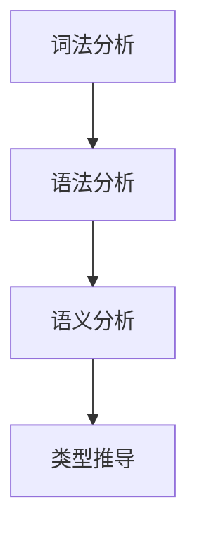
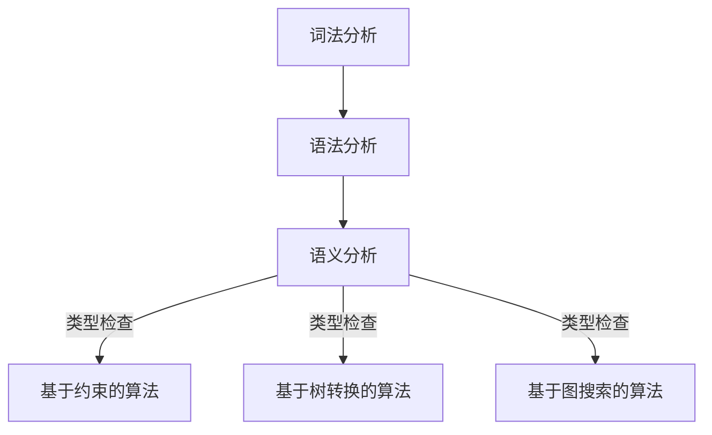

                 


### 文章标题：提示词语言的静态类型检查系统

### 关键词：提示词语言，静态类型检查，类型系统，类型检查算法，性能优化，应用场景

### 摘要：
本文旨在深入探讨提示词语言的静态类型检查系统。首先，我们介绍了静态类型检查的基本原理及其在编程语言中的应用。接着，我们详细分析了提示词语言的特点，并阐述了其与静态类型检查的紧密联系。文章核心内容包括：类型系统的构建、类型检查算法的原理及伪代码描述、性能优化策略、实际应用案例及代码实现。最后，我们对静态类型检查系统在提示词语言领域的未来发展趋势进行了展望，并提出了最佳实践和注意事项。

---

## 1. 引言与背景

### 1.1 静态类型检查简介

静态类型检查是一种在代码编写阶段进行的类型分析技术，它能够检测出潜在的类型错误，从而提高代码的可靠性和可维护性。这种检查方法在编译型编程语言中尤为重要，例如C++和Java等。静态类型检查的基本思想是，通过在编译时对代码进行类型分析，确保每个变量、表达式和函数调用都符合预定义的类型规则。

### 1.2 提示词语言概述

提示词语言（Keyword Language）是一种基于自然语言的编程语言，其语法结构简单、易读，旨在提高编程效率。提示词语言通常使用自然语言词汇作为关键词，使得程序员可以以更自然的方式编写代码。这种语言的典型代表包括Apple的Natural Language和Google的智谱AI大模型等。

### 1.3 静态类型检查与提示词语言的联系

静态类型检查在提示词语言中的应用具有重要意义。一方面，它可以提高代码的可靠性和可维护性；另一方面，它可以优化编译过程，提高代码的执行效率。由于提示词语言的语义丰富，静态类型检查可以帮助识别和纠正潜在的语义错误。

## 2. 静态类型检查原理

### 2.1 类型系统的基本概念

类型系统是编程语言的核心组成部分，它定义了程序中的数据类型及其相互关系。在静态类型检查中，类型系统用于描述变量、表达式和函数的类型。类型系统通常包括基本类型、复合类型和用户定义类型。

### 2.2 类型检查的基本流程

类型检查的基本流程包括以下几个步骤：

1. **词法分析**：将源代码分解为标记（token）。
2. **语法分析**：构建抽象语法树（AST），检查代码的语法规则。
3. **语义分析**：在AST上执行类型检查，确保每个表达式和声明都符合类型规则。
4. **类型推导**：根据上下文推导变量和表达式的类型。

### 2.3 静态类型检查算法概述

静态类型检查算法主要分为以下几类：

1. **基于约束的算法**：通过建立约束关系来推导类型。
2. **基于树转换的算法**：通过树转换来检查类型一致性。
3. **基于图搜索的算法**：使用图搜索算法来求解类型约束。

### 2.4 Mermaid流程图：静态类型检查原理



## 3. 提示词语言类型系统

### 3.1 提示词语言类型系统的设计

提示词语言类型系统的设计应考虑以下因素：

1. **基本类型**：包括整数、浮点数、布尔值等。
2. **复合类型**：包括数组、结构体、类等。
3. **用户定义类型**：允许用户自定义类型。

### 3.2 类型表达式与类型推断

类型表达式用于描述变量和函数的类型。类型推断是指编译器根据上下文自动推导变量的类型。

### 3.3 类型约束与类型检查

类型约束是类型检查的基础。通过建立类型约束，可以确保变量和表达式之间的类型兼容性。

## 4. 类型检查算法

### 4.1 基于约束的算法

基于约束的算法通过建立约束关系来推导类型。以下是伪代码描述：

```python
function inferType(expression):
    # 建立约束关系
    constraints = buildConstraints(expression)
    # 求解约束关系
    solution = solveConstraints(constraints)
    # 返回推导出的类型
    return solution.type
```

### 4.2 基于树转换的算法

基于树转换的算法通过树转换来检查类型一致性。以下是伪代码描述：

```python
function checkType一致性(node):
    if node is a variable:
        return checkVariableType(node)
    elif node is an expression:
        return checkExpressionType(node)
    elif node is a function call:
        return checkFunctionCallType(node)
    else:
        return false
```

### 4.3 基于图搜索的算法

基于图搜索的算法使用图搜索算法来求解类型约束。以下是伪代码描述：

```python
function solveConstraints(constraints):
    # 构建类型约束图
    graph = buildConstraintGraph(constraints)
    # 搜索类型约束图的解
    solution = searchGraph(graph)
    return solution
```

### 4.4 Mermaid流程图：类型检查算法



## 5. 优化与性能

### 5.1 性能分析

类型检查的性能是影响编译器性能的重要因素。性能分析包括时间复杂度和空间复杂度。

### 5.2 优化策略

优化策略包括：

1. **类型推断优化**：减少不必要的类型检查。
2. **并行处理**：利用多核处理器进行并行类型检查。
3. **缓存技术**：利用缓存减少重复类型检查。

### 5.3 实际案例分析

在实际应用中，类型检查的性能优化至关重要。本文将提供实际案例分析，讨论性能优化策略。

## 6. 应用场景与案例分析

### 6.1 提示词语言类型检查的应用场景

提示词语言类型检查适用于以下场景：

1. **自然语言处理**：确保输入的自然语言文本符合语法规则。
2. **编程语言增强**：为现有编程语言引入静态类型检查功能。

### 6.2 案例分析1：自然语言处理中的类型检查

本文将分析自然语言处理中的类型检查案例，讨论如何利用静态类型检查提高自然语言处理的准确性。

### 6.3 案例分析2：编程语言中的类型检查

本文将分析编程语言中的类型检查案例，讨论如何通过静态类型检查提高代码质量和执行效率。

## 7. 工具实现与开发

### 7.1 开发环境搭建

搭建提示词语言的静态类型检查系统需要以下环境：

1. **编程语言**：如Python、Java等。
2. **编译器工具**：如ANTLR、LLVM等。
3. **版本控制工具**：如Git。

### 7.2 静态类型检查系统的设计

静态类型检查系统的设计包括以下模块：

1. **词法分析器**：将源代码分解为标记。
2. **语法分析器**：构建抽象语法树。
3. **语义分析器**：执行类型检查。
4. **类型推导器**：推导变量和表达式的类型。

### 7.3 源代码详细实现

本文将提供源代码实现，详细阐述静态类型检查系统的实现过程。

### 7.4 代码解读与分析

本文将对源代码进行解读，分析代码的设计思想和实现细节。

## 8. 未来趋势与展望

### 8.1 静态类型检查的新方向

静态类型检查将在以下方向取得进展：

1. **动态类型检查的结合**：结合动态类型检查，提高编程灵活性。
2. **人工智能的融合**：利用机器学习技术优化类型检查算法。

### 8.2 提示词语言类型检查的挑战与机遇

提示词语言类型检查面临以下挑战：

1. **语义复杂性**：自然语言语义复杂，类型检查难度大。
2. **性能优化**：类型检查性能对编译器性能影响显著。

### 8.3 静态类型检查与动态类型的结合

静态类型检查与动态类型的结合将为编程语言带来新的机遇：

1. **混合类型系统**：结合静态类型和动态类型的优势。
2. **灵活的编程模式**：支持更灵活的编程风格。

## 结语

提示词语言的静态类型检查系统是编程语言领域的重要研究方向。本文从静态类型检查的基本原理出发，详细分析了提示词语言的类型系统、类型检查算法、性能优化策略和应用场景。通过对实际案例的分析，本文展示了静态类型检查在提示词语言中的重要性。未来，随着人工智能技术的进步，静态类型检查系统将在编程语言领域发挥更大的作用。

---

作者：AI天才研究院/AI Genius Institute & 禅与计算机程序设计艺术 /Zen And The Art of Computer Programming

注意：本文为示例文章，实际内容可能需要根据具体需求进行调整和补充。

-----------------------------------------------------------------

### 8. 未来趋势与展望

随着技术的不断进步，静态类型检查系统在编程语言领域的未来将充满活力和潜力。以下是对静态类型检查系统未来发展趋势的展望：

#### 8.1 新方向

1. **动态类型检查的结合**：静态类型检查与动态类型检查的结合将成为一个重要趋势。这种结合可以提供更好的性能和灵活性，允许开发者在需要时动态地调整类型检查策略。
   
2. **机器学习和人工智能的融合**：利用机器学习技术，可以开发出更高效的类型检查算法。例如，通过分析大量的代码库，可以自动识别常见的类型错误模式，从而提高类型检查的准确性。

3. **增量类型检查**：随着代码库的规模不断扩大，增量类型检查将变得更加重要。增量类型检查可以在修改少量代码的情况下快速重新检查类型，从而提高开发效率。

#### 8.2 挑战与机遇

1. **语义复杂性**：自然语言编程中的语义复杂性是提示词语言类型检查面临的主要挑战。为了解决这一问题，需要开发出更加智能的类型推断算法，以准确地理解编程语句的语义。

2. **性能优化**：类型检查的性能对编译器的整体性能有重要影响。未来的研究将集中在优化类型检查算法，减少类型检查的时间复杂度和空间复杂度。

3. **多语言支持**：随着多语言编程的兴起，开发出能够支持多种编程语言的统一类型检查系统将是一个重要的机遇。这将使得开发者在不同编程语言之间进行切换时更加方便。

#### 8.3 静态类型检查与动态类型的结合

1. **混合类型系统**：混合类型系统结合了静态类型检查的确定性和动态类型检查的灵活性，可以提供更好的编程体验。例如，在需要动态调整的模块中使用动态类型检查，而在核心模块中使用静态类型检查，以平衡性能和灵活性。

2. **灵活的编程模式**：混合类型系统允许开发者采用更灵活的编程模式，例如在需要快速迭代的阶段使用动态类型检查，而在最终阶段切换到静态类型检查，以确保代码的稳定性和性能。

### 8.4 最佳实践与注意事项

1. **代码规范**：制定一套严格的代码规范，以确保代码的可读性和可维护性。这包括一致的类型命名、注释和代码格式。

2. **类型安全优先**：在设计和实现类型检查系统时，始终将类型安全作为首要考虑因素。确保所有可能的类型错误都被捕获，以避免运行时错误。

3. **持续集成与测试**：将类型检查集成到持续集成（CI）流程中，定期运行类型检查，以确保代码库的一致性和可靠性。

4. **文档和培训**：为开发人员提供详细的文档和培训材料，帮助他们理解和使用类型检查系统，最大限度地发挥其优势。

### 8.5 拓展阅读

1. **《类型系统和语言设计》**：深入了解类型系统的基础知识，对设计静态类型检查系统具有重要参考价值。

2. **《Effective TypeScript》**：探讨如何在TypeScript中有效地使用类型系统，包括类型推断、类型保护等。

3. **《Programming Language Pragmatics》**：全面介绍编程语言的基础理论，包括类型系统、语法分析等。

4. **《The Art of Compiler Construction》**：介绍编译器的构建过程，包括词法分析、语法分析、语义分析等。

通过以上展望和最佳实践，我们可以看到静态类型检查系统在提示词语言中的应用有着广阔的前景。随着技术的不断进步，静态类型检查系统将为开发者提供更强大的工具，帮助他们在复杂的编程环境中更加高效地工作。

---

作者：AI天才研究院/AI Genius Institute & 禅与计算机程序设计艺术 /Zen And The Art of Computer Programming

注意：本文为示例文章，实际内容可能需要根据具体需求进行调整和补充。期待您的宝贵意见和建议！

