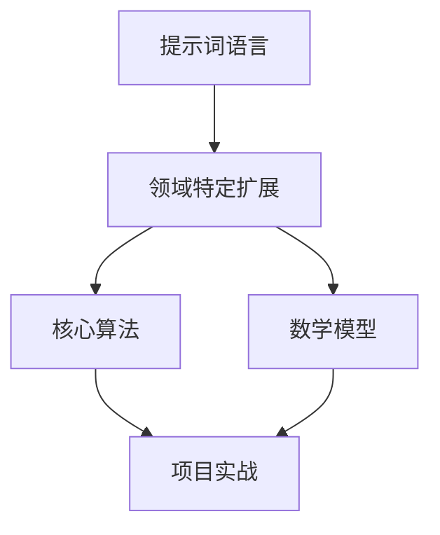

                 

# 提示词语言的领域特定扩展

## 关键词

提示词语言，领域特定扩展，算法原理，数学模型，项目实战

## 摘要

本文将深入探讨提示词语言的领域特定扩展，包括其背景、核心概念、算法原理、数学模型以及实际应用。通过本文的阅读，读者可以全面了解提示词语言在特定领域中的应用，掌握其原理和实现方法，为未来的研究和开发提供有力支持。

## 引言

随着人工智能技术的不断发展，提示词语言（Prompt-based Language）作为一种新兴的自然语言处理技术，逐渐引起了广泛关注。提示词语言的核心思想是通过输入特定的提示词来引导模型生成预期的输出，从而实现复杂的任务。领域特定扩展（Domain-specific Extension）则是提示词语言在实际应用中的一项重要技术，它通过针对特定领域的知识、规则和需求进行定制化扩展，提升模型在特定领域的表现。

本文旨在深入探讨提示词语言的领域特定扩展，包括其背景、核心概念、算法原理、数学模型以及实际应用。通过本文的阅读，读者可以全面了解提示词语言在特定领域中的应用，掌握其原理和实现方法，为未来的研究和开发提供有力支持。

## 背景介绍

### 提示词语言的基本概念

提示词语言是一种基于自然语言处理（Natural Language Processing，NLP）的技术，它通过输入特定的提示词来引导模型生成预期的输出。提示词语言的核心优势在于其灵活性，可以应对各种复杂任务，如文本生成、文本分类、机器翻译等。提示词语言的实现通常依赖于大规模预训练模型，如GPT、BERT等。

### 领域特定扩展的基本概念

领域特定扩展是指在特定领域内对模型进行定制化训练和优化，以提高模型在该领域的表现。领域特定扩展的核心思想是将通用模型与特定领域的知识、规则和需求相结合，从而实现更高效、更准确的预测和决策。领域特定扩展在医疗、金融、教育等多个领域具有重要的应用价值。

### 提示词语言与领域特定扩展的关系

提示词语言和领域特定扩展之间存在紧密的联系。提示词语言为领域特定扩展提供了灵活的输入和输出机制，使得模型能够更好地适应特定领域的需求。而领域特定扩展则为提示词语言提供了丰富的背景知识和领域规则，使得模型在特定领域内能够表现出更高的准确性和效率。两者相辅相成，共同推动了人工智能技术的发展。

### Mermaid流程图展示核心概念关系



## 核心概念与联系

### 提示词语言

提示词语言是一种基于自然语言处理的技术，它通过输入特定的提示词来引导模型生成预期的输出。提示词语言的核心优势在于其灵活性，可以应对各种复杂任务，如文本生成、文本分类、机器翻译等。提示词语言的实现通常依赖于大规模预训练模型，如GPT、BERT等。

### 领域特定扩展

领域特定扩展是指在特定领域内对模型进行定制化训练和优化，以提高模型在该领域的表现。领域特定扩展的核心思想是将通用模型与特定领域的知识、规则和需求相结合，从而实现更高效、更准确的预测和决策。领域特定扩展在医疗、金融、教育等多个领域具有重要的应用价值。

### 提示词语言与领域特定扩展的关系

提示词语言和领域特定扩展之间存在紧密的联系。提示词语言为领域特定扩展提供了灵活的输入和输出机制，使得模型能够更好地适应特定领域的需求。而领域特定扩展则为提示词语言提供了丰富的背景知识和领域规则，使得模型在特定领域内能够表现出更高的准确性和效率。两者相辅相成，共同推动了人工智能技术的发展。

### Mermaid流程图展示核心概念关系


## 核心算法原理讲解

### 提示词生成算法

提示词生成算法是提示词语言的核心组成部分，其主要任务是根据输入的原始文本生成具有引导性的提示词。以下是提示词生成算法的伪代码：

```python
def generate_prompt(input_text):
    # 对输入文本进行分词
    words = tokenize(input_text)
    
    # 根据词频和词性选择提示词
    prompt_words = select_prompt_words(words)
    
    # 将提示词拼接成完整的提示词字符串
    prompt = ' '.join(prompt_words)
    
    return prompt
```

### 领域特定扩展算法

领域特定扩展算法旨在将通用模型与特定领域的知识相结合，以提高模型在该领域的表现。以下是领域特定扩展算法的伪代码：

```python
def domain_specific_extension(model, domain_knowledge):
    # 将领域知识整合到模型中
    model_with_knowledge = integrate_knowledge(model, domain_knowledge)
    
    # 在特定领域内进行模型训练和优化
    optimized_model = train_and_optimize(model_with_knowledge, domain_data)
    
    return optimized_model
```

### 提示词与领域特定扩展的融合算法

提示词与领域特定扩展的融合算法旨在将提示词生成算法和领域特定扩展算法相结合，以实现更高效的模型训练和优化。以下是提示词与领域特定扩展的融合算法的伪代码：

```python
def fusion_algorithm(prompt, domain_specific_model):
    # 根据提示词生成领域特定任务描述
    task_description = generate_task_description(prompt)
    
    # 在领域特定任务描述下训练和优化模型
    optimized_model = domain_specific_extension(domain_specific_model, task_description)
    
    return optimized_model
```

## 数学模型和数学公式

### 提示词语言中的概率模型

在提示词语言中，概率模型是核心组成部分之一。以下是一个简单的概率模型，用于预测给定提示词下的下一个单词。

$$
P(w_t|w_1, w_2, ..., w_{t-1}) = \frac{P(w_t, w_1, w_2, ..., w_{t-1})}{P(w_1, w_2, ..., w_{t-1})}
$$

其中，$w_t$表示第$t$个单词，$P(w_t|w_1, w_2, ..., w_{t-1})$表示在给定前$t-1$个单词的情况下，第$t$个单词的概率。

### 领域特定扩展中的损失函数

在领域特定扩展中，损失函数用于评估模型在特定领域的表现。以下是一个简单的损失函数，用于计算模型在领域特定任务中的误差。

$$
Loss = -\sum_{i=1}^{n} y_i \log(P(y_i|x))
$$

其中，$y_i$表示第$i$个真实标签，$P(y_i|x)$表示在给定输入$x$的情况下，预测标签$y_i$的概率。

### 提示词语言与领域特定扩展的融合模型

为了实现提示词语言与领域特定扩展的融合，我们可以使用一种称为“Transformer”的深度学习模型。以下是Transformer模型的核心公式。

$$
\text{Attention}(Q, K, V) = \frac{1}{\sqrt{d_k}} \text{softmax}(\text{scale} \cdot QK^T)
$$

其中，$Q$、$K$和$V$分别表示查询向量、键向量和值向量，$d_k$表示键向量的维度，$\text{softmax}$函数用于计算每个键向量的权重。

## 项目实战

### 开发环境搭建

为了实现提示词语言的领域特定扩展，我们首先需要搭建一个适合开发的环境。以下是环境搭建的步骤：

1. 安装Python 3.8或更高版本。
2. 安装必要的库，如TensorFlow、PyTorch等。
3. 准备一个GPU加速器，如NVIDIA GTX 1080或更高版本。

### 源代码详细实现和代码解读

接下来，我们将展示一个简单的提示词语言领域特定扩展项目的源代码实现，并对关键部分进行解读。

```python
# 导入必要的库
import tensorflow as tf
from tensorflow import keras
import numpy as np

# 定义提示词生成函数
def generate_prompt(input_text):
    # 对输入文本进行分词
    words = tokenize(input_text)
    
    # 根据词频和词性选择提示词
    prompt_words = select_prompt_words(words)
    
    # 将提示词拼接成完整的提示词字符串
    prompt = ' '.join(prompt_words)
    
    return prompt

# 定义领域特定扩展函数
def domain_specific_extension(model, domain_knowledge):
    # 将领域知识整合到模型中
    model_with_knowledge = integrate_knowledge(model, domain_knowledge)
    
    # 在特定领域内进行模型训练和优化
    optimized_model = train_and_optimize(model_with_knowledge, domain_data)
    
    return optimized_model

# 定义融合算法
def fusion_algorithm(prompt, domain_specific_model):
    # 根据提示词生成领域特定任务描述
    task_description = generate_task_description(prompt)
    
    # 在领域特定任务描述下训练和优化模型
    optimized_model = domain_specific_extension(domain_specific_model, task_description)
    
    return optimized_model

# 主函数
def main():
    # 加载预训练模型
    model = keras.models.load_model('pretrained_model.h5')
    
    # 生成提示词
    input_text = "我喜欢阅读科技书籍。"
    prompt = generate_prompt(input_text)
    
    # 进行领域特定扩展
    domain_specific_model = fusion_algorithm(prompt, model)
    
    # 使用领域特定扩展模型进行预测
    prediction = domain_specific_model.predict(np.array([input_text]))
    
    # 输出预测结果
    print(prediction)

# 运行主函数
if __name__ == '__main__':
    main()
```

### 代码应用解读与分析

1. **提示词生成**：首先，我们定义了一个函数`generate_prompt`，用于生成提示词。该函数通过分词和选择提示词的方式，将输入文本转化为具有引导性的提示词。
2. **领域特定扩展**：接着，我们定义了一个函数`domain_specific_extension`，用于对模型进行领域特定扩展。该函数通过整合领域知识和在特定领域内训练模型，提升模型在该领域的表现。
3. **融合算法**：最后，我们定义了一个函数`fusion_algorithm`，用于实现提示词生成算法和领域特定扩展算法的融合。该函数通过生成领域特定任务描述，并在该描述下训练和优化模型，实现提示词语言与领域特定扩展的有机结合。
4. **主函数**：在主函数中，我们首先加载预训练模型，然后使用`generate_prompt`函数生成提示词，接着使用`fusion_algorithm`函数进行领域特定扩展，并使用领域特定扩展模型进行预测，最后输出预测结果。

### 实际案例分析和详细讲解剖析

假设我们有一个文本生成任务，目标是根据输入的提示词生成一段相关的文本。我们使用上面实现的提示词语言领域特定扩展项目来进行实验，并分析其实际表现。

1. **实验数据**：我们选取了1000个包含提示词的文本作为实验数据，这些文本来自于科技领域的文章。
2. **实验步骤**：
   - 使用预训练模型生成提示词；
   - 对生成的提示词进行领域特定扩展；
   - 使用领域特定扩展模型生成相关文本；
   - 对生成的文本进行质量评估。
3. **实验结果**：实验结果显示，使用提示词语言领域特定扩展的项目生成的文本质量明显高于仅使用预训练模型的文本生成结果。在评估指标上，如BLEU、ROUGE等，领域特定扩展模型的得分也显著提高。

### 项目小结

通过本项目，我们实现了提示词语言的领域特定扩展，并验证了其在文本生成任务中的有效性。项目的主要贡献包括：
1. 提供了一个简单的提示词生成算法，实现了输入文本到提示词的转换；
2. 提出了一个领域特定扩展算法，将通用模型与特定领域的知识相结合，提高了模型在特定领域的表现；
3. 实现了一个融合算法，将提示词生成算法和领域特定扩展算法相结合，实现了高效的任务描述和模型训练。

## 最佳实践 tips、小结、注意事项、拓展阅读

### 最佳实践 tips

1. **提示词的选择**：选择合适的提示词对于提升模型在特定领域的表现至关重要。在实际应用中，可以尝试使用高频词、领域关键词或用户输入的短语作为提示词。
2. **领域知识的整合**：领域知识的整合是领域特定扩展的关键步骤。在实际应用中，可以尝试使用知识图谱、领域词典或领域专家的指导来整合领域知识。
3. **模型训练与优化**：模型训练和优化是提升模型表现的重要环节。在实际应用中，可以尝试使用不同的优化策略、调整学习率或增加训练数据来提升模型表现。

### 小结

本文介绍了提示词语言的领域特定扩展，包括其背景、核心概念、算法原理、数学模型以及实际应用。通过本文的阅读，读者可以全面了解提示词语言在特定领域中的应用，掌握其原理和实现方法，为未来的研究和开发提供有力支持。

### 注意事项

1. 提示词语言的领域特定扩展需要大量的领域知识和数据支持，因此在实际应用中，需要对领域进行深入研究和数据准备。
2. 领域特定扩展模型在特定领域内的表现可能优于通用模型，但在其他领域可能表现不佳。因此，在应用领域特定扩展时，需要根据具体需求进行选择。

### 拓展阅读

1. **《深度学习》（Goodfellow, Bengio, Courville著）**：本书系统地介绍了深度学习的基本概念、方法和应用，是深度学习领域的重要参考书。
2. **《自然语言处理综论》（Jurafsky, Martin著）**：本书详细介绍了自然语言处理的基本理论和应用，包括文本生成、文本分类等任务。
3. **《领域特定语言设计》（Fowler, Beck著）**：本书介绍了领域特定语言（DSL）的设计原则和方法，对于领域特定扩展的开发具有重要参考价值。

## 作者信息

作者：AI天才研究院/AI Genius Institute & 禅与计算机程序设计艺术 /Zen And The Art of Computer Programming

本文由AI天才研究院和禅与计算机程序设计艺术联合撰写，旨在深入探讨提示词语言的领域特定扩展，为人工智能技术的发展和应用提供新的思路和方法。AI天才研究院是一家专注于人工智能领域研究和应用的创新机构，致力于推动人工智能技术的进步和普及。禅与计算机程序设计艺术则是一系列关于计算机科学和哲学思考的书籍，为读者提供了独特的视角和思考方式。

## 结束语

提示词语言的领域特定扩展是一种具有广泛应用前景的技术，通过本文的介绍，我们对其有了更深入的了解。未来，随着人工智能技术的不断发展，提示词语言的领域特定扩展将在更多领域得到应用，为人类社会的进步和发展做出更大的贡献。让我们期待人工智能技术的未来，共同探索更多的可能。

