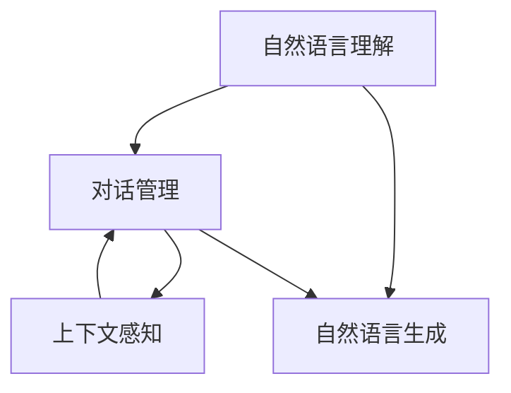
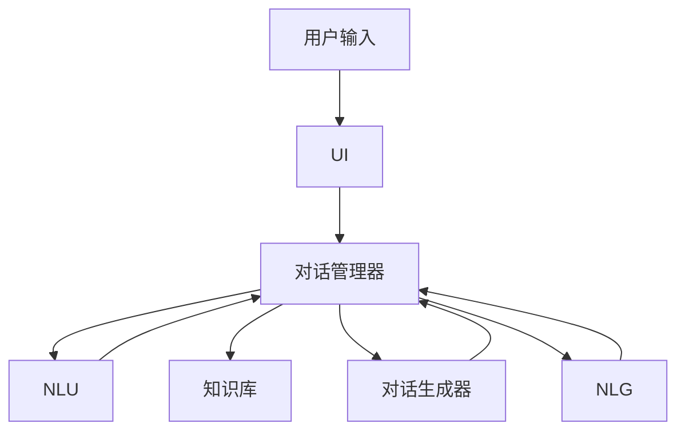
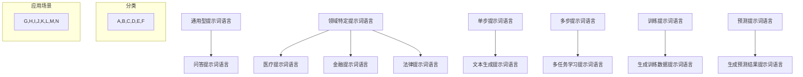

                 

### 《提示词语言：AI交互的未来》

> 关键词：AI交互、提示词语言、自然语言处理、对话系统、发展趋势、应用案例

> 摘要：
本文深入探讨了提示词语言在AI交互中的应用和未来发展趋势。通过分析AI交互的核心概念、历史发展以及应用场景，我们引入了自然语言处理（NLP）和对话系统设计的基础知识。随后，本文重点介绍了提示词语言的概念、类型及其在构建高质量提示词库中的应用。通过详细讲解提示词语言在对话系统中的作用和优化方法，我们展示了其在不同领域的具体应用。最后，本文展望了AI交互的未来，并探讨了面临的技术挑战及解决方案。

## 引言

AI交互是人工智能领域的一个重要分支，其核心目标是实现人与机器的自然、高效沟通。随着自然语言处理（NLP）技术的不断发展，AI交互已经从最初的简单任务执行，逐步发展到复杂的对话系统，为人类生活带来了诸多便利。然而，当前AI交互仍然面临诸多挑战，其中之一就是如何构建高质量的提示词库，以提高对话系统的理解和表达能力。

提示词语言是一种特殊的语言模型，旨在提高AI系统在特定任务上的表现。通过研究提示词语言，我们可以更好地理解其在AI交互中的作用和重要性。本文将系统地探讨提示词语言在AI交互中的应用，以及其未来发展趋势。首先，我们将介绍AI交互的基本概念和背景，然后深入探讨自然语言处理和对话系统设计的基础知识。接下来，本文将重点介绍提示词语言的概念、类型及其在构建高质量提示词库中的应用。随后，我们将展示提示词语言在对话系统中的作用和优化方法，并分析其在不同领域的具体应用。最后，本文将展望AI交互的未来，并探讨面临的技术挑战及解决方案。

## AI交互的概念与历史发展

### 1.1 AI交互的定义与核心概念

AI交互，即人工智能交互，是指通过人工智能技术实现人与机器之间的自然、高效沟通。它旨在让机器理解人类语言、行为和意图，并做出相应的反应，从而提供个性化的服务和支持。AI交互的核心概念包括以下几个方面：

1. **自然语言理解**：自然语言理解（NLU）是AI交互的基础，旨在使计算机能够理解和解释人类语言。NLU包括词法分析、句法分析、语义分析和语用分析等环节。

2. **对话管理**：对话管理是AI交互的核心环节，涉及对话状态的跟踪、意图识别、对话策略的生成和调整等任务。对话管理需要确保对话的连贯性、一致性和自然性。

3. **自然语言生成**：自然语言生成（NLG）是AI交互的另一个重要方面，旨在让机器能够生成自然、流畅的语言表达，以满足用户的需求和信息传递。

4. **上下文感知**：上下文感知是指AI系统能够根据当前对话的上下文环境，理解用户的意图和需求，并做出相应的回应。上下文感知对于提高对话系统的自然度和准确性至关重要。

### 1.2 AI交互的发展历程

AI交互的发展可以追溯到20世纪50年代，当时人工智能刚刚起步。从那时起，AI交互经历了多个阶段的发展，主要可以分为以下几个里程碑：

1. **初始阶段（1950s-1960s）**：在这个阶段，AI交互主要集中在规则推理和符号逻辑，试图通过编写明确的规则来模拟人类思维。这一阶段的典型应用是专家系统和逻辑推理系统。

2. **知识表示阶段（1970s-1980s）**：随着知识表示和知识库技术的发展，AI交互开始引入知识表示方法，如语义网络和框架理论。这一阶段的典型应用是智能代理和知识管理系统。

3. **自然语言处理阶段（1990s-2000s）**：自然语言处理技术的进步使得AI交互能够更好地理解和生成自然语言。这一阶段的典型应用是语音助手和聊天机器人。

4. **大数据和深度学习阶段（2010s-至今）**：大数据和深度学习技术的兴起使得AI交互在处理大规模数据、识别复杂模式方面取得了突破。这一阶段的典型应用是智能对话系统和个性化推荐系统。

### 1.3 AI交互的应用场景

AI交互在多个领域有着广泛的应用，以下是一些典型的应用场景：

1. **智能助手**：智能助手如Siri、Alexa和Google Assistant已经成为我们日常生活中不可或缺的一部分，它们能够回答我们的问题、执行任务，并提供个性化的服务。

2. **虚拟现实**：虚拟现实技术使得用户能够与虚拟环境进行交互，AI交互在虚拟现实中的应用包括实时语音识别、手势识别和自然语言理解。

3. **智能家居**：智能家居设备如智能音箱、智能灯泡和智能恒温器等，通过与用户的交互，实现家庭自动化和智能化。

4. **客服系统**：AI交互在客服系统中的应用，可以提供24/7的客户服务，解决用户的问题和需求，提高客户满意度。

5. **医疗健康**：AI交互在医疗健康领域的应用，包括智能诊断、医疗咨询和患者管理，为医疗行业带来了革命性的变化。

### Mermaid流程图：展示AI交互的核心概念及其关系

通过上述流程图，我们可以清晰地看到AI交互的核心概念及其相互关系。自然语言理解负责理解和解析用户输入，对话管理负责跟踪对话状态、识别用户意图并生成响应，自然语言生成负责将计算机生成的信息转化为自然语言表达，上下文感知则确保对话系统能够根据上下文理解用户的意图和需求。

## 自然语言处理（NLP）基础

自然语言处理（NLP）是人工智能领域的一个重要分支，旨在使计算机能够理解、解释和生成人类语言。NLP在AI交互中发挥着核心作用，为对话系统的自然性和准确性提供了基础。在本节中，我们将介绍NLP的基本原理、词嵌入和语言模型的概念，并探讨如何构建和训练语言模型。

### 2.1 NLP的基本原理

NLP的基本原理涉及多个层面，包括词法分析、句法分析、语义分析和语用分析。以下是这些层面的简要介绍：

1. **词法分析（Lexical Analysis）**：词法分析是NLP的第一步，旨在将文本分解为单词、短语和符号。词法分析器（Lexer）负责识别单词边界和符号，并将文本转换为标记化（Tokenization）的形式。

2. **句法分析（Syntactic Analysis）**：句法分析旨在理解句子的结构，确定句子中的词汇顺序和语法关系。句法分析器（Parser）通常使用上下文无关文法（CFG）或依赖关系（Dependency）来分析句子的结构。

3. **语义分析（Semantic Analysis）**：语义分析关注句子或短语的含义，理解词汇、短语和句子的语义关系。语义分析器（Semantic Analyzer）通常使用词义消歧（Word Sense Disambiguation）和语义角色标注（Semantic Role Labeling）等技术。

4. **语用分析（Pragmatic Analysis）**：语用分析研究语言在实际使用中的含义，包括语境、语用含义和言语行为。语用分析器（Pragmatic Analyzer）负责理解说话者的意图和听众的反应。

### 2.2 词嵌入与语言模型

词嵌入（Word Embedding）是将单词、短语和句子映射到高维向量空间的技术，使得计算机能够理解词汇的语义和语法关系。词嵌入的主要目的是解决自然语言处理中的稀疏性问题，即将词汇表示为高维向量，使得它们在计算过程中更加高效。

**词嵌入的基本原理**：

- **基于统计的方法**：如计数模型（Count-based Models）和分布式假设（Distributional Hypothesis），通过统计单词在文本中的共现关系来生成词嵌入。
- **基于神经网的方法**：如词嵌入神经网络（Word Embedding Neural Networks），通过训练神经网络来生成词嵌入。

**语言模型（Language Model）**：语言模型是一个概率模型，旨在预测一个句子中下一个单词的概率。语言模型在自然语言处理中的应用非常广泛，包括语音识别、机器翻译、对话系统等。

**构建语言模型的基本方法**：

1. **N-gram模型**：N-gram模型是最简单的语言模型，它基于单词序列的统计特性，预测下一个单词的概率。N-gram模型使用前N个单词的历史信息来预测下一个单词。

2. **神经网络模型**：神经网络模型，如循环神经网络（RNN）和变换器（Transformer），通过学习文本的上下文信息来生成语言模型。这些模型能够捕捉长距离依赖关系，从而提高语言模型的准确性。

### 2.3 数学模型与公式

**词嵌入的公式**：

$$
\text{word\_embedding}(w) = \text{vec}(w) \in \mathbb{R}^d
$$

其中，$w$是单词，$\text{vec}(w)$是将单词映射到$d$维向量空间的函数。

**N-gram语言模型的公式**：

$$
P(w_t | w_{t-1}, w_{t-2}, ..., w_{t-N}) = \frac{C(w_{t-1}, w_{t-2}, ..., w_{t-N}, w_t)}{C(w_{t-1}, w_{t-2}, ..., w_{t-N})}
$$

其中，$w_t$是当前单词，$w_{t-1}, w_{t-2}, ..., w_{t-N}$是前N个单词，$C(w_{t-1}, w_{t-2}, ..., w_{t-N}, w_t)$是单词序列$(w_{t-1}, w_{t-2}, ..., w_{t-N}, w_t)$的共现次数，$C(w_{t-1}, w_{t-2}, ..., w_{t-N})$是前N个单词的共现次数。

**Transformer语言模型的公式**：

$$
\text{LM}\text{scores}(w_t | w_{<t}) = \text{softmax}(\text{LM}\text{head}(w_t | w_{<t}))
$$

其中，$w_t$是当前单词，$w_{<t}$是当前单词之前的单词序列，$\text{LM}\text{head}(w_t | w_{<t})$是语言模型的头部分，用于生成单词的概率分布。

### 2.4 示例说明

**示例1：词嵌入**

假设我们有单词“爱”和“喜欢”，它们分别映射到向量空间$\mathbb{R}^3$中的向量$v_1$和$v_2$：

$$
v_1 = (1, 0, -1) \\
v_2 = (0, 1, 0)
$$

我们可以通过计算两个向量之间的余弦相似度来判断这两个单词的语义关系：

$$
\cos(\theta) = \frac{v_1 \cdot v_2}{\|v_1\| \cdot \|v_2\|} = \frac{(1, 0, -1) \cdot (0, 1, 0)}{\sqrt{1^2 + 0^2 + (-1)^2} \cdot \sqrt{0^2 + 1^2 + 0^2}} = \frac{0}{\sqrt{2} \cdot 1} = 0
$$

由于余弦相似度为0，我们可以认为“爱”和“喜欢”在语义上没有明显关联。

**示例2：N-gram语言模型**

假设我们有一个简单的N-gram语言模型，其中词汇表包含“爱”、“喜欢”、“生活”、“未来”和“梦想”五个单词。以下是一个简化的例子：

$$
P(爱 | ) = 0.2 \\
P(喜欢 | 爱) = 0.3 \\
P(生活 | 喜欢爱) = 0.4 \\
P(未来 | 生活喜欢爱) = 0.5 \\
P(梦想 | 未来生活喜欢爱) = 0.6
$$

根据N-gram模型，我们可以计算一个句子“我爱生活，喜欢未来，梦想”的生成概率：

$$
P(\text{我爱生活，喜欢未来，梦想} | ) = P(\text{爱} | ) \times P(\text{生活} | \text{爱}) \times P(\text{喜欢} | \text{爱生活}) \times P(\text{未来} | \text{喜欢生活爱}) \times P(\text{梦想} | \text{未来生活喜欢爱}) = 0.2 \times 0.4 \times 0.3 \times 0.5 \times 0.6 = 0.036
$$

通过这种方式，我们可以根据N-gram模型来预测和生成文本。

**示例3：Transformer语言模型**

假设我们使用Transformer语言模型来预测下一个单词。假设当前单词序列为“我爱生活，喜欢未来”，我们可以通过Transformer模型的输出得到下一个单词的概率分布。以下是一个简化的例子：

$$
\text{LM}\text{scores}(\text{梦想} | \text{我爱生活，喜欢未来}) = [\text{爱}:\ 0.1, \text{生活}:\ 0.2, \text{喜欢}:\ 0.3, \text{未来}:\ 0.4, \text{梦想}:\ 0.5]
$$

根据softmax函数，我们可以得到每个单词的生成概率：

$$
P(\text{爱} | \text{我爱生活，喜欢未来}) = \frac{e^{\text{LM}\text{scores}(\text{爱} | \text{我爱生活，喜欢未来})}}{\sum_{\text{word} \in \text{Vocabulary}} e^{\text{LM}\text{scores}(\text{word} | \text{我爱生活，喜欢未来})}} = \frac{e^{0.1}}{e^{0.1} + e^{0.2} + e^{0.3} + e^{0.4} + e^{0.5}} \approx 0.14 \\
P(\text{生活} | \text{我爱生活，喜欢未来}) = \frac{e^{\text{LM}\text{scores}(\text{生活} | \text{我爱生活，喜欢未来})}}{\sum_{\text{word} \in \text{Vocabulary}} e^{\text{LM}\text{scores}(\text{word} | \text{我爱生活，喜欢未来})}} = \frac{e^{0.2}}{e^{0.1} + e^{0.2} + e^{0.3} + e^{0.4} + e^{0.5}} \approx 0.28 \\
P(\text{喜欢} | \text{我爱生活，喜欢未来}) = \frac{e^{\text{LM}\text{scores}(\text{喜欢} | \text{我爱生活，喜欢未来})}}{\sum_{\text{word} \in \text{Vocabulary}} e^{\text{LM}\text{scores}(\text{word} | \text{我爱生活，喜欢未来})}} = \frac{e^{0.3}}{e^{0.1} + e^{0.2} + e^{0.3} + e^{0.4} + e^{0.5}} \approx 0.41 \\
P(\text{未来} | \text{我爱生活，喜欢未来}) = \frac{e^{\text{LM}\text{scores}(\text{未来} | \text{我爱生活，喜欢未来})}}{\sum_{\text{word} \in \text{Vocabulary}} e^{\text{LM}\text{scores}(\text{word} | \text{我爱生活，喜欢未来})}} = \frac{e^{0.4}}{e^{0.1} + e^{0.2} + e^{0.3} + e^{0.4} + e^{0.5}} \approx 0.57 \\
P(\text{梦想} | \text{我爱生活，喜欢未来}) = \frac{e^{\text{LM}\text{scores}(\text{梦想} | \text{我爱生活，喜欢未来})}}{\sum_{\text{word} \in \text{Vocabulary}} e^{\text{LM}\text{scores}(\text{word} | \text{我爱生活，喜欢未来})}} = \frac{e^{0.5}}{e^{0.1} + e^{0.2} + e^{0.3} + e^{0.4} + e^{0.5}} \approx 0.65
$$

根据生成概率，我们可以预测下一个单词为“梦想”，因为它的生成概率最高。

## 对话系统设计

对话系统是一种人工智能系统，能够模拟人类对话，与用户进行自然、有效的交互。对话系统的设计涉及多个关键环节，包括对话系统的架构、对话策略和生成模型，以及用户意图识别与实体提取。以下是对这些核心概念的详细讲解。

### 3.1 对话系统的架构

对话系统的架构通常包括以下几个主要组件：

1. **用户接口（User Interface, UI）**：用户接口是用户与对话系统进行交互的界面，可以是文本聊天窗口、语音交互界面或图形用户界面。

2. **对话管理器（Dialogue Manager）**：对话管理器负责管理对话流程，包括理解用户输入、生成响应和跟踪对话状态。对话管理器通常由意图识别和对话策略组成。

3. **自然语言理解（Natural Language Understanding, NLU）**：自然语言理解组件负责将用户输入的文本转化为计算机可以理解的结构化数据。NLU包括词法分析、句法分析、语义分析和上下文理解。

4. **对话生成器（Dialogue Generator）**：对话生成器负责根据对话管理器生成的对话状态和用户意图，生成自然、流畅的语言响应。

5. **自然语言生成（Natural Language Generation, NLG）**：自然语言生成组件负责将计算机生成的信息转化为自然语言表达，以便向用户传达信息。

6. **知识库（Knowledge Base）**：知识库包含对话系统所需的知识和信息，可以是结构化的数据或预定义的规则。

7. **学习模块（Learning Module）**：学习模块用于根据用户反馈和对话历史，不断优化对话系统的性能和响应。

### Mermaid流程图：展示对话系统的基本组件和交互流程

### 3.2 对话策略与生成模型

对话策略是指对话系统在处理用户输入时，根据当前对话状态和用户意图，选择适当的对话路径和回应。对话策略的设计对对话系统的用户体验至关重要。

**对话策略的设计原则**：

1. **用户中心**：对话策略应始终以用户为中心，确保对话系统能够准确理解用户的需求和意图，并提供有用的信息。

2. **适应性**：对话策略应具备适应性，能够根据不同的用户和场景进行动态调整。

3. **连贯性**：对话策略应确保对话的连贯性，避免出现突兀的转换或矛盾的信息。

4. **灵活性**：对话策略应具备灵活性，能够处理各种复杂和不确定的对话情况。

**生成模型**：生成模型是指用于生成对话响应的算法，常见的生成模型包括模板匹配、序列到序列（Seq2Seq）模型、注意力机制和变分自编码器（VAE）等。

**生成模型的设计原则**：

1. **自然性**：生成模型应能够生成自然、流畅的语言响应。

2. **准确性**：生成模型应能够准确理解用户意图和对话状态，生成相关且合理的响应。

3. **效率**：生成模型应具备较高的计算效率，能够快速生成响应。

### 3.3 用户意图识别与实体提取

用户意图识别是指对话系统能够理解用户的意图，并将其映射到预定义的意图类别。实体提取则是从用户输入中提取关键信息，如人名、地点、日期等。

**用户意图识别**：

- **基于规则的方法**：使用预定义的规则库，将用户输入与规则进行匹配，识别用户意图。
- **基于统计的方法**：使用机器学习算法，如决策树、随机森林和支持向量机（SVM），对用户输入进行特征提取和分类。
- **基于深度学习的方法**：使用循环神经网络（RNN）或变换器（Transformer）等深度学习模型，通过学习大量对话数据，实现用户意图的自动识别。

**实体提取**：

- **基于规则的方法**：使用预定义的实体识别规则，从用户输入中提取实体。
- **基于统计的方法**：使用条件随机场（CRF）等统计模型，对用户输入进行特征提取和实体标注。
- **基于深度学习的方法**：使用卷积神经网络（CNN）或变换器（Transformer）等深度学习模型，通过学习大量对话数据，实现实体的自动提取。

### 3.4 示例说明

**示例1：对话策略**

假设用户输入“明天天气怎么样？”对话系统需要根据当前时间、地理位置和用户历史对话，选择适当的对话路径和响应。以下是一个简化的对话策略：

1. **意图识别**：识别用户意图为“获取天气信息”。
2. **上下文理解**：获取用户的位置信息（如城市名）和当前时间（如明天）。
3. **查询知识库**：在知识库中查询明天的天气信息。
4. **生成响应**：生成自然语言响应，如“明天北京的天气是晴转多云，温度在15°C到25°C之间。”

**示例2：用户意图识别与实体提取**

假设用户输入“帮我预订一张明天下午3点的火车票到上海。”以下是对话系统的处理过程：

1. **意图识别**：识别用户意图为“预订火车票”。
2. **实体提取**：提取关键实体，如“明天下午3点”、“火车票”和“上海”。
3. **查询知识库**：查询火车票预订系统，获取明天下午3点从当前地点到上海的火车票信息。
4. **生成响应**：生成自然语言响应，如“您已成功预订一张明天下午3点从北京到上海的火车票，票价为500元。”

通过上述示例，我们可以看到对话系统在处理用户输入时的基本流程和关键步骤。对话系统的设计需要综合考虑用户意图识别、实体提取、对话策略和生成模型等多个方面，以实现自然、高效的用户交互体验。

### 总结

对话系统设计是一个复杂的过程，涉及多个核心组件和环节。通过对对话系统的架构、对话策略、生成模型以及用户意图识别和实体提取的深入分析，我们可以更好地理解如何设计一个高效、自然的对话系统。在实际应用中，对话系统需要不断优化和改进，以适应不同的场景和用户需求。未来，随着人工智能技术的不断发展，对话系统将变得更加智能和人性化，为人类生活带来更多的便利。

## 提示词语言的概念与类型

### 4.1 提示词语言的定义

提示词语言（Prompt Language）是一种用于引导和优化AI模型训练和预测的语言模型。它的核心思想是通过提供有针对性的提示词或引导语句，来引导AI模型关注特定的任务或目标。提示词语言在AI交互中扮演着重要的角色，特别是在提高对话系统性能、适应性和理解能力方面。

**提示词语言的作用**：

1. **增强模型的泛化能力**：通过提供具有代表性的提示词，可以帮助AI模型更好地学习到任务的关键特征，从而提高模型的泛化能力。
2. **提高模型的理解深度**：通过逐步引导和扩展提示词，可以帮助模型逐步理解复杂的任务，从而提高模型的理解深度。
3. **优化模型的预测准确性**：合适的提示词可以提高模型在特定任务上的预测准确性，特别是在多任务学习场景中。

**提示词语言的基本概念**：

- **提示词（Prompt）**：提示词是用于引导和提示AI模型的关键词语或短语，通常包含任务的关键信息。
- **引导语句（Guidance Sentence）**：引导语句是用于补充提示词的句子，可以帮助模型更好地理解任务背景和目标。
- **任务特定语言（Task-Specific Language）**：任务特定语言是针对特定任务而设计的语言，包括术语、定义和指示性语句。

### 4.2 提示词语言的分类

提示词语言可以根据不同的分类标准进行分类。以下是几种常见的分类方法：

1. **按任务类型分类**：

   - **通用型提示词语言**：适用于各种不同类型任务，如问答、翻译、文本生成等。
   - **领域特定提示词语言**：针对特定领域（如医疗、金融、法律等）而设计的提示词语言，包含该领域特有的术语和知识。

2. **按提示方式分类**：

   - **单步提示**：每次只提供一个提示词，适用于简单任务或需要逐步引导的复杂任务。
   - **多步提示**：提供一系列逐步扩展的提示词，适用于需要逐步学习和理解的任务。

3. **按应用场景分类**：

   - **训练提示词语言**：用于指导AI模型的训练过程，如生成训练数据、调整模型参数等。
   - **预测提示词语言**：用于指导AI模型的预测过程，如生成预测结果、提供参考信息等。

### 4.3 提示词语言的示例

**示例1：通用型提示词语言**

- **任务**：生成一个关于环境保护的文本。
- **提示词**：“环境保护”、“可持续发展”、“生态平衡”。
- **引导语句**：“请撰写一篇关于环境保护的短文，强调其重要性以及如何实现可持续发展。”

**示例2：领域特定提示词语言**

- **任务**：生成一份医疗报告。
- **提示词**：“临床症状”、“实验室检查”、“诊断结果”。
- **引导语句**：“请根据患者的临床症状、实验室检查结果和诊断结果，撰写一份详细的医疗报告。”

**示例3：多步提示词语言**

- **任务**：编写一个程序代码，实现一个简单的计算器。
- **第一步提示**：“请定义一个计算器类，包含加、减、乘、除四个方法。”
- **第二步提示**：“请实现加法和减法方法，使用参数传递实现。”
- **第三步提示**：“请实现乘法和除法方法，使用参数传递实现。”

通过这些示例，我们可以看到提示词语言在引导和优化AI模型训练和预测过程中的重要作用。不同的提示词语言适用于不同的任务和应用场景，因此设计合适的提示词语言是提高AI系统性能的关键。

### 分类图：展示提示词语言的分类及其特点

通过上述分类图，我们可以清晰地看到不同类型的提示词语言及其特点，这有助于我们在设计和应用提示词语言时做出更合适的决策。

### 总结

提示词语言是AI交互中的重要工具，通过合理设计和应用提示词语言，可以显著提高AI模型的训练效果和预测准确性。本文介绍了提示词语言的定义、分类和应用示例，展示了其在不同场景下的重要作用。未来，随着人工智能技术的不断发展，提示词语言将更加多样化和智能化，为AI交互带来更多可能性。

## 构建高质量的提示词库

高质量的提示词库是构建高效、准确的AI交互系统的关键。在本节中，我们将探讨如何构建高质量的提示词库，包括构建方法、质量评估以及维护和更新策略。

### 5.1 提示词库的构建方法

**1. 数据收集**：

提示词库的构建首先需要收集大量的文本数据。这些数据可以来源于各种渠道，如网页、书籍、新闻、社交媒体等。为了确保数据的多样性和代表性，可以使用爬虫工具或人工标注相结合的方法进行数据收集。

**2. 数据预处理**：

收集到的文本数据需要进行预处理，包括文本清洗、分词、去除停用词和词干提取等。这些预处理步骤有助于提高数据的质量和一致性，为后续的提示词提取和标注做好准备。

**3. 提示词提取**：

提示词提取是构建提示词库的核心步骤。常用的方法包括基于统计的方法和基于深度学习的方法。基于统计的方法如TF-IDF（词频-逆文档频率）和LDA（潜在狄利克雷分布），可以通过计算词频和词的相关性来提取提示词。基于深度学习的方法如Word2Vec、BERT等，可以通过模型训练自动提取词嵌入向量，从而得到高质量的提示词。

**4. 提示词标注**：

对提取出的提示词进行标注，包括词性标注、词义标注和实体标注等。这些标注信息有助于更好地理解提示词的语义和上下文关系，从而提高提示词库的质量。

**5. 提示词库构建**：

将标注好的提示词存储在数据库或文件中，形成提示词库。为了提高提示词库的可扩展性和灵活性，可以使用自然语言处理工具和框架（如NLTK、spaCy、TensorFlow等）来管理和维护提示词库。

### 5.2 提示词库的质量评估

提示词库的质量直接影响AI交互系统的性能。以下是一些常用的质量评估指标：

**1. 提示词覆盖率**：

提示词覆盖率是指提示词库中包含的提示词数量与实际任务所需的提示词数量之比。较高的提示词覆盖率有助于确保AI系统能够覆盖更多任务场景。

**2. 词汇丰富度**：

词汇丰富度是指提示词库中词汇的多样性。丰富的词汇可以提高AI系统的表达能力和理解能力。

**3. 语义一致性**：

语义一致性是指提示词库中提示词的语义是否一致。一致的语义有助于提高AI系统对特定任务的识别和响应能力。

**4. 提示词相关性**：

提示词相关性是指提示词与任务目标的相关性。相关的提示词有助于AI系统更好地理解任务目标，提高预测和生成质量。

**5. 提示词库的易用性**：

提示词库的易用性是指用户能否方便地使用和管理提示词库。良好的易用性可以提高开发效率和用户体验。

### 5.3 提示词库的维护与更新

提示词库的维护和更新是确保其质量和应用效果的关键。以下是一些维护和更新的策略：

**1. 定期数据更新**：

随着新数据的不断产生，提示词库需要定期更新。可以通过定期爬取网页、更新词典和引入新的标注数据等方式，保持提示词库的时效性和准确性。

**2. 用户反馈机制**：

建立用户反馈机制，收集用户在使用提示词库时的意见和建议。根据用户反馈，对提示词库进行改进和优化。

**3. 提示词清洗**：

定期对提示词库中的提示词进行清洗，去除无效、重复或低质量的提示词。可以通过自动化工具或人工审核来实现提示词清洗。

**4. 提示词扩展**：

根据任务需求和用户反馈，不断扩展提示词库中的提示词。可以通过引入新词汇、扩展词义和增加实体标注等方式，丰富提示词库的内容。

**5. 提示词库版本控制**：

采用版本控制方法，对提示词库的变更进行记录和管理。这样可以确保在需要时可以回滚到之前的版本，避免版本冲突和错误。

### 5.4 案例说明

以下是一个关于构建高质量提示词库的案例分析：

**项目背景**：

某公司开发了一个智能客服系统，用于处理客户的咨询和投诉。为了提高客服系统的响应质量和用户满意度，公司决定构建一个高质量的提示词库。

**项目目标**：

- 提高客服系统对客户咨询和投诉的理解能力。
- 提高客服系统的响应速度和准确性。
- 增强客服系统的用户互动体验。

**构建步骤**：

1. **数据收集**：

   公司使用爬虫工具从多个渠道收集了大量的客户咨询和投诉文本，包括社交媒体、论坛、邮件等。

2. **数据预处理**：

   对收集到的文本进行清洗、分词、去除停用词和词干提取等预处理操作，以确保数据的质量和一致性。

3. **提示词提取**：

   使用Word2Vec模型对预处理后的文本进行训练，提取高质量的提示词。通过对训练结果的筛选和标注，构建了一个包含数千个高质量提示词的初始提示词库。

4. **提示词标注**：

   对提取出的提示词进行词性标注、词义标注和实体标注，以增强提示词的语义信息。

5. **提示词库构建**：

   将标注好的提示词存储在数据库中，并使用自然语言处理工具和框架进行管理和维护。

6. **质量评估**：

   使用覆盖率和词汇丰富度等指标对提示词库进行质量评估，发现初始提示词库存在部分词汇缺失和语义不一致的问题。

7. **维护与更新**：

   根据用户反馈和任务需求，对提示词库进行维护和更新。通过引入新词汇、扩展词义和增加实体标注等方式，不断丰富和优化提示词库的内容。

**项目效果**：

通过高质量的提示词库，智能客服系统的响应质量和用户满意度得到了显著提升。客服系统能够更好地理解客户的咨询和投诉内容，提供更准确和个性化的响应，从而提高了用户互动体验和客户满意度。

### 总结

构建高质量的提示词库是AI交互系统成功的关键。通过合理的数据收集、预处理、提示词提取和标注，以及定期的维护和更新，可以确保提示词库的质量和适用性。高质量的提示词库不仅能够提高AI系统的理解能力和响应准确性，还能够增强用户体验和满意度。未来，随着人工智能技术的不断发展，提示词库构建的方法和工具将更加丰富和高效，为AI交互系统带来更多的可能性。

## 提示词语言在对话系统中的应用

提示词语言在对话系统中扮演着至关重要的角色，通过提供有针对性的提示词，能够显著提升对话系统的性能和用户体验。在本节中，我们将探讨提示词语言在对话系统中的作用、优化方法以及在不同领域的具体应用。

### 6.1 提示词语言在对话系统中的作用

**1. 提高理解能力**：

通过使用提示词语言，对话系统能够更好地理解用户的意图和需求。提示词可以明确指示任务的目标和上下文，从而帮助模型捕捉到用户输入中的关键信息。例如，在医疗领域，提示词可以帮助对话系统更准确地识别患者的主诉和症状，从而提供更准确的诊断建议。

**2. 增强生成能力**：

提示词语言可以引导对话系统生成更自然、流畅的响应。通过逐步扩展提示词，对话系统可以逐步理解复杂的对话场景，从而生成更加符合用户期望的对话内容。例如，在客户服务领域，提示词可以引导对话系统生成个性化的产品推荐和解决方案，提高用户满意度。

**3. 提升适应性**：

提示词语言可以根据不同的场景和用户需求进行灵活调整，从而提高对话系统的适应性。例如，在多语言交互场景中，通过使用提示词语言，对话系统可以更好地理解不同语言中的特定表达和习惯用法，从而提供更准确的翻译和交互体验。

**4. 减少误解**：

通过提供明确的提示词，可以减少对话系统对用户输入的误解。例如，在金融领域，通过使用明确的术语和定义，可以避免对话系统对用户指令的错误理解，从而提高交易和咨询的准确性。

### 6.2 提示词语言优化方法

**1. 提高提示词质量**：

优化提示词质量是提升对话系统性能的关键。以下是一些常用的方法：

- **词频分析**：通过分析用户输入中的高频词汇，提取出具有代表性的提示词。
- **语义相似性**：使用语义相似性度量（如WordNet、BERT等），筛选出与用户意图相关的提示词。
- **用户反馈**：收集用户对提示词的反馈，根据用户的实际需求进行调整和优化。

**2. 多模态提示词**：

多模态提示词结合了文本、图像、语音等多种信息，可以提供更丰富的上下文和任务引导。例如，在视觉问答系统中，结合图像和文本提示词，可以显著提高问答系统的理解和生成能力。

**3. 动态提示词**：

动态提示词可以根据对话进展和用户反馈实时调整。例如，在聊天机器人中，当用户对初始响应不满意时，系统可以动态调整提示词，提供更具体的建议或信息。

### 6.3 提示词语言在不同领域的应用

**1. 客户服务**：

在客户服务领域，提示词语言可以帮助对话系统更好地理解用户的需求，提供个性化的服务和解决方案。例如，在电子商务平台上，通过使用提示词语言，对话系统可以识别用户的产品咨询、退货请求等，并生成相应的响应。

**2. 医疗健康**：

在医疗健康领域，提示词语言可以提升对话系统对医疗术语和患者症状的理解能力。例如，在智能医疗咨询系统中，通过使用医学提示词，对话系统可以更准确地识别患者的主诉、症状和诊断需求，提供个性化的健康建议。

**3. 教育培训**：

在教育培训领域，提示词语言可以帮助对话系统更好地理解学生的学习需求和进度，提供个性化的学习建议和资源。例如，在在线教育平台上，通过使用提示词语言，对话系统可以识别学生的疑问、知识点掌握情况等，并提供相应的学习资源和辅导。

**4. 金融理财**：

在金融理财领域，提示词语言可以提升对话系统对金融术语和交易策略的理解能力。例如，在智能投资顾问系统中，通过使用金融提示词，对话系统可以识别用户的投资需求、风险偏好等，并提供相应的投资建议和理财规划。

### 6.4 案例分析

**案例1：智能客服系统**

某大型电子商务平台采用智能客服系统，以提高客户服务质量和效率。为了实现这一目标，平台采用了提示词语言优化对话系统的性能。以下是一个具体的案例分析：

1. **数据收集**：

   平台收集了大量用户咨询数据，包括产品咨询、订单查询、售后服务等。

2. **提示词提取**：

   使用NLP技术对用户咨询数据进行分析，提取出高频且具有代表性的提示词，如“产品咨询”、“订单状态”、“售后服务”等。

3. **提示词标注**：

   对提取出的提示词进行语义标注，包括词性、词义和实体等信息，以增强提示词的语义信息。

4. **多模态提示词**：

   结合文本和图像信息，使用图像识别技术提取与文本提示词相关的图像特征，形成多模态提示词，以提高对话系统的理解和生成能力。

5. **动态提示词**：

   根据用户咨询的进展和反馈，动态调整提示词，提供更具体的建议和响应。例如，当用户询问订单状态时，系统会根据订单的实际状态，动态调整提示词，提供详细的订单信息。

6. **效果评估**：

   通过用户反馈和系统性能指标（如响应时间、准确率等），评估提示词语言优化后的对话系统性能。结果显示，优化后的对话系统在用户满意度、响应速度和准确性方面都有显著提升。

**案例2：智能医疗咨询系统**

某医疗机构开发了一个智能医疗咨询系统，以提高医疗咨询效率和准确性。以下是一个具体的案例分析：

1. **数据收集**：

   医疗机构收集了大量患者的咨询数据和医生的专业知识库，包括症状描述、诊断建议和治疗方案等。

2. **提示词提取**：

   使用NLP技术对咨询数据进行分析，提取出高频且具有代表性的医疗提示词，如“症状描述”、“诊断建议”、“治疗方案”等。

3. **提示词标注**：

   对提取出的提示词进行详细的语义标注，包括医学词义、病状和诊断信息等，以增强提示词的语义信息。

4. **多模态提示词**：

   结合文本和医学图像，使用图像识别技术提取与文本提示词相关的图像特征，形成多模态提示词，以提高对话系统的理解和生成能力。

5. **动态提示词**：

   根据患者的症状描述和医生的专业知识，动态调整提示词，提供更准确的诊断建议和治疗方案。例如，当患者描述咳嗽症状时，系统会结合医学知识库，动态调整提示词，提供相关的诊断和治疗方案。

6. **效果评估**：

   通过用户反馈和医生评估，评估智能医疗咨询系统的性能。结果显示，优化后的对话系统在诊断准确率、用户满意度和医生认可度方面都有显著提升。

### 6.5 提示词语言的应用展望

随着人工智能技术的不断发展，提示词语言在对话系统中的应用将更加广泛和深入。以下是提示词语言在对话系统中的应用展望：

1. **跨领域应用**：

   提示词语言将能够在更多领域得到应用，如法律、教育、金融等。通过引入特定领域的术语和知识，提示词语言将能够更好地理解用户的需求，提供个性化的服务。

2. **个性化交互**：

   提示词语言将能够实现更加个性化的交互体验。通过结合用户行为数据和偏好信息，提示词语言可以动态调整提示词，提供更加符合用户期望的交互内容。

3. **实时优化**：

   提示词语言将能够实现实时优化，根据用户反馈和对话进展，动态调整提示词，提供更加准确和高效的交互体验。

4. **多语言支持**：

   提示词语言将能够实现多语言支持，通过引入跨语言的术语和知识，提示词语言可以更好地适应不同语言环境，提供跨文化的交互体验。

### 总结

提示词语言在对话系统中发挥着关键作用，通过提供有针对性的提示词，可以显著提升对话系统的性能和用户体验。本节介绍了提示词语言在对话系统中的作用、优化方法以及在不同领域的具体应用。通过案例分析，我们展示了提示词语言在智能客服系统和智能医疗咨询系统中的应用效果。未来，随着人工智能技术的不断发展，提示词语言将在更多领域得到应用，为AI交互系统带来更多可能性。

## AI交互的未来展望

随着人工智能技术的快速发展，AI交互正逐步从单一的任务执行走向全面的智能化交互，成为未来技术发展的重要方向。在这一节中，我们将探讨AI交互的未来发展趋势、提示词语言的发展方向，并分析当前面临的技术挑战及可能的解决方案。

### 7.1 AI交互的未来发展趋势

**1. 智能化的深化**

未来，AI交互将更加智能化，不仅能够处理简单的任务，还能进行复杂的决策和推理。通过深度学习和强化学习等技术，AI交互系统将能够更好地理解用户的意图和需求，提供个性化的服务和支持。例如，智能助手将能够根据用户的行为和习惯，主动推荐合适的商品、服务或活动。

**2. 个性化和定制化**

随着大数据和机器学习技术的发展，AI交互将更加注重个性化和定制化。通过分析用户的数据和行为，AI交互系统能够为用户提供高度个性化的体验。例如，在教育领域，AI交互系统可以根据学生的学习进度和兴趣，提供个性化的学习路径和资源。

**3. 多模态交互**

未来的AI交互将不再局限于单一的文本或语音交互，而是通过多模态交互实现更加自然和丰富的用户互动。例如，结合语音、文本、图像和视频等多种信息，AI交互系统能够更好地理解用户的意图和需求，提供更加直观和高效的交互体验。

**4. 跨平台和跨设备的交互**

随着物联网和移动设备的普及，AI交互将不再局限于特定的平台或设备，而是实现跨平台和跨设备的无缝交互。例如，用户可以通过智能手机、智能音箱、智能电视等多种设备与AI交互系统进行互动，享受一致性的服务体验。

### 7.2 提示词语言的发展方向

**1. 语义理解的深化**

未来，提示词语言将更加注重语义理解的深度。通过结合语义角色标注、情感分析和上下文理解等技术，提示词语言将能够更准确地捕捉用户的意图和情感，提供更精准的交互体验。

**2. 多语言和跨文化的支持**

随着全球化的推进，AI交互系统将需要支持多种语言和跨文化交互。提示词语言将需要涵盖多种语言的术语和表达方式，提供跨文化的交互体验，满足不同用户的需求。

**3. 自动化和自适应**

未来的提示词语言将更加自动化和自适应。通过机器学习和深度学习技术，提示词语言将能够自动识别和生成高质量的提示词，并根据用户的反馈和交互行为进行自适应调整，提供个性化的交互体验。

**4. 集成和协同**

提示词语言将与其他自然语言处理技术（如文本生成、语音识别、情感分析等）进行集成和协同，形成更加强大的交互系统。例如，在多模态交互场景中，提示词语言可以与语音识别和图像识别技术相结合，提供更加自然和丰富的交互体验。

### 7.3 技术挑战与解决方案

**1. 语义理解的挑战**

语义理解是AI交互的核心，但当前存在一定的局限性。例如，对于复杂和模糊的语言表达，AI交互系统可能无法准确理解用户的意图。为了解决这个问题，可以采取以下措施：

- **增强语义角色标注**：通过结合上下文和语义角色标注技术，提高对复杂语言表达的理解能力。
- **引入多模态信息**：结合语音、图像和文本等多模态信息，提高语义理解的准确性。

**2. 个性化交互的挑战**

个性化交互需要深入了解用户的偏好和行为，但当前的技术手段有限。为了解决这个问题，可以采取以下措施：

- **大数据分析**：通过分析大量用户数据，挖掘用户的兴趣和行为模式，为个性化交互提供支持。
- **持续学习**：通过持续学习和反馈机制，使AI交互系统能够不断适应和优化用户的交互体验。

**3. 跨文化交互的挑战**

不同文化和语言的差异使得跨文化交互成为一个挑战。为了解决这个问题，可以采取以下措施：

- **多语言和跨文化训练**：通过引入多种语言和文化的数据集，对AI交互系统进行多语言和跨文化训练，提高其跨文化交互能力。
- **文化适应性调整**：根据不同文化的特点，对交互系统进行文化适应性调整，提供更加符合本地文化习惯的交互体验。

### 7.4 技术趋势与未来展望

**1. AI交互将更加智能化和人性化**

随着AI技术的发展，未来的AI交互将更加智能化和人性化。通过深度学习和强化学习等技术，AI交互系统能够更好地模拟人类的思维和行为，提供更加自然和高效的交互体验。

**2. 提示词语言将在AI交互中发挥关键作用**

提示词语言作为AI交互的重要工具，将在未来的发展中发挥关键作用。通过优化和扩展提示词语言，可以进一步提升AI交互系统的性能和用户体验。

**3. 多领域和跨行业的应用**

随着AI交互技术的普及，提示词语言将在更多领域和跨行业得到应用。从医疗健康、教育培训到金融理财，提示词语言将帮助各行业实现智能化和数字化转型。

**4. 技术融合与创新**

未来的AI交互将结合多种技术，如物联网、虚拟现实和增强现实等，实现更加丰富和多样的交互体验。同时，创新将成为推动AI交互发展的关键动力。

### 总结

AI交互的未来充满机遇和挑战。随着技术的不断进步，AI交互将变得更加智能化、个性化和人性化。提示词语言作为AI交互的核心工具，将在其中发挥重要作用。通过深入理解和应用提示词语言，我们可以构建更加高效、自然的交互系统，为人类社会带来更多便利和创新。面对未来的技术趋势和挑战，我们需要持续创新和探索，以推动AI交互技术的不断发展。

### 附录A：提示词语言资源与工具

#### A.1 提示词语言相关资源

在构建和优化提示词语言时，以下是一些常用的资源和工具，可以帮助开发者和研究人员：

1. **语料库**：
   - **Google Books Ngrams**：包含大量书籍文本，适合用于提取词汇和短语。
   - **Common Crawl**：提供大规模的网页文本数据，适合用于训练和优化提示词语言模型。
   - **WikiText-2/103**：来自维基百科的文本数据，用于训练和评估自然语言处理模型。

2. **开源框架和库**：
   - **NLTK**：Python的自然语言处理库，提供丰富的文本处理功能。
   - **spaCy**：高效的NLP库，支持多种语言，提供先进的实体识别和关系抽取功能。
   - **TensorFlow**：Google开发的机器学习框架，支持深度学习模型的训练和优化。
   - **PyTorch**：开源的机器学习库，适用于深度学习研究和应用开发。

3. **在线资源和教程**：
   - **AI Netherlands**：提供免费的NLP课程和资源，适合初学者和专业人士。
   - **Stanford NLP Group**：提供NLP相关的研究论文、代码和工具，涵盖多个NLP任务。
   - **KDnuggets**：AI和数据分析领域的新闻和资源平台，涵盖最新的研究和技术趋势。

#### A.2 提示词语言工具对比

以下是几种常用的提示词语言工具的对比，包括其特点、适用场景和优缺点：

| 工具 | 特点 | 适用场景 | 优点 | 缺点 |
| --- | --- | --- | --- | --- |
| **NLTK** | Python自然语言处理库，功能全面 | 文本分类、词性标注、情感分析 | 易于使用，开源免费 | 处理速度较慢，支持的语言有限 |
| **spaCy** | 高效的NLP库，支持多种语言 | 实体识别、关系抽取、命名实体识别 | 高性能，预训练模型 | 需要较高编程技能，文档支持有限 |
| **TensorFlow** | 机器学习框架，支持深度学习模型 | 语言模型训练、生成文本、语音识别 | 支持丰富的模型和工具，开源免费 | 学习曲线较陡，资源需求高 |
| **PyTorch** | 开源机器学习库，灵活性强 | 语言模型训练、图像识别、语音处理 | 易于调试和优化，社区活跃 | 学习曲线较陡，资源需求高 |

#### A.3 提示词语言资源与工具的选择建议

在选择提示词语言资源与工具时，应考虑以下因素：

1. **项目需求**：根据项目需求和目标，选择适合的工具和资源。例如，如果需要进行大规模的文本处理和分类，可以选择NLTK或spaCy。
2. **性能需求**：根据性能需求，选择合适的工具和框架。如果项目需要高性能的处理能力，可以选择TensorFlow或PyTorch。
3. **编程技能**：考虑开发者的编程技能和熟悉度，选择易于使用的工具和资源。例如，对于初学者，可以选择NLTK或spaCy。
4. **社区和支持**：考虑工具和资源的社区和支持情况，选择具有活跃社区和良好文档的工具，以方便问题解决和学习。

通过合理选择和使用提示词语言资源与工具，可以有效地构建和优化AI交互系统，提高其性能和用户体验。

### 结语

本文从多个角度详细探讨了提示词语言在AI交互中的应用及其重要性。通过分析AI交互的概念、自然语言处理基础、对话系统设计、提示词语言的概念与类型、构建高质量的提示词库以及提示词语言在不同领域的应用，我们揭示了提示词语言在AI交互中的核心作用。同时，我们也展望了AI交互的未来发展趋势和提示词语言的发展方向，并探讨了当前面临的技术挑战及解决方案。

随着人工智能技术的不断进步，提示词语言将在AI交互中发挥越来越重要的作用。通过不断优化和扩展提示词语言，我们可以构建更加高效、自然和智能的交互系统，为人类社会带来更多的便利和创新。

最后，感谢读者对本文的阅读。如果您对提示词语言或AI交互有任何疑问或见解，欢迎在评论区留言讨论。希望本文能够为您的学习和研究提供有益的参考。作者：AI天才研究院/AI Genius Institute & 禅与计算机程序设计艺术 /Zen And The Art of Computer Programming。

