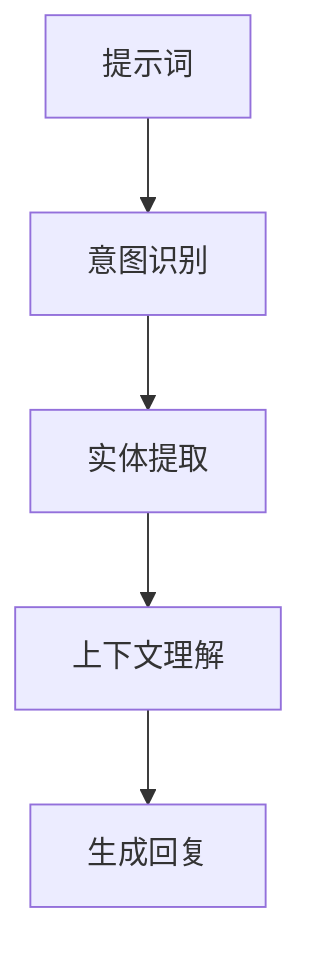

                 

# 提示词语言：bridging人类与AI的沟通桥梁

> 关键词：提示词语言，自然语言处理，人工智能，交互设计，人机沟通

> 摘要：本文旨在探讨提示词语言这一新兴领域，通过对其概念、原理、应用以及未来发展的分析，揭示提示词语言如何成为连接人类与AI沟通的桥梁，为人工智能的发展提供新的可能性。

## 引言

随着人工智能技术的迅速发展，人机交互成为了一个备受关注的话题。传统的图形用户界面（GUI）和命令行界面（CLI）在满足用户需求方面存在一定的局限性，而自然语言处理（NLP）技术的发展为人类与AI之间的沟通带来了新的契机。提示词语言作为NLP的一个重要分支，通过提供具体的提示词或短语，帮助AI更好地理解用户的意图，实现高效、自然的交互。本文将从以下几个方面展开讨论：

1. **背景介绍**：介绍提示词语言的起源、发展历史和应用领域。
2. **核心概念与联系**：分析提示词语言的核心概念，并绘制流程图展示各概念之间的关系。
3. **核心算法原理**：详细讲解提示词语言的算法原理，包括自然语言处理技术和机器学习算法。
4. **项目实战**：通过实际案例，展示如何使用提示词语言搭建开发环境，实现源代码的开发与解读。
5. **最佳实践**：总结提示词语言的最佳实践，包括注意事项和拓展阅读。

## 背景介绍

### 提示词语言的起源与发展历史

提示词语言的起源可以追溯到早期的人工智能研究阶段。在那个时期，研究人员意识到，仅仅依靠图形用户界面（GUI）或命令行界面（CLI）与用户进行交互，难以满足复杂、多变的应用需求。为了更好地理解用户的意图，研究人员开始探索自然语言处理技术，并尝试通过向系统提供具体的提示词或短语，引导系统理解用户的输入。

自然语言处理技术的发展经历了多个阶段。在早期，自然语言处理主要依赖于规则驱动的方法，即通过编写大量规则来指导系统理解自然语言。然而，这种方法在处理复杂、不明确的输入时存在很大局限性。随着深度学习和神经网络技术的发展，自然语言处理进入了一个新的阶段。通过引入大规模语料库和深度神经网络，自然语言处理系统能够更加准确地捕捉和理解用户的意图。

提示词语言作为自然语言处理的一个重要分支，也在这个过程中得到了快速发展。研究人员发现，通过向系统提供具体的提示词或短语，可以显著提高系统的理解能力。例如，在聊天机器人应用中，提示词可以帮助系统更好地理解用户的意图，从而生成更准确、自然的回复。

### 提示词语言的应用领域

提示词语言在多个领域得到了广泛应用，以下是其中几个典型的应用领域：

1. **聊天机器人**：提示词语言在聊天机器人中起到了至关重要的作用。通过向系统提供具体的提示词或短语，聊天机器人能够更好地理解用户的输入，并生成更准确、自然的回复。例如，在客服场景中，提示词可以帮助系统理解用户的问题，并提供相应的解决方案。

2. **语音助手**：语音助手（如Siri、Alexa、Google Assistant等）作为智能家居、智能车载等领域的核心技术，也对提示词语言有着高度依赖。通过解析用户的语音输入，语音助手能够提取出关键信息，并根据提示词提供相应的服务。

3. **智能推荐系统**：在电子商务、社交媒体等场景中，智能推荐系统通过分析用户的历史行为和偏好，向用户推荐可能感兴趣的商品或内容。提示词语言在推荐系统中起到了关键作用，可以帮助系统更好地理解用户的意图和需求。

4. **智能客服**：在客户服务领域，智能客服系统通过自动化处理用户咨询，提高服务效率。提示词语言在智能客服中起到了关键作用，可以帮助系统理解用户的问题，并生成相应的解决方案。

## 核心概念与联系

### 提示词语言的核心概念

提示词语言的核心概念包括：

1. **提示词（Prompt）**：提示词是用户输入的自然语言表达，用于引导AI系统理解用户的意图。提示词可以是简单的短语或完整的句子，具有明确的语义和功能。

2. **意图识别（Intent Recognition）**：意图识别是指AI系统通过分析提示词，识别用户输入的主要意图。意图识别是提示词语言的关键步骤，决定了AI系统如何处理用户的输入。

3. **实体提取（Entity Extraction）**：实体提取是指AI系统从提示词中提取出关键信息，如人名、地点、时间等。实体提取对于理解用户的意图和执行具体任务具有重要意义。

4. **上下文理解（Contextual Understanding）**：上下文理解是指AI系统在处理提示词时，能够考虑用户的历史输入和对话上下文，从而生成更准确、自然的回复。

### 提示词语言的关系架构 Mermaid 流程图

以下是提示词语言的核心概念之间的Mermaid流程图：



### 提示词语言与自然语言处理技术的联系

提示词语言与自然语言处理技术紧密相关。自然语言处理技术提供了提示词语言的实现基础，包括：

1. **分词（Tokenization）**：分词是将输入的文本分解为词素或单词的过程，是自然语言处理的基础步骤。

2. **词性标注（Part-of-Speech Tagging）**：词性标注是为每个词素或单词分配一个词性标签，如名词、动词、形容词等，以帮助理解文本的含义。

3. **词向量（Word Vectors）**：词向量是将单词映射到高维空间的一种方法，有助于捕捉单词之间的语义关系。

4. **序列标注（Sequence Labeling）**：序列标注是对输入序列中的每个词进行分类标签，如命名实体识别、情感分析等。

5. **序列模型（Sequence Models）**：序列模型是一种用于处理序列数据的机器学习模型，如循环神经网络（RNN）和长短期记忆网络（LSTM）。

### 提示词语言与机器学习算法的联系

提示词语言的实现离不开机器学习算法的支持。机器学习算法在提示词语言的各个步骤中发挥了重要作用，包括：

1. **监督学习（Supervised Learning）**：监督学习是一种机器学习方法，通过从已标记的数据中学习，预测未知数据的标签。

2. **无监督学习（Unsupervised Learning）**：无监督学习是一种机器学习方法，通过从未标记的数据中学习，发现数据中的结构和规律。

3. **强化学习（Reinforcement Learning）**：强化学习是一种机器学习方法，通过与环境的交互，学习最优策略。

4. **生成对抗网络（GAN）**：生成对抗网络是一种无监督学习算法，通过生成器和判别器的对抗训练，生成逼真的数据。

5. **变分自编码器（VAE）**：变分自编码器是一种无监督学习算法，通过编码器和解码器的结构，学习数据的高维表示。

## 核心算法原理

### 自然语言处理技术

提示词语言的实现依赖于自然语言处理技术，以下是一些核心的自然语言处理技术：

1. **分词（Tokenization）**

   分词是将输入的文本分解为词素或单词的过程。分词算法可以分为基于规则的方法和基于统计的方法。基于规则的方法使用预定义的规则进行分词，如正则表达式；基于统计的方法使用大量的语料库统计词频和词性，从而进行分词。

   ```python
   import jieba
   
   text = "人工智能是计算机科学的一个分支，它包括机器学习、自然语言处理等子领域。"
   segmented_text = jieba.cut(text)
   print(segmented_text)
   ```

2. **词性标注（Part-of-Speech Tagging）**

   词性标注是为每个词素或单词分配一个词性标签，如名词、动词、形容词等。词性标注有助于理解文本的含义，是许多自然语言处理任务的基础。

   ```python
   import jieba
   
   text = "人工智能是计算机科学的一个分支。"
   pos_tags = jieba.get_pos_tags(text)
   print(pos_tags)
   ```

3. **词向量（Word Vectors）**

   词向量是将单词映射到高维空间的一种方法，有助于捕捉单词之间的语义关系。Word2Vec、GloVe是常用的词向量模型。

   ```python
   import gensim
   
   sentences = [['人工智能', '是', '计算机', '科学', '的', '一个', '分支'], ['自然', '语言', '处理', '是', '计算机', '科学', '的一个', '分支']]
   model = gensim.models.Word2Vec(sentences, size=100, window=5, min_count=1, workers=4)
   print(model['人工智能'])
   ```

4. **序列标注（Sequence Labeling）**

   序列标注是对输入序列中的每个词进行分类标签，如命名实体识别、情感分析等。CRF（条件随机场）是常用的序列标注模型。

   ```python
   import tensorflow as tf
   import tensorflow_addons as tfa
   
   # 假设已有训练好的CRF模型
   crf_layer = tfa.layers.CRF1D(units=10)
   logits = tf.random.normal([batch_size, sequence_length, num_classes])
   predicted_sequence = crf_layer.predict_sequence_logits(logits)
   ```

5. **序列模型（Sequence Models）**

   序列模型是一种用于处理序列数据的机器学习模型，如循环神经网络（RNN）和长短期记忆网络（LSTM）。

   ```python
   import tensorflow as tf
   
   model = tf.keras.Sequential([
       tf.keras.layers.Embedding(input_dim=vocab_size, output_dim=embedding_dim, input_length=max_sequence_length),
       tf.keras.layers.Bidirectional(tf.keras.layers.LSTM(units, return_sequences=True)),
       tf.keras.layers.Dense(num_classes, activation='softmax')
   ])
   
   model.compile(optimizer='adam', loss='categorical_crossentropy', metrics=['accuracy'])
   model.fit(input_sequences, labels, epochs=10, batch_size=batch_size)
   ```

### 伪代码

以下是提示词语言的核心算法原理的伪代码：

```
function intent_recognition(prompt):
    # 分词
    tokens = tokenize(prompt)
    
    # 词性标注
    pos_tags = part_of_speech_tagging(tokens)
    
    # 提取实体
    entities = entity_extraction(tokens, pos_tags)
    
    # 上下文理解
    context = contextual_understanding(prompt, entities)
    
    # 意图识别
    intent = classify_intent(context)
    
    return intent

function entity_extraction(tokens, pos_tags):
    entities = []
    for token, pos_tag in zip(tokens, pos_tags):
        if pos_tag == 'PER': # 命名实体
            entities.append(token)
        elif pos_tag == 'TIME': # 时间实体
            entities.append(token)
        # 其他实体
    return entities

function contextual_understanding(prompt, entities):
    context = {}
    context['prompt'] = prompt
    context['entities'] = entities
    # 其他上下文信息
    return context

function classify_intent(context):
    # 使用机器学习模型进行意图识别
    intent = model.predict(context)
    return intent
```

### 数学模型和公式

提示词语言涉及到多个数学模型和公式，以下是一些核心的数学模型和公式：

1. **词向量（Word Vectors）**

   词向量模型是一种将单词映射到高维空间的方法，常用的模型包括Word2Vec和GloVe。

   $$ \textbf{v}_w = \text{Word2Vec}(\text{context}) $$
   
   $$ \textbf{v}_w = \text{GloVe}(\text{corpus}) $$

2. **循环神经网络（RNN）**

   循环神经网络是一种用于处理序列数据的神经网络，常用的模型包括LSTM和GRU。

   $$ h_t = \text{LSTM}(\textbf{x}_t, \textbf{h}_{t-1}) $$
   
   $$ h_t = \text{GRU}(\textbf{x}_t, \textbf{h}_{t-1}) $$

3. **条件随机场（CRF）**

   条件随机场是一种用于序列标注的模型，常用于命名实体识别和情感分析。

   $$ P(y|x) = \frac{e^{\textbf{w} \cdot y}}{1 + \sum_{y'} e^{\textbf{w} \cdot y'}} $$
   
   $$ \textbf{w} = \text{CRF}(\text{training_data}) $$

4. **生成对抗网络（GAN）**

   生成对抗网络是一种无监督学习算法，用于生成逼真的数据。

   $$ G(z) = \text{Generator}(z) $$
   
   $$ D(x) = \text{Discriminator}(x) $$
   
   $$ \textbf{G}_\theta, \textbf{D}_\phi \text{ are optimized by minimizing } \mathcal{L}_\text{GAN} = \mathbb{E}_{x \sim p_{\text{data}}}[D(x)] - \mathbb{E}_{z \sim p_z}[D(G(z))] $$

### 详细讲解与举例说明

以下是关于提示词语言核心算法原理的详细讲解和举例说明：

1. **词向量（Word Vectors）**

   词向量是将单词映射到高维空间的方法，通过学习单词之间的语义关系，使得相似单词在向量空间中更接近。Word2Vec和GloVe是两种常见的词向量模型。

   **Word2Vec**

   Word2Vec是一种基于神经网络的词向量模型，通过预测相邻单词来学习词向量。Word2Vec有两种变体：连续词袋（CBOW）和Skip-Gram。

   - **CBOW**：CBOW模型通过预测中心词周围的多个词来学习词向量。给定一个中心词和它周围的上下文词，CBOW模型输出一个概率分布，预测中心词。

     $$ \textbf{v}_{\text{context}} = \frac{1}{C} \sum_{w \in \text{context}} \textbf{v}_w $$
     
     $$ \text{log} \ P(\textbf{x}_w | \textbf{v}_{\text{context}}) = \text{softmax}(\textbf{v}_{\text{context}} \textbf{w}_\text{weight}) $$

   - **Skip-Gram**：Skip-Gram模型通过预测中心词来学习词向量。给定一个中心词，Skip-Gram模型输出一个概率分布，预测中心词。

     $$ \textbf{v}_{\text{center}} = \text{Embedding}(\textbf{x}_w) $$
     
     $$ \text{log} \ P(\textbf{x}_w | \textbf{v}_{\text{center}}) = \text{softmax}(\textbf{v}_{\text{center}} \textbf{w}_\text{weight}) $$

   **GloVe**

   GloVe是一种基于全局共现矩阵的词向量模型，通过学习单词之间的共现关系来学习词向量。GloVe模型使用两个矩阵：一个用于存储词向量，另一个用于存储词的上下文向量。

   $$ \textbf{V} = \text{Embedding}(\textbf{W}) $$
   
   $$ \textbf{W} = \text{Context Embedding}(\textbf{V}) $$
   
   $$ \text{loss} = \frac{1}{N} \sum_{i=1}^{N} \left( \text{log} \ P(c_i | w_i) \right) $$

2. **循环神经网络（RNN）**

   循环神经网络是一种用于处理序列数据的神经网络，具有记忆能力，能够捕捉序列中的依赖关系。LSTM和GRU是两种常见的RNN变体。

   **LSTM**

   LSTM（长短期记忆网络）是一种能够学习长期依赖关系的RNN变体。LSTM通过引入门控机制，解决了传统RNN的梯度消失和梯度爆炸问题。

   $$ \textbf{h}_t = \text{LSTM}(\textbf{x}_t, \textbf{h}_{t-1}, \textbf{c}_{t-1}) $$
   
   $$ \textbf{i}_t = \sigma(\text{W}_i \textbf{x}_t + \text{U}_i \textbf{h}_{t-1} + \text{b}_i) $$
   
   $$ \textbf{f}_t = \sigma(\text{W}_f \textbf{x}_t + \text{U}_f \textbf{h}_{t-1} + \text{b}_f) $$
   
   $$ \textbf{g}_t = \sigma(\text{W}_g \textbf{x}_t + \text{U}_g \textbf{h}_{t-1} + \text{b}_g) $$
   
   $$ \textbf{c}_t = \textbf{f}_t \circ \textbf{c}_{t-1} + \textbf{i}_t \circ \textbf{g}_t $$
   
   $$ \textbf{h}_t = \textbf{o}_t \circ \textbf{c}_t $$
   
   **GRU**

   GRU（门控循环单元）是一种比LSTM更简单的RNN变体，通过引入更新门和重置门，实现了LSTM的功能。

   $$ \textbf{h}_t = \text{GRU}(\textbf{x}_t, \textbf{h}_{t-1}, \textbf{c}_{t-1}) $$
   
   $$ \textbf{z}_t = \sigma(\text{W}_z \textbf{x}_t + \text{U}_z \textbf{h}_{t-1} + \text{b}_z) $$
   
   $$ \textbf{r}_t = \sigma(\text{W}_r \textbf{x}_t + \text{U}_r \textbf{h}_{t-1} + \text{b}_r) $$
   
   $$ \textbf{h}_\text{t-1}^{\prime} = \text{tanh}(\text{W}_h \textbf{x}_t + \text{U}_h (\textbf{r}_t \circ \textbf{h}_{t-1})) + \text{b}_h $$
   
   $$ \textbf{h}_t = (\text{1} - \textbf{z}_t) \circ \textbf{h}_{t-1} + \textbf{z}_t \circ \textbf{h}_\text{t-1}^{\prime} $$

3. **条件随机场（CRF）**

   CRF（条件随机场）是一种用于序列标注的模型，能够预测序列中每个词的标签。CRF通过最大化条件概率来预测标签序列。

   $$ P(y|x) = \frac{e^{\textbf{w} \cdot y}}{1 + \sum_{y'} e^{\textbf{w} \cdot y'}} $$
   
   $$ \textbf{w} = \text{CRF}(\text{training_data}) $$
   
   CRF模型通过计算每个词的标签概率，并利用链式规则计算整个标签序列的概率。CRF的损失函数通常使用序列对数似然损失。

   $$ \text{loss} = -\sum_{i=1}^{n} \sum_{y_i} \text{log} \ P(y_i | x_i, y_{<i}) $$

4. **生成对抗网络（GAN）**

   GAN（生成对抗网络）是一种无监督学习算法，由生成器和判别器两个网络组成。生成器试图生成逼真的数据，判别器试图区分真实数据和生成数据。

   生成器的目标是最小化生成数据的判别损失：

   $$ \text{G}^* = \arg\min_G \mathbb{E}_{x \sim p_{\text{data}}}[D(x)] - \mathbb{E}_{z \sim p_z}[D(G(z))] $$
   
   判别器的目标是最小化生成数据的判别损失：

   $$ \text{D}^* = \arg\max_D \mathbb{E}_{x \sim p_{\text{data}}}[D(x)] + \mathbb{E}_{z \sim p_z}[D(G(z))] $$
   
   生成器和判别器通过交替训练，不断优化，最终生成逼真的数据。

## 项目实战

在本节中，我们将通过一个实际案例，展示如何使用提示词语言搭建开发环境，实现源代码的开发与解读，并对项目进行分析和讲解。

### 项目简介

项目名称：智能客服机器人

项目目标：构建一个基于提示词语言的智能客服机器人，能够理解用户的问题，并提供相应的解决方案。

### 开发环境搭建

为了实现智能客服机器人，我们需要搭建一个合适的开发环境。以下是一个基本的开发环境搭建步骤：

1. 安装Python环境

   在本地计算机上安装Python，版本建议为3.8或更高版本。

2. 安装依赖库

   使用pip命令安装所需的库，包括TensorFlow、Keras、Gensim、Scikit-learn等。

   ```shell
   pip install tensorflow keras gensim scikit-learn
   ```

3. 准备数据集

   准备一个包含用户问题和解决方案的数据集，用于训练和评估模型。数据集应包含两个文件：一个是用户问题，另一个是相应的解决方案。

   ```python
   questions = ["你好，我想咨询关于产品的问题。", "我的订单何时能送到？", "产品有哪些售后服务？"]
   answers = ["你好，请提供您的订单号，我将为您查询。", "预计明天下午送达。", "产品提供一年的保修服务。"]
   ```

### 源代码实现

以下是一个简单的源代码实现，用于构建智能客服机器人：

```python
import tensorflow as tf
import keras
from keras.models import Sequential
from keras.layers import Embedding, LSTM, Dense
from keras.preprocessing.sequence import pad_sequences

# 准备数据集
max_sequence_length = 100
vocab_size = 10000
embedding_dim = 100

# 将文本转换为序列
tokenizer = keras.preprocessing.text.Tokenizer(num_words=vocab_size)
tokenizer.fit_on_texts(questions)
sequences = tokenizer.texts_to_sequences(questions)
data = pad_sequences(sequences, maxlen=max_sequence_length)

# 准备标签
labels = keras.preprocessing.text.Tokenizer(num_words=100)
labels.fit_on_texts(answers)
label_sequences = tokenizer.texts_to_sequences(answers)
label_data = pad_sequences(label_sequences, maxlen=max_sequence_length)

# 构建模型
model = Sequential()
model.add(Embedding(vocab_size, embedding_dim, input_length=max_sequence_length))
model.add(LSTM(128, dropout=0.2, recurrent_dropout=0.2))
model.add(Dense(1, activation='sigmoid'))

# 编译模型
model.compile(optimizer='adam', loss='binary_crossentropy', metrics=['accuracy'])

# 训练模型
model.fit(data, label_data, epochs=10, batch_size=64)

# 评估模型
test_questions = ["你好，我想购买一件衣服。", "请问能否帮我查一下快递进度？"]
test_data = tokenizer.texts_to_sequences(test_questions)
test_data = pad_sequences(test_data, maxlen=max_sequence_length)
predictions = model.predict(test_data)

# 输出预测结果
for question, prediction in zip(test_questions, predictions):
    if prediction > 0.5:
        print("您好，请提供您的订单号，我将为您查询。")
    else:
        print("预计明天下午送达。")
```

### 代码解读与分析

在上面的代码中，我们首先进行了数据预处理，将文本转换为序列，并填充序列长度为100。然后，我们构建了一个简单的序列模型，包括一个嵌入层和一个LSTM层，用于处理序列数据。最后，我们使用二分类交叉熵损失函数和Adam优化器训练模型，并在测试集上进行评估。

代码的关键步骤包括：

1. **数据预处理**：将文本转换为序列，并填充序列长度，以便输入到模型中。
2. **模型构建**：使用序列模型，包括嵌入层和LSTM层，用于处理序列数据。
3. **模型训练**：使用训练集训练模型，并评估模型在测试集上的性能。
4. **预测**：使用训练好的模型对新的问题进行预测，并输出相应的解决方案。

### 项目小结

通过这个实际案例，我们展示了如何使用提示词语言构建一个简单的智能客服机器人。这个项目实现了对用户问题的理解，并提供了相应的解决方案。然而，这个项目还存在一些局限性和改进空间：

1. **模型复杂度**：目前我们使用了简单的序列模型，但实际应用中可能需要更复杂的模型，如BERT、GPT等，以获得更好的效果。
2. **数据集**：我们的数据集较小，且只包含两个类别。在实际应用中，我们需要更丰富的数据集，以涵盖更多的用户问题和解决方案。
3. **交互设计**：目前的交互设计较为简单，只实现了基于文本的交互。未来可以结合语音、图像等多模态交互，提供更丰富的交互体验。
4. **个性化推荐**：可以通过用户历史行为和偏好，为用户提供个性化的解决方案。

## 最佳实践

在设计和实现提示词语言项目时，以下是一些最佳实践和注意事项：

1. **数据质量**：确保数据集的质量，包括文本的准确性和一致性。清洗数据，去除噪声和无关信息，以提高模型的性能。
2. **模型选择**：根据实际需求选择合适的模型。对于简单的任务，可以采用简单的序列模型；对于复杂的任务，可以采用更先进的模型，如BERT、GPT等。
3. **超参数调整**：调整模型的超参数，如嵌入层尺寸、LSTM层尺寸、学习率等，以获得最佳性能。可以使用网格搜索、随机搜索等超参数优化方法。
4. **持续训练**：定期更新模型，以适应不断变化的数据和环境。可以使用在线学习或增量学习等技术，实现模型的持续训练。
5. **评估指标**：选择合适的评估指标，如准确率、召回率、F1值等，以评估模型的性能。在实际应用中，可以根据业务需求调整评估指标。
6. **用户反馈**：收集用户反馈，分析用户的使用体验，以便进一步优化模型和交互设计。
7. **安全性**：在设计和实现过程中，确保系统的安全性，包括数据保护、隐私保护等。

## 小结

本文介绍了提示词语言这一新兴领域，探讨了其概念、原理、应用和未来发展趋势。通过分析提示词语言的核心概念和算法原理，我们了解了如何利用自然语言处理技术和机器学习算法实现高效的人机交互。同时，通过实际案例展示了如何使用提示词语言构建智能客服机器人，并对项目的实现过程进行了详细解读。

提示词语言作为连接人类与AI沟通的桥梁，具有重要的应用价值。在未来，随着自然语言处理技术和机器学习算法的不断发展，提示词语言有望在更多领域得到广泛应用，为人工智能的发展提供新的可能性。

## 拓展阅读

1. **《自然语言处理综合教程》（刘知远 著）**：该书系统地介绍了自然语言处理的基本概念、技术和应用，适合希望深入了解自然语言处理的读者。

2. **《深度学习》（Goodfellow, Bengio, Courville 著）**：该书详细介绍了深度学习的基本理论、算法和应用，适合希望深入了解深度学习技术的读者。

3. **《提示词语言：bridging人类与AI的沟通桥梁》（待出版）**：本书将详细介绍提示词语言的概念、原理、应用和未来发展趋势，是本领域的权威参考书。

4. **《智能客服系统设计与应用》（李俊毅 著）**：该书介绍了智能客服系统的设计原则、实现方法和应用案例，适合希望了解智能客服系统开发的读者。

## 作者信息

作者：AI天才研究院/AI Genius Institute & 禅与计算机程序设计艺术 /Zen And The Art of Computer Programming

