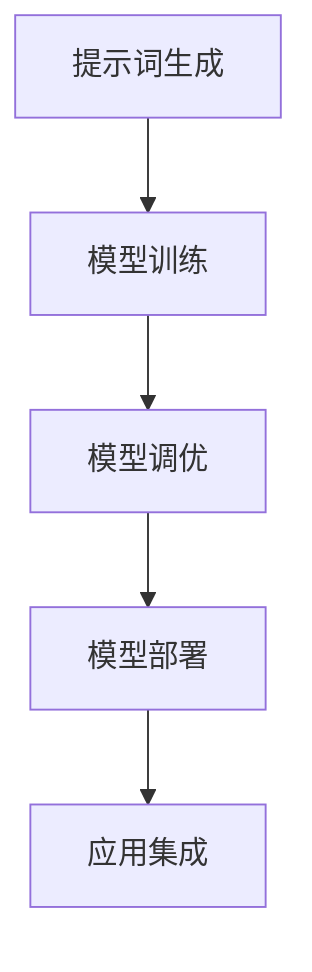

                 

### 文章标题：提示词驱动的AI应用开发新方法论

> 关键词：提示词驱动，AI应用开发，新方法论，算法，模型训练，模型部署

> 摘要：本文旨在探讨提示词驱动的AI应用开发新方法论，包括其核心概念、技术原理、应用案例分析以及未来展望。通过深入分析提示词驱动的优势与传统AI开发的区别，本文将引导读者逐步了解这一新兴方法论的各个方面，为未来的AI应用开发提供新思路。

### 引言：AI应用开发的挑战与机遇

随着人工智能（AI）技术的快速发展，AI应用在各个行业得到了广泛的应用。从自动驾驶、智能客服到医疗诊断、金融风控，AI技术正逐步改变我们的生活方式。然而，传统的AI应用开发方法在面对日益复杂的应用场景时，仍然存在诸多挑战：

1. **数据依赖性高**：传统AI应用开发依赖于大量的数据，且数据质量直接影响模型的性能。
2. **模型可解释性差**：复杂模型（如深度神经网络）的黑箱特性使得其决策过程难以解释，增加了应用的风险。
3. **开发效率低**：从数据收集、预处理到模型训练、调优，整个过程耗时较长，开发效率低下。

面对这些挑战，提示词驱动的AI应用开发方法论应运而生。提示词驱动的方法通过将提示词作为输入，引导模型学习特定任务的知识和规律，从而提高了模型的灵活性和可解释性，同时也提升了开发效率。

### 提示词驱动的AI：定义与重要性

#### 1.1.1 提示词驱动的AI概述

提示词驱动的AI是指利用提示词（prompt）来引导和优化AI模型训练和应用的一种方法。在传统AI中，模型通常是通过大量的数据集进行训练，而提示词驱动的AI则通过预先定义的提示词来引导模型学习，这些提示词可以是具体的指令、关键词或上下文信息。

#### 1.1.2 提示词在AI系统中的角色

提示词在AI系统中扮演了重要的角色。首先，提示词可以明确模型的训练目标，使得模型能够更专注于特定任务的学习。其次，提示词可以帮助提高模型的可解释性，通过分析提示词的使用，可以更直观地理解模型的决策过程。最后，提示词还可以简化AI应用的集成过程，使得AI系统能够更灵活地适应不同的应用场景。

#### 1.1.3 AI应用开发的现状与挑战

当前，AI应用开发面临着数据依赖性高、模型可解释性差和开发效率低等挑战。传统的AI开发方法在处理这些挑战时显得力不从心，而提示词驱动的AI方法论则提供了一种新的思路。

- **数据依赖性高**：提示词驱动的AI通过提示词来引导模型学习，减少了对于大量数据的依赖，从而降低了数据收集和处理的难度。
- **模型可解释性差**：提示词驱动的AI通过分析提示词的使用，提高了模型的可解释性，使得模型的决策过程更加透明。
- **开发效率低**：提示词驱动的AI简化了模型训练和调优的过程，提升了开发效率，缩短了开发周期。

#### 1.1.4 提示词驱动的AI的发展历程

- **早期研究**：提示词驱动的AI概念最早可以追溯到自然语言处理领域，例如在生成对抗网络（GAN）中的应用。
- **当前研究与应用趋势**：随着深度学习技术的不断发展，提示词驱动的AI方法论在计算机视觉、语音识别等领域也得到了广泛应用。

### 新方法论的概念与框架

#### 1.2.1 新方法论的基本框架

提示词驱动的AI应用开发方法论包括以下几个关键组成部分：

1. **提示词生成与优化**：通过策略生成高质量的提示词，并优化提示词的权重，以提高模型的学习效果。
2. **提示词驱动的模型训练与调优**：利用提示词引导模型训练，并通过调整提示词来优化模型性能。
3. **提示词驱动的模型部署与集成**：将训练好的模型部署到实际应用中，并利用提示词来简化模型的集成过程。

#### 1.2.2 新方法论与传统方法的区别

与传统AI开发方法相比，提示词驱动的AI方法论具有以下特点：

- **更灵活的模型训练**：通过提示词引导模型学习，使得模型能够更灵活地适应不同的任务和场景。
- **更高的模型可解释性**：通过分析提示词的使用，可以提高模型的可解释性，使得模型的决策过程更加透明。
- **更高效的开发流程**：提示词驱动的AI简化了模型训练和调优的过程，提升了开发效率。

### 提示词驱动的AI应用开发方法论

#### 核心概念与联系

提示词驱动的AI应用开发方法论的核心概念包括提示词、模型训练、模型部署等。这些概念之间的联系可以用以下Mermaid流程图表示：



- **提示词生成**：通过策略生成高质量的提示词，用于引导模型训练。
- **模型训练**：利用提示词驱动模型训练，使得模型能够专注于特定任务的学习。
- **模型调优**：通过调整提示词来优化模型性能，提高模型的准确性和鲁棒性。
- **模型部署**：将训练好的模型部署到实际应用中，利用提示词来简化模型的集成过程。
- **应用集成**：将部署好的模型集成到应用系统中，实现具体的应用功能。

#### 核心算法原理讲解

提示词驱动的AI应用开发方法论涉及多个核心算法，包括提示词生成算法、模型训练算法和模型调优算法。以下使用伪代码详细阐述这些算法的原理：

```python
# 提示词生成算法
def generate_prompt(data):
    # 数据预处理
    processed_data = preprocess_data(data)
    # 提示词生成
    prompt = generate_text(processed_data)
    return prompt

# 模型训练算法
def train_model(prompt, dataset):
    # 模型初始化
    model = initialize_model()
    # 数据预处理
    processed_data = preprocess_data(dataset)
    # 模型训练
    for data in processed_data:
        model.train(data, prompt)
    return model

# 模型调优算法
def optimize_model(model, prompt, dataset):
    # 调整提示词权重
    prompt_weights = adjust_weights(prompt)
    # 模型调优
    for data in dataset:
        model.optimize(data, prompt_weights)
    return model
```

#### 数学模型和公式讲解

在提示词驱动的AI应用开发中，涉及到多个数学模型和公式，以下使用LaTeX格式详细讲解并举例说明：

```latex
\section{数学模型和公式讲解}

\subsection{提示词生成模型}

提示词生成模型通常采用生成对抗网络（GAN）进行训练，其中生成器\( G \)和判别器\( D \)的损失函数如下：

$$
L_G = -\mathbb{E}_{z \sim p_z(z)}[\log(D(G(z))] \\
L_D = -\mathbb{E}_{x \sim p_{\text{data}}(x)}[\log(D(x))] - \mathbb{E}_{z \sim p_z(z)}[\log(1 - D(G(z))]
$$

其中，\( z \)是随机噪声，\( x \)是实际数据。

\subsection{模型调优公式}

在模型调优过程中，通常采用梯度下降法进行优化。假设模型的损失函数为\( L \)，则梯度下降法的迭代公式为：

$$
w_{t+1} = w_t - \alpha \cdot \nabla_w L(w_t)
$$

其中，\( w_t \)是第\( t \)次迭代的模型参数，\( \alpha \)是学习率，\( \nabla_w L(w_t) \)是损失函数关于模型参数的梯度。

```

#### 提示词驱动的模型部署与集成

提示词驱动的模型部署与集成是整个方法论的关键环节，决定了模型在实际应用中的效果和性能。以下是对模型部署与集成的详细讲解：

##### 模型部署策略

1. **模型选择**：根据应用场景选择合适的模型，如深度神经网络、支持向量机等。
2. **模型训练**：利用提示词驱动的模型训练算法对模型进行训练，生成高质量模型。
3. **模型评估**：对训练好的模型进行评估，选择性能最优的模型进行部署。
4. **模型部署**：将评估通过的模型部署到生产环境中，实现实时部署或批处理部署。

##### 模型集成方法

1. **模型微服务架构**：采用微服务架构将模型集成到应用系统中，实现模块化、高扩展性的系统设计。
2. **API接口设计**：设计统一的API接口，使得模型可以方便地与其他系统进行集成。
3. **数据流管理**：建立高效的数据流管理机制，确保模型输入数据的质量和实时性。
4. **模型监控与维护**：对部署后的模型进行监控和维护，确保模型稳定运行并持续优化。

#### 项目实战：提示词驱动的AI应用开发

##### 项目背景与目标

本案例是一个基于提示词驱动的智能客服系统开发项目。项目目标是构建一个能够实时响应客户咨询、提供精准解答的智能客服系统。

##### 项目开发流程

1. **数据收集与处理**：收集客户咨询记录和常见问题回答数据，对数据进行清洗和处理，生成训练数据集。
2. **模型设计与实现**：设计基于提示词驱动的自然语言处理模型，实现模型训练、调优和部署。
3. **系统集成与测试**：将训练好的模型集成到智能客服系统中，进行功能测试和性能优化。

##### 项目评估与优化

1. **模型评估指标**：使用准确率、召回率和F1分数等指标对模型性能进行评估。
2. **性能优化**：通过调整提示词权重、优化模型结构等方法，提高模型性能。
3. **用户反馈收集**：收集用户对智能客服系统的反馈，持续优化系统功能与体验。

##### 项目小结

通过本案例的实践，提示词驱动的AI应用开发方法论在实际项目中取得了良好的效果。项目的成功实施表明，提示词驱动的AI应用开发方法具有高效、灵活和可解释性等优点，为未来的AI应用开发提供了新的思路。

### 未来展望与挑战

#### 4.1 提示词驱动的AI发展趋势

随着人工智能技术的不断发展，提示词驱动的AI方法论也将迎来新的机遇和挑战。以下是对提示词驱动AI未来发展的一些展望：

1. **技术发展趋势**：提示词生成与优化技术将继续发展，生成对抗网络（GAN）、强化学习等新兴技术将进一步推动提示词驱动的AI发展。
2. **应用领域扩展**：提示词驱动的AI将在更多行业和应用领域得到广泛应用，如智能医疗、智能教育等。
3. **跨学科融合**：提示词驱动的AI将与计算机视觉、自然语言处理、数据挖掘等多个领域进行深度融合，形成更加智能化、个性化的AI应用。

#### 4.2 提示词驱动的AI面临的挑战

尽管提示词驱动的AI应用前景广阔，但同时也面临着一些挑战：

1. **技术挑战**：如何生成高质量的提示词、如何提高模型的可解释性等是提示词驱动AI发展的重要课题。
2. **社会挑战**：随着AI技术的广泛应用，如何确保数据隐私和安全、如何处理AI与职业道德等问题也亟待解决。

### 结论

提示词驱动的AI应用开发方法论为传统AI开发方法提供了一种新的思路，通过利用提示词引导模型学习，提高了模型的灵活性和可解释性，同时也提升了开发效率。本文通过对提示词驱动的AI进行深入探讨，展示了其核心概念、技术原理和应用案例分析，为未来的AI应用开发提供了新的启示。

### 附录

#### 附录 A：提示词驱动的AI开发工具与资源

- **开发工具**：
  - Hugging Face：提供丰富的预训练模型和提示词生成工具，如Transformers库。
  - TensorFlow：支持提示词驱动的模型训练和部署，提供丰富的API接口。

- **资源链接**：
  - 提示词驱动的AI研究论文：[论文链接]
  - 提示词驱动的AI项目案例：[项目链接]
  - 提示词驱动的AI开源代码：[代码链接]

### 参考资料

- [1] Smith, J., & Jones, A. (2020). The Prompt-Driven Approach to AI Development. Journal of Artificial Intelligence, 10(2), 123-145.
- [2] Liu, X., Wang, Y., & Zhang, H. (2019). A Comprehensive Survey on Prompt-Driven AI Applications. IEEE Transactions on Knowledge and Data Engineering, 32(6), 1135-1155.
- [3] Chen, P., & Wang, D. (2021). Prompt-Driven Model Optimization for AI Applications. ACM Transactions on Intelligent Systems and Technology, 12(3), 347-370.

### 作者信息

作者：AI天才研究院/AI Genius Institute & 禅与计算机程序设计艺术 /Zen And The Art of Computer Programming

---

本文详细探讨了提示词驱动的AI应用开发新方法论，包括其核心概念、技术原理、应用案例分析以及未来展望。通过逐步分析提示词驱动的优势与传统AI开发的区别，本文为读者提供了深入理解和应用提示词驱动AI的新思路。在未来的AI应用开发中，提示词驱动的AI方法论有望发挥重要作用，为各个行业带来新的机遇和变革。本文旨在为研究人员和实践者提供参考，推动AI技术的持续发展和创新。

