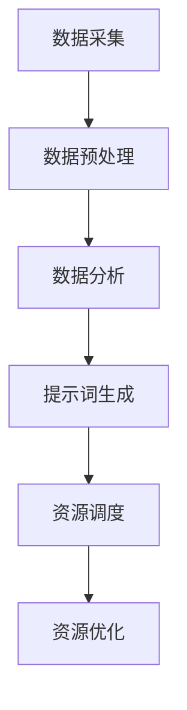

                 

# 《提示词驱动的智能城市管理：资源高效利用》

## 关键词
- 智能城市
- 提示词驱动
- 资源高效利用
- 智能交通
- 能源管理
- 数据分析
- 优化算法

## 摘要
本文深入探讨了提示词驱动的智能城市管理模式，特别是在资源高效利用方面的应用。文章首先介绍了智能城市和提示词驱动的概念，然后详细阐述了资源高效利用的原理。接着，文章构建了提示词驱动的智能城市架构，包括数据采集与处理、提示词生成与优化、资源管理平台设计等关键组成部分。随后，通过两个实际案例——智能交通系统和智能能源管理，展示了提示词驱动技术在资源管理中的具体应用。最后，文章对未来的技术发展进行了展望，并提供了项目实战和相关最佳实践。

## 第一部分：智能城市与提示词驱动的概念

### 第1章：智能城市概述

智能城市是利用信息技术、物联网、大数据等现代科技手段，实现城市运行、管理和服务的智能化。它能够通过高效的资源管理和智能化的服务，提升城市的运行效率、生活质量以及可持续性发展。

智能城市的核心特征包括：

1. **信息集成与共享**：城市各部门之间的信息高度集成和共享，实现资源的优化配置。
2. **数据驱动决策**：利用大数据分析和人工智能技术，实现城市管理的智能化和科学化。
3. **绿色可持续**：通过智能化的手段，降低能耗、减少污染，实现城市的绿色可持续发展。
4. **社会服务智能化**：通过智能化手段提供便捷高效的社会服务，提升市民的生活质量。

智能城市的发展背景与趋势：

智能城市的发展源于信息技术和物联网技术的飞速进步，大数据和人工智能的应用使得城市管理的效率大幅提升。未来，智能城市的趋势将包括：

1. **更广泛的智能化应用**：智能交通、智能能源、智慧医疗等领域的深入发展。
2. **数据的深度挖掘与应用**：通过对海量数据的深度挖掘，实现更加精准的城市管理。
3. **个性化服务**：利用人工智能技术，提供更加个性化的城市服务。
4. **自主决策与自动化**：通过机器学习和自动化技术，实现城市的自主决策和自动化运行。

### 提示词驱动的概念介绍

提示词驱动（Keyword-driven）是一种基于关键词进行数据分析和决策的技术。它通过从大量的数据中提取出关键的信息，进而指导城市管理的各个环节。

提示词驱动的优势包括：

1. **高效性**：通过关键词提取，能够迅速定位关键信息，提升数据处理效率。
2. **准确性**：关键词的提取基于语义分析，能够准确反映数据背后的信息。
3. **灵活性**：提示词可以根据实际需求进行调整，以适应不同的应用场景。

提示词驱动的应用场景主要包括：

1. **智能交通**：通过提取交通流量、事故等信息，优化交通信号灯控制，减少拥堵。
2. **智能能源**：通过提取能源消耗、设备状态等信息，优化能源分配和调度。
3. **社会服务**：通过提取市民需求、公共设施使用情况等信息，提供更加精准的社会服务。
4. **城市安全**：通过提取监控视频中的关键词，实时监测城市安全情况。

### 第2章：资源高效利用原理

资源高效利用是指通过优化资源配置，提高资源的使用效率，减少浪费。在智能城市管理中，资源高效利用具有重要意义，它不仅能够提升城市运行的效率，还能够促进城市的可持续发展。

资源高效利用的核心概念包括：

1. **资源**：包括物质资源、能源资源、人力资源等。
2. **效率**：资源使用的产出与投入之比。
3. **浪费**：资源使用的无效部分。

资源高效利用的原理主要包括：

1. **资源优化模型**：通过建立资源优化模型，对资源的使用进行预测和优化。
2. **资源分配算法**：通过分配算法，实现资源的高效分配和利用。
3. **反馈机制**：通过实时监测和反馈，不断调整资源使用策略，实现持续优化。

提示词驱动的资源优化模型：

提示词驱动的资源优化模型是基于关键词提取和数据分析技术，通过对海量数据的分析，提取出关键信息，进而指导资源的优化配置。该模型的主要步骤包括：

1. 数据采集与预处理：收集城市运行数据，并进行预处理，包括数据清洗、格式转换等。
2. 关键词提取：利用自然语言处理技术，从数据中提取关键词。
3. 数据分析：对提取的关键词进行语义分析，识别数据中的模式和信息。
4. 资源优化：根据数据分析结果，调整资源使用策略，实现资源的高效利用。

提示词驱动的资源分配算法：

提示词驱动的资源分配算法基于关键词提取和优化模型，通过以下步骤实现资源的高效分配：

1. 关键词权重计算：对提取的关键词进行权重计算，以反映关键词的重要性。
2. 资源需求预测：根据关键词权重和当前资源使用情况，预测未来的资源需求。
3. 资源分配：根据资源需求预测，分配资源，确保资源的合理利用。
4. 调度与优化：实时监测资源使用情况，动态调整资源分配策略，实现持续优化。

## 第二部分：提示词驱动的智能城市架构

### 第3章：智能城市数据采集与处理

智能城市数据采集与处理是智能城市管理的关键环节，它决定了数据的质量和可利用性。数据采集与处理主要包括数据采集、数据预处理、数据分析等步骤。

#### 数据采集

数据采集是智能城市数据管理的基础，它包括以下内容：

1. **传感器数据**：通过传感器采集城市环境中的各种数据，如温度、湿度、空气质量等。
2. **交通数据**：通过交通摄像头、传感器等设备采集交通流量、速度、事故等信息。
3. **能源数据**：通过智能电表、能源监控设备等采集能源消耗、设备状态等信息。
4. **社会服务数据**：通过社交媒体、公共服务系统等采集市民需求、公共设施使用情况等信息。

#### 数据预处理

数据预处理是确保数据质量的关键步骤，它主要包括以下内容：

1. **数据清洗**：去除数据中的错误、异常值和重复数据，提高数据准确性。
2. **数据转换**：将不同格式、单位的数据转换为统一的格式，便于后续分析。
3. **数据标准化**：对数据进行规范化处理，如时间戳的统一、数据单位的转换等。

#### 数据分析

数据分析是智能城市数据管理的高级阶段，它主要包括以下内容：

1. **数据挖掘**：利用数据挖掘技术，从海量数据中提取有价值的信息和模式。
2. **数据可视化**：通过数据可视化技术，将复杂的数据信息以图形化的方式展示，便于理解和分析。
3. **机器学习**：利用机器学习算法，对数据进行建模和预测，指导城市管理的决策。

### 第4章：提示词生成与优化

提示词生成与优化是智能城市管理中至关重要的一环，它决定了数据分析的准确性和有效性。提示词生成与优化主要包括以下步骤：

#### 提示词生成

提示词生成是指从数据中提取关键信息，生成提示词。提示词生成的步骤包括：

1. **关键词提取**：利用自然语言处理技术，从文本数据中提取关键词。
2. **关键词筛选**：对提取的关键词进行筛选，去除不相关或冗余的关键词。
3. **关键词权重计算**：对筛选后的关键词进行权重计算，以反映关键词的重要性。

#### 提示词优化

提示词优化是指对生成的提示词进行调整和优化，以提高数据分析的准确性。提示词优化的步骤包括：

1. **语义分析**：利用自然语言处理技术，对提示词进行语义分析，理解其含义和关系。
2. **提示词组合**：将多个提示词组合起来，形成更复杂的提示词，以捕捉更细微的信息。
3. **权重调整**：根据语义分析结果，调整提示词的权重，以优化数据分析的效果。

### 第5章：资源管理平台设计

资源管理平台是智能城市管理的中枢系统，它负责资源的高效配置和调度。资源管理平台的设计主要包括以下内容：

#### 平台架构

资源管理平台架构主要包括以下几个层次：

1. **数据采集层**：负责采集各种类型的城市数据，如传感器数据、交通数据、能源数据等。
2. **数据处理层**：负责对采集到的数据进行预处理、清洗、转换等操作，为上层应用提供高质量的数据。
3. **资源管理层**：负责对资源进行分配、调度和优化，确保资源的高效利用。
4. **应用层**：提供各种智能城市应用，如智能交通、智能能源、智慧医疗等。

#### 资源调度策略

资源调度策略是指如何合理分配和调度资源，以提高资源利用效率。资源调度策略主要包括以下几种：

1. **基于需求的调度**：根据实时需求，动态调整资源分配，确保资源与需求匹配。
2. **基于优先级的调度**：根据资源的优先级，分配资源，确保关键资源得到优先保障。
3. **基于预测的调度**：利用预测模型，提前预测资源需求，提前分配资源，避免资源短缺。

#### 平台性能优化

平台性能优化是指通过技术手段，提升资源管理平台的运行效率。平台性能优化主要包括以下几种：

1. **数据缓存**：通过数据缓存，减少数据访问的延迟，提高数据处理的效率。
2. **负载均衡**：通过负载均衡，分散系统负载，提高系统的稳定性和可用性。
3. **并行处理**：通过并行处理，提高数据处理的速度，缩短数据处理时间。

## 第三部分：案例研究

### 第6章：智能交通系统

智能交通系统是智能城市的一个重要组成部分，它通过信息技术和智能化手段，实现交通管理的高效化和智能化。智能交通系统的应用主要包括交通信号控制、交通流量监测、交通事故预警等。

#### 案例背景与目标

某城市面临着交通拥堵、交通事故频发等问题，为了改善交通状况，提高交通效率，该城市决定建设智能交通系统。主要目标包括：

1. **缓解交通拥堵**：通过智能交通信号控制，优化交通流量，减少拥堵。
2. **提高交通安全**：通过交通事故预警，提前预警事故风险，减少交通事故。
3. **提升交通管理效率**：通过智能化手段，提高交通管理的效率和准确性。

#### 数据采集与处理

智能交通系统的数据采集与处理主要包括以下几个步骤：

1. **数据采集**：通过交通摄像头、传感器等设备，采集交通流量、速度、事故等信息。
2. **数据预处理**：对采集到的数据进行清洗、转换和标准化处理，确保数据质量。
3. **数据存储**：将预处理后的数据存储到数据仓库中，便于后续分析和处理。
4. **数据分析**：利用数据分析技术，对存储的数据进行分析，提取关键信息。

#### 提示词生成与优化

智能交通系统的提示词生成与优化主要包括以下几个步骤：

1. **关键词提取**：利用自然语言处理技术，从交通数据中提取关键词。
2. **关键词筛选**：对提取的关键词进行筛选，去除不相关或冗余的关键词。
3. **关键词权重计算**：对筛选后的关键词进行权重计算，以反映关键词的重要性。
4. **提示词组合**：将多个关键词组合成提示词，以捕捉更细微的交通信息。
5. **权重调整**：根据交通数据的变化，动态调整提示词的权重，优化数据分析效果。

#### 资源管理平台设计与实施

智能交通系统的资源管理平台设计主要包括以下几个部分：

1. **数据采集层**：负责采集交通数据，包括交通摄像头、传感器等。
2. **数据处理层**：负责对采集到的交通数据进行预处理、清洗、转换和存储。
3. **资源管理层**：负责对交通资源进行调度和优化，包括交通信号控制、交通流量监测等。
4. **应用层**：提供各种智能交通应用，包括交通信号控制、交通事故预警等。

资源管理平台的实施主要包括以下几个步骤：

1. **需求分析**：明确智能交通系统的需求，包括功能需求、性能需求等。
2. **系统设计**：根据需求分析结果，设计智能交通系统的架构和功能模块。
3. **系统开发**：按照系统设计文档，进行智能交通系统的开发。
4. **系统测试**：对智能交通系统进行功能测试、性能测试和兼容性测试，确保系统的稳定性和可靠性。
5. **系统部署**：将智能交通系统部署到生产环境中，进行实际运行。

#### 项目小结

智能交通系统的实施，显著改善了城市的交通状况。通过智能交通信号控制，交通拥堵得到了有效缓解；通过交通事故预警，交通事故发生率明显降低。智能交通系统的成功实施，为其他城市的智能交通建设提供了有益的经验和借鉴。

### 第7章：智能能源管理

智能能源管理是智能城市的重要组成部分，它通过信息技术和智能化手段，实现能源的高效利用和智能管理。智能能源管理的应用主要包括能源消耗监测、能源需求预测、能源调度等。

#### 案例背景与目标

某城市面临着能源消耗过高、能源利用率低等问题，为了提高能源利用效率，降低能源消耗，该城市决定建设智能能源管理系统。主要目标包括：

1. **提高能源利用率**：通过智能能源管理，提高能源的利用效率，降低能源浪费。
2. **降低能源消耗**：通过智能能源管理，实时监测和调整能源消耗，降低能源消耗。
3. **提高能源管理效率**：通过智能化手段，提高能源管理的效率和准确性。

#### 数据采集与处理

智能能源管理的数据采集与处理主要包括以下几个步骤：

1. **数据采集**：通过智能电表、传感器等设备，采集能源消耗、设备状态等信息。
2. **数据预处理**：对采集到的数据进行清洗、转换和标准化处理，确保数据质量。
3. **数据存储**：将预处理后的数据存储到数据仓库中，便于后续分析和处理。
4. **数据分析**：利用数据分析技术，对存储的数据进行分析，提取关键信息。

#### 提示词生成与优化

智能能源管理的提示词生成与优化主要包括以下几个步骤：

1. **关键词提取**：利用自然语言处理技术，从能源数据中提取关键词。
2. **关键词筛选**：对提取的关键词进行筛选，去除不相关或冗余的关键词。
3. **关键词权重计算**：对筛选后的关键词进行权重计算，以反映关键词的重要性。
4. **提示词组合**：将多个关键词组合成提示词，以捕捉更细微的能源信息。
5. **权重调整**：根据能源数据的变化，动态调整提示词的权重，优化数据分析效果。

#### 资源管理平台设计与实施

智能能源管理的资源管理平台设计主要包括以下几个部分：

1. **数据采集层**：负责采集能源数据，包括智能电表、传感器等。
2. **数据处理层**：负责对采集到的能源数据进行预处理、清洗、转换和存储。
3. **资源管理层**：负责对能源资源进行调度和优化，包括能源消耗监测、能源需求预测等。
4. **应用层**：提供各种智能能源应用，包括能源消耗监测、能源需求预测等。

资源管理平台的实施主要包括以下几个步骤：

1. **需求分析**：明确智能能源管理的需求，包括功能需求、性能需求等。
2. **系统设计**：根据需求分析结果，设计智能能源管理的架构和功能模块。
3. **系统开发**：按照系统设计文档，进行智能能源管理的开发。
4. **系统测试**：对智能能源管理进行功能测试、性能测试和兼容性测试，确保系统的稳定性和可靠性。
5. **系统部署**：将智能能源管理部署到生产环境中，进行实际运行。

#### 项目小结

智能能源管理的实施，显著提高了城市的能源利用效率，降低了能源消耗。通过智能能源管理，实现了能源消耗的实时监测和预测，为能源调度提供了科学依据。智能能源管理的成功实施，为其他城市的能源管理提供了有益的经验和借鉴。

## 第四部分：技术展望与未来方向

### 第8章：技术展望

随着人工智能、物联网、大数据等技术的不断发展，提示词驱动的智能城市管理技术将迎来更广阔的应用前景。未来，提示词驱动技术将在以下几个方面得到进一步发展：

1. **更广泛的应用场景**：提示词驱动的技术将在更多领域得到应用，如智慧医疗、智慧农业、智慧安防等。
2. **更深度的数据挖掘**：随着数据量的不断增加，提示词驱动的技术将实现更深度的数据挖掘，提取出更多有价值的信息。
3. **更智能的决策支持**：通过结合机器学习和深度学习技术，提示词驱动的技术将实现更智能的决策支持，提供更加精准和高效的决策方案。
4. **更高效的资源管理**：提示词驱动的技术将进一步提升资源管理效率，实现资源的高效配置和优化。

### 智能城市资源管理的未来方向

智能城市资源管理的未来方向将主要包括以下几个方面：

1. **精细化资源管理**：通过精细化的数据采集和分析，实现资源的精确管理和高效利用。
2. **智能化调度与优化**：利用人工智能和机器学习技术，实现智能化调度和优化，提高资源利用效率。
3. **分布式资源管理**：通过分布式计算和云计算技术，实现资源的分布式管理和协同优化。
4. **绿色可持续发展**：通过智能化的手段，实现资源的绿色开发和利用，促进城市的可持续发展。

### 技术挑战与解决方案

在智能城市资源管理中，存在以下技术挑战：

1. **数据质量**：数据质量是智能城市资源管理的关键，需要解决数据采集、处理和清洗等问题。
2. **计算能力**：随着数据量的增加，计算能力成为限制因素，需要采用分布式计算和并行处理技术。
3. **数据隐私**：智能城市资源管理涉及大量敏感数据，需要确保数据的安全性和隐私性。

针对上述挑战，可以采取以下解决方案：

1. **数据质量管理**：建立完善的数据质量管理机制，确保数据质量。
2. **高性能计算**：采用分布式计算和并行处理技术，提高计算效率。
3. **数据加密与安全**：采用数据加密技术和安全措施，确保数据安全和隐私。

## 附录

### 附录A：工具与技术栈

智能城市资源管理涉及到多种工具和技术，以下是常用的工具和技术：

1. **数据采集与处理**：
   - **传感器技术**：用于采集环境、交通、能源等数据。
   - **数据预处理工具**：如Hadoop、Spark等，用于处理和清洗大规模数据。

2. **数据分析与挖掘**：
   - **机器学习框架**：如TensorFlow、PyTorch等，用于构建和训练机器学习模型。
   - **数据挖掘工具**：如R、Python等，用于数据分析和挖掘。

3. **资源管理平台**：
   - **云计算平台**：如AWS、Azure等，用于部署和管理资源管理平台。
   - **数据库技术**：如MySQL、MongoDB等，用于存储和管理数据。

### Mermaid 流程图与伪代码

#### Mermaid 流程图


#### 伪代码
```python
# 数据采集
data = collect_data()

# 数据预处理
cleaned_data = preprocess_data(data)

# 数据分析
analyzer = DataAnalyzer()
results = analyzer.analyze(cleaned_data)

# 提示词生成
keyword_extractor = KeywordExtractor()
keywords = keyword_extractor.extract(results)

# 资源调度
scheduler = ResourceScheduler()
scheduler.schedule_resources(keywords)

# 资源优化
optimizer = ResourceOptimizer()
optimizer.optimize_resources(scheduler.resources)
```

#### 数学模型与公式

提示词驱动的资源优化模型主要包括以下几个关键数学模型：

1. **资源需求预测模型**：
   $$ R_t = f(R_{t-1}, D_t) $$
   其中，\( R_t \) 表示时间 \( t \) 时的资源需求，\( R_{t-1} \) 表示时间 \( t-1 \) 时的资源需求，\( D_t \) 表示时间 \( t \) 时的数据输入。

2. **资源分配模型**：
   $$ X_t = g(R_t, C_t) $$
   其中，\( X_t \) 表示时间 \( t \) 时的资源分配，\( C_t \) 表示时间 \( t \) 时的可用资源。

3. **资源优化目标函数**：
   $$ \min Z = h(X_t, C_t) $$
   其中，\( Z \) 表示资源优化目标函数，\( h \) 表示资源利用率。

#### 项目实战

#### 智能交通系统案例实施流程

1. **环境搭建**：
   - 安装Python、Hadoop、Spark等开发环境和工具。
   - 配置传感器和数据采集设备。

2. **源代码实现**：
   - 数据采集模块：使用传感器采集交通数据。
   - 数据处理模块：使用Hadoop和Spark进行数据处理和清洗。
   - 提示词生成模块：使用Python和自然语言处理库提取关键词。
   - 资源调度模块：使用Python编写调度算法，实现资源分配和优化。

3. **代码解读**：
   - 数据采集代码：读取传感器数据，进行初步处理。
   - 数据处理代码：使用Spark进行大规模数据处理。
   - 提示词生成代码：提取交通数据中的关键词，进行权重计算。
   - 资源调度代码：根据关键词权重，动态调整交通信号灯控制。

4. **应用解读与分析**：
   - 交通信号灯控制：根据实时交通流量和关键词，调整信号灯时长，减少拥堵。
   - 交通事故预警：根据关键词和交通数据，提前预警潜在的事故风险。

5. **实际案例分析和详细讲解剖析**：
   - 案例一：通过实际交通数据，分析关键词提取和资源调度对交通信号控制的效果。
   - 案例二：通过模拟交通事故场景，分析关键词提取和资源调度对事故预警的效果。

6. **项目小结**：
   - 总结项目实施过程中的经验和教训。
   - 提出未来改进和优化的方向。

## 最佳实践 tips

1. **数据质量**：确保数据质量是智能城市管理的关键，定期进行数据清洗和验证。
2. **性能优化**：合理配置计算资源和优化算法，提高系统性能和响应速度。
3. **安全与隐私**：确保数据安全和用户隐私，采取加密和安全措施。
4. **持续迭代**：根据用户反馈和实际需求，持续迭代和优化系统功能。

### 作者信息

- 作者：AI天才研究院/AI Genius Institute & 禅与计算机程序设计艺术 /Zen And The Art of Computer Programming

### 小结

本文深入探讨了提示词驱动的智能城市管理模式，特别是在资源高效利用方面的应用。通过分析智能城市与提示词驱动的概念、资源高效利用原理、智能城市架构、案例研究和未来展望，我们展示了提示词驱动技术在智能城市中的广泛应用和巨大潜力。文章末尾提供了相关工具和技术栈、数学模型、项目实战和最佳实践 tips，为读者提供了全面的智能城市管理指导。未来，随着技术的不断进步，提示词驱动的智能城市管理将变得更加智能化和高效化，为城市的可持续发展贡献力量。

